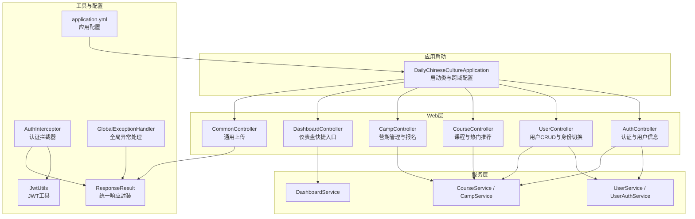
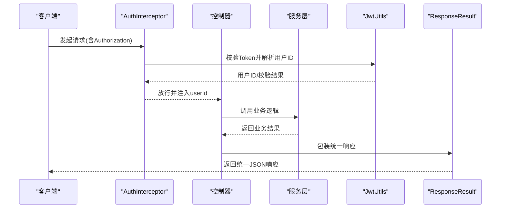
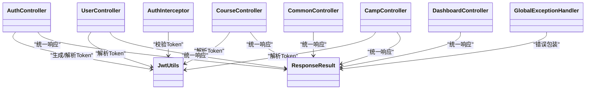

# API接口文档

<cite>
**本文引用的文件**
- [DailyChineseCultureApplication.java](file://src/main/java/com/daily/dailychineseculture/DailyChineseCultureApplication.java)
- [application.yml](file://src/main/resources/application.yml)
- [ResponseResult.java](file://src/main/java/com/daily/dailychineseculture/common/ResponseResult.java)
- [GlobalExceptionHandler.java](file://src/main/java/com/daily/dailychineseculture/common/GlobalExceptionHandler.java)
- [AuthController.java](file://src/main/java/com/daily/dailychineseculture/controller/AuthController.java)
- [UserController.java](file://src/main/java/com/daily/dailychineseculture/controller/UserController.java)
- [CourseController.java](file://src/main/java/com/daily/dailychineseculture/controller/CourseController.java)
- [CampController.java](file://src/main/java/com/daily/dailychineseculture/controller/CampController.java)
- [DashboardController.java](file://src/main/java/com/daily/dailychineseculture/controller/DashboardController.java)
- [CommonController.java](file://src/main/java/com/daily/dailychineseculture/controller/CommonController.java)
- [AuthInterceptor.java](file://src/main/java/com/daily/dailychineseculture/interceptor/AuthInterceptor.java)
- [JwtUtils.java](file://src/main/java/com/daily/dailychineseculture/util/JwtUtils.java)
- [LoginRequest.java](file://src/main/java/com/daily/dailychineseculture/dto/LoginRequest.java)
- [WxLoginRequest.java](file://src/main/java/com/daily/dailychineseculture/dto/WxLoginRequest.java)
- [UserInfoDTO.java](file://src/main/java/com/daily/dailychineseculture/dto/UserInfoDTO.java)
</cite>

## 目录
1. [简介](#简介)
2. [项目结构](#项目结构)
3. [核心组件](#核心组件)
4. [架构总览](#架构总览)
5. [详细接口分析](#详细接口分析)
6. [依赖关系分析](#依赖关系分析)
7. [性能考虑](#性能考虑)
8. [故障排除指南](#故障排除指南)
9. [结论](#结论)
10. [附录](#附录)

## 简介
本文件为系统内所有公开RESTful接口的完整API文档，覆盖认证与用户、课程与营期、仪表盘、通用上传等模块。文档包含：
- 接口的HTTP方法、URL模式、请求参数与响应格式
- 认证方式、权限要求与调用限制
- 请求与响应示例、错误码说明
- 业务逻辑、数据验证规则与异常处理机制
- 版本管理、向后兼容性与迁移建议
- 性能优化、缓存策略与监控指标
- 接口测试工具推荐与调试技巧

## 项目结构
系统采用Spring Boot标准分层结构，主要模块如下：
- 控制器层：各业务模块控制器，负责接收请求、调用服务层并返回统一响应
- 服务层：封装业务逻辑，协调数据访问与领域模型
- 数据访问层：MyBatis Mapper与XML映射文件
- 实体与DTO：数据传输对象与实体模型
- 工具与拦截器：JWT工具、全局异常处理、认证拦截器
- 配置：应用配置、跨域配置、文件上传配置

图表来源
- [DailyChineseCultureApplication.java:12-40](file://src/main/java/com/daily/dailychineseculture/DailyChineseCultureApplication.java#L12-L40)
- [application.yml:1-33](file://src/main/resources/application.yml#L1-L33)
- [AuthController.java:19-516](file://src/main/java/com/daily/dailychineseculture/controller/AuthController.java#L19-L516)
- [UserController.java:23-223](file://src/main/java/com/daily/dailychineseculture/controller/UserController.java#L23-L223)
- [CourseController.java:27-100](file://src/main/java/com/daily/dailychineseculture/controller/CourseController.java#L27-L100)
- [CampController.java:22-123](file://src/main/java/com/daily/dailychineseculture/controller/CampController.java#L22-L123)
- [DashboardController.java:17-36](file://src/main/java/com/daily/dailychineseculture/controller/DashboardController.java#L17-L36)
- [CommonController.java:22-100](file://src/main/java/com/daily/dailychineseculture/controller/CommonController.java#L22-L100)
- [JwtUtils.java:21-206](file://src/main/java/com/daily/dailychineseculture/util/JwtUtils.java#L21-L206)
- [AuthInterceptor.java:16-74](file://src/main/java/com/daily/dailychineseculture/interceptor/AuthInterceptor.java#L16-L74)
- [ResponseResult.java:8-79](file://src/main/java/com/daily/dailychineseculture/common/ResponseResult.java#L8-L79)
- [GlobalExceptionHandler.java:9-29](file://src/main/java/com/daily/dailychineseculture/common/GlobalExceptionHandler.java#L9-L29)

章节来源
- [DailyChineseCultureApplication.java:12-40](file://src/main/java/com/daily/dailychineseculture/DailyChineseCultureApplication.java#L12-L40)
- [application.yml:1-33](file://src/main/resources/application.yml#L1-L33)

## 核心组件
- 统一响应封装：所有控制器返回统一结构，便于前端处理与调试
- 全局异常处理：集中捕获异常并返回标准化错误信息
- JWT认证：基于JWT的无状态认证，拦截器在进入控制器前校验Token
- 跨域配置：允许任意来源、方法与头部，支持凭据
- 文件上传：支持头像与视频两类上传，限定类型与大小

章节来源
- [ResponseResult.java:8-79](file://src/main/java/com/daily/dailychineseculture/common/ResponseResult.java#L8-L79)
- [GlobalExceptionHandler.java:9-29](file://src/main/java/com/daily/dailychineseculture/common/GlobalExceptionHandler.java#L9-L29)
- [AuthInterceptor.java:16-74](file://src/main/java/com/daily/dailychineseculture/interceptor/AuthInterceptor.java#L16-L74)
- [JwtUtils.java:21-206](file://src/main/java/com/daily/dailychineseculture/util/JwtUtils.java#L21-L206)
- [DailyChineseCultureApplication.java:26-40](file://src/main/java/com/daily/dailychineseculture/DailyChineseCultureApplication.java#L26-L40)
- [CommonController.java:22-100](file://src/main/java/com/daily/dailychineseculture/controller/CommonController.java#L22-L100)

## 架构总览
系统采用前后端分离架构，后端通过RESTful API提供能力。认证采用JWT，拦截器统一校验；服务层负责业务编排；数据持久化通过MyBatis。

图表来源
- [AuthInterceptor.java:25-72](file://src/main/java/com/daily/dailychineseculture/interceptor/AuthInterceptor.java#L25-L72)
- [JwtUtils.java:165-205](file://src/main/java/com/daily/dailychineseculture/util/JwtUtils.java#L165-L205)
- [ResponseResult.java:48-79](file://src/main/java/com/daily/dailychineseculture/common/ResponseResult.java#L48-L79)

## 详细接口分析

### 认证与用户信息
- 登录接口
  - 方法与路径：POST /login
  - 认证：否
  - 请求参数：账号、密码（DTO见LoginRequest）
  - 响应：包含token、信息完整标记、用户基本信息
  - 业务要点：账号密码校验，不存在则自动注册，返回信息完整度
  - 错误码：401（账号或密码错误）、500（注册失败）
  - 示例：请求体包含username与password；响应包含code、message、data
- 微信一键登录
  - 方法与路径：POST /wxLogin
  - 认证：否
  - 请求参数：微信授权码与用户昵称、头像
  - 响应：token与用户信息
  - 业务要点：调用微信会话接口获取openid，查询或创建用户
  - 错误码：400（参数缺失/授权失败/账号冻结）、500（服务器错误）
- 获取用户信息
  - 方法与路径：GET /user/info
  - 认证：是（Authorization）
  - 请求头：Authorization: Bearer <token>
  - 响应：用户基本信息与统计指标
  - 业务要点：解析Token获取用户ID，查询用户资料
  - 错误码：401（无效Token/未登录）、500（服务器错误）
- 获取用户详情
  - 方法与路径：GET /user/detail
  - 认证：是（Authorization）
  - 响应：完整用户资料（含隐私字段）
  - 错误码：401/500
- 更新用户全部资料
  - 方法与路径：POST /user/updateAll
  - 认证：是（Authorization）
  - 请求体：全量用户资料（DTO见UserUpdateAllRequest）
  - 响应：保存结果
  - 错误码：400（参数非法）、500（服务器错误）
- 退出登录（通用）
  - 方法与路径：POST /user/logout
  - 认证：是（Authorization）
  - 响应：退出成功
  - 业务要点：JWT无需服务端销毁，前端删除本地Token即可
- 小程序端退出登录
  - 方法与路径：POST /app/user/logout
  - 认证：否（允许空或过期Token）
  - 响应：退出成功（异常也返回成功）
- 小程序端身份切换
  - 方法与路径：POST /user/switch-identity
  - 认证：是（Authorization）
  - 请求体：目标身份
  - 响应：新token与当前身份
  - 业务要点：APP端身份切换
- 更新用户信息（昵称/头像）
  - 方法与路径：POST /updateUserInfo
  - 认证：是（Authorization）
  - 请求体：昵称、头像键值对
  - 响应：修改结果
  - 错误码：400/500

章节来源
- [AuthController.java:63-136](file://src/main/java/com/daily/dailychineseculture/controller/AuthController.java#L63-L136)
- [AuthController.java:141-190](file://src/main/java/com/daily/dailychineseculture/controller/AuthController.java#L141-L190)
- [AuthController.java:215-239](file://src/main/java/com/daily/dailychineseculture/controller/AuthController.java#L215-L239)
- [AuthController.java:262-286](file://src/main/java/com/daily/dailychineseculture/controller/AuthController.java#L262-L286)
- [AuthController.java:305-339](file://src/main/java/com/daily/dailychineseculture/controller/AuthController.java#L305-L339)
- [AuthController.java:345-355](file://src/main/java/com/daily/dailychineseculture/controller/AuthController.java#L345-L355)
- [AuthController.java:373-404](file://src/main/java/com/daily/dailychineseculture/controller/AuthController.java#L373-L404)
- [AuthController.java:409-432](file://src/main/java/com/daily/dailychineseculture/controller/AuthController.java#L409-L432)
- [AuthController.java:437-460](file://src/main/java/com/daily/dailychineseculture/controller/AuthController.java#L437-L460)
- [LoginRequest.java:8-19](file://src/main/java/com/daily/dailychineseculture/dto/LoginRequest.java#L8-L19)
- [WxLoginRequest.java:8-24](file://src/main/java/com/daily/dailychineseculture/dto/WxLoginRequest.java#L8-L24)
- [UserInfoDTO.java:9-40](file://src/main/java/com/daily/dailychineseculture/dto/UserInfoDTO.java#L9-L40)

### 用户管理（管理员端）
- 获取所有用户
  - 方法与路径：GET /user
  - 认证：是（拦截器注入userId）
  - 响应：用户列表
- 根据ID获取用户
  - 方法与路径：GET /user/{userId}
  - 认证：是
  - 响应：单个用户或404
- 创建用户
  - 方法与路径：POST /user
  - 认证：是
  - 请求体：用户对象（ID由后端生成）
  - 响应：创建成功
- 更新用户
  - 方法与路径：PUT /user/{userId}
  - 认证：是
  - 请求体：用户对象
  - 响应：更新成功或404
- 删除用户
  - 方法与路径：DELETE /user/{userId}
  - 认证：是
  - 响应：删除成功
- 更新用户个人信息（完善信息）
  - 方法与路径：POST /user/update
  - 认证：是（拦截器注入userId）
  - 请求体：UserUpdateRequest
  - 响应：保存结果（手机号重复等特定错误400）
- 获取当前登录用户状态
  - 方法与路径：GET /user/me
  - 认证：是
  - 响应：用户当前信息
- 获取用户可切换身份列表
  - 方法与路径：GET /user/identities
  - 认证：是
  - 响应：身份列表
- PC端身份切换（修复越权）
  - 方法与路径：POST /user/api/admin/user/switch-identity
  - 认证：是（ADMIN类型）
  - 请求体：SwitchIdentityRequest
  - 响应：新token与当前身份

章节来源
- [UserController.java:38-92](file://src/main/java/com/daily/dailychineseculture/controller/UserController.java#L38-L92)
- [UserController.java:102-142](file://src/main/java/com/daily/dailychineseculture/controller/UserController.java#L102-L142)
- [UserController.java:151-168](file://src/main/java/com/daily/dailychineseculture/controller/UserController.java#L151-L168)
- [UserController.java:177-194](file://src/main/java/com/daily/dailychineseculture/controller/UserController.java#L177-L194)
- [UserController.java:199-222](file://src/main/java/com/daily/dailychineseculture/controller/UserController.java#L199-L222)

### 课程与营期
- 获取热门课程推荐（小程序端公开）
  - 方法与路径：GET /courses/hot
  - 认证：否
  - 响应：热门课程列表（CampVO）
- 获取我的课程列表
  - 方法与路径：GET /courses
  - 认证：是（Authorization）
  - 查询参数：tabType（1-正在学习，2-历史课程，3-已结业）
  - 响应：MyCourseVO列表
  - 错误码：400（参数非法）、401（未授权）、500（服务器错误）
- 课程详情
  - 方法与路径：GET /courses/detail
  - 认证：否
  - 查询参数：id（课程ID）
  - 响应：Course详情
  - 错误码：400/500

章节来源
- [CourseController.java:48-52](file://src/main/java/com/daily/dailychineseculture/controller/CourseController.java#L48-L52)
- [CourseController.java:61-85](file://src/main/java/com/daily/dailychineseculture/controller/CourseController.java#L61-L85)
- [CourseController.java:87-98](file://src/main/java/com/daily/dailychineseculture/controller/CourseController.java#L87-L98)

### 营期管理（管理员端）
- 获取营期下拉选项
  - 方法与路径：GET /api/admin/camps/options 或 /camp/options
  - 认证：是
  - 响应：CampOptionDTO列表
- 获取热门营期
  - 方法与路径：GET /api/admin/camps/hot 或 /camp/hot
  - 认证：是
  - 响应：CampVO列表
- 获取所有营期
  - 方法与路径：GET /api/admin/camps/all 或 /camp/all
  - 认证：是
  - 响应：Camp列表
- 新增营期
  - 方法与路径：POST /api/admin/camps 或 /camp
  - 认证：是
  - 请求体：CampDTO
  - 响应：新增成功
- 编辑营期
  - 方法与路径：PUT /api/admin/camps 或 /camp
  - 认证：是
  - 请求体：CampDTO（含campId）
  - 响应：修改成功
- 营期报名
  - 方法与路径：POST /camp/enroll
  - 认证：是
  - 请求体：CampEnrollDTO（campId必填）
  - 响应：报名成功或错误信息
  - 错误码：400（参数非法）、401（未登录）

章节来源
- [CampController.java:36-40](file://src/main/java/com/daily/dailychineseculture/controller/CampController.java#L36-L40)
- [CampController.java:49-58](file://src/main/java/com/daily/dailychineseculture/controller/CampController.java#L49-L58)
- [CampController.java:66-75](file://src/main/java/com/daily/dailychineseculture/controller/CampController.java#L66-L75)
- [CampController.java:84-101](file://src/main/java/com/daily/dailychineseculture/controller/CampController.java#L84-L101)
- [CampController.java:103-121](file://src/main/java/com/daily/dailychineseculture/controller/CampController.java#L103-L121)

### 仪表盘
- 获取快捷入口
  - 方法与路径：GET /api/admin/dashboard/shortcuts
  - 认证：是
  - 响应：ShortcutDTO列表

章节来源
- [DashboardController.java:30-34](file://src/main/java/com/daily/dailychineseculture/controller/DashboardController.java#L30-L34)

### 通用上传
- 文件上传
  - 方法与路径：POST /common/upload 或 /api/common/upload
  - 认证：是（拦截器注入userId）
  - 表单参数：file（必填）、type（avatar/video，默认avatar）
  - 响应：上传成功与访问URL
  - 限制：文件类型、大小限制（配置项），目录创建与落盘
  - 错误码：400（参数/类型/大小/目录/落盘错误）、500（服务器错误）

章节来源
- [CommonController.java:35-99](file://src/main/java/com/daily/dailychineseculture/controller/CommonController.java#L35-L99)
- [application.yml:29-33](file://src/main/resources/application.yml#L29-L33)

## 依赖关系分析
- 控制器依赖拦截器与JWT工具进行认证校验
- 控制器依赖服务层执行业务逻辑
- 统一响应封装与全局异常处理贯穿所有控制器
- 应用配置提供数据库、文件上传与跨域参数

图表来源
- [AuthController.java:19-516](file://src/main/java/com/daily/dailychineseculture/controller/AuthController.java#L19-L516)
- [UserController.java:23-223](file://src/main/java/com/daily/dailychineseculture/controller/UserController.java#L23-L223)
- [CourseController.java:27-100](file://src/main/java/com/daily/dailychineseculture/controller/CourseController.java#L27-L100)
- [CampController.java:22-123](file://src/main/java/com/daily/dailychineseculture/controller/CampController.java#L22-L123)
- [DashboardController.java:17-36](file://src/main/java/com/daily/dailychineseculture/controller/DashboardController.java#L17-L36)
- [CommonController.java:22-100](file://src/main/java/com/daily/dailychineseculture/controller/CommonController.java#L22-L100)
- [AuthInterceptor.java:16-74](file://src/main/java/com/daily/dailychineseculture/interceptor/AuthInterceptor.java#L16-L74)
- [JwtUtils.java:21-206](file://src/main/java/com/daily/dailychineseculture/util/JwtUtils.java#L21-L206)
- [ResponseResult.java:8-79](file://src/main/java/com/daily/dailychineseculture/common/ResponseResult.java#L8-L79)
- [GlobalExceptionHandler.java:9-29](file://src/main/java/com/daily/dailychineseculture/common/GlobalExceptionHandler.java#L9-L29)

## 性能考虑
- Token有效期：默认7天，建议根据业务调整
- 跨域预检缓存：Max-Age为1小时，减少OPTIONS请求
- 文件上传：限制单文件大小与类型，避免过大请求影响吞吐
- 统一响应与异常处理：减少分支逻辑，提升一致性与可维护性
- 建议引入：
  - Redis缓存热点数据（如热门课程、快捷入口）
  - CDN加速静态资源（上传后的图片/视频）
  - 接口限流与熔断（Guava RateLimiter/Resilience4j）
  - 分页查询与索引优化（课程/营期列表）

[本节为通用性能建议，不直接分析具体文件]

## 故障排除指南
- 401 未登录/登录已过期
  - 检查Authorization头是否包含Bearer Token
  - 校验Token是否过期或被篡改
  - 参考拦截器与JWT工具的校验逻辑
- 400 参数错误
  - 登录/更新资料/报名等接口需校验必填字段
  - 上传接口需校验文件类型与大小
- 500 服务器内部错误
  - 查看全局异常处理器输出的日志
  - 检查数据库连接与MyBatis映射
- 调试技巧
  - 使用浏览器开发者工具或Postman发送请求
  - 打印请求头与请求体，核对Authorization与Content-Type
  - 关注控制器中的异常打印与返回信息

章节来源
- [AuthInterceptor.java:42-65](file://src/main/java/com/daily/dailychineseculture/interceptor/AuthInterceptor.java#L42-L65)
- [JwtUtils.java:165-205](file://src/main/java/com/daily/dailychineseculture/util/JwtUtils.java#L165-L205)
- [GlobalExceptionHandler.java:15-28](file://src/main/java/com/daily/dailychineseculture/common/GlobalExceptionHandler.java#L15-L28)
- [CommonController.java:44-95](file://src/main/java/com/daily/dailychineseculture/controller/CommonController.java#L44-L95)

## 结论
本API文档覆盖了认证、用户、课程、营期、仪表盘与通用上传等模块的RESTful接口。系统采用JWT认证与统一响应封装，具备清晰的分层结构与良好的扩展性。建议在生产环境中完善权限控制、限流熔断与缓存策略，并持续关注接口版本演进与向后兼容。

[本节为总结性内容，不直接分析具体文件]

## 附录

### 统一响应结构
- 成功响应：包含code、message、data与timestamp
- 失败响应：包含code、message、null data与timestamp
- 常用code：200（成功）、400（参数/业务错误）、401（未登录/过期）、500（服务器错误）

章节来源
- [ResponseResult.java:8-79](file://src/main/java/com/daily/dailychineseculture/common/ResponseResult.java#L8-L79)

### 认证与权限
- 认证方式：Bearer Token（JWT）
- 权限要求：大部分接口需登录；部分公开接口（如热门课程、课程详情）无需登录
- 身份切换：支持APP与ADMIN两种身份，管理员端接口前缀为/api/admin

章节来源
- [AuthInterceptor.java:42-72](file://src/main/java/com/daily/dailychineseculture/interceptor/AuthInterceptor.java#L42-L72)
- [JwtUtils.java:50-69](file://src/main/java/com/daily/dailychineseculture/util/JwtUtils.java#L50-L69)
- [UserController.java:199-222](file://src/main/java/com/daily/dailychineseculture/controller/UserController.java#L199-L222)

### 接口版本管理与迁移
- 建议策略
  - 以/api/v1、/api/v2区分版本
  - 保持向后兼容：新增字段可选，旧字段保留
  - 对破坏性变更提供迁移指引与过渡期
- 当前现状
  - 部分接口路径包含/api/admin前缀，建议统一到版本化路径

[本节为通用建议，不直接分析具体文件]

### 接口测试工具与调试
- 推荐工具：Postman、Insomnia、curl
- 调试步骤
  - 先登录获取Token，再携带Authorization头调用受保护接口
  - 使用抓包工具观察请求头与响应体
  - 关注401/403/400错误的具体原因

[本节为通用建议，不直接分析具体文件]