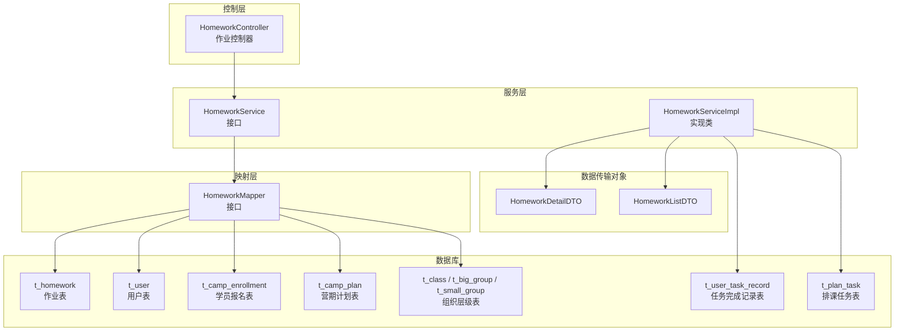
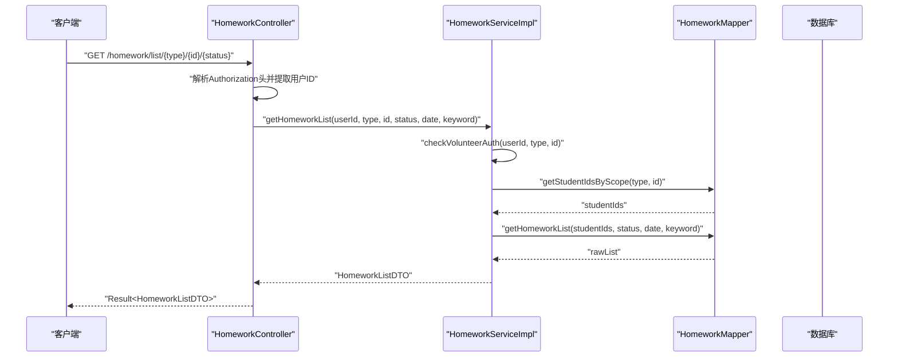
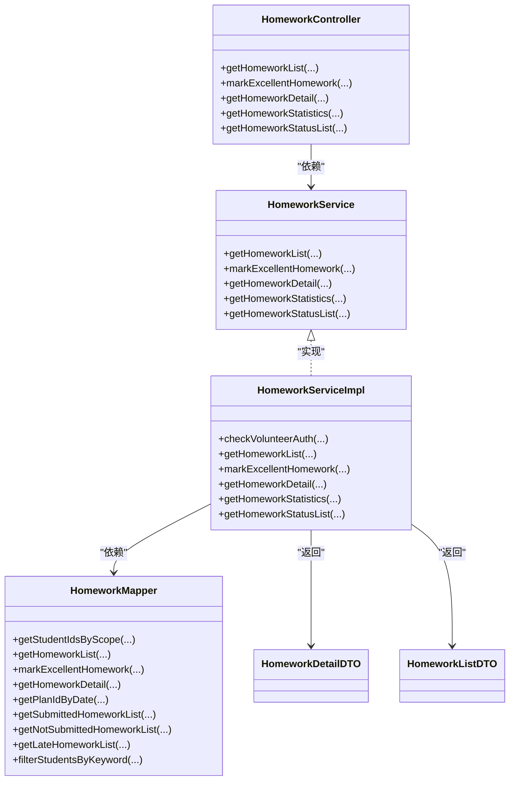
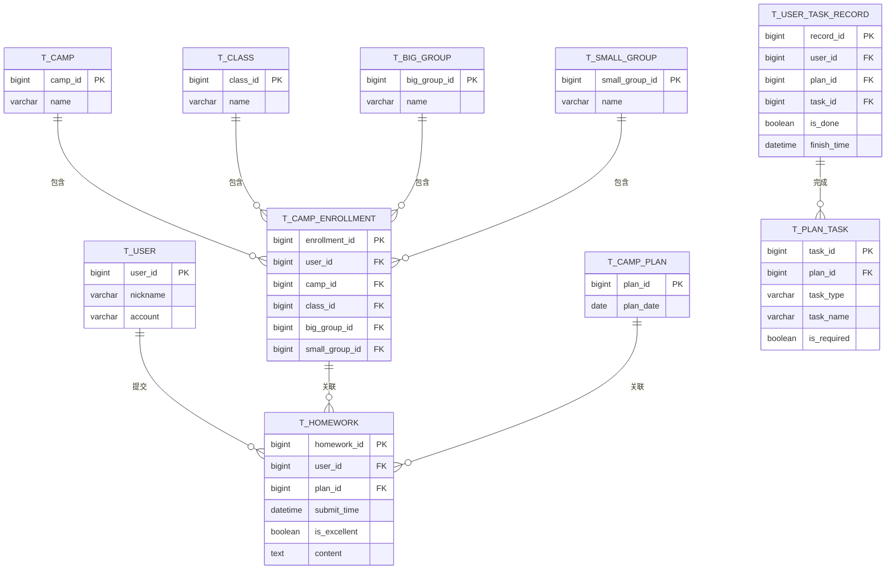

# 作业管理接口

<cite>
**本文引用的文件**
- [HomeworkController.java](file://src/main/java/com/daily/dailychineseculture/controller/HomeworkController.java)
- [HomeworkService.java](file://src/main/java/com/daily/dailychineseculture/service/HomeworkService.java)
- [HomeworkServiceImpl.java](file://src/main/java/com/daily/dailychineseculture/service/impl/HomeworkServiceImpl.java)
- [HomeworkMapper.java](file://src/main/java/com/daily/dailychineseculture/mapper/HomeworkMapper.java)
- [HomeworkDetailDTO.java](file://src/main/java/com/daily/dailychineseculture/dto/HomeworkDetailDTO.java)
- [HomeworkListDTO.java](file://src/main/java/com/daily/dailychineseculture/dto/HomeworkListDTO.java)
- [PlanTaskMapper.xml](file://src/main/resources/mapper/PlanTaskMapper.xml)
- [UserTaskRecordMapper.xml](file://src/main/resources/mapper/UserTaskRecordMapper.xml)
- [application.yml](file://src/main/resources/application.yml)
- [作业评选与管理.md](file://readme/作业与任务模块/作业评选与管理.md)
- [统计分析.md](file://readme/作业与任务模块/统计分析.md)
</cite>

## 目录
1. [简介](#简介)
2. [项目结构](#项目结构)
3. [核心组件](#核心组件)
4. [架构总览](#架构总览)
5. [详细组件分析](#详细组件分析)
6. [依赖关系分析](#依赖关系分析)
7. [性能考量](#性能考量)
8. [故障排查指南](#故障排查指南)
9. [结论](#结论)
10. [附录](#附录)

## 简介
本文件面向作业管理相关接口的详细API文档，覆盖作业发布、提交、评选、统计分析等核心功能。重点说明作业任务的创建、分发、完成记录、成绩评选等接口规范；明确作业数据的完整性验证与状态流转控制；提供完整的请求参数、响应格式与业务流程说明；分析作业管理的评分算法与统计分析机制；涵盖权限控制与数据安全保障；并提供接口测试用例与调试方法指南。

## 项目结构
作业管理模块由三层架构组成：
- 控制层（Controller）：暴露REST接口，负责参数解析、鉴权与响应封装。
- 服务层（Service）：实现业务逻辑，包括权限校验、数据聚合与统计计算。
- 映射层（Mapper）：基于MyBatis注解实现SQL查询，负责数据访问与复杂联表查询。

图表来源
- [HomeworkController.java:1-225](file://src/main/java/com/daily/dailychineseculture/controller/HomeworkController.java#L1-L225)
- [HomeworkService.java:1-38](file://src/main/java/com/daily/dailychineseculture/service/HomeworkService.java#L1-L38)
- [HomeworkServiceImpl.java:1-354](file://src/main/java/com/daily/dailychineseculture/service/impl/HomeworkServiceImpl.java#L1-L354)
- [HomeworkMapper.java:1-253](file://src/main/java/com/daily/dailychineseculture/mapper/HomeworkMapper.java#L1-L253)
- [HomeworkDetailDTO.java:1-57](file://src/main/java/com/daily/dailychineseculture/dto/HomeworkDetailDTO.java#L1-L57)
- [HomeworkListDTO.java:1-61](file://src/main/java/com/daily/dailychineseculture/dto/HomeworkListDTO.java#L1-L61)

章节来源
- [HomeworkController.java:1-225](file://src/main/java/com/daily/dailychineseculture/controller/HomeworkController.java#L1-L225)
- [作业评选与管理.md:1-103](file://readme/作业与任务模块/作业评选与管理.md#L1-L103)
- [统计分析.md:1-98](file://readme/作业与任务模块/统计分析.md#L1-L98)

## 核心组件
- 作业控制器（HomeworkController）
  - 提供作业列表、详情、优秀作业标记、统计、状态名单等接口。
  - 使用JWT令牌解析用户身份，并调用服务层执行业务逻辑。
- 作业服务接口与实现（HomeworkService / HomeworkServiceImpl）
  - 实现权限校验、作业列表聚合、作业详情组装、统计计算与状态名单生成。
  - 包含优秀作业标记的原子性更新。
- 作业映射接口（HomeworkMapper）
  - 完成多表联查、权限校验、作业统计与名单查询。
  - 支持按范围（班级/大组/小组）与日期、关键词筛选。
- DTO模型（HomeworkDetailDTO / HomeworkListDTO）
  - 规范作业列表与详情的数据结构，便于前后端契约一致。

章节来源
- [HomeworkController.java:1-225](file://src/main/java/com/daily/dailychineseculture/controller/HomeworkController.java#L1-L225)
- [HomeworkService.java:1-38](file://src/main/java/com/daily/dailychineseculture/service/HomeworkService.java#L1-L38)
- [HomeworkServiceImpl.java:1-354](file://src/main/java/com/daily/dailychineseculture/service/impl/HomeworkServiceImpl.java#L1-L354)
- [HomeworkMapper.java:1-253](file://src/main/java/com/daily/dailychineseculture/mapper/HomeworkMapper.java#L1-L253)
- [HomeworkDetailDTO.java:1-57](file://src/main/java/com/daily/dailychineseculture/dto/HomeworkDetailDTO.java#L1-L57)
- [HomeworkListDTO.java:1-61](file://src/main/java/com/daily/dailychineseculture/dto/HomeworkListDTO.java#L1-L61)

## 架构总览
作业管理接口遵循典型的MVC分层与DTO模式，结合MyBatis实现复杂联表查询与权限控制。整体流程如下：
- 控制器接收请求，解析JWT获取用户ID。
- 服务层进行权限校验（基于值班职责范围），并按范围与条件查询数据。
- 映射层执行SQL，返回聚合后的数据。
- 控制器封装统一响应返回。

图表来源
- [HomeworkController.java:64-84](file://src/main/java/com/daily/dailychineseculture/controller/HomeworkController.java#L64-L84)
- [HomeworkServiceImpl.java:27-99](file://src/main/java/com/daily/dailychineseculture/service/impl/HomeworkServiceImpl.java#L27-L99)
- [HomeworkMapper.java:74-130](file://src/main/java/com/daily/dailychineseculture/mapper/HomeworkMapper.java#L74-L130)

## 详细组件分析

### 1. 作业列表接口
- 接口路径
  - GET /homework/list/{type}/{id}/{status}
- 请求参数
  - Authorization: Bearer {token}
  - 路径参数
    - type: 范围类型，支持 class、bigGroup、smallGroup（或带下划线形式）
    - id: 范围ID
    - status: 状态筛选，支持 all、excellent
  - 查询参数
    - date: 日期筛选（可选）
    - keyword: 搜索关键字（可选）
- 响应
  - Result<HomeworkListDTO>
  - HomeworkListDTO包含list与total字段
  - HomeworkItem包含homeworkId、name、isExcellent、submitTime、organization
- 业务流程
  - 解析JWT获取用户ID
  - 校验志愿者权限（按type/id）
  - 获取学员ID列表
  - 查询最新作业（按用户+计划分组取最大ID）
  - 可选按状态、日期、关键词过滤
  - 组装组织信息（营期-班级-大组-小组）
- 错误处理
  - 无效筛选类型：返回错误提示
  - 无权限：返回403
  - 其他异常：返回通用错误

章节来源
- [HomeworkController.java:64-84](file://src/main/java/com/daily/dailychineseculture/controller/HomeworkController.java#L64-L84)
- [HomeworkServiceImpl.java:27-99](file://src/main/java/com/daily/dailychineseculture/service/impl/HomeworkServiceImpl.java#L27-L99)
- [HomeworkMapper.java:74-130](file://src/main/java/com/daily/dailychineseculture/mapper/HomeworkMapper.java#L74-L130)
- [HomeworkListDTO.java:1-61](file://src/main/java/com/daily/dailychineseculture/dto/HomeworkListDTO.java#L1-L61)

### 2. 优秀作业标记接口
- 接口路径
  - POST /camp/homework/mark/{homeworkId}/{isExcellent}
- 请求参数
  - Authorization: Bearer {token}
  - 路径参数
    - homeworkId: 作业ID
    - isExcellent: true/false
- 响应
  - Result<Void>
- 业务流程
  - 校验作业是否存在
  - 执行标记或取消标记
- 错误处理
  - 作业不存在：返回失败
  - 异常：返回通用错误

章节来源
- [HomeworkController.java:96-113](file://src/main/java/com/daily/dailychineseculture/controller/HomeworkController.java#L96-L113)
- [HomeworkServiceImpl.java:104-114](file://src/main/java/com/daily/dailychineseculture/service/impl/HomeworkServiceImpl.java#L104-L114)
- [HomeworkMapper.java:134-137](file://src/main/java/com/daily/dailychineseculture/mapper/HomeworkMapper.java#L134-L137)

### 3. 作业详情接口
- 接口路径
  - GET /homework/detail/{homeworkId}
- 请求参数
  - Authorization: Bearer {token}
  - 路径参数
    - homeworkId: 作业ID
- 响应
  - Result<HomeworkDetailDTO>
  - HomeworkDetailDTO包含作业ID、学生姓名、用户ID、组织、提交时间、是否优秀、作业内容
- 业务流程
  - 查询作业详情
  - 组装组织信息
  - 处理空值与默认值
- 错误处理
  - 作业不存在：返回错误

章节来源
- [HomeworkController.java:147-160](file://src/main/java/com/daily/dailychineseculture/controller/HomeworkController.java#L147-L160)
- [HomeworkServiceImpl.java:119-175](file://src/main/java/com/daily/dailychineseculture/service/impl/HomeworkServiceImpl.java#L119-L175)
- [HomeworkMapper.java:142-155](file://src/main/java/com/daily/dailychineseculture/mapper/HomeworkMapper.java#L142-L155)
- [HomeworkDetailDTO.java:1-57](file://src/main/java/com/daily/dailychineseculture/dto/HomeworkDetailDTO.java#L1-L57)

### 4. 作业统计接口
- 接口路径
  - GET /homework/stats
- 请求参数
  - Authorization: Bearer {token}
  - 查询参数
    - type: 范围类型（class/bigGroup/smallGroup）
    - id: 范围ID
    - date: 日期（可选）
    - keyword: 搜索关键字（可选）
- 响应
  - Result<Map<String,Object>>
  - 包含是否发布作业(hasHomework)、总人数、完成人数、未交人数、迟交人数、完成率、按时率等
- 业务流程
  - 校验权限
  - 获取学员ID列表（可选按keyword过滤）
  - 判断当日是否有作业计划
  - 统计已交、未交、迟交人数并计算百分比
- 错误处理
  - 无权限：返回403
  - 异常：返回通用错误

章节来源
- [HomeworkController.java:173-190](file://src/main/java/com/daily/dailychineseculture/controller/HomeworkController.java#L173-L190)
- [HomeworkServiceImpl.java:224-279](file://src/main/java/com/daily/dailychineseculture/service/impl/HomeworkServiceImpl.java#L224-L279)
- [HomeworkMapper.java:178-227](file://src/main/java/com/daily/dailychineseculture/mapper/HomeworkMapper.java#L178-L227)

### 5. 作业状态名单接口
- 接口路径
  - GET /homework/status/list/{type}/{id}
- 请求参数
  - Authorization: Bearer {token}
  - 路径参数
    - type: 范围类型（class/bigGroup/smallGroup）
    - id: 范围ID
  - 查询参数
    - date: 日期（必填）
    - keyword: 搜索关键字（可选）
- 响应
  - Result<Map<String,Object>>
  - 包含campPlan（planId、deadline）、submittedList、notSubmittedList、lateList与statistics
- 业务流程
  - 校验权限
  - 获取学员ID列表（可选按keyword过滤）
  - 查询计划ID与截止时间
  - 分别查询已交、未交、迟交名单
  - 计算统计指标
- 错误处理
  - 无效筛选类型：返回错误
  - 无权限：返回403
  - 异常：返回通用错误

章节来源
- [HomeworkController.java:204-223](file://src/main/java/com/daily/dailychineseculture/controller/HomeworkController.java#L204-L223)
- [HomeworkServiceImpl.java:284-341](file://src/main/java/com/daily/dailychineseculture/service/impl/HomeworkServiceImpl.java#L284-L341)
- [HomeworkMapper.java:178-227](file://src/main/java/com/daily/dailychineseculture/mapper/HomeworkMapper.java#L178-L227)

### 6. 作业任务完成记录（补充）
- 接口路径
  - POST /user/task/done（示例）
- 请求参数
  - Authorization: Bearer {token}
  - Body: {userId, planId, taskId}
- 响应
  - Result<Void>
- 业务流程
  - upsert完成记录，若存在则更新完成状态与完成时间
- 说明
  - 该接口用于任务完成记录，与作业管理相关但非作业评选核心接口

章节来源
- [UserTaskRecordMapper.xml:4-8](file://src/main/resources/mapper/UserTaskRecordMapper.xml#L4-L8)

## 依赖关系分析
- 控制器依赖服务层，服务层依赖映射层，映射层依赖数据库表。
- 权限控制依赖值班职责表与组织层级表。
- 作业详情与统计均依赖营期计划表以确定当日是否有作业发布。

图表来源
- [HomeworkController.java:1-225](file://src/main/java/com/daily/dailychineseculture/controller/HomeworkController.java#L1-L225)
- [HomeworkService.java:1-38](file://src/main/java/com/daily/dailychineseculture/service/HomeworkService.java#L1-L38)
- [HomeworkServiceImpl.java:1-354](file://src/main/java/com/daily/dailychineseculture/service/impl/HomeworkServiceImpl.java#L1-L354)
- [HomeworkMapper.java:1-253](file://src/main/java/com/daily/dailychineseculture/mapper/HomeworkMapper.java#L1-L253)
- [HomeworkDetailDTO.java:1-57](file://src/main/java/com/daily/dailychineseculture/dto/HomeworkDetailDTO.java#L1-L57)
- [HomeworkListDTO.java:1-61](file://src/main/java/com/daily/dailychineseculture/dto/HomeworkListDTO.java#L1-L61)

## 性能考量
- SQL优化
  - 作业列表按用户+计划分组取最新作业，减少重复数据与排序成本。
  - 使用IN子句与动态SQL，避免全表扫描。
- 缓存建议
  - 对常用范围（班级/大组/小组）的学员ID列表可引入缓存，降低频繁查询。
- 分页策略
  - 当前实现返回total与list，建议在大数据量时增加分页参数以提升性能。
- 并发控制
  - 优秀作业标记采用单条更新，保证原子性；建议在高并发场景下增加乐观锁或队列化处理。

[本节为通用性能建议，不直接分析具体文件]

## 故障排查指南
- 权限相关
  - 现象：返回“无权限访问该范围数据”
  - 排查：确认用户是否具备对应type/id的值班职责；核对范围类型大小写与下划线命名。
- 参数校验
  - 现象：返回“无效的筛选类型”
  - 排查：确认type参数为class、bigGroup、smallGroup之一。
- 数据一致性
  - 现象：统计结果异常
  - 排查：确认当日是否存在作业计划；核对提交时间是否跨日；检查学员是否在该营期范围内。
- 时间字段处理
  - 现象：提交时间显示异常
  - 排查：确认数据库时间类型（Date/LocalDateTime）与格式化逻辑。

章节来源
- [HomeworkServiceImpl.java:180-218](file://src/main/java/com/daily/dailychineseculture/service/impl/HomeworkServiceImpl.java#L180-L218)
- [HomeworkServiceImpl.java:224-279](file://src/main/java/com/daily/dailychineseculture/service/impl/HomeworkServiceImpl.java#L224-L279)
- [HomeworkMapper.java:178-227](file://src/main/java/com/daily/dailychineseculture/mapper/HomeworkMapper.java#L178-L227)

## 结论
作业管理接口围绕志愿者权限、作业列表与详情、优秀作业评选、统计分析与状态名单展开，形成闭环的作业管理体系。通过严格的权限校验与多维筛选，满足不同层级用户的作业管理需求。建议后续引入缓存、分页与并发控制优化，进一步提升系统性能与稳定性。

[本节为总结性内容，不直接分析具体文件]

## 附录

### A. 接口测试用例与调试方法
- 登录与鉴权
  - 使用管理员账户登录获取JWT Token，随后在各作业接口请求头中携带Authorization: Bearer {token}。
- 作业列表
  - GET /homework/list/{type}/{id}/{status}?date={date}&keyword={keyword}
  - 示例：GET /homework/list/class/1/all?date=2025-04-05&keyword=张三
- 优秀作业标记
  - POST /camp/homework/mark/{homeworkId}/true
  - POST /camp/homework/mark/{homeworkId}/false
- 作业详情
  - GET /homework/detail/{homeworkId}
- 统计数据
  - GET /homework/stats?type=class&id=1&date=2025-04-05&keyword=张三
- 状态名单
  - GET /homework/status/list/{type}/{id}?date=2025-04-05&keyword=张三
- 调试建议
  - 启用数据库慢查询日志，定位SQL性能瓶颈。
  - 在服务层添加关键步骤的日志输出，便于追踪权限校验与统计计算过程。

章节来源
- [作业评选与管理.md:94-103](file://readme/作业与任务模块/作业评选与管理.md#L94-L103)
- [统计分析.md:90-98](file://readme/作业与任务模块/统计分析.md#L90-L98)

### B. 数据模型与关系
作业管理涉及的主要实体与关系如下：

图表来源
- [HomeworkMapper.java:14-31](file://src/main/java/com/daily/dailychineseculture/mapper/HomeworkMapper.java#L14-L31)
- [HomeworkMapper.java:74-155](file://src/main/java/com/daily/dailychineseculture/mapper/HomeworkMapper.java#L74-L155)
- [PlanTaskMapper.xml:8-24](file://src/main/resources/mapper/PlanTaskMapper.xml#L8-L24)
- [UserTaskRecordMapper.xml:4-8](file://src/main/resources/mapper/UserTaskRecordMapper.xml#L4-L8)

### C. 评分算法与统计分析机制
- 完成率计算
  - 完成率 = 已交人数 / 总人数 × 100%
  - 按时率 = 已交人数（按时） / 已交人数 × 100%
- 统计维度
  - 总人数：范围内的学员总数
  - 已交人数：提交时间等于日期的人数
  - 未交人数：在学员列表中但未在当日提交的人数
  - 迟交人数：提交时间晚于日期的人数
- 关键逻辑
  - 通过getPlanIdByDate判断当日是否有作业计划，避免空统计
  - 通过NOT IN与日期比较实现未交名单与迟交名单查询

章节来源
- [HomeworkServiceImpl.java:224-279](file://src/main/java/com/daily/dailychineseculture/service/impl/HomeworkServiceImpl.java#L224-L279)
- [HomeworkMapper.java:178-227](file://src/main/java/com/daily/dailychineseculture/mapper/HomeworkMapper.java#L178-L227)

### D. 权限控制与数据安全保障
- 权限模型
  - 基于值班职责（检组/学组/检委/学委/学班/检班）与组织范围（班级/大组/小组）进行权限校验。
- 安全措施
  - 所有接口均要求携带JWT Token，控制器解析用户ID后进行权限校验。
  - SQL层面使用动态参数绑定，避免SQL注入。
- 建议
  - 生产环境使用强JWT签名与过期策略。
  - 对敏感操作（标记优秀作业）增加审计日志。

章节来源
- [HomeworkController.java:37-47](file://src/main/java/com/daily/dailychineseculture/controller/HomeworkController.java#L37-L47)
- [HomeworkServiceImpl.java:180-218](file://src/main/java/com/daily/dailychineseculture/service/impl/HomeworkServiceImpl.java#L180-L218)
- [HomeworkMapper.java:36-69](file://src/main/java/com/daily/dailychineseculture/mapper/HomeworkMapper.java#L36-L69)

### E. 环境与配置
- 应用端口与数据库
  - server.port: 8080
  - spring.datasource.url: MySQL连接地址
  - mybatis.map-underscore-to-camel-case: 开启下划线转驼峰
- 文件上传
  - 单文件最大500MB，请求总大小500MB

章节来源
- [application.yml:3-33](file://src/main/resources/application.yml#L3-L33)