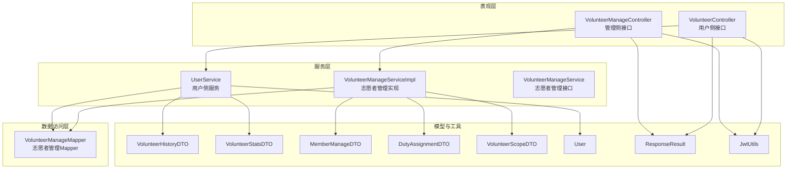
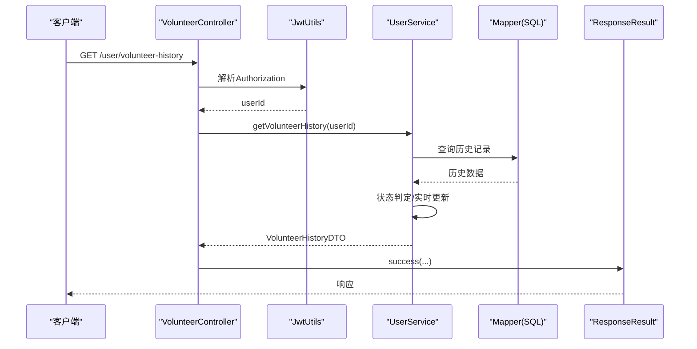
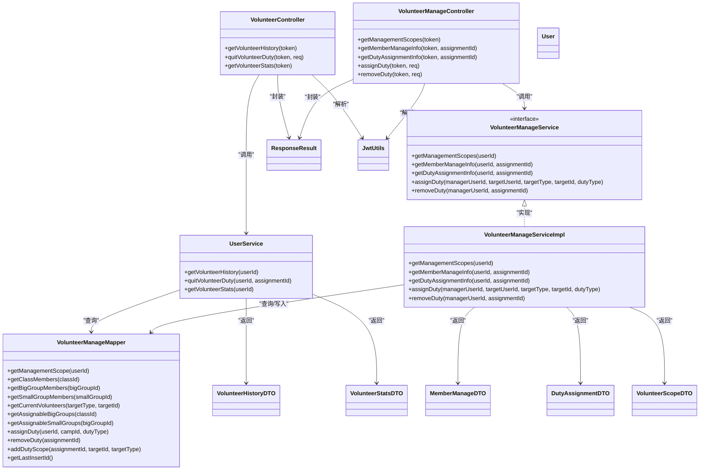
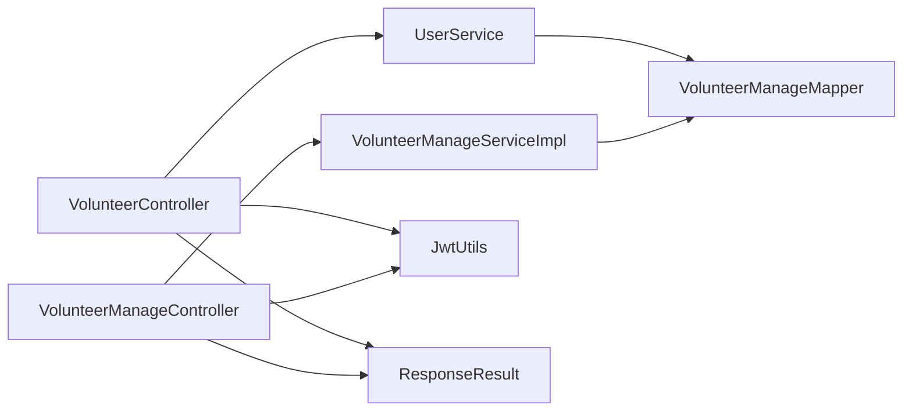

# 志愿者管理接口

<cite>
**本文引用的文件**
- [VolunteerController.java](file://src/main/java/com/daily/dailychineseculture/controller/VolunteerController.java)
- [VolunteerManageController.java](file://src/main/java/com/daily/dailychineseculture/controller/VolunteerManageController.java)
- [VolunteerManageService.java](file://src/main/java/com/daily/dailychineseculture/service/VolunteerManageService.java)
- [VolunteerManageServiceImpl.java](file://src/main/java/com/daily/dailychineseculture/service/impl/VolunteerManageServiceImpl.java)
- [VolunteerManageMapper.java](file://src/main/java/com/daily/dailychineseculture/mapper/VolunteerManageMapper.java)
- [UserService.java](file://src/main/java/com/daily/dailychineseculture/service/UserService.java)
- [VolunteerHistoryDTO.java](file://src/main/java/com/daily/dailychineseculture/dto/VolunteerHistoryDTO.java)
- [VolunteerStatsDTO.java](file://src/main/java/com/daily/dailychineseculture/dto/VolunteerStatsDTO.java)
- [MemberManageDTO.java](file://src/main/java/com/daily/dailychineseculture/dto/MemberManageDTO.java)
- [DutyAssignmentDTO.java](file://src/main/java/com/daily/dailychineseculture/dto/DutyAssignmentDTO.java)
- [VolunteerScopeDTO.java](file://src/main/java/com/daily/dailychineseculture/dto/VolunteerScopeDTO.java)
- [User.java](file://src/main/java/com/daily/dailychineseculture/entity/User.java)
- [ResponseResult.java](file://src/main/java/com/daily/dailychineseculture/common/ResponseResult.java)
- [JwtUtils.java](file://src/main/java/com/daily/dailychineseculture/util/JwtUtils.java)
- [API接口文档.md](file://doc/API接口文档.md)
</cite>

## 目录
1. [简介](#简介)
2. [项目结构](#项目结构)
3. [核心组件](#核心组件)
4. [架构总览](#架构总览)
5. [详细组件分析](#详细组件分析)
6. [依赖分析](#依赖分析)
7. [性能考量](#性能考量)
8. [故障排查指南](#故障排查指南)
9. [结论](#结论)
10. [附录](#附录)

## 简介
本文件面向志愿者管理相关接口的完整API文档，覆盖以下能力：
- 志愿者服务历史查询与状态判定
- 服务时长统计与服务状态更新
- 权限范围计算与职责分配
- 职责分配与移除
- 管理成员信息与岗位可分配性查询
- 统计报表生成与数据聚合
- 权限控制与数据安全保护
- 接口调用示例与性能优化建议

## 项目结构
志愿者管理相关代码采用经典的三层架构（Controller-Service-Mapper），配合DTO/Entity模型与统一响应封装，形成清晰的职责边界与扩展点。

图示来源
- [VolunteerController.java:15-78](file://src/main/java/com/daily/dailychineseculture/controller/VolunteerController.java#L15-L78)
- [VolunteerManageController.java:16-137](file://src/main/java/com/daily/dailychineseculture/controller/VolunteerManageController.java#L16-L137)
- [UserService.java:22-800](file://src/main/java/com/daily/dailychineseculture/service/UserService.java#L22-L800)
- [VolunteerManageServiceImpl.java:17-430](file://src/main/java/com/daily/dailychineseculture/service/impl/VolunteerManageServiceImpl.java#L17-L430)
- [VolunteerManageMapper.java:12-222](file://src/main/java/com/daily/dailychineseculture/mapper/VolunteerManageMapper.java#L12-L222)
- [VolunteerHistoryDTO.java:9-51](file://src/main/java/com/daily/dailychineseculture/dto/VolunteerHistoryDTO.java#L9-L51)
- [VolunteerStatsDTO.java:9-66](file://src/main/java/com/daily/dailychineseculture/dto/VolunteerStatsDTO.java#L9-L66)
- [MemberManageDTO.java:9-99](file://src/main/java/com/daily/dailychineseculture/dto/MemberManageDTO.java#L9-L99)
- [DutyAssignmentDTO.java:9-72](file://src/main/java/com/daily/dailychineseculture/dto/DutyAssignmentDTO.java#L9-L72)
- [VolunteerScopeDTO.java:9-48](file://src/main/java/com/daily/dailychineseculture/dto/VolunteerScopeDTO.java#L9-L48)
- [User.java:9-87](file://src/main/java/com/daily/dailychineseculture/entity/User.java#L9-L87)
- [ResponseResult.java](file://src/main/java/com/daily/dailychineseculture/common/ResponseResult.java)
- [JwtUtils.java](file://src/main/java/com/daily/dailychineseculture/util/JwtUtils.java)

章节来源
- [VolunteerController.java:15-78](file://src/main/java/com/daily/dailychineseculture/controller/VolunteerController.java#L15-L78)
- [VolunteerManageController.java:16-137](file://src/main/java/com/daily/dailychineseculture/controller/VolunteerManageController.java#L16-L137)

## 核心组件
- 用户侧志愿者接口：提供历史查询、退出担当、统计信息查询
- 管理侧志愿者接口：提供管理范围查询、成员信息查询、岗位分配与移除
- 服务实现：根据JWT解析用户ID，调用Mapper执行SQL，组装DTO返回
- 统一响应：ResponseResult封装通用响应结构
- 权限工具：JwtUtils从Authorization头解析用户ID

章节来源
- [VolunteerController.java:25-77](file://src/main/java/com/daily/dailychineseculture/controller/VolunteerController.java#L25-L77)
- [VolunteerManageController.java:26-136](file://src/main/java/com/daily/dailychineseculture/controller/VolunteerManageController.java#L26-L136)
- [UserService.java:299-490](file://src/main/java/com/daily/dailychineseculture/service/UserService.java#L299-L490)
- [VolunteerManageServiceImpl.java:23-357](file://src/main/java/com/daily/dailychineseculture/service/impl/VolunteerManageServiceImpl.java#L23-L357)
- [ResponseResult.java](file://src/main/java/com/daily/dailychineseculture/common/ResponseResult.java)
- [JwtUtils.java](file://src/main/java/com/daily/dailychineseculture/util/JwtUtils.java)

## 架构总览
志愿者管理接口遵循REST风格，通过Controller接收请求，解析JWT获取用户ID，调用Service层业务逻辑，Service层通过Mapper访问数据库，最终以DTO封装返回。

图示来源
- [VolunteerController.java:28-37](file://src/main/java/com/daily/dailychineseculture/controller/VolunteerController.java#L28-L37)
- [UserService.java:332-410](file://src/main/java/com/daily/dailychineseculture/service/UserService.java#L332-L410)
- [JwtUtils.java](file://src/main/java/com/daily/dailychineseculture/util/JwtUtils.java)
- [ResponseResult.java](file://src/main/java/com/daily/dailychineseculture/common/ResponseResult.java)

## 详细组件分析

### 用户侧志愿者接口
- 接口1：获取志愿者历史记录
  - 方法与路径：GET /user/volunteer-history
  - 认证：Authorization Bearer Token
  - 业务：解析用户ID，查询历史记录，动态判定“正在参与/已结束”，必要时实时更新结束时间
  - 响应：VolunteerHistoryDTO
  - 异常：解析失败或查询异常统一包装为错误响应

- 接口2：退出担当
  - 方法与路径：POST /user/volunteer-quit
  - 请求体：assignmentId（必填）
  - 业务：校验assignmentId与用户匹配，更新服务结束时间为当前时间
  - 响应：字符串提示

- 接口3：获取志愿者统计信息
  - 方法与路径：GET /user/volunteer-stats
  - 认证：Authorization Bearer Token
  - 业务：统计参与的营期、负责的班级/大组/小组
  - 响应：VolunteerStatsDTO

章节来源
- [VolunteerController.java:25-77](file://src/main/java/com/daily/dailychineseculture/controller/VolunteerController.java#L25-L77)
- [UserService.java:332-490](file://src/main/java/com/daily/dailychineseculture/service/UserService.java#L332-L490)
- [VolunteerHistoryDTO.java:9-51](file://src/main/java/com/daily/dailychineseculture/dto/VolunteerHistoryDTO.java#L9-L51)
- [VolunteerStatsDTO.java:9-66](file://src/main/java/com/daily/dailychineseculture/dto/VolunteerStatsDTO.java#L9-L66)

### 管理侧志愿者接口
- 接口4：获取管理范围
  - 方法与路径：GET /volunteer/scopes
  - 认证：Authorization Bearer Token
  - 业务：查询当前用户有效的管理范围（支持多职位、多层级）
  - 响应：List<Map<String,Object>>

- 接口5：获取管理成员信息
  - 方法与路径：GET /volunteer/manage/members
  - 查询参数：assignmentId（可选）
  - 业务：根据管理范围确定营期/班级/大组/小组，查询成员列表
  - 响应：MemberManageDTO

- 接口6：获取分配岗位信息
  - 方法与路径：GET /volunteer/manage/duty-assignment
  - 查询参数：assignmentId（可选）
  - 业务：根据管理范围生成可分配岗位清单（含空缺判定）
  - 响应：DutyAssignmentDTO

- 接口7：分配岗位
  - 方法与路径：POST /volunteer/manage/assign-duty
  - 请求体：targetUserId、targetType、targetId、dutyType
  - 业务：权限校验（班级管理者可分配大组/小组岗位；大组管理者仅可分配小组岗位；小组管理者无权限），插入t_duty_assignment并写入t_duty_scope
  - 响应：字符串提示

- 接口8：移除岗位
  - 方法与路径：POST /volunteer/manage/remove-duty
  - 请求体：assignmentId（必填）
  - 业务：更新t_duty_assignment的结束时间为当前时间
  - 响应：字符串提示

章节来源
- [VolunteerManageController.java:26-136](file://src/main/java/com/daily/dailychineseculture/controller/VolunteerManageController.java#L26-L136)
- [VolunteerManageService.java:11-38](file://src/main/java/com/daily/dailychineseculture/service/VolunteerManageService.java#L11-L38)
- [VolunteerManageServiceImpl.java:23-357](file://src/main/java/com/daily/dailychineseculture/service/impl/VolunteerManageServiceImpl.java#L23-L357)
- [VolunteerManageMapper.java:18-222](file://src/main/java/com/daily/dailychineseculture/mapper/VolunteerManageMapper.java#L18-L222)
- [MemberManageDTO.java:9-99](file://src/main/java/com/daily/dailychineseculture/dto/MemberManageDTO.java#L9-L99)
- [DutyAssignmentDTO.java:9-72](file://src/main/java/com/daily/dailychineseculture/dto/DutyAssignmentDTO.java#L9-L72)

### 数据模型与算法要点
- 历史记录状态判定与实时更新
  - 判定条件：营期未结束且未主动退出
  - 实时更新：若营期已结束而未退出，将结束时间更新为营期结束时间
  - 时间显示：仅展示日期部分，格式为“YYYY.MM.DD”

- 权限范围计算
  - 依据t_duty_assignment与t_duty_scope关联，过滤当前有效（volunteer_end_time为空）且营期未结束的记录
  - 支持多职位、多层级（营期-班级-大组-小组）

- 岗位可分配性
  - 班级管理者：可分配大组的“学委/检委”与小组的“学组/检组”
  - 大组管理者：仅可分配小组的“学组/检组”
  - 小组管理者：无分配权限

- 成员信息聚合
  - 根据dutyType选择查询班级/大组/小组成员
  - 统一映射为MemberManageDTO，包含用户基础信息与所在组织层级

- 统计报表生成
  - 参与营期、负责班级/大组/小组的聚合来源于多条Mapper查询，分别映射到VolunteerStatsDTO各字段

章节来源
- [UserService.java:332-490](file://src/main/java/com/daily/dailychineseculture/service/UserService.java#L332-L490)
- [VolunteerManageServiceImpl.java:23-261](file://src/main/java/com/daily/dailychineseculture/service/impl/VolunteerManageServiceImpl.java#L23-L261)
- [VolunteerManageMapper.java:18-166](file://src/main/java/com/daily/dailychineseculture/mapper/VolunteerManageMapper.java#L18-L166)
- [VolunteerStatsDTO.java:9-66](file://src/main/java/com/daily/dailychineseculture/dto/VolunteerStatsDTO.java#L9-L66)

### 类关系图（代码级）

图示来源
- [VolunteerController.java:15-78](file://src/main/java/com/daily/dailychineseculture/controller/VolunteerController.java#L15-L78)
- [VolunteerManageController.java:16-137](file://src/main/java/com/daily/dailychineseculture/controller/VolunteerManageController.java#L16-L137)
- [UserService.java:22-800](file://src/main/java/com/daily/dailychineseculture/service/UserService.java#L22-L800)
- [VolunteerManageService.java:11-38](file://src/main/java/com/daily/dailychineseculture/service/VolunteerManageService.java#L11-L38)
- [VolunteerManageServiceImpl.java:17-430](file://src/main/java/com/daily/dailychineseculture/service/impl/VolunteerManageServiceImpl.java#L17-L430)
- [VolunteerManageMapper.java:12-222](file://src/main/java/com/daily/dailychineseculture/mapper/VolunteerManageMapper.java#L12-L222)
- [VolunteerHistoryDTO.java:9-51](file://src/main/java/com/daily/dailychineseculture/dto/VolunteerHistoryDTO.java#L9-L51)
- [VolunteerStatsDTO.java:9-66](file://src/main/java/com/daily/dailychineseculture/dto/VolunteerStatsDTO.java#L9-L66)
- [MemberManageDTO.java:9-99](file://src/main/java/com/daily/dailychineseculture/dto/MemberManageDTO.java#L9-L99)
- [DutyAssignmentDTO.java:9-72](file://src/main/java/com/daily/dailychineseculture/dto/DutyAssignmentDTO.java#L9-L72)
- [VolunteerScopeDTO.java:9-48](file://src/main/java/com/daily/dailychineseculture/dto/VolunteerScopeDTO.java#L9-L48)
- [User.java:9-87](file://src/main/java/com/daily/dailychineseculture/entity/User.java#L9-L87)
- [ResponseResult.java](file://src/main/java/com/daily/dailychineseculture/common/ResponseResult.java)
- [JwtUtils.java](file://src/main/java/com/daily/dailychineseculture/util/JwtUtils.java)

## 依赖分析
- 控制器依赖注入Service与JwtUtils，统一返回ResponseResult
- Service层依赖Mapper执行SQL，DTO用于数据传输
- Mapper通过注解定义SQL，涉及多表关联与条件过滤
- 权限控制基于JWT用户ID与数据库中的职责范围

图示来源
- [VolunteerController.java:15-78](file://src/main/java/com/daily/dailychineseculture/controller/VolunteerController.java#L15-L78)
- [VolunteerManageController.java:16-137](file://src/main/java/com/daily/dailychineseculture/controller/VolunteerManageController.java#L16-L137)
- [UserService.java:22-800](file://src/main/java/com/daily/dailychineseculture/service/UserService.java#L22-L800)
- [VolunteerManageServiceImpl.java:17-430](file://src/main/java/com/daily/dailychineseculture/service/impl/VolunteerManageServiceImpl.java#L17-L430)
- [VolunteerManageMapper.java:12-222](file://src/main/java/com/daily/dailychineseculture/mapper/VolunteerManageMapper.java#L12-L222)
- [JwtUtils.java](file://src/main/java/com/daily/dailychineseculture/util/JwtUtils.java)
- [ResponseResult.java](file://src/main/java/com/daily/dailychineseculture/common/ResponseResult.java)

## 性能考量
- SQL层面
  - 管理范围查询包含多表LEFT JOIN与多条件过滤，建议在相关列建立索引（如user_id、camp_id、target_type/target_id、volunteer_end_time等）
  - 历史查询与统计查询均为单表/少量联表，建议在assignment_id、user_id、duty_type等字段建立索引
- 业务层面
  - 历史状态判定与实时更新在Service层进行，避免重复查询可减少往返
  - 岗位分配涉及多次查询当前任职情况与权限校验，建议在热点路径上缓存管理范围与当前营期信息
- IO层面
  - Mapper层使用MyBatis注解SQL，建议结合慢查询日志与数据库性能分析工具定位瓶颈

## 故障排查指南
- 常见错误与定位
  - Token解析失败：确认Authorization头格式为Bearer XXX，且令牌有效
  - 参数缺失：退出担当与分配岗位接口要求必填参数，检查请求体字段
  - 权限不足：分配岗位时会校验管理范围，确认当前用户是否具备相应权限
  - 数据一致性：退出担当与分配岗位均更新t_duty_assignment，关注返回受影响行数
- 日志与调试
  - Service实现中包含大量System.out输出，便于快速定位问题
  - 建议在生产环境替换为结构化日志框架（如SLF4J/Logback）

章节来源
- [VolunteerController.java:34-61](file://src/main/java/com/daily/dailychineseculture/controller/VolunteerController.java#L34-L61)
- [VolunteerManageController.java:96-135](file://src/main/java/com/daily/dailychineseculture/controller/VolunteerManageController.java#L96-L135)
- [VolunteerManageServiceImpl.java:264-345](file://src/main/java/com/daily/dailychineseculture/service/impl/VolunteerManageServiceImpl.java#L264-L345)

## 结论
本系统提供了完整的志愿者管理能力：从用户视角的历史与统计，到管理视角的成员与岗位管理，均以清晰的接口与稳定的实现支撑。通过JWT鉴权与数据库职责范围约束，实现了权限控制与数据安全。建议在生产环境中完善日志体系、索引优化与缓存策略，持续提升性能与稳定性。

## 附录

### 接口一览与调用示例

- 获取志愿者历史记录
  - 方法：GET /user/volunteer-history
  - 请求头：Authorization: Bearer <token>
  - 响应：VolunteerHistoryDTO
  - 示例（CURL）：curl -H "Authorization: Bearer eyJhbGciOiJIUzI1..." http://host:port/user/volunteer-history

- 退出担当
  - 方法：POST /user/volunteer-quit
  - 请求头：Authorization: Bearer <token>
  - 请求体：{"assignmentId": 123}
  - 响应：字符串提示

- 获取志愿者统计信息
  - 方法：GET /user/volunteer-stats
  - 请求头：Authorization: Bearer <token>
  - 响应：VolunteerStatsDTO

- 获取管理范围
  - 方法：GET /volunteer/scopes
  - 请求头：Authorization: Bearer <token>
  - 响应：List<Map<String,Object>>

- 获取管理成员信息
  - 方法：GET /volunteer/manage/members?assignmentId=123
  - 请求头：Authorization: Bearer <token>
  - 响应：MemberManageDTO

- 获取分配岗位信息
  - 方法：GET /volunteer/manage/duty-assignment?assignmentId=123
  - 请求头：Authorization: Bearer <token>
  - 响应：DutyAssignmentDTO

- 分配岗位
  - 方法：POST /volunteer/manage/assign-duty
  - 请求头：Authorization: Bearer <token>
  - 请求体：{"targetUserId":1001,"targetType":"small_group","targetId":201,"dutyType":"学组"}
  - 响应：字符串提示

- 移除岗位
  - 方法：POST /volunteer/manage/remove-duty
  - 请求头：Authorization: Bearer <token>
  - 请求体：{"assignmentId":123}
  - 响应：字符串提示

章节来源
- [VolunteerController.java:25-77](file://src/main/java/com/daily/dailychineseculture/controller/VolunteerController.java#L25-L77)
- [VolunteerManageController.java:26-136](file://src/main/java/com/daily/dailychineseculture/controller/VolunteerManageController.java#L26-L136)
- [API接口文档.md:1-146](file://doc/API接口文档.md#L1-L146)