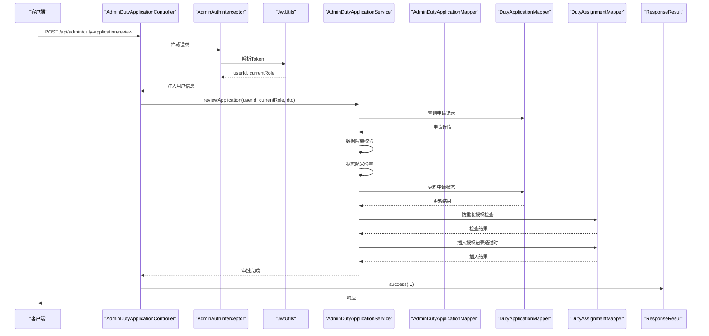
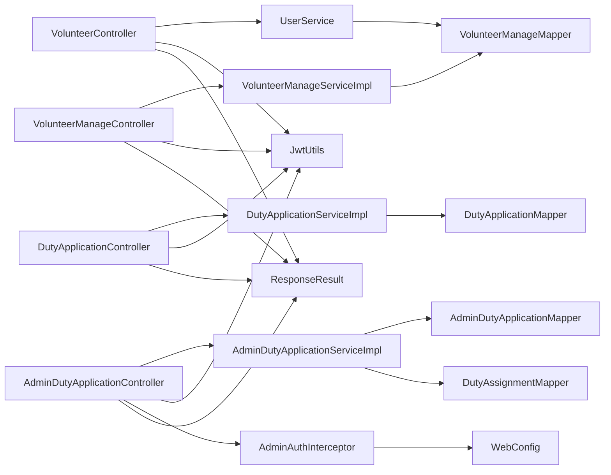

# 志愿者管理接口

<cite>
**本文引用的文件**
- [VolunteerController.java](file://src/main/java/com/daily/dailychineseculture/controller/VolunteerController.java)
- [VolunteerManageController.java](file://src/main/java/com/daily/dailychineseculture/controller/VolunteerManageController.java)
- [DutyApplicationController.java](file://src/main/java/com/daily/dailychineseculture/controller/DutyApplicationController.java)
- [AdminDutyApplicationController.java](file://src/main/java/com/daily/dailychineseculture/controller/AdminDutyApplicationController.java)
- [VolunteerManageService.java](file://src/main/java/com/daily/dailychineseculture/service/VolunteerManageService.java)
- [VolunteerManageServiceImpl.java](file://src/main/java/com/daily/dailychineseculture/service/impl/VolunteerManageServiceImpl.java)
- [DutyApplicationService.java](file://src/main/java/com/daily/dailychineseculture/service/DutyApplicationService.java)
- [DutyApplicationServiceImpl.java](file://src/main/java/com/daily/dailychineseculture/service/impl/DutyApplicationServiceImpl.java)
- [AdminDutyApplicationService.java](file://src/main/java/com/daily/dailychineseculture/service/AdminDutyApplicationService.java)
- [AdminDutyApplicationServiceImpl.java](file://src/main/java/com/daily/dailychineseculture/service/impl/AdminDutyApplicationServiceImpl.java)
- [VolunteerManageMapper.java](file://src/main/java/com/daily/dailychineseculture/mapper/VolunteerManageMapper.java)
- [DutyApplicationMapper.java](file://src/main/java/com/daily/dailychineseculture/mapper/DutyApplicationMapper.java)
- [AdminDutyApplicationMapper.java](file://src/main/java/com/daily/dailychineseculture/mapper/AdminDutyApplicationMapper.java)
- [DutyAssignmentMapper.java](file://src/main/java/com/daily/dailychineseculture/mapper/DutyAssignmentMapper.java)
- [UserService.java](file://src/main/java/com/daily/dailychineseculture/service/UserService.java)
- [VolunteerHistoryDTO.java](file://src/main/java/com/daily/dailychineseculture/dto/VolunteerHistoryDTO.java)
- [VolunteerStatsDTO.java](file://src/main/java/com/daily/dailychineseculture/dto/VolunteerStatsDTO.java)
- [MemberManageDTO.java](file://src/main/java/com/daily/dailychineseculture/dto/MemberManageDTO.java)
- [DutyAssignmentDTO.java](file://src/main/java/com/daily/dailychineseculture/dto/DutyAssignmentDTO.java)
- [VolunteerScopeDTO.java](file://src/main/java/com/daily/dailychineseculture/dto/VolunteerScopeDTO.java)
- [DutyApplicationSubmitDTO.java](file://src/main/java/com/daily/dailychineseculture/dto/DutyApplicationSubmitDTO.java)
- [RevokeApplicationDTO.java](file://src/main/java/com/daily/dailychineseculture/dto/RevokeApplicationDTO.java)
- [DutyApplicationReviewDTO.java](file://src/main/java/com/daily/dailychineseculture/dto/DutyApplicationReviewDTO.java)
- [DutyApplication.java](file://src/main/java/com/daily/dailychineseculture/entity/DutyApplication.java)
- [DutyApplicationVO.java](file://src/main/java/com/daily/dailychineseculture/vo/DutyApplicationVO.java)
- [AdminDutyApplicationListItemVO.java](file://src/main/java/com/daily/dailychineseculture/vo/AdminDutyApplicationListItemVO.java)
- [AdminDutyApplicationStatsVO.java](file://src/main/java/com/daily/dailychineseculture/vo/AdminDutyApplicationStatsVO.java)
- [User.java](file://src/main/java/com/daily/dailychineseculture/entity/User.java)
- [ResponseResult.java](file://src/main/java/com/daily/dailychineseculture/common/ResponseResult.java)
- [JwtUtils.java](file://src/main/java/com/daily/dailychineseculture/util/JwtUtils.java)
- [AdminAuthInterceptor.java](file://src/main/java/com/daily/dailychineseculture/interceptor/AdminAuthInterceptor.java)
- [WebConfig.java](file://src/main/java/com/daily/dailychineseculture/config/WebConfig.java)
- [API接口文档.md](file://doc/API接口文档.md)
</cite>

## 更新摘要
**变更内容**
- 新增值班申请相关接口文档，包括申请提交、撤销申请、申请列表查询
- 新增管理员端值班申请审批接口文档，包括统计分析、分页列表查询和审批流转
- 更新架构图以包含值班申请相关组件
- 新增值班申请相关的数据模型和业务逻辑说明
- 新增管理员审批接口的详细说明，包括数据隔离和权限控制
- 新增管理员值班申请审批功能的完整实现细节

## 目录
1. [简介](#简介)
2. [项目结构](#项目结构)
3. [核心组件](#核心组件)
4. [架构总览](#架构总览)
5. [详细组件分析](#详细组件分析)
6. [依赖分析](#依赖分析)
7. [性能考量](#性能考量)
8. [故障排查指南](#故障排查指南)
9. [结论](#结论)
10. [附录](#附录)

## 简介
本文件面向志愿者管理相关接口的完整API文档，覆盖以下能力：
- 志愿者服务历史查询与状态判定
- 服务时长统计与服务状态更新
- 权限范围计算与职责分配
- 职责分配与移除
- 管理成员信息与岗位可分配性查询
- 统计报表生成与数据聚合
- 权限控制与数据安全保护
- **值班申请提交、撤销申请、申请列表查询**
- **管理员端值班申请审批与统计**
- **管理员审批流转接口（通过/拒绝）**
- 接口调用示例与性能优化建议

## 项目结构
志愿者管理相关代码采用经典的三层架构（Controller-Service-Mapper），配合DTO/Entity模型与统一响应封装，形成清晰的职责边界与扩展点。现已新增值班申请相关组件，包括用户端申请和管理员端审批功能。

```mermaid
graph TB
subgraph "表现层"
VC["VolunteerController<br/>用户侧志愿者接口"]
VMC["VolunteerManageController<br/>管理侧志愿者接口"]
DAC["DutyApplicationController<br/>值班申请用户接口"]
ADC["AdminDutyApplicationController<br/>值班申请管理接口"]
end
subgraph "服务层"
US["UserService<br/>用户侧服务"]
VMSI["VolunteerManageServiceImpl<br/>志愿者管理实现"]
DAS["DutyApplicationServiceImpl<br/>值班申请服务实现"]
ADSI["AdminDutyApplicationServiceImpl<br/>管理员值班申请服务实现"]
end
subgraph "数据访问层"
VMM["VolunteerManageMapper<br/>志愿者管理Mapper"]
DAM["DutyApplicationMapper<br/>值班申请Mapper"]
ADMM["AdminDutyApplicationMapper<br/>管理员值班申请Mapper"]
DAMM["DutyAssignmentMapper<br/>职责分配Mapper"]
end
subgraph "模型与工具"
VHDTO["VolunteerHistoryDTO"]
VSDTO["VolunteerStatsDTO"]
MMDTO["MemberManageDTO"]
DADTO["DutyAssignmentDTO"]
VSCTO["VolunteerScopeDTO"]
DASDTO["DutyApplicationSubmitDTO"]
RADTO["RevokeApplicationDTO"]
DARTO["DutyApplicationReviewDTO"]
DAE["DutyApplication实体"]
DAVO["DutyApplicationVO"]
ADLVO["AdminDutyApplicationListItemVO"]
ADSV["AdminDutyApplicationStatsVO"]
U["User"]
RR["ResponseResult"]
JWT["JwtUtils"]
AI["AdminAuthInterceptor"]
WC["WebConfig"]
end
VC --> US
VMC --> VMSI
DAC --> DAS
ADC --> ADSI
VMSI --> VMM
DAS --> DAM
ADSI --> ADMM
ADSI --> DAMM
US --> VMM
US --> DAM
US --> DAS
US --> ADSI
VC --> RR
VMC --> RR
DAC --> RR
ADC --> RR
VC --> JWT
VMC --> JWT
DAC --> JWT
ADC --> JWT
ADC --> AI
AI --> WC
US --> VHDTO
US --> VSDTO
VMSI --> MMDTO
VMSI --> DADTO
VMSI --> VSCTO
DAS --> DASDTO
DAS --> RADTO
DAS --> DAVO
ADSI --> DARTO
ADSI --> ADLVO
ADSI --> ADSV
US --> U
```

**图示来源**
- [VolunteerController.java:15-78](file://src/main/java/com/daily/dailychineseculture/controller/VolunteerController.java#L15-L78)
- [VolunteerManageController.java:16-137](file://src/main/java/com/daily/dailychineseculture/controller/VolunteerManageController.java#L16-L137)
- [DutyApplicationController.java:19-145](file://src/main/java/com/daily/dailychineseculture/controller/DutyApplicationController.java#L19-L145)
- [AdminDutyApplicationController.java:18-199](file://src/main/java/com/daily/dailychineseculture/controller/AdminDutyApplicationController.java#L18-L199)
- [UserService.java:22-800](file://src/main/java/com/daily/dailychineseculture/service/UserService.java#L22-L800)
- [VolunteerManageServiceImpl.java:17-430](file://src/main/java/com/daily/dailychineseculture/service/impl/VolunteerManageServiceImpl.java#L17-L430)
- [DutyApplicationServiceImpl.java:20-110](file://src/main/java/com/daily/dailychineseculture/service/impl/DutyApplicationServiceImpl.java#L20-L110)
- [AdminDutyApplicationServiceImpl.java:18-172](file://src/main/java/com/daily/dailychineseculture/service/impl/AdminDutyApplicationServiceImpl.java#L18-L172)
- [VolunteerManageMapper.java:12-222](file://src/main/java/com/daily/dailychineseculture/mapper/VolunteerManageMapper.java#L12-L222)
- [DutyApplicationMapper.java:11-71](file://src/main/java/com/daily/dailychineseculture/mapper/DutyApplicationMapper.java#L11-L71)
- [AdminDutyApplicationMapper.java:15-76](file://src/main/java/com/daily/dailychineseculture/mapper/AdminDutyApplicationMapper.java#L15-L76)
- [DutyAssignmentMapper.java:1-99](file://src/main/java/com/daily/dailychineseculture/mapper/DutyAssignmentMapper.java#L1-L99)

**章节来源**
- [VolunteerController.java:15-78](file://src/main/java/com/daily/dailychineseculture/controller/VolunteerController.java#L15-L78)
- [VolunteerManageController.java:16-137](file://src/main/java/com/daily/dailychineseculture/controller/VolunteerManageController.java#L16-L137)
- [DutyApplicationController.java:19-145](file://src/main/java/com/daily/dailychineseculture/controller/DutyApplicationController.java#L19-L145)
- [AdminDutyApplicationController.java:18-199](file://src/main/java/com/daily/dailychineseculture/controller/AdminDutyApplicationController.java#L18-L199)

## 核心组件
- 用户侧志愿者接口：提供历史查询、退出担当、统计信息查询
- 管理侧志愿者接口：提供管理范围查询、成员信息查询、岗位分配与移除
- **值班申请接口：提供申请提交、撤销申请、申请列表查询**
- **管理员值班申请接口：提供审批统计、审批列表查询、审批流转**
- **管理员审批接口：提供通过/拒绝审批操作，包含数据隔离和权限控制**
- 服务实现：根据JWT解析用户ID，调用Mapper执行SQL，组装DTO返回
- 统一响应：ResponseResult封装通用响应结构
- 权限工具：JwtUtils从Authorization头解析用户ID
- **拦截器：AdminAuthInterceptor实现管理员端接口的权限拦截和角色解析**
- **配置：WebConfig注册拦截器，确保/admin/**路径的正确拦截**

**章节来源**
- [VolunteerController.java:25-77](file://src/main/java/com/daily/dailychineseculture/controller/VolunteerController.java#L25-L77)
- [VolunteerManageController.java:26-136](file://src/main/java/com/daily/dailychineseculture/controller/VolunteerManageController.java#L26-L136)
- [DutyApplicationController.java:29-145](file://src/main/java/com/daily/dailychineseculture/controller/DutyApplicationController.java#L29-L145)
- [AdminDutyApplicationController.java:25-199](file://src/main/java/com/daily/dailychineseculture/controller/AdminDutyApplicationController.java#L25-L199)
- [UserService.java:299-490](file://src/main/java/com/daily/dailychineseculture/service/UserService.java#L299-L490)
- [VolunteerManageServiceImpl.java:23-357](file://src/main/java/com/daily/dailychineseculture/service/impl/VolunteerManageServiceImpl.java#L23-L357)
- [DutyApplicationServiceImpl.java:29-110](file://src/main/java/com/daily/dailychineseculture/service/impl/DutyApplicationServiceImpl.java#L29-L110)
- [AdminDutyApplicationServiceImpl.java:29-172](file://src/main/java/com/daily/dailychineseculture/service/impl/AdminDutyApplicationServiceImpl.java#L29-L172)
- [ResponseResult.java](file://src/main/java/com/daily/dailychineseculture/common/ResponseResult.java)
- [JwtUtils.java](file://src/main/java/com/daily/dailychineseculture/util/JwtUtils.java)
- [AdminAuthInterceptor.java:14-93](file://src/main/java/com/daily/dailychineseculture/interceptor/AdminAuthInterceptor.java#L14-L93)
- [WebConfig.java:48-103](file://src/main/java/com/daily/dailychineseculture/config/WebConfig.java#L48-L103)

## 架构总览
志愿者管理接口遵循REST风格，通过Controller接收请求，解析JWT获取用户ID，调用Service层业务逻辑，Service层通过Mapper访问数据库，最终以DTO封装返回。新增的值班申请流程同样遵循此架构模式，管理员端接口通过拦截器实现权限控制。

**图示来源**
- [AdminDutyApplicationController.java:155-199](file://src/main/java/com/daily/dailychineseculture/controller/AdminDutyApplicationController.java#L155-L199)
- [AdminDutyApplicationServiceImpl.java:94-172](file://src/main/java/com/daily/dailychineseculture/service/impl/AdminDutyApplicationServiceImpl.java#L94-L172)
- [AdminAuthInterceptor.java:24-82](file://src/main/java/com/daily/dailychineseculture/interceptor/AdminAuthInterceptor.java#L24-L82)
- [JwtUtils.java](file://src/main/java/com/daily/dailychineseculture/util/JwtUtils.java)
- [ResponseResult.java](file://src/main/java/com/daily/dailychineseculture/common/ResponseResult.java)

## 详细组件分析

### 用户侧志愿者接口
- 接口1：获取志愿者历史记录
  - 方法与路径：GET /user/volunteer-history
  - 认证：Authorization Bearer Token
  - 业务：解析用户ID，查询历史记录，动态判定"正在参与/已结束"，必要时实时更新结束时间
  - 响应：VolunteerHistoryDTO
  - 异常：解析失败或查询异常统一包装为错误响应

- 接口2：退出担当
  - 方法与路径：POST /user/volunteer-quit
  - 请求体：assignmentId（必填）
  - 业务：校验assignmentId与用户匹配，更新服务结束时间为当前时间
  - 响应：字符串提示

- 接口3：获取志愿者统计信息
  - 方法与路径：GET /user/volunteer-stats
  - 认证：Authorization Bearer Token
  - 业务：统计参与的营期、负责的班级/大组/小组
  - 响应：VolunteerStatsDTO

**章节来源**
- [VolunteerController.java:25-77](file://src/main/java/com/daily/dailychineseculture/controller/VolunteerController.java#L25-L77)
- [UserService.java:332-490](file://src/main/java/com/daily/dailychineseculture/service/UserService.java#L332-L490)
- [VolunteerHistoryDTO.java:9-51](file://src/main/java/com/daily/dailychineseculture/dto/VolunteerHistoryDTO.java#L9-L51)
- [VolunteerStatsDTO.java:9-66](file://src/main/java/com/daily/dailychineseculture/dto/VolunteerStatsDTO.java#L9-L66)

### 管理侧志愿者接口
- 接口4：获取管理范围
  - 方法与路径：GET /volunteer/scopes
  - 认证：Authorization Bearer Token
  - 业务：查询当前用户有效的管理范围（支持多职位、多层级）
  - 响应：List<Map<String,Object>>

- 接口5：获取管理成员信息
  - 方法与路径：GET /volunteer/manage/members
  - 查询参数：assignmentId（可选）
  - 业务：根据管理范围确定营期/班级/大组/小组，查询成员列表
  - 响应：MemberManageDTO

- 接口6：获取分配岗位信息
  - 方法与路径：GET /volunteer/manage/duty-assignment
  - 查询参数：assignmentId（可选）
  - 业务：根据管理范围生成可分配岗位清单（含空缺判定）
  - 响应：DutyAssignmentDTO

- 接口7：分配岗位
  - 方法与路径：POST /volunteer/manage/assign-duty
  - 请求体：targetUserId、targetType、targetId、dutyType
  - 业务：权限校验（班级管理者可分配大组/小组岗位；大组管理者仅可分配小组岗位；小组管理者无权限），插入t_duty_assignment并写入t_duty_scope
  - 响应：字符串提示

- 接口8：移除岗位
  - 方法与路径：POST /volunteer/manage/remove-duty
  - 请求体：assignmentId（必填）
  - 业务：更新t_duty_assignment的结束时间为当前时间
  - 响应：字符串提示

**章节来源**
- [VolunteerManageController.java:26-136](file://src/main/java/com/daily/dailychineseculture/controller/VolunteerManageController.java#L26-L136)
- [VolunteerManageService.java:11-38](file://src/main/java/com/daily/dailychineseculture/service/VolunteerManageService.java#L11-L38)
- [VolunteerManageServiceImpl.java:23-357](file://src/main/java/com/daily/dailychineseculture/service/impl/VolunteerManageServiceImpl.java#L23-L357)
- [VolunteerManageMapper.java:18-222](file://src/main/java/com/daily/dailychineseculture/mapper/VolunteerManageMapper.java#L18-L222)
- [MemberManageDTO.java:9-99](file://src/main/java/com/daily/dailychineseculture/dto/MemberManageDTO.java#L9-L99)
- [DutyAssignmentDTO.java:9-72](file://src/main/java/com/daily/dailychineseculture/dto/DutyAssignmentDTO.java#L9-L72)

### 值班申请接口
- 接口9：提交值班申请
  - 方法与路径：POST /duty-application/submit
  - 请求头：Authorization Bearer Token
  - 请求体：DutyApplicationSubmitDTO（包含dutyType、applyReason）
  - 业务：双重防重复校验（防重复申请、防重复授权），插入t_duty_application表，状态初始化为待审核
  - 响应：字符串提示

- 接口10：获取我的申请列表
  - 方法与路径：GET /duty-application/my-list
  - 请求头：Authorization Bearer Token
  - 业务：查询当前用户的所有申请记录，按创建时间倒序排列
  - 响应：List<DutyApplicationVO>

- 接口11：撤销申请
  - 方法与路径：POST /duty-application/revoke
  - 请求头：Authorization Bearer Token
  - 请求体：RevokeApplicationDTO（包含applyId）
  - 业务：防越权校验和状态流转校验，仅待审核状态可撤销
  - 响应：字符串提示

**新增** 值班申请接口提供完整的权限申请生命周期管理，包括申请提交、状态跟踪和撤销操作。

**章节来源**
- [DutyApplicationController.java:29-145](file://src/main/java/com/daily/dailychineseculture/controller/DutyApplicationController.java#L29-L145)
- [DutyApplicationService.java:9-43](file://src/main/java/com/daily/dailychineseculture/service/DutyApplicationService.java#L9-L43)
- [DutyApplicationServiceImpl.java:29-110](file://src/main/java/com/daily/dailychineseculture/service/impl/DutyApplicationServiceImpl.java#L29-L110)
- [DutyApplicationMapper.java:11-71](file://src/main/java/com/daily/dailychineseculture/mapper/DutyApplicationMapper.java#L11-L71)
- [DutyApplicationSubmitDTO.java:7-26](file://src/main/java/com/daily/dailychineseculture/dto/DutyApplicationSubmitDTO.java#L7-L26)
- [RevokeApplicationDTO.java:7-19](file://src/main/java/com/daily/dailychineseculture/dto/RevokeApplicationDTO.java#L7-L19)
- [DutyApplication.java:7-60](file://src/main/java/com/daily/dailychineseculture/entity/DutyApplication.java#L7-L60)
- [DutyApplicationVO.java:7-42](file://src/main/java/com/daily/dailychineseculture/vo/DutyApplicationVO.java#L7-L42)

### 管理员值班申请接口
- 接口12：审批统计看板
  - 方法与路径：GET /api/admin/duty-application/stats
  - 认证：基于角色的权限控制
  - 业务：实现数据隔离，超级管理员可查看所有申请统计，其他角色仅能看到自己权限范围内的统计
  - 响应：AdminDutyApplicationStatsVO
  - **新增** 审计统计功能，提供申请总数、待审核数、已通过数、未通过数的聚合统计

- 接口13：审批分页列表查询
  - 方法与路径：GET /api/admin/duty-application/list
  - 查询参数：page、size、status、dutyType
  - 业务：实现数据隔离和分页查询，支持状态和权限类型过滤
  - 响应：PageInfo<AdminDutyApplicationListItemVO>
  - **新增** 分页查询功能，支持多种过滤条件和排序

- 接口14：审批流转接口（通过/拒绝）
  - 方法与路径：POST /api/admin/duty-application/review
  - 请求体：DutyApplicationReviewDTO（包含applyId、status、auditRemark）
  - 业务：实现完整的审批流程，包含数据隔离、状态防呆、事务控制
  - 响应：字符串提示
  - **新增** 审批流转功能，支持通过和拒绝两种操作，包含防重复授权机制

**新增** 管理员端接口提供完整的值班申请审批管理功能，包括统计分析、批量审批操作和权限控制。

**章节来源**
- [AdminDutyApplicationController.java:25-199](file://src/main/java/com/daily/dailychineseculture/controller/AdminDutyApplicationController.java#L25-L199)
- [AdminDutyApplicationService.java:7-50](file://src/main/java/com/daily/dailychineseculture/service/AdminDutyApplicationService.java#L7-L50)
- [AdminDutyApplicationServiceImpl.java:18-172](file://src/main/java/com/daily/dailychineseculture/service/impl/AdminDutyApplicationServiceImpl.java#L18-L172)
- [AdminDutyApplicationMapper.java:15-76](file://src/main/java/com/daily/dailychineseculture/mapper/AdminDutyApplicationMapper.java#L15-L76)
- [DutyApplicationReviewDTO.java:1-26](file://src/main/java/com/daily/dailychineseculture/dto/DutyApplicationReviewDTO.java#L1-L26)
- [AdminDutyApplicationListItemVO.java:1-48](file://src/main/java/com/daily/dailychineseculture/vo/AdminDutyApplicationListItemVO.java#L1-L48)
- [AdminDutyApplicationStatsVO.java:1-31](file://src/main/java/com/daily/dailychineseculture/vo/AdminDutyApplicationStatsVO.java#L1-L31)

### 数据模型与算法要点
- 历史记录状态判定与实时更新
  - 判定条件：营期未结束且未主动退出
  - 实时更新：若营期已结束而未退出，将结束时间更新为营期结束时间
  - 时间显示：仅展示日期部分，格式为"YYYY.MM.DD"

- 权限范围计算
  - 依据t_duty_assignment与t_duty_scope关联，过滤当前有效（volunteer_end_time为空）且营期未结束的记录
  - 支持多职位、多层级（营期-班级-大组-小组）

- 岗位可分配性
  - 班级管理者：可分配大组的"学委/检委"与小组的"学组/检组"
  - 大组管理者：仅可分配小组的"学组/检组"
  - 小组管理者：无分配权限

- 成员信息聚合
  - 根据dutyType选择查询班级/大组/小组成员
  - 统一映射为MemberManageDTO，包含用户基础信息与所在组织层级

- 统计报表生成
  - 参与营期、负责班级/大组/小组的聚合来源于多条Mapper查询，分别映射到VolunteerStatsDTO各字段

- **值班申请算法**
  - 防重复申请：检查用户是否存在待审核的同类申请
  - 防重复授权：检查用户是否已拥有该权限类型
  - 状态管理：申请状态包含待审核、已通过、未通过、已撤销四种状态
  - 数据隔离：管理员只能查看自己权限范围内的申请
  - **审批流程**：包含数据隔离校验、状态防呆、事务控制和防重复授权机制

- **管理员审批算法**
  - **数据隔离**：超级管理员可审批所有申请，其他角色只能审批自己权限类型的申请
  - **状态防呆**：仅待审核状态的申请可被审批，已处理或撤销的申请不可重复操作
  - **审批校验**：拒绝时必须填写审核备注，审批状态只能为1(通过)或2(拒绝)
  - **发牌逻辑**：审批通过时向授权表插入记录，包含防重复授权检查
  - **事务控制**：审批操作使用@Transactional注解确保数据一致性

**章节来源**
- [UserService.java:332-490](file://src/main/java/com/daily/dailychineseculture/service/UserService.java#L332-L490)
- [VolunteerManageServiceImpl.java:23-261](file://src/main/java/com/daily/dailychineseculture/service/impl/VolunteerManageServiceImpl.java#L23-L261)
- [VolunteerManageMapper.java:18-166](file://src/main/java/com/daily/dailychineseculture/mapper/VolunteerManageMapper.java#L18-L166)
- [VolunteerStatsDTO.java:9-66](file://src/main/java/com/daily/dailychineseculture/dto/VolunteerStatsDTO.java#L9-L66)
- [DutyApplicationServiceImpl.java:30-110](file://src/main/java/com/daily/dailychineseculture/service/impl/DutyApplicationServiceImpl.java#L30-L110)
- [AdminDutyApplicationServiceImpl.java:29-172](file://src/main/java/com/daily/dailychineseculture/service/impl/AdminDutyApplicationServiceImpl.java#L29-L172)

### 类关系图（代码级）

```mermaid
classDiagram
class VolunteerController {
+getVolunteerHistory(token)
+quitVolunteerDuty(token, req)
+getVolunteerStats(token)
}
class VolunteerManageController {
+getManagementScopes(token)
+getMemberManageInfo(token, assignmentId)
+getDutyAssignmentInfo(token, assignmentId)
+assignDuty(token, req)
+removeDuty(token, req)
}
class DutyApplicationController {
+submitApplication(token, dto)
+getMyApplicationList(token)
+revokeApplication(token, dto)
}
class AdminDutyApplicationController {
+getStats(request)
+getApplicationList(request, page, size, status, dutyType)
+reviewApplication(request, dto)
}
class UserService {
+getVolunteerHistory(userId)
+quitVolunteerDuty(userId, assignmentId)
+getVolunteerStats(userId)
}
class VolunteerManageService {
<<interface>>
+getManagementScopes(userId)
+getMemberManageInfo(userId, assignmentId)
+getDutyAssignmentInfo(userId, assignmentId)
+assignDuty(managerUserId, targetUserId, targetType, targetId, dutyType)
+removeDuty(managerUserId, assignmentId)
}
class VolunteerManageServiceImpl {
+getManagementScopes(userId)
+getMemberManageInfo(userId, assignmentId)
+getDutyAssignmentInfo(userId, assignmentId)
+assignDuty(managerUserId, targetUserId, targetType, targetId, dutyType)
+removeDuty(managerUserId, assignmentId)
}
class DutyApplicationService {
<<interface>>
+submitApplication(userId, dto)
+getMyApplicationList(userId)
+revokeApplication(userId, dto)
}
class DutyApplicationServiceImpl {
+submitApplication(userId, dto)
+getMyApplicationList(userId)
+revokeApplication(userId, dto)
}
class AdminDutyApplicationService {
<<interface>>
+getStats(currentRole)
+getApplicationList(currentRole, page, size, status, dutyType)
+reviewApplication(reviewerId, currentRole, reviewDTO)
}
class AdminDutyApplicationServiceImpl {
+getStats(currentRole)
+getApplicationList(currentRole, page, size, status, dutyType)
+reviewApplication(reviewerId, currentRole, reviewDTO)
}
class VolunteerManageMapper {
+getManagementScope(userId)
+getClassMembers(classId)
+getBigGroupMembers(bigGroupId)
+getSmallGroupMembers(smallGroupId)
+getCurrentVolunteers(targetType, targetId)
+getAssignableBigGroups(classId)
+getAssignableSmallGroups(bigGroupId)
+assignDuty(userId, campId, dutyType)
+removeDuty(assignmentId)
+addDutyScope(assignmentId, targetId, targetType)
+getLastInsertId()
}
class DutyApplicationMapper {
+insert(application)
+selectPendingApplication(userId, dutyType)
+selectById(applyId)
+selectByUserId(userId)
+updateStatus(application)
+updateForReview(applyId, status, auditRemark, reviewerId)
}
class AdminDutyApplicationMapper {
+selectStats(dutyTypeFilter)
+selectApplicationList(dutyTypeFilter, status, dutyType)
}
class DutyAssignmentMapper {
+selectByUserIdAndDutyType(userId, dutyType)
+selectByUserIdAndDutyTypeForReview(userId, dutyType)
+insertAssignment(userId, dutyType)
}
class VolunteerHistoryDTO
class VolunteerStatsDTO
class MemberManageDTO
class DutyAssignmentDTO
class VolunteerScopeDTO
class DutyApplicationSubmitDTO
class RevokeApplicationDTO
class DutyApplicationReviewDTO
class DutyApplication
class DutyApplicationVO
class AdminDutyApplicationListItemVO
class AdminDutyApplicationStatsVO
class User
class ResponseResult
class JwtUtils
class AdminAuthInterceptor
class WebConfig
VolunteerController --> UserService : "调用"
VolunteerManageController --> VolunteerManageService : "调用"
DutyApplicationController --> DutyApplicationService : "调用"
AdminDutyApplicationController --> AdminDutyApplicationService : "调用"
VolunteerManageService <|.. VolunteerManageServiceImpl : "实现"
DutyApplicationService <|.. DutyApplicationServiceImpl : "实现"
AdminDutyApplicationService <|.. AdminDutyApplicationServiceImpl : "实现"
UserService --> VolunteerManageMapper : "查询"
VolunteerManageServiceImpl --> VolunteerManageMapper : "查询/写入"
DutyApplicationServiceImpl --> DutyApplicationMapper : "查询/写入"
AdminDutyApplicationServiceImpl --> AdminDutyApplicationMapper : "查询"
AdminDutyApplicationServiceImpl --> DutyAssignmentMapper : "查询/写入"
UserService --> VolunteerHistoryDTO : "返回"
UserService --> VolunteerStatsDTO : "返回"
VolunteerManageServiceImpl --> MemberManageDTO : "返回"
VolunteerManageServiceImpl --> DutyAssignmentDTO : "返回"
VolunteerManageServiceImpl --> VolunteerScopeDTO : "返回"
DutyApplicationServiceImpl --> DutyApplicationSubmitDTO : "接收"
DutyApplicationServiceImpl --> RevokeApplicationDTO : "接收"
DutyApplicationServiceImpl --> DutyApplicationVO : "返回"
AdminDutyApplicationServiceImpl --> DutyApplicationReviewDTO : "接收"
AdminDutyApplicationServiceImpl --> AdminDutyApplicationListItemVO : "返回"
AdminDutyApplicationServiceImpl --> AdminDutyApplicationStatsVO : "返回"
VolunteerController --> ResponseResult : "封装"
VolunteerManageController --> ResponseResult : "封装"
DutyApplicationController --> ResponseResult : "封装"
AdminDutyApplicationController --> ResponseResult : "封装"
VolunteerController --> JwtUtils : "解析"
VolunteerManageController --> JwtUtils : "解析"
DutyApplicationController --> JwtUtils : "解析"
AdminDutyApplicationController --> JwtUtils : "解析"
AdminDutyApplicationController --> AdminAuthInterceptor : "拦截"
AdminAuthInterceptor --> WebConfig : "注册"
```

**图示来源**
- [VolunteerController.java:15-78](file://src/main/java/com/daily/dailychineseculture/controller/VolunteerController.java#L15-L78)
- [VolunteerManageController.java:16-137](file://src/main/java/com/daily/dailychineseculture/controller/VolunteerManageController.java#L16-L137)
- [DutyApplicationController.java:19-145](file://src/main/java/com/daily/dailychineseculture/controller/DutyApplicationController.java#L19-L145)
- [AdminDutyApplicationController.java:18-199](file://src/main/java/com/daily/dailychineseculture/controller/AdminDutyApplicationController.java#L18-L199)
- [UserService.java:22-800](file://src/main/java/com/daily/dailychineseculture/service/UserService.java#L22-L800)
- [VolunteerManageService.java:11-38](file://src/main/java/com/daily/dailychineseculture/service/VolunteerManageService.java#L11-L38)
- [VolunteerManageServiceImpl.java:17-430](file://src/main/java/com/daily/dailychineseculture/service/impl/VolunteerManageServiceImpl.java#L17-L430)
- [DutyApplicationService.java:9-43](file://src/main/java/com/daily/dailychineseculture/service/DutyApplicationService.java#L9-L43)
- [DutyApplicationServiceImpl.java:17-110](file://src/main/java/com/daily/dailychineseculture/service/impl/DutyApplicationServiceImpl.java#L17-L110)
- [AdminDutyApplicationService.java:7-50](file://src/main/java/com/daily/dailychineseculture/service/AdminDutyApplicationService.java#L7-L50)
- [AdminDutyApplicationServiceImpl.java:18-172](file://src/main/java/com/daily/dailychineseculture/service/impl/AdminDutyApplicationServiceImpl.java#L18-L172)
- [VolunteerManageMapper.java:12-222](file://src/main/java/com/daily/dailychineseculture/mapper/VolunteerManageMapper.java#L12-L222)
- [DutyApplicationMapper.java:11-71](file://src/main/java/com/daily/dailychineseculture/mapper/DutyApplicationMapper.java#L11-L71)
- [AdminDutyApplicationMapper.java:15-76](file://src/main/java/com/daily/dailychineseculture/mapper/AdminDutyApplicationMapper.java#L15-L76)
- [DutyAssignmentMapper.java:1-99](file://src/main/java/com/daily/dailychineseculture/mapper/DutyAssignmentMapper.java#L1-L99)
- [VolunteerHistoryDTO.java:9-51](file://src/main/java/com/daily/dailychineseculture/dto/VolunteerHistoryDTO.java#L9-L51)
- [VolunteerStatsDTO.java:9-66](file://src/main/java/com/daily/dailychineseculture/dto/VolunteerStatsDTO.java#L9-L66)
- [MemberManageDTO.java:9-99](file://src/main/java/com/daily/dailychineseculture/dto/MemberManageDTO.java#L9-L99)
- [DutyAssignmentDTO.java:9-72](file://src/main/java/com/daily/dailychineseculture/dto/DutyAssignmentDTO.java#L9-L72)
- [VolunteerScopeDTO.java:9-48](file://src/main/java/com/daily/dailychineseculture/dto/VolunteerScopeDTO.java#L9-L48)
- [DutyApplicationSubmitDTO.java:7-26](file://src/main/java/com/daily/dailychineseculture/dto/DutyApplicationSubmitDTO.java#L7-L26)
- [RevokeApplicationDTO.java:7-19](file://src/main/java/com/daily/dailychineseculture/dto/RevokeApplicationDTO.java#L7-L19)
- [DutyApplicationReviewDTO.java:1-26](file://src/main/java/com/daily/dailychineseculture/dto/DutyApplicationReviewDTO.java#L1-L26)
- [DutyApplication.java:7-60](file://src/main/java/com/daily/dailychineseculture/entity/DutyApplication.java#L7-L60)
- [DutyApplicationVO.java:7-42](file://src/main/java/com/daily/dailychineseculture/vo/DutyApplicationVO.java#L7-L42)
- [AdminDutyApplicationListItemVO.java:7-48](file://src/main/java/com/daily/dailychineseculture/vo/AdminDutyApplicationListItemVO.java#L7-L48)
- [AdminDutyApplicationStatsVO.java:5-31](file://src/main/java/com/daily/dailychineseculture/vo/AdminDutyApplicationStatsVO.java#L5-L31)
- [User.java:9-87](file://src/main/java/com/daily/dailychineseculture/entity/User.java#L9-L87)
- [ResponseResult.java](file://src/main/java/com/daily/dailychineseculture/common/ResponseResult.java)
- [JwtUtils.java](file://src/main/java/com/daily/dailychineseculture/util/JwtUtils.java)
- [AdminAuthInterceptor.java:14-93](file://src/main/java/com/daily/dailychineseculture/interceptor/AdminAuthInterceptor.java#L14-L93)
- [WebConfig.java:48-103](file://src/main/java/com/daily/dailychineseculture/config/WebConfig.java#L48-L103)

## 依赖分析
- 控制器依赖注入Service与JwtUtils，统一返回ResponseResult
- Service层依赖Mapper执行SQL，DTO用于数据传输
- Mapper通过注解定义SQL，涉及多表关联与条件过滤
- 权限控制基于JWT用户ID与数据库中的职责范围
- **新增** 值班申请流程包含双重防重复校验和状态管理
- **新增** 管理员审批接口通过AdminAuthInterceptor实现权限拦截
- **新增** WebConfig配置拦截器，确保/admin/**路径的正确拦截

**图示来源**
- [VolunteerController.java:15-78](file://src/main/java/com/daily/dailychineseculture/controller/VolunteerController.java#L15-L78)
- [VolunteerManageController.java:16-137](file://src/main/java/com/daily/dailychineseculture/controller/VolunteerManageController.java#L16-L137)
- [DutyApplicationController.java:19-145](file://src/main/java/com/daily/dailychineseculture/controller/DutyApplicationController.java#L19-L145)
- [AdminDutyApplicationController.java:18-199](file://src/main/java/com/daily/dailychineseculture/controller/AdminDutyApplicationController.java#L18-L199)
- [UserService.java:22-800](file://src/main/java/com/daily/dailychineseculture/service/UserService.java#L22-L800)
- [VolunteerManageServiceImpl.java:17-430](file://src/main/java/com/daily/dailychineseculture/service/impl/VolunteerManageServiceImpl.java#L17-L430)
- [DutyApplicationServiceImpl.java:17-110](file://src/main/java/com/daily/dailychineseculture/service/impl/DutyApplicationServiceImpl.java#L17-L110)
- [AdminDutyApplicationServiceImpl.java:18-172](file://src/main/java/com/daily/dailychineseculture/service/impl/AdminDutyApplicationServiceImpl.java#L18-L172)
- [VolunteerManageMapper.java:12-222](file://src/main/java/com/daily/dailychineseculture/mapper/VolunteerManageMapper.java#L12-L222)
- [DutyApplicationMapper.java:11-71](file://src/main/java/com/daily/dailychineseculture/mapper/DutyApplicationMapper.java#L11-L71)
- [AdminDutyApplicationMapper.java:15-76](file://src/main/java/com/daily/dailychineseculture/mapper/AdminDutyApplicationMapper.java#L15-L76)
- [DutyAssignmentMapper.java:1-99](file://src/main/java/com/daily/dailychineseculture/mapper/DutyAssignmentMapper.java#L1-L99)
- [JwtUtils.java](file://src/main/java/com/daily/dailychineseculture/util/JwtUtils.java)
- [AdminAuthInterceptor.java:14-93](file://src/main/java/com/daily/dailychineseculture/interceptor/AdminAuthInterceptor.java#L14-L93)
- [WebConfig.java:48-103](file://src/main/java/com/daily/dailychineseculture/config/WebConfig.java#L48-L103)
- [ResponseResult.java](file://src/main/java/com/daily/dailychineseculture/common/ResponseResult.java)

## 性能考量
- SQL层面
  - 管理范围查询包含多表LEFT JOIN与多条件过滤，建议在相关列建立索引（如user_id、camp_id、target_type/target_id、volunteer_end_time等）
  - 历史查询与统计查询均为单表/少量联表，建议在assignment_id、user_id、duty_type等字段建立索引
  - **新增** 值班申请查询包含状态过滤和用户ID过滤，建议在apply_id、user_id、status、duty_type等字段建立索引
  - **新增** 管理员审批接口使用PageHelper进行分页查询，建议在create_time、status、duty_type等字段建立索引
  - **新增** 统计查询使用CASE WHEN聚合，建议在status字段建立索引以提高统计性能
- 业务层面
  - 历史状态判定与实时更新在Service层进行，避免重复查询可减少往返
  - 岗位分配涉及多次查询当前任职情况与权限校验，建议在热点路径上缓存管理范围与当前营期信息
  - **新增** 值班申请服务包含双重防重复校验，建议在热点路径上缓存用户权限状态
  - **新增** 管理员审批服务包含数据隔离和状态防呆检查，建议在热点路径上缓存用户角色信息
  - **新增** 审批流程使用事务控制，建议监控事务执行时间和回滚原因
- IO层面
  - Mapper层使用MyBatis注解SQL，建议结合慢查询日志与数据库性能分析工具定位瓶颈
  - **新增** 管理员审批接口使用PageHelper进行分页查询，建议合理设置分页大小和索引优化
  - **新增** 审批流程使用@Transactional注解，建议监控事务执行时间和回滚原因
  - **新增** 拦截器使用JWT验证，建议缓存Token解析结果以提高性能

## 故障排查指南
- 常见错误与定位
  - Token解析失败：确认Authorization头格式为Bearer XXX，且令牌有效
  - 参数缺失：退出担当与分配岗位接口要求必填参数，检查请求体字段
  - 权限不足：分配岗位时会校验管理范围，确认当前用户是否具备相应权限
  - 数据一致性：退出担当与分配岗位均更新t_duty_assignment，关注返回受影响行数
  - **新增** 值班申请重复提交：检查是否已有待审核的同类申请
  - **新增** 值班申请越权操作：检查申请归属和状态流转
  - **新增** 管理员审批越权：检查当前管理员角色与申请权限类型是否匹配
  - **新增** 审批状态异常：检查申请状态是否为待审核，避免重复操作
  - **新增** 审批参数错误：检查applyId、status、auditRemark等参数的有效性
  - **新增** 拦截器失效：检查WebConfig中/admin/**路径是否正确注册
  - **新增** 统计数据异常：检查数据隔离逻辑和权限类型匹配
- 日志与调试
  - Service实现中包含大量System.out输出，便于快速定位问题
  - 建议在生产环境替换为结构化日志框架（如SLF4J/Logback）
  - **新增** 值班申请服务包含详细的防重复校验逻辑，便于问题定位
  - **新增** 管理员审批服务包含完整的数据隔离和状态防呆检查，便于问题定位
  - **新增** 拦截器包含详细的Token验证和用户信息注入逻辑，便于问题定位

**章节来源**
- [VolunteerController.java:34-61](file://src/main/java/com/daily/dailychineseculture/controller/VolunteerController.java#L34-L61)
- [VolunteerManageController.java:96-135](file://src/main/java/com/daily/dailychineseculture/controller/VolunteerManageController.java#L96-L135)
- [VolunteerManageServiceImpl.java:264-345](file://src/main/java/com/daily/dailychineseculture/service/impl/VolunteerManageServiceImpl.java#L264-L345)
- [DutyApplicationServiceImpl.java:33-108](file://src/main/java/com/daily/dailychineseculture/service/impl/DutyApplicationServiceImpl.java#L33-L108)
- [AdminDutyApplicationServiceImpl.java:30-172](file://src/main/java/com/daily/dailychineseculture/service/impl/AdminDutyApplicationServiceImpl.java#L30-L172)
- [AdminAuthInterceptor.java:24-82](file://src/main/java/com/daily/dailychineseculture/interceptor/AdminAuthInterceptor.java#L24-L82)
- [WebConfig.java:48-103](file://src/main/java/com/daily/dailychineseculture/config/WebConfig.java#L48-L103)

## 结论
本系统提供了完整的志愿者管理能力：从用户视角的历史与统计，到管理视角的成员与岗位管理，再到新增的值班申请管理，均以清晰的接口与稳定的实现支撑。通过JWT鉴权与数据库职责范围约束，实现了权限控制与数据安全。新增的值班申请功能包含完善的防重复校验和状态管理机制，管理员端提供基于角色的数据隔离和统计分析功能。**管理员审批接口进一步完善了值班申请的全生命周期管理，包括审批统计、分页查询和审批流转等核心功能。** 建议在生产环境中完善日志体系、索引优化与缓存策略，持续提升性能与稳定性。

## 附录

### 接口一览与调用示例

- 获取志愿者历史记录
  - 方法：GET /user/volunteer-history
  - 请求头：Authorization: Bearer <token>
  - 响应：VolunteerHistoryDTO
  - 示例（CURL）：curl -H "Authorization: Bearer eyJhbGciOiJIUzI1..." http://host:port/user/volunteer-history

- 退出担当
  - 方法：POST /user/volunteer-quit
  - 请求头：Authorization: Bearer <token>
  - 请求体：{"assignmentId": 123}
  - 响应：字符串提示

- 获取志愿者统计信息
  - 方法：GET /user/volunteer-stats
  - 请求头：Authorization: Bearer <token>
  - 响应：VolunteerStatsDTO

- 获取管理范围
  - 方法：GET /volunteer/scopes
  - 请求头：Authorization: Bearer <token>
  - 响应：List<Map<String,Object>>

- 获取管理成员信息
  - 方法：GET /volunteer/manage/members?assignmentId=123
  - 请求头：Authorization: Bearer <token>
  - 响应：MemberManageDTO

- 获取分配岗位信息
  - 方法：GET /volunteer/manage/duty-assignment?assignmentId=123
  - 请求头：Authorization: Bearer <token>
  - 响应：DutyAssignmentDTO

- 分配岗位
  - 方法：POST /volunteer/manage/assign-duty
  - 请求头：Authorization: Bearer <token>
  - 请求体：{"targetUserId":1001,"targetType":"small_group","targetId":201,"dutyType":"学组"}
  - 响应：字符串提示

- 移除岗位
  - 方法：POST /volunteer/manage/remove-duty
  - 请求头：Authorization: Bearer <token>
  - 请求体：{"assignmentId":123}
  - 响应：字符串提示

- **提交值班申请**
  - 方法：POST /duty-application/submit
  - 请求头：Authorization: Bearer <token>
  - 请求体：{"dutyType":"COURSE_ADMIN","applyReason":"申请协助排课"}
  - 响应：字符串提示

- **获取我的申请列表**
  - 方法：GET /duty-application/my-list
  - 请求头：Authorization: Bearer <token>
  - 响应：List<DutyApplicationVO>

- **撤销申请**
  - 方法：POST /duty-application/revoke
  - 请求头：Authorization: Bearer <token>
  - 请求体：{"applyId":123}
  - 响应：字符串提示

- **管理员审批统计**
  - 方法：GET /api/admin/duty-application/stats
  - 请求头：Authorization: Bearer <token>
  - 响应：AdminDutyApplicationStatsVO

- **管理员审批列表**
  - 方法：GET /api/admin/duty-application/list?page=1&size=10&status=0
  - 请求头：Authorization: Bearer <token>
  - 响应：PageInfo<AdminDutyApplicationListItemVO>

- **管理员审批流转（通过）**
  - 方法：POST /api/admin/duty-application/review
  - 请求头：Authorization: Bearer <token>
  - 请求体：{"applyId":16,"status":1,"auditRemark":"同意"}
  - 响应：字符串提示

- **管理员审批流转（拒绝）**
  - 方法：POST /api/admin/duty-application/review
  - 请求头：Authorization: Bearer <token>
  - 请求体：{"applyId":17,"status":2,"auditRemark":"不符合要求"}
  - 响应：字符串提示

**章节来源**
- [VolunteerController.java:25-77](file://src/main/java/com/daily/dailychineseculture/controller/VolunteerController.java#L25-L77)
- [VolunteerManageController.java:26-136](file://src/main/java/com/daily/dailychineseculture/controller/VolunteerManageController.java#L26-L136)
- [DutyApplicationController.java:29-145](file://src/main/java/com/daily/dailychineseculture/controller/DutyApplicationController.java#L29-L145)
- [AdminDutyApplicationController.java:25-199](file://src/main/java/com/daily/dailychineseculture/controller/AdminDutyApplicationController.java#L25-L199)
- [API接口文档.md:1-146](file://doc/API接口文档.md#L1-L146)