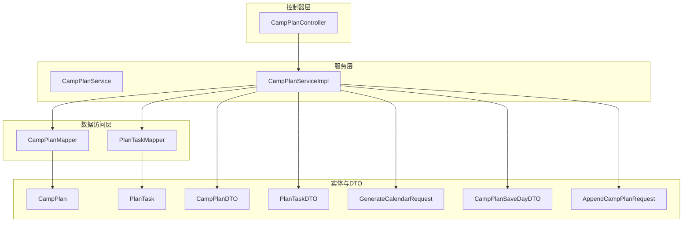
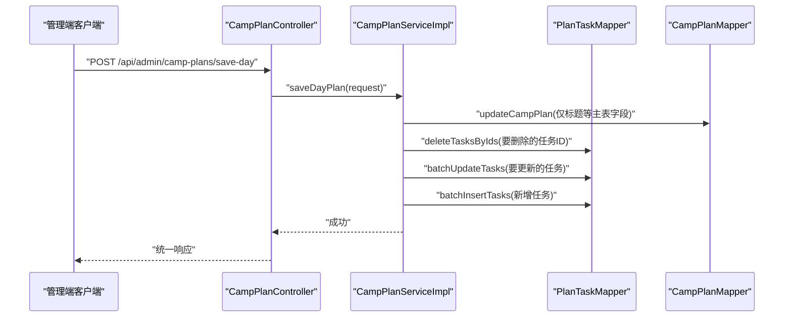
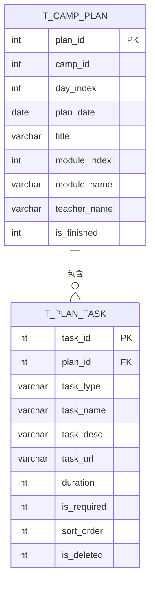
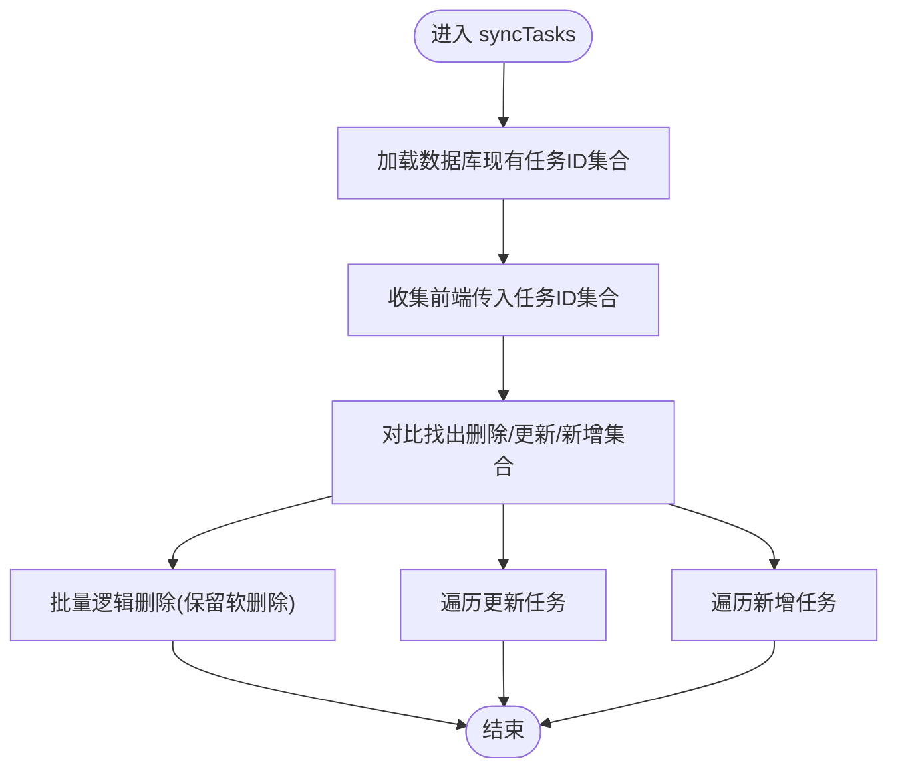
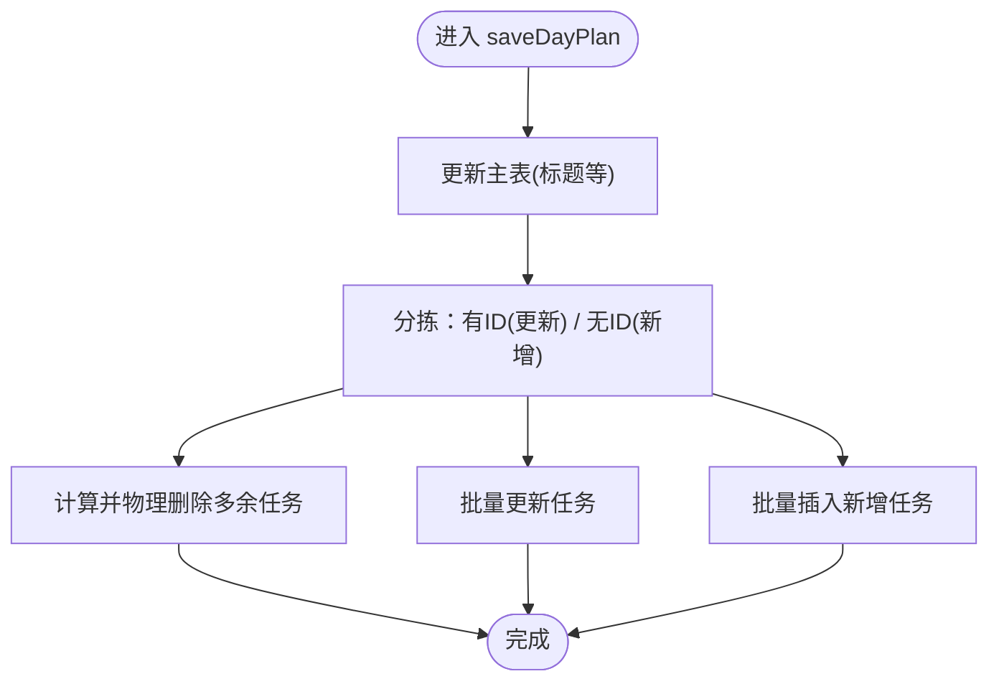
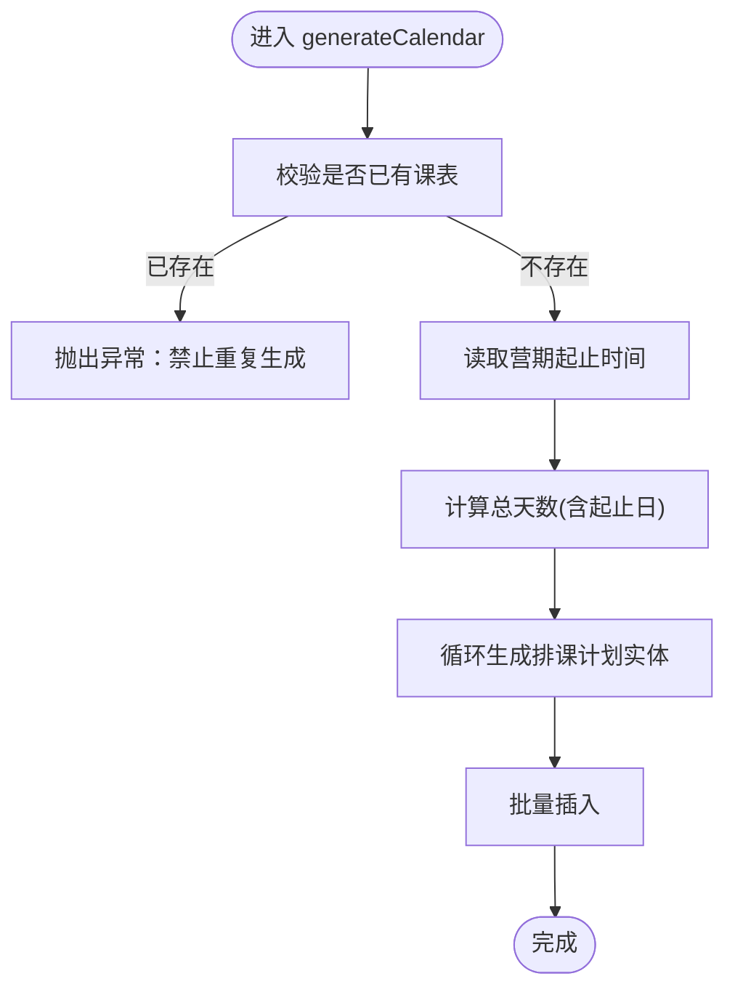
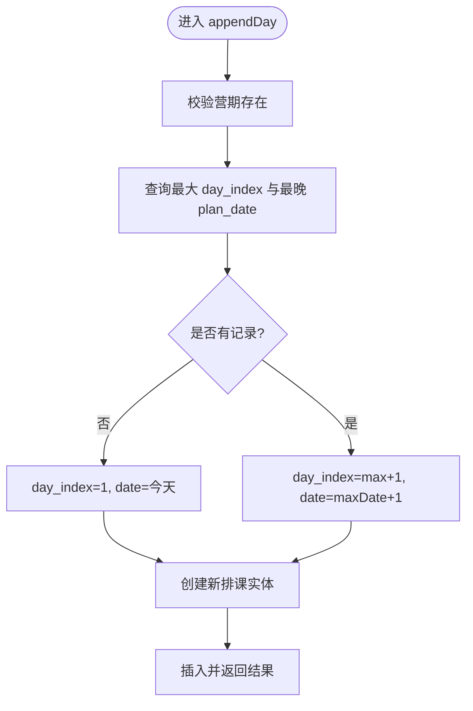
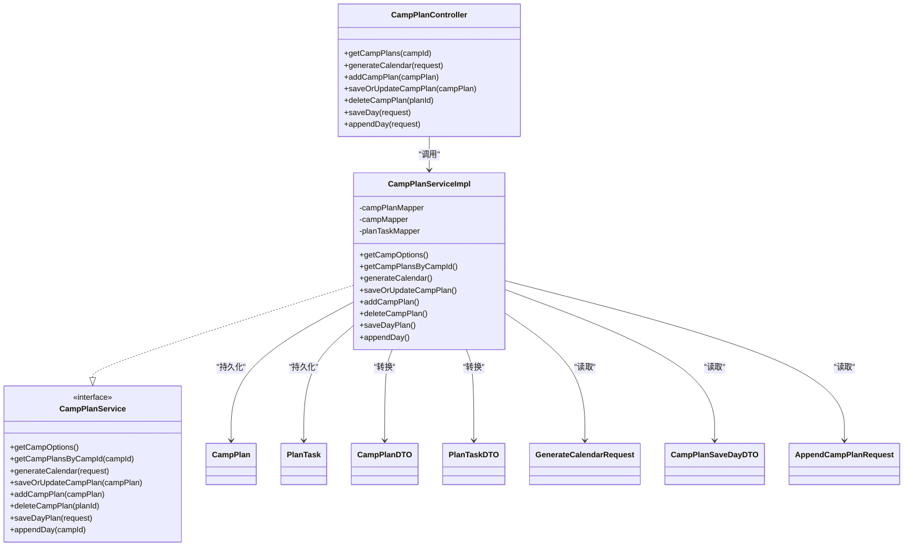
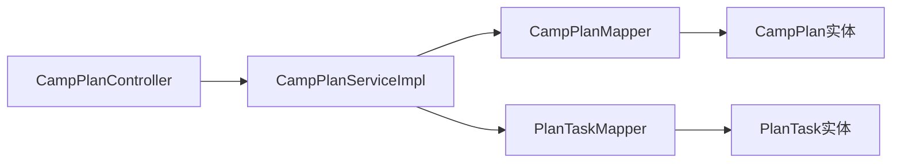

# 教务排课接口

<cite>
**本文引用的文件**
- [CampPlanController.java](file://src/main/java/com/daily/dailychineseculture/controller/CampPlanController.java)
- [CampPlanService.java](file://src/main/java/com/daily/dailychineseculture/service/CampPlanService.java)
- [CampPlanServiceImpl.java](file://src/main/java/com/daily/dailychineseculture/service/impl/CampPlanServiceImpl.java)
- [CampPlanDTO.java](file://src/main/java/com/daily/dailychineseculture/dto/CampPlanDTO.java)
- [CampPlanAddDayDTO.java](file://src/main/java/com/daily/dailychineseculture/dto/CampPlanAddDayDTO.java)
- [GenerateCalendarRequest.java](file://src/main/java/com/daily/dailychineseculture/dto/GenerateCalendarRequest.java)
- [CampPlanSaveDayDTO.java](file://src/main/java/com/daily/dailychineseculture/dto/CampPlanSaveDayDTO.java)
- [AppendCampPlanRequest.java](file://src/main/java/com/daily/dailychineseculture/dto/AppendCampPlanRequest.java)
- [PlanTaskDTO.java](file://src/main/java/com/daily/dailychineseculture/dto/PlanTaskDTO.java)
- [CampPlan.java](file://src/main/java/com/daily/dailychineseculture/entity/CampPlan.java)
- [PlanTask.java](file://src/main/java/com/daily/dailychineseculture/entity/PlanTask.java)
- [CampPlanMapper.java](file://src/main/java/com/daily/dailychineseculture/mapper/CampPlanMapper.java)
- [PlanTaskMapper.java](file://src/main/java/com/daily/dailychineseculture/mapper/PlanTaskMapper.java)
- [CampPlanMapper.xml](file://src/main/resources/mapper/CampPlanMapper.xml)
- [PlanTaskMapper.xml](file://src/main/resources/mapper/PlanTaskMapper.xml)
- [BusinessException.java](file://src/main/java/com/daily/dailychineseculture/common/BusinessException.java)
- [GlobalExceptionHandler.java](file://src/main/java/com/daily/dailychineseculture/common/GlobalExceptionHandler.java)
</cite>

## 目录
1. [简介](#简介)
2. [项目结构](#项目结构)
3. [核心组件](#核心组件)
4. [架构总览](#架构总览)
5. [详细组件分析](#详细组件分析)
6. [依赖分析](#依赖分析)
7. [性能考虑](#性能考虑)
8. [故障排查指南](#故障排查指南)
9. [结论](#结论)
10. [附录](#附录)

## 简介
本文件面向教务排课系统，聚焦管理后台的排课计划管理、日历生成、任务调度与时间轴管理等核心能力，提供完整的接口规范、请求参数与响应格式说明；并从算法实现与事务一致性角度解析“全删全插”“聚合保存”“追加排课”等关键流程，给出性能优化与权限控制建议，以及统计分析与报表生成的扩展思路。

## 项目结构
围绕排课模块的关键文件组织如下：
- 控制器层：CampPlanController 提供对外 HTTP 接口
- 服务层：CampPlanService 定义业务契约，CampPlanServiceImpl 实现具体逻辑
- 数据传输对象：CampPlanDTO、PlanTaskDTO、GenerateCalendarRequest、CampPlanSaveDayDTO、AppendCampPlanRequest
- 实体与映射：CampPlan、PlanTask 及其 MyBatis 映射文件
- 数据访问层：CampPlanMapper、PlanTaskMapper

图表来源
- [CampPlanController.java:1-115](file://src/main/java/com/daily/dailychineseculture/controller/CampPlanController.java#L1-L115)
- [CampPlanService.java:1-70](file://src/main/java/com/daily/dailychineseculture/service/CampPlanService.java#L1-L70)
- [CampPlanServiceImpl.java:1-370](file://src/main/java/com/daily/dailychineseculture/service/impl/CampPlanServiceImpl.java#L1-L370)
- [CampPlanMapper.java:1-109](file://src/main/java/com/daily/dailychineseculture/mapper/CampPlanMapper.java#L1-L109)
- [PlanTaskMapper.java:1-137](file://src/main/java/com/daily/dailychineseculture/mapper/PlanTaskMapper.java#L1-L137)
- [CampPlan.java:1-59](file://src/main/java/com/daily/dailychineseculture/entity/CampPlan.java#L1-L59)
- [PlanTask.java:1-70](file://src/main/java/com/daily/dailychineseculture/entity/PlanTask.java#L1-L70)
- [CampPlanDTO.java:1-44](file://src/main/java/com/daily/dailychineseculture/dto/CampPlanDTO.java#L1-L44)
- [PlanTaskDTO.java:1-38](file://src/main/java/com/daily/dailychineseculture/dto/PlanTaskDTO.java#L1-L38)
- [GenerateCalendarRequest.java:1-15](file://src/main/java/com/daily/dailychineseculture/dto/GenerateCalendarRequest.java#L1-L15)
- [CampPlanSaveDayDTO.java:1-62](file://src/main/java/com/daily/dailychineseculture/dto/CampPlanSaveDayDTO.java#L1-L62)
- [AppendCampPlanRequest.java:1-15](file://src/main/java/com/daily/dailychineseculture/dto/AppendCampPlanRequest.java#L1-L15)

章节来源
- [CampPlanController.java:1-115](file://src/main/java/com/daily/dailychineseculture/controller/CampPlanController.java#L1-L115)
- [CampPlanService.java:1-70](file://src/main/java/com/daily/dailychineseculture/service/CampPlanService.java#L1-L70)
- [CampPlanServiceImpl.java:1-370](file://src/main/java/com/daily/dailychineseculture/service/impl/CampPlanServiceImpl.java#L1-L370)

## 核心组件
- 排课计划实体与DTO：CampPlan、CampPlanDTO
- 任务实体与DTO：PlanTask、PlanTaskDTO
- 日历生成请求：GenerateCalendarRequest
- 单日聚合保存请求：CampPlanSaveDayDTO
- 追加排课请求：AppendCampPlanRequest
- 控制器与服务：CampPlanController、CampPlanService、CampPlanServiceImpl
- 数据访问：CampPlanMapper、PlanTaskMapper 及 XML 映射

章节来源
- [CampPlan.java:1-59](file://src/main/java/com/daily/dailychineseculture/entity/CampPlan.java#L1-L59)
- [PlanTask.java:1-70](file://src/main/java/com/daily/dailychineseculture/entity/PlanTask.java#L1-L70)
- [CampPlanDTO.java:1-44](file://src/main/java/com/daily/dailychineseculture/dto/CampPlanDTO.java#L1-L44)
- [PlanTaskDTO.java:1-38](file://src/main/java/com/daily/dailychineseculture/dto/PlanTaskDTO.java#L1-L38)
- [GenerateCalendarRequest.java:1-15](file://src/main/java/com/daily/dailychineseculture/dto/GenerateCalendarRequest.java#L1-L15)
- [CampPlanSaveDayDTO.java:1-62](file://src/main/java/com/daily/dailychineseculture/dto/CampPlanSaveDayDTO.java#L1-L62)
- [AppendCampPlanRequest.java:1-15](file://src/main/java/com/daily/dailychineseculture/dto/AppendCampPlanRequest.java#L1-L15)
- [CampPlanMapper.java:1-109](file://src/main/java/com/daily/dailychineseculture/mapper/CampPlanMapper.java#L1-L109)
- [PlanTaskMapper.java:1-137](file://src/main/java/com/daily/dailychineseculture/mapper/PlanTaskMapper.java#L1-L137)

## 架构总览
排课模块遵循经典的分层架构：控制器负责接收请求与返回统一响应；服务层编排业务规则与事务；数据访问层通过 MyBatis 访问数据库。核心流程包括：
- 日历生成：基于营期起止时间生成连续天数的排课计划框架
- 单日聚合保存：主表更新 + 全量同步任务（物理删除旧任务，批量插入新任务）
- 全量任务同步：根据前端传入的任务集合，区分新增/更新/删除
- 追加排课：在现有营期基础上顺延一天生成新排课

图表来源
- [CampPlanController.java:96-100](file://src/main/java/com/daily/dailychineseculture/controller/CampPlanController.java#L96-L100)
- [CampPlanServiceImpl.java:262-314](file://src/main/java/com/daily/dailychineseculture/service/impl/CampPlanServiceImpl.java#L262-L314)
- [PlanTaskMapper.java:129-135](file://src/main/java/com/daily/dailychineseculture/mapper/PlanTaskMapper.java#L129-L135)
- [PlanTaskMapper.xml:211-229](file://src/main/resources/mapper/PlanTaskMapper.xml#L211-L229)

## 详细组件分析

### 接口清单与规范

- 获取营期排课时间轴
  - 方法：GET
  - 路径：/api/admin/camp-plans
  - 查询参数：campId(Integer)
  - 返回：统一响应包裹排课计划列表（每项包含任务列表）
  - 说明：按 dayIndex 升序返回，每个计划包含其下全部任务

- 一键生成空日历
  - 方法：POST
  - 路径：/api/admin/camp-plans/generate
  - 请求体：GenerateCalendarRequest
  - 返回：统一响应
  - 说明：校验营期是否已有课表，若无则按起止日期生成连续天数的空排课计划

- 新增一天排课
  - 方法：POST
  - 路径：/api/admin/camp-plans
  - 请求体：CampPlanDTO（包含 campId、dayIndex、planDate、title 等）
  - 返回：统一响应，包含新增后的排课计划（含 planId）

- 保存/更新单日课表
  - 方法：PUT
  - 路径：/api/admin/camp-plans
  - 请求体：CampPlanDTO（包含 planId、tasks 等）
  - 返回：统一响应
  - 说明：更新排课基本信息并全量同步任务列表

- 删除整天排课
  - 方法：DELETE
  - 路径：/api/admin/camp-plans/{planId}
  - 路径参数：planId(Integer)
  - 返回：统一响应
  - 说明：直接删除排课计划，数据库约束自动清理任务

- 保存单日排课（聚合）
  - 方法：PUT
  - 路径：/api/admin/camp-plans/save-day
  - 请求体：CampPlanSaveDayDTO
  - 返回：统一响应
  - 说明：主表更新 + 全删全插策略同步任务

- 追加一天排课
  - 方法：POST
  - 路径：/api/admin/camp-plans/append
  - 请求体：AppendCampPlanRequest
  - 返回：统一响应，包含新增的排课计划（含 planId）

章节来源
- [CampPlanController.java:36-113](file://src/main/java/com/daily/dailychineseculture/controller/CampPlanController.java#L36-L113)
- [GenerateCalendarRequest.java:1-15](file://src/main/java/com/daily/dailychineseculture/dto/GenerateCalendarRequest.java#L1-L15)
- [CampPlanSaveDayDTO.java:1-62](file://src/main/java/com/daily/dailychineseculture/dto/CampPlanSaveDayDTO.java#L1-L62)
- [AppendCampPlanRequest.java:1-15](file://src/main/java/com/daily/dailychineseculture/dto/AppendCampPlanRequest.java#L1-L15)

### 数据模型与关系

图表来源
- [CampPlan.java:1-59](file://src/main/java/com/daily/dailychineseculture/entity/CampPlan.java#L1-L59)
- [PlanTask.java:1-70](file://src/main/java/com/daily/dailychineseculture/entity/PlanTask.java#L1-L70)
- [CampPlanMapper.xml:14-25](file://src/main/resources/mapper/CampPlanMapper.xml#L14-L25)
- [PlanTaskMapper.xml:67-81](file://src/main/resources/mapper/PlanTaskMapper.xml#L67-L81)

### 关键流程与算法

- 全量任务同步（syncTasks）
  - 目标：以前端传入的任务集合为准，保持数据库与前端一致
  - 策略：
    - 收集数据库中现有任务ID集合
    - 计算前端传入的任务ID集合
    - 对比找出需删除（数据库有、前端无）、需更新（前端有ID）、需新增（前端无ID）三类
    - 先逻辑删除不再需要的任务，再批量更新/插入
  - 复杂度：O(n+m+k)，n/m/k 分别为旧任务数、新任务数、删除任务数

图表来源
- [CampPlanServiceImpl.java:137-172](file://src/main/java/com/daily/dailychineseculture/service/impl/CampPlanServiceImpl.java#L137-L172)
- [PlanTaskMapper.java:112-116](file://src/main/java/com/daily/dailychineseculture/mapper/PlanTaskMapper.java#L112-L116)
- [PlanTaskMapper.xml:173-181](file://src/main/resources/mapper/PlanTaskMapper.xml#L173-L181)

- 单日聚合保存（saveDayPlan）
  - 步骤：
    1) 更新主表（仅标题等必要字段）
    2) 分拣：有ID → 更新；无ID → 新增
    3) 计算待删除ID集合并物理删除
    4) 批量更新与批量插入
  - 优势：保证前后端任务集合完全一致，避免遗漏或冗余

图表来源
- [CampPlanServiceImpl.java:262-314](file://src/main/java/com/daily/dailychineseculture/service/impl/CampPlanServiceImpl.java#L262-L314)
- [PlanTaskMapper.java:129-135](file://src/main/java/com/daily/dailychineseculture/mapper/PlanTaskMapper.java#L129-L135)
- [PlanTaskMapper.xml:211-229](file://src/main/resources/mapper/PlanTaskMapper.xml#L211-L229)

- 日历生成（generateCalendar）
  - 步骤：
    1) 校验营期是否已有课表
    2) 读取营期起止时间，计算总天数
    3) 循环生成连续天数的排课计划实体
    4) 批量插入
  - 注意：若起止时间不合法将抛出异常

图表来源
- [CampPlanServiceImpl.java:66-107](file://src/main/java/com/daily/dailychineseculture/service/impl/CampPlanServiceImpl.java#L66-L107)
- [CampPlanMapper.java:48-53](file://src/main/java/com/daily/dailychineseculture/mapper/CampPlanMapper.java#L48-L53)
- [CampPlanMapper.xml:34-41](file://src/main/resources/mapper/CampPlanMapper.xml#L34-L41)

- 追加排课（appendDay）
  - 步骤：
    1) 校验营期存在性
    2) 查询最大 day_index 与最晚 plan_date
    3) 计算新 day_index 与 plan_date（顺延一天）
    4) 插入新排课并返回结果
  - 说明：若营期无记录，则 day_index=1，plan_date=当日

图表来源
- [CampPlanServiceImpl.java:319-368](file://src/main/java/com/daily/dailychineseculture/service/impl/CampPlanServiceImpl.java#L319-L368)
- [CampPlanMapper.java:25-31](file://src/main/java/com/daily/dailychineseculture/mapper/CampPlanMapper.java#L25-L31)
- [CampPlanMapper.xml:100-114](file://src/main/resources/mapper/CampPlanMapper.xml#L100-L114)

### 类关系图

图表来源
- [CampPlanController.java:1-115](file://src/main/java/com/daily/dailychineseculture/controller/CampPlanController.java#L1-L115)
- [CampPlanService.java:1-70](file://src/main/java/com/daily/dailychineseculture/service/CampPlanService.java#L1-L70)
- [CampPlanServiceImpl.java:1-370](file://src/main/java/com/daily/dailychineseculture/service/impl/CampPlanServiceImpl.java#L1-L370)
- [CampPlan.java:1-59](file://src/main/java/com/daily/dailychineseculture/entity/CampPlan.java#L1-L59)
- [PlanTask.java:1-70](file://src/main/java/com/daily/dailychineseculture/entity/PlanTask.java#L1-L70)
- [CampPlanDTO.java:1-44](file://src/main/java/com/daily/dailychineseculture/dto/CampPlanDTO.java#L1-L44)
- [PlanTaskDTO.java:1-38](file://src/main/java/com/daily/dailychineseculture/dto/PlanTaskDTO.java#L1-L38)
- [GenerateCalendarRequest.java:1-15](file://src/main/java/com/daily/dailychineseculture/dto/GenerateCalendarRequest.java#L1-L15)
- [CampPlanSaveDayDTO.java:1-62](file://src/main/java/com/daily/dailychineseculture/dto/CampPlanSaveDayDTO.java#L1-L62)
- [AppendCampPlanRequest.java:1-15](file://src/main/java/com/daily/dailychineseculture/dto/AppendCampPlanRequest.java#L1-L15)

## 依赖分析
- 控制器依赖服务实现，服务实现依赖 Mapper，Mapper 依赖实体与 XML 映射
- 事务边界：所有写操作均在服务层以事务包裹，确保一致性
- 数据一致性：
  - 删除排课时依赖数据库外键级联删除任务
  - 任务同步采用“全删全插”或“逻辑删除+增量更新”，避免脏数据
- 查询路径：
  - 获取营期排课时间轴：CampPlanMapper.selectCampPlansByCampId → PlanTaskMapper.selectTasksByPlanId
  - C端任务视图：PlanTaskMapper.selectTaskItemsByPlanIdAndUserId（结合用户完成记录）

图表来源
- [CampPlanController.java:25-25](file://src/main/java/com/daily/dailychineseculture/controller/CampPlanController.java#L25-L25)
- [CampPlanServiceImpl.java:36-38](file://src/main/java/com/daily/dailychineseculture/service/impl/CampPlanServiceImpl.java#L36-L38)
- [CampPlanMapper.java:1-109](file://src/main/java/com/daily/dailychineseculture/mapper/CampPlanMapper.java#L1-L109)
- [PlanTaskMapper.java:1-137](file://src/main/java/com/daily/dailychineseculture/mapper/PlanTaskMapper.java#L1-L137)

章节来源
- [CampPlanMapper.java:1-109](file://src/main/java/com/daily/dailychineseculture/mapper/CampPlanMapper.java#L1-L109)
- [PlanTaskMapper.java:1-137](file://src/main/java/com/daily/dailychineseculture/mapper/PlanTaskMapper.java#L1-L137)
- [CampPlanMapper.xml:1-134](file://src/main/resources/mapper/CampPlanMapper.xml#L1-L134)
- [PlanTaskMapper.xml:1-232](file://src/main/resources/mapper/PlanTaskMapper.xml#L1-L232)

## 性能考虑
- 批量操作
  - 日历生成：使用批量插入减少往返次数
  - 任务同步：批量删除、批量更新、批量插入，降低网络与SQL开销
- 查询优化
  - 按 day_index 升序返回，便于前端渲染时间轴
  - C端任务查询使用 LEFT JOIN 并按 sort_order 排序，避免额外排序
- 事务与锁
  - 写操作均在事务内执行，保证原子性
  - 若并发较高，可在业务层面增加幂等校验（如按 planId 去重）
- 缓存建议
  - 营期基础信息可缓存，减少频繁查询
  - 任务统计类接口可引入短期缓存（如必做任务数、完成率）

## 故障排查指南
- “该营期已存在课表，请勿重复生成”
  - 现象：调用日历生成接口报错
  - 原因：已存在排课记录
  - 处理：确认是否需要先清理旧课表或调整业务流程

- “未找到指定的营期”
  - 现象：生成日历/追加排课/新增排课时报错
  - 原因：campId 无效或不存在
  - 处理：核对营期ID与数据库记录

- “开营时间必须早于或等于结营时间”
  - 现象：生成日历时报错
  - 原因：起止时间非法
  - 处理：修正营期起止时间

- 任务未生效或重复
  - 现象：调用保存单日课表后任务缺失或重复
  - 原因：前端未传入完整任务集合或ID不匹配
  - 处理：确保传入完整任务列表，新增任务ID为空，更新任务ID非空

- 删除失败或残留任务
  - 现象：删除整日排课后仍有任务
  - 原因：数据库约束或事务未提交
  - 处理：确认外键约束与事务配置，重试删除

章节来源
- [CampPlanServiceImpl.java:71-81](file://src/main/java/com/daily/dailychineseculture/service/impl/CampPlanServiceImpl.java#L71-L81)
- [CampPlanServiceImpl.java:196-201](file://src/main/java/com/daily/dailychineseculture/service/impl/CampPlanServiceImpl.java#L196-L201)
- [CampPlanServiceImpl.java:237-242](file://src/main/java/com/daily/dailychineseculture/service/impl/CampPlanServiceImpl.java#L237-L242)
- [CampPlanServiceImpl.java:137-172](file://src/main/java/com/daily/dailychineseculture/service/impl/CampPlanServiceImpl.java#L137-L172)

## 结论
本排课模块以清晰的分层设计与严格的事务控制保障了数据一致性，通过“全删全插”“聚合保存”等策略实现了与前端任务集合的强同步。接口覆盖了从日历生成到单日维护再到追加排课的完整生命周期，适合在管理后台进行高效排课治理。后续可在缓存、并发控制与统计报表方面进一步增强。

## 附录

### 接口测试方法
- 使用统一响应包装：所有接口返回值均封装在统一响应结构中，便于前端处理与错误识别
- 建议测试步骤：
  - 生成日历：传入有效 campId，断言返回成功且 t_camp_plan 中生成相应天数记录
  - 新增/更新单日：构造带任务的 CampPlanDTO，验证任务全量同步
  - 聚合保存：构造 CampPlanSaveDayDTO，验证删除/更新/新增任务行为
  - 追加排课：多次调用，验证 day_index 与 plan_date 递增
  - 删除排课：验证级联删除任务

### 权限控制与数据一致性
- 权限控制：控制器层通常由拦截器或安全框架保护，建议在控制器与服务层均进行参数校验与资源归属校验
- 数据一致性：
  - 事务边界：写操作均在服务层事务内执行
  - 约束：删除排课依赖数据库外键约束自动清理任务
  - 同步策略：全删全插与逻辑删除，避免脏数据

### 统计分析与报表
- 可扩展点：
  - 基于 t_plan_task 的统计：必做任务数、完成率、平均时长等
  - 报表维度：按营期、按天、按任务类型、按讲师等
  - 建议：在 PlanTaskMapper 中新增统计查询 SQL，并在服务层封装统计接口