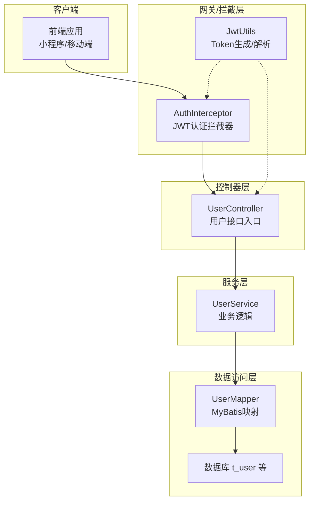
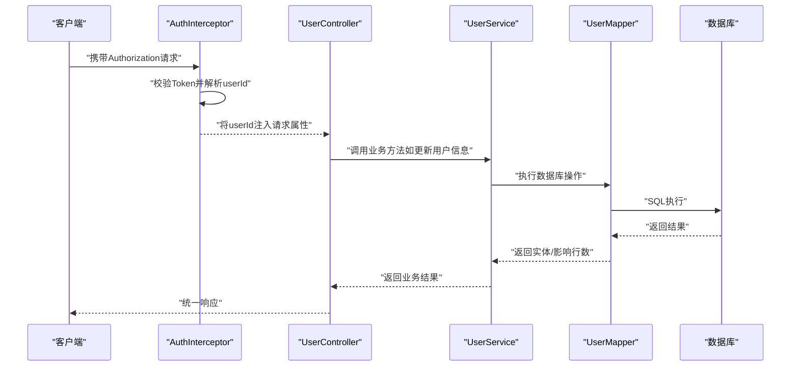
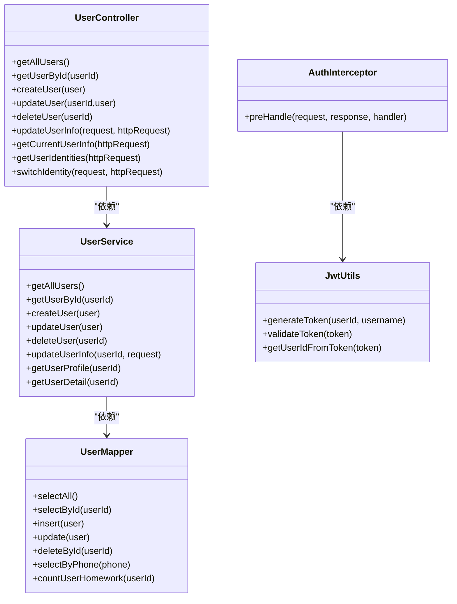

# 用户管理接口

<cite>
**本文引用的文件**
- [UserController.java](file://src/main/java/com/daily/dailychineseculture/controller/UserController.java)
- [UserService.java](file://src/main/java/com/daily/dailychineseculture/service/UserService.java)
- [UserMapper.java](file://src/main/java/com/daily/dailychineseculture/mapper/UserMapper.java)
- [User.java](file://src/main/java/com/daily/dailychineseculture/entity/User.java)
- [UserUpdateRequest.java](file://src/main/java/com/daily/dailychineseculture/dto/UserUpdateRequest.java)
- [UserUpdateAllRequest.java](file://src/main/java/com/daily/dailychineseculture/dto/UserUpdateAllRequest.java)
- [UserDetailDTO.java](file://src/main/java/com/daily/dailychineseculture/dto/UserDetailDTO.java)
- [UserProfileDTO.java](file://src/main/java/com/daily/dailychineseculture/dto/UserProfileDTO.java)
- [UserStatsItem.java](file://src/main/java/com/daily/dailychineseculture/dto/UserStatsItem.java)
- [AuthInterceptor.java](file://src/main/java/com/daily/dailychineseculture/interceptor/AuthInterceptor.java)
- [JwtUtils.java](file://src/main/java/com/daily/dailychineseculture/util/JwtUtils.java)
- [用户个人信息 API文档.md](file://doc/用户个人信息 API文档.md)
- [用户个人资料详情 API文档.md](file://doc/用户个人资料详情 API文档.md)
- [用户信息更新 API文档.md](file://doc/用户信息更新 API文档.md)
- [登录接口API文档.md](file://doc/登录接口API文档.md)
- [UserDetailApiTest.java](file://src/test/java/com/daily/dailychineseculture/UserDetailApiTest.java)
- [UserProfileApiTest.java](file://src/test/java/com/daily/dailychineseculture/UserProfileApiTest.java)
</cite>

## 目录
1. [简介](#简介)
2. [项目结构](#项目结构)
3. [核心组件](#核心组件)
4. [架构总览](#架构总览)
5. [详细组件分析](#详细组件分析)
6. [依赖分析](#依赖分析)
7. [性能考量](#性能考量)
8. [故障排查指南](#故障排查指南)
9. [结论](#结论)
10. [附录](#附录)

## 简介
本文件为“用户管理接口”的完整API文档，覆盖用户信息查询、个人资料编辑、头像上传配合更新等能力。重点接口包括：
- 用户信息查询：获取当前登录用户的基本信息与统计指标
- 个人资料详情：获取完整资料与保存修改
- 用户信息更新：完善或更新头像、手机号、性别、生日、地域、职业等字段
- 权限控制与安全：基于JWT的认证拦截、手机号唯一性校验、事务一致性保障
- 错误码与异常处理：统一返回结构与错误码定义
- 接口调用示例与常见问题

## 项目结构
后端采用经典的三层架构：Controller（控制器）、Service（服务层）、Mapper（数据访问）。用户相关接口主要分布在UserController与UserService中，配合JWT拦截器与工具类实现认证与授权。

图表来源
- [UserController.java:1-223](file://src/main/java/com/daily/dailychineseculture/controller/UserController.java#L1-223)
- [UserService.java:1-959](file://src/main/java/com/daily/dailychineseculture/service/UserService.java#L1-959)
- [UserMapper.java:1-252](file://src/main/java/com/daily/dailychineseculture/mapper/UserMapper.java#L1-252)
- [AuthInterceptor.java:1-74](file://src/main/java/com/daily/dailychineseculture/interceptor/AuthInterceptor.java#L1-74)
- [JwtUtils.java:1-206](file://src/main/java/com/daily/dailychineseculture/util/JwtUtils.java#L1-206)

章节来源
- [UserController.java:1-223](file://src/main/java/com/daily/dailychineseculture/controller/UserController.java#L1-223)
- [UserService.java:1-959](file://src/main/java/com/daily/dailychineseculture/service/UserService.java#L1-959)
- [UserMapper.java:1-252](file://src/main/java/com/daily/dailychineseculture/mapper/UserMapper.java#L1-252)
- [AuthInterceptor.java:1-74](file://src/main/java/com/daily/dailychineseculture/interceptor/AuthInterceptor.java#L1-74)
- [JwtUtils.java:1-206](file://src/main/java/com/daily/dailychineseculture/util/JwtUtils.java#L1-206)

## 核心组件
- 控制器：UserController 提供用户信息查询、资料更新、当前用户状态等接口
- 服务层：UserService 实现业务逻辑，包括信息更新、资料详情、个人信息统计等
- 数据访问：UserMapper 提供用户数据的增删改查与统计查询
- 认证拦截：AuthInterceptor + JwtUtils 实现JWT认证与用户ID注入
- DTO模型：UserUpdateRequest、UserUpdateAllRequest、UserDetailDTO、UserProfileDTO等承载请求与响应数据

章节来源
- [UserController.java:1-223](file://src/main/java/com/daily/dailychineseculture/controller/UserController.java#L1-223)
- [UserService.java:1-959](file://src/main/java/com/daily/dailychineseculture/service/UserService.java#L1-959)
- [UserMapper.java:1-252](file://src/main/java/com/daily/dailychineseculture/mapper/UserMapper.java#L1-252)
- [UserUpdateRequest.java:1-42](file://src/main/java/com/daily/dailychineseculture/dto/UserUpdateRequest.java#L1-42)
- [UserUpdateAllRequest.java:1-52](file://src/main/java/com/daily/dailychineseculture/dto/UserUpdateAllRequest.java#L1-52)
- [UserDetailDTO.java:1-57](file://src/main/java/com/daily/dailychineseculture/dto/UserDetailDTO.java#L1-57)
- [UserProfileDTO.java:1-43](file://src/main/java/com/daily/dailychineseculture/dto/UserProfileDTO.java#L1-43)
- [UserStatsItem.java:1-22](file://src/main/java/com/daily/dailychineseculture/dto/UserStatsItem.java#L1-22)
- [AuthInterceptor.java:1-74](file://src/main/java/com/daily/dailychineseculture/interceptor/AuthInterceptor.java#L1-74)
- [JwtUtils.java:1-206](file://src/main/java/com/daily/dailychineseculture/util/JwtUtils.java#L1-206)

## 架构总览
用户管理接口遵循“请求-拦截-控制器-服务-数据访问-数据库”的标准调用链。认证拦截器在请求进入控制器前解析Authorization头，校验JWT有效性并将userId注入到请求属性中，控制器据此执行业务逻辑。

图表来源
- [AuthInterceptor.java:25-72](file://src/main/java/com/daily/dailychineseculture/interceptor/AuthInterceptor.java#L25-72)
- [UserController.java:102-142](file://src/main/java/com/daily/dailychineseculture/controller/UserController.java#L102-142)
- [UserService.java:656-723](file://src/main/java/com/daily/dailychineseculture/service/UserService.java#L656-723)
- [UserMapper.java:48-54](file://src/main/java/com/daily/dailychineseculture/mapper/UserMapper.java#L48-54)

## 详细组件分析

### 用户信息查询接口
- 接口名称：获取当前登录用户个人信息
- 请求方法：GET
- 路径：/user/me
- 认证：需要Authorization头（Bearer Token）
- 功能：返回用户基本信息与统计指标（地区、职业、注册年数、学时）

请求参数
- 请求头
  - Authorization: Bearer {token}
- 请求体：无

响应数据结构
- code: 状态码
- msg: 响应消息
- data: 用户信息对象（包含基本信息与统计列表）

字段说明
- userId: 用户ID
- account: 账号
- nickname: 昵称
- avatar: 头像URL
- currentIdentity: 当前身份（学员端/志愿者端）
- statsList: 统计指标列表，包含label与value

错误码
- 401: 未登录或登录已过期
- 500: 服务器内部错误

章节来源
- [用户个人信息 API文档.md:1-375](file://doc/用户个人信息 API文档.md#L1-375)
- [UserController.java:151-168](file://src/main/java/com/daily/dailychineseculture/controller/UserController.java#L151-168)
- [UserService.java:730-800](file://src/main/java/com/daily/dailychineseculture/service/UserService.java#L730-800)
- [UserProfileDTO.java:1-43](file://src/main/java/com/daily/dailychineseculture/dto/UserProfileDTO.java#L1-43)
- [UserStatsItem.java:1-22](file://src/main/java/com/daily/dailychineseculture/dto/UserStatsItem.java#L1-22)

### 个人资料详情接口
- 接口名称：获取个人完整资料
- 请求方法：GET
- 路径：/user/detail
- 认证：需要Authorization头（Bearer Token）
- 功能：返回用户完整资料（账号、昵称、头像、手机号、地区、职业、性别、生日、密码占位符）

请求参数
- 请求头
  - Authorization: Bearer {token}
- 请求体：无

响应数据结构
- code: 状态码
- msg: 响应消息
- data: UserDetailDTO对象

字段说明
- account: 账号（只读）
- nickname: 昵称
- avatar: 头像URL
- phone: 手机号
- region: 地区
- profession: 职业
- gender: 性别（0:未知，1:男，2:女）
- birthday: 生日（格式：yyyy-MM-dd）
- password: 密码占位符（始终为空字符串）

安全要求
- password字段必须返回空字符串，绝不能返回真实密码

章节来源
- [用户个人资料详情 API文档.md:1-548](file://doc/用户个人资料详情 API文档.md#L1-548)
- [UserController.java:1-223](file://src/main/java/com/daily/dailychineseculture/controller/UserController.java#L1-223)
- [UserDetailDTO.java:1-57](file://src/main/java/com/daily/dailychineseculture/dto/UserDetailDTO.java#L1-57)

### 保存/更新个人资料接口
- 接口名称：保存/更新个人资料
- 请求方法：POST
- 路径：/user/updateAll
- 认证：需要Authorization头（Bearer Token）
- 功能：接收全量字段并更新，支持条件更新密码

请求参数
- 请求头
  - Authorization: Bearer {token}
  - Content-Type: application/json
- 请求体：UserUpdateAllRequest对象

字段说明
- nickname: 昵称
- avatar: 头像URL
- password: 新密码（空字符串或null表示不修改）
- phone: 手机号
- region: 地区
- profession: 职业
- gender: 性别（0:未知，1:男，2:女）
- birthday: 生日（格式：yyyy-MM-dd）

安全逻辑
- password为空或null：跳过密码更新
- password非空：更新密码（当前为明文存储，建议后续使用加密）

章节来源
- [用户个人资料详情 API文档.md:69-131](file://doc/用户个人资料详情 API文档.md#L69-131)
- [UserUpdateAllRequest.java:1-52](file://src/main/java/com/daily/dailychineseculture/dto/UserUpdateAllRequest.java#L1-52)
- [UserService.java:322-349](file://src/main/java/com/daily/dailychineseculture/service/UserService.java#L322-349)

### 用户信息更新接口（完善信息）
- 接口名称：用户信息更新（完善信息）
- 请求方法：POST
- 路径：/user/update
- 认证：需要Authorization头（Bearer Token）
- 功能：更新头像、手机号、性别、生日、地域、职业等字段；手机号唯一性校验；事务一致性

请求参数
- 请求头
  - Authorization: Bearer {token}
  - Content-Type: application/json
- 请求体：UserUpdateRequest对象

字段说明
- avatar: 头像URL
- phone: 手机号（唯一约束）
- gender: 性别（0:未知，1:男，2:女）
- birthday: 生日（格式：yyyy-MM-dd）
- region: 地区
- profession: 职业

安全与校验
- 从Token解析userId，禁止前端传入user_id
- 手机号唯一性校验，避免重复绑定
- 事务保证更新一致性

错误码
- 401: 未登录或登录已过期
- 400: 手机号重复、用户不存在、参数校验失败
- 500: 服务器内部错误

章节来源
- [用户信息更新 API文档.md:1-449](file://doc/用户信息更新 API文档.md#L1-449)
- [UserUpdateRequest.java:1-42](file://src/main/java/com/daily/dailychineseculture/dto/UserUpdateRequest.java#L1-42)
- [UserController.java:102-142](file://src/main/java/com/daily/dailychineseculture/controller/UserController.java#L102-142)
- [UserService.java:656-723](file://src/main/java/com/daily/dailychineseculture/service/UserService.java#L656-723)

### 头像上传与更新流程
- 头像上传：建议使用通用文件上传接口（如/common/upload）返回URL
- 头像更新：调用“用户信息更新”接口，将avatar字段设置为上传返回的URL
- 更新成功后，前端可立即展示新头像

章节来源
- [用户信息更新 API文档.md:325-351](file://doc/用户信息更新 API文档.md#L325-351)

## 依赖分析
- 控制器依赖服务层：UserController依赖UserService执行业务逻辑
- 服务层依赖数据访问：UserService依赖UserMapper执行数据库操作
- 认证依赖：AuthInterceptor依赖JwtUtils解析Token并注入userId
- DTO依赖：各接口依赖对应的DTO对象承载请求/响应数据

图表来源
- [UserController.java:1-223](file://src/main/java/com/daily/dailychineseculture/controller/UserController.java#L1-223)
- [UserService.java:1-959](file://src/main/java/com/daily/dailychineseculture/service/UserService.java#L1-959)
- [UserMapper.java:1-252](file://src/main/java/com/daily/dailychineseculture/mapper/UserMapper.java#L1-252)
- [AuthInterceptor.java:1-74](file://src/main/java/com/daily/dailychineseculture/interceptor/AuthInterceptor.java#L1-74)
- [JwtUtils.java:1-206](file://src/main/java/com/daily/dailychineseculture/util/JwtUtils.java#L1-206)

## 性能考量
- 缓存策略：建议对用户基本信息与统计指标进行缓存，降低数据库压力
- SQL优化：为常用查询字段（如phone、user_id）建立索引
- 批量查询：如需同时展示多个用户信息，建议使用批量查询接口
- 事务控制：用户信息更新使用事务，保证一致性与原子性

## 故障排查指南
常见问题与解决方案
- Token无效或过期
  - 现象：返回401
  - 处理：重新登录获取新Token
- 手机号重复
  - 现象：返回400，提示“该手机号已被其他账号绑定”
  - 处理：更换其他手机号后重试
- 用户不存在
  - 现象：返回400
  - 处理：确认userId是否正确或联系管理员
- 生日格式错误
  - 现象：返回400
  - 处理：确保格式为“yyyy-MM-dd”
- 服务器内部错误
  - 现象：返回500
  - 处理：查看后端日志定位具体原因

章节来源
- [用户信息更新 API文档.md:354-449](file://doc/用户信息更新 API文档.md#L354-449)
- [用户个人资料详情 API文档.md:482-548](file://doc/用户个人资料详情 API文档.md#L482-548)
- [用户个人信息 API文档.md:289-296](file://doc/用户个人信息 API文档.md#L289-296)

## 结论
本文档系统性地梳理了用户管理接口的请求与响应规范、权限控制与安全机制、数据验证规则以及常见问题处理方案。通过JWT认证拦截、手机号唯一性校验与事务一致性保障，确保接口在安全性与稳定性方面具备良好实践。建议后续在密码存储上引入加密机制，并结合缓存与索引优化提升性能。

## 附录

### 接口调用示例（基于现有文档）
- 获取用户个人信息（GET /user/me）
  - 请求头：Authorization: Bearer {token}
  - 响应：包含用户基本信息与统计指标
- 获取个人资料详情（GET /user/detail）
  - 请求头：Authorization: Bearer {token}
  - 响应：包含账号、昵称、头像、手机号、地区、职业、性别、生日、密码占位符
- 保存个人资料（POST /user/updateAll）
  - 请求头：Authorization: Bearer {token}, Content-Type: application/json
  - 请求体：包含昵称、头像、密码（可选）、手机号、地区、职业、性别、生日
- 用户信息更新（POST /user/update）
  - 请求头：Authorization: Bearer {token}, Content-Type: application/json
  - 请求体：包含头像、手机号、性别、生日、地区、职业等字段

章节来源
- [用户个人信息 API文档.md:307-347](file://doc/用户个人信息 API文档.md#L307-347)
- [用户个人资料详情 API文档.md:402-478](file://doc/用户个人资料详情 API文档.md#L402-478)
- [用户信息更新 API文档.md:144-202](file://doc/用户信息更新 API文档.md#L144-202)