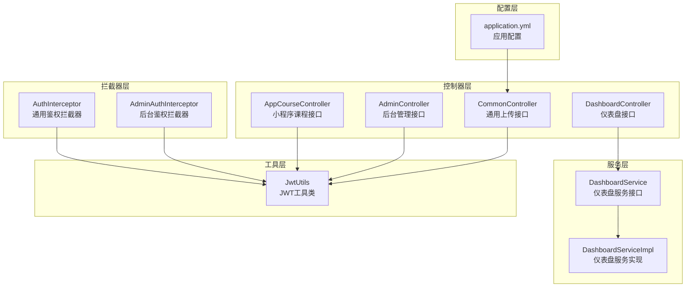
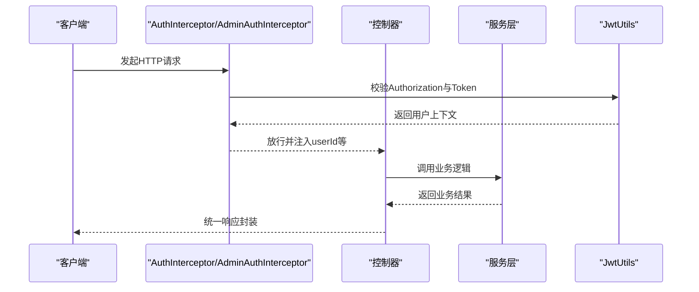
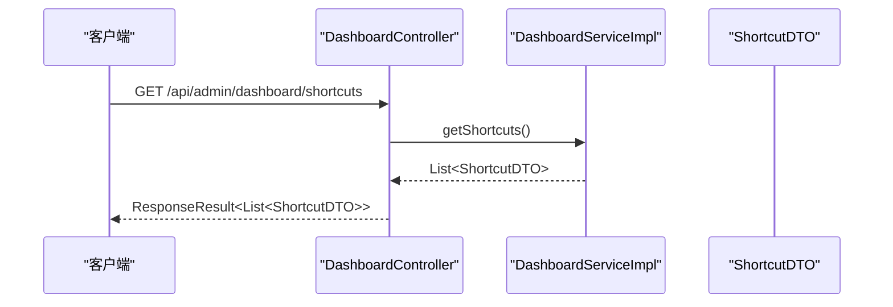
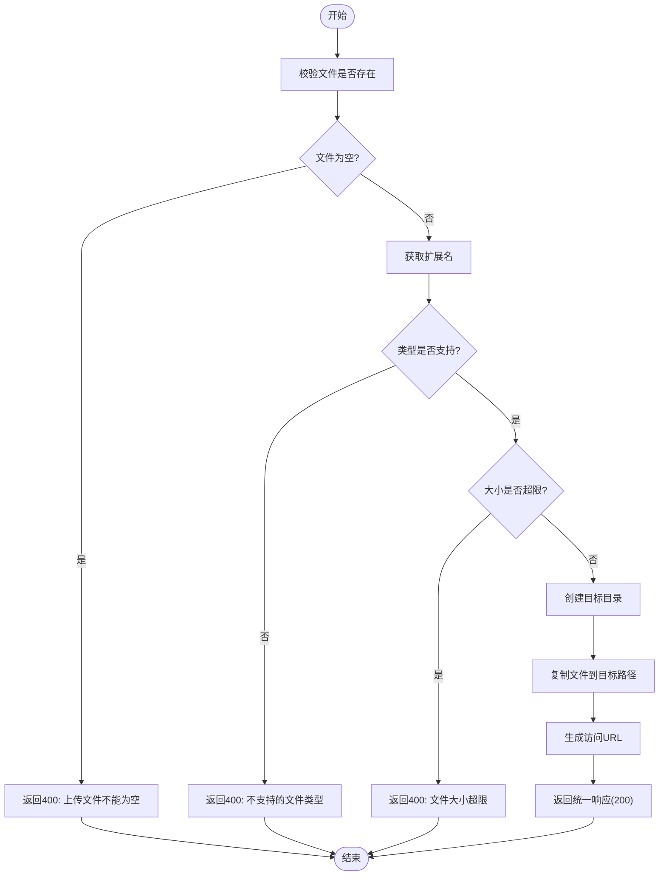
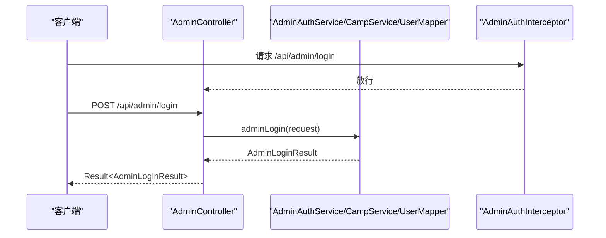
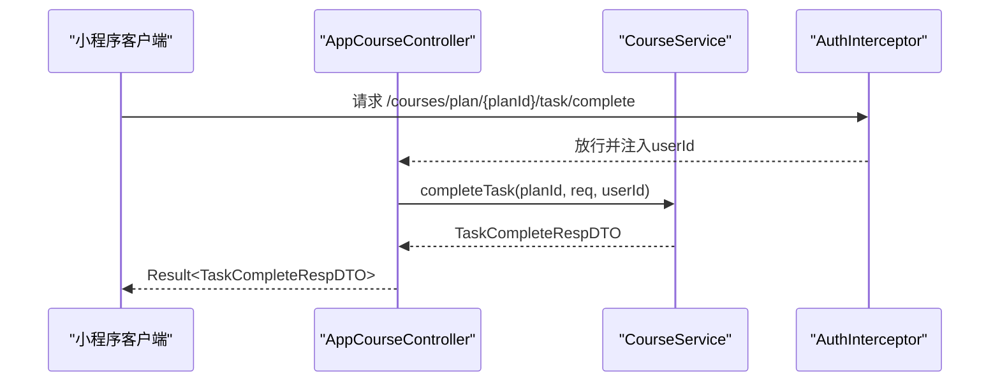
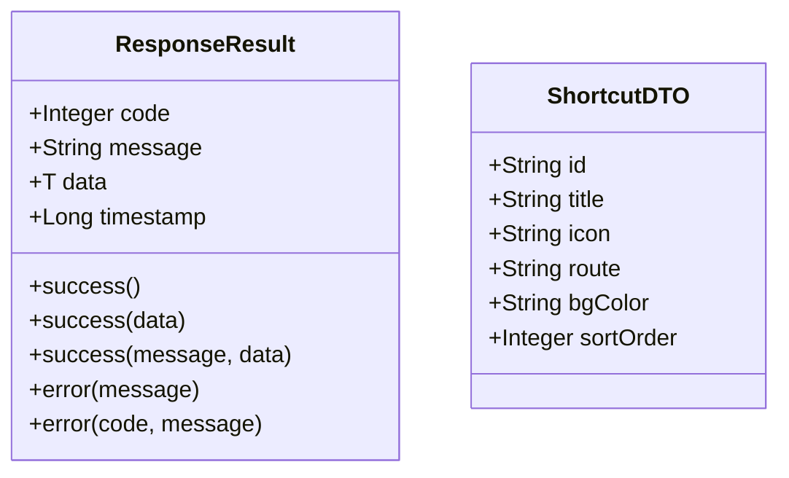
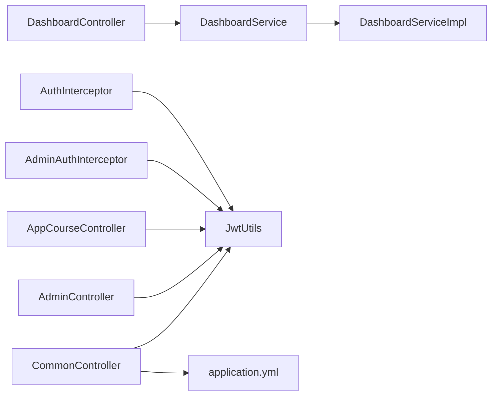

# 系统管理接口

<cite>
**本文引用的文件**
- [DashboardController.java](file://src/main/java/com/daily/dailychineseculture/controller/DashboardController.java)
- [CommonController.java](file://src/main/java/com/daily/dailychineseculture/controller/CommonController.java)
- [AdminController.java](file://src/main/java/com/daily/dailychineseculture/controller/AdminController.java)
- [AppCourseController.java](file://src/main/java/com/daily/dailychineseculture/controller/AppCourseController.java)
- [DashboardService.java](file://src/main/java/com/daily/dailychineseculture/service/DashboardService.java)
- [DashboardServiceImpl.java](file://src/main/java/com/daily/dailychineseculture/service/impl/DashboardServiceImpl.java)
- [DashboardServiceImpl.java](file://src/main/java/com/daily/dailychineseculture/service/impl/DashboardServiceImpl.java)
- [ShortcutDTO.java](file://src/main/java/com/daily/dailychineseculture/dto/ShortcutDTO.java)
- [AdminAuthInterceptor.java](file://src/main/java/com/daily/dailychineseculture/interceptor/AdminAuthInterceptor.java)
- [AuthInterceptor.java](file://src/main/java/com/daily/dailychineseculture/interceptor/AuthInterceptor.java)
- [JwtUtils.java](file://src/main/java/com/daily/dailychineseculture/util/JwtUtils.java)
- [ResponseResult.java](file://src/main/java/com/daily/dailychineseculture/common/ResponseResult.java)
- [application.yml](file://src/main/resources/application.yml)
- [API接口文档.md](file://doc/API接口文档.md)
- [文件上传 API文档.md](file://doc/文件上传 API文档.md)
- [仪表盘快捷入口 API文档.md](file://doc/仪表盘快捷入口 API文档.md)
</cite>

## 目录
1. [简介](#简介)
2. [项目结构](#项目结构)
3. [核心组件](#核心组件)
4. [架构总览](#架构总览)
5. [详细组件分析](#详细组件分析)
6. [依赖分析](#依赖分析)
7. [性能考虑](#性能考虑)
8. [故障排查指南](#故障排查指南)
9. [结论](#结论)
10. [附录](#附录)

## 简介
本文件面向系统管理相关接口的完整API文档，覆盖文件上传下载、仪表盘管理、小程序接口等系统级功能。重点说明文件上传下载、快捷入口管理、小程序数据交互等接口规范，并补充系统配置管理、数据导入导出、监控告警等管理功能接口的扩展建议；提供详细的接口参数、响应格式与安全考虑；分析系统接口的性能优化与扩展性设计；涵盖权限控制与审计日志机制；并给出接口集成指南与最佳实践建议。

## 项目结构
系统采用Spring Boot标准分层架构，主要模块如下：
- 控制器层：负责HTTP请求接入与响应封装
- 服务层：封装业务逻辑
- 拦截器层：统一鉴权与上下文注入
- 工具层：JWT工具类
- 配置层：应用配置与静态资源映射
- 文档：接口文档与使用说明

**图表来源**
- [DashboardController.java:17-35](file://src/main/java/com/daily/dailychineseculture/controller/DashboardController.java#L17-L35)
- [CommonController.java:22-99](file://src/main/java/com/daily/dailychineseculture/controller/CommonController.java#L22-L99)
- [AdminController.java:25-202](file://src/main/java/com/daily/dailychineseculture/controller/AdminController.java#L25-L202)
- [AppCourseController.java:26-116](file://src/main/java/com/daily/dailychineseculture/controller/AppCourseController.java#L26-L116)
- [DashboardService.java:10-19](file://src/main/java/com/daily/dailychineseculture/service/DashboardService.java#L10-L19)
- [DashboardServiceImpl.java:13-58](file://src/main/java/com/daily/dailychineseculture/service/impl/DashboardServiceImpl.java#L13-L58)
- [AdminAuthInterceptor.java:14-92](file://src/main/java/com/daily/dailychineseculture/interceptor/AdminAuthInterceptor.java#L14-L92)
- [AuthInterceptor.java:19-92](file://src/main/java/com/daily/dailychineseculture/interceptor/AuthInterceptor.java#L19-L92)
- [JwtUtils.java:25-242](file://src/main/java/com/daily/dailychineseculture/util/JwtUtils.java#L25-L242)
- [application.yml:29-32](file://src/main/resources/application.yml#L29-L32)

**章节来源**
- [DashboardController.java:17-35](file://src/main/java/com/daily/dailychineseculture/controller/DashboardController.java#L17-L35)
- [CommonController.java:22-99](file://src/main/java/com/daily/dailychineseculture/controller/CommonController.java#L22-L99)
- [AdminController.java:25-202](file://src/main/java/com/daily/dailychineseculture/controller/AdminController.java#L25-L202)
- [AppCourseController.java:26-116](file://src/main/java/com/daily/dailychineseculture/controller/AppCourseController.java#L26-L116)
- [application.yml:29-32](file://src/main/resources/application.yml#L29-L32)

## 核心组件
- 仪表盘快捷入口：提供后台仪表盘的快捷入口列表，当前为硬编码实现，未来可扩展为动态配置。
- 通用文件上传：支持头像与视频两类文件上传，具备类型与大小校验、目录创建与落盘、URL返回等功能。
- 后台管理接口：提供管理员登录、仪表盘最近活动课程、营期列表分页查询、营期类型选项、管理员资料查询与更新等接口。
- 小程序课程接口：提供课程目录、今日课程、任务完成打卡、课程数据看板、营期详情等接口，均依赖用户鉴权。
- 鉴权与拦截：提供通用鉴权拦截器与后台鉴权拦截器，统一从Header解析Authorization并校验JWT有效性，注入用户上下文。
- 统一响应：提供统一响应封装类，规范所有接口的响应结构。

**章节来源**
- [DashboardController.java:24-34](file://src/main/java/com/daily/dailychineseculture/controller/DashboardController.java#L24-L34)
- [CommonController.java:35-99](file://src/main/java/com/daily/dailychineseculture/controller/CommonController.java#L35-L99)
- [AdminController.java:38-201](file://src/main/java/com/daily/dailychineseculture/controller/AdminController.java#L38-L201)
- [AppCourseController.java:33-116](file://src/main/java/com/daily/dailychineseculture/controller/AppCourseController.java#L33-L116)
- [AuthInterceptor.java:30-91](file://src/main/java/com/daily/dailychineseculture/interceptor/AuthInterceptor.java#L30-L91)
- [AdminAuthInterceptor.java:23-82](file://src/main/java/com/daily/dailychineseculture/interceptor/AdminAuthInterceptor.java#L23-L82)
- [ResponseResult.java:8-79](file://src/main/java/com/daily/dailychineseculture/common/ResponseResult.java#L8-L79)

## 架构总览
系统采用前后端分离架构，接口通过RESTful风格暴露，统一由拦截器进行JWT鉴权，控制器层负责参数接收与响应封装，服务层承载业务逻辑，工具层提供JWT能力，配置层提供文件上传与数据库连接等基础能力。

**图表来源**
- [AuthInterceptor.java:30-91](file://src/main/java/com/daily/dailychineseculture/interceptor/AuthInterceptor.java#L30-L91)
- [AdminAuthInterceptor.java:23-82](file://src/main/java/com/daily/dailychineseculture/interceptor/AdminAuthInterceptor.java#L23-L82)
- [JwtUtils.java:176-242](file://src/main/java/com/daily/dailychineseculture/util/JwtUtils.java#L176-L242)
- [ResponseResult.java:48-78](file://src/main/java/com/daily/dailychineseculture/common/ResponseResult.java#L48-L78)

## 详细组件分析

### 仪表盘快捷入口接口
- 接口：GET /api/admin/dashboard/shortcuts
- 功能：返回后台仪表盘快捷入口列表，当前为硬编码实现，面向COURSE_ADMIN角色。
- 响应：统一响应封装，data为ShortcutDTO数组。
- 扩展：未来可从数据库或配置文件动态加载，支持按角色与权限过滤。

**图表来源**
- [DashboardController.java:30-34](file://src/main/java/com/daily/dailychineseculture/controller/DashboardController.java#L30-L34)
- [DashboardServiceImpl.java:16-57](file://src/main/java/com/daily/dailychineseculture/service/impl/DashboardServiceImpl.java#L16-L57)
- [ShortcutDTO.java:16-47](file://src/main/java/com/daily/dailychineseculture/dto/ShortcutDTO.java#L16-L47)

**章节来源**
- [DashboardController.java:24-34](file://src/main/java/com/daily/dailychineseculture/controller/DashboardController.java#L24-L34)
- [DashboardService.java:12-18](file://src/main/java/com/daily/dailychineseculture/service/DashboardService.java#L12-L18)
- [DashboardServiceImpl.java:16-57](file://src/main/java/com/daily/dailychineseculture/service/impl/DashboardServiceImpl.java#L16-L57)
- [ShortcutDTO.java:16-47](file://src/main/java/com/daily/dailychineseculture/dto/ShortcutDTO.java#L16-L47)
- [仪表盘快捷入口 API文档.md:9-77](file://doc/仪表盘快捷入口 API文档.md#L9-L77)

### 通用文件上传接口
- 接口：POST /common/upload 或 /api/common/upload
- 功能：支持头像与视频两类文件上传，具备类型与大小校验、目录创建与落盘、URL返回。
- 配置：文件上传目录与大小限制通过application.yml配置。
- 响应：统一响应封装，data为可访问的HTTP URL。

**图表来源**
- [CommonController.java:35-99](file://src/main/java/com/daily/dailychineseculture/controller/CommonController.java#L35-L99)
- [application.yml:29-32](file://src/main/resources/application.yml#L29-L32)

**章节来源**
- [CommonController.java:35-99](file://src/main/java/com/daily/dailychineseculture/controller/CommonController.java#L35-L99)
- [application.yml:29-32](file://src/main/resources/application.yml#L29-L32)
- [文件上传 API文档.md:9-65](file://doc/文件上传 API文档.md#L9-L65)

### 后台管理接口
- 管理员登录：POST /api/admin/login，返回登录结果与令牌。
- 仪表盘最近活动课程：GET /api/admin/dashboard/recent-camps。
- 营期列表分页查询：GET /api/admin/camps，支持关键词、状态、类型筛选。
- 营期类型选项：GET /api/admin/camp-types/options。
- 管理员资料：GET/PUT /api/admin/profile；密码更新：PUT /api/admin/profile/password。
- 鉴权：后台接口通过AdminAuthInterceptor进行JWT校验，放行登录、验证码等接口。

**图表来源**
- [AdminController.java:38-68](file://src/main/java/com/daily/dailychineseculture/controller/AdminController.java#L38-L68)
- [AdminAuthInterceptor.java:23-82](file://src/main/java/com/daily/dailychineseculture/interceptor/AdminAuthInterceptor.java#L23-L82)

**章节来源**
- [AdminController.java:38-201](file://src/main/java/com/daily/dailychineseculture/controller/AdminController.java#L38-L201)
- [AdminAuthInterceptor.java:23-82](file://src/main/java/com/daily/dailychineseculture/interceptor/AdminAuthInterceptor.java#L23-L82)
- [API接口文档.md:1-146](file://doc/API接口文档.md#L1-L146)

### 小程序课程接口
- 课程目录：GET /courses/{campId}/schedule。
- 今日课程：GET /courses/{campId}/today，支持历史时光机模式。
- 任务完成打卡：POST /courses/plan/{planId}/task/complete。
- 课程数据看板：GET /courses/{campId}/data。
- 营期详情：GET /courses/{campId}/info。
- 鉴权：通过AuthInterceptor校验Token，注入userId，接口内进一步校验登录状态。

**图表来源**
- [AppCourseController.java:76-85](file://src/main/java/com/daily/dailychineseculture/controller/AppCourseController.java#L76-L85)
- [AuthInterceptor.java:30-91](file://src/main/java/com/daily/dailychineseculture/interceptor/AuthInterceptor.java#L30-L91)

**章节来源**
- [AppCourseController.java:33-116](file://src/main/java/com/daily/dailychineseculture/controller/AppCourseController.java#L33-L116)
- [AuthInterceptor.java:30-91](file://src/main/java/com/daily/dailychineseculture/interceptor/AuthInterceptor.java#L30-L91)

### 统一响应与DTO模型
- 统一响应：ResponseResult封装code、message、data、timestamp，提供success与error静态方法。
- DTO模型：ShortcutDTO用于仪表盘快捷入口的数据传输。

**图表来源**
- [ResponseResult.java:8-79](file://src/main/java/com/daily/dailychineseculture/common/ResponseResult.java#L8-L79)
- [ShortcutDTO.java:16-47](file://src/main/java/com/daily/dailychineseculture/dto/ShortcutDTO.java#L16-L47)

**章节来源**
- [ResponseResult.java:8-79](file://src/main/java/com/daily/dailychineseculture/common/ResponseResult.java#L8-L79)
- [ShortcutDTO.java:16-47](file://src/main/java/com/daily/dailychineseculture/dto/ShortcutDTO.java#L16-L47)

## 依赖分析
- 控制器依赖服务层接口，服务层实现类提供具体业务逻辑。
- 拦截器依赖JWT工具类进行Token解析与校验，并向控制器注入用户上下文。
- 配置文件影响文件上传目录与大小限制，以及数据库连接与MyBatis映射。

**图表来源**
- [DashboardController.java:20-22](file://src/main/java/com/daily/dailychineseculture/controller/DashboardController.java#L20-L22)
- [DashboardServiceImpl.java:13-14](file://src/main/java/com/daily/dailychineseculture/service/impl/DashboardServiceImpl.java#L13-L14)
- [CommonController.java:26-27](file://src/main/java/com/daily/dailychineseculture/controller/CommonController.java#L26-L27)
- [AdminAuthInterceptor.java:17-18](file://src/main/java/com/daily/dailychineseculture/interceptor/AdminAuthInterceptor.java#L17-L18)
- [AuthInterceptor.java:24-25](file://src/main/java/com/daily/dailychineseculture/interceptor/AuthInterceptor.java#L24-L25)
- [JwtUtils.java:25-35](file://src/main/java/com/daily/dailychineseculture/util/JwtUtils.java#L25-L35)
- [application.yml:29-32](file://src/main/resources/application.yml#L29-L32)

**章节来源**
- [DashboardController.java:20-22](file://src/main/java/com/daily/dailychineseculture/controller/DashboardController.java#L20-L22)
- [DashboardServiceImpl.java:13-14](file://src/main/java/com/daily/dailychineseculture/service/impl/DashboardServiceImpl.java#L13-L14)
- [CommonController.java:26-27](file://src/main/java/com/daily/dailychineseculture/controller/CommonController.java#L26-L27)
- [AdminAuthInterceptor.java:17-18](file://src/main/java/com/daily/dailychineseculture/interceptor/AdminAuthInterceptor.java#L17-L18)
- [AuthInterceptor.java:24-25](file://src/main/java/com/daily/dailychineseculture/interceptor/AuthInterceptor.java#L24-L25)
- [JwtUtils.java:25-35](file://src/main/java/com/daily/dailychineseculture/util/JwtUtils.java#L25-L35)
- [application.yml:29-32](file://src/main/resources/application.yml#L29-L32)

## 性能考虑
- 文件上传
  - 限制单文件大小与类型，避免过大文件占用IO与磁盘。
  - 建议使用异步落盘与CDN存储，减少阻塞与延迟。
- 鉴权
  - JWT解析与校验开销较小，建议缓存常用用户信息，降低数据库压力。
- 接口幂等
  - 对于写操作建议引入幂等键，避免重复提交导致的状态不一致。
- 扩展性
  - 仪表盘快捷入口当前硬编码，建议引入配置中心或数据库动态配置，支持热更新。
  - 后台管理接口可引入分页索引优化与缓存策略，提升大数据量下的查询性能。

[本节为通用指导，无需列出章节来源]

## 故障排查指南
- 401未登录/登录过期
  - 检查请求头Authorization是否正确携带，确认Token未过期。
  - 后台接口放行登录与验证码接口，其他/admin路径需鉴权。
- 文件上传失败
  - 检查文件类型与大小限制，确认上传目录存在且具备读写权限。
  - 确认静态资源映射配置正确，可访问http://localhost:8080/uploads/路径。
- 响应格式异常
  - 统一响应封装为ResponseResult，若返回非200状态码，需检查拦截器与控制器异常处理逻辑。

**章节来源**
- [AuthInterceptor.java:44-87](file://src/main/java/com/daily/dailychineseculture/interceptor/AuthInterceptor.java#L44-L87)
- [AdminAuthInterceptor.java:35-78](file://src/main/java/com/daily/dailychineseculture/interceptor/AdminAuthInterceptor.java#L35-L78)
- [CommonController.java:44-95](file://src/main/java/com/daily/dailychineseculture/controller/CommonController.java#L44-L95)
- [ResponseResult.java:48-78](file://src/main/java/com/daily/dailychineseculture/common/ResponseResult.java#L48-L78)

## 结论
本系统围绕仪表盘、文件上传与小程序课程三大领域提供了清晰的接口规范与实现。通过统一的拦截器与JWT工具类实现了跨域鉴权，通过统一响应封装提升了接口一致性。未来可在快捷入口动态化、文件存储CDN化、接口缓存与分页优化等方面持续演进，以满足更大规模的业务需求。

[本节为总结性内容，无需列出章节来源]

## 附录

### 接口清单与规范

- 仪表盘快捷入口
  - 地址：GET /api/admin/dashboard/shortcuts
  - 鉴权：是
  - 响应：统一响应，data为ShortcutDTO数组
  - 参考：[仪表盘快捷入口 API文档.md:9-77](file://doc/仪表盘快捷入口 API文档.md#L9-L77)

- 通用文件上传
  - 地址：POST /common/upload 或 /api/common/upload
  - 鉴权：是
  - 请求体：multipart/form-data，字段file为必填
  - 响应：统一响应，data为可访问URL
  - 参考：[文件上传 API文档.md:9-65](file://doc/文件上传 API文档.md#L9-L65)

- 后台管理接口
  - 登录：POST /api/admin/login
  - 最近活动课程：GET /api/admin/dashboard/recent-camps
  - 营期列表：GET /api/admin/camps?page=&size=&keyword=&status=&typeId=
  - 营期类型选项：GET /api/admin/camp-types/options
  - 管理员资料：GET/PUT /api/admin/profile
  - 密码更新：PUT /api/admin/profile/password
  - 参考：[AdminController.java:38-201](file://src/main/java/com/daily/dailychineseculture/controller/AdminController.java#L38-L201)

- 小程序课程接口
  - 课程目录：GET /courses/{campId}/schedule
  - 今日课程：GET /courses/{campId}/today?planId=
  - 任务完成：POST /courses/plan/{planId}/task/complete
  - 课程数据看板：GET /courses/{campId}/data
  - 营期详情：GET /courses/{campId}/info
  - 参考：[AppCourseController.java:33-116](file://src/main/java/com/daily/dailychineseculture/controller/AppCourseController.java#L33-L116)

### 安全与权限控制
- Token校验：拦截器统一从Authorization头解析并校验JWT有效性，注入userId等上下文。
- 白名单：后台登录、验证码等接口在拦截器中放行。
- 建议：生产环境使用配置文件加载密钥，启用HTTPS，定期轮换密钥；对敏感接口增加角色与权限校验。

**章节来源**
- [AuthInterceptor.java:30-91](file://src/main/java/com/daily/dailychineseculture/interceptor/AuthInterceptor.java#L30-L91)
- [AdminAuthInterceptor.java:23-82](file://src/main/java/com/daily/dailychineseculture/interceptor/AdminAuthInterceptor.java#L23-L82)
- [JwtUtils.java:25-35](file://src/main/java/com/daily/dailychineseculture/util/JwtUtils.java#L25-L35)

### 配置项说明
- 文件上传目录与大小限制：file.upload-dir、file.max-size
- 数据库连接：spring.datasource.*
- MyBatis驼峰映射与Mapper位置：mybatis.configuration.map-underscore-to-camel-case、mybatis.mapper-locations
- 微信小程序配置：wx.appid、wx.secret

**章节来源**
- [application.yml:6-32](file://src/main/resources/application.yml#L6-L32)