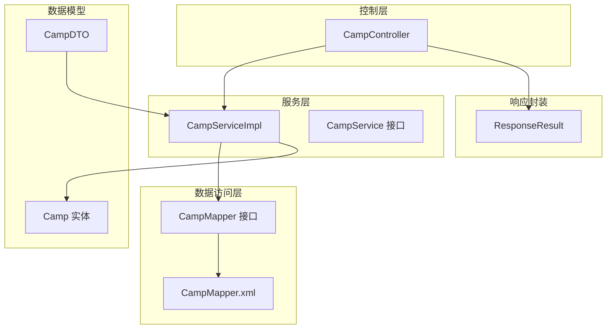
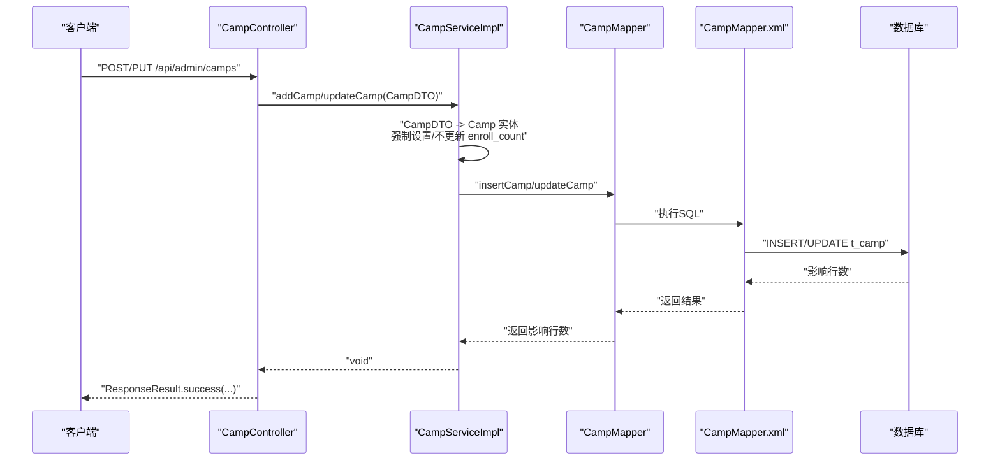
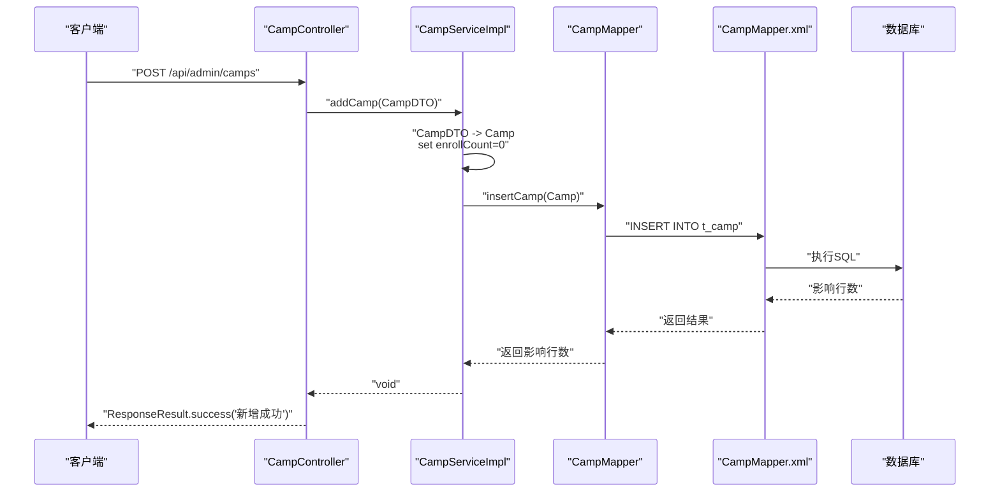
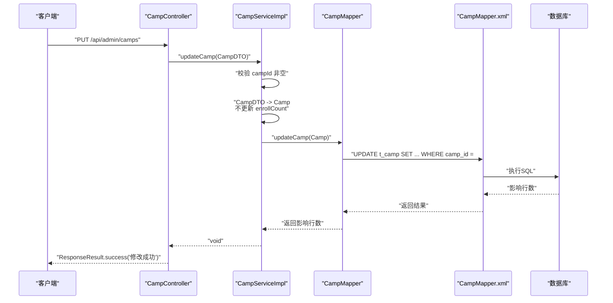
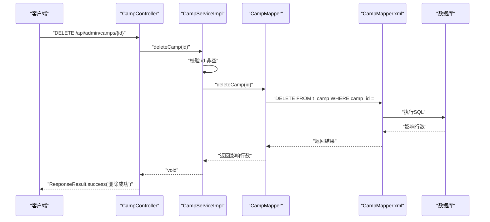
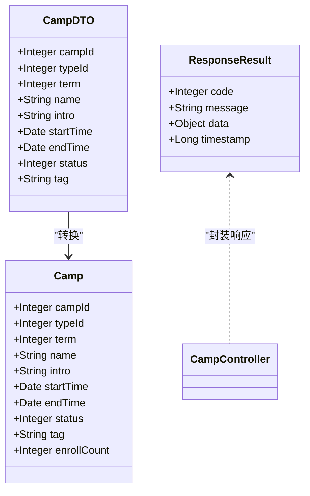
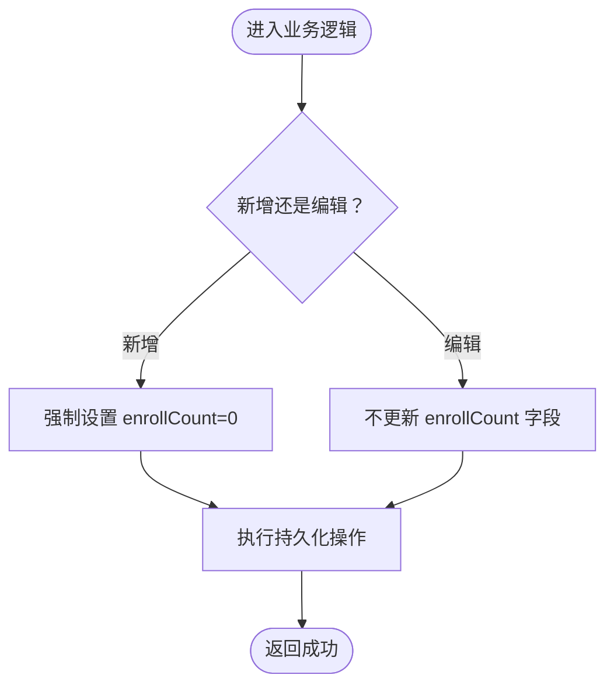
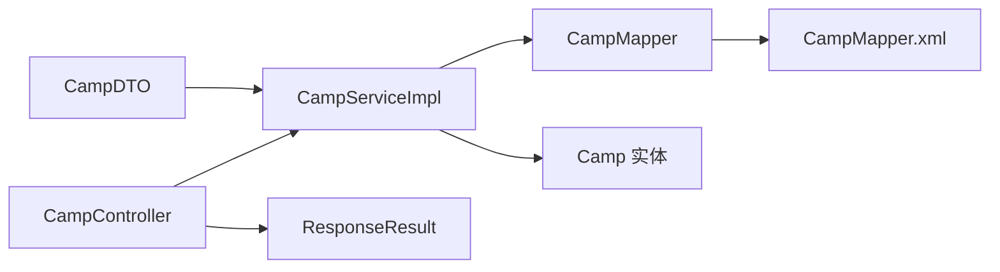

# 营期基础CRUD操作

<cite>
**本文引用的文件**
- [CampDTO.java](file://src/main/java/com/daily/dailychineseculture/dto/CampDTO.java)
- [Camp.java](file://src/main/java/com/daily/dailychineseculture/entity/Camp.java)
- [CampController.java](file://src/main/java/com/daily/dailychineseculture/controller/CampController.java)
- [CampServiceImpl.java](file://src/main/java/com/daily/dailychineseculture/service/impl/CampServiceImpl.java)
- [CampService.java](file://src/main/java/com/daily/dailychineseculture/service/CampService.java)
- [CampMapper.java](file://src/main/java/com/daily/dailychineseculture/mapper/CampMapper.java)
- [CampMapper.xml](file://src/main/resources/mapper/CampMapper.xml)
- [ResponseResult.java](file://src/main/java/com/daily/dailychineseculture/common/ResponseResult.java)
- [营期管理新增与编辑 API文档.md](file://doc/营期管理新增与编辑 API文档.md)
- [营期管理大盘 API文档.md](file://doc/营期管理大盘 API文档.md)
</cite>

## 目录
1. [简介](#简介)
2. [项目结构](#项目结构)
3. [核心组件](#核心组件)
4. [架构总览](#架构总览)
5. [详细组件分析](#详细组件分析)
6. [依赖分析](#依赖分析)
7. [性能考量](#性能考量)
8. [故障排除指南](#故障排除指南)
9. [结论](#结论)
10. [附录](#附录)

## 简介
本文件聚焦于“营期基础CRUD操作”的API文档，重点说明营期的新增、编辑、删除等核心功能接口。文档详细描述CampDTO数据传输对象的字段定义、验证规则和业务逻辑，包含完整的请求参数说明、响应数据结构和错误处理机制。特别分析了营期数据的完整性约束，尤其是enroll_count字段的特殊处理逻辑：新增时强制设置enroll_count=0，编辑时禁止更新enroll_count，以确保报名人数的真实性和一致性。

## 项目结构
围绕营期CRUD的核心文件组织如下：
- 控制层：CampController 提供REST接口，负责接收请求、参数校验与统一响应封装
- 服务层：CampServiceImpl 实现业务逻辑，包括CampDTO到Camp实体的转换、enroll_count字段的强制处理
- 数据访问层：CampMapper接口与CampMapper.xml映射SQL，完成数据库读写
- 数据模型：CampDTO作为入参载体，Camp作为持久化实体
- 统一响应：ResponseResult封装统一的响应结构

图表来源
- [CampController.java:1-123](file://src/main/java/com/daily/dailychineseculture/controller/CampController.java#L1-L123)
- [CampServiceImpl.java:1-266](file://src/main/java/com/daily/dailychineseculture/service/impl/CampServiceImpl.java#L1-L266)
- [CampService.java:1-81](file://src/main/java/com/daily/dailychineseculture/service/CampService.java#L1-L81)
- [CampMapper.java:1-132](file://src/main/java/com/daily/dailychineseculture/mapper/CampMapper.java#L1-L132)
- [CampMapper.xml:1-171](file://src/main/resources/mapper/CampMapper.xml#L1-L171)
- [CampDTO.java:1-63](file://src/main/java/com/daily/dailychineseculture/dto/CampDTO.java#L1-L63)
- [Camp.java:1-64](file://src/main/java/com/daily/dailychineseculture/entity/Camp.java#L1-L64)
- [ResponseResult.java:1-79](file://src/main/java/com/daily/dailychineseculture/common/ResponseResult.java#L1-L79)

章节来源
- [CampController.java:1-123](file://src/main/java/com/daily/dailychineseculture/controller/CampController.java#L1-L123)
- [CampServiceImpl.java:1-266](file://src/main/java/com/daily/dailychineseculture/service/impl/CampServiceImpl.java#L1-L266)
- [CampService.java:1-81](file://src/main/java/com/daily/dailychineseculture/service/CampService.java#L1-L81)
- [CampMapper.java:1-132](file://src/main/java/com/daily/dailychineseculture/mapper/CampMapper.java#L1-L132)
- [CampMapper.xml:1-171](file://src/main/resources/mapper/CampMapper.xml#L1-L171)
- [CampDTO.java:1-63](file://src/main/java/com/daily/dailychineseculture/dto/CampDTO.java#L1-L63)
- [Camp.java:1-64](file://src/main/java/com/daily/dailychineseculture/entity/Camp.java#L1-L64)
- [ResponseResult.java:1-79](file://src/main/java/com/daily/dailychineseculture/common/ResponseResult.java#L1-L79)

## 核心组件
- 营期控制器：提供新增、编辑等REST接口，负责参数接收与统一响应
- 营期服务：实现业务逻辑，包括CampDTO到Camp实体的转换、enroll_count字段的强制处理
- 营期Mapper：定义SQL接口，CampMapper.xml实现具体SQL
- DTO与实体：CampDTO用于入参，Camp用于持久化
- 统一响应：ResponseResult封装统一的响应结构

章节来源
- [CampController.java:1-123](file://src/main/java/com/daily/dailychineseculture/controller/CampController.java#L1-L123)
- [CampServiceImpl.java:164-205](file://src/main/java/com/daily/dailychineseculture/service/impl/CampServiceImpl.java#L164-L205)
- [CampMapper.java:114-127](file://src/main/java/com/daily/dailychineseculture/mapper/CampMapper.java#L114-L127)
- [CampMapper.xml:102-137](file://src/main/resources/mapper/CampMapper.xml#L102-L137)
- [CampDTO.java:12-62](file://src/main/java/com/daily/dailychineseculture/dto/CampDTO.java#L12-L62)
- [Camp.java:13-63](file://src/main/java/com/daily/dailychineseculture/entity/Camp.java#L13-L63)
- [ResponseResult.java:8-79](file://src/main/java/com/daily/dailychineseculture/common/ResponseResult.java#L8-L79)

## 架构总览
营期CRUD遵循经典的三层架构：Controller -> Service -> Mapper。新增与编辑接口通过CampController接收请求，CampServiceImpl执行业务逻辑，CampMapper与XML完成数据库操作。统一响应通过ResponseResult封装，便于前后端交互。

图表来源
- [CampController.java:84-101](file://src/main/java/com/daily/dailychineseculture/controller/CampController.java#L84-L101)
- [CampServiceImpl.java:164-205](file://src/main/java/com/daily/dailychineseculture/service/impl/CampServiceImpl.java#L164-L205)
- [CampMapper.java:114-127](file://src/main/java/com/daily/dailychineseculture/mapper/CampMapper.java#L114-L127)
- [CampMapper.xml:102-137](file://src/main/resources/mapper/CampMapper.xml#L102-L137)

## 详细组件分析

### 营期新增接口
- 接口路径：POST /api/admin/camps
- 请求体：CampDTO
- 业务要点：
  - 将CampDTO转换为Camp实体
  - 强制设置enrollCount=0，不接受前端传值
  - 调用Mapper执行INSERT
- 响应：统一响应封装，成功返回200

图表来源
- [CampController.java:84-88](file://src/main/java/com/daily/dailychineseculture/controller/CampController.java#L84-L88)
- [CampServiceImpl.java:164-181](file://src/main/java/com/daily/dailychineseculture/service/impl/CampServiceImpl.java#L164-L181)
- [CampMapper.xml:102-123](file://src/main/resources/mapper/CampMapper.xml#L102-L123)

章节来源
- [CampController.java:84-88](file://src/main/java/com/daily/dailychineseculture/controller/CampController.java#L84-L88)
- [CampServiceImpl.java:164-181](file://src/main/java/com/daily/dailychineseculture/service/impl/CampServiceImpl.java#L164-L181)
- [CampMapper.xml:102-123](file://src/main/resources/mapper/CampMapper.xml#L102-L123)
- [营期管理新增与编辑 API文档.md:9-46](file://doc/营期管理新增与编辑 API文档.md#L9-L46)

### 营期编辑接口
- 接口路径：PUT /api/admin/camps
- 请求体：CampDTO（必须包含campId）
- 业务要点：
  - 校验campId非空，否则抛出异常
  - 将CampDTO转换为Camp实体
  - 不更新enrollCount字段，保留真实报名人数
  - 调用Mapper执行UPDATE
- 响应：统一响应封装，成功返回200

图表来源
- [CampController.java:97-101](file://src/main/java/com/daily/dailychineseculture/controller/CampController.java#L97-L101)
- [CampServiceImpl.java:183-205](file://src/main/java/com/daily/dailychineseculture/service/impl/CampServiceImpl.java#L183-L205)
- [CampMapper.xml:125-137](file://src/main/resources/mapper/CampMapper.xml#L125-L137)

章节来源
- [CampController.java:97-101](file://src/main/java/com/daily/dailychineseculture/controller/CampController.java#L97-L101)
- [CampServiceImpl.java:183-205](file://src/main/java/com/daily/dailychineseculture/service/impl/CampServiceImpl.java#L183-L205)
- [CampMapper.xml:125-137](file://src/main/resources/mapper/CampMapper.xml#L125-L137)
- [营期管理新增与编辑 API文档.md:60-99](file://doc/营期管理新增与编辑 API文档.md#L60-L99)

### 营期删除接口
- 接口路径：DELETE /api/admin/camps/{id}
- 请求参数：路径变量id（营期ID）
- 业务要点：
  - 校验campId非空
  - 调用Mapper执行DELETE
- 响应：统一响应封装，成功返回200

图表来源
- [CampController.java:1-123](file://src/main/java/com/daily/dailychineseculture/controller/CampController.java#L1-L123)
- [CampServiceImpl.java:1-266](file://src/main/java/com/daily/dailychineseculture/service/impl/CampServiceImpl.java#L1-L266)
- [CampMapper.xml:1-171](file://src/main/resources/mapper/CampMapper.xml#L1-L171)

章节来源
- [CampController.java:1-123](file://src/main/java/com/daily/dailychineseculture/controller/CampController.java#L1-L123)
- [CampServiceImpl.java:1-266](file://src/main/java/com/daily/dailychineseculture/service/impl/CampServiceImpl.java#L1-L266)
- [CampMapper.xml:1-171](file://src/main/resources/mapper/CampMapper.xml#L1-L171)

### CampDTO数据传输对象
- 字段定义与说明：
  - campId：编辑时必填，新增时不填
  - typeId：营期类型ID
  - term：期数
  - name：营期名称
  - intro：营期介绍
  - startTime：开营时间（yyyy-MM-dd HH:mm:ss，时区GMT+8）
  - endTime：结营时间（yyyy-MM-dd HH:mm:ss，时区GMT+8）
  - status：状态（0未开始，1进行中，2已结束，默认0）
  - tag：标签
- 验证规则：
  - 新增：campId可为空；必填字段包括typeId、term、name、startTime、endTime
  - 编辑：campId必须存在
  - 日期格式：yyyy-MM-dd HH:mm:ss
- 业务逻辑：
  - 新增时强制设置enrollCount=0
  - 编辑时忽略enrollCount字段的更新

图表来源
- [CampDTO.java:12-62](file://src/main/java/com/daily/dailychineseculture/dto/CampDTO.java#L12-L62)
- [Camp.java:13-63](file://src/main/java/com/daily/dailychineseculture/entity/Camp.java#L13-L63)
- [ResponseResult.java:8-79](file://src/main/java/com/daily/dailychineseculture/common/ResponseResult.java#L8-L79)

章节来源
- [CampDTO.java:12-62](file://src/main/java/com/daily/dailychineseculture/dto/CampDTO.java#L12-L62)
- [CampServiceImpl.java:164-205](file://src/main/java/com/daily/dailychineseculture/service/impl/CampServiceImpl.java#L164-L205)
- [营期管理新增与编辑 API文档.md:16-46](file://doc/营期管理新增与编辑 API文档.md#L16-L46)

### 数据完整性约束与enroll_count特殊处理
- 新增时强制设置enrollCount=0，不接受前端传值，确保初始报名人数为0
- 编辑时绝对不要更新enrollCount字段，防止覆盖真实的报名人数
- 数据库层面，t_camp表包含enroll_count字段，用于记录实际报名人数

图表来源
- [CampServiceImpl.java:176-177](file://src/main/java/com/daily/dailychineseculture/service/impl/CampServiceImpl.java#L176-L177)
- [CampServiceImpl.java:201](file://src/main/java/com/daily/dailychineseculture/service/impl/CampServiceImpl.java#L201)
- [CampMapper.xml:102-137](file://src/main/resources/mapper/CampMapper.xml#L102-L137)

章节来源
- [CampServiceImpl.java:176-177](file://src/main/java/com/daily/dailychineseculture/service/impl/CampServiceImpl.java#L176-L177)
- [CampServiceImpl.java:201](file://src/main/java/com/daily/dailychineseculture/service/impl/CampServiceImpl.java#L201)
- [CampMapper.xml:102-137](file://src/main/resources/mapper/CampMapper.xml#L102-L137)
- [营期管理新增与编辑 API文档.md:43-46](file://doc/营期管理新增与编辑 API文档.md#L43-L46)
- [营期管理新增与编辑 API文档.md:96-99](file://doc/营期管理新增与编辑 API文档.md#L96-L99)

### 统一响应机制
- 成功响应：code=200，message="操作成功"，data为具体数据或null
- 失败响应：默认code=500，message为错误信息
- 响应封装类：ResponseResult，包含code、message、data、timestamp

章节来源
- [ResponseResult.java:48-79](file://src/main/java/com/daily/dailychineseculture/common/ResponseResult.java#L48-L79)
- [CampController.java:84-101](file://src/main/java/com/daily/dailychineseculture/controller/CampController.java#L84-L101)

## 依赖分析
- 控制器依赖服务层接口与实现
- 服务层依赖Mapper接口与实体类
- Mapper接口依赖XML映射文件
- DTO与实体之间存在一对一映射关系
- 统一响应类被控制器使用

图表来源
- [CampController.java:1-123](file://src/main/java/com/daily/dailychineseculture/controller/CampController.java#L1-L123)
- [CampServiceImpl.java:1-266](file://src/main/java/com/daily/dailychineseculture/service/impl/CampServiceImpl.java#L1-L266)
- [CampMapper.java:1-132](file://src/main/java/com/daily/dailychineseculture/mapper/CampMapper.java#L1-L132)
- [CampMapper.xml:1-171](file://src/main/resources/mapper/CampMapper.xml#L1-L171)
- [CampDTO.java:1-63](file://src/main/java/com/daily/dailychineseculture/dto/CampDTO.java#L1-L63)
- [Camp.java:1-64](file://src/main/java/com/daily/dailychineseculture/entity/Camp.java#L1-L64)
- [ResponseResult.java:1-79](file://src/main/java/com/daily/dailychineseculture/common/ResponseResult.java#L1-L79)

章节来源
- [CampController.java:1-123](file://src/main/java/com/daily/dailychineseculture/controller/CampController.java#L1-L123)
- [CampServiceImpl.java:1-266](file://src/main/java/com/daily/dailychineseculture/service/impl/CampServiceImpl.java#L1-L266)
- [CampMapper.java:1-132](file://src/main/java/com/daily/dailychineseculture/mapper/CampMapper.java#L1-L132)
- [CampMapper.xml:1-171](file://src/main/resources/mapper/CampMapper.xml#L1-L171)
- [CampDTO.java:1-63](file://src/main/java/com/daily/dailychineseculture/dto/CampDTO.java#L1-L63)
- [Camp.java:1-64](file://src/main/java/com/daily/dailychineseculture/entity/Camp.java#L1-L64)
- [ResponseResult.java:1-79](file://src/main/java/com/daily/dailychineseculture/common/ResponseResult.java#L1-L79)

## 性能考量
- SQL层面：新增与编辑操作均为单表写操作，复杂度低
- DTO到实体转换：属性拷贝简单，无额外计算开销
- 统一响应：轻量封装，不影响整体性能
- 建议：在高并发场景下，确保数据库连接池与事务配置合理，避免长事务阻塞

## 故障排除指南
- 新增失败（编辑时campId为空）
  - 现象：返回错误响应，提示“编辑营期时，campId 不能为空”
  - 处理：确保编辑请求体包含campId字段
- 日期格式错误
  - 现象：参数绑定失败或业务逻辑异常
  - 处理：确保startTime与endTime为yyyy-MM-dd HH:mm:ss格式
- enroll_count字段异常
  - 现象：编辑后报名人数被覆盖
  - 处理：确认服务层未更新enrollCount字段，保持真实报名人数
- 删除失败
  - 现象：返回错误响应
  - 处理：确认路径参数id存在且有效

章节来源
- [CampServiceImpl.java:186-188](file://src/main/java/com/daily/dailychineseculture/service/impl/CampServiceImpl.java#L186-L188)
- [CampServiceImpl.java:201](file://src/main/java/com/daily/dailychineseculture/service/impl/CampServiceImpl.java#L201)
- [营期管理新增与编辑 API文档.md:345-363](file://doc/营期管理新增与编辑 API文档.md#L345-L363)

## 结论
本文档系统性地梳理了营期基础CRUD操作的接口设计与实现细节，重点强调了enroll_count字段的强制处理策略：新增时强制置零、编辑时禁止更新，从而保证报名人数的真实性和一致性。通过统一响应封装与清晰的业务流程，提升了系统的可维护性与可扩展性。

## 附录
- 接口调用示例（基于现有文档）
  - 新增营期：POST /api/admin/camps
  - 编辑营期：PUT /api/admin/camps
  - 删除营期：DELETE /api/admin/camps/{id}
- 参数验证规则
  - 新增：campId可为空；typeId、term、name、startTime、endTime必填
  - 编辑：campId必填
  - 日期格式：yyyy-MM-dd HH:mm:ss
- 常见错误处理
  - campId为空：返回错误响应
  - 日期格式不正确：参数绑定失败
  - enroll_count异常：确认服务层未更新该字段

章节来源
- [营期管理新增与编辑 API文档.md:9-46](file://doc/营期管理新增与编辑 API文档.md#L9-L46)
- [营期管理新增与编辑 API文档.md:60-99](file://doc/营期管理新增与编辑 API文档.md#L60-L99)
- [营期管理新增与编辑 API文档.md:310-363](file://doc/营期管理新增与编辑 API文档.md#L310-L363)
- [营期管理大盘 API文档.md:13-76](file://doc/营期管理大盘 API文档.md#L13-L76)