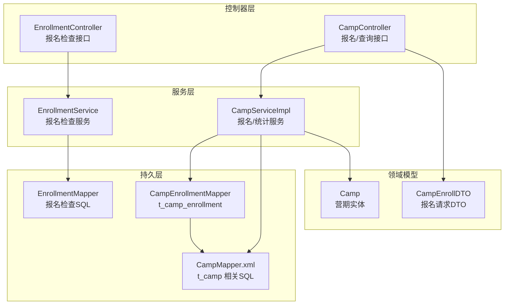
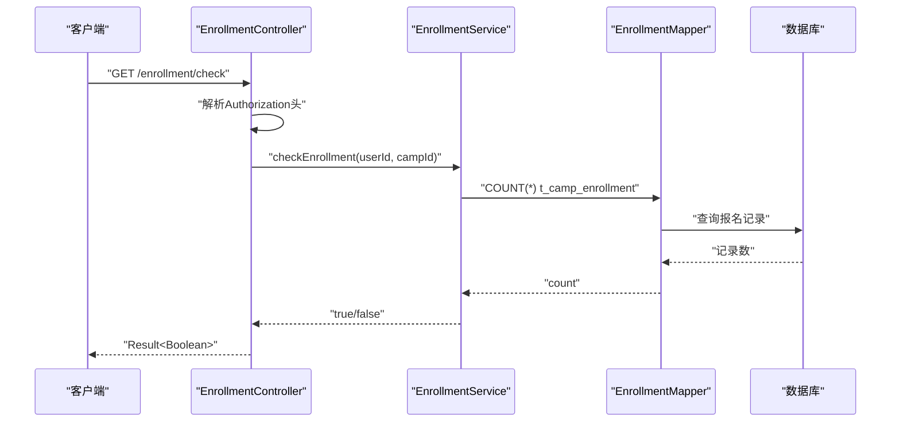
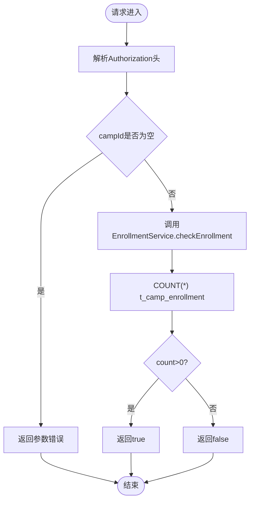
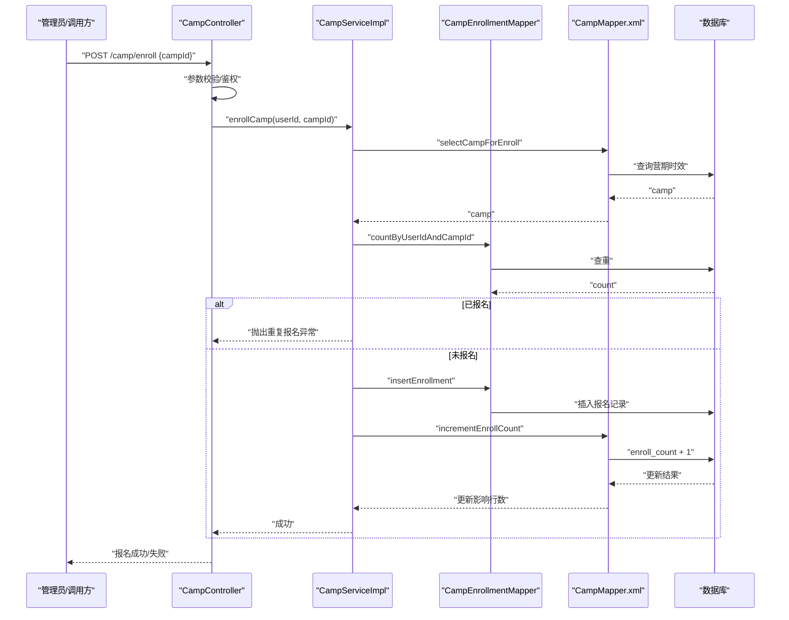
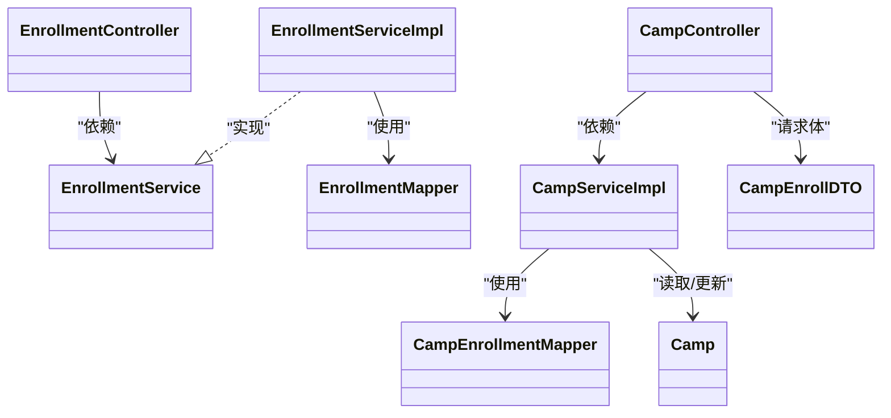

# 营期报名管理

<cite>
**本文引用的文件**
- [EnrollmentController.java](file://src/main/java/com/daily/dailychineseculture/controller/EnrollmentController.java)
- [EnrollmentService.java](file://src/main/java/com/daily/dailychineseculture/service/EnrollmentService.java)
- [EnrollmentServiceImpl.java](file://src/main/java/com/daily/dailychineseculture/service/impl/EnrollmentServiceImpl.java)
- [EnrollmentMapper.java](file://src/main/java/com/daily/dailychineseculture/mapper/EnrollmentMapper.java)
- [CampEnrollmentMapper.java](file://src/main/java/com/daily/dailychineseculture/mapper/CampEnrollmentMapper.java)
- [CampEnrollmentMapper.xml](file://src/main/resources/mapper/CampEnrollmentMapper.xml)
- [CampController.java](file://src/main/java/com/daily/dailychineseculture/controller/CampController.java)
- [CampServiceImpl.java](file://src/main/java/com/daily/dailychineseculture/service/impl/CampServiceImpl.java)
- [CampMapper.xml](file://src/main/resources/mapper/CampMapper.xml)
- [Camp.java](file://src/main/java/com/daily/dailychineseculture/entity/Camp.java)
- [CampEnrollDTO.java](file://src/main/java/com/daily/dailychineseculture/dto/CampEnrollDTO.java)
- [Result.java](file://src/main/java/com/daily/dailychineseculture/common/Result.java)
- [GlobalExceptionHandler.java](file://src/main/java/com/daily/dailychineseculture/common/GlobalExceptionHandler.java)
</cite>

## 目录
1. [简介](#简介)
2. [项目结构](#项目结构)
3. [核心组件](#核心组件)
4. [架构总览](#架构总览)
5. [详细组件分析](#详细组件分析)
6. [依赖分析](#依赖分析)
7. [性能考量](#性能考量)
8. [故障排查指南](#故障排查指南)
9. [结论](#结论)
10. [附录](#附录)

## 简介
本文件面向“营期报名管理系统”的API与业务实现，聚焦以下目标：
- 完整API文档：涵盖学员报名、取消报名、报名查询等核心能力
- 并发控制与数据一致性：解析报名流程中的并发保护与一致性保障
- 状态管理与名额控制：明确报名状态、名额控制与冲突检测
- 生命周期追踪：从报名到取消的全流程数据轨迹
- 错误处理策略：超卖防护、重复报名检测、统一异常处理
- 统计与批量：统计分析接口与批量操作支持建议
- 场景示例与最佳实践：结合业务场景给出实操建议

## 项目结构
系统采用典型的分层架构：
- 控制器层：对外暴露REST接口，负责请求接入与响应封装
- 服务层：编排业务逻辑，处理事务与边界校验
- 持久层：MyBatis映射数据库操作，提供SQL级原子性保障
- 实体与DTO：承载数据模型与传输对象
- 通用工具：统一响应封装与全局异常处理

图表来源
- [EnrollmentController.java:1-58](file://src/main/java/com/daily/dailychineseculture/controller/EnrollmentController.java#L1-L58)
- [CampController.java:1-123](file://src/main/java/com/daily/dailychineseculture/controller/CampController.java#L1-L123)
- [EnrollmentService.java:1-17](file://src/main/java/com/daily/dailychineseculture/service/EnrollmentService.java#L1-L17)
- [EnrollmentServiceImpl.java:1-31](file://src/main/java/com/daily/dailychineseculture/service/impl/EnrollmentServiceImpl.java#L1-L31)
- [EnrollmentMapper.java:1-27](file://src/main/java/com/daily/dailychineseculture/mapper/EnrollmentMapper.java#L1-L27)
- [CampEnrollmentMapper.java:1-16](file://src/main/java/com/daily/dailychineseculture/mapper/CampEnrollmentMapper.java#L1-L16)
- [CampEnrollmentMapper.xml:1-25](file://src/main/resources/mapper/CampEnrollmentMapper.xml#L1-L25)
- [CampServiceImpl.java:1-266](file://src/main/java/com/daily/dailychineseculture/service/impl/CampServiceImpl.java#L1-L266)
- [CampMapper.xml:1-171](file://src/main/resources/mapper/CampMapper.xml#L1-L171)
- [Camp.java:1-64](file://src/main/java/com/daily/dailychineseculture/entity/Camp.java#L1-L64)
- [CampEnrollDTO.java:1-9](file://src/main/java/com/daily/dailychineseculture/dto/CampEnrollDTO.java#L1-L9)

章节来源
- [EnrollmentController.java:1-58](file://src/main/java/com/daily/dailychineseculture/controller/EnrollmentController.java#L1-L58)
- [CampController.java:1-123](file://src/main/java/com/daily/dailychineseculture/controller/CampController.java#L1-L123)
- [CampServiceImpl.java:1-266](file://src/main/java/com/daily/dailychineseculture/service/impl/CampServiceImpl.java#L1-L266)

## 核心组件
- 报名检查接口：提供C端小程序的“是否已报名”查询能力，基于JWT鉴权
- 报名接口：管理员端/内部调用的报名入口，执行重复报名检测与名额递增
- 统一响应与异常：Result/ResponseResult封装与全局异常兜底
- 数据模型：Camp实体承载营期状态与时效，配合报名表完成一致性校验

章节来源
- [EnrollmentController.java:23-56](file://src/main/java/com/daily/dailychineseculture/controller/EnrollmentController.java#L23-L56)
- [CampController.java:103-121](file://src/main/java/com/daily/dailychineseculture/controller/CampController.java#L103-L121)
- [Result.java:1-81](file://src/main/java/com/daily/dailychineseculture/common/Result.java#L1-L81)
- [GlobalExceptionHandler.java:1-29](file://src/main/java/com/daily/dailychineseculture/common/GlobalExceptionHandler.java#L1-L29)
- [Camp.java:40-52](file://src/main/java/com/daily/dailychineseculture/entity/Camp.java#L40-L52)

## 架构总览
系统通过控制器接收请求，服务层编排业务规则，持久层执行原子SQL操作，确保并发与一致性。

图表来源
- [EnrollmentController.java:31-56](file://src/main/java/com/daily/dailychineseculture/controller/EnrollmentController.java#L31-L56)
- [EnrollmentServiceImpl.java:17-29](file://src/main/java/com/daily/dailychineseculture/service/impl/EnrollmentServiceImpl.java#L17-L29)
- [EnrollmentMapper.java:21-25](file://src/main/java/com/daily/dailychineseculture/mapper/EnrollmentMapper.java#L21-L25)

章节来源
- [EnrollmentController.java:1-58](file://src/main/java/com/daily/dailychineseculture/controller/EnrollmentController.java#L1-L58)
- [EnrollmentServiceImpl.java:1-31](file://src/main/java/com/daily/dailychineseculture/service/impl/EnrollmentServiceImpl.java#L1-L31)
- [EnrollmentMapper.java:1-27](file://src/main/java/com/daily/dailychineseculture/mapper/EnrollmentMapper.java#L1-L27)

## 详细组件分析

### 报名检查接口（C端）
- 接口路径：GET /enrollment/check
- 请求头：Authorization（Bearer Token）
- 查询参数：campId（营期ID）
- 返回：Result<Boolean>，true表示已报名，false表示未报名
- 鉴权：从Token解析userId，异常时返回401
- 校验：campId非空校验
- 实现：调用EnrollmentService，内部通过EnrollmentMapper执行COUNT(*)判断是否存在

图表来源
- [EnrollmentController.java:31-56](file://src/main/java/com/daily/dailychineseculture/controller/EnrollmentController.java#L31-L56)
- [EnrollmentServiceImpl.java:17-29](file://src/main/java/com/daily/dailychineseculture/service/impl/EnrollmentServiceImpl.java#L17-L29)
- [EnrollmentMapper.java:21-25](file://src/main/java/com/daily/dailychineseculture/mapper/EnrollmentMapper.java#L21-L25)

章节来源
- [EnrollmentController.java:23-56](file://src/main/java/com/daily/dailychineseculture/controller/EnrollmentController.java#L23-L56)
- [EnrollmentServiceImpl.java:17-29](file://src/main/java/com/daily/dailychineseculture/service/impl/EnrollmentServiceImpl.java#L17-L29)
- [EnrollmentMapper.java:14-25](file://src/main/java/com/daily/dailychineseculture/mapper/EnrollmentMapper.java#L14-L25)

### 报名接口（管理员/内部）
- 接口路径：POST /camp/enroll
- 请求体：CampEnrollDTO（包含campId）
- 返回：ResponseResult<String>（成功/失败信息）
- 鉴权：从请求上下文获取userId（当前实现），建议替换为JWT解析
- 校验：
  - campId非空
  - 用户已登录
  - 营期存在且未结束
  - 防止重复报名（先查再插）
- 事务：@Transactional包裹，确保报名记录插入与报名人数+1原子性
- 异常：参数非法、重复报名、数据库异常等

图表来源
- [CampController.java:103-121](file://src/main/java/com/daily/dailychineseculture/controller/CampController.java#L103-L121)
- [CampServiceImpl.java:207-243](file://src/main/java/com/daily/dailychineseculture/service/impl/CampServiceImpl.java#L207-L243)
- [CampEnrollmentMapper.java:9-14](file://src/main/java/com/daily/dailychineseculture/mapper/CampEnrollmentMapper.java#L9-L14)
- [CampEnrollmentMapper.xml:4-23](file://src/main/resources/mapper/CampEnrollmentMapper.xml#L4-L23)
- [CampMapper.xml:159-169](file://src/main/resources/mapper/CampMapper.xml#L159-L169)

章节来源
- [CampController.java:103-121](file://src/main/java/com/daily/dailychineseculture/controller/CampController.java#L103-L121)
- [CampServiceImpl.java:207-243](file://src/main/java/com/daily/dailychineseculture/service/impl/CampServiceImpl.java#L207-L243)
- [CampEnrollmentMapper.java:1-16](file://src/main/java/com/daily/dailychineseculture/mapper/CampEnrollmentMapper.java#L1-L16)
- [CampEnrollmentMapper.xml:1-25](file://src/main/resources/mapper/CampEnrollmentMapper.xml#L1-L25)
- [CampMapper.xml:159-169](file://src/main/resources/mapper/CampMapper.xml#L159-L169)

### 报名状态管理与名额控制
- 状态字段：Camp.status（0-未开始，1-进行中，2-已结束）
- 名额字段：Camp.enrollCount（报名人数）
- 控制要点：
  - 报名前校验营期是否已结束（endTime在当前时间之后）
  - 重复报名检测：COUNT(*) > 0 则拒绝
  - 原子性：事务内同时完成“插入报名记录”和“报名人数+1”
  - 异常回滚：DuplicateKeyException等异常触发事务回滚

章节来源
- [Camp.java:40-62](file://src/main/java/com/daily/dailychineseculture/entity/Camp.java#L40-L62)
- [CampServiceImpl.java:217-242](file://src/main/java/com/daily/dailychineseculture/service/impl/CampServiceImpl.java#L217-L242)
- [CampMapper.xml:159-169](file://src/main/resources/mapper/CampMapper.xml#L159-L169)

### 报名数据生命周期追踪
- 创建：插入t_camp_enrollment，初始化progress=0，is_completed=0
- 更新：支持progress字段更新（CampEnrollmentMapper.updateProgress）
- 取消：当前仓库未提供取消报名接口，建议新增DELETE /camp/enroll/{campId}，实现反向递减与清理逻辑
- 统计：CampMapper提供热门营期统计（按报名人数与标签排序）

章节来源
- [CampEnrollmentMapper.xml:11-23](file://src/main/resources/mapper/CampEnrollmentMapper.xml#L11-L23)
- [CampEnrollmentMapper.java:13-14](file://src/main/java/com/daily/dailychineseculture/mapper/CampEnrollmentMapper.java#L13-L14)
- [CampMapper.xml:139-157](file://src/main/resources/mapper/CampMapper.xml#L139-L157)

### 错误处理策略
- 参数校验：campId非空、userId非空
- 业务校验：营期结束、重复报名
- 数据异常：DuplicateKeyException转义为重复报名提示
- 事务异常：更新失败抛出运行时异常，触发回滚
- 全局异常：全局异常处理器统一返回系统内部错误

章节来源
- [CampController.java:106-121](file://src/main/java/com/daily/dailychineseculture/controller/CampController.java#L106-L121)
- [CampServiceImpl.java:210-242](file://src/main/java/com/daily/dailychineseculture/service/impl/CampServiceImpl.java#L210-L242)
- [GlobalExceptionHandler.java:15-28](file://src/main/java/com/daily/dailychineseculture/common/GlobalExceptionHandler.java#L15-L28)

### 统计分析与批量支持
- 热门营期统计：按报名人数与标签优先级排序，限制前5条
- 分页列表：支持关键字、状态、类型过滤的分页查询
- 批量建议：当前未提供批量报名接口，可在CampController扩展批量报名接口，建议：
  - 批量校验campId有效性与时效
  - 批量去重userId
  - 使用批处理SQL或循环事务（谨慎）保证幂等

章节来源
- [CampMapper.xml:139-157](file://src/main/resources/mapper/CampMapper.xml#L139-L157)
- [CampServiceImpl.java:128-157](file://src/main/java/com/daily/dailychineseculture/service/impl/CampServiceImpl.java#L128-L157)

## 依赖分析
- 控制器依赖服务接口，服务实现依赖Mapper/XML
- EnrollmentController依赖JWT工具解析用户ID
- CampController依赖CampService与CampPlanService（后者用于下拉选项）
- 数据一致性依赖事务与唯一约束（重复报名检测）

图表来源
- [EnrollmentController.java:1-58](file://src/main/java/com/daily/dailychineseculture/controller/EnrollmentController.java#L1-L58)
- [EnrollmentService.java:1-17](file://src/main/java/com/daily/dailychineseculture/service/EnrollmentService.java#L1-L17)
- [EnrollmentServiceImpl.java:1-31](file://src/main/java/com/daily/dailychineseculture/service/impl/EnrollmentServiceImpl.java#L1-L31)
- [EnrollmentMapper.java:1-27](file://src/main/java/com/daily/dailychineseculture/mapper/EnrollmentMapper.java#L1-L27)
- [CampEnrollmentMapper.java:1-16](file://src/main/java/com/daily/dailychineseculture/mapper/CampEnrollmentMapper.java#L1-L16)
- [CampServiceImpl.java:1-266](file://src/main/java/com/daily/dailychineseculture/service/impl/CampServiceImpl.java#L1-L266)
- [CampController.java:1-123](file://src/main/java/com/daily/dailychineseculture/controller/CampController.java#L1-L123)
- [Camp.java:1-64](file://src/main/java/com/daily/dailychineseculture/entity/Camp.java#L1-L64)
- [CampEnrollDTO.java:1-9](file://src/main/java/com/daily/dailychineseculture/dto/CampEnrollDTO.java#L1-L9)

章节来源
- [CampServiceImpl.java:1-266](file://src/main/java/com/daily/dailychineseculture/service/impl/CampServiceImpl.java#L1-L266)
- [CampController.java:1-123](file://src/main/java/com/daily/dailychineseculture/controller/CampController.java#L1-L123)

## 性能考量
- 查询优化：报名检查使用COUNT(*)，建议在user_id与camp_id建立联合索引
- 插入优化：报名插入与人数递增在同一事务，避免中间状态
- 并发控制：重复报名检测先查后插，结合数据库唯一约束防超卖
- 分页与统计：列表查询与热门统计均走SQL层，减少Java侧聚合成本

## 故障排查指南
- 400错误：campId为空、用户未登录
- 401错误：Authorization头缺失或无效
- 业务异常：已结束营期不可报名、重复报名
- 数据异常：DuplicateKeyException（重复报名）、更新失败
- 全局异常：系统内部错误兜底

章节来源
- [CampController.java:106-121](file://src/main/java/com/daily/dailychineseculture/controller/CampController.java#L106-L121)
- [EnrollmentController.java:41-55](file://src/main/java/com/daily/dailychineseculture/controller/EnrollmentController.java#L41-L55)
- [GlobalExceptionHandler.java:15-28](file://src/main/java/com/daily/dailychineseculture/common/GlobalExceptionHandler.java#L15-L28)

## 结论
系统围绕“报名检查”和“报名执行”两条主线构建，通过服务层事务与SQL层原子操作实现了基本的并发控制与数据一致性。建议后续补充：
- 取消报名接口与权限控制
- 取消后的数据清理与统计修正
- 取消与报名的审计日志
- 批量报名接口与幂等设计
- 更完善的Token鉴权与权限拦截

## 附录

### API清单与规范
- 报名检查（C端）
  - 方法：GET
  - 路径：/enrollment/check
  - 请求头：Authorization: Bearer {token}
  - 查询参数：campId
  - 返回：Result<Boolean>
- 报名（管理员/内部）
  - 方法：POST
  - 路径：/camp/enroll
  - 请求体：{campId}
  - 返回：ResponseResult<String>

章节来源
- [EnrollmentController.java:23-56](file://src/main/java/com/daily/dailychineseculture/controller/EnrollmentController.java#L23-L56)
- [CampController.java:103-121](file://src/main/java/com/daily/dailychineseculture/controller/CampController.java#L103-L121)