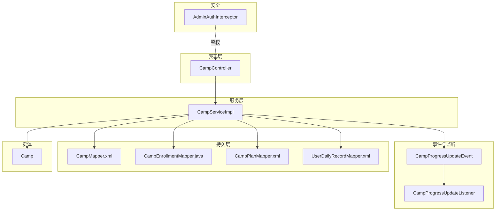
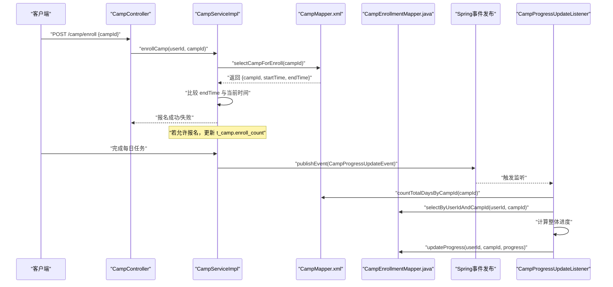
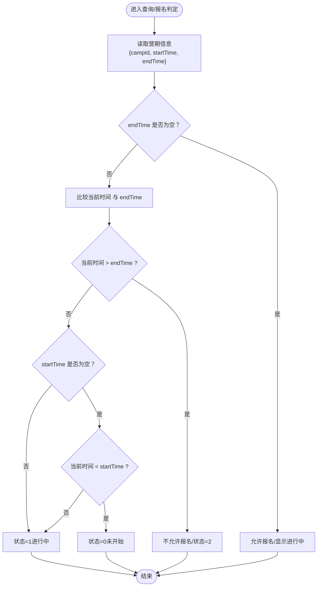
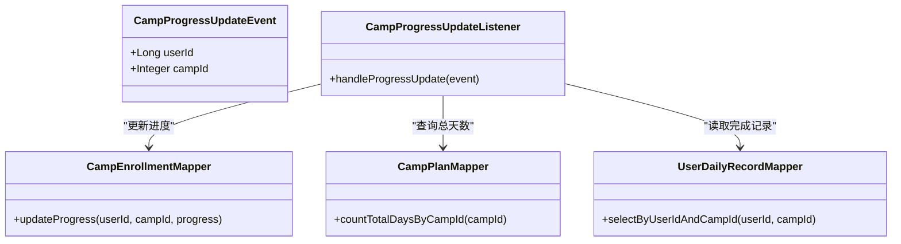
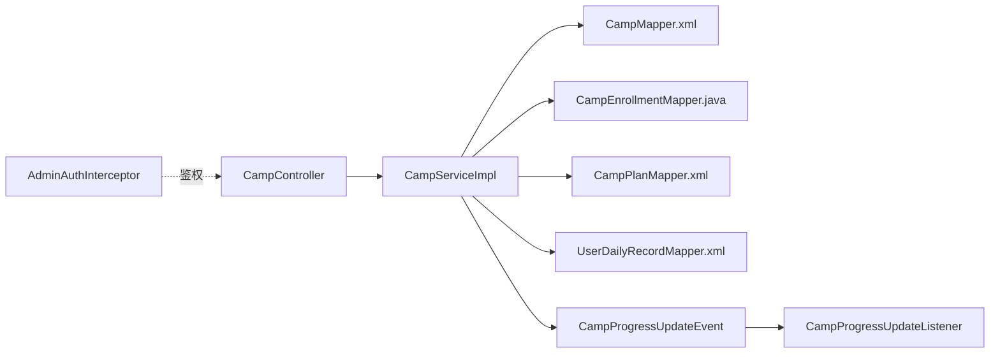

# 营期状态控制

<cite>
**本文引用的文件**
- [Camp.java](file://src/main/java/com/daily/dailychineseculture/entity/Camp.java)
- [CampProgressUpdateEvent.java](file://src/main/java/com/daily/dailychineseculture/event/CampProgressUpdateEvent.java)
- [CampProgressUpdateListener.java](file://src/main/java/com/daily/dailychineseculture/listener/CampProgressUpdateListener.java)
- [CampServiceImpl.java](file://src/main/java/com/daily/dailychineseculture/service/impl/CampServiceImpl.java)
- [CampController.java](file://src/main/java/com/daily/dailychineseculture/controller/CampController.java)
- [CampMapper.java](file://src/main/java/com/daily/dailychineseculture/mapper/CampMapper.java)
- [CampEnrollmentMapper.java](file://src/main/java/com/daily/dailychineseculture/mapper/CampEnrollmentMapper.java)
- [CampMapper.xml](file://src/main/resources/mapper/CampMapper.xml)
- [CampPlanMapper.xml](file://src/main/resources/mapper/CampPlanMapper.xml)
- [UserDailyRecordMapper.xml](file://src/main/resources/mapper/UserDailyRecordMapper.xml)
- [AdminAuthInterceptor.java](file://src/main/java/com/daily/dailychineseculture/interceptor/AdminAuthInterceptor.java)
- [营期报名接口完整代码追溯报告.md](file://doc/营期报名接口完整代码追溯报告.md)
- [营期报名接口代码追溯完整报告.md](file://doc/营期报名接口代码追溯完整报告.md)
- [营期管理新增与编辑 API文档.md](file://doc/营期管理新增与编辑 API文档.md)
- [PC端后台管理登录接口 HTTP 401 错误修复方案.md](file://doc/PC端后台管理登录接口 HTTP 401 错误修复方案.md)
- [PC端后台管理登录接口 HTTP 状态码修复报告.md](file://doc/PC端后台管理登录接口 HTTP 状态码修复报告.md)
- [营期列表字段升级报告.md](file://doc/营期列表字段升级报告.md)
- [营期详情接口endTime字段检查报告.md](file://doc/营期详情接口endTime字段检查报告.md)
- [营期生命周期管理.md](file://readme/教务与排课模块/营期生命周期管理.md)
</cite>

## 目录
1. [简介](#简介)
2. [项目结构](#项目结构)
3. [核心组件](#核心组件)
4. [架构总览](#架构总览)
5. [详细组件分析](#详细组件分析)
6. [依赖分析](#依赖分析)
7. [性能考虑](#性能考虑)
8. [故障排查指南](#故障排查指南)
9. [结论](#结论)
10. [附录](#附录)

## 简介
本文件聚焦“营期状态控制系统”的API与机制说明，围绕以下目标展开：
- 明确状态枚举定义与业务含义：0-未开始、1-进行中、2-已结束
- 分析基于时间的自动状态转换逻辑（开营时间与结营时间的判断）
- 说明事件驱动的状态变更架构：CampProgressUpdateEvent 事件与 CampProgressUpdateListener 监听器
- 提供权限验证与安全机制（后台管理鉴权拦截器）
- 状态变更的日志与审计建议
- 状态查询接口与批量状态更新的管理能力现状与改进建议

## 项目结构
围绕营期状态控制的关键文件组织如下：
- 实体与事件：Camp、CampProgressUpdateEvent、CampProgressUpdateListener
- 控制器与服务：CampController、CampServiceImpl
- 持久层与XML映射：CampMapper、CampEnrollmentMapper、CampMapper.xml、CampPlanMapper.xml、UserDailyRecordMapper.xml
- 权限与拦截：AdminAuthInterceptor
- 文档与报告：多篇关于营期状态、报名流程、登录鉴权与接口文档

图表来源
- [CampController.java:1-123](file://src/main/java/com/daily/dailychineseculture/controller/CampController.java#L1-123)
- [CampServiceImpl.java:1-266](file://src/main/java/com/daily/dailychineseculture/service/impl/CampServiceImpl.java#L1-266)
- [CampProgressUpdateEvent.java:1-17](file://src/main/java/com/daily/dailychineseculture/event/CampProgressUpdateEvent.java#L1-17)
- [CampProgressUpdateListener.java:1-49](file://src/main/java/com/daily/dailychineseculture/listener/CampProgressUpdateListener.java#L1-49)
- [CampMapper.xml:1-171](file://src/main/resources/mapper/CampMapper.xml#L1-171)
- [CampEnrollmentMapper.java:1-16](file://src/main/java/com/daily/dailychineseculture/mapper/CampEnrollmentMapper.java#L1-16)
- [CampPlanMapper.xml:1-134](file://src/main/resources/mapper/CampPlanMapper.xml#L1-134)
- [UserDailyRecordMapper.xml:1-15](file://src/main/resources/mapper/UserDailyRecordMapper.xml#L1-15)
- [AdminAuthInterceptor.java:1-93](file://src/main/java/com/daily/dailychineseculture/interceptor/AdminAuthInterceptor.java#L1-93)

章节来源
- [CampController.java:1-123](file://src/main/java/com/daily/dailychineseculture/controller/CampController.java#L1-123)
- [CampServiceImpl.java:1-266](file://src/main/java/com/daily/dailychineseculture/service/impl/CampServiceImpl.java#L1-266)
- [CampMapper.xml:1-171](file://src/main/resources/mapper/CampMapper.xml#L1-171)

## 核心组件
- 状态枚举与业务含义
  - 0：未开始（开营时间在未来）
  - 1：进行中（当前时间处于开营与结营之间）
  - 2：已结束（当前时间晚于结营时间）
- 自动转换与手动控制
  - 列表查询与筛选：通过 SQL 的 CASE WHEN 动态计算状态，结合 start_time 与 end_time 实现自动转换
  - 新增/编辑：允许手动设置 status 字段（默认 0），用于后台管理场景
  - 报名判定：Service 层使用 end_time 与当前时间比较决定是否允许报名
- 事件驱动的进度计算
  - CampProgressUpdateEvent 作为应用事件载体
  - CampProgressUpdateListener 异步监听并计算学员在营期内的整体完成度进度，写入 t_camp_enrollment.progress

章节来源
- [Camp.java:49-52](file://src/main/java/com/daily/dailychineseculture/entity/Camp.java#L49-L52)
- [CampMapper.xml:53-57](file://src/main/resources/mapper/CampMapper.xml#L53-L57)
- [CampServiceImpl.java:245-264](file://src/main/java/com/daily/dailychineseculture/service/impl/CampServiceImpl.java#L245-L264)
- [CampProgressUpdateEvent.java:1-17](file://src/main/java/com/daily/dailychineseculture/event/CampProgressUpdateEvent.java#L1-L17)
- [CampProgressUpdateListener.java:1-49](file://src/main/java/com/daily/dailychineseculture/listener/CampProgressUpdateListener.java#L1-L49)

## 架构总览
营期状态控制采用“时间驱动 + 事件驱动”的双通道机制：
- 时间驱动：数据库侧通过 CASE WHEN 动态计算状态，保证查询结果与当前时间一致
- 事件驱动：当学员完成每日任务时，发布 CampProgressUpdateEvent，监听器异步计算整体进度并持久化

图表来源
- [CampController.java:103-121](file://src/main/java/com/daily/dailychineseculture/controller/CampController.java#L103-L121)
- [CampServiceImpl.java:207-243](file://src/main/java/com/daily/dailychineseculture/service/impl/CampServiceImpl.java#L207-L243)
- [CampMapper.xml:159-169](file://src/main/resources/mapper/CampMapper.xml#L159-L169)
- [CampEnrollmentMapper.java:13-15](file://src/main/java/com/daily/dailychineseculture/mapper/CampEnrollmentMapper.java#L13-L15)
- [CampProgressUpdateEvent.java:1-17](file://src/main/java/com/daily/dailychineseculture/event/CampProgressUpdateEvent.java#L1-L17)
- [CampProgressUpdateListener.java:24-48](file://src/main/java/com/daily/dailychineseculture/listener/CampProgressUpdateListener.java#L24-L48)

## 详细组件分析

### 状态枚举与业务含义
- 0：未开始（开营时间在未来）
- 1：进行中（当前时间处于开营与结营之间）
- 2：已结束（当前时间晚于结营时间）

章节来源
- [Camp.java:49-52](file://src/main/java/com/daily/dailychineseculture/entity/Camp.java#L49-L52)
- [CampServiceImpl.java:245-264](file://src/main/java/com/daily/dailychineseculture/service/impl/CampServiceImpl.java#L245-L264)

### 基于时间的自动状态转换逻辑
- 列表查询与筛选
  - SQL 使用 CASE WHEN 动态计算 status，结合 start_time 与 end_time 实现自动转换
  - 支持按状态精确过滤：0-未开始、1-进行中、2-已结束
- 报名判定
  - Service 层读取营期的 end_time，与当前时间比较，决定是否允许报名
- 详情接口一致性
  - 报名接口的 SQL 仅查询必要字段，不返回 status 物理字段，判定逻辑由 Java 层完成
  - 建议将详情接口也改为 CASE WHEN 动态计算，保持与列表接口一致

图表来源
- [CampServiceImpl.java:217-223](file://src/main/java/com/daily/dailychineseculture/service/impl/CampServiceImpl.java#L217-L223)
- [CampMapper.xml:159-169](file://src/main/resources/mapper/CampMapper.xml#L159-L169)
- [营期报名接口完整代码追溯报告.md:1-32](file://doc/营期报名接口完整代码追溯报告.md#L1-L32)
- [营期报名接口代码追溯完整报告.md:123-149](file://doc/营期报名接口代码追溯完整报告.md#L123-L149)

章节来源
- [CampMapper.xml:53-57](file://src/main/resources/mapper/CampMapper.xml#L53-L57)
- [CampServiceImpl.java:217-223](file://src/main/java/com/daily/dailychineseculture/service/impl/CampServiceImpl.java#L217-L223)
- [营期报名接口完整代码追溯报告.md:1-32](file://doc/营期报名接口完整代码追溯报告.md#L1-L32)
- [营期报名接口代码追溯完整报告.md:123-149](file://doc/营期报名接口代码追溯完整报告.md#L123-L149)

### 事件驱动的状态变更架构
- 事件定义
  - CampProgressUpdateEvent 携带 userId 与 campId
- 监听器处理
  - 异步监听事件
  - 依据营期总天数与学员已完成天数计算整体进度
  - 写入 t_camp_enrollment.progress

图表来源
- [CampProgressUpdateEvent.java:1-17](file://src/main/java/com/daily/dailychineseculture/event/CampProgressUpdateEvent.java#L1-L17)
- [CampProgressUpdateListener.java:1-49](file://src/main/java/com/daily/dailychineseculture/listener/CampProgressUpdateListener.java#L1-L49)
- [CampEnrollmentMapper.java:13-15](file://src/main/java/com/daily/dailychineseculture/mapper/CampEnrollmentMapper.java#L13-L15)
- [CampPlanMapper.xml:1-134](file://src/main/resources/mapper/CampPlanMapper.xml#L1-L134)
- [UserDailyRecordMapper.xml:1-15](file://src/main/resources/mapper/UserDailyRecordMapper.xml#L1-L15)

章节来源
- [CampProgressUpdateEvent.java:1-17](file://src/main/java/com/daily/dailychineseculture/event/CampProgressUpdateEvent.java#L1-L17)
- [CampProgressUpdateListener.java:24-48](file://src/main/java/com/daily/dailychineseculture/listener/CampProgressUpdateListener.java#L24-L48)
- [CampEnrollmentMapper.java:13-15](file://src/main/java/com/daily/dailychineseculture/mapper/CampEnrollmentMapper.java#L13-L15)

### 权限验证与安全机制
- 后台管理接口白名单与拦截
  - AdminAuthInterceptor 对 /api/admin/** 路径进行 Token 验证
  - 登录接口与验证码接口放行
  - Token 无效或过期时返回 HTTP 200 + JSON 错误码（code: 401）
- 响应规范
  - 业务错误统一返回 HTTP 200 + JSON，避免直接返回 401/403 导致前端跨域拦截异常

章节来源
- [AdminAuthInterceptor.java:24-82](file://src/main/java/com/daily/dailychineseculture/interceptor/AdminAuthInterceptor.java#L24-L82)
- [PC端后台管理登录接口 HTTP 401 错误修复方案.md:13-48](file://doc/PC端后台管理登录接口 HTTP 401 错误修复方案.md#L13-L48)
- [PC端后台管理登录接口 HTTP 状态码修复报告.md:82-126](file://doc/PC端后台管理登录接口 HTTP 状态码修复报告.md#L82-L126)

### 状态查询接口与批量状态更新
- 状态查询接口
  - 分页查询营期列表：GET /api/admin/camps（支持 keyword、status、typeId 过滤）
  - 列表查询 SQL 使用 CASE WHEN 动态计算状态，确保与当前时间一致
- 手动控制接口
  - 新增营期：POST /api/admin/camps（支持设置 status，默认 0）
  - 编辑营期：PUT /api/admin/camps（支持设置 status）
- 批量状态更新
  - 当前仓库未提供批量更新接口
  - 建议在后台管理控制器中新增批量状态更新接口，结合 AdminAuthInterceptor 保障安全

章节来源
- [CampController.java:22-121](file://src/main/java/com/daily/dailychineseculture/controller/CampController.java#L22-L121)
- [CampServiceImpl.java:127-205](file://src/main/java/com/daily/dailychineseculture/service/impl/CampServiceImpl.java#L127-L205)
- [CampMapper.xml:19-81](file://src/main/resources/mapper/CampMapper.xml#L19-L81)
- [营期管理新增与编辑 API文档.md:1-279](file://doc/营期管理新增与编辑 API文档.md#L1-L279)

### 日志记录与审计功能
- 现状
  - 未发现专门的状态变更审计日志表或统一审计组件
- 建议
  - 新增状态变更审计表，记录操作人、时间、营期ID、原状态、新状态
  - 在新增/编辑接口与事件监听器处埋点，统一记录状态变更轨迹
  - 与权限拦截器配合，确保审计信息包含用户身份与Token上下文

[本节为通用建议，不直接分析具体文件，故无章节来源]

## 依赖分析
- 组件耦合
  - CampController 依赖 CampService
  - CampServiceImpl 依赖多个 Mapper（CampMapper、CampEnrollmentMapper、CampPlanMapper、UserDailyRecordMapper）
  - 事件发布与监听通过 Spring ApplicationEvent 机制解耦
- 外部依赖
  - MyBatis XML 映射负责 SQL 与结果映射
  - JWT 工具用于 Token 验证与解析

图表来源
- [CampController.java:1-123](file://src/main/java/com/daily/dailychineseculture/controller/CampController.java#L1-123)
- [CampServiceImpl.java:1-266](file://src/main/java/com/daily/dailychineseculture/service/impl/CampServiceImpl.java#L1-266)
- [CampMapper.xml:1-171](file://src/main/resources/mapper/CampMapper.xml#L1-171)
- [CampEnrollmentMapper.java:1-16](file://src/main/java/com/daily/dailychineseculture/mapper/CampEnrollmentMapper.java#L1-16)
- [CampPlanMapper.xml:1-134](file://src/main/resources/mapper/CampPlanMapper.xml#L1-134)
- [UserDailyRecordMapper.xml:1-15](file://src/main/resources/mapper/UserDailyRecordMapper.xml#L1-15)
- [AdminAuthInterceptor.java:1-93](file://src/main/java/com/daily/dailychineseculture/interceptor/AdminAuthInterceptor.java#L1-93)

章节来源
- [CampServiceImpl.java:1-266](file://src/main/java/com/daily/dailychineseculture/service/impl/CampServiceImpl.java#L1-266)
- [CampMapper.xml:1-171](file://src/main/resources/mapper/CampMapper.xml#L1-171)

## 性能考虑
- 列表查询
  - SQL 使用 CASE WHEN 动态计算状态，建议为 start_time、end_time 建立索引以优化过滤与排序
- 事件监听
  - 监听器使用 @Async 异步处理，避免阻塞主业务线程
- 报名判定
  - Service 层仅读取必要字段，减少不必要的网络与序列化开销

[本节提供一般性指导，不直接分析具体文件，故无章节来源]

## 故障排查指南
- 报名失败（状态=2）
  - 检查营期 end_time 是否早于当前时间
  - 确认数据库时区与应用时区一致
- 列表状态显示异常
  - 确认 SQL 中 CASE WHEN 动态计算是否生效
  - 对比详情接口是否同样使用 CASE WHEN
- 事件进度未更新
  - 确认监听器是否启用异步
  - 检查 t_camp_plan 与 t_user_daily_record 数据是否存在
- 登录鉴权失败
  - 检查 AdminAuthInterceptor 是否正确放行登录与验证码接口
  - 确认 Token 格式与有效期

章节来源
- [营期报名接口完整代码追溯报告.md:165-185](file://doc/营期报名接口完整代码追溯报告.md#L165-L185)
- [营期详情接口endTime字段检查报告.md:171-191](file://doc/营期详情接口endTime字段检查报告.md#L171-L191)
- [AdminAuthInterceptor.java:24-82](file://src/main/java/com/daily/dailychineseculture/interceptor/AdminAuthInterceptor.java#L24-L82)

## 结论
- 营期状态控制采用“时间驱动 + 事件驱动”双通道：前者保证查询结果实时准确，后者支撑学员进度计算
- 新增/编辑接口支持手动设置状态，满足后台管理需求
- 权限拦截器与统一响应规范提升了安全性与前端交互体验
- 建议补充批量状态更新接口与状态变更审计功能，进一步完善运营能力与合规要求

[本节为总结性内容，不直接分析具体文件，故无章节来源]

## 附录

### API 定义与参数说明
- 新增营期
  - 方法与路径：POST /api/admin/camps
  - 参数：CampDTO（typeId、term、name、intro、startTime、endTime、status、tag）
  - 默认行为：enroll_count 强制为 0
- 编辑营期
  - 方法与路径：PUT /api/admin/camps
  - 参数：CampDTO（必须包含 campId）
  - 默认行为：不更新 enroll_count
- 分页查询营期列表
  - 方法与路径：GET /api/admin/camps
  - 参数：page、size、keyword、status、typeId
  - 状态过滤：0-未开始、1-进行中、2-已结束

章节来源
- [CampController.java:22-121](file://src/main/java/com/daily/dailychineseculture/controller/CampController.java#L22-L121)
- [CampServiceImpl.java:127-205](file://src/main/java/com/daily/dailychineseculture/service/impl/CampServiceImpl.java#L127-L205)
- [CampMapper.xml:19-81](file://src/main/resources/mapper/CampMapper.xml#L19-L81)
- [营期管理新增与编辑 API文档.md:1-279](file://doc/营期管理新增与编辑 API文档.md#L1-L279)