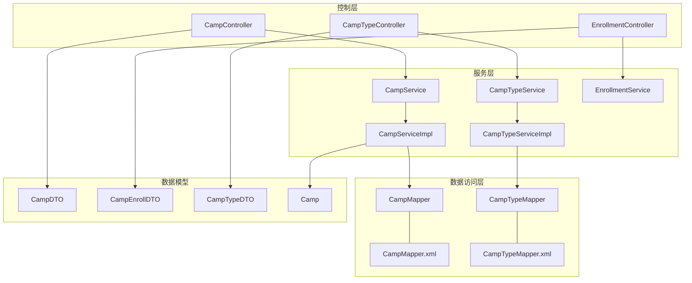
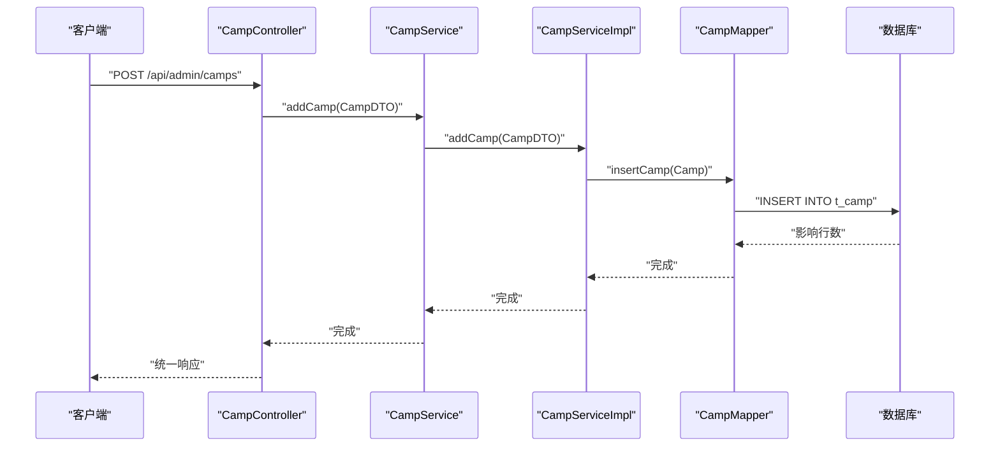
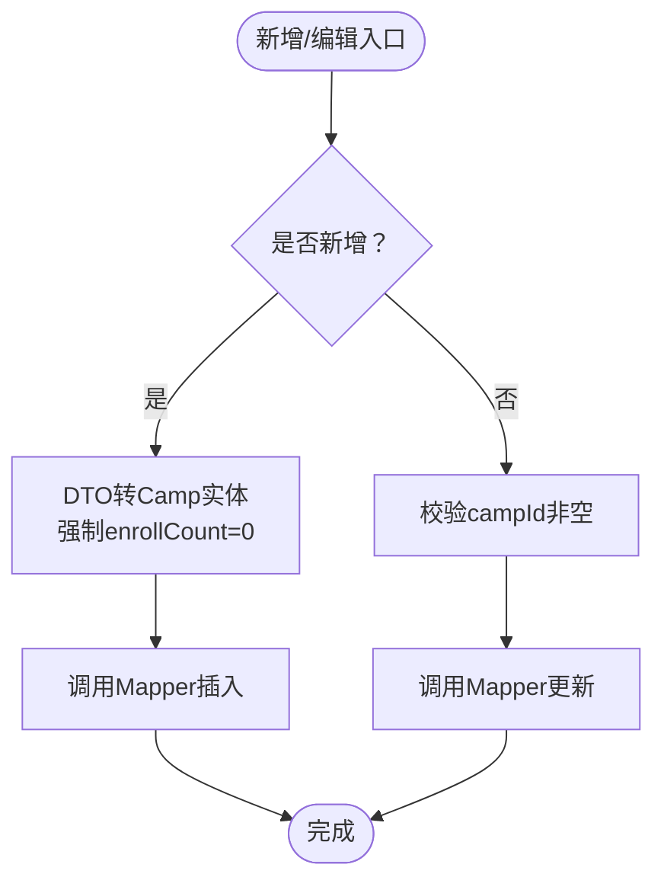
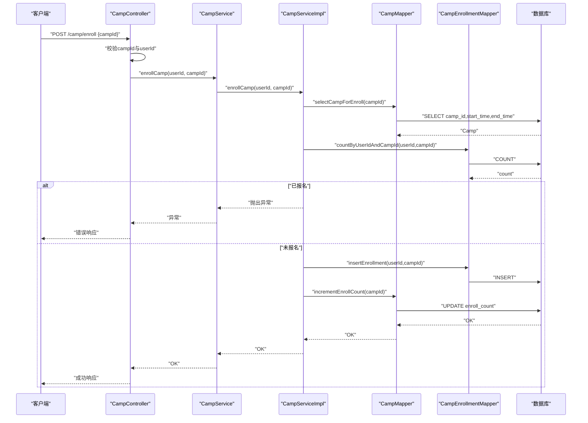
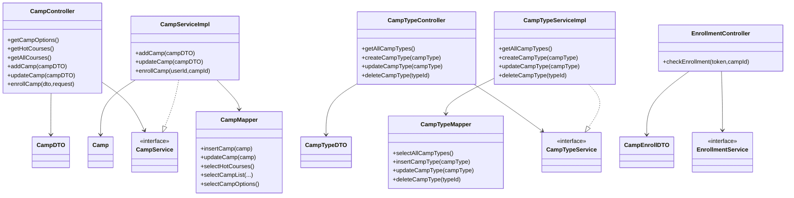

# 营期管理接口

<cite>
**本文引用的文件**
- [CampController.java](file://src/main/java/com/daily/dailychineseculture/controller/CampController.java)
- [CampTypeController.java](file://src/main/java/com/daily/dailychineseculture/controller/CampTypeController.java)
- [EnrollmentController.java](file://src/main/java/com/daily/dailychineseculture/controller/EnrollmentController.java)
- [CampService.java](file://src/main/java/com/daily/dailychineseculture/service/CampService.java)
- [CampTypeService.java](file://src/main/java/com/daily/dailychineseculture/service/CampTypeService.java)
- [EnrollmentService.java](file://src/main/java/com/daily/dailychineseculture/service/EnrollmentService.java)
- [CampServiceImpl.java](file://src/main/java/com/daily/dailychineseculture/service/impl/CampServiceImpl.java)
- [CampTypeServiceImpl.java](file://src/main/java/com/daily/dailychineseculture/service/impl/CampTypeServiceImpl.java)
- [CampMapper.java](file://src/main/java/com/daily/dailychineseculture/mapper/CampMapper.java)
- [CampTypeMapper.java](file://src/main/java/com/daily/dailychineseculture/mapper/CampTypeMapper.java)
- [CampMapper.xml](file://src/main/resources/mapper/CampMapper.xml)
- [CampTypeMapper.xml](file://src/main/resources/mapper/CampTypeMapper.xml)
- [CampDTO.java](file://src/main/java/com/daily/dailychineseculture/dto/CampDTO.java)
- [CampEnrollDTO.java](file://src/main/java/com/daily/dailychineseculture/dto/CampEnrollDTO.java)
- [CampTypeDTO.java](file://src/main/java/com/daily/dailychineseculture/dto/CampTypeDTO.java)
- [Camp.java](file://src/main/java/com/daily/dailychineseculture/entity/Camp.java)
- [营期管理新增与编辑 API文档.md](file://doc/营期管理新增与编辑 API文档.md)
</cite>

## 目录
1. [简介](#简介)
2. [项目结构](#项目结构)
3. [核心组件](#核心组件)
4. [架构总览](#架构总览)
5. [详细组件分析](#详细组件分析)
6. [依赖关系分析](#依赖关系分析)
7. [性能考量](#性能考量)
8. [故障排查指南](#故障排查指南)
9. [结论](#结论)
10. [附录](#附录)

## 简介
本文件面向“营期管理”相关接口的完整API文档，覆盖以下能力：
- 营期基本信息管理：新增、编辑、列表查询、详情查询、热门推荐、最近活跃
- 营期类型分类：类型列表、新增、编辑、删除
- 报名管理：学员报名、报名状态检查
- 状态控制：基于时间的状态推导与展示
- 权限控制与并发处理：基于拦截器与事务的控制策略
- 统计分析与报表：热门课程推荐、最近活跃营期等

接口设计遵循REST风格，统一响应结构，具备清晰的请求参数、响应数据结构与业务流程说明。

## 项目结构
围绕营期管理的关键文件组织如下：
- 控制层：CampController、CampTypeController、EnrollmentController
- 服务层：CampService、CampTypeService、EnrollmentService 及其实现
- 数据访问层：CampMapper、CampTypeMapper 及其XML映射
- 数据传输对象：CampDTO、CampEnrollDTO、CampTypeDTO
- 实体类：Camp
- 文档：营期管理新增与编辑 API文档.md

图表来源
- [CampController.java:1-123](file://src/main/java/com/daily/dailychineseculture/controller/CampController.java#L1-123)
- [CampTypeController.java:1-73](file://src/main/java/com/daily/dailychineseculture/controller/CampTypeController.java#L1-73)
- [EnrollmentController.java:1-58](file://src/main/java/com/daily/dailychineseculture/controller/EnrollmentController.java#L1-58)
- [CampServiceImpl.java:1-266](file://src/main/java/com/daily/dailychineseculture/service/impl/CampServiceImpl.java#L1-266)
- [CampTypeServiceImpl.java:1-45](file://src/main/java/com/daily/dailychineseculture/service/impl/CampTypeServiceImpl.java#L1-45)
- [CampMapper.java:1-132](file://src/main/java/com/daily/dailychineseculture/mapper/CampMapper.java#L1-132)
- [CampTypeMapper.java:1-49](file://src/main/java/com/daily/dailychineseculture/mapper/CampTypeMapper.java#L1-49)
- [CampMapper.xml:1-171](file://src/main/resources/mapper/CampMapper.xml#L1-171)
- [CampTypeMapper.xml:1-59](file://src/main/resources/mapper/CampTypeMapper.xml#L1-59)
- [CampDTO.java:1-63](file://src/main/java/com/daily/dailychineseculture/dto/CampDTO.java#L1-63)
- [CampEnrollDTO.java:1-9](file://src/main/java/com/daily/dailychineseculture/dto/CampEnrollDTO.java#L1-9)
- [CampTypeDTO.java:1-26](file://src/main/java/com/daily/dailychineseculture/dto/CampTypeDTO.java#L1-26)
- [Camp.java:1-64](file://src/main/java/com/daily/dailychineseculture/entity/Camp.java#L1-64)

章节来源
- [CampController.java:1-123](file://src/main/java/com/daily/dailychineseculture/controller/CampController.java#L1-L123)
- [CampTypeController.java:1-73](file://src/main/java/com/daily/dailychineseculture/controller/CampTypeController.java#L1-L73)
- [EnrollmentController.java:1-58](file://src/main/java/com/daily/dailychineseculture/controller/EnrollmentController.java#L1-L58)

## 核心组件
- 营期控制器（CampController）
  - 提供营期新增、编辑、热门列表、全部列表、下拉选项等接口
  - 提供学员报名接口，结合请求上下文中的用户ID执行报名
- 营期类型控制器（CampTypeController）
  - 提供营期类型列表、新增、编辑、删除接口
- 报名控制器（EnrollmentController）
  - 提供报名状态检查接口，基于JWT解析用户ID
- 营期服务（CampService/CampServiceImpl）
  - 负责营期新增、编辑、列表分页、热门推荐、最近活跃、报名等业务逻辑
  - 通过CampMapper与CampTypeMapper访问数据库
- 营期类型服务（CampTypeService/CampTypeServiceImpl）
  - 负责营期类型CRUD
- 报名服务（EnrollmentService）
  - 提供报名状态检查接口（由EnrollmentController调用）

章节来源
- [CampController.java:18-123](file://src/main/java/com/daily/dailychineseculture/controller/CampController.java#L18-L123)
- [CampTypeController.java:11-73](file://src/main/java/com/daily/dailychineseculture/controller/CampTypeController.java#L11-L73)
- [EnrollmentController.java:9-58](file://src/main/java/com/daily/dailychineseculture/controller/EnrollmentController.java#L9-L58)
- [CampService.java:12-81](file://src/main/java/com/daily/dailychineseculture/service/CampService.java#L12-L81)
- [CampServiceImpl.java:24-266](file://src/main/java/com/daily/dailychineseculture/service/impl/CampServiceImpl.java#L24-L266)
- [CampTypeService.java:7-43](file://src/main/java/com/daily/dailychineseculture/service/CampTypeService.java#L7-L43)
- [CampTypeServiceImpl.java:11-45](file://src/main/java/com/daily/dailychineseculture/service/impl/CampTypeServiceImpl.java#L11-L45)
- [EnrollmentService.java:3-17](file://src/main/java/com/daily/dailychineseculture/service/EnrollmentService.java#L3-L17)

## 架构总览
营期管理采用经典的三层架构：
- 控制层负责HTTP请求接收与响应封装
- 服务层负责业务编排与规则校验
- 数据访问层负责SQL执行与结果映射

图表来源
- [CampController.java:84-88](file://src/main/java/com/daily/dailychineseculture/controller/CampController.java#L84-L88)
- [CampServiceImpl.java:164-181](file://src/main/java/com/daily/dailychineseculture/service/impl/CampServiceImpl.java#L164-L181)
- [CampMapper.java:118-127](file://src/main/java/com/daily/dailychineseculture/mapper/CampMapper.java#L118-L127)
- [CampMapper.xml:102-137](file://src/main/resources/mapper/CampMapper.xml#L102-L137)

## 详细组件分析

### 营期基本信息管理

#### 接口清单
- 新增营期
  - 方法：POST
  - 路径：/api/admin/camps
  - 请求体：CampDTO
  - 响应：统一响应结构
- 编辑营期
  - 方法：PUT
  - 路径：/api/admin/camps
  - 请求体：CampDTO（必须包含campId）
  - 响应：统一响应结构
- 获取热门课程推荐
  - 方法：GET
  - 路径：/api/admin/camps/hot
  - 响应：CampVO列表
- 获取所有营期
  - 方法：GET
  - 路径：/api/admin/camps/all
  - 响应：Camp列表
- 获取营期下拉选项
  - 方法：GET
  - 路径：/api/admin/camps/options
  - 响应：CampOptionDTO列表

章节来源
- [CampController.java:36-75](file://src/main/java/com/daily/dailychineseculture/controller/CampController.java#L36-L75)
- [CampController.java:84-101](file://src/main/java/com/daily/dailychineseculture/controller/CampController.java#L84-L101)
- [CampServiceImpl.java:36-100](file://src/main/java/com/daily/dailychineseculture/service/impl/CampServiceImpl.java#L36-L100)
- [CampMapper.java:21-48](file://src/main/java/com/daily/dailychineseculture/mapper/CampMapper.java#L21-L48)
- [CampMapper.xml:139-157](file://src/main/resources/mapper/CampMapper.xml#L139-L157)

#### 请求参数与响应结构
- 新增/编辑营期（CampDTO）
  - 字段：campId（编辑时必填）、typeId、term、name、intro、startTime、endTime、status、tag
  - 时间格式：yyyy-MM-dd HH:mm:ss
  - enrollCount：新增时强制为0，编辑时不更新
- 热门课程推荐（CampVO）
  - 字段：id、tag、type、term、title、count、start_time
  - term格式：第X期
  - count格式：千分位字符串
- 下拉选项（CampOptionDTO）
  - 字段：campId、name、term

章节来源
- [CampDTO.java:12-63](file://src/main/java/com/daily/dailychineseculture/dto/CampDTO.java#L12-L63)
- [CampServiceImpl.java:42-90](file://src/main/java/com/daily/dailychineseculture/service/impl/CampServiceImpl.java#L42-L90)
- [CampMapper.xml:139-157](file://src/main/resources/mapper/CampMapper.xml#L139-L157)

#### 业务流程与规则
- 新增流程
  - DTO转实体，强制设置enrollCount=0，调用Mapper插入
- 编辑流程
  - 校验campId非空，DTO转实体，不更新enrollCount，调用Mapper更新
- 热门推荐
  - 联表查询，按标签优先、报名人数降序、开营时间降序取前5条
- 下拉选项
  - 按开营时间倒序返回id、name、term

图表来源
- [CampServiceImpl.java:164-205](file://src/main/java/com/daily/dailychineseculture/service/impl/CampServiceImpl.java#L164-L205)
- [CampMapper.xml:102-137](file://src/main/resources/mapper/CampMapper.xml#L102-L137)

章节来源
- [CampServiceImpl.java:164-205](file://src/main/java/com/daily/dailychineseculture/service/impl/CampServiceImpl.java#L164-L205)
- [CampMapper.xml:102-137](file://src/main/resources/mapper/CampMapper.xml#L102-L137)
- [营期管理新增与编辑 API文档.md:113-129](file://doc/营期管理新增与编辑 API文档.md#L113-L129)

### 营期类型分类管理

#### 接口清单
- 查询所有营期类型
  - 方法：GET
  - 路径：/api/admin/camp-types
  - 响应：CampTypeDTO列表
- 新增营期类型
  - 方法：POST
  - 路径：/api/admin/camp-types
  - 请求体：CampTypeDTO
  - 响应：统一响应结构
- 编辑营期类型
  - 方法：PUT
  - 路径：/api/admin/camp-types
  - 请求体：CampTypeDTO
  - 响应：统一响应结构
- 删除营期类型
  - 方法：DELETE
  - 路径：/api/admin/camp-types/{typeId}
  - 响应：统一响应结构

章节来源
- [CampTypeController.java:28-71](file://src/main/java/com/daily/dailychineseculture/controller/CampTypeController.java#L28-L71)
- [CampTypeServiceImpl.java:20-43](file://src/main/java/com/daily/dailychineseculture/service/impl/CampTypeServiceImpl.java#L20-L43)
- [CampTypeMapper.java:15-47](file://src/main/java/com/daily/dailychineseculture/mapper/CampTypeMapper.java#L15-L47)
- [CampTypeMapper.xml:12-56](file://src/main/resources/mapper/CampTypeMapper.xml#L12-L56)

#### 请求参数与响应结构
- 营期类型DTO（CampTypeDTO）
  - 字段：typeId、level、levelName
- 响应：CampTypeDTO列表或统一响应

章节来源
- [CampTypeDTO.java:9-26](file://src/main/java/com/daily/dailychineseculture/dto/CampTypeDTO.java#L9-L26)

### 报名管理

#### 接口清单
- 学员报名
  - 方法：POST
  - 路径：/camp/enroll
  - 请求体：CampEnrollDTO（包含campId）
  - 响应：统一响应结构
  - 权限：需要登录态（从请求上下文获取userId）
- 报名状态检查
  - 方法：GET
  - 路径：/enrollment/check
  - 查询参数：Authorization（Bearer Token）、campId
  - 响应：布尔值（已报名/未报名）

章节来源
- [CampController.java:103-121](file://src/main/java/com/daily/dailychineseculture/controller/CampController.java#L103-L121)
- [EnrollmentController.java:31-56](file://src/main/java/com/daily/dailychineseculture/controller/EnrollmentController.java#L31-L56)

#### 请求参数与响应结构
- 报名DTO（CampEnrollDTO）
  - 字段：campId
- 报名状态检查
  - 请求头：Authorization: Bearer <token>
  - 查询参数：campId
  - 响应：true/false

章节来源
- [CampEnrollDTO.java:6-8](file://src/main/java/com/daily/dailychineseculture/dto/CampEnrollDTO.java#L6-L8)
- [EnrollmentController.java:31-56](file://src/main/java/com/daily/dailychineseculture/controller/EnrollmentController.java#L31-L56)

#### 业务流程与规则
- 报名流程
  - 校验campId与userId非空
  - 校验营期是否存在且未结束
  - 校验是否已报名（唯一性约束）
  - 插入报名记录并原子性增加报名人数
- 报名状态检查流程
  - 从Authorization头解析用户ID
  - 调用服务层检查是否已报名

图表来源
- [CampController.java:103-121](file://src/main/java/com/daily/dailychineseculture/controller/CampController.java#L103-L121)
- [CampServiceImpl.java:207-243](file://src/main/java/com/daily/dailychineseculture/service/impl/CampServiceImpl.java#L207-L243)
- [CampMapper.xml:159-169](file://src/main/resources/mapper/CampMapper.xml#L159-L169)

章节来源
- [CampServiceImpl.java:207-243](file://src/main/java/com/daily/dailychineseculture/service/impl/CampServiceImpl.java#L207-L243)
- [CampMapper.xml:159-169](file://src/main/resources/mapper/CampMapper.xml#L159-L169)

### 状态控制与展示
- 状态推导
  - 通过SQL在查询时根据当前时间与开/结营时间动态计算状态（0未开始、1进行中、2已结束）
- 状态文本
  - 服务层提供状态码到文本的映射（待开课/进行中/已结束）

章节来源
- [CampMapper.xml:53-57](file://src/main/resources/mapper/CampMapper.xml#L53-L57)
- [CampServiceImpl.java:245-264](file://src/main/java/com/daily/dailychineseculture/service/impl/CampServiceImpl.java#L245-L264)

### 权限控制与并发处理
- 权限控制
  - 营期报名接口从请求上下文提取userId，要求登录态
  - 报名状态检查接口从Authorization头解析JWT获取用户ID
- 并发处理
  - 报名流程使用@Transactional保证插入报名记录与更新报名人数的原子性
  - 唯一性约束通过数据库层面防止重复报名

章节来源
- [CampController.java:109-114](file://src/main/java/com/daily/dailychineseculture/controller/CampController.java#L109-L114)
- [EnrollmentController.java:37-38](file://src/main/java/com/daily/dailychineseculture/controller/EnrollmentController.java#L37-L38)
- [CampServiceImpl.java:207-243](file://src/main/java/com/daily/dailychineseculture/service/impl/CampServiceImpl.java#L207-L243)

### 统计分析与报表
- 热门课程推荐
  - 联表查询，按标签优先、报名人数降序、开营时间降序取前5条
- 最近活跃营期
  - 按开营时间倒序取最新5条，包含状态文本与访问计数

章节来源
- [CampServiceImpl.java:42-90](file://src/main/java/com/daily/dailychineseculture/service/impl/CampServiceImpl.java#L42-L90)
- [CampServiceImpl.java:102-125](file://src/main/java/com/daily/dailychineseculture/service/impl/CampServiceImpl.java#L102-L125)
- [CampMapper.xml:139-157](file://src/main/resources/mapper/CampMapper.xml#L139-L157)

## 依赖关系分析

图表来源
- [CampController.java:25-121](file://src/main/java/com/daily/dailychineseculture/controller/CampController.java#L25-L121)
- [CampTypeController.java:18-71](file://src/main/java/com/daily/dailychineseculture/controller/CampTypeController.java#L18-L71)
- [EnrollmentController.java:15-56](file://src/main/java/com/daily/dailychineseculture/controller/EnrollmentController.java#L15-L56)
- [CampServiceImpl.java:28-266](file://src/main/java/com/daily/dailychineseculture/service/impl/CampServiceImpl.java#L28-L266)
- [CampTypeServiceImpl.java:14-45](file://src/main/java/com/daily/dailychineseculture/service/impl/CampTypeServiceImpl.java#L14-L45)
- [CampMapper.java:18-132](file://src/main/java/com/daily/dailychineseculture/mapper/CampMapper.java#L18-L132)
- [CampTypeMapper.java:12-49](file://src/main/java/com/daily/dailychineseculture/mapper/CampTypeMapper.java#L12-L49)
- [CampDTO.java:12-63](file://src/main/java/com/daily/dailychineseculture/dto/CampDTO.java#L12-L63)
- [CampEnrollDTO.java:6-8](file://src/main/java/com/daily/dailychineseculture/dto/CampEnrollDTO.java#L6-L8)
- [CampTypeDTO.java:9-26](file://src/main/java/com/daily/dailychineseculture/dto/CampTypeDTO.java#L9-L26)
- [Camp.java:11-64](file://src/main/java/com/daily/dailychineseculture/entity/Camp.java#L11-L64)

## 性能考量
- 分页查询
  - 支持关键词、状态、类型ID过滤，SQL中使用条件标签，避免无效条件
- 状态计算
  - 在SQL中动态计算状态，减少Java侧处理
- 热门推荐
  - 限制数量为5，避免大结果集
- 建议
  - 为t_camp与t_camp_type建立合适索引以优化分页与过滤
  - 对高频查询结果进行缓存（如热门推荐）

## 故障排查指南
- 新增/编辑失败
  - 检查campId（编辑时必填）与日期格式
  - 查看服务层异常信息与数据库约束
- 报名失败
  - 检查campId是否存在、是否已结束、是否重复报名
  - 确认事务是否回滚导致报名记录未写入
- 报名状态检查失败
  - 检查Authorization头格式与Token有效性
  - 确认campId非空

章节来源
- [CampServiceImpl.java:184-205](file://src/main/java/com/daily/dailychineseculture/service/impl/CampServiceImpl.java#L184-L205)
- [CampServiceImpl.java:207-243](file://src/main/java/com/daily/dailychineseculture/service/impl/CampServiceImpl.java#L207-L243)
- [EnrollmentController.java:36-55](file://src/main/java/com/daily/dailychineseculture/controller/EnrollmentController.java#L36-L55)

## 结论
本文档系统性地梳理了营期管理相关接口，明确了各层职责、数据结构、业务流程与约束规则，并提供了调用示例与故障排查建议。通过统一的响应结构与严格的参数校验，保障了接口的稳定性与一致性。

## 附录

### 接口调用示例（基于现有文档）
- 新增营期
  - curl示例与请求体参见：[营期管理新增与编辑 API文档.md:312-326](file://doc/营期管理新增与编辑 API文档.md#L312-L326)
- 编辑营期
  - curl示例与请求体参见：[营期管理新增与编辑 API文档.md:328-343](file://doc/营期管理新增与编辑 API文档.md#L328-L343)
- 编辑营期（缺少campId）
  - 响应示例参见：[营期管理新增与编辑 API文档.md:356-363](file://doc/营期管理新增与编辑 API文档.md#L356-L363)

### 错误处理方案
- 参数校验失败
  - 返回统一错误响应，提示具体缺失字段
- 业务规则违反
  - 如重复报名、营期已结束、campId为空等，抛出明确异常信息
- 未登录或Token无效
  - 报名状态检查返回未授权响应

章节来源
- [CampController.java:106-120](file://src/main/java/com/daily/dailychineseculture/controller/CampController.java#L106-L120)
- [EnrollmentController.java:51-55](file://src/main/java/com/daily/dailychineseculture/controller/EnrollmentController.java#L51-L55)