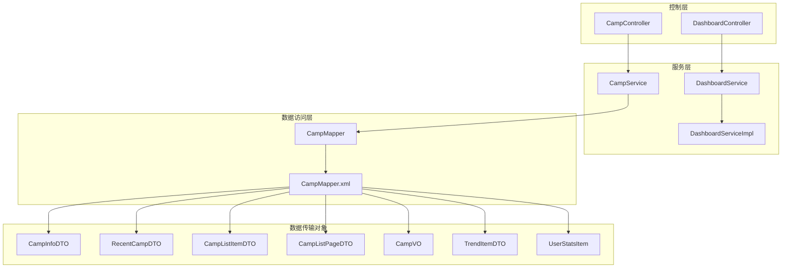
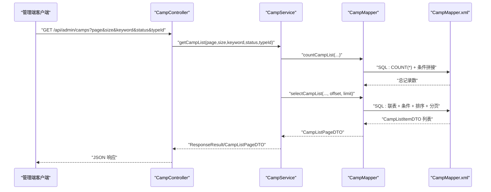
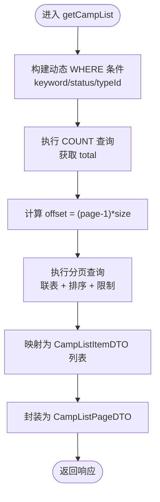
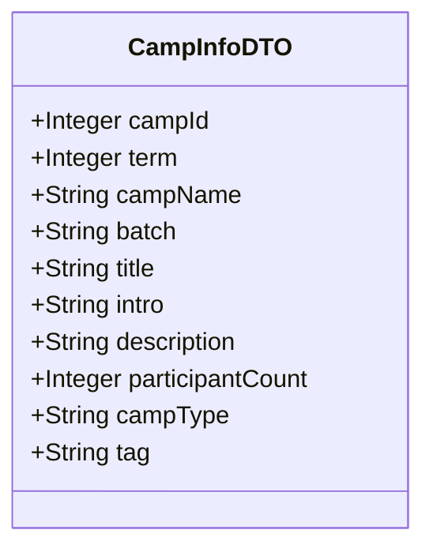
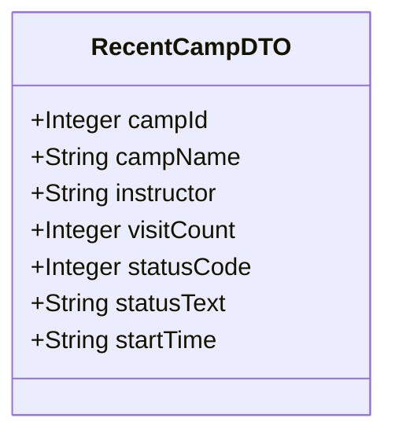
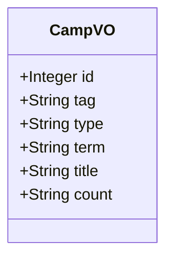
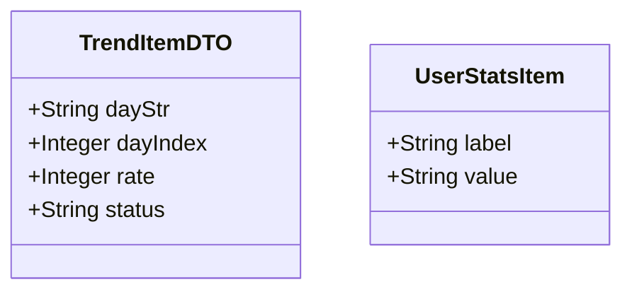
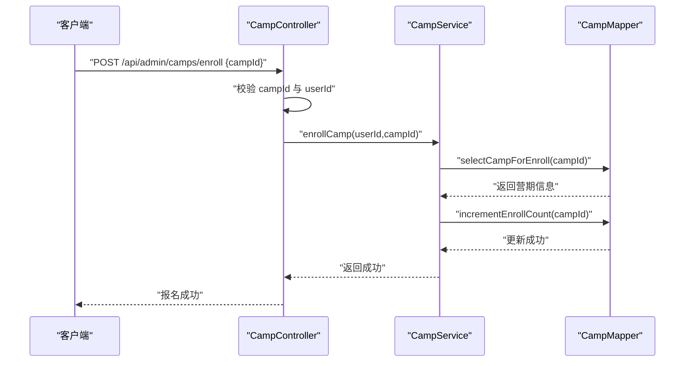
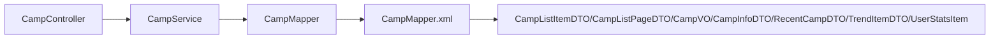
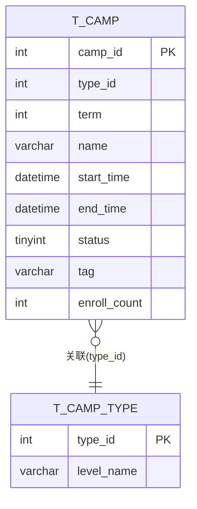

# 营期统计分析

<cite>
**本文引用的文件**
- [DashboardController.java](file://src/main/java/com/daily/dailychineseculture/controller/DashboardController.java)
- [DashboardService.java](file://src/main/java/com/daily/dailychineseculture/service/DashboardService.java)
- [DashboardServiceImpl.java](file://src/main/java/com/daily/dailychineseculture/service/impl/DashboardServiceImpl.java)
- [CampController.java](file://src/main/java/com/daily/dailychineseculture/controller/CampController.java)
- [CampService.java](file://src/main/java/com/daily/dailychineseculture/service/CampService.java)
- [CampMapper.java](file://src/main/java/com/daily/dailychineseculture/mapper/CampMapper.java)
- [CampMapper.xml](file://src/main/resources/mapper/CampMapper.xml)
- [CampInfoDTO.java](file://src/main/java/com/daily/dailychineseculture/dto/CampInfoDTO.java)
- [RecentCampDTO.java](file://src/main/java/com/daily/dailychineseculture/dto/RecentCampDTO.java)
- [CampListItemDTO.java](file://src/main/java/com/daily/dailychineseculture/dto/CampListItemDTO.java)
- [CampListPageDTO.java](file://src/main/java/com/daily/dailychineseculture/dto/CampListPageDTO.java)
- [CampVO.java](file://src/main/java/com/daily/dailychineseculture/dto/CampVO.java)
- [TrendItemDTO.java](file://src/main/java/com/daily/dailychineseculture/dto/TrendItemDTO.java)
- [UserStatsItem.java](file://src/main/java/com/daily/dailychineseculture/dto/UserStatsItem.java)
- [营期管理大盘 API文档.md](file://doc/营期管理大盘 API文档.md)
</cite>

## 目录
1. [简介](#简介)
2. [项目结构](#项目结构)
3. [核心组件](#核心组件)
4. [架构总览](#架构总览)
5. [详细组件分析](#详细组件分析)
6. [依赖分析](#依赖分析)
7. [性能考虑](#性能考虑)
8. [故障排查指南](#故障排查指南)
9. [结论](#结论)
10. [附录](#附录)

## 简介
本文件面向“营期统计分析系统”的后端能力，聚焦于PC端后台管理的“营期管理大盘”与相关统计分析接口，覆盖以下主题：
- 营期报名统计、学习进度分析、完成率统计等核心指标的计算逻辑与数据来源
- CampInfoDTO、RecentCampDTO、CampListItemDTO、CampListPageDTO、CampVO、TrendItemDTO、UserStatsItem 等数据传输对象的结构与用途
- 统计报表的数据聚合方式与性能优化策略
- 实时统计数据更新机制与缓存策略
- 多维度统计分析接口（按时间、类型、状态等条件筛选）
- 图表数据接口与导出功能的扩展建议
- 统计分析最佳实践与数据准确性保障机制

## 项目结构
本项目采用典型的分层架构：Controller -> Service -> Mapper -> XML/Entity，配合DTO/VO进行前后端数据传输。与“营期统计分析”直接相关的模块包括：
- 控制器层：CampController、DashboardController
- 服务层：CampService、DashboardService 及其实现类
- 数据访问层：CampMapper 接口及 CampMapper.xml
- 数据传输对象：CampInfoDTO、RecentCampDTO、CampListItemDTO、CampListPageDTO、CampVO、TrendItemDTO、UserStatsItem 等

图示来源
- [CampController.java:1-123](file://src/main/java/com/daily/dailychineseculture/controller/CampController.java#L1-L123)
- [DashboardController.java:1-36](file://src/main/java/com/daily/dailychineseculture/controller/DashboardController.java#L1-L36)
- [CampService.java:1-81](file://src/main/java/com/daily/dailychineseculture/service/CampService.java#L1-L81)
- [DashboardService.java:1-20](file://src/main/java/com/daily/dailychineseculture/service/DashboardService.java#L1-L20)
- [DashboardServiceImpl.java:1-59](file://src/main/java/com/daily/dailychineseculture/service/impl/DashboardServiceImpl.java#L1-L59)
- [CampMapper.java:1-132](file://src/main/java/com/daily/dailychineseculture/mapper/CampMapper.java#L1-L132)
- [CampMapper.xml:1-171](file://src/main/resources/mapper/CampMapper.xml#L1-L171)

章节来源
- [CampController.java:1-123](file://src/main/java/com/daily/dailychineseculture/controller/CampController.java#L1-L123)
- [CampService.java:1-81](file://src/main/java/com/daily/dailychineseculture/service/CampService.java#L1-L81)
- [CampMapper.java:1-132](file://src/main/java/com/daily/dailychineseculture/mapper/CampMapper.java#L1-L132)
- [CampMapper.xml:1-171](file://src/main/resources/mapper/CampMapper.xml#L1-L171)
- [DashboardController.java:1-36](file://src/main/java/com/daily/dailychineseculture/controller/DashboardController.java#L1-L36)
- [DashboardService.java:1-20](file://src/main/java/com/daily/dailychineseculture/service/DashboardService.java#L1-L20)
- [DashboardServiceImpl.java:1-59](file://src/main/java/com/daily/dailychineseculture/service/impl/DashboardServiceImpl.java#L1-L59)

## 核心组件
- 营期管理大盘接口：提供分页查询、关键词与状态过滤、按开营时间倒序排序、报名人数统计等能力
- 营期详情信息：CampInfoDTO 提供课程详情页顶部信息栏所需字段
- 最近活跃营期：RecentCampDTO 用于后台仪表盘展示
- 热门营期推荐：CampVO 用于首页/推荐位展示
- 学习趋势与用户统计：TrendItemDTO、UserStatsItem 支持完成率与用户画像统计
- 报名流程：CampController 提供报名接口，CampMapper 提供报名计数自增

章节来源
- [营期管理大盘 API文档.md:1-246](file://doc/营期管理大盘 API文档.md#L1-L246)
- [CampController.java:103-121](file://src/main/java/com/daily/dailychineseculture/controller/CampController.java#L103-L121)
- [CampMapper.xml:159-169](file://src/main/resources/mapper/CampMapper.xml#L159-L169)
- [CampInfoDTO.java:1-61](file://src/main/java/com/daily/dailychineseculture/dto/CampInfoDTO.java#L1-L61)
- [RecentCampDTO.java:1-55](file://src/main/java/com/daily/dailychineseculture/dto/RecentCampDTO.java#L1-L55)
- [CampVO.java:1-40](file://src/main/java/com/daily/dailychineseculture/dto/CampVO.java#L1-L40)
- [TrendItemDTO.java:1-24](file://src/main/java/com/daily/dailychineseculture/dto/TrendItemDTO.java#L1-L24)
- [UserStatsItem.java:1-22](file://src/main/java/com/daily/dailychineseculture/dto/UserStatsItem.java#L1-L22)

## 架构总览
下图展示了“营期管理大盘”到数据层的关键调用链与数据流向。

图示来源
- [CampController.java:1-123](file://src/main/java/com/daily/dailychineseculture/controller/CampController.java#L1-L123)
- [CampService.java:59-59](file://src/main/java/com/daily/dailychineseculture/service/CampService.java#L59-L59)
- [CampMapper.java:61-86](file://src/main/java/com/daily/dailychineseculture/mapper/CampMapper.java#L61-L86)
- [CampMapper.xml:19-81](file://src/main/resources/mapper/CampMapper.xml#L19-L81)

## 详细组件分析

### 组件A：营期管理大盘（分页查询与过滤）
- 接口路径：GET /api/admin/camps
- 支持参数：page、size、keyword、status、typeId
- 核心逻辑：
  - COUNT 查询：根据 keyword、status、typeId 动态拼接 WHERE 条件，计算总记录数
  - 分页查询：联表 t_camp 与 t_camp_type，按开营时间倒序，返回 CampListItemDTO 列表
  - 状态计算：通过 CASE WHEN 在 SQL 层将 NOW() 与 start_time/end_time 比较，得出 0/1/2 状态
  - 时间格式化：使用 DATE_FORMAT 将 datetime 转换为字符串 yyyy-MM-dd
- 响应结构：CampListPageDTO，包含 total、page、size、list

图示来源
- [CampMapper.xml:19-81](file://src/main/resources/mapper/CampMapper.xml#L19-L81)
- [CampMapper.java:61-86](file://src/main/java/com/daily/dailychineseculture/mapper/CampMapper.java#L61-L86)
- [CampListPageDTO.java:1-39](file://src/main/java/com/daily/dailychineseculture/dto/CampListPageDTO.java#L1-L39)
- [CampListItemDTO.java:1-74](file://src/main/java/com/daily/dailychineseculture/dto/CampListItemDTO.java#L1-L74)

章节来源
- [营期管理大盘 API文档.md:1-246](file://doc/营期管理大盘 API文档.md#L1-L246)
- [CampMapper.xml:19-81](file://src/main/resources/mapper/CampMapper.xml#L19-L81)
- [CampMapper.java:61-86](file://src/main/java/com/daily/dailychineseculture/mapper/CampMapper.java#L61-L86)
- [CampListPageDTO.java:1-39](file://src/main/java/com/daily/dailychineseculture/dto/CampListPageDTO.java#L1-L39)
- [CampListItemDTO.java:1-74](file://src/main/java/com/daily/dailychineseculture/dto/CampListItemDTO.java#L1-L74)

### 组件B：营期详情信息（CampInfoDTO）
- 用途：课程详情页顶部信息栏展示
- 字段来源：t_camp 与 t_camp_type 的联表查询
- 关键点：campId、term、title、intro、enroll_count、tag、campType(level)、campName(level_name)

图示来源
- [CampInfoDTO.java:1-61](file://src/main/java/com/daily/dailychineseculture/dto/CampInfoDTO.java#L1-L61)
- [CampMapper.xml:107-112](file://src/main/resources/mapper/CampMapper.xml#L107-L112)

章节来源
- [CampInfoDTO.java:1-61](file://src/main/java/com/daily/dailychineseculture/dto/CampInfoDTO.java#L1-L61)
- [CampMapper.xml:107-112](file://src/main/resources/mapper/CampMapper.xml#L107-L112)

### 组件C：最近活跃营期（RecentCampDTO）
- 用途：后台管理仪表盘展示最近活跃营期
- 字段：campId、campName、instructor（固定值）、visitCount（使用 enroll_count 替代）、statusCode、statusText、startTime
- 逻辑：按开营时间倒序取前 5 条

图示来源
- [RecentCampDTO.java:1-55](file://src/main/java/com/daily/dailychineseculture/dto/RecentCampDTO.java#L1-L55)
- [CampMapper.xml:55-59](file://src/main/resources/mapper/CampMapper.xml#L55-L59)

章节来源
- [RecentCampDTO.java:1-55](file://src/main/java/com/daily/dailychineseculture/dto/RecentCampDTO.java#L1-L55)
- [CampMapper.xml:55-59](file://src/main/resources/mapper/CampMapper.xml#L55-L59)

### 组件D：热门营期推荐（CampVO）
- 用途：首页/推荐位展示
- 排序规则：优先“热招”，再按报名人数降序，最后按开营时间降序
- 字段：id、tag、type、term、title、count（报名人数）

图示来源
- [CampVO.java:1-40](file://src/main/java/com/daily/dailychineseculture/dto/CampVO.java#L1-L40)
- [CampMapper.xml:140-157](file://src/main/resources/mapper/CampMapper.xml#L140-L157)

章节来源
- [CampVO.java:1-40](file://src/main/java/com/daily/dailychineseculture/dto/CampVO.java#L1-L40)
- [CampMapper.xml:140-157](file://src/main/resources/mapper/CampMapper.xml#L140-L157)

### 组件E：学习趋势与用户统计（TrendItemDTO、UserStatsItem）
- TrendItemDTO：用于学习趋势图表，包含 dayStr/dayIndex、rate（完成率）、status
- UserStatsItem：用于展示地区、职业、年数、学时等统计项的标签与值

图示来源
- [TrendItemDTO.java:1-24](file://src/main/java/com/daily/dailychineseculture/dto/TrendItemDTO.java#L1-L24)
- [UserStatsItem.java:1-22](file://src/main/java/com/daily/dailychineseculture/dto/UserStatsItem.java#L1-L22)

章节来源
- [TrendItemDTO.java:1-24](file://src/main/java/com/daily/dailychineseculture/dto/TrendItemDTO.java#L1-L24)
- [UserStatsItem.java:1-22](file://src/main/java/com/daily/dailychineseculture/dto/UserStatsItem.java#L1-L22)

### 组件F：报名流程与实时更新
- 报名接口：CampController.enrollCamp 提交报名，校验 campId 与 userId，调用 campService.enrollCamp
- 实时更新：CampMapper.incrementEnrollCount 对报名人数自增
- 事件机制：存在 CampProgressUpdateEvent 与监听器，可用于异步触发统计更新（具体实现需结合服务层与监听器）

图示来源
- [CampController.java:103-121](file://src/main/java/com/daily/dailychineseculture/controller/CampController.java#L103-L121)
- [CampMapper.xml:159-169](file://src/main/resources/mapper/CampMapper.xml#L159-L169)

章节来源
- [CampController.java:103-121](file://src/main/java/com/daily/dailychineseculture/controller/CampController.java#L103-L121)
- [CampMapper.xml:159-169](file://src/main/resources/mapper/CampMapper.xml#L159-L169)

## 依赖分析
- 控制器依赖服务接口，服务接口依赖 Mapper 接口，Mapper 通过 XML 定义 SQL 与结果映射
- DTO/VO 作为跨层数据载体，CampMapper.xml 中定义了多个 resultMap 与 SQL 片段，支撑不同场景的数据聚合
- 状态计算与时间格式化集中在 XML 层，降低服务层复杂度

图示来源
- [CampController.java:1-123](file://src/main/java/com/daily/dailychineseculture/controller/CampController.java#L1-L123)
- [CampService.java:1-81](file://src/main/java/com/daily/dailychineseculture/service/CampService.java#L1-L81)
- [CampMapper.java:1-132](file://src/main/java/com/daily/dailychineseculture/mapper/CampMapper.java#L1-L132)
- [CampMapper.xml:1-171](file://src/main/resources/mapper/CampMapper.xml#L1-L171)

章节来源
- [CampController.java:1-123](file://src/main/java/com/daily/dailychineseculture/controller/CampController.java#L1-L123)
- [CampService.java:1-81](file://src/main/java/com/daily/dailychineseculture/service/CampService.java#L1-L81)
- [CampMapper.java:1-132](file://src/main/java/com/daily/dailychineseculture/mapper/CampMapper.java#L1-L132)
- [CampMapper.xml:1-171](file://src/main/resources/mapper/CampMapper.xml#L1-L171)

## 性能考虑
- SQL 层面的动态条件与联表查询：通过 LEFT JOIN t_camp_type 与条件片段化，避免重复 SQL
- 状态计算与时间格式化：在 SQL 层完成，减少 Java 层处理成本
- 分页与排序：固定按 start_time DESC，有利于索引利用与一致性
- 建议优化方向：
  - 为 t_camp.name、t_camp.status、t_camp.type_id、t_camp.start_time 建立复合索引以提升过滤与排序性能
  - 对高频查询（如热门营期推荐）增加缓存层，设置合理 TTL 与失效策略
  - 对报名人数等实时性要求高的指标，采用读写分离或异步队列+定时刷新的混合策略

[本节为通用性能建议，不直接分析具体文件]

## 故障排查指南
- 401 未授权：确认请求头 Authorization: Bearer <token> 是否正确传递
- 报名失败：检查 campId 是否为空、用户是否登录、营期是否在报名时间内
- 分页异常：核对 page、size 参数范围，以及 keyword/status/typeId 的传入是否符合预期
- 状态显示异常：确认数据库中的 start_time、end_time 是否正确，以及 SQL 中状态计算逻辑

章节来源
- [CampController.java:103-121](file://src/main/java/com/daily/dailychineseculture/controller/CampController.java#L103-L121)
- [DashboardController.java:30-34](file://src/main/java/com/daily/dailychineseculture/controller/DashboardController.java#L30-L34)

## 结论
本系统围绕“营期管理大盘”提供了完善的分页查询、条件过滤与状态计算能力，并通过 DTO/VO 明确了前后端数据契约。CampInfoDTO、RecentCampDTO、CampListItemDTO、CampListPageDTO、CampVO、TrendItemDTO、UserStatsItem 等对象清晰划分了不同场景下的数据承载职责。结合 SQL 层的状态计算与时间格式化，服务层保持简洁，具备良好的可维护性与扩展性。建议后续引入缓存与异步更新机制，进一步提升实时统计的性能与稳定性。

[本节为总结性内容，不直接分析具体文件]

## 附录

### API 定义概览
- 营期管理大盘
  - 方法：GET
  - 路径：/api/admin/camps
  - 查询参数：page、size、keyword、status、typeId
  - 响应：CampListPageDTO
- 营期详情信息
  - 方法：GET
  - 路径：/api/admin/camps/{campId}
  - 响应：CampInfoDTO
- 最近活跃营期
  - 方法：GET
  - 路径：/api/admin/camps/recent
  - 响应：List<RecentCampDTO>
- 热门营期推荐
  - 方法：GET
  - 路径：/api/admin/camps/hot
  - 响应：List<CampVO>
- 营期报名
  - 方法：POST
  - 路径：/api/admin/camps/enroll
  - 请求体：CampEnrollDTO
  - 响应：统一响应结果

章节来源
- [营期管理大盘 API文档.md:1-246](file://doc/营期管理大盘 API文档.md#L1-L246)
- [CampController.java:36-121](file://src/main/java/com/daily/dailychineseculture/controller/CampController.java#L36-L121)
- [CampMapper.xml:107-112](file://src/main/resources/mapper/CampMapper.xml#L107-L112)
- [CampMapper.xml:55-59](file://src/main/resources/mapper/CampMapper.xml#L55-L59)
- [CampMapper.xml:140-157](file://src/main/resources/mapper/CampMapper.xml#L140-L157)

### 数据模型与映射

图示来源
- [CampMapper.xml:84-90](file://src/main/resources/mapper/CampMapper.xml#L84-L90)
- [CampMapper.xml:107-112](file://src/main/resources/mapper/CampMapper.xml#L107-L112)