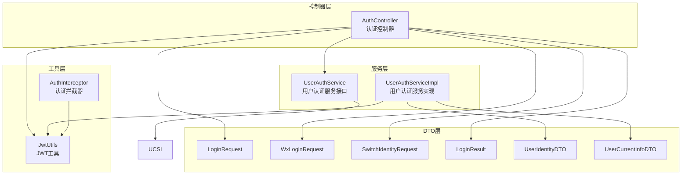
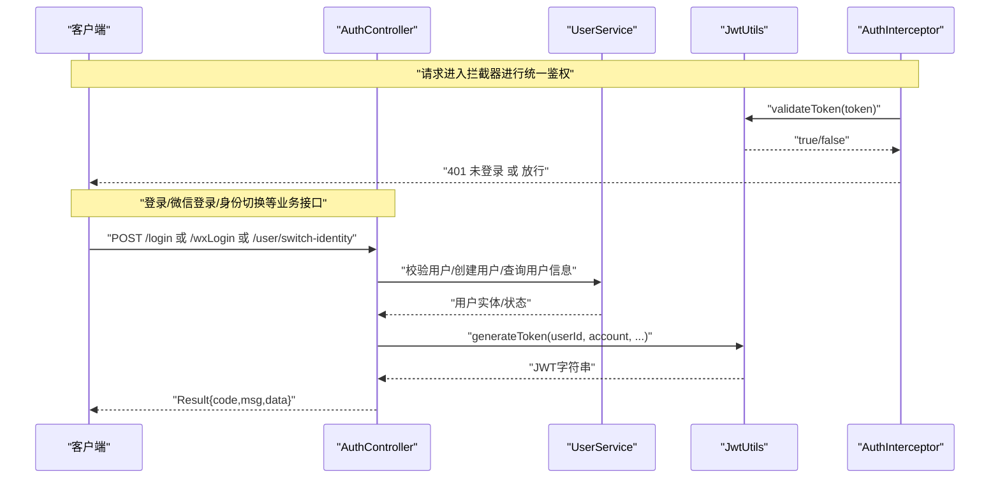
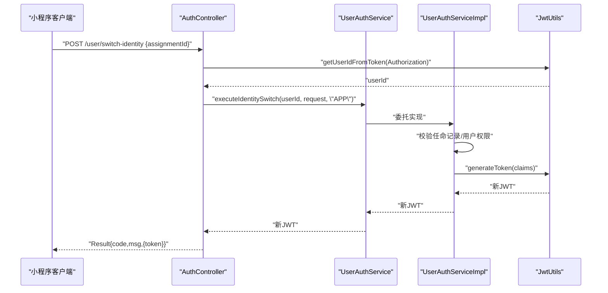
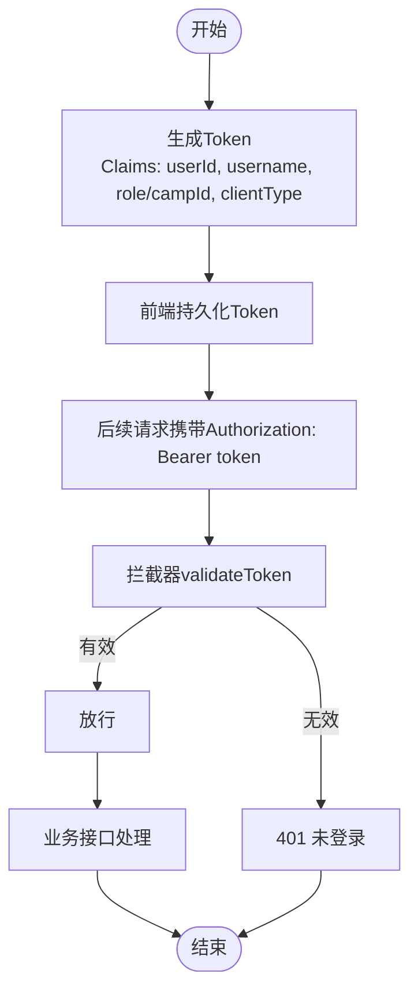
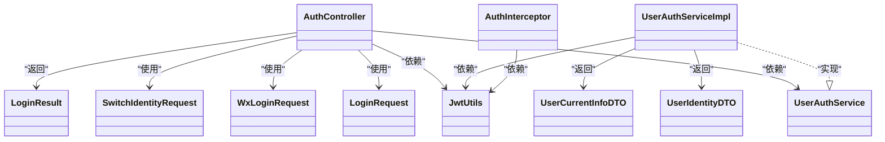

# 认证相关接口

<cite>
**本文引用的文件**   
- [AuthController.java](file://src/main/java/com/daily/dailychineseculture/controller/AuthController.java)
- [UserAuthService.java](file://src/main/java/com/daily/dailychineseculture/service/UserAuthService.java)
- [UserAuthServiceImpl.java](file://src/main/java/com/daily/dailychineseculture/service/impl/UserAuthServiceImpl.java)
- [JwtUtils.java](file://src/main/java/com/daily/dailychineseculture/util/JwtUtils.java)
- [AuthInterceptor.java](file://src/main/java/com/daily/dailychineseculture/interceptor/AuthInterceptor.java)
- [LoginRequest.java](file://src/main/java/com/daily/dailychineseculture/dto/LoginRequest.java)
- [WxLoginRequest.java](file://src/main/java/com/daily/dailychineseculture/dto/WxLoginRequest.java)
- [SwitchIdentityRequest.java](file://src/main/java/com/daily/dailychineseculture/dto/SwitchIdentityRequest.java)
- [UserIdentityDTO.java](file://src/main/java/com/daily/dailychineseculture/dto/UserIdentityDTO.java)
- [UserCurrentInfoDTO.java](file://src/main/java/com/daily/dailychineseculture/dto/UserCurrentInfoDTO.java)
- [LoginResult.java](file://src/main/java/com/daily/dailychineseculture/dto/LoginResult.java)
- [登录接口API文档.md](file://doc/登录接口API文档.md)
- [多端身份切换 API - 最终实施方案.md](file://doc/多端身份切换 API - 最终实施方案.md)
</cite>

## 目录
1. [简介](#简介)
2. [项目结构](#项目结构)
3. [核心组件](#核心组件)
4. [架构总览](#架构总览)
5. [详细组件分析](#详细组件分析)
6. [依赖关系分析](#依赖关系分析)
7. [性能考量](#性能考量)
8. [故障排查指南](#故障排查指南)
9. [结论](#结论)
10. [附录](#附录)

## 简介
本文件聚焦认证相关接口，覆盖用户登录、微信一键登录、多角色身份切换等核心能力，并系统阐述 JWT Token 的生成、验证与会话管理机制。文档同时提供接口定义、请求/响应示例、错误处理说明、安全与性能最佳实践，以及多端（PC 管理端、小程序端）差异化实现细节。

## 项目结构
认证相关代码主要分布在以下层次：
- 控制器层：认证入口与对外接口
- 服务层：认证业务与身份切换逻辑
- 工具层：JWT 工具与拦截器
- DTO 层：请求/响应数据模型
- 文档：接口说明与实施方案

图表来源
- [AuthController.java:1-516](file://src/main/java/com/daily/dailychineseculture/controller/AuthController.java#L1-L516)
- [UserAuthService.java:1-49](file://src/main/java/com/daily/dailychineseculture/service/UserAuthService.java#L1-L49)
- [UserAuthServiceImpl.java:1-168](file://src/main/java/com/daily/dailychineseculture/service/impl/UserAuthServiceImpl.java#L1-L168)
- [JwtUtils.java:1-206](file://src/main/java/com/daily/dailychineseculture/util/JwtUtils.java#L1-L206)
- [AuthInterceptor.java:1-74](file://src/main/java/com/daily/dailychineseculture/interceptor/AuthInterceptor.java#L1-L74)
- [LoginRequest.java:1-19](file://src/main/java/com/daily/dailychineseculture/dto/LoginRequest.java#L1-L19)
- [WxLoginRequest.java:1-24](file://src/main/java/com/daily/dailychineseculture/dto/WxLoginRequest.java#L1-L24)
- [SwitchIdentityRequest.java:1-25](file://src/main/java/com/daily/dailychineseculture/dto/SwitchIdentityRequest.java#L1-L25)
- [LoginResult.java:1-27](file://src/main/java/com/daily/dailychineseculture/dto/LoginResult.java#L1-L27)
- [UserIdentityDTO.java:1-49](file://src/main/java/com/daily/dailychineseculture/dto/UserIdentityDTO.java#L1-L49)
- [UserCurrentInfoDTO.java:1-61](file://src/main/java/com/daily/dailychineseculture/dto/UserCurrentInfoDTO.java#L1-L61)

章节来源
- [AuthController.java:1-516](file://src/main/java/com/daily/dailychineseculture/controller/AuthController.java#L1-L516)
- [UserAuthService.java:1-49](file://src/main/java/com/daily/dailychineseculture/service/UserAuthService.java#L1-L49)
- [UserAuthServiceImpl.java:1-168](file://src/main/java/com/daily/dailychineseculture/service/impl/UserAuthServiceImpl.java#L1-L168)
- [JwtUtils.java:1-206](file://src/main/java/com/daily/dailychineseculture/util/JwtUtils.java#L1-L206)
- [AuthInterceptor.java:1-74](file://src/main/java/com/daily/dailychineseculture/interceptor/AuthInterceptor.java#L1-L74)

## 核心组件
- 认证控制器：提供登录、微信登录、用户信息查询、资料更新、退出登录、身份切换等接口。
- 认证服务：封装身份切换与用户状态查询，支持多端差异化处理。
- JWT 工具：生成与解析 JWT，提供签名校验与过期判断。
- 认证拦截器：统一校验 Authorization 头部，拒绝无效 Token。
- DTO：承载登录、微信登录、身份切换、用户信息等请求/响应结构。

章节来源
- [AuthController.java:1-516](file://src/main/java/com/daily/dailychineseculture/controller/AuthController.java#L1-L516)
- [UserAuthService.java:1-49](file://src/main/java/com/daily/dailychineseculture/service/UserAuthService.java#L1-L49)
- [UserAuthServiceImpl.java:1-168](file://src/main/java/com/daily/dailychineseculture/service/impl/UserAuthServiceImpl.java#L1-L168)
- [JwtUtils.java:1-206](file://src/main/java/com/daily/dailychineseculture/util/JwtUtils.java#L1-L206)
- [AuthInterceptor.java:1-74](file://src/main/java/com/daily/dailychineseculture/interceptor/AuthInterceptor.java#L1-L74)

## 架构总览
认证系统采用“控制器-服务-工具”分层设计，结合拦截器实现统一鉴权。JWT 作为无状态凭证贯穿登录、身份切换与接口访问。

图表来源
- [AuthController.java:1-516](file://src/main/java/com/daily/dailychineseculture/controller/AuthController.java#L1-L516)
- [JwtUtils.java:1-206](file://src/main/java/com/daily/dailychineseculture/util/JwtUtils.java#L1-L206)
- [AuthInterceptor.java:1-74](file://src/main/java/com/daily/dailychineseculture/interceptor/AuthInterceptor.java#L1-L74)

## 详细组件分析

### 用户登录接口
- 接口定义
  - 方法：POST
  - 路径：/login
  - 请求体：LoginRequest（username/password）
  - 响应体：Result<LoginResult>
- 业务流程
  - 参数校验（用户名/密码非空）
  - 用户存在性与密码校验
  - 新用户自动注册
  - 用户信息完整性检查（isComplete）
  - 生成 JWT 并返回
- 响应示例
  - 成功：code=200/201，data.token、data.isComplete、data.userInfo
  - 失败：code=401/500，错误消息
- 安全与会话
  - JWT 有效期（默认7天）
  - 前端持久化 token，接口访问需在 Authorization 头中携带 Bearer token

章节来源
- [AuthController.java:63-112](file://src/main/java/com/daily/dailychineseculture/controller/AuthController.java#L63-L112)
- [LoginRequest.java:1-19](file://src/main/java/com/daily/dailychineseculture/dto/LoginRequest.java#L1-L19)
- [LoginResult.java:1-27](file://src/main/java/com/daily/dailychineseculture/dto/LoginResult.java#L1-L27)
- [JwtUtils.java:37-69](file://src/main/java/com/daily/dailychineseculture/util/JwtUtils.java#L37-L69)
- [AuthInterceptor.java:42-72](file://src/main/java/com/daily/dailychineseculture/interceptor/AuthInterceptor.java#L42-L72)

### 微信一键登录接口
- 接口定义
  - 方法：POST
  - 路径：/wxLogin
  - 请求体：WxLoginRequest（code、nickname、avatar）
  - 响应体：Result<Map<String,Object>>
- 业务流程
  - 校验 code、昵称、头像
  - 调用微信 jscode2session 获取 openid
  - 查询或创建用户
  - 校验用户状态（冻结/正常）
  - 生成 JWT 并返回 token 与 userInfo
- 响应示例
  - 成功：code=200，data.token、data.userInfo
  - 失败：code=400/500，错误消息
- 安全与会话
  - 与账号密码登录一致的 JWT 机制
  - 建议生产环境开启 HTTPS 与敏感日志脱敏

章节来源
- [AuthController.java:141-190](file://src/main/java/com/daily/dailychineseculture/controller/AuthController.java#L141-L190)
- [WxLoginRequest.java:1-24](file://src/main/java/com/daily/dailychineseculture/dto/WxLoginRequest.java#L1-L24)
- [JwtUtils.java:37-69](file://src/main/java/com/daily/dailychineseculture/util/JwtUtils.java#L37-L69)

### 多端身份切换接口
- 接口定义
  - 方法：POST
  - 路径：/user/switch-identity（小程序端）
  - 请求体：SwitchIdentityRequest（assignmentId、dutyType、identity）
  - 响应体：Result<Map<String,Object>>
- 业务流程
  - 解析 Authorization 获取 userId
  - 调用 UserAuthService.executeIdentitySwitch(userId, request, "APP")
  - 校验任命记录归属与有效性
  - 构建包含 dutyType、campId、clientType 的 JWT Claims
  - 返回新 token
- 响应示例
  - 成功：code=200，data.token
  - 失败：code=400/500，错误消息
- 多端差异
  - PC 管理端：/api/admin/user/switch-identity，clientType="ADMIN"，附加 isAdmin=true
  - 小程序端：/app/user/switch-identity，clientType="APP"

图表来源
- [AuthController.java:409-432](file://src/main/java/com/daily/dailychineseculture/controller/AuthController.java#L409-L432)
- [UserAuthService.java:47](file://src/main/java/com/daily/dailychineseculture/service/UserAuthService.java#L47)
- [UserAuthServiceImpl.java:80-117](file://src/main/java/com/daily/dailychineseculture/service/impl/UserAuthServiceImpl.java#L80-L117)
- [JwtUtils.java:77-95](file://src/main/java/com/daily/dailychineseculture/util/JwtUtils.java#L77-L95)

章节来源
- [AuthController.java:409-432](file://src/main/java/com/daily/dailychineseculture/controller/AuthController.java#L409-L432)
- [UserAuthService.java:12-48](file://src/main/java/com/daily/dailychineseculture/service/UserAuthService.java#L12-L48)
- [UserAuthServiceImpl.java:74-117](file://src/main/java/com/daily/dailychineseculture/service/impl/UserAuthServiceImpl.java#L74-L117)
- [SwitchIdentityRequest.java:1-25](file://src/main/java/com/daily/dailychineseculture/dto/SwitchIdentityRequest.java#L1-L25)
- [多端身份切换 API - 最终实施方案.md:112-162](file://doc/多端身份切换 API - 最终实施方案.md#L112-L162)

### JWT Token 生成、验证与刷新机制
- 生成
  - 简化签名算法 HS256，7天过期
  - 登录：包含 userId、username、currentRole、campId（可选）
  - 身份切换：包含 userId、dutyType、campId（可选）、clientType、isAdmin（PC 端）
- 验证
  - 拦截器统一校验，缺失或无效返回 401
  - 工具类提供 validateToken/isTokenExpired/getUserIdFromToken
- 刷新
  - 代码未实现服务端主动刷新；建议前端轮询或到期后引导重新登录

图表来源
- [JwtUtils.java:37-95](file://src/main/java/com/daily/dailychineseculture/util/JwtUtils.java#L37-L95)
- [AuthInterceptor.java:42-72](file://src/main/java/com/daily/dailychineseculture/interceptor/AuthInterceptor.java#L42-L72)

章节来源
- [JwtUtils.java:1-206](file://src/main/java/com/daily/dailychineseculture/util/JwtUtils.java#L1-L206)
- [AuthInterceptor.java:1-74](file://src/main/java/com/daily/dailychineseculture/interceptor/AuthInterceptor.java#L1-L74)

### 用户信息与资料接口
- 获取用户信息：GET /user/info（Authorization 头）
- 获取用户详情：GET /user/detail（Authorization 头）
- 更新用户全部资料：POST /user/updateAll（Authorization 头 + UserUpdateAllRequest）
- 退出登录：POST /user/logout（Authorization 头）
- 小程序端退出登录：POST /app/user/logout（Authorization 可选）

章节来源
- [AuthController.java:215-286](file://src/main/java/com/daily/dailychineseculture/controller/AuthController.java#L215-L286)
- [AuthController.java:345-404](file://src/main/java/com/daily/dailychineseculture/controller/AuthController.java#L345-L404)

## 依赖关系分析
- 控制器依赖服务与工具：AuthController 注入 UserAuthService、JwtUtils、RestTemplate（微信登录）
- 服务实现依赖工具与 Mapper：UserAuthServiceImpl 注入 JwtUtils、DutyAssignmentMapper、UserMapper
- 拦截器依赖工具：AuthInterceptor 注入 JwtUtils，统一校验
- DTO 依赖：LoginRequest、WxLoginRequest、SwitchIdentityRequest、LoginResult、UserIdentityDTO、UserCurrentInfoDTO

图表来源
- [AuthController.java:1-516](file://src/main/java/com/daily/dailychineseculture/controller/AuthController.java#L1-L516)
- [UserAuthService.java:1-49](file://src/main/java/com/daily/dailychineseculture/service/UserAuthService.java#L1-L49)
- [UserAuthServiceImpl.java:1-168](file://src/main/java/com/daily/dailychineseculture/service/impl/UserAuthServiceImpl.java#L1-L168)
- [JwtUtils.java:1-206](file://src/main/java/com/daily/dailychineseculture/util/JwtUtils.java#L1-L206)
- [AuthInterceptor.java:1-74](file://src/main/java/com/daily/dailychineseculture/interceptor/AuthInterceptor.java#L1-L74)
- [LoginRequest.java:1-19](file://src/main/java/com/daily/dailychineseculture/dto/LoginRequest.java#L1-L19)
- [WxLoginRequest.java:1-24](file://src/main/java/com/daily/dailychineseculture/dto/WxLoginRequest.java#L1-L24)
- [SwitchIdentityRequest.java:1-25](file://src/main/java/com/daily/dailychineseculture/dto/SwitchIdentityRequest.java#L1-L25)
- [LoginResult.java:1-27](file://src/main/java/com/daily/dailychineseculture/dto/LoginResult.java#L1-L27)
- [UserIdentityDTO.java:1-49](file://src/main/java/com/daily/dailychineseculture/dto/UserIdentityDTO.java#L1-L49)
- [UserCurrentInfoDTO.java:1-61](file://src/main/java/com/daily/dailychineseculture/dto/UserCurrentInfoDTO.java#L1-L61)

## 性能考量
- Token 生成与解析开销低，适合高频接口
- 建议
  - 合理设置过期时间（当前7天），平衡安全与体验
  - 对频繁调用的接口启用缓存（如用户基础信息）
  - 微信登录调用外部 API 时增加超时与熔断策略
  - 拦截器校验避免重复解析 Token

## 故障排查指南
- 401 未登录
  - 检查 Authorization 头是否缺失或格式错误（需 Bearer token）
  - 检查 Token 是否过期或被篡改
- 账号或密码错误
  - 确认用户名/密码正确，新用户会自动注册
- 微信授权失败
  - 检查 code 是否有效，微信接口返回是否包含 openid
- 无权切换身份
  - assignmentId 是否属于当前用户，任命记录是否存在
- 退出登录
  - JWT 为无状态，服务端无需特殊处理；确保前端清理本地 token

章节来源
- [AuthInterceptor.java:42-72](file://src/main/java/com/daily/dailychineseculture/interceptor/AuthInterceptor.java#L42-L72)
- [AuthController.java:84-96](file://src/main/java/com/daily/dailychineseculture/controller/AuthController.java#L84-L96)
- [AuthController.java:155-165](file://src/main/java/com/daily/dailychineseculture/controller/AuthController.java#L155-L165)
- [UserAuthServiceImpl.java:80-90](file://src/main/java/com/daily/dailychineseculture/service/impl/UserAuthServiceImpl.java#L80-L90)

## 结论
本认证体系以 JWT 为核心，结合拦截器实现统一鉴权，覆盖账号密码登录、微信一键登录与多端身份切换。通过清晰的接口定义、完善的错误处理与安全校验，满足多角色场景下的会话管理需求。建议在生产环境强化密钥管理、HTTPS、日志脱敏与权限细化，并评估 Token 刷新策略与黑名单机制。

## 附录
- 接口一览
  - POST /login：账号密码登录
  - POST /wxLogin：微信一键登录
  - GET /user/info：获取用户信息
  - GET /user/detail：获取用户详情
  - POST /user/updateAll：更新用户全部资料
  - POST /user/logout：通用退出登录
  - POST /app/user/logout：小程序端退出登录
  - POST /user/switch-identity：小程序端身份切换
  - PC 管理端：POST /api/admin/user/switch-identity（由其他控制器实现）
- 安全最佳实践
  - 使用 HTTPS
  - 生产环境使用强密钥与安全存储
  - 限制 Token 过期时间，必要时引入刷新令牌
  - 对外部接口调用增加超时与重试策略
  - 日志脱敏，避免泄露敏感信息