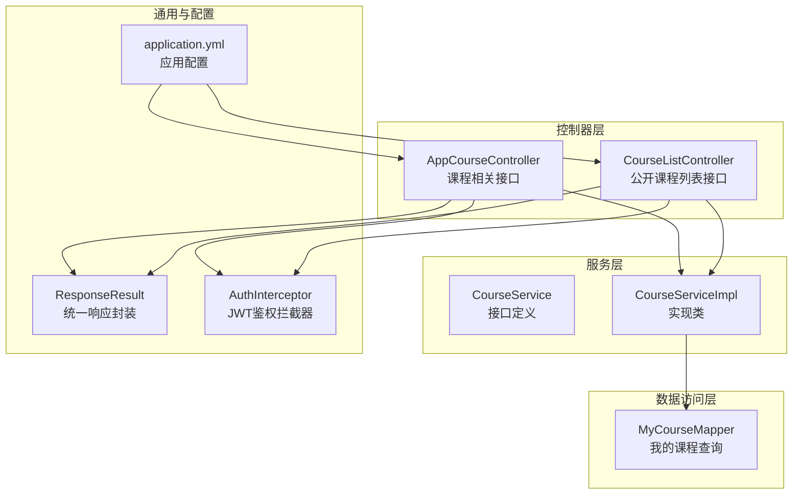
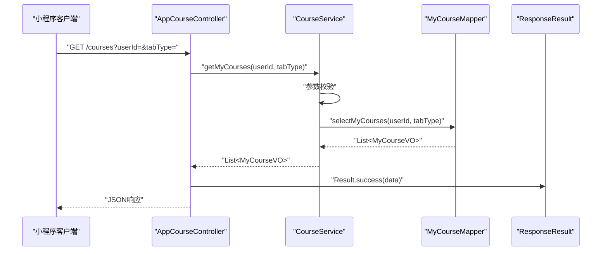
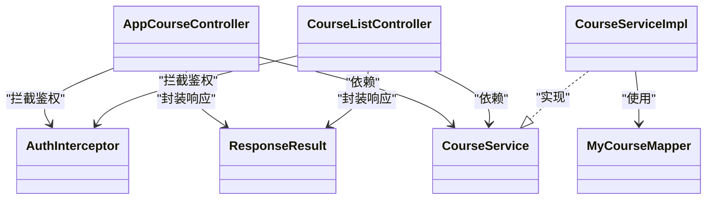

# 我的课程接口

<cite>
**本文引用的文件**
- [我的课程API文档.md](file://doc/我的课程API文档.md)
- [AppCourseController.java](file://src/main/java/com/daily/dailychineseculture/controller/AppCourseController.java)
- [CourseListController.java](file://src/main/java/com/daily/dailychineseculture/controller/CourseListController.java)
- [MyCourseMapper.java](file://src/main/java/com/daily/dailychineseculture/mapper/MyCourseMapper.java)
- [MyCourseVO.java](file://src/main/java/com/daily/dailychineseculture/dto/MyCourseVO.java)
- [CourseServiceImpl.java](file://src/main/java/com/daily/dailychineseculture/service/impl/CourseServiceImpl.java)
- [CourseService.java](file://src/main/java/com/daily/dailychineseculture/service/CourseService.java)
- [ResponseResult.java](file://src/main/java/com/daily/dailychineseculture/common/ResponseResult.java)
- [application.yml](file://src/main/resources/application.yml)
- [AuthInterceptor.java](file://src/main/java/com/daily/dailychineseculture/interceptor/AuthInterceptor.java)
- [Course.java](file://src/main/java/com/daily/dailychineseculture/entity/Course.java)
</cite>

## 目录
1. [简介](#简介)
2. [项目结构](#项目结构)
3. [核心组件](#核心组件)
4. [架构总览](#架构总览)
5. [详细组件分析](#详细组件分析)
6. [依赖分析](#依赖分析)
7. [性能考量](#性能考量)
8. [故障排查指南](#故障排查指南)
9. [结论](#结论)
10. [附录](#附录)

## 简介
本文档聚焦“我的课程”接口，覆盖用户课程列表查询、课程状态管理与学习进度跟踪能力。内容涵盖请求参数、响应格式、业务逻辑、状态分类、进度计算与完成度统计、筛选条件与排序规则、分页机制、权限控制与隐私保护、通知提醒与进度同步机制，并提供接口测试与错误处理指南。

## 项目结构
围绕“我的课程”功能，后端采用标准的三层架构：控制器层负责HTTP接口暴露；服务层承载业务逻辑；数据访问层通过MyBatis执行SQL查询。统一响应体封装于通用类中，拦截器负责鉴权与用户上下文注入。

图表来源
- [AppCourseController.java:28-117](file://src/main/java/com/daily/dailychineseculture/controller/AppCourseController.java#L28-L117)
- [CourseListController.java:18-39](file://src/main/java/com/daily/dailychineseculture/controller/CourseListController.java#L18-L39)
- [CourseService.java:21-79](file://src/main/java/com/daily/dailychineseculture/service/CourseService.java#L21-L79)
- [CourseServiceImpl.java:44-399](file://src/main/java/com/daily/dailychineseculture/service/impl/CourseServiceImpl.java#L44-L399)
- [MyCourseMapper.java:17-58](file://src/main/java/com/daily/dailychineseculture/mapper/MyCourseMapper.java#L17-L58)
- [ResponseResult.java:8-79](file://src/main/java/com/daily/dailychineseculture/common/ResponseResult.java#L8-L79)
- [AuthInterceptor.java:20-91](file://src/main/java/com/daily/dailychineseculture/interceptor/AuthInterceptor.java#L20-L91)
- [application.yml:1-33](file://src/main/resources/application.yml#L1-L33)

章节来源
- [AppCourseController.java:28-117](file://src/main/java/com/daily/dailychineseculture/controller/AppCourseController.java#L28-L117)
- [CourseListController.java:18-39](file://src/main/java/com/daily/dailychineseculture/controller/CourseListController.java#L18-L39)
- [CourseService.java:21-79](file://src/main/java/com/daily/dailychineseculture/service/CourseService.java#L21-L79)
- [CourseServiceImpl.java:44-399](file://src/main/java/com/daily/dailychineseculture/service/impl/CourseServiceImpl.java#L44-L399)
- [MyCourseMapper.java:17-58](file://src/main/java/com/daily/dailychineseculture/mapper/MyCourseMapper.java#L17-L58)
- [ResponseResult.java:8-79](file://src/main/java/com/daily/dailychineseculture/common/ResponseResult.java#L8-L79)
- [AuthInterceptor.java:20-91](file://src/main/java/com/daily/dailychineseculture/interceptor/AuthInterceptor.java#L20-L91)
- [application.yml:1-33](file://src/main/resources/application.yml#L1-L33)

## 核心组件
- 统一响应封装：统一返回结构，包含状态码、消息与数据体，便于前端一致处理。
- 鉴权拦截器：从请求头解析Authorization，校验JWT有效性并将用户ID注入请求属性。
- 控制器层：
  - AppCourseController：提供课程安排目录、今日课程、任务完成、课程数据看板、营期详情等接口。
  - CourseListController：提供公开课程列表分页查询接口。
- 服务层：CourseService接口与CourseServiceImpl实现，承载“我的课程”列表查询、课程计划组织、今日课程与任务完成、课程数据看板与成就统计等业务。
- 数据访问层：MyCourseMapper通过动态SQL完成“我的课程”列表查询，包含状态判定、格式化与排序。
- 数据模型：MyCourseVO承载“我的课程”页面所需字段；Course实体用于课程详情查询。

章节来源
- [ResponseResult.java:8-79](file://src/main/java/com/daily/dailychineseculture/common/ResponseResult.java#L8-L79)
- [AuthInterceptor.java:20-91](file://src/main/java/com/daily/dailychineseculture/interceptor/AuthInterceptor.java#L20-L91)
- [AppCourseController.java:28-117](file://src/main/java/com/daily/dailychineseculture/controller/AppCourseController.java#L28-L117)
- [CourseListController.java:18-39](file://src/main/java/com/daily/dailychineseculture/controller/CourseListController.java#L18-L39)
- [CourseService.java:21-79](file://src/main/java/com/daily/dailychineseculture/service/CourseService.java#L21-L79)
- [CourseServiceImpl.java:44-399](file://src/main/java/com/daily/dailychineseculture/service/impl/CourseServiceImpl.java#L44-L399)
- [MyCourseMapper.java:17-58](file://src/main/java/com/daily/dailychineseculture/mapper/MyCourseMapper.java#L17-L58)
- [MyCourseVO.java:12-57](file://src/main/java/com/daily/dailychineseculture/dto/MyCourseVO.java#L12-L57)
- [Course.java:11-60](file://src/main/java/com/daily/dailychineseculture/entity/Course.java#L11-L60)

## 架构总览
“我的课程”接口属于AppCourseController下的课程相关接口族，当前文档重点覆盖“我的课程列表”查询能力。整体调用链如下：

图表来源
- [AppCourseController.java:28-117](file://src/main/java/com/daily/dailychineseculture/controller/AppCourseController.java#L28-L117)
- [CourseService.java:21-79](file://src/main/java/com/daily/dailychineseculture/service/CourseService.java#L21-L79)
- [CourseServiceImpl.java:71-84](file://src/main/java/com/daily/dailychineseculture/service/impl/CourseServiceImpl.java#L71-L84)
- [MyCourseMapper.java:27-58](file://src/main/java/com/daily/dailychineseculture/mapper/MyCourseMapper.java#L27-L58)
- [ResponseResult.java:48-78](file://src/main/java/com/daily/dailychineseculture/common/ResponseResult.java#L48-L78)

## 详细组件分析

### 接口：获取我的课程列表
- 接口路径：GET /courses
- 功能描述：根据用户ID与标签类型查询用户的课程列表
- 请求参数
  - userId: Long，必填
  - tabType: Integer，必填，取值范围：1-正在学习、2-历史课程、3-已结业
- 响应格式
  - 统一响应体：code、message、data
  - data为课程数组，每项包含：id、status、statusText、type、term、title、updateDate、progress
- 业务逻辑
  - 状态分类：done（已结业）、hist（已结营）、ing（学习中）
  - 筛选条件：依据tabType过滤不同状态集合
  - 数据格式化：期数拼接、日期格式化、状态文本映射
  - 排序规则：按 enrollment 创建时间倒序
- 错误处理
  - 参数为空或不在范围内时抛出参数异常
  - 数据库查询异常由上层统一捕获并返回错误响应

章节来源
- [我的课程API文档.md:8-78](file://doc/我的课程API文档.md#L8-L78)
- [MyCourseMapper.java:27-58](file://src/main/java/com/daily/dailychineseculture/mapper/MyCourseMapper.java#L27-L58)
- [CourseServiceImpl.java:71-84](file://src/main/java/com/daily/dailychineseculture/service/impl/CourseServiceImpl.java#L71-L84)
- [MyCourseVO.java:12-57](file://src/main/java/com/daily/dailychineseculture/dto/MyCourseVO.java#L12-L57)
- [ResponseResult.java:69-78](file://src/main/java/com/daily/dailychineseculture/common/ResponseResult.java#L69-L78)

### 课程状态分类与进度计算
- 状态判定规则
  - done：enrollment.is_completed = 1
  - hist：camp.status = 2 且 enrollment.is_completed = 0
  - ing：其余情况
- 进度与完成度
  - progress：来自 enrollment.progress（0-100）
  - 完成度统计：课程数据看板接口会基于每日完成率计算整体完成度
- 课程详情与批次
  - 课程详情接口返回课程实体，包含批次/期数、描述、开始/结束时间等

章节来源
- [我的课程API文档.md:64-77](file://doc/我的课程API文档.md#L64-L77)
- [CourseServiceImpl.java:271-358](file://src/main/java/com/daily/dailychineseculture/service/impl/CourseServiceImpl.java#L271-L358)
- [Course.java:11-60](file://src/main/java/com/daily/dailychineseculture/entity/Course.java#L11-L60)

### 分页机制
- 公开课程列表接口提供分页查询能力（pageNum、pageSize），适用于“热门课程/课程列表”等场景
- “我的课程”列表接口当前未提供分页参数，若数据量增大建议扩展

章节来源
- [CourseListController.java:32-38](file://src/main/java/com/daily/dailychineseculture/controller/CourseListController.java#L32-L38)

### 权限控制与隐私保护
- 鉴权拦截器从请求头读取Authorization，校验JWT有效性，解析用户ID并注入请求属性
- 若缺少或无效的Authorization，返回401未授权响应
- 建议：生产环境应确保HTTPS、Token刷新策略与最小权限原则

章节来源
- [AuthInterceptor.java:30-91](file://src/main/java/com/daily/dailychineseculture/interceptor/AuthInterceptor.java#L30-L91)
- [application.yml:1-33](file://src/main/resources/application.yml#L1-L33)

### 通知提醒与进度同步机制
- 任务完成接口完成后，服务层发布进度更新事件，可用于触发通知或同步
- 课程数据看板提供趋势与成就展示，便于用户感知学习进展

章节来源
- [CourseServiceImpl.java:259-268](file://src/main/java/com/daily/dailychineseculture/service/impl/CourseServiceImpl.java#L259-L268)
- [CourseServiceImpl.java:299-358](file://src/main/java/com/daily/dailychineseculture/service/impl/CourseServiceImpl.java#L299-L358)

### 课程筛选条件与排序规则
- 筛选条件
  - tabType=1：enrollment.is_completed=0 且 camp.status≠2
  - tabType=2：不限制（历史课程）
  - tabType=3：enrollment.is_completed=1
- 排序规则：enrollment.create_time DESC

章节来源
- [我的课程API文档.md:69-77](file://doc/我的课程API文档.md#L69-L77)
- [MyCourseMapper.java:49-55](file://src/main/java/com/daily/dailychineseculture/mapper/MyCourseMapper.java#L49-L55)

### 数据模型与字段说明
- MyCourseVO：课程列表所需字段（状态编码/文本、班级类型、期数、标题、更新日期、进度）
- Course：课程详情实体（批次、描述、开始/结束时间、状态等）

章节来源
- [MyCourseVO.java:12-57](file://src/main/java/com/daily/dailychineseculture/dto/MyCourseVO.java#L12-L57)
- [Course.java:11-60](file://src/main/java/com/daily/dailychineseculture/entity/Course.java#L11-L60)

## 依赖分析
- 控制器依赖服务接口，服务实现依赖Mapper与多个领域Mapper
- 统一响应封装被控制器与服务广泛使用
- 鉴权拦截器在控制器层生效，确保受保护接口的安全性

图表来源
- [AppCourseController.java:28-117](file://src/main/java/com/daily/dailychineseculture/controller/AppCourseController.java#L28-L117)
- [CourseListController.java:18-39](file://src/main/java/com/daily/dailychineseculture/controller/CourseListController.java#L18-L39)
- [CourseService.java:21-79](file://src/main/java/com/daily/dailychineseculture/service/CourseService.java#L21-L79)
- [CourseServiceImpl.java:44-399](file://src/main/java/com/daily/dailychineseculture/service/impl/CourseServiceImpl.java#L44-L399)
- [MyCourseMapper.java:17-58](file://src/main/java/com/daily/dailychineseculture/mapper/MyCourseMapper.java#L17-L58)
- [ResponseResult.java:8-79](file://src/main/java/com/daily/dailychineseculture/common/ResponseResult.java#L8-L79)
- [AuthInterceptor.java:20-91](file://src/main/java/com/daily/dailychineseculture/interceptor/AuthInterceptor.java#L20-L91)

## 性能考量
- SQL层完成格式化与状态映射，减少Java层处理开销
- 查询按创建时间倒序，利于前端展示
- 建议：当“我的课程”数据量增长时，考虑在enrollment.user_id与状态字段上建立索引；必要时引入分页参数

## 故障排查指南
- 参数错误
  - 现象：返回参数校验错误
  - 排查：确认userId与tabType是否为空或超出取值范围
- 数据库异常
  - 现象：查询失败或空结果
  - 排查：核对t_camp_enrollment、t_camp、t_camp_type三张表是否存在及关联关系
- 鉴权失败
  - 现象：401未授权
  - 排查：确认请求头Authorization是否存在、格式是否正确、Token是否有效
- 响应格式
  - 统一使用ResponseResult封装，前端以code=200作为成功标志

章节来源
- [CourseServiceImpl.java:71-84](file://src/main/java/com/daily/dailychineseculture/service/impl/CourseServiceImpl.java#L71-L84)
- [MyCourseMapper.java:27-58](file://src/main/java/com/daily/dailychineseculture/mapper/MyCourseMapper.java#L27-L58)
- [AuthInterceptor.java:44-91](file://src/main/java/com/daily/dailychineseculture/interceptor/AuthInterceptor.java#L44-L91)
- [ResponseResult.java:48-78](file://src/main/java/com/daily/dailychineseculture/common/ResponseResult.java#L48-L78)

## 结论
“我的课程”接口通过清晰的参数校验、明确的状态分类与进度计算、以及统一的响应封装，实现了小程序端课程列表的稳定展示。结合鉴权拦截器与事件发布机制，可进一步完善权限控制与进度同步能力。建议后续扩展分页、搜索与更细粒度的通知策略，持续提升用户体验与系统可维护性。

## 附录
- 接口测试
  - 使用Maven命令运行测试类，验证不同tabType的查询结果与参数校验
- 部署与运行
  - 应用启动端口与数据库配置可在application.yml中调整

章节来源
- [我的课程API文档.md:101-114](file://doc/我的课程API文档.md#L101-L114)
- [application.yml:1-33](file://src/main/resources/application.yml#L1-L33)