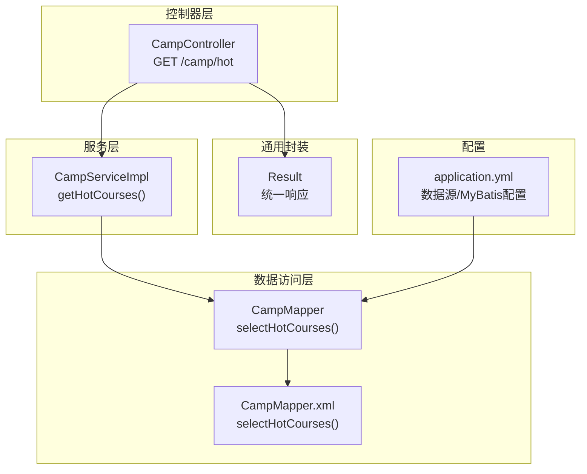
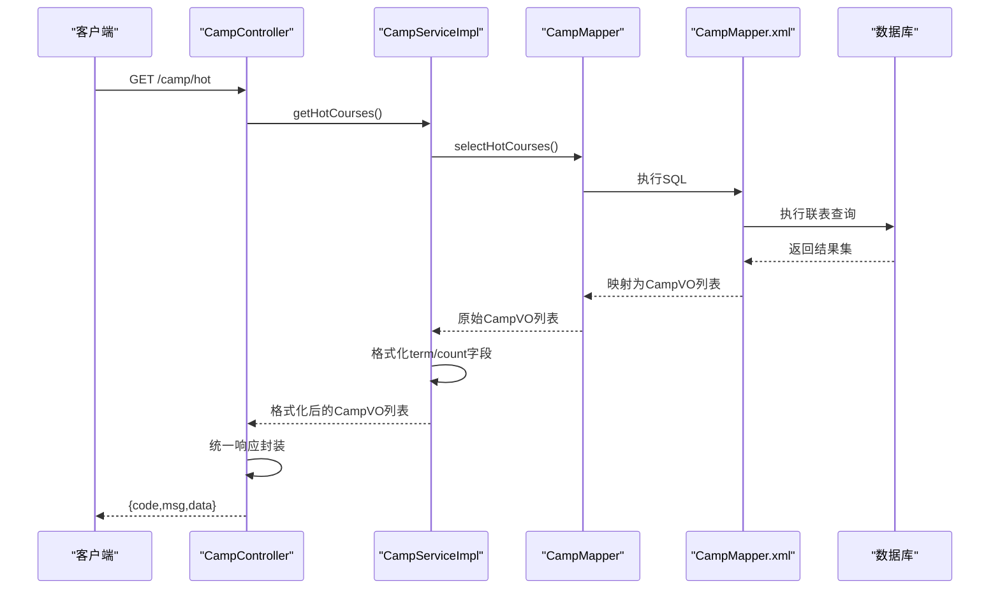
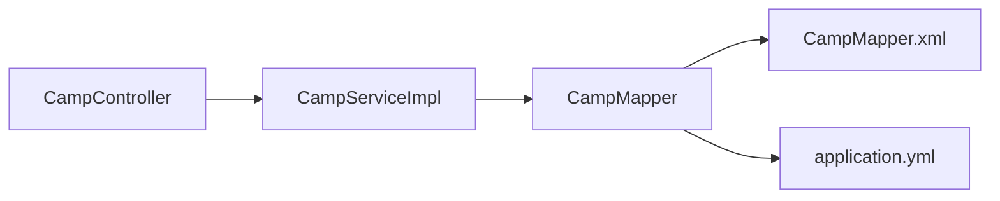
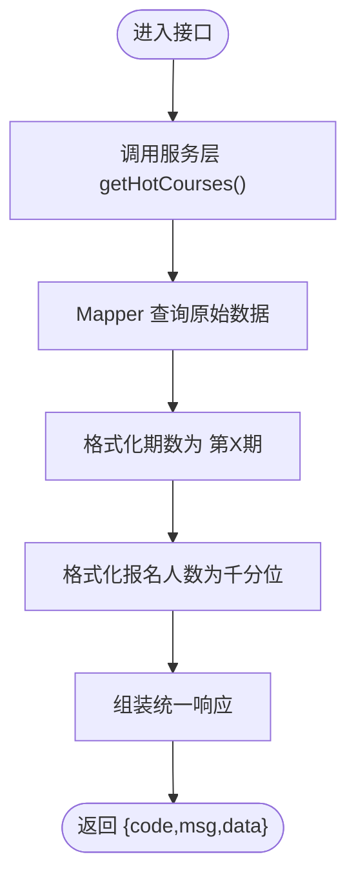

# 热门课程推荐接口

<cite>
**本文引用的文件**
- [热门课程推荐API文档.md](file://doc/热门课程推荐API文档.md)
- [CampController.java](file://src/main/java/com/daily/dailychineseculture/controller/CampController.java)
- [CampServiceImpl.java](file://src/main/java/com/daily/dailychineseculture/service/impl/CampServiceImpl.java)
- [CampMapper.java](file://src/main/java/com/daily/dailychineseculture/mapper/CampMapper.java)
- [CampMapper.xml](file://src/main/resources/mapper/CampMapper.xml)
- [CampVO.java](file://src/main/java/com/daily/dailychineseculture/dto/CampVO.java)
- [Camp.java](file://src/main/java/com/daily/dailychineseculture/entity/Camp.java)
- [Result.java](file://src/main/java/com/daily/dailychineseculture/common/Result.java)
- [application.yml](file://src/main/resources/application.yml)
- [HotCourseRecommendationTest.java](file://src/test/java/com/daily/dailychineseculture/HotCourseRecommendationTest.java)
</cite>

## 目录
1. [简介](#简介)
2. [项目结构](#项目结构)
3. [核心组件](#核心组件)
4. [架构总览](#架构总览)
5. [详细组件分析](#详细组件分析)
6. [依赖分析](#依赖分析)
7. [性能考量](#性能考量)
8. [故障排查指南](#故障排查指南)
9. [结论](#结论)
10. [附录](#附录)

## 简介
本接口为小程序首页提供“热门课程推荐”能力，基于数据库联表查询返回最新且高热度的营期课程信息。接口采用标准的REST风格，返回统一响应体，并在服务层完成必要的数据格式化与校验。

## 项目结构
围绕热门课程推荐的关键文件组织如下：
- 控制器层：负责HTTP请求接入与统一响应封装
- 服务层：负责业务逻辑、数据格式化与边界校验
- 数据访问层：负责SQL执行与结果映射
- 配置文件：数据库连接、MyBatis映射等
- 测试用例：覆盖接口与服务层调用

图表来源
- [CampController.java:49-58](file://src/main/java/com/daily/dailychineseculture/controller/CampController.java#L49-L58)
- [CampServiceImpl.java:42-90](file://src/main/java/com/daily/dailychineseculture/service/impl/CampServiceImpl.java#L42-L90)
- [CampMapper.java:36](file://src/main/java/com/daily/dailychineseculture/mapper/CampMapper.java#L36)
- [CampMapper.xml:139-157](file://src/main/resources/mapper/CampMapper.xml#L139-L157)
- [Result.java:46-80](file://src/main/java/com/daily/dailychineseculture/common/Result.java#L46-L80)
- [application.yml:7-22](file://src/main/resources/application.yml#L7-L22)

章节来源
- [CampController.java:18-123](file://src/main/java/com/daily/dailychineseculture/controller/CampController.java#L18-L123)
- [application.yml:1-33](file://src/main/resources/application.yml#L1-L33)

## 核心组件
- 接口路径：GET /camp/hot
- 返回统一响应体：包含状态码、消息与数据列表
- 数据模型：CampVO（热门课程展示所需字段）
- 数据来源：t_camp 与 t_camp_type 联表查询，按特定规则排序并限制返回条数

章节来源
- [热门课程推荐API文档.md:8-11](file://doc/热门课程推荐API文档.md#L8-L11)
- [CampController.java:49-58](file://src/main/java/com/daily/dailychineseculture/controller/CampController.java#L49-L58)
- [CampVO.java:1-40](file://src/main/java/com/daily/dailychineseculture/dto/CampVO.java#L1-L40)

## 架构总览
接口调用链路自上而下依次为：HTTP请求 → 控制器 → 服务层 → Mapper/XML → 数据库。返回时由服务层进行数据格式化，控制器再以统一响应封装返回。

图表来源
- [CampController.java:49-58](file://src/main/java/com/daily/dailychineseculture/controller/CampController.java#L49-L58)
- [CampServiceImpl.java:42-90](file://src/main/java/com/daily/dailychineseculture/service/impl/CampServiceImpl.java#L42-L90)
- [CampMapper.java:36](file://src/main/java/com/daily/dailychineseculture/mapper/CampMapper.java#L36)
- [CampMapper.xml:139-157](file://src/main/resources/mapper/CampMapper.xml#L139-L157)

## 详细组件分析

### 接口定义与请求参数
- 方法：GET
- 路径：/camp/hot
- 请求参数：无
- 认证与权限：接口未强制要求登录态；若需登录态，可在控制器层增加拦截器或鉴权逻辑

章节来源
- [热门课程推荐API文档.md:8-11](file://doc/热门课程推荐API文档.md#L8-L11)
- [CampController.java:49-58](file://src/main/java/com/daily/dailychineseculture/controller/CampController.java#L49-L58)

### 响应格式与字段说明
- 统一响应体：code（状态码）、msg（消息）、data（数据列表）
- 列表元素CampVO字段：
  - id：营期ID
  - tag：营销角标
  - type：班级类型名称
  - term：期数（格式化为“第X期”）
  - title：课程标题
  - count：报名人数（格式化为千分位）

章节来源
- [热门课程推荐API文档.md:17-60](file://doc/热门课程推荐API文档.md#L17-L60)
- [Result.java:10-24](file://src/main/java/com/daily/dailychineseculture/common/Result.java#L10-L24)
- [CampVO.java:10-40](file://src/main/java/com/daily/dailychineseculture/dto/CampVO.java#L10-L40)

### 推荐算法与排序规则
- 数据来源：t_camp 与 t_camp_type 联表查询
- 过滤条件：仅返回结束时间不早于当前时间的营期
- 排序规则：
  1) 优先展示标记为“热招”的营期
  2) 按报名人数降序
  3) 按开营时间降序
- 返回上限：固定返回最多5条记录

章节来源
- [CampMapper.xml:139-157](file://src/main/resources/mapper/CampMapper.xml#L139-L157)
- [CampServiceImpl.java:42-90](file://src/main/java/com/daily/dailychineseculture/service/impl/CampServiceImpl.java#L42-L90)

### 数据格式化与业务逻辑
- term格式化：将原始期数值格式化为“第X期”，若无法解析则保留原值
- count格式化：将报名人数格式化为千分位字符串，若为空则默认为“0”
- 其他：服务层不对数据做二次过滤，完全依赖SQL层面的WHERE与ORDER BY

章节来源
- [CampServiceImpl.java:42-90](file://src/main/java/com/daily/dailychineseculture/service/impl/CampServiceImpl.java#L42-L90)

### 控制器与统一响应
- 控制器方法：getHotCourses() 直接调用服务层并捕获异常，统一返回Result
- 统一响应：Result.success(data) 或 Result.error(msg)

章节来源
- [CampController.java:49-58](file://src/main/java/com/daily/dailychineseculture/controller/CampController.java#L49-L58)
- [Result.java:46-80](file://src/main/java/com/daily/dailychineseculture/common/Result.java#L46-L80)

### 数据访问层与SQL实现
- Mapper接口方法：selectHotCourses()
- XML实现：联表查询、过滤、排序与LIMIT 5
- 关键点：使用LEFT JOIN关联类型表，CAST enroll_count 为字符以便后续格式化

章节来源
- [CampMapper.java:36](file://src/main/java/com/daily/dailychineseculture/mapper/CampMapper.java#L36)
- [CampMapper.xml:139-157](file://src/main/resources/mapper/CampMapper.xml#L139-L157)

### 实体与数据模型
- 实体Camp：对应t_camp表，包含开营/结营时间、状态、标签、报名人数等
- 视图对象CampVO：用于接口返回，包含格式化后的展示字段

章节来源
- [Camp.java:13-63](file://src/main/java/com/daily/dailychineseculture/entity/Camp.java#L13-L63)
- [CampVO.java:10-40](file://src/main/java/com/daily/dailychineseculture/dto/CampVO.java#L10-L40)

### 推荐策略与个性化机制
- 当前策略：基于“热招”标签、报名人数与开营时间的综合排序
- 个性化：未实现基于用户画像的个性化推荐
- 扩展建议：可引入用户行为特征（学习进度、偏好标签）与协同过滤/内容过滤策略

章节来源
- [CampMapper.xml:151-156](file://src/main/resources/mapper/CampMapper.xml#L151-L156)

### 权限控制与安全考虑
- 登录态：接口未强制登录；如需登录态，可在控制器层增加鉴权拦截
- 参数校验：接口无请求参数，无需参数校验
- 安全建议：结合业务场景增加访问频率限制、IP白名单、接口签名等

章节来源
- [CampController.java:49-58](file://src/main/java/com/daily/dailychineseculture/controller/CampController.java#L49-L58)

### 测试用例与调试指南
- 单元测试：HotCourseRecommendationTest
  - 测试内容：接口返回状态码、数据非空、数量不超过5条
  - 服务层直连测试：绕过控制器直接调用服务层
- 调试步骤：
  - 启动应用后访问：GET /camp/hot
  - 查看控制台输出与断言结果
  - 如需登录态，可在控制器层注入鉴权逻辑并传递userId

章节来源
- [HotCourseRecommendationTest.java:27-73](file://src/test/java/com/daily/dailychineseculture/HotCourseRecommendationTest.java#L27-L73)

## 依赖分析
- 控制器依赖服务层
- 服务层依赖Mapper接口
- Mapper接口通过XML实现SQL
- 应用配置提供数据源与MyBatis映射路径

图表来源
- [CampController.java:27-28](file://src/main/java/com/daily/dailychineseculture/controller/CampController.java#L27-L28)
- [CampServiceImpl.java:30-34](file://src/main/java/com/daily/dailychineseculture/service/impl/CampServiceImpl.java#L30-L34)
- [CampMapper.java:18-131](file://src/main/java/com/daily/dailychineseculture/mapper/CampMapper.java#L18-L131)
- [application.yml:7-22](file://src/main/resources/application.yml#L7-L22)

章节来源
- [CampController.java:18-123](file://src/main/java/com/daily/dailychineseculture/controller/CampController.java#L18-L123)
- [CampServiceImpl.java:1-266](file://src/main/java/com/daily/dailychineseculture/service/impl/CampServiceImpl.java#L1-L266)
- [CampMapper.java:18-131](file://src/main/java/com/daily/dailychineseculture/mapper/CampMapper.java#L18-L131)
- [application.yml:1-33](file://src/main/resources/application.yml#L1-L33)

## 性能考量
- 查询限制：固定LIMIT 5，降低数据量
- 排序索引：建议在t_camp的end_time、enroll_count、start_time上建立合适索引以提升排序效率
- 格式化位置：SQL侧返回字符串便于服务层统一格式化，减少多次往返
- 缓存策略：建议对热门课程结果进行短期缓存（如Redis），结合失效策略与热点数据预热
- 分页扩展：当前接口无分页；如需扩展，可在服务层增加分页参数与总数统计

章节来源
- [CampMapper.xml:156](file://src/main/resources/mapper/CampMapper.xml#L156)
- [CampServiceImpl.java:42-90](file://src/main/java/com/daily/dailychineseculture/service/impl/CampServiceImpl.java#L42-L90)

## 故障排查指南
- 数据为空或数量不足5条
  - 检查t_camp是否存在结束时间不早于当前时间的记录
  - 核对t_camp_type是否正确关联
- 字段格式异常
  - term无法解析：确认term字段为数字
  - count格式异常：确认enroll_count为整数
- 接口报错
  - 控制器层已捕获异常并返回错误信息
  - 可在服务层增加更细粒度的日志与异常处理
- 登录态问题
  - 若需要登录态，请在控制器层增加鉴权拦截器或从请求上下文提取用户信息

章节来源
- [CampController.java:51-57](file://src/main/java/com/daily/dailychineseculture/controller/CampController.java#L51-L57)
- [CampServiceImpl.java:57-84](file://src/main/java/com/daily/dailychineseculture/service/impl/CampServiceImpl.java#L57-L84)

## 结论
当前热门课程推荐接口实现了基于“热招”标签、报名人数与开营时间的简单排序策略，具备良好的可读性与可维护性。建议后续引入个性化推荐、缓存与分页能力，并根据业务需求增强权限控制与安全防护。

## 附录

### API定义与字段对照
- 请求
  - 方法：GET
  - 路径：/camp/hot
  - 参数：无
- 响应
  - code：200表示成功
  - msg：success
  - data：CampVO数组，每项包含id、tag、type、term、title、count

章节来源
- [热门课程推荐API文档.md:8-60](file://doc/热门课程推荐API文档.md#L8-L60)
- [Result.java:10-24](file://src/main/java/com/daily/dailychineseculture/common/Result.java#L10-L24)
- [CampVO.java:10-40](file://src/main/java/com/daily/dailychineseculture/dto/CampVO.java#L10-L40)

### 推荐流程与决策树

图表来源
- [CampServiceImpl.java:42-90](file://src/main/java/com/daily/dailychineseculture/service/impl/CampServiceImpl.java#L42-L90)
- [CampMapper.xml:139-157](file://src/main/resources/mapper/CampMapper.xml#L139-L157)