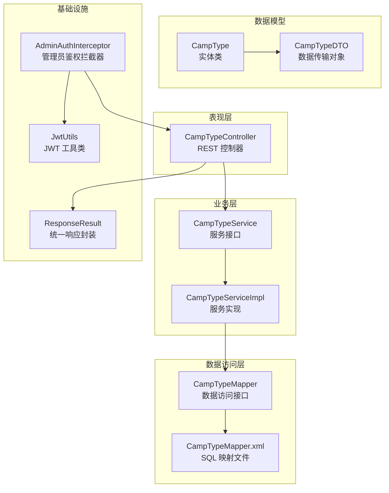
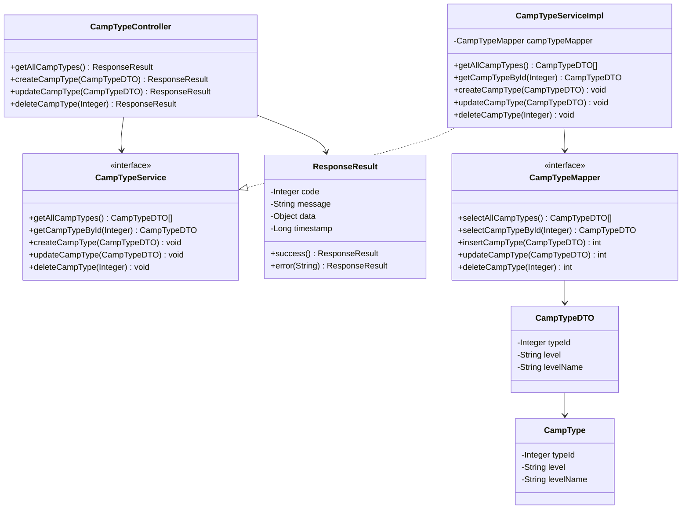
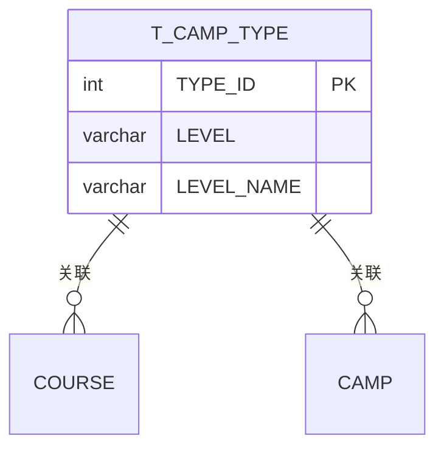
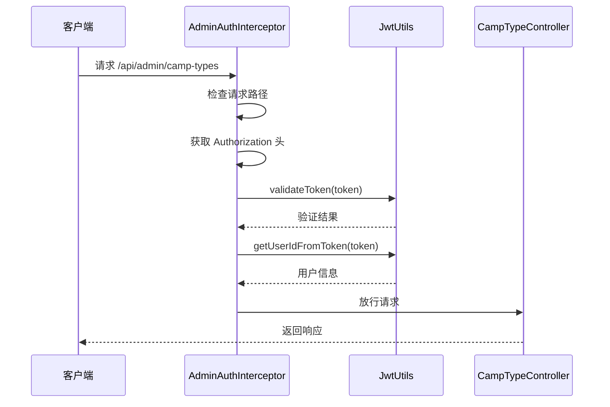
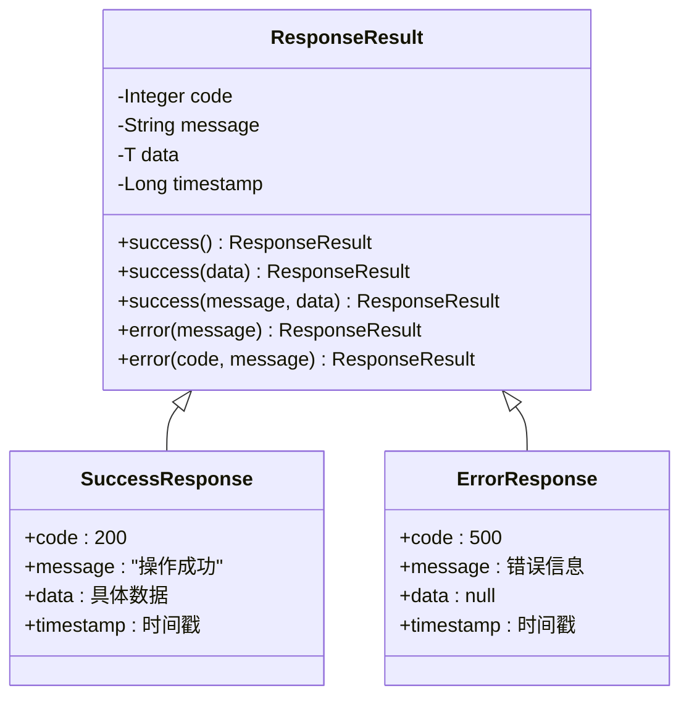
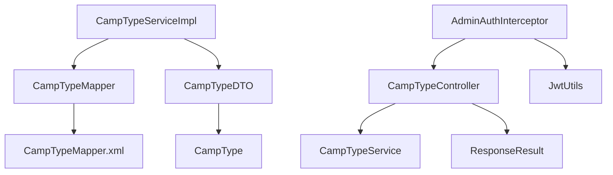
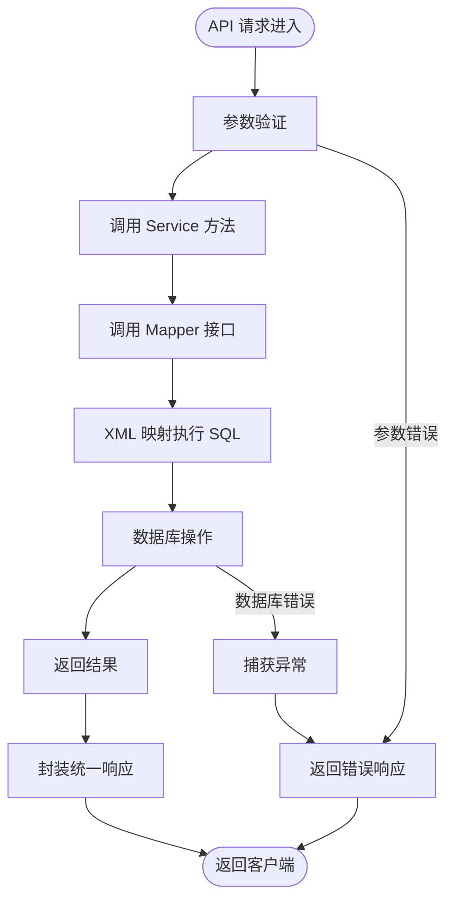

# 课程分类管理接口

<cite>
**本文档引用的文件**
- [课程体系分类管理 API 文档.md](file://doc/课程体系分类管理 API 文档.md)
- [课程体系与分类.md](file://readme/课程管理模块/课程体系与分类.md)
- [CampTypeController.java](file://src/main/java/com/daily/dailychineseculture/controller/CampTypeController.java)
- [CampTypeService.java](file://src/main/java/com/daily/dailychineseculture/service/CampTypeService.java)
- [CampTypeServiceImpl.java](file://src/main/java/com/daily/dailychineseculture/service/impl/CampTypeServiceImpl.java)
- [CampTypeMapper.java](file://src/main/java/com/daily/dailychineseculture/mapper/CampTypeMapper.java)
- [CampTypeMapper.xml](file://src/main/resources/mapper/CampTypeMapper.xml)
- [CampType.java](file://src/main/java/com/daily/dailychineseculture/entity/CampType.java)
- [CampTypeDTO.java](file://src/main/java/com/daily/dailychineseculture/dto/CampTypeDTO.java)
- [ResponseResult.java](file://src/main/java/com/daily/dailychineseculture/common/ResponseResult.java)
- [AdminAuthInterceptor.java](file://src/main/java/com/daily/dailychineseculture/interceptor/AdminAuthInterceptor.java)
- [JwtUtils.java](file://src/main/java/com/daily/dailychineseculture/util/JwtUtils.java)
</cite>

## 目录
1. [简介](#简介)
2. [项目结构](#项目结构)
3. [核心组件](#核心组件)
4. [架构总览](#架构总览)
5. [详细组件分析](#详细组件分析)
6. [依赖关系分析](#依赖关系分析)
7. [性能考虑](#性能考虑)
8. [故障排除指南](#故障排除指南)
9. [结论](#结论)
10. [附录](#附录)

## 简介
本模块提供对课程体系分类（t_camp_type）的完整 CRUD 操作，属于基础字典表，数据量极小，所有接口均返回全量数据，无需分页。接口位于 /api/admin 前缀下，需要管理员权限认证。

## 项目结构
课程分类管理模块采用标准的三层架构设计，包含控制器层、服务层和数据访问层，并通过统一响应封装类提供标准化的接口输出。



**图表来源**
- [CampTypeController.java:15-73](file://src/main/java/com/daily/dailychineseculture/controller/CampTypeController.java#L15-L73)
- [CampTypeServiceImpl.java:14-45](file://src/main/java/com/daily/dailychineseculture/service/impl/CampTypeServiceImpl.java#L14-L45)
- [CampTypeMapper.java:12-49](file://src/main/java/com/daily/dailychineseculture/mapper/CampTypeMapper.java#L12-L49)

**章节来源**
- [课程体系与分类.md:14-57](file://readme/课程管理模块/课程体系与分类.md#L14-L57)
- [项目目录结构介绍.md:278-290](file://doc/项目目录结构介绍.md#L278-L290)

## 核心组件
课程分类管理模块的核心组件包括：

### 数据模型层
- **CampType 实体类**：对应数据库表 t_camp_type，包含 typeId、level、levelName 字段
- **CampTypeDTO 数据传输对象**：用于 API 交互的数据载体

### 服务层
- **CampTypeService 接口**：定义课程分类管理的业务方法
- **CampTypeServiceImpl 实现类**：提供具体的业务逻辑实现

### 数据访问层
- **CampTypeMapper 接口**：定义数据库操作方法
- **CampTypeMapper.xml**：实现 SQL 语句映射

### 控制器层
- **CampTypeController**：提供 RESTful API 接口

**章节来源**
- [CampType.java:10-27](file://src/main/java/com/daily/dailychineseculture/entity/CampType.java#L10-L27)
- [CampTypeDTO.java:10-25](file://src/main/java/com/daily/dailychineseculture/dto/CampTypeDTO.java#L10-L25)
- [CampTypeService.java:10-42](file://src/main/java/com/daily/dailychineseculture/service/CampTypeService.java#L10-L42)
- [CampTypeServiceImpl.java:16-43](file://src/main/java/com/daily/dailychineseculture/service/impl/CampTypeServiceImpl.java#L16-L43)

## 架构总览
课程分类管理采用经典的分层架构模式，各层职责清晰，耦合度低，便于维护和扩展。



**图表来源**
- [CampTypeController.java:18-71](file://src/main/java/com/daily/dailychineseculture/controller/CampTypeController.java#L18-L71)
- [CampTypeService.java:10-42](file://src/main/java/com/daily/dailychineseculture/service/CampTypeService.java#L10-L42)
- [CampTypeServiceImpl.java:16-43](file://src/main/java/com/daily/dailychineseculture/service/impl/CampTypeServiceImpl.java#L16-L43)
- [CampTypeMapper.java:13-47](file://src/main/java/com/daily/dailychineseculture/mapper/CampTypeMapper.java#L13-L47)
- [ResponseResult.java:9-79](file://src/main/java/com/daily/dailychineseculture/common/ResponseResult.java#L9-L79)

## 详细组件分析

### API 接口定义
课程分类管理提供四个核心 RESTful 接口：

#### 1. 查询全量列表
- **接口地址**：GET /api/admin/camp-types
- **功能描述**：查询所有课程体系分类，按 type_id 升序排列
- **请求参数**：无
- **响应格式**：统一响应封装，包含完整的分类列表

#### 2. 新增体系分类
- **接口地址**：POST /api/admin/camp-types
- **功能描述**：新增一个课程体系分类
- **请求头**：Content-Type: application/json
- **请求体**：包含 level 和 levelName 字段

#### 3. 修改体系分类
- **接口地址**：PUT /api/admin/camp-types
- **功能描述**：修改指定的课程体系分类
- **请求头**：Content-Type: application/json
- **请求体**：包含 typeId、level、levelName 字段（level 和 levelName 为非必填）

#### 4. 删除体系分类
- **接口地址**：DELETE /api/admin/camp-types/{typeId}
- **功能描述**：删除指定的课程体系分类
- **路径参数**：typeId（类型 ID）

**章节来源**
- [课程体系分类管理 API 文档.md:11-175](file://doc/课程体系分类管理 API 文档.md#L11-L175)
- [CampTypeController.java:28-71](file://src/main/java/com/daily/dailychineseculture/controller/CampTypeController.java#L28-L71)

### 数据库设计
课程分类管理基于 t_camp_type 表，采用简单的两级分类体系：



**图表来源**
- [课程体系分类管理 API 文档.md:204-209](file://doc/课程体系分类管理 API 文档.md#L204-L209)

**字段映射关系**：
- type_id ↔ typeId
- level ↔ level  
- level_name ↔ levelName

**章节来源**
- [课程体系分类管理 API 文档.md:211-218](file://doc/课程体系分类管理 API 文档.md#L211-L218)

### 权限控制机制
系统采用基于 JWT 的管理员权限控制：



**图表来源**
- [AdminAuthInterceptor.java:24-82](file://src/main/java/com/daily/dailychineseculture/interceptor/AdminAuthInterceptor.java#L24-L82)
- [JwtUtils.java:176-227](file://src/main/java/com/daily/dailychineseculture/util/JwtUtils.java#L176-L227)

**章节来源**
- [AdminAuthInterceptor.java:15-93](file://src/main/java/com/daily/dailychineseculture/interceptor/AdminAuthInterceptor.java#L15-L93)
- [JwtUtils.java:26-243](file://src/main/java/com/daily/dailychineseculture/util/JwtUtils.java#L26-L243)

### 统一响应封装
系统采用 ResponseResult 统一响应格式：



**图表来源**
- [ResponseResult.java:9-79](file://src/main/java/com/daily/dailychineseculture/common/ResponseResult.java#L9-L79)

**章节来源**
- [ResponseResult.java:48-79](file://src/main/java/com/daily/dailychineseculture/common/ResponseResult.java#L48-L79)

## 依赖关系分析

### 组件依赖图


**图表来源**
- [CampTypeController.java:20-21](file://src/main/java/com/daily/dailychineseculture/controller/CampTypeController.java#L20-L21)
- [CampTypeServiceImpl.java:18-18](file://src/main/java/com/daily/dailychineseculture/service/impl/CampTypeServiceImpl.java#L18-L18)
- [CampTypeMapper.java:3-5](file://src/main/java/com/daily/dailychineseculture/mapper/CampTypeMapper.java#L3-L5)

### 数据访问流程


**图表来源**
- [CampTypeServiceImpl.java:20-43](file://src/main/java/com/daily/dailychineseculture/service/impl/CampTypeServiceImpl.java#L20-L43)
- [CampTypeMapper.xml:13-56](file://src/main/resources/mapper/CampTypeMapper.xml#L13-L56)

**章节来源**
- [CampTypeMapper.xml:5-56](file://src/main/resources/mapper/CampTypeMapper.xml#L5-L56)

## 性能考虑
由于课程分类属于基础字典表，数据量极小，系统采用以下性能优化策略：

### 1. 数据加载策略
- 全量加载：所有接口返回全量数据，避免分页开销
- 内存缓存：适合小数据量的内存缓存方案
- 无排序分页：简化查询逻辑，提高响应速度

### 2. 数据库优化
- 主键索引：type_id 为主键，查询效率高
- 简单字段：只有三个字段，查询开销小
- 无外键关联：减少 JOIN 操作

### 3. 缓存策略建议
虽然当前为内存缓存，但建议后续可考虑：
- Redis 缓存：支持分布式部署
- LRU 淘汰：控制内存使用
- 异步刷新：监听数据库变更自动更新缓存

## 故障排除指南

### 常见错误及解决方案

#### 1. 权限认证错误
**问题现象**：返回 401 错误或 "Token 已过期或未登录"
**解决方案**：
- 检查 Authorization 头格式是否正确
- 验证 JWT Token 是否过期
- 确认用户具有管理员权限

#### 2. 数据库操作错误
**问题现象**：新增或修改失败，返回 500 错误
**解决方案**：
- 检查数据库连接配置
- 验证字段约束条件
- 查看数据库日志获取详细错误信息

#### 3. 参数验证错误
**问题现象**：返回 400 错误
**解决方案**：
- 检查请求参数格式
- 验证必填字段是否完整
- 确认数据类型符合要求

**章节来源**
- [AdminAuthInterceptor.java:39-59](file://src/main/java/com/daily/dailychineseculture/interceptor/AdminAuthInterceptor.java#L39-L59)
- [JwtUtils.java:214-226](file://src/main/java/com/daily/dailychineseculture/util/JwtUtils.java#L214-L226)

### 接口测试建议
1. **基本功能测试**：验证增删改查接口的正确性
2. **边界条件测试**：测试空值、超长字符串等边界情况
3. **并发测试**：模拟多用户同时操作的场景
4. **错误场景测试**：测试各种异常情况的处理

## 结论
课程分类管理模块采用简洁高效的架构设计，通过标准的三层架构实现了完整的 CRUD 功能。模块具有以下特点：

1. **架构清晰**：分层明确，职责单一
2. **实现简洁**：针对小数据量进行了专门优化
3. **易于维护**：代码结构简单，便于理解和扩展
4. **安全可靠**：完善的权限控制和错误处理机制

该模块为整个课程管理体系提供了基础的分类支撑，为后续的功能扩展奠定了良好的基础。

## 附录

### 接口测试示例
```bash
# 查询列表
curl -X GET http://localhost:8080/api/admin/camp-types

# 新增分类
curl -X POST http://localhost:8080/api/admin/camp-types \
  -H "Content-Type: application/json" \
  -d '{"level":"NL","levelName":"努力班"}'

# 修改分类
curl -X PUT http://localhost:8080/api/admin/camp-types \
  -H "Content-Type: application/json" \
  -d '{"typeId":1,"level":"ML","levelName":"明理班"}'

# 删除分类
curl -X DELETE http://localhost:8080/api/admin/camp-types/1
```

### 相关文件清单
- **实体类**：CampType.java
- **数据传输对象**：CampTypeDTO.java  
- **数据访问接口**：CampTypeMapper.java
- **SQL 映射文件**：CampTypeMapper.xml
- **服务接口**：CampTypeService.java
- **服务实现**：CampTypeServiceImpl.java
- **控制器**：CampTypeController.java
- **统一响应封装**：ResponseResult.java
- **管理员鉴权拦截器**：AdminAuthInterceptor.java
- **JWT 工具类**：JwtUtils.java