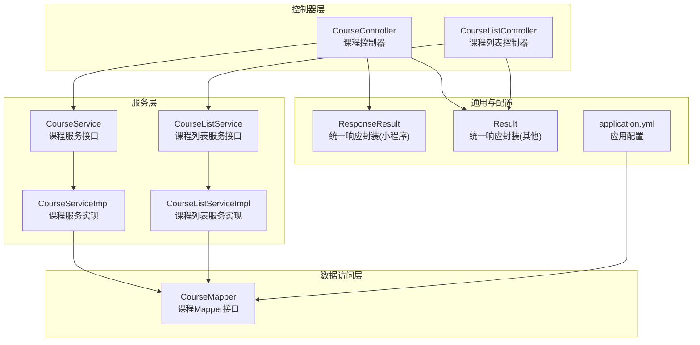
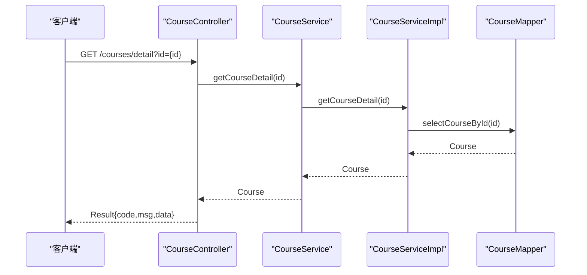
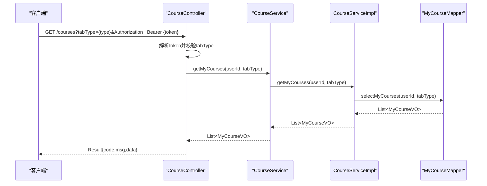
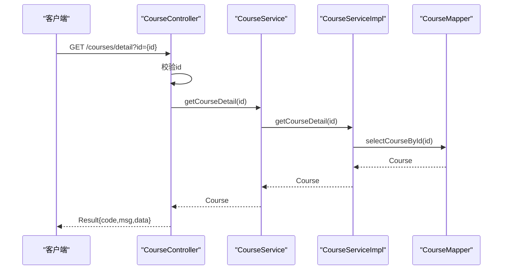
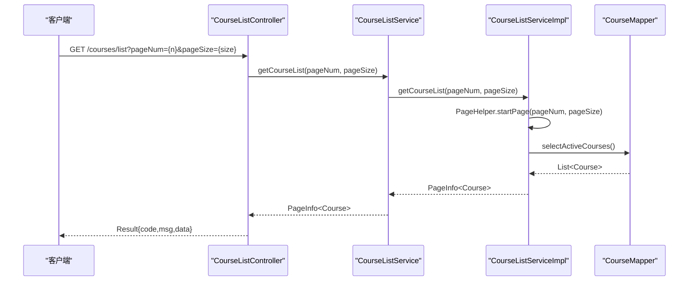
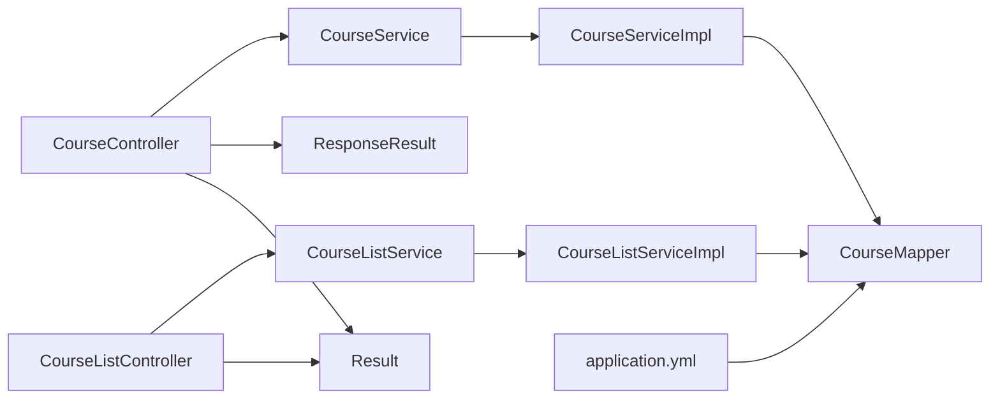

# 课程管理接口

<cite>
**本文引用的文件**
- [CourseController.java](file://src/main/java/com/daily/dailychineseculture/controller/CourseController.java)
- [CourseListController.java](file://src/main/java/com/daily/dailychineseculture/controller/CourseListController.java)
- [CourseService.java](file://src/main/java/com/daily/dailychineseculture/service/CourseService.java)
- [CourseServiceImpl.java](file://src/main/java/com/daily/dailychineseculture/service/impl/CourseServiceImpl.java)
- [CourseListService.java](file://src/main/java/com/daily/dailychineseculture/service/CourseListService.java)
- [CourseListServiceImpl.java](file://src/main/java/com/daily/dailychineseculture/service/impl/CourseListServiceImpl.java)
- [CourseMapper.java](file://src/main/java/com/daily/dailychineseculture/mapper/CourseMapper.java)
- [MyCourseVO.java](file://src/main/java/com/daily/dailychineseculture/dto/MyCourseVO.java)
- [CampVO.java](file://src/main/java/com/daily/dailychineseculture/dto/CampVO.java)
- [ResponseResult.java](file://src/main/java/com/daily/dailychineseculture/common/ResponseResult.java)
- [Result.java](file://src/main/java/com/daily/dailychineseculture/common/Result.java)
- [application.yml](file://src/main/resources/application.yml)
- [热门课程推荐API文档.md](file://doc/热门课程推荐API文档.md)
- [HotCourseRecommendationTest.java](file://src/test/java/com/daily/dailychineseculture/HotCourseRecommendationTest.java)
</cite>

## 目录
1. [简介](#简介)
2. [项目结构](#项目结构)
3. [核心组件](#核心组件)
4. [架构总览](#架构总览)
5. [详细组件分析](#详细组件分析)
6. [依赖分析](#依赖分析)
7. [性能考量](#性能考量)
8. [故障排查指南](#故障排查指南)
9. [结论](#结论)
10. [附录](#附录)

## 简介
本文件面向课程管理相关接口的开发者与测试人员，系统性梳理“热门课程推荐”、“我的课程列表”、“课程详情查询”、“课程分页列表”等核心能力的接口规范、数据模型、业务流程、权限与安全、缓存与性能优化建议以及测试与调试方法。文档同时给出基于现有代码实现的接口定义、参数说明、响应格式与典型调用序列图，帮助快速集成与验证。

## 项目结构
课程管理相关模块采用典型的三层架构：控制器层负责HTTP接口与参数校验；服务层承载业务逻辑；数据访问层通过MyBatis进行数据库交互。分页查询使用PageHelper实现。

图表来源
- [CourseController.java:1-100](file://src/main/java/com/daily/dailychineseculture/controller/CourseController.java#L1-L100)
- [CourseListController.java:1-40](file://src/main/java/com/daily/dailychineseculture/controller/CourseListController.java#L1-L40)
- [CourseService.java:1-80](file://src/main/java/com/daily/dailychineseculture/service/CourseService.java#L1-L80)
- [CourseServiceImpl.java:1-400](file://src/main/java/com/daily/dailychineseculture/service/impl/CourseServiceImpl.java#L1-L400)
- [CourseListService.java:1-21](file://src/main/java/com/daily/dailychineseculture/service/CourseListService.java#L1-L21)
- [CourseListServiceImpl.java:1-30](file://src/main/java/com/daily/dailychineseculture/service/impl/CourseListServiceImpl.java#L1-L30)
- [CourseMapper.java:1-53](file://src/main/java/com/daily/dailychineseculture/mapper/CourseMapper.java#L1-L53)
- [ResponseResult.java:1-79](file://src/main/java/com/daily/dailychineseculture/common/ResponseResult.java#L1-L79)
- [Result.java:1-81](file://src/main/java/com/daily/dailychineseculture/common/Result.java#L1-L81)
- [application.yml:1-33](file://src/main/resources/application.yml#L1-L33)

章节来源
- [CourseController.java:1-100](file://src/main/java/com/daily/dailychineseculture/controller/CourseController.java#L1-L100)
- [CourseListController.java:1-40](file://src/main/java/com/daily/dailychineseculture/controller/CourseListController.java#L1-L40)
- [CourseService.java:1-80](file://src/main/java/com/daily/dailychineseculture/service/CourseService.java#L1-L80)
- [CourseServiceImpl.java:1-400](file://src/main/java/com/daily/dailychineseculture/service/impl/CourseServiceImpl.java#L1-L400)
- [CourseListService.java:1-21](file://src/main/java/com/daily/dailychineseculture/service/CourseListService.java#L1-L21)
- [CourseListServiceImpl.java:1-30](file://src/main/java/com/daily/dailychineseculture/service/impl/CourseListServiceImpl.java#L1-L30)
- [CourseMapper.java:1-53](file://src/main/java/com/daily/dailychineseculture/mapper/CourseMapper.java#L1-L53)
- [ResponseResult.java:1-79](file://src/main/java/com/daily/dailychineseculture/common/ResponseResult.java#L1-L79)
- [Result.java:1-81](file://src/main/java/com/daily/dailychineseculture/common/Result.java#L1-L81)
- [application.yml:1-33](file://src/main/resources/application.yml#L1-L33)

## 核心组件
- 课程控制器：提供热门课程、我的课程、课程详情等接口。
- 课程列表控制器：提供C端课程分页查询接口。
- 课程服务接口与实现：封装课程相关业务逻辑，包括我的课程、课程安排、今日课程、任务完成、课程数据看板、营期信息、课程详情等。
- 课程Mapper：提供课程列表与详情查询的SQL实现。
- 统一响应封装：ResponseResult用于小程序端统一响应，Result用于其他接口统一响应。
- 应用配置：数据库连接、MyBatis驼峰映射、分页插件等。

章节来源
- [CourseController.java:27-99](file://src/main/java/com/daily/dailychineseculture/controller/CourseController.java#L27-L99)
- [CourseListController.java:17-39](file://src/main/java/com/daily/dailychineseculture/controller/CourseListController.java#L17-L39)
- [CourseService.java:21-79](file://src/main/java/com/daily/dailychineseculture/service/CourseService.java#L21-L79)
- [CourseServiceImpl.java:44-399](file://src/main/java/com/daily/dailychineseculture/service/impl/CourseServiceImpl.java#L44-L399)
- [CourseMapper.java:14-52](file://src/main/java/com/daily/dailychineseculture/mapper/CourseMapper.java#L14-L52)
- [ResponseResult.java:9-79](file://src/main/java/com/daily/dailychineseculture/common/ResponseResult.java#L9-L79)
- [Result.java:10-81](file://src/main/java/com/daily/dailychineseculture/common/Result.java#L10-L81)

## 架构总览
课程管理接口遵循标准的MVC分层，控制器负责路由与参数校验，服务层组织业务流程，Mapper执行SQL查询。分页查询通过PageHelper在服务层启用。

图表来源
- [CourseController.java:87-98](file://src/main/java/com/daily/dailychineseculture/controller/CourseController.java#L87-L98)
- [CourseService.java:78](file://src/main/java/com/daily/dailychineseculture/service/CourseService.java#L78)
- [CourseServiceImpl.java:391-398](file://src/main/java/com/daily/dailychineseculture/service/impl/CourseServiceImpl.java#L391-L398)
- [CourseMapper.java:39-51](file://src/main/java/com/daily/dailychineseculture/mapper/CourseMapper.java#L39-L51)

## 详细组件分析

### 热门课程推荐接口
- 接口路径：GET /courses/hot
- 功能描述：小程序端首页热门课程推荐，返回最新开营的若干课程。
- 请求参数：无
- 响应数据：CampVO列表
- 统一响应：ResponseResult
- 业务要点：
  - 返回固定数量的热门课程（由服务层实现决定），当前文档中未发现该实现，但接口已暴露。
  - 建议结合缓存与数据库索引优化查询性能。

章节来源
- [CourseController.java:48-52](file://src/main/java/com/daily/dailychineseculture/controller/CourseController.java#L48-L52)
- [CampVO.java:10-40](file://src/main/java/com/daily/dailychineseculture/dto/CampVO.java#L10-L40)
- [ResponseResult.java:48-78](file://src/main/java/com/daily/dailychineseculture/common/ResponseResult.java#L48-L78)

### 我的课程列表接口
- 接口路径：GET /courses
- 请求头：
  - Authorization: Bearer {token}
- 请求参数：
  - tabType: 整数，1-正在学习，2-历史课程，3-已结业
- 响应数据：MyCourseVO列表
- 统一响应：Result
- 权限与安全：
  - 通过JWT解析用户ID，未授权返回401。
- 业务要点：
  - 参数校验：tabType必填且范围校验。
  - 服务层直接调用Mapper查询，返回对应状态的课程列表。

图表来源
- [CourseController.java:61-85](file://src/main/java/com/daily/dailychineseculture/controller/CourseController.java#L61-L85)
- [CourseService.java:30](file://src/main/java/com/daily/dailychineseculture/service/CourseService.java#L30)
- [CourseServiceImpl.java:72-84](file://src/main/java/com/daily/dailychineseculture/service/impl/CourseServiceImpl.java#L72-L84)
- [MyCourseVO.java:13-57](file://src/main/java/com/daily/dailychineseculture/dto/MyCourseVO.java#L13-L57)

章节来源
- [CourseController.java:61-85](file://src/main/java/com/daily/dailychineseculture/controller/CourseController.java#L61-L85)
- [CourseService.java:30](file://src/main/java/com/daily/dailychineseculture/service/CourseService.java#L30)
- [CourseServiceImpl.java:72-84](file://src/main/java/com/daily/dailychineseculture/service/impl/CourseServiceImpl.java#L72-L84)
- [MyCourseVO.java:13-57](file://src/main/java/com/daily/dailychineseculture/dto/MyCourseVO.java#L13-L57)

### 课程详情查询接口
- 接口路径：GET /courses/detail
- 请求参数：
  - id: 课程ID（营期ID）
- 响应数据：Course实体
- 统一响应：Result
- 业务要点：
  - 参数校验：id必填。
  - 服务层调用CourseMapper按ID查询课程详情。

图表来源
- [CourseController.java:87-98](file://src/main/java/com/daily/dailychineseculture/controller/CourseController.java#L87-L98)
- [CourseService.java:78](file://src/main/java/com/daily/dailychineseculture/service/CourseService.java#L78)
- [CourseServiceImpl.java:391-398](file://src/main/java/com/daily/dailychineseculture/service/impl/CourseServiceImpl.java#L391-L398)
- [CourseMapper.java:39-51](file://src/main/java/com/daily/dailychineseculture/mapper/CourseMapper.java#L39-L51)

章节来源
- [CourseController.java:87-98](file://src/main/java/com/daily/dailychineseculture/controller/CourseController.java#L87-L98)
- [CourseService.java:78](file://src/main/java/com/daily/dailychineseculture/service/CourseService.java#L78)
- [CourseServiceImpl.java:391-398](file://src/main/java/com/daily/dailychineseculture/service/impl/CourseServiceImpl.java#L391-L398)
- [CourseMapper.java:39-51](file://src/main/java/com/daily/dailychineseculture/mapper/CourseMapper.java#L39-L51)

### 课程分页列表接口
- 接口路径：GET /courses/list
- 请求参数：
  - pageNum: 页码，默认1
  - pageSize: 每页大小，默认10
- 响应数据：PageInfo<Course>
- 统一响应：Result
- 业务要点：
  - 服务层使用PageHelper开启分页，查询“正在开课/招生中”的课程列表。
  - SQL按开营时间升序排列，越近越靠前。

图表来源
- [CourseListController.java:32-38](file://src/main/java/com/daily/dailychineseculture/controller/CourseListController.java#L32-L38)
- [CourseListService.java:19](file://src/main/java/com/daily/dailychineseculture/service/CourseListService.java#L19)
- [CourseListServiceImpl.java:24-28](file://src/main/java/com/daily/dailychineseculture/service/impl/CourseListServiceImpl.java#L24-L28)
- [CourseMapper.java:23-37](file://src/main/java/com/daily/dailychineseculture/mapper/CourseMapper.java#L23-L37)

章节来源
- [CourseListController.java:32-38](file://src/main/java/com/daily/dailychineseculture/controller/CourseListController.java#L32-L38)
- [CourseListService.java:19](file://src/main/java/com/daily/dailychineseculture/service/CourseListService.java#L19)
- [CourseListServiceImpl.java:24-28](file://src/main/java/com/daily/dailychineseculture/service/impl/CourseListServiceImpl.java#L24-L28)
- [CourseMapper.java:23-37](file://src/main/java/com/daily/dailychineseculture/mapper/CourseMapper.java#L23-L37)

### 学习进度与课程数据看板（服务层能力）
- 课程服务实现包含多项与学习进度相关的业务方法，如课程安排目录、今日课程、任务完成、课程数据看板、营期信息等。这些方法在控制器中未直接暴露为HTTP接口，但在服务层具备完整实现，可用于后续接口扩展或内部调用。

章节来源
- [CourseService.java:38-76](file://src/main/java/com/daily/dailychineseculture/service/CourseService.java#L38-L76)
- [CourseServiceImpl.java:87-399](file://src/main/java/com/daily/dailychineseculture/service/impl/CourseServiceImpl.java#L87-L399)

## 依赖分析
- 控制器依赖服务接口，服务实现依赖Mapper接口。
- 统一响应封装类在不同场景下被控制器选择使用（ResponseResult用于小程序端接口，Result用于其他接口）。
- 应用配置启用MyBatis驼峰映射与分页插件，影响数据模型与分页行为。

图表来源
- [CourseController.java:31-38](file://src/main/java/com/daily/dailychineseculture/controller/CourseController.java#L31-L38)
- [CourseListController.java:21-22](file://src/main/java/com/daily/dailychineseculture/controller/CourseListController.java#L21-L22)
- [CourseService.java:21-79](file://src/main/java/com/daily/dailychineseculture/service/CourseService.java#L21-L79)
- [CourseServiceImpl.java:47-69](file://src/main/java/com/daily/dailychineseculture/service/impl/CourseServiceImpl.java#L47-L69)
- [CourseListService.java:10-19](file://src/main/java/com/daily/dailychineseculture/service/CourseListService.java#L10-L19)
- [CourseListServiceImpl.java:20-28](file://src/main/java/com/daily/dailychineseculture/service/impl/CourseListServiceImpl.java#L20-L28)
- [CourseMapper.java:14-52](file://src/main/java/com/daily/dailychineseculture/mapper/CourseMapper.java#L14-L52)
- [ResponseResult.java:9-79](file://src/main/java/com/daily/dailychineseculture/common/ResponseResult.java#L9-L79)
- [Result.java:10-81](file://src/main/java/com/daily/dailychineseculture/common/Result.java#L10-L81)
- [application.yml:17-22](file://src/main/resources/application.yml#L17-L22)

章节来源
- [CourseController.java:31-38](file://src/main/java/com/daily/dailychineseculture/controller/CourseController.java#L31-L38)
- [CourseListController.java:21-22](file://src/main/java/com/daily/dailychineseculture/controller/CourseListController.java#L21-L22)
- [CourseService.java:21-79](file://src/main/java/com/daily/dailychineseculture/service/CourseService.java#L21-L79)
- [CourseServiceImpl.java:47-69](file://src/main/java/com/daily/dailychineseculture/service/impl/CourseServiceImpl.java#L47-L69)
- [CourseListService.java:10-19](file://src/main/java/com/daily/dailychineseculture/service/CourseListService.java#L10-L19)
- [CourseListServiceImpl.java:20-28](file://src/main/java/com/daily/dailychineseculture/service/impl/CourseListServiceImpl.java#L20-L28)
- [CourseMapper.java:14-52](file://src/main/java/com/daily/dailychineseculture/mapper/CourseMapper.java#L14-L52)
- [ResponseResult.java:9-79](file://src/main/java/com/daily/dailychineseculture/common/ResponseResult.java#L9-L79)
- [Result.java:10-81](file://src/main/java/com/daily/dailychineseculture/common/Result.java#L10-L81)
- [application.yml:17-22](file://src/main/resources/application.yml#L17-L22)

## 性能考量
- 分页查询：课程列表接口通过PageHelper实现分页，建议前端合理设置pageNum与pageSize，避免过大页码与过大的每页数量。
- 数据库查询：课程列表SQL按开营时间升序排列，建议在相关列建立索引以提升排序与筛选性能。
- 缓存策略（建议）：
  - 热门课程推荐：对“最新开营课程”结果进行短期缓存（如5-10分钟），降低频繁联表查询压力。
  - 课程详情：对高频访问的课程详情进行缓存，设置合理的失效时间与失效策略。
  - 我的课程列表：按用户维度缓存，结合用户登录态与tabType组合键，注意缓存失效时机（如课程状态变更、报名状态变化）。
- 并发与事务：任务完成与进度更新涉及写操作，已在服务层标注事务注解，确保一致性与回滚策略。

章节来源
- [CourseListServiceImpl.java:24-28](file://src/main/java/com/daily/dailychineseculture/service/impl/CourseListServiceImpl.java#L24-L28)
- [CourseMapper.java:23-37](file://src/main/java/com/daily/dailychineseculture/mapper/CourseMapper.java#L23-L37)
- [CourseServiceImpl.java:227-268](file://src/main/java/com/daily/dailychineseculture/service/impl/CourseServiceImpl.java#L227-L268)

## 故障排查指南
- 授权失败（401）：
  - 检查Authorization头是否携带有效Bearer Token。
  - 校验Token是否过期或签名无效。
- 参数错误：
  - tabType必须为1、2或3；课程详情id不可为空。
- 未找到资源：
  - 课程详情查询不到对应ID的课程会抛出参数异常。
- 单元测试：
  - 可运行热门课程推荐测试类验证接口可用性与数据格式。

章节来源
- [CourseController.java:66-84](file://src/main/java/com/daily/dailychineseculture/controller/CourseController.java#L66-L84)
- [CourseController.java:89-97](file://src/main/java/com/daily/dailychineseculture/controller/CourseController.java#L89-L97)
- [HotCourseRecommendationTest.java:27-55](file://src/test/java/com/daily/dailychineseculture/HotCourseRecommendationTest.java#L27-L55)

## 结论
本项目已实现课程管理的核心接口：热门课程推荐、我的课程列表、课程详情查询与课程分页列表。服务层提供了丰富的学习进度与课程数据看板能力，可作为后续接口扩展的基础。建议尽快引入缓存与索引优化，完善权限校验与错误处理，持续通过单元测试保障接口稳定性。

## 附录

### 接口清单与规范摘要
- 热门课程推荐
  - 方法：GET
  - 路径：/courses/hot
  - 响应：ResponseResult<List<CampVO>>
- 我的课程列表
  - 方法：GET
  - 路径：/courses
  - 请求头：Authorization: Bearer {token}
  - 参数：tabType（1-正在学习，2-历史课程，3-已结业）
  - 响应：Result<List<MyCourseVO>>
- 课程详情查询
  - 方法：GET
  - 路径：/courses/detail
  - 参数：id（课程ID）
  - 响应：Result<Course>
- 课程分页列表
  - 方法：GET
  - 路径：/courses/list
  - 参数：pageNum（默认1）、pageSize（默认10）
  - 响应：Result<PageInfo<Course>>

章节来源
- [CourseController.java:48-52](file://src/main/java/com/daily/dailychineseculture/controller/CourseController.java#L48-L52)
- [CourseController.java:61-85](file://src/main/java/com/daily/dailychineseculture/controller/CourseController.java#L61-L85)
- [CourseController.java:87-98](file://src/main/java/com/daily/dailychineseculture/controller/CourseController.java#L87-L98)
- [CourseListController.java:32-38](file://src/main/java/com/daily/dailychineseculture/controller/CourseListController.java#L32-L38)

### 数据模型与字段说明
- MyCourseVO
  - 字段：id、status、statusText、type、term、title、updateDate、progress
- CampVO
  - 字段：id、tag、type、term、title、count
- Course
  - 字段：id、title、campName、batch、description、participantCount、status、startTime、endTime

章节来源
- [MyCourseVO.java:13-57](file://src/main/java/com/daily/dailychineseculture/dto/MyCourseVO.java#L13-L57)
- [CampVO.java:10-40](file://src/main/java/com/daily/dailychineseculture/dto/CampVO.java#L10-L40)
- [CourseMapper.java:23-51](file://src/main/java/com/daily/dailychineseculture/mapper/CourseMapper.java#L23-L51)

### 配置与运行
- 应用端口与数据库连接、MyBatis驼峰映射、分页插件、文件上传配置均在application.yml中定义。
- 热门课程推荐接口文档位于doc目录，包含技术实现、测试验证与部署说明。

章节来源
- [application.yml:3-33](file://src/main/resources/application.yml#L3-L33)
- [热门课程推荐API文档.md:1-163](file://doc/热门课程推荐API文档.md#L1-L163)