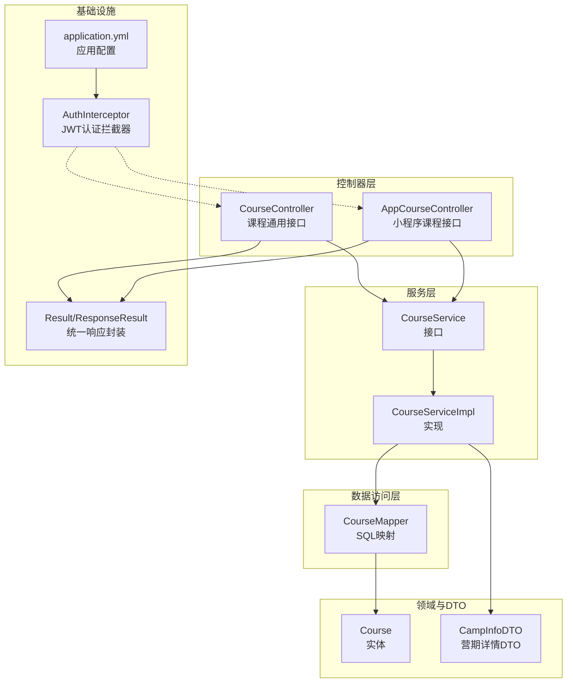
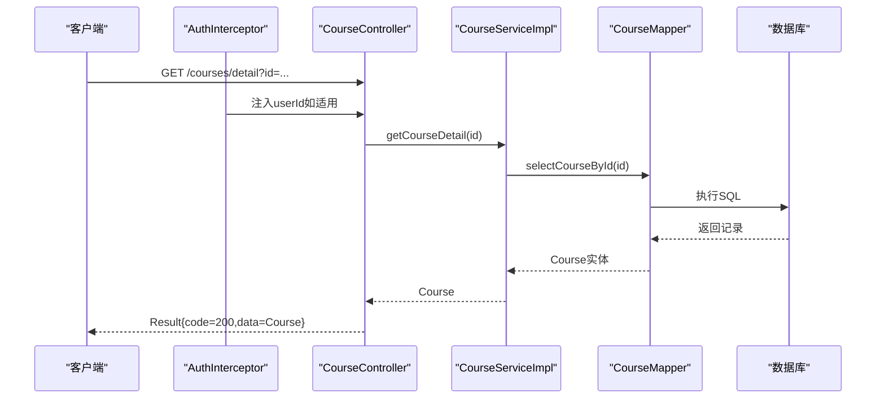
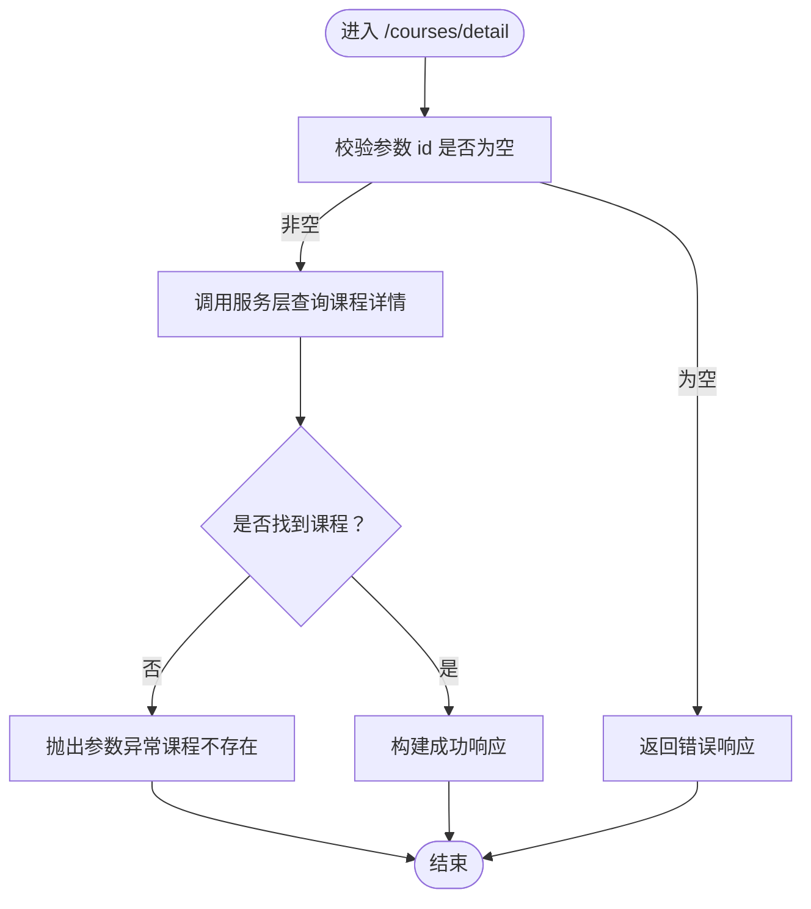
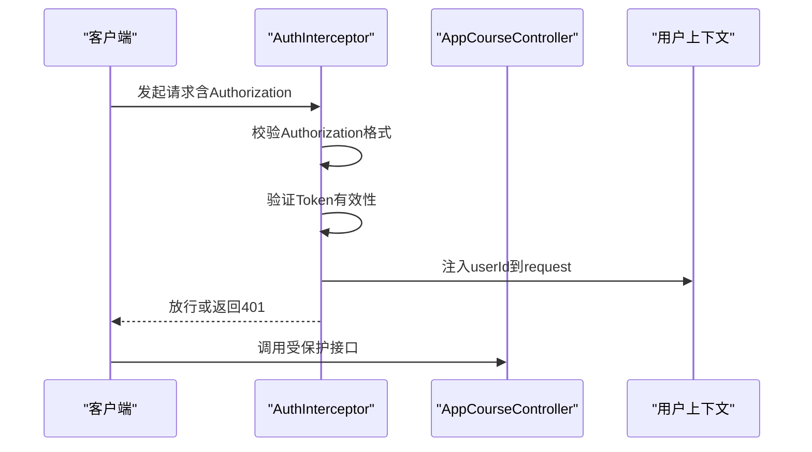
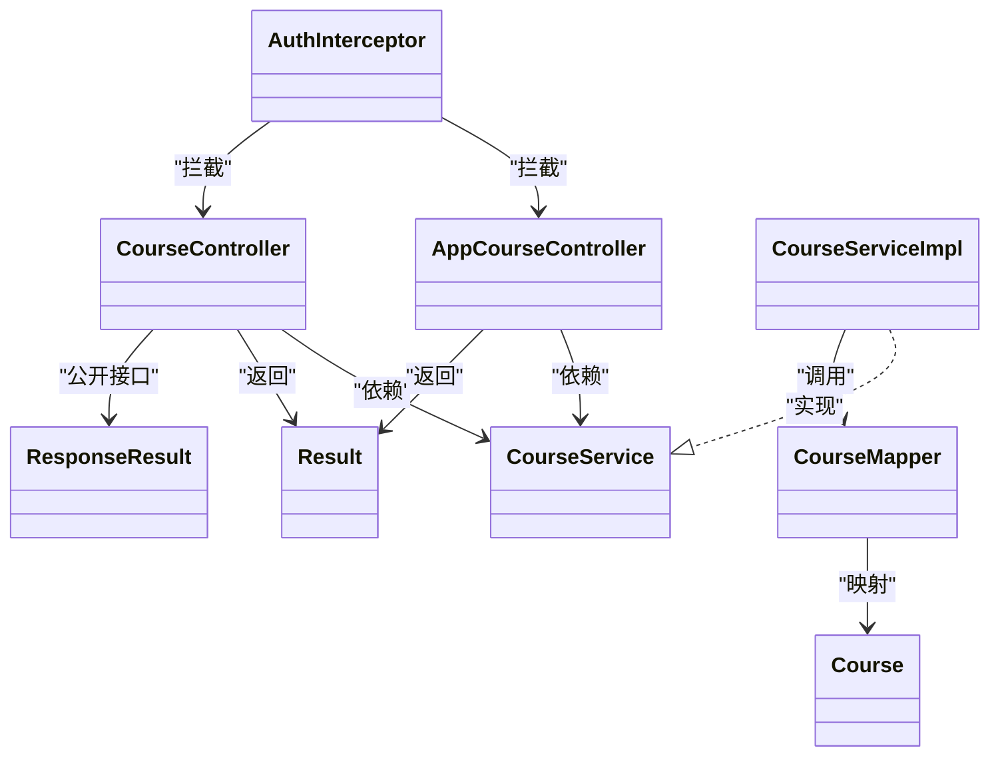

# 课程详情接口

<cite>
**本文引用的文件**
- [CourseController.java](file://src/main/java/com/daily/dailychineseculture/controller/CourseController.java)
- [AppCourseController.java](file://src/main/java/com/daily/dailychineseculture/controller/AppCourseController.java)
- [CourseService.java](file://src/main/java/com/daily/dailychineseculture/service/CourseService.java)
- [CourseServiceImpl.java](file://src/main/java/com/daily/dailychineseculture/service/impl/CourseServiceImpl.java)
- [Course.java](file://src/main/java/com/daily/dailychineseculture/entity/Course.java)
- [CourseMapper.java](file://src/main/java/com/daily/dailychineseculture/mapper/CourseMapper.java)
- [AuthInterceptor.java](file://src/main/java/com/daily/dailychineseculture/interceptor/AuthInterceptor.java)
- [Result.java](file://src/main/java/com/daily/dailychineseculture/common/Result.java)
- [ResponseResult.java](file://src/main/java/com/daily/dailychineseculture/common/ResponseResult.java)
- [application.yml](file://src/main/resources/application.yml)
- [CampInfoDTO.java](file://src/main/java/com/daily/dailychineseculture/dto/CampInfoDTO.java)
</cite>

## 目录
1. [简介](#简介)
2. [项目结构](#项目结构)
3. [核心组件](#核心组件)
4. [架构总览](#架构总览)
5. [详细组件分析](#详细组件分析)
6. [依赖关系分析](#依赖关系分析)
7. [性能考量](#性能考量)
8. [故障排查指南](#故障排查指南)
9. [结论](#结论)
10. [附录](#附录)

## 简介
本文件聚焦“课程详情接口”的完整API文档，覆盖以下能力：
- 课程基本信息查询：课程描述、教师信息、开课时间、课程材料等
- 课程内容展示：课程安排目录、今日课程、学习数据看板
- 相关资源获取：营期详情信息、课程进度与成就
- 课程状态检查、权限验证与访问控制
- 数据加载策略与性能优化建议
- 评论、评分与互动功能的扩展指引
- 接口测试用例与调试方法

注意：当前代码库中未发现“课程评论、评分与互动”相关接口与实体；本文在“扩展指引”部分提供设计建议。

## 项目结构
课程详情相关能力由三层构成：
- 控制器层：对外暴露REST接口，负责参数接收与响应封装
- 服务层：编排业务逻辑，协调Mapper与领域模型
- 数据访问层：通过MyBatis执行SQL，映射实体与DTO

图表来源
- [CourseController.java:1-100](file://src/main/java/com/daily/dailychineseculture/controller/CourseController.java#L1-L100)
- [AppCourseController.java:1-117](file://src/main/java/com/daily/dailychineseculture/controller/AppCourseController.java#L1-L117)
- [CourseService.java:1-80](file://src/main/java/com/daily/dailychineseculture/service/CourseService.java#L1-L80)
- [CourseServiceImpl.java:1-400](file://src/main/java/com/daily/dailychineseculture/service/impl/CourseServiceImpl.java#L1-L400)
- [CourseMapper.java:1-53](file://src/main/java/com/daily/dailychineseculture/mapper/CourseMapper.java#L1-L53)
- [Course.java:1-60](file://src/main/java/com/daily/dailychineseculture/entity/Course.java#L1-L60)
- [CampInfoDTO.java:1-61](file://src/main/java/com/daily/dailychineseculture/dto/CampInfoDTO.java#L1-L61)
- [AuthInterceptor.java:1-93](file://src/main/java/com/daily/dailychineseculture/interceptor/AuthInterceptor.java#L1-L93)
- [Result.java:1-81](file://src/main/java/com/daily/dailychineseculture/common/Result.java#L1-L81)
- [ResponseResult.java:1-79](file://src/main/java/com/daily/dailychineseculture/common/ResponseResult.java#L1-L79)
- [application.yml:1-33](file://src/main/resources/application.yml#L1-L33)

章节来源
- [CourseController.java:1-100](file://src/main/java/com/daily/dailychineseculture/controller/CourseController.java#L1-L100)
- [AppCourseController.java:1-117](file://src/main/java/com/daily/dailychineseculture/controller/AppCourseController.java#L1-L117)
- [CourseService.java:1-80](file://src/main/java/com/daily/dailychineseculture/service/CourseService.java#L1-L80)
- [CourseServiceImpl.java:1-400](file://src/main/java/com/daily/dailychineseculture/service/impl/CourseServiceImpl.java#L1-L400)
- [CourseMapper.java:1-53](file://src/main/java/com/daily/dailychineseculture/mapper/CourseMapper.java#L1-L53)
- [Course.java:1-60](file://src/main/java/com/daily/dailychineseculture/entity/Course.java#L1-L60)
- [CampInfoDTO.java:1-61](file://src/main/java/com/daily/dailychineseculture/dto/CampInfoDTO.java#L1-L61)
- [AuthInterceptor.java:1-93](file://src/main/java/com/daily/dailychineseculture/interceptor/AuthInterceptor.java#L1-L93)
- [Result.java:1-81](file://src/main/java/com/daily/dailychineseculture/common/Result.java#L1-L81)
- [ResponseResult.java:1-79](file://src/main/java/com/daily/dailychineseculture/common/ResponseResult.java#L1-L79)
- [application.yml:1-33](file://src/main/resources/application.yml#L1-L33)

## 核心组件
- 课程详情接口
  - 路径：GET /courses/detail
  - 请求参数：id（Integer，必填）
  - 响应：Result<Course>
  - 业务逻辑：根据课程ID查询课程信息，若不存在抛出参数异常
- 权限与访问控制
  - 通用课程接口依赖JWT认证拦截器，要求请求头携带有效的Authorization
  - 小程序课程接口同样依赖拦截器注入userId
- 统一响应
  - Result：标准响应体（code/msg/data）
  - ResponseResult：公开接口专用（200/500语义）

章节来源
- [CourseController.java:87-98](file://src/main/java/com/daily/dailychineseculture/controller/CourseController.java#L87-L98)
- [CourseServiceImpl.java:391-398](file://src/main/java/com/daily/dailychineseculture/service/impl/CourseServiceImpl.java#L391-L398)
- [CourseMapper.java:39-51](file://src/main/java/com/daily/dailychineseculture/mapper/CourseMapper.java#L39-L51)
- [AuthInterceptor.java:41-91](file://src/main/java/com/daily/dailychineseculture/interceptor/AuthInterceptor.java#L41-L91)
- [Result.java:46-79](file://src/main/java/com/daily/dailychineseculture/common/Result.java#L46-L79)
- [ResponseResult.java:48-78](file://src/main/java/com/daily/dailychineseculture/common/ResponseResult.java#L48-L78)

## 架构总览
课程详情接口遵循“控制器-服务-数据访问-实体/DTO”的分层架构，结合JWT拦截器实现统一的权限校验与用户上下文注入。

图表来源
- [CourseController.java:87-98](file://src/main/java/com/daily/dailychineseculture/controller/CourseController.java#L87-L98)
- [CourseServiceImpl.java:391-398](file://src/main/java/com/daily/dailychineseculture/service/impl/CourseServiceImpl.java#L391-L398)
- [CourseMapper.java:39-51](file://src/main/java/com/daily/dailychineseculture/mapper/CourseMapper.java#L39-L51)

## 详细组件分析

### 课程详情接口（GET /courses/detail）
- 请求参数
  - id：课程ID（Integer，必填）
- 参数校验
  - 若id为空，返回错误响应
- 业务逻辑
  - 调用服务层查询课程详情
  - 若课程不存在，抛出参数异常
- 响应格式
  - Result<T>：code=200表示成功，data为Course对象
- 关键实现位置
  - 控制器：[CourseController.java:87-98](file://src/main/java/com/daily/dailychineseculture/controller/CourseController.java#L87-L98)
  - 服务层：[CourseServiceImpl.java:391-398](file://src/main/java/com/daily/dailychineseculture/service/impl/CourseServiceImpl.java#L391-L398)
  - 数据访问：[CourseMapper.java:39-51](file://src/main/java/com/daily/dailychineseculture/mapper/CourseMapper.java#L39-L51)
  - 实体：[Course.java:1-60](file://src/main/java/com/daily/dailychineseculture/entity/Course.java#L1-L60)

图表来源
- [CourseController.java:87-98](file://src/main/java/com/daily/dailychineseculture/controller/CourseController.java#L87-L98)
- [CourseServiceImpl.java:391-398](file://src/main/java/com/daily/dailychineseculture/service/impl/CourseServiceImpl.java#L391-L398)

章节来源
- [CourseController.java:87-98](file://src/main/java/com/daily/dailychineseculture/controller/CourseController.java#L87-L98)
- [CourseServiceImpl.java:391-398](file://src/main/java/com/daily/dailychineseculture/service/impl/CourseServiceImpl.java#L391-L398)
- [CourseMapper.java:39-51](file://src/main/java/com/daily/dailychineseculture/mapper/CourseMapper.java#L39-L51)
- [Course.java:1-60](file://src/main/java/com/daily/dailychineseculture/entity/Course.java#L1-L60)

### 权限验证与访问控制
- 认证拦截器
  - 从请求头读取Authorization，剥离Bearer前缀
  - 校验Token有效性，解析userId并注入request
  - 未携带或无效Token时返回401
- 适用范围
  - AppCourseController中的小程序课程接口均依赖此拦截器
  - CourseController中的受保护接口亦可受益于相同拦截器配置
- 配置要点
  - application.yml中定义了服务器端口、数据源、MyBatis驼峰映射等

图表来源
- [AuthInterceptor.java:31-91](file://src/main/java/com/daily/dailychineseculture/interceptor/AuthInterceptor.java#L31-L91)
- [AppCourseController.java:55-66](file://src/main/java/com/daily/dailychineseculture/controller/AppCourseController.java#L55-L66)
- [application.yml:1-33](file://src/main/resources/application.yml#L1-L33)

章节来源
- [AuthInterceptor.java:31-91](file://src/main/java/com/daily/dailychineseculture/interceptor/AuthInterceptor.java#L31-L91)
- [AppCourseController.java:55-66](file://src/main/java/com/daily/dailychineseculture/controller/AppCourseController.java#L55-L66)
- [application.yml:1-33](file://src/main/resources/application.yml#L1-L33)

### 课程基本信息与展示（扩展）
- 课程描述、教师信息、开课时间、课程材料等字段来源于Course实体
- 营期详情信息（顶部信息栏）通过CampInfoDTO提供，包含期数、名称、介绍、参与人数、标签等
- 课程安排目录、今日课程、学习数据看板等属于小程序端课程能力，见“小程序课程接口”

章节来源
- [Course.java:13-59](file://src/main/java/com/daily/dailychineseculture/entity/Course.java#L13-L59)
- [CampInfoDTO.java:10-60](file://src/main/java/com/daily/dailychineseculture/dto/CampInfoDTO.java#L10-L60)

### 小程序课程接口（扩展）
- 课程安排目录：GET /courses/{campId}/schedule
- 今日课程（支持时光机模式）：GET /courses/{campId}/today?planId=...
- 任务完成打卡：POST /courses/plan/{planId}/task/complete
- 课程数据看板：GET /courses/{campId}/data
- 营期详情信息：GET /courses/{campId}/info

章节来源
- [AppCourseController.java:40-116](file://src/main/java/com/daily/dailychineseculture/controller/AppCourseController.java#L40-L116)

## 依赖关系分析
- 控制器依赖服务接口，服务实现依赖多个Mapper与事件发布器
- CourseMapper负责将数据库字段映射到Course实体
- 统一响应封装类Result/ResponseResult贯穿控制器层
- AuthInterceptor在请求到达控制器前完成认证

图表来源
- [CourseController.java:27-98](file://src/main/java/com/daily/dailychineseculture/controller/CourseController.java#L27-L98)
- [AppCourseController.java:26-116](file://src/main/java/com/daily/dailychineseculture/controller/AppCourseController.java#L26-L116)
- [CourseService.java:21-79](file://src/main/java/com/daily/dailychineseculture/service/CourseService.java#L21-L79)
- [CourseServiceImpl.java:44-398](file://src/main/java/com/daily/dailychineseculture/service/impl/CourseServiceImpl.java#L44-L398)
- [CourseMapper.java:14-51](file://src/main/java/com/daily/dailychineseculture/mapper/CourseMapper.java#L14-L51)
- [Course.java:11-59](file://src/main/java/com/daily/dailychineseculture/entity/Course.java#L11-L59)
- [Result.java:9-81](file://src/main/java/com/daily/dailychineseculture/common/Result.java#L9-L81)
- [ResponseResult.java:8-79](file://src/main/java/com/daily/dailychineseculture/common/ResponseResult.java#L8-L79)
- [AuthInterceptor.java:20-91](file://src/main/java/com/daily/dailychineseculture/interceptor/AuthInterceptor.java#L20-L91)

## 性能考量
- 数据库层面
  - CourseMapper使用原生SQL，按状态与结束时间过滤，避免全表扫描
  - 建议在t_camp表上建立合适的索引（如status、end_time、camp_id）
- 服务层
  - CourseServiceImpl对课程详情查询为单表主键查询，复杂度O(1)
  - 若未来扩展更多关联查询，建议采用分页与延迟加载策略
- 缓存策略（建议）
  - 对热点课程详情增加缓存（如Redis），降低数据库压力
- 并发与事务
  - 课程详情查询无事务需求，无需额外事务开销

章节来源
- [CourseMapper.java:23-51](file://src/main/java/com/daily/dailychineseculture/mapper/CourseMapper.java#L23-L51)
- [CourseServiceImpl.java:391-398](file://src/main/java/com/daily/dailychineseculture/service/impl/CourseServiceImpl.java#L391-L398)

## 故障排查指南
- 401 未授权
  - 检查请求头Authorization是否存在且格式正确（Bearer token）
  - 确认Token未过期且签名有效
- 课程不存在
  - 确认id参数合法且对应记录存在
  - 检查CourseMapper查询条件（状态、结束时间）
- 响应格式
  - 统一使用Result封装，code=200表示成功，其他为错误
- 调试建议
  - 打开AuthInterceptor日志，确认userId注入成功
  - 使用application.yml中的端口8080进行本地联调

章节来源
- [AuthInterceptor.java:44-91](file://src/main/java/com/daily/dailychineseculture/interceptor/AuthInterceptor.java#L44-L91)
- [CourseController.java:87-98](file://src/main/java/com/daily/dailychineseculture/controller/CourseController.java#L87-L98)
- [CourseServiceImpl.java:391-398](file://src/main/java/com/daily/dailychineseculture/service/impl/CourseServiceImpl.java#L391-L398)
- [application.yml:3-5](file://src/main/resources/application.yml#L3-L5)

## 结论
课程详情接口以简洁清晰的方式实现了课程基本信息查询，并通过统一响应与JWT拦截器保障了可用性与安全性。当前仓库未包含评论、评分与互动功能，可在现有分层架构基础上扩展相应DTO与Mapper，保持与现有服务层一致的调用模式。

## 附录

### 接口定义与示例

- 课程详情查询
  - 方法：GET
  - 路径：/courses/detail
  - 请求参数：
    - id：课程ID（Integer，必填）
  - 成功响应：Result{code=200, data=Course}
  - 失败响应：Result{code!=200, msg=...}

章节来源
- [CourseController.java:87-98](file://src/main/java/com/daily/dailychineseculture/controller/CourseController.java#L87-L98)
- [CourseServiceImpl.java:391-398](file://src/main/java/com/daily/dailychineseculture/service/impl/CourseServiceImpl.java#L391-L398)
- [Result.java:46-79](file://src/main/java/com/daily/dailychineseculture/common/Result.java#L46-L79)

### 评论、评分与互动功能扩展建议
- 新增实体与DTO
  - 评论：comment_id、course_id、user_id、content、create_time
  - 评分：score_id、course_id、user_id、score、create_time
- Mapper接口
  - 提供按课程ID查询评论列表、评分统计等SQL
- 服务层
  - 扩展CourseService接口，实现评论与评分的增删改查
- 控制器
  - 新增评论与评分相关接口，复用Result统一响应
- 权限控制
  - 评论/评分需登录用户，可沿用AuthInterceptor

（本节为概念性扩展设计，不对应具体源码）