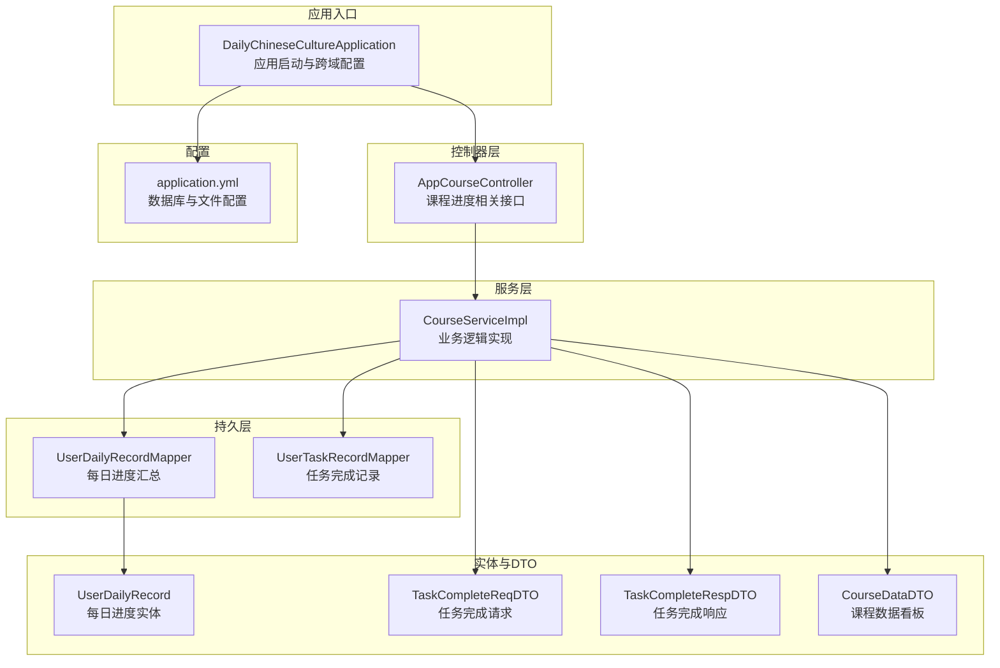
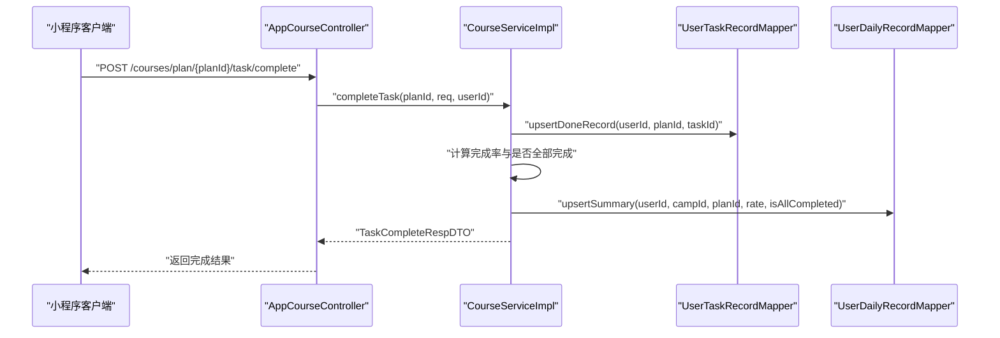
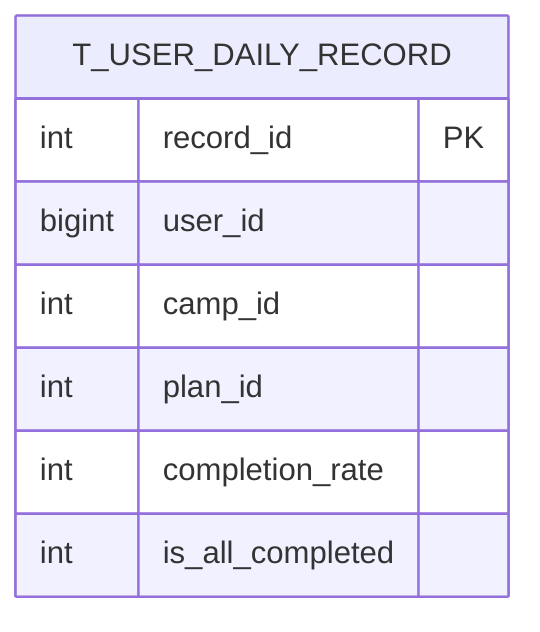
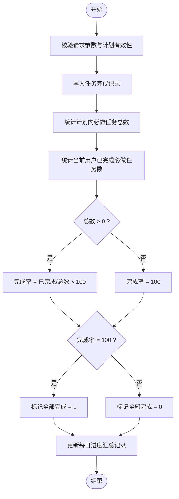
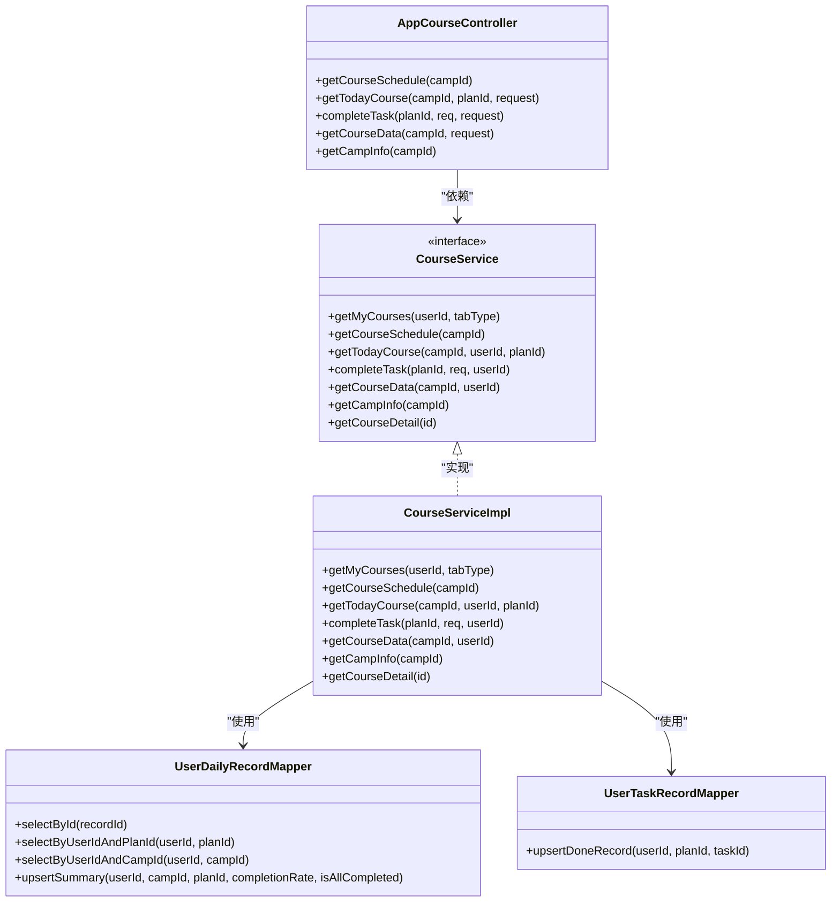

# 课程进度跟踪接口

<cite>
**本文档引用的文件**
- [DailyChineseCultureApplication.java](file://src/main/java/com/daily/dailychineseculture/DailyChineseCultureApplication.java)
- [AppCourseController.java](file://src/main/java/com/daily/dailychineseculture/controller/AppCourseController.java)
- [CourseService.java](file://src/main/java/com/daily/dailychineseculture/service/CourseService.java)
- [CourseServiceImpl.java](file://src/main/java/com/daily/dailychineseculture/service/impl/CourseServiceImpl.java)
- [UserDailyRecord.java](file://src/main/java/com/daily/dailychineseculture/entity/UserDailyRecord.java)
- [UserDailyRecordMapper.java](file://src/main/java/com/daily/dailychineseculture/mapper/UserDailyRecordMapper.java)
- [UserTaskRecordMapper.java](file://src/main/java/com/daily/dailychineseculture/mapper/UserTaskRecordMapper.java)
- [application.yml](file://src/main/resources/application.yml)
- [TaskCompleteReqDTO.java](file://src/main/java/com/daily/dailychineseculture/dto/TaskCompleteReqDTO.java)
- [TaskCompleteRespDTO.java](file://src/main/java/com/daily/dailychineseculture/dto/TaskCompleteRespDTO.java)
- [CourseDataDTO.java](file://src/main/java/com/daily/dailychineseculture/dto/CourseDataDTO.java)
</cite>

## 目录
1. [简介](#简介)
2. [项目结构](#项目结构)
3. [核心组件](#核心组件)
4. [架构总览](#架构总览)
5. [详细组件分析](#详细组件分析)
6. [依赖关系分析](#依赖关系分析)
7. [性能考虑](#性能考虑)
8. [故障排除指南](#故障排除指南)
9. [结论](#结论)
10. [附录](#附录)

## 简介
本文件面向“课程进度跟踪接口”的设计与实现，覆盖学习进度记录、进度同步与完成状态管理等关键能力。文档重点说明以下方面：
- 接口定义：请求参数、响应格式与业务逻辑
- 进度计算：学习时长统计、任务完成标记、进度百分比计算
- 实时同步：断点续学与历史记录能力
- 数据存储：存储策略与一致性保障
- 统计分析：课程数据看板与趋势展示
- 异常处理与数据恢复：错误处理与恢复机制
- 测试与排障：测试用例与常见问题定位

## 项目结构
后端采用 Spring Boot 架构，课程进度相关能力集中在课程模块，通过控制器、服务层与持久层协作完成。

图表来源
- [DailyChineseCultureApplication.java:12-40](file://src/main/java/com/daily/dailychineseculture/DailyChineseCultureApplication.java#L12-L40)
- [AppCourseController.java:26-117](file://src/main/java/com/daily/dailychineseculture/controller/AppCourseController.java#L26-L117)
- [CourseServiceImpl.java:44-400](file://src/main/java/com/daily/dailychineseculture/service/impl/CourseServiceImpl.java#L44-L400)
- [UserDailyRecordMapper.java:11-44](file://src/main/java/com/daily/dailychineseculture/mapper/UserDailyRecordMapper.java#L11-L44)
- [UserTaskRecordMapper.java:7-9](file://src/main/java/com/daily/dailychineseculture/mapper/UserTaskRecordMapper.java#L7-L9)
- [UserDailyRecord.java:9-41](file://src/main/java/com/daily/dailychineseculture/entity/UserDailyRecord.java#L9-L41)
- [TaskCompleteReqDTO.java:11-17](file://src/main/java/com/daily/dailychineseculture/dto/TaskCompleteReqDTO.java#L11-L17)
- [TaskCompleteRespDTO.java:11-30](file://src/main/java/com/daily/dailychineseculture/dto/TaskCompleteRespDTO.java#L11-L30)
- [CourseDataDTO.java:9-36](file://src/main/java/com/daily/dailychineseculture/dto/CourseDataDTO.java#L9-L36)
- [application.yml:3-33](file://src/main/resources/application.yml#L3-L33)

章节来源
- [DailyChineseCultureApplication.java:12-40](file://src/main/java/com/daily/dailychineseculture/DailyChineseCultureApplication.java#L12-L40)
- [AppCourseController.java:26-117](file://src/main/java/com/daily/dailychineseculture/controller/AppCourseController.java#L26-L117)
- [CourseServiceImpl.java:44-400](file://src/main/java/com/daily/dailychineseculture/service/impl/CourseServiceImpl.java#L44-L400)
- [application.yml:3-33](file://src/main/resources/application.yml#L3-L33)

## 核心组件
- 控制器层：AppCourseController 提供课程进度相关接口，包括今日课程、任务完成打卡、课程数据看板等。
- 服务层：CourseServiceImpl 实现业务逻辑，负责进度计算、任务完成处理、数据看板生成与事件发布。
- 持久层：UserDailyRecordMapper 负责每日进度汇总记录的读取与写入；UserTaskRecordMapper 负责任务完成记录的插入或更新。
- 实体与DTO：UserDailyRecord 映射 t_user_daily_record 表；TaskCompleteReqDTO/TaskCompleteRespDTO 定义任务完成的请求与响应；CourseDataDTO 定义课程数据看板的数据结构。

章节来源
- [AppCourseController.java:26-117](file://src/main/java/com/daily/dailychineseculture/controller/AppCourseController.java#L26-L117)
- [CourseService.java:21-80](file://src/main/java/com/daily/dailychineseculture/service/CourseService.java#L21-L80)
- [CourseServiceImpl.java:44-400](file://src/main/java/com/daily/dailychineseculture/service/impl/CourseServiceImpl.java#L44-L400)
- [UserDailyRecord.java:9-41](file://src/main/java/com/daily/dailychineseculture/entity/UserDailyRecord.java#L9-L41)
- [UserDailyRecordMapper.java:11-44](file://src/main/java/com/daily/dailychineseculture/mapper/UserDailyRecordMapper.java#L11-L44)
- [UserTaskRecordMapper.java:7-9](file://src/main/java/com/daily/dailychineseculture/mapper/UserTaskRecordMapper.java#L7-L9)
- [TaskCompleteReqDTO.java:11-17](file://src/main/java/com/daily/dailychineseculture/dto/TaskCompleteReqDTO.java#L11-L17)
- [TaskCompleteRespDTO.java:11-30](file://src/main/java/com/daily/dailychineseculture/dto/TaskCompleteRespDTO.java#L11-L30)
- [CourseDataDTO.java:9-36](file://src/main/java/com/daily/dailychineseculture/dto/CourseDataDTO.java#L9-L36)

## 架构总览
课程进度跟踪接口遵循典型的分层架构，请求从控制器进入，经由服务层进行业务处理，再通过持久层访问数据库。服务层在任务完成后会发布进度更新事件，以触发后续流程。

图表来源
- [AppCourseController.java:77-85](file://src/main/java/com/daily/dailychineseculture/controller/AppCourseController.java#L77-L85)
- [CourseServiceImpl.java:227-268](file://src/main/java/com/daily/dailychineseculture/service/impl/CourseServiceImpl.java#L227-L268)
- [UserTaskRecordMapper.java:7-9](file://src/main/java/com/daily/dailychineseculture/mapper/UserTaskRecordMapper.java#L7-L9)
- [UserDailyRecordMapper.java:32-43](file://src/main/java/com/daily/dailychineseculture/mapper/UserDailyRecordMapper.java#L32-L43)

## 详细组件分析

### 接口定义与业务逻辑

#### 1) 获取今日课程（支持时光机模式）
- 接口路径：GET /courses/{campId}/today
- 请求参数：
  - 路径参数：campId（营期 ID）
  - 查询参数：planId（可选，时光机模式指定历史计划）
  - 请求头：需携带登录态（控制器从请求中提取 userId）
- 响应内容：
  - hasCourse：是否存在课程
  - currentDate：当前日期字符串
  - planId：计划 ID
  - completionRate：当日完成率
  - tasks：任务列表（含任务完成状态）
- 业务逻辑要点：
  - 若未传入 planId，则查询当天计划；若传入则按指定历史计划查询
  - 若计划不存在，返回空课程结构
  - 完成率优先取已有汇总记录，否则基于任务完成情况计算

章节来源
- [AppCourseController.java:55-66](file://src/main/java/com/daily/dailychineseculture/controller/AppCourseController.java#L55-L66)
- [CourseServiceImpl.java:147-213](file://src/main/java/com/daily/dailychineseculture/service/impl/CourseServiceImpl.java#L147-L213)

#### 2) 任务完成打卡并返回最新进度
- 接口路径：POST /courses/plan/{planId}/task/complete
- 请求参数：
  - 路径参数：planId（计划 ID）
  - 请求体：TaskCompleteReqDTO（包含 taskId）
  - 请求头：需携带登录态（控制器从请求中提取 userId）
- 响应内容：TaskCompleteRespDTO
  - planId：计划 ID
  - taskType：任务类型（如 read、video、homework、extra1、extra2）
  - completionRate：当日完成率（百分比）
- 业务逻辑要点：
  - 校验 planId 与 taskId 的有效性
  - 写入任务完成记录（upsert）
  - 统计计划内必做任务的完成数量，计算完成率
  - 更新每日进度汇总记录（upsert），并标记是否全部完成
  - 发布进度更新事件（CampProgressUpdateEvent）

章节来源
- [AppCourseController.java:77-85](file://src/main/java/com/daily/dailychineseculture/controller/AppCourseController.java#L77-L85)
- [CourseServiceImpl.java:227-268](file://src/main/java/com/daily/dailychineseculture/service/impl/CourseServiceImpl.java#L227-L268)
- [TaskCompleteReqDTO.java:11-17](file://src/main/java/com/daily/dailychineseculture/dto/TaskCompleteReqDTO.java#L11-L17)
- [TaskCompleteRespDTO.java:11-30](file://src/main/java/com/daily/dailychineseculture/dto/TaskCompleteRespDTO.java#L11-L30)

#### 3) 获取课程数据看板
- 接口路径：GET /courses/{campId}/data
- 请求参数：
  - 路径参数：campId（营期 ID）
  - 请求头：需携带登录态（控制器从请求中提取 userId）
- 响应内容：CourseDataDTO
  - totalDays：总天数
  - completedDays：已完成天数（完成率为 100% 的天数）
  - overallRate：总体完成率（百分比）
  - trends：学习趋势（包含状态与完成率）
  - achievements：成就徽章列表
- 业务逻辑要点：
  - 基于计划总数与每日汇总记录计算完成天数与总体率
  - 根据计划日期与完成率生成趋势状态（LOCKED/MISSED/COMPLETED）
  - 根据完成天数动态授予成就徽章

章节来源
- [AppCourseController.java:95-103](file://src/main/java/com/daily/dailychineseculture/controller/AppCourseController.java#L95-L103)
- [CourseServiceImpl.java:270-358](file://src/main/java/com/daily/dailychineseculture/service/impl/CourseServiceImpl.java#L270-L358)
- [CourseDataDTO.java:9-36](file://src/main/java/com/daily/dailychineseculture/dto/CourseDataDTO.java#L9-L36)

#### 4) 获取营期详情信息
- 接口路径：GET /courses/{campId}/info
- 请求参数：
  - 路径参数：campId（营期 ID）
- 响应内容：CampInfoDTO（包含批次、描述、参与人数等字段）

章节来源
- [AppCourseController.java:112-116](file://src/main/java/com/daily/dailychineseculture/controller/AppCourseController.java#L112-L116)
- [CourseServiceImpl.java:360-389](file://src/main/java/com/daily/dailychineseculture/service/impl/CourseServiceImpl.java#L360-L389)

### 数据模型与存储策略

#### 用户每日学习记录（t_user_daily_record）
- 关键字段：
  - record_id：主键
  - user_id：用户 ID
  - camp_id：营期 ID
  - plan_id：计划 ID
  - completion_rate：完成率（0-100）
  - is_all_completed：是否全部完成（0/1）
- 存储策略：
  - 通过联合唯一索引（user_id + plan_id）保证每用户每天仅有一条汇总记录
  - 使用插入或更新语句（ON DUPLICATE KEY UPDATE）实现幂等写入

图表来源
- [UserDailyRecord.java:9-41](file://src/main/java/com/daily/dailychineseculture/entity/UserDailyRecord.java#L9-L41)
- [UserDailyRecordMapper.java:17-43](file://src/main/java/com/daily/dailychineseculture/mapper/UserDailyRecordMapper.java#L17-L43)

#### 任务完成记录（t_user_task_record）
- 存储策略：
  - 通过 upsertDoneRecord 方法插入或更新任务完成记录
  - 用于统计计划内必做任务的完成数量，作为完成率计算依据

章节来源
- [UserTaskRecordMapper.java:7-9](file://src/main/java/com/daily/dailychineseculture/mapper/UserTaskRecordMapper.java#L7-L9)

### 进度计算与同步机制

#### 完成率计算流程
- 计算公式：完成率 = 已完成必做任务数 / 计划内必做任务总数 × 100
- 特殊情况：当无必做任务时，完成率设为 100
- 是否全部完成：当完成率达到 100 时标记为 1，否则为 0

图表来源
- [CourseServiceImpl.java:227-268](file://src/main/java/com/daily/dailychineseculture/service/impl/CourseServiceImpl.java#L227-L268)

#### 实时同步与断点续学
- 实时同步：每次任务完成即刻更新当日完成率与汇总记录，并发布进度更新事件
- 断点续学：今日课程接口支持时光机模式（通过 planId 指定历史计划），可查询历史进度
- 历史记录：课程数据看板基于用户在营期内的历史汇总记录生成趋势与成就

章节来源
- [CourseServiceImpl.java:147-213](file://src/main/java/com/daily/dailychineseculture/service/impl/CourseServiceImpl.java#L147-L213)
- [CourseServiceImpl.java:270-358](file://src/main/java/com/daily/dailychineseculture/service/impl/CourseServiceImpl.java#L270-L358)

### 统计分析与报表
- 课程数据看板包含：
  - 总天数、已完成天数、总体完成率
  - 学习趋势（状态：LOCKED/MISSED/COMPLETED）
  - 成就徽章（根据完成天数动态授予）

章节来源
- [CourseServiceImpl.java:270-358](file://src/main/java/com/daily/dailychineseculture/service/impl/CourseServiceImpl.java#L270-L358)
- [CourseDataDTO.java:9-36](file://src/main/java/com/daily/dailychineseculture/dto/CourseDataDTO.java#L9-L36)

## 依赖关系分析

图表来源
- [AppCourseController.java:26-117](file://src/main/java/com/daily/dailychineseculture/controller/AppCourseController.java#L26-L117)
- [CourseService.java:21-80](file://src/main/java/com/daily/dailychineseculture/service/CourseService.java#L21-L80)
- [CourseServiceImpl.java:44-400](file://src/main/java/com/daily/dailychineseculture/service/impl/CourseServiceImpl.java#L44-L400)
- [UserDailyRecordMapper.java:11-44](file://src/main/java/com/daily/dailychineseculture/mapper/UserDailyRecordMapper.java#L11-L44)
- [UserTaskRecordMapper.java:7-9](file://src/main/java/com/daily/dailychineseculture/mapper/UserTaskRecordMapper.java#L7-L9)

## 性能考虑
- 数据库层面：
  - 每日进度汇总表使用联合唯一索引（user_id + plan_id），避免重复写入，提升 upsert 性能
  - 查询接口尽量使用索引列（如 user_id、camp_id、plan_id）进行过滤
- 事务与一致性：
  - 任务完成流程使用事务，确保任务记录与进度汇总的一致性
- 缓存建议：
  - 可引入 Redis 缓存每日进度汇总，减少数据库压力（当前实现未见缓存层）
- 批量操作：
  - 若未来扩展批量任务完成场景，建议批量 upsert 以降低数据库往返次数

## 故障排除指南
- 常见错误与定位：
  - 用户未登录或 Token 失效：控制器在提取 userId 失败时抛出异常，需检查登录态与拦截器配置
  - 排课计划不存在：completeTask 中对 planId 校验失败，需确认计划 ID 与营期匹配
  - 任务不存在或不属于该排课：completeTask 中对 taskId 校验失败，需确认任务与计划关联
  - 数据库连接异常：检查 application.yml 中的数据库连接配置与网络连通性
- 数据不一致排查：
  - 检查每日进度汇总表的 upsert 是否成功执行
  - 核对任务完成记录是否正确写入
- 性能问题排查：
  - 关注计划与任务数量增长带来的查询与计算开销
  - 观察数据库慢查询日志，优化相关 SQL

章节来源
- [AppCourseController.java:60-63](file://src/main/java/com/daily/dailychineseculture/controller/AppCourseController.java#L60-L63)
- [AppCourseController.java:79-82](file://src/main/java/com/daily/dailychineseculture/controller/AppCourseController.java#L79-L82)
- [CourseServiceImpl.java:227-268](file://src/main/java/com/daily/dailychineseculture/service/impl/CourseServiceImpl.java#L227-L268)
- [application.yml:7-11](file://src/main/resources/application.yml#L7-L11)

## 结论
课程进度跟踪接口围绕“任务完成—进度计算—汇总更新—事件发布”形成闭环，具备实时同步与断点续学能力，并通过课程数据看板提供可视化统计与激励机制。当前实现以事务保证一致性，建议在高并发场景下引入缓存与批量处理以进一步提升性能。

## 附录

### 接口一览与字段说明

- 获取今日课程
  - 路径：GET /courses/{campId}/today
  - 请求参数：campId、planId（可选）
  - 返回字段：hasCourse、currentDate、planId、completionRate、tasks
  - 业务说明：支持时光机模式，按计划日期或当天查询

- 任务完成打卡
  - 路径：POST /courses/plan/{planId}/task/complete
  - 请求参数：planId、taskId（请求体）
  - 返回字段：planId、taskType、completionRate
  - 业务说明：校验计划与任务有效性，更新任务完成记录与每日汇总

- 课程数据看板
  - 路径：GET /courses/{campId}/data
  - 返回字段：totalDays、completedDays、overallRate、trends、achievements
  - 业务说明：基于计划与历史汇总生成趋势与成就

- 营期详情信息
  - 路径：GET /courses/{campId}/info
  - 返回字段：batch、description、participantCount 等

章节来源
- [AppCourseController.java:40-116](file://src/main/java/com/daily/dailychineseculture/controller/AppCourseController.java#L40-L116)
- [CourseServiceImpl.java:147-389](file://src/main/java/com/daily/dailychineseculture/service/impl/CourseServiceImpl.java#L147-L389)
- [CourseDataDTO.java:9-36](file://src/main/java/com/daily/dailychineseculture/dto/CourseDataDTO.java#L9-L36)