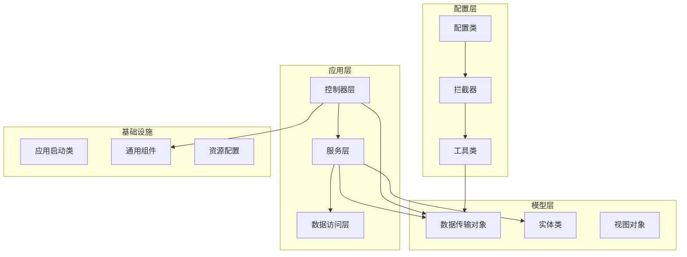
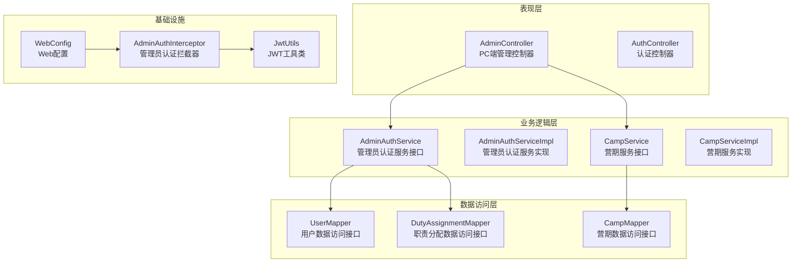
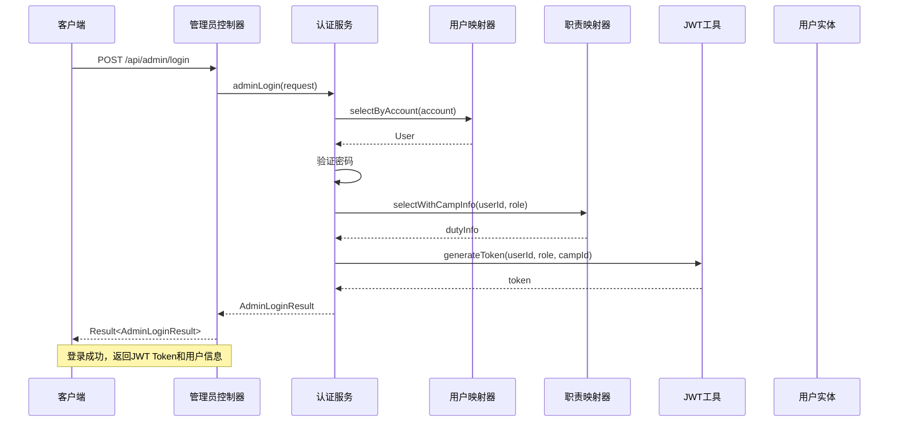
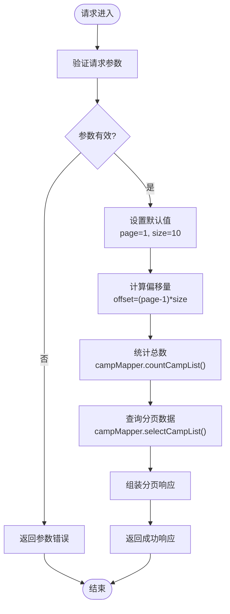
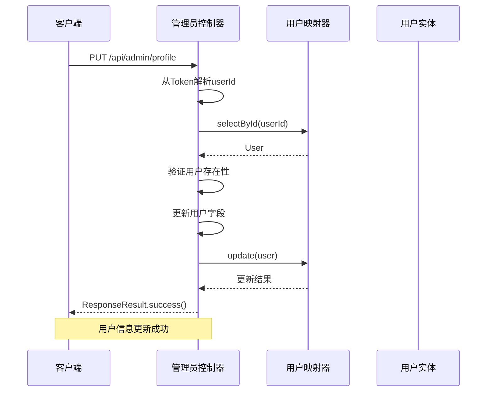
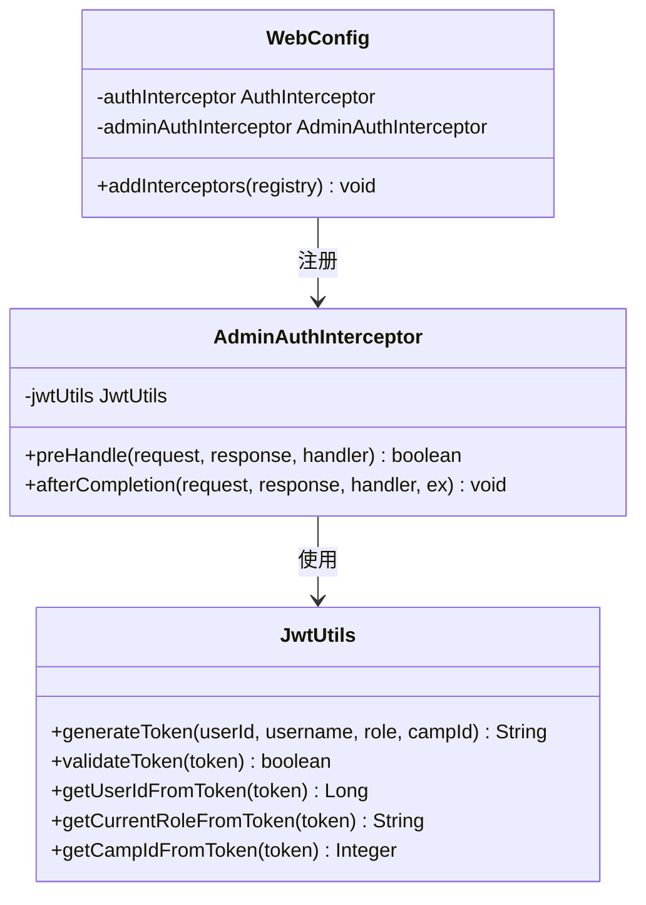
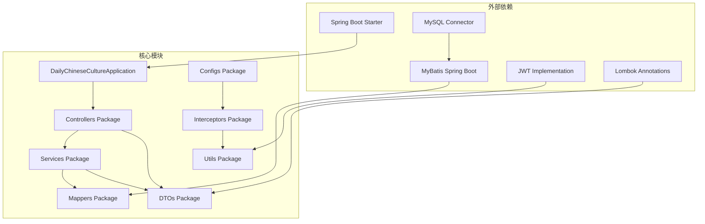

# 系统管理API文档

<cite>
**本文档引用的文件**
- [DailyChineseCultureApplication.java](file://src/main/java/com/daily/dailychineseculture/DailyChineseCultureApplication.java)
- [AdminController.java](file://src/main/java/com/daily/dailychineseculture/controller/AdminController.java)
- [AdminAuthService.java](file://src/main/java/com/daily/dailychineseculture/service/AdminAuthService.java)
- [AdminAuthServiceImpl.java](file://src/main/java/com/daily/dailychineseculture/service/impl/AdminAuthServiceImpl.java)
- [AdminLoginRequest.java](file://src/main/java/com/daily/dailychineseculture/dto/AdminLoginRequest.java)
- [AdminLoginResult.java](file://src/main/java/com/daily/dailychineseculture/dto/AdminLoginResult.java)
- [ResponseResult.java](file://src/main/java/com/daily/dailychineseculture/common/ResponseResult.java)
- [Result.java](file://src/main/java/com/daily/dailychineseculture/common/Result.java)
- [JwtUtils.java](file://src/main/java/com/daily/dailychineseculture/util/JwtUtils.java)
- [UserMapper.java](file://src/main/java/com/daily/dailychineseculture/mapper/UserMapper.java)
- [CampService.java](file://src/main/java/com/daily/dailychineseculture/service/CampService.java)
- [CampServiceImpl.java](file://src/main/java/com/daily/dailychineseculture/service/impl/CampServiceImpl.java)
- [AdminAuthInterceptor.java](file://src/main/java/com/daily/dailychineseculture/interceptor/AdminAuthInterceptor.java)
- [WebConfig.java](file://src/main/java/com/daily/dailychineseculture/config/WebConfig.java)
- [pom.xml](file://pom.xml)
- [API接口文档.md](file://doc/API接口文档.md)
</cite>

## 目录
1. [简介](#简介)
2. [项目结构](#项目结构)
3. [核心组件](#核心组件)
4. [架构概览](#架构概览)
5. [详细组件分析](#详细组件分析)
6. [依赖关系分析](#依赖关系分析)
7. [性能考虑](#性能考虑)
8. [故障排除指南](#故障排除指南)
9. [结论](#结论)

## 简介

本项目是一个基于Spring Boot的日常中华文化传播管理系统，专注于提供完善的系统管理API接口。系统采用前后端分离架构，通过RESTful API为PC端后台管理系统提供完整的管理功能。

系统的核心特性包括：
- 多角色权限管理（课程管理、档案管理、超级管理员）
- JWT令牌认证机制
- 营期管理功能（创建、编辑、查询）
- 用户信息管理
- 仪表盘数据展示
- 完整的拦截器安全控制

## 项目结构

项目采用标准的Maven Spring Boot项目结构，主要分为以下几个层次：

**图表来源**
- [DailyChineseCultureApplication.java:1-40](file://src/main/java/com/daily/dailychineseculture/DailyChineseCultureApplication.java#L1-L40)
- [WebConfig.java:1-105](file://src/main/java/com/daily/dailychineseculture/config/WebConfig.java#L1-L105)

**章节来源**
- [DailyChineseCultureApplication.java:1-40](file://src/main/java/com/daily/dailychineseculture/DailyChineseCultureApplication.java#L1-L40)
- [pom.xml:1-149](file://pom.xml#L1-L149)

## 核心组件

### 管理员认证系统

系统实现了完整的管理员认证机制，支持多种登录角色：

| 登录角色 | 权限描述 | 营期限制 |
|---------|----------|----------|
| COURSE_ADMIN | 课程管理权限 | 可管理指定营期的课程内容 |
| ARCHIVE_ADMIN | 档案管理权限 | 可管理学员档案信息 |
| SUPER_ADMIN | 超级管理员权限 | 可管理所有营期和系统 |

### JWT安全机制

系统采用JWT（JSON Web Token）作为安全认证机制，提供以下功能：
- Token生成和验证
- 用户身份解析
- 角色权限判断
- Token过期处理

### 营期管理系统

提供完整的营期生命周期管理功能：
- 营期创建和编辑
- 营期状态管理
- 营期类型分类
- 报名管理
- 数据统计分析

**章节来源**
- [AdminAuthService.java:1-19](file://src/main/java/com/daily/dailychineseculture/service/AdminAuthService.java#L1-L19)
- [AdminAuthServiceImpl.java:1-99](file://src/main/java/com/daily/dailychineseculture/service/impl/AdminAuthServiceImpl.java#L1-L99)
- [JwtUtils.java:1-243](file://src/main/java/com/daily/dailychineseculture/util/JwtUtils.java#L1-L243)

## 架构概览

系统采用经典的三层架构模式，结合Spring Boot的依赖注入和AOP特性：

**图表来源**
- [AdminController.java:1-203](file://src/main/java/com/daily/dailychineseculture/controller/AdminController.java#L1-L203)
- [AdminAuthServiceImpl.java:1-99](file://src/main/java/com/daily/dailychineseculture/service/impl/AdminAuthServiceImpl.java#L1-L99)
- [CampServiceImpl.java:1-266](file://src/main/java/com/daily/dailychineseculture/service/impl/CampServiceImpl.java#L1-L266)

## 详细组件分析

### 管理员登录流程

管理员登录是整个系统管理API的核心入口，采用完整的认证流程：

**图表来源**
- [AdminController.java:45-68](file://src/main/java/com/daily/dailychineseculture/controller/AdminController.java#L45-L68)
- [AdminAuthServiceImpl.java:37-97](file://src/main/java/com/daily/dailychineseculture/service/impl/AdminAuthServiceImpl.java#L37-L97)

#### 登录请求参数

| 参数名 | 类型 | 必填 | 描述 | 示例值 |
|--------|------|------|------|--------|
| account | String | 是 | 管理员账号 | admin |
| password | String | 是 | 登录密码 | 123456 |
| loginRole | String | 是 | 登录角色 | COURSE_ADMIN |

#### 登录响应数据

| 字段名 | 类型 | 描述 | 示例值 |
|--------|------|------|--------|
| token | String | JWT认证令牌 | eyJhbGciOiJIUzI1... |
| userInfo.userId | String | 用户唯一标识 | 1001 |
| userInfo.account | String | 用户账号 | admin |
| userInfo.nickname | String | 用户昵称 | 管理员 |
| userInfo.currentRole | String | 当前角色 | COURSE_ADMIN |
| userInfo.campId | Integer | 营期ID（可选） | 1 |

**章节来源**
- [AdminLoginRequest.java:1-27](file://src/main/java/com/daily/dailychineseculture/dto/AdminLoginRequest.java#L1-L27)
- [AdminLoginResult.java:1-52](file://src/main/java/com/daily/dailychineseculture/dto/AdminLoginResult.java#L1-L52)
- [AdminController.java:45-68](file://src/main/java/com/daily/dailychineseculture/controller/AdminController.java#L45-L68)

### 营期管理API

系统提供完整的营期管理功能，包括查询、分页、统计等操作：

#### 营期查询接口

**图表来源**
- [CampServiceImpl.java:127-157](file://src/main/java/com/daily/dailychineseculture/service/impl/CampServiceImpl.java#L127-L157)

#### 营期管理接口列表

| 接口名称 | 方法 | 路径 | 功能描述 |
|----------|------|------|----------|
| 获取最近活跃营期 | GET | /api/admin/dashboard/recent-camps | 获取仪表盘使用的最近活跃营期列表 |
| 分页查询营期列表 | GET | /api/admin/camps | 支持关键词、状态、类型筛选的分页查询 |
| 获取营期类型选项 | GET | /api/admin/camp-types/options | 获取所有营期类型的下拉选项 |
| 获取管理员资料 | GET | /api/admin/profile | 获取当前管理员的基本信息 |
| 更新管理员资料 | PUT | /api/admin/profile | 更新管理员的个人信息 |
| 修改管理员密码 | PUT | /api/admin/profile/password | 修改管理员的登录密码 |

**章节来源**
- [AdminController.java:76-130](file://src/main/java/com/daily/dailychineseculture/controller/AdminController.java#L76-L130)
- [CampService.java:1-81](file://src/main/java/com/daily/dailychineseculture/service/CampService.java#L1-L81)
- [CampServiceImpl.java:102-162](file://src/main/java/com/daily/dailychineseculture/service/impl/CampServiceImpl.java#L102-L162)

### 用户信息管理

系统提供管理员用户信息的完整管理功能：

#### 用户信息更新流程

**图表来源**
- [AdminController.java:153-175](file://src/main/java/com/daily/dailychineseculture/controller/AdminController.java#L153-L175)

#### 支持的用户信息字段

| 字段名 | 类型 | 描述 | 更新要求 |
|--------|------|------|----------|
| nickname | String | 昵称 | 可选 |
| avatar | String | 头像URL | 可选 |
| phone | String | 电话号码 | 可选 |
| region | String | 地区 | 可选 |
| profession | String | 职业 | 可选 |
| gender | Integer | 性别 | 可选 |
| birthday | String | 生日 (yyyy-MM-dd) | 可选 |

**章节来源**
- [UserMapper.java:1-252](file://src/main/java/com/daily/dailychineseculture/mapper/UserMapper.java#L1-L252)
- [AdminController.java:153-175](file://src/main/java/com/daily/dailychineseculture/controller/AdminController.java#L153-L175)

### 安全拦截器机制

系统采用拦截器机制实现统一的安全控制：

**图表来源**
- [AdminAuthInterceptor.java:1-93](file://src/main/java/com/daily/dailychineseculture/interceptor/AdminAuthInterceptor.java#L1-L93)
- [JwtUtils.java:1-243](file://src/main/java/com/daily/dailychineseculture/util/JwtUtils.java#L1-L243)
- [WebConfig.java:47-103](file://src/main/java/com/daily/dailychineseculture/config/WebConfig.java#L47-L103)

#### 拦截规则

| 拦截范围 | 放行接口 | 说明 |
|----------|----------|------|
| /api/admin/** | /api/admin/login, /api/admin/captcha | 后台管理API统一拦截 |
| /** | /login, /admin/login, /wxLogin | 认证相关接口放行 |
| /** | /courses/**, /api/admin/camps/** | 公开展示接口放行 |
| /** | /uploads/**, /static/** | 静态资源放行 |

**章节来源**
- [AdminAuthInterceptor.java:24-82](file://src/main/java/com/daily/dailychineseculture/interceptor/AdminAuthInterceptor.java#L24-L82)
- [WebConfig.java:48-103](file://src/main/java/com/daily/dailychineseculture/config/WebConfig.java#L48-L103)

## 依赖关系分析

系统采用模块化设计，各组件之间保持清晰的依赖关系：

**图表来源**
- [pom.xml:32-117](file://pom.xml#L32-L117)
- [DailyChineseCultureApplication.java:12-40](file://src/main/java/com/daily/dailychineseculture/DailyChineseCultureApplication.java#L12-L40)

### 核心依赖说明

| 依赖项 | 版本 | 用途 | 关键特性 |
|--------|------|------|----------|
| spring-boot-starter-webmvc | 4.0.2 | Web应用基础 | RESTful API, MVC框架 |
| mybatis-spring-boot-starter | 4.0.1 | 数据持久化 | MyBatis集成, 自动配置 |
| mysql-connector-j | 8.0.33 | 数据库驱动 | MySQL连接, JDBC支持 |
| jjwt-api/jjwt-impl | 0.11.5 | JWT实现 | Token生成, 验证, 解析 |
| pagehelper-spring-boot-starter | 2.1.0 | 分页插件 | MyBatis分页, 性能优化 |
| springdoc-openapi-starter | 2.3.0 | API文档 | Swagger集成, 在线文档 |

**章节来源**
- [pom.xml:32-117](file://pom.xml#L32-L117)

## 性能考虑

系统在设计时充分考虑了性能优化和扩展性：

### 缓存策略
- JWT Token缓存：避免频繁的Token解析操作
- 数据查询缓存：对常用查询结果进行短期缓存
- 静态资源缓存：浏览器端缓存策略

### 连接池配置
- 数据库连接池：合理配置最大连接数和超时时间
- 线程池配置：异步任务处理和并发控制
- HTTP客户端连接池：外部API调用优化

### 监控指标
- 接口响应时间监控
- 数据库查询性能监控
- 内存使用情况监控
- 异常处理统计

## 故障排除指南

### 常见问题及解决方案

#### 1. 登录失败问题

**问题现象**：管理员无法登录系统

**可能原因**：
- 账号或密码错误
- 角色权限不足
- 数据库连接异常

**解决方案**：
- 检查账号密码是否正确
- 验证用户是否具有相应角色权限
- 确认数据库连接状态

#### 2. Token验证失败

**问题现象**：接口返回401状态码

**可能原因**：
- Token已过期
- Token格式不正确
- 请求头缺失Authorization

**解决方案**：
- 重新登录获取新的Token
- 确认Token格式为Bearer xxx
- 检查请求头是否正确设置

#### 3. 数据查询异常

**问题现象**：营期列表查询失败

**可能原因**：
- SQL语法错误
- 数据库连接问题
- 参数传递错误

**解决方案**：
- 检查SQL语句正确性
- 验证数据库连接配置
- 确认请求参数格式

**章节来源**
- [AdminController.java:50-67](file://src/main/java/com/daily/dailychineseculture/controller/AdminController.java#L50-L67)
- [AdminAuthInterceptor.java:38-60](file://src/main/java/com/daily/dailychineseculture/interceptor/AdminAuthInterceptor.java#L38-L60)

### 日志分析

系统提供了详细的日志记录机制：

#### 关键日志级别
- **ERROR**：系统异常, 数据库错误, 认证失败
- **WARN**：Token过期警告, 参数验证警告
- **INFO**：系统启动, 接口调用, 业务操作
- **DEBUG**：详细调试信息, SQL执行

#### 日志监控要点
- 认证失败日志分析
- 数据库连接异常监控
- 接口性能指标统计
- 用户行为追踪

## 结论

本系统管理API提供了完整的后台管理功能，具有以下特点：

### 技术优势
- **模块化设计**：清晰的分层架构，便于维护和扩展
- **安全可靠**：JWT认证机制，拦截器统一控制
- **性能优化**：合理的缓存策略和数据库优化
- **易于使用**：RESTful API设计，文档完善

### 功能完整性
- 支持多角色权限管理
- 完整的营期生命周期管理
- 用户信息管理功能
- 仪表盘数据展示
- 统一的响应格式

### 扩展性考虑
- 模块化架构便于功能扩展
- 插件化设计支持第三方集成
- 配置化管理降低耦合度
- 监控体系完善运维支持

系统为日常中华文化传播管理提供了坚实的技术基础，能够满足当前的业务需求，并为未来的功能扩展奠定了良好的技术基础。