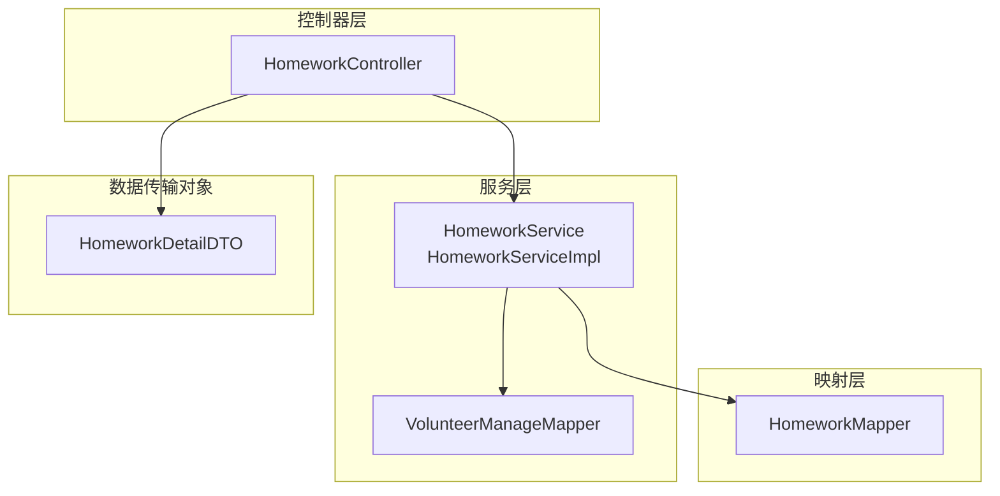
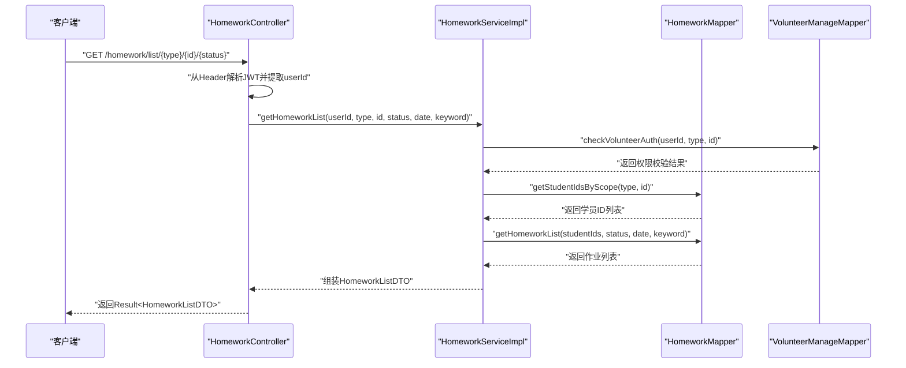
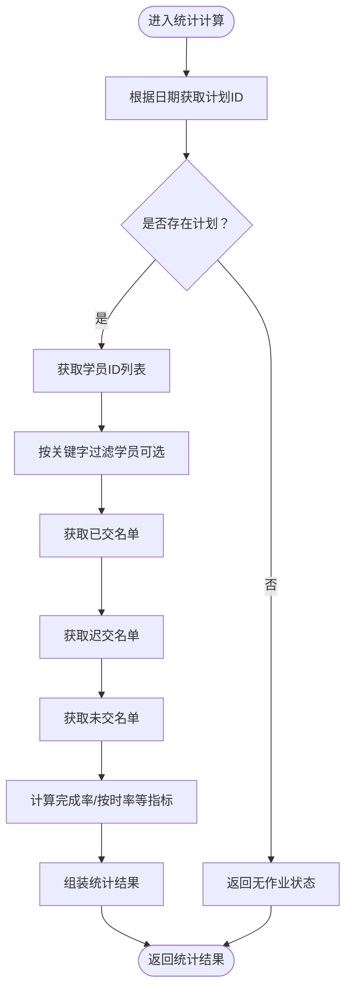
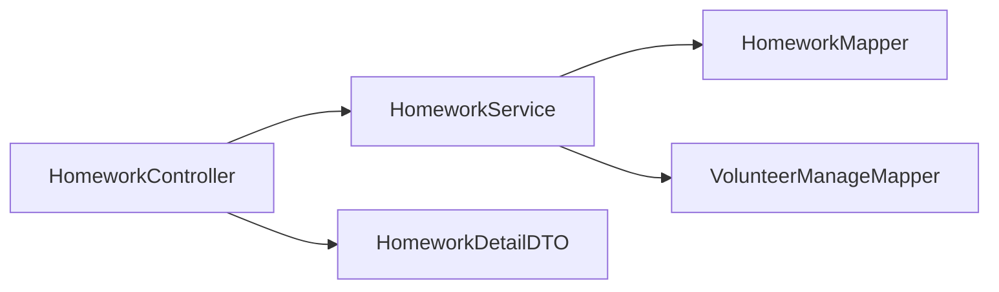

# 作业管理模块

<cite>
**本文档引用的文件**
- [HomeworkController.java](file://src/main/java/com/daily/dailychineseculture/controller/HomeworkController.java)
- [HomeworkService.java](file://src/main/java/com/daily/dailychineseculture/service/HomeworkService.java)
- [HomeworkServiceImpl.java](file://src/main/java/com/daily/dailychineseculture/service/impl/HomeworkServiceImpl.java)
- [HomeworkMapper.java](file://src/main/java/com/daily/dailychineseculture/mapper/HomeworkMapper.java)
- [VolunteerManageMapper.java](file://src/main/java/com/daily/dailychineseculture/mapper/VolunteerManageMapper.java)
- [HomeworkDetailDTO.java](file://src/main/java/com/daily/dailychineseculture/dto/HomeworkDetailDTO.java)
- [作业评选与管理.md](file://readme/作业与任务模块/作业评选与管理.md)
- [统计分析.md](file://readme/作业与任务模块/统计分析.md)
</cite>

## 目录
1. [简介](#简介)
2. [项目结构](#项目结构)
3. [核心组件](#核心组件)
4. [架构总览](#架构总览)
5. [详细组件分析](#详细组件分析)
6. [依赖关系分析](#依赖关系分析)
7. [性能考虑](#性能考虑)
8. [故障排除指南](#故障排除指南)
9. [结论](#结论)
10. [附录](#附录)

## 简介
本模块围绕作业管理与评选展开，面向具备管理权限的志愿者用户，提供作业名单查看、优秀作业标记、作业详情查询、作业统计分析以及作业状态名单等功能。系统通过严格的权限控制确保不同层级（班级、大组、小组）的管理者只能访问其职责范围内的学员作业数据；同时提供完成率、按时提交率等关键指标，帮助管理者监控学习效果。

## 项目结构
作业管理模块采用经典的三层架构设计：
- 控制器层：对外暴露REST接口，负责接收请求、解析参数、调用服务层并封装响应。
- 服务层：实现业务逻辑，包括权限校验、数据聚合、统计计算与过滤。
- 映射层：基于MyBatis注解实现复杂SQL查询，完成多表关联与动态条件筛选。

图表来源
- [HomeworkController.java:1-225](file://src/main/java/com/daily/dailychineseculture/controller/HomeworkController.java#L1-L225)
- [HomeworkServiceImpl.java:1-354](file://src/main/java/com/daily/dailychineseculture/service/impl/HomeworkServiceImpl.java#L1-L354)
- [HomeworkMapper.java:1-253](file://src/main/java/com/daily/dailychineseculture/mapper/HomeworkMapper.java#L1-L253)
- [VolunteerManageMapper.java:1-222](file://src/main/java/com/daily/dailychineseculture/mapper/VolunteerManageMapper.java#L1-L222)
- [HomeworkDetailDTO.java:1-57](file://src/main/java/com/daily/dailychineseculture/dto/HomeworkDetailDTO.java#L1-L57)

章节来源
- [HomeworkController.java:1-225](file://src/main/java/com/daily/dailychineseculture/controller/HomeworkController.java#L1-L225)
- [HomeworkServiceImpl.java:1-354](file://src/main/java/com/daily/dailychineseculture/service/impl/HomeworkServiceImpl.java#L1-L354)
- [HomeworkMapper.java:1-253](file://src/main/java/com/daily/dailychineseculture/mapper/HomeworkMapper.java#L1-L253)
- [VolunteerManageMapper.java:1-222](file://src/main/java/com/daily/dailychineseculture/mapper/VolunteerManageMapper.java#L1-L222)
- [HomeworkDetailDTO.java:1-57](file://src/main/java/com/daily/dailychineseculture/dto/HomeworkDetailDTO.java#L1-L57)

## 核心组件
- 作业控制器：提供作业列表、优秀作业标记、作业详情、作业统计、作业状态名单等接口。
- 作业服务接口与实现：封装权限校验、数据过滤、组织信息拼接、统计计算与名单聚合。
- 作业映射器：通过注解SQL实现多表关联查询、动态条件筛选与名单分类统计。
- 志愿者管理映射器：提供志愿者管理范围查询与职责范围校验能力。
- 作业详情DTO：封装作业详情的数据结构。

章节来源
- [HomeworkController.java:1-225](file://src/main/java/com/daily/dailychineseculture/controller/HomeworkController.java#L1-L225)
- [HomeworkService.java:1-38](file://src/main/java/com/daily/dailychineseculture/service/HomeworkService.java#L1-L38)
- [HomeworkServiceImpl.java:1-354](file://src/main/java/com/daily/dailychineseculture/service/impl/HomeworkServiceImpl.java#L1-L354)
- [HomeworkMapper.java:1-253](file://src/main/java/com/daily/dailychineseculture/mapper/HomeworkMapper.java#L1-L253)
- [VolunteerManageMapper.java:1-222](file://src/main/java/com/daily/dailychineseculture/mapper/VolunteerManageMapper.java#L1-L222)
- [HomeworkDetailDTO.java:1-57](file://src/main/java/com/daily/dailychineseculture/dto/HomeworkDetailDTO.java#L1-L57)

## 架构总览
作业管理模块遵循清晰的分层架构，控制器负责接口契约与参数解析，服务层承担业务规则与权限校验，映射层专注数据访问与复杂查询。整体流程以“JWT鉴权 + 职责范围校验 + 多表关联查询 + 统计聚合”为核心。

图表来源
- [HomeworkController.java:64-84](file://src/main/java/com/daily/dailychineseculture/controller/HomeworkController.java#L64-L84)
- [HomeworkServiceImpl.java:27-99](file://src/main/java/com/daily/dailychineseculture/service/impl/HomeworkServiceImpl.java#L27-L99)
- [HomeworkMapper.java:72-130](file://src/main/java/com/daily/dailychineseculture/mapper/HomeworkMapper.java#L72-L130)
- [VolunteerManageMapper.java:15-47](file://src/main/java/com/daily/dailychineseculture/mapper/VolunteerManageMapper.java#L15-L47)

## 详细组件分析

### 作业控制器（HomeworkController）
- 职责：提供作业相关的REST接口，包括作业列表、优秀作业标记、作业详情、作业统计、作业状态名单。
- 关键点：
  - 使用JWT解析用户身份，确保接口调用的安全性。
  - 对部分接口进行权限拦截与错误处理，返回统一的响应结构。
  - 兼容“优秀作业列表”接口，复用作业列表查询逻辑。

章节来源
- [HomeworkController.java:1-225](file://src/main/java/com/daily/dailychineseculture/controller/HomeworkController.java#L1-L225)

### 作业服务接口与实现（HomeworkService/HomeworkServiceImpl）
- 作业列表查询：
  - 权限校验：根据type与id调用志愿者权限校验方法，确保用户具备相应职责范围。
  - 学员筛选：按班级/大组/小组获取学员ID列表，支持关键字过滤。
  - 列表构建：查询最新提交的作业记录，拼接组织信息，处理时间格式与空值。
- 优秀作业标记：
  - 存在性检查：先确认作业存在，再进行标记或取消标记。
- 作业详情查询：
  - 多表关联获取作业详情，处理组织信息拼接与时间格式化。
- 作业统计：
  - 完成率与按时率计算：基于已交、迟交、未交名单进行统计。
  - 计划关联：通过日期获取营期计划ID，判断当日是否有作业发布。
- 作业状态名单：
  - 返回已交、未交、迟交三类名单，并提供统计摘要。
  - 支持按关键字过滤学员，便于精准查找。

图表来源
- [HomeworkServiceImpl.java:223-279](file://src/main/java/com/daily/dailychineseculture/service/impl/HomeworkServiceImpl.java#L223-L279)
- [HomeworkServiceImpl.java:284-341](file://src/main/java/com/daily/dailychineseculture/service/impl/HomeworkServiceImpl.java#L284-L341)

章节来源
- [HomeworkService.java:1-38](file://src/main/java/com/daily/dailychineseculture/service/HomeworkService.java#L1-L38)
- [HomeworkServiceImpl.java:1-354](file://src/main/java/com/daily/dailychineseculture/service/impl/HomeworkServiceImpl.java#L1-L354)

### 作业映射器（HomeworkMapper）
- 职责：通过注解SQL实现复杂查询，包括：
  - 志愿者管理范围查询与权限校验。
  - 按职责范围获取学员ID列表。
  - 作业列表查询（支持状态筛选、日期筛选、关键字搜索）。
  - 作业详情查询（多表关联）。
  - 各类名单查询（已交、未交、迟交）。
  - 统计辅助查询（按日期获取计划ID、完成人数统计等）。

章节来源
- [HomeworkMapper.java:1-253](file://src/main/java/com/daily/dailychineseculture/mapper/HomeworkMapper.java#L1-L253)

### 志愿者管理映射器（VolunteerManageMapper）
- 职责：提供志愿者管理范围查询、职责范围校验、成员查询等能力，支撑作业模块的权限控制与数据筛选。

章节来源
- [VolunteerManageMapper.java:1-222](file://src/main/java/com/daily/dailychineseculture/mapper/VolunteerManageMapper.java#L1-L222)

### 作业详情DTO（HomeworkDetailDTO）
- 职责：封装作业详情的数据结构，包括作业ID、学生名称、用户ID、组织信息、提交时间、是否优秀、作业内容等字段。

章节来源
- [HomeworkDetailDTO.java:1-57](file://src/main/java/com/daily/dailychineseculture/dto/HomeworkDetailDTO.java#L1-L57)

### 作业评选与管理（业务文档）
- 功能概述：志愿者可在其职责范围内查看作业名单、查看作业详情、标记优秀作业。
- 技术要点：严格鉴权、多级组织感知、动态筛选与实时检索。

章节来源
- [作业评选与管理.md:1-103](file://readme/作业与任务模块/作业评选与管理.md#L1-L103)

### 统计分析（业务文档）
- 功能概述：提供按日统计的完成率、按时率等指标，以及已交/未交/迟交名单。
- 技术要点：计划关联性、多态数据聚合、模糊检索支持。

章节来源
- [统计分析.md:1-98](file://readme/作业与任务模块/统计分析.md#L1-L98)

## 依赖关系分析
- 控制器依赖服务层接口，服务层依赖映射层与志愿者管理映射层。
- 服务层内部通过权限校验与数据聚合减少重复查询，提升整体效率。
- 映射层通过注解SQL实现复杂关联与动态条件，降低服务层负担。

图表来源
- [HomeworkController.java:1-225](file://src/main/java/com/daily/dailychineseculture/controller/HomeworkController.java#L1-L225)
- [HomeworkServiceImpl.java:1-354](file://src/main/java/com/daily/dailychineseculture/service/impl/HomeworkServiceImpl.java#L1-L354)
- [HomeworkMapper.java:1-253](file://src/main/java/com/daily/dailychineseculture/mapper/HomeworkMapper.java#L1-L253)
- [VolunteerManageMapper.java:1-222](file://src/main/java/com/daily/dailychineseculture/mapper/VolunteerManageMapper.java#L1-L222)
- [HomeworkDetailDTO.java:1-57](file://src/main/java/com/daily/dailychineseculture/dto/HomeworkDetailDTO.java#L1-L57)

章节来源
- [HomeworkController.java:1-225](file://src/main/java/com/daily/dailychineseculture/controller/HomeworkController.java#L1-L225)
- [HomeworkServiceImpl.java:1-354](file://src/main/java/com/daily/dailychineseculture/service/impl/HomeworkServiceImpl.java#L1-L354)
- [HomeworkMapper.java:1-253](file://src/main/java/com/daily/dailychineseculture/mapper/HomeworkMapper.java#L1-L253)
- [VolunteerManageMapper.java:1-222](file://src/main/java/com/daily/dailychineseculture/mapper/VolunteerManageMapper.java#L1-L222)
- [HomeworkDetailDTO.java:1-57](file://src/main/java/com/daily/dailychineseculture/dto/HomeworkDetailDTO.java#L1-L57)

## 性能考虑
- 查询优化：通过注解SQL实现一次性多表关联与动态条件筛选，减少多次往返数据库的开销。
- 缓存策略：建议在高频查询场景引入Redis缓存（如作业列表、统计结果），设置合理过期时间，降低数据库压力。
- 分页与过滤：对于大规模数据集，建议在接口层增加分页参数与索引优化，避免全量扫描。
- 时间格式化：服务层对时间进行格式化处理，建议在数据库层面保持统一的时间精度，减少转换成本。
- 权限校验：权限校验在服务层集中处理，避免重复校验，提高接口吞吐量。

## 故障排除指南
- 权限不足：当用户尝试访问非职责范围内的数据时，服务层会抛出权限异常，控制器返回403状态。请检查JWT有效性与志愿者职责范围配置。
- 无效筛选类型：当type参数不在支持范围内时，服务层抛出异常，控制器返回错误提示。请确认type参数为class、bigGroup或smallGroup。
- 作业不存在：标记优秀作业前会检查作业存在性，若不存在则返回失败。请确认homeworkId正确。
- 统计无数据：若当日无作业计划，统计接口将返回无作业状态。请确认营期计划日期与作业发布计划一致。

章节来源
- [HomeworkController.java:75-83](file://src/main/java/com/daily/dailychineseculture/controller/HomeworkController.java#L75-L83)
- [HomeworkServiceImpl.java:180-218](file://src/main/java/com/daily/dailychineseculture/service/impl/HomeworkServiceImpl.java#L180-L218)
- [HomeworkServiceImpl.java:104-114](file://src/main/java/com/daily/dailychineseculture/service/impl/HomeworkServiceImpl.java#L104-L114)

## 结论
作业管理模块通过清晰的分层设计与严格的权限控制，实现了作业评选、统计分析与状态监控的完整闭环。服务层在权限校验、数据聚合与统计计算方面承担核心职责，映射层通过注解SQL实现复杂查询，整体架构具备良好的扩展性与维护性。建议后续结合业务发展引入缓存与分页优化，进一步提升系统性能与用户体验。

## 附录

### 接口定义与使用示例
- 获取作业名单
  - 方法：GET
  - 路径：/homework/list/{type}/{id}/{status}
  - 参数：Authorization（JWT）、type（class/bigGroup/smallGroup）、id（范围ID）、status（all/excellent）、date（可选）、keyword（可选）
  - 示例：GET /homework/list/class/1/all?date=2025-01-01&keyword=张三
- 标记优秀作业
  - 方法：POST
  - 路径：/camp/homework/mark/{homeworkId}/{isExcellent}
  - 参数：Authorization（JWT）、homeworkId（作业ID）、isExcellent（true/false）
  - 示例：POST /camp/homework/mark/1001/true
- 获取作业详情
  - 方法：GET
  - 路径：/homework/detail/{homeworkId}
  - 参数：Authorization（JWT）、homeworkId（作业ID）
  - 示例：GET /homework/detail/1001
- 获取作业统计数据
  - 方法：GET
  - 路径：/homework/stats
  - 参数：Authorization（JWT）、type（class/bigGroup/smallGroup）、id（范围ID）、date（可选）、keyword（可选）
  - 示例：GET /homework/stats?type=class&id=1&date=2025-01-01
- 获取作业状态名单
  - 方法：GET
  - 路径：/homework/status/list/{type}/{id}
  - 参数：Authorization（JWT）、type（class/bigGroup/smallGroup）、id（范围ID）、date（必填）、keyword（可选）
  - 示例：GET /homework/status/list/bigGroup/2?date=2025-01-01&keyword=李四

章节来源
- [HomeworkController.java:64-223](file://src/main/java/com/daily/dailychineseculture/controller/HomeworkController.java#L64-L223)
- [作业评选与管理.md:94-98](file://readme/作业与任务模块/作业评选与管理.md#L94-L98)
- [统计分析.md:90-92](file://readme/作业与任务模块/统计分析.md#L90-L92)