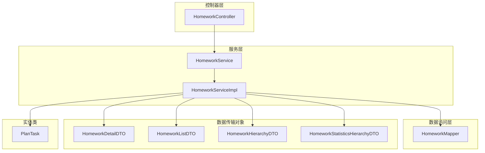
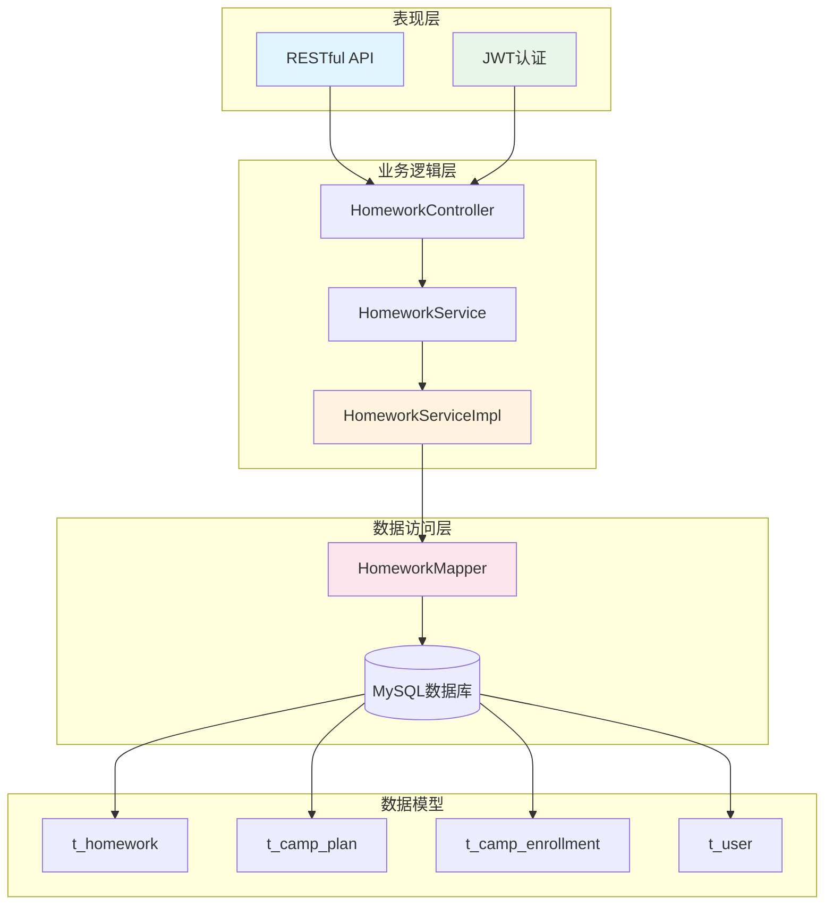
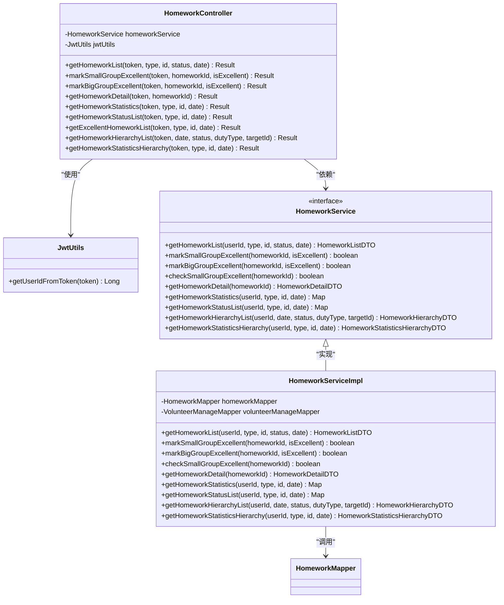
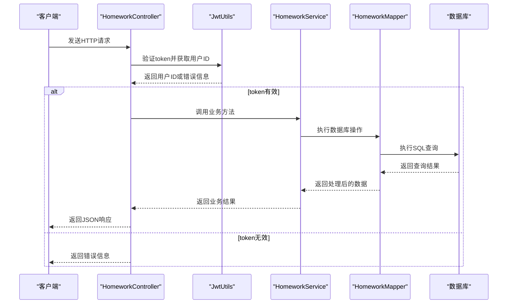
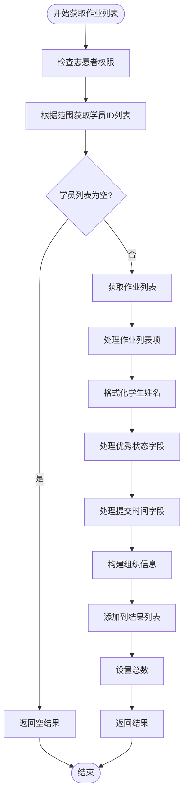
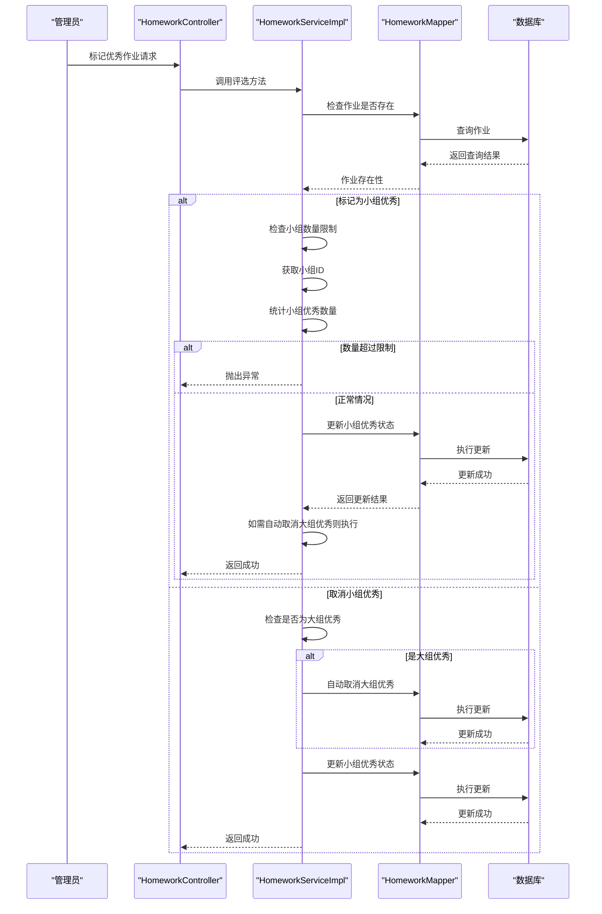
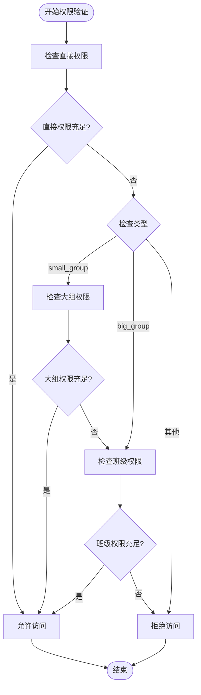
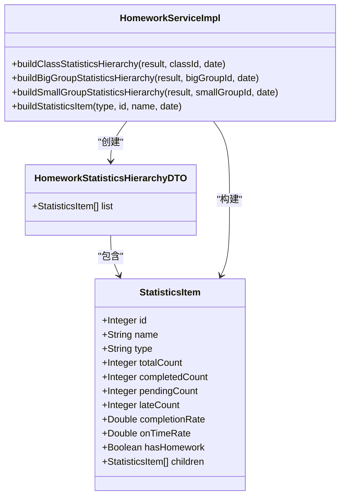
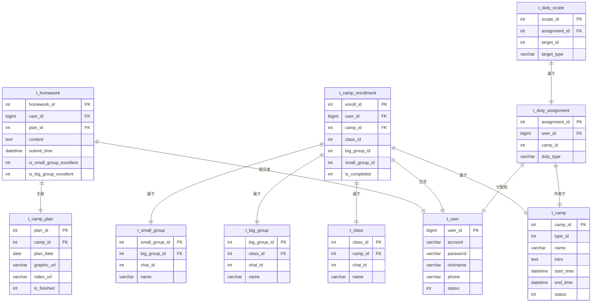
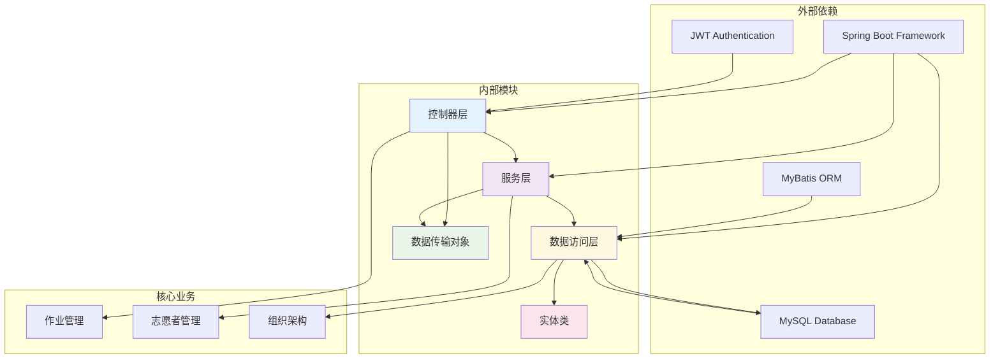

# 作业管理模块

<cite>
**本文档引用的文件**
- [HomeworkController.java](file://src/main/java/com/daily/dailychineseculture/controller/HomeworkController.java)
- [HomeworkService.java](file://src/main/java/com/daily/dailychineseculture/service/HomeworkService.java)
- [HomeworkServiceImpl.java](file://src/main/java/com/daily/dailychineseculture/service/impl/HomeworkServiceImpl.java)
- [HomeworkMapper.java](file://src/main/java/com/daily/dailychineseculture/mapper/HomeworkMapper.java)
- [HomeworkDetailDTO.java](file://src/main/java/com/daily/dailychineseculture/dto/HomeworkDetailDTO.java)
- [HomeworkListDTO.java](file://src/main/java/com/daily/dailychineseculture/dto/HomeworkListDTO.java)
- [HomeworkHierarchyDTO.java](file://src/main/java/com/daily/dailychineseculture/dto/HomeworkHierarchyDTO.java)
- [HomeworkStatisticsHierarchyDTO.java](file://src/main/java/com/daily/dailychineseculture/dto/HomeworkStatisticsHierarchyDTO.java)
- [PlanTask.java](file://src/main/java/com/daily/dailychineseculture/entity/PlanTask.java)
- [application.yml](file://src/main/resources/application.yml)
- [数据库代码.txt](file://数据库代码.txt)
</cite>

## 目录
1. [简介](#简介)
2. [项目结构](#项目结构)
3. [核心组件](#核心组件)
4. [架构概览](#架构概览)
5. [详细组件分析](#详细组件分析)
6. [依赖关系分析](#依赖关系分析)
7. [性能考虑](#性能考虑)
8. [故障排除指南](#故障排除指南)
9. [结论](#结论)

## 简介

作业管理模块是每日中文文化营地管理系统的核心功能模块之一，主要负责营员作业的提交、评选、统计和层级管理。该模块基于Spring Boot框架开发，采用MVC架构模式，结合MyBatis进行数据持久化操作。

该模块支持多层级的组织架构管理，包括营期(Camp)、班级(Class)、大组(Big Group)、小组(Small Group)四个层级，为不同职责的志愿者提供相应的作业管理权限。系统实现了完整的作业评选机制，支持小组优秀作业和大组优秀作业的两级评选制度。

## 项目结构

作业管理模块在项目中的组织结构如下：

**图表来源**
- [HomeworkController.java:1-276](file://src/main/java/com/daily/dailychineseculture/controller/HomeworkController.java#L1-L276)
- [HomeworkService.java:1-58](file://src/main/java/com/daily/dailychineseculture/service/HomeworkService.java#L1-L58)
- [HomeworkServiceImpl.java:1-833](file://src/main/java/com/daily/dailychineseculture/service/impl/HomeworkServiceImpl.java#L1-L833)

**章节来源**
- [HomeworkController.java:1-276](file://src/main/java/com/daily/dailychineseculture/controller/HomeworkController.java#L1-L276)
- [HomeworkService.java:1-58](file://src/main/java/com/daily/dailychineseculture/service/HomeworkService.java#L1-L58)
- [HomeworkServiceImpl.java:1-833](file://src/main/java/com/daily/dailychineseculture/service/impl/HomeworkServiceImpl.java#L1-L833)

## 核心组件

### 控制器层

作业管理模块的控制器层主要包含以下核心组件：

- **HomeworkController**: 主要的RESTful API控制器，提供作业相关的HTTP接口
- **JWT工具类**: 负责用户身份验证和权限校验

### 服务层

服务层包含接口和实现类：

- **HomeworkService**: 作业服务接口，定义了所有作业管理功能的方法
- **HomeworkServiceImpl**: 作业服务的具体实现，包含业务逻辑处理

### 数据访问层

数据访问层主要通过MyBatis接口实现：

- **HomeworkMapper**: 定义了所有数据库操作方法

### 数据传输对象

为了保证数据传输的规范性和安全性，模块定义了多个DTO类：

- **HomeworkDetailDTO**: 作业详情数据传输对象
- **HomeworkListDTO**: 作业列表数据传输对象
- **HomeworkHierarchyDTO**: 作业层级列表数据传输对象
- **HomeworkStatisticsHierarchyDTO**: 作业统计层级数据传输对象

**章节来源**
- [HomeworkController.java:15-276](file://src/main/java/com/daily/dailychineseculture/controller/HomeworkController.java#L15-L276)
- [HomeworkService.java:9-58](file://src/main/java/com/daily/dailychineseculture/service/HomeworkService.java#L9-L58)
- [HomeworkServiceImpl.java:12-833](file://src/main/java/com/daily/dailychineseculture/service/impl/HomeworkServiceImpl.java#L12-L833)

## 架构概览

作业管理模块采用了经典的三层架构设计：

**图表来源**
- [HomeworkController.java:18-276](file://src/main/java/com/daily/dailychineseculture/controller/HomeworkController.java#L18-L276)
- [HomeworkServiceImpl.java:15-833](file://src/main/java/com/daily/dailychineseculture/service/impl/HomeworkServiceImpl.java#L15-L833)
- [HomeworkMapper.java:10-450](file://src/main/java/com/daily/dailychineseculture/mapper/HomeworkMapper.java#L10-L450)

该架构具有以下特点：

1. **清晰的职责分离**: 每一层都有明确的职责和边界
2. **良好的扩展性**: 新增功能只需在相应层次添加代码
3. **强健的权限控制**: 基于JWT的认证机制确保系统安全
4. **灵活的数据访问**: MyBatis提供了强大的SQL映射能力

## 详细组件分析

### 作业控制器分析

作业控制器是整个模块的入口点，负责处理来自客户端的所有请求：

**图表来源**
- [HomeworkController.java:18-276](file://src/main/java/com/daily/dailychineseculture/controller/HomeworkController.java#L18-L276)
- [HomeworkService.java:12-58](file://src/main/java/com/daily/dailychineseculture/service/HomeworkService.java#L12-L58)
- [HomeworkServiceImpl.java:15-833](file://src/main/java/com/daily/dailychineseculture/service/impl/HomeworkServiceImpl.java#L15-L833)

#### 核心功能流程

作业控制器提供了九个主要的API接口，每个接口都遵循统一的处理流程：

**图表来源**
- [HomeworkController.java:30-50](file://src/main/java/com/daily/dailychineseculture/controller/HomeworkController.java#L30-L50)
- [HomeworkServiceImpl.java:27-117](file://src/main/java/com/daily/dailychineseculture/service/impl/HomeworkServiceImpl.java#L27-L117)

**章节来源**
- [HomeworkController.java:27-276](file://src/main/java/com/daily/dailychineseculture/controller/HomeworkController.java#L27-L276)

### 作业服务实现分析

作业服务实现类包含了所有核心业务逻辑，是整个模块的核心：

#### 作业列表获取功能

作业列表获取功能是最复杂的业务逻辑之一，需要处理多种筛选条件和权限验证：

**图表来源**
- [HomeworkServiceImpl.java:27-117](file://src/main/java/com/daily/dailychineseculture/service/impl/HomeworkServiceImpl.java#L27-L117)

#### 优秀作业评选功能

模块实现了两级优秀的评选机制，支持小组优秀和大组优秀两个层级：

**图表来源**
- [HomeworkServiceImpl.java:122-199](file://src/main/java/com/daily/dailychineseculture/service/impl/HomeworkServiceImpl.java#L122-L199)

**章节来源**
- [HomeworkServiceImpl.java:122-199](file://src/main/java/com/daily/dailychineseculture/service/impl/HomeworkServiceImpl.java#L122-L199)

### 数据访问层分析

数据访问层通过MyBatis接口实现，提供了丰富的数据库操作方法：

#### 权限验证机制

作业管理模块实现了基于职责范围的权限验证机制：

**图表来源**
- [HomeworkServiceImpl.java:607-651](file://src/main/java/com/daily/dailychineseculture/service/impl/HomeworkServiceImpl.java#L607-L651)

#### 层级统计功能

模块支持多层级的统计分析功能：

**图表来源**
- [HomeworkServiceImpl.java:687-800](file://src/main/java/com/daily/dailychineseculture/service/impl/HomeworkServiceImpl.java#L687-L800)

**章节来源**
- [HomeworkMapper.java:13-450](file://src/main/java/com/daily/dailychineseculture/mapper/HomeworkMapper.java#L13-L450)

### 数据模型分析

作业管理模块涉及的主要数据模型包括：

**图表来源**
- [数据库代码.txt:148-165](file://数据库代码.txt#L148-L165)

**章节来源**
- [数据库代码.txt:148-165](file://数据库代码.txt#L148-L165)

## 依赖关系分析

作业管理模块的依赖关系呈现清晰的层次化结构：

**图表来源**
- [HomeworkController.java:18-276](file://src/main/java/com/daily/dailychineseculture/controller/HomeworkController.java#L18-L276)
- [HomeworkServiceImpl.java:15-833](file://src/main/java/com/daily/dailychineseculture/service/impl/HomeworkServiceImpl.java#L15-L833)
- [HomeworkMapper.java:10-450](file://src/main/java/com/daily/dailychineseculture/mapper/HomeworkMapper.java#L10-L450)

### 关键依赖特性

1. **Spring Boot集成**: 自动配置和依赖注入简化了开发过程
2. **MyBatis映射**: 提供了灵活的SQL映射和数据库操作能力
3. **JWT认证**: 实现了无状态的身份验证机制
4. **MySQL数据库**: 支持复杂的关系型数据存储需求

**章节来源**
- [application.yml:6-22](file://src/main/resources/application.yml#L6-L22)

## 性能考虑

作业管理模块在设计时充分考虑了性能优化：

### 数据库查询优化

1. **索引策略**: 在关键字段上建立适当的索引以提高查询性能
2. **批量操作**: 使用批量查询减少数据库往返次数
3. **缓存机制**: 对频繁访问的数据实施缓存策略

### 业务逻辑优化

1. **权限验证**: 在服务层进行权限验证，避免不必要的数据库查询
2. **数据处理**: 在内存中进行数据处理，减少数据库压力
3. **异常处理**: 实现优雅的异常处理机制，避免性能损失

### 系统配置优化

根据应用配置文件，系统具备以下性能特征：

- **数据库连接**: 支持多查询连接，提高并发处理能力
- **文件上传**: 支持最大500MB的文件上传，满足大文件处理需求
- **MyBatis配置**: 启用驼峰命名转换，提高数据映射效率

**章节来源**
- [application.yml:8-32](file://src/main/resources/application.yml#L8-L32)

## 故障排除指南

### 常见问题及解决方案

#### 1. JWT Token验证失败

**问题症状**: 返回"无效的token"错误信息

**可能原因**:
- Token过期或格式不正确
- 用户不存在或已被禁用
- Token签名验证失败

**解决步骤**:
1. 检查客户端是否正确传递Authorization头部
2. 验证Token的有效期和格式
3. 确认用户账户状态正常

#### 2. 权限不足错误

**问题症状**: 返回"无权限访问该范围数据"错误

**可能原因**:
- 用户没有相应的志愿者职责
- 职责范围与请求范围不匹配
- 职责权限已过期

**解决步骤**:
1. 确认用户的志愿者职责类型
2. 检查职责范围的有效性
3. 验证请求的范围参数是否正确

#### 3. 作业评选异常

**问题症状**: 优秀作业评选失败或抛出异常

**可能原因**:
- 超过数量限制（每组最多2个优秀作业）
- 作业不存在或已被删除
- 状态转换不符合规定（必须先成为小组优秀才能成为大组优秀）

**解决步骤**:
1. 检查当前优秀作业数量
2. 验证作业的存在性
3. 确认状态转换的逻辑正确性

#### 4. 数据库连接问题

**问题症状**: 数据库操作失败或超时

**可能原因**:
- 数据库服务器不可达
- 连接池耗尽
- SQL语句执行超时

**解决步骤**:
1. 检查数据库连接配置
2. 监控连接池使用情况
3. 优化慢查询语句

**章节来源**
- [HomeworkController.java:36-49](file://src/main/java/com/daily/dailychineseculture/controller/HomeworkController.java#L36-L49)
- [HomeworkServiceImpl.java:132-142](file://src/main/java/com/daily/dailychineseculture/service/impl/HomeworkServiceImpl.java#L132-L142)

## 结论

作业管理模块是一个设计合理、功能完善的管理系统。通过采用分层架构设计，模块实现了清晰的职责分离和良好的扩展性。以下是该模块的主要优势：

### 技术优势

1. **架构清晰**: 采用标准的三层架构，便于维护和扩展
2. **权限完善**: 基于职责范围的权限控制机制，确保数据安全
3. **功能丰富**: 支持多层级的作业管理和统计分析
4. **性能优化**: 通过合理的数据库设计和业务逻辑优化提升性能

### 业务价值

1. **两级评选机制**: 小组优秀和大组优秀两级评选，激励学员积极参与
2. **多层级统计**: 支持从班级到小组的多维度统计分析
3. **权限分级**: 不同职责的志愿者拥有相应的管理权限
4. **数据完整性**: 通过外键约束和业务逻辑确保数据一致性

### 改进建议

1. **监控告警**: 增加系统监控和异常告警机制
2. **日志记录**: 完善详细的操作日志记录
3. **缓存策略**: 实施更精细的缓存策略提升性能
4. **测试覆盖**: 增加单元测试和集成测试覆盖率

该模块为每日中文文化营地的作业管理提供了坚实的技术基础，能够有效支撑日常的教学管理工作。