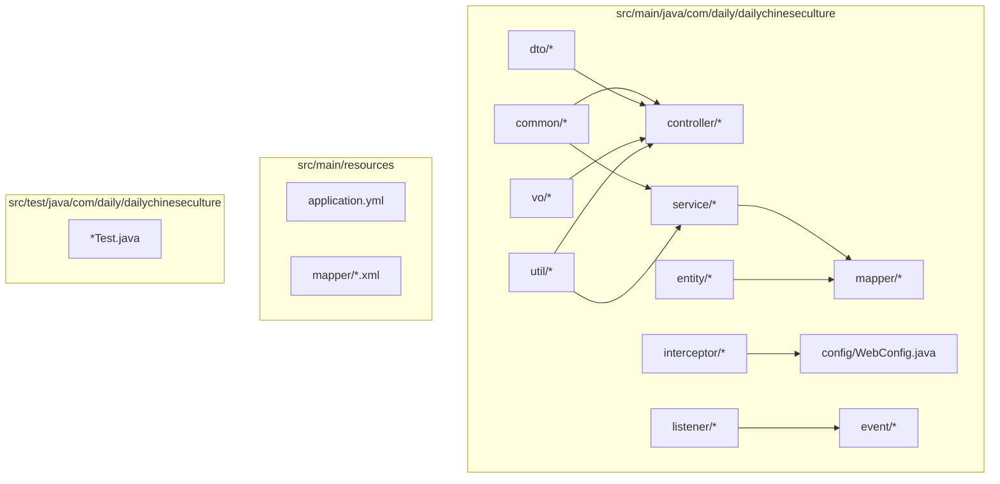
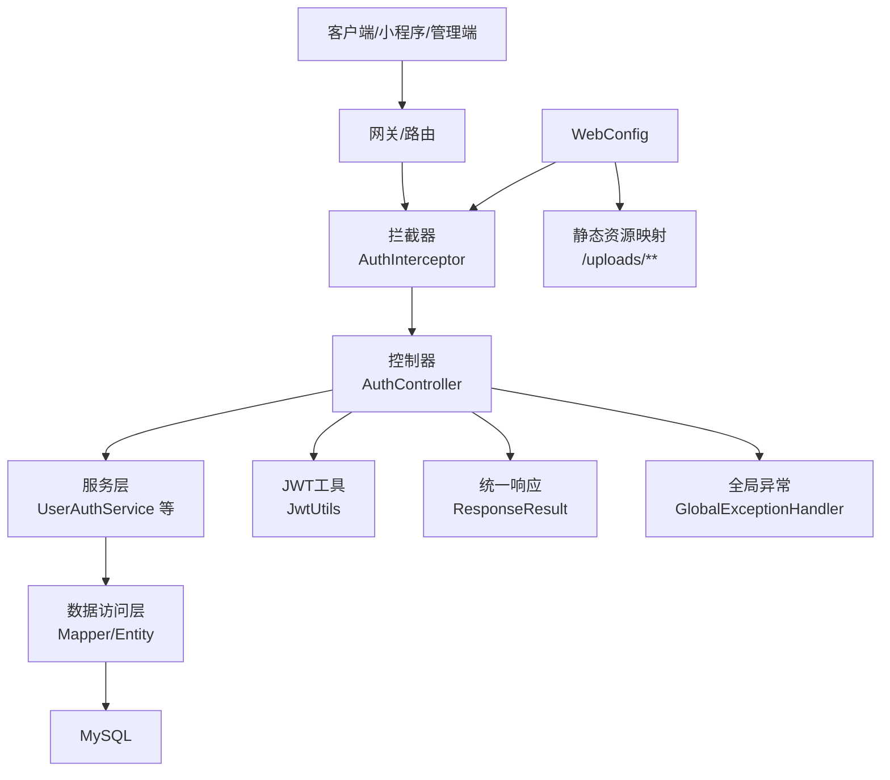
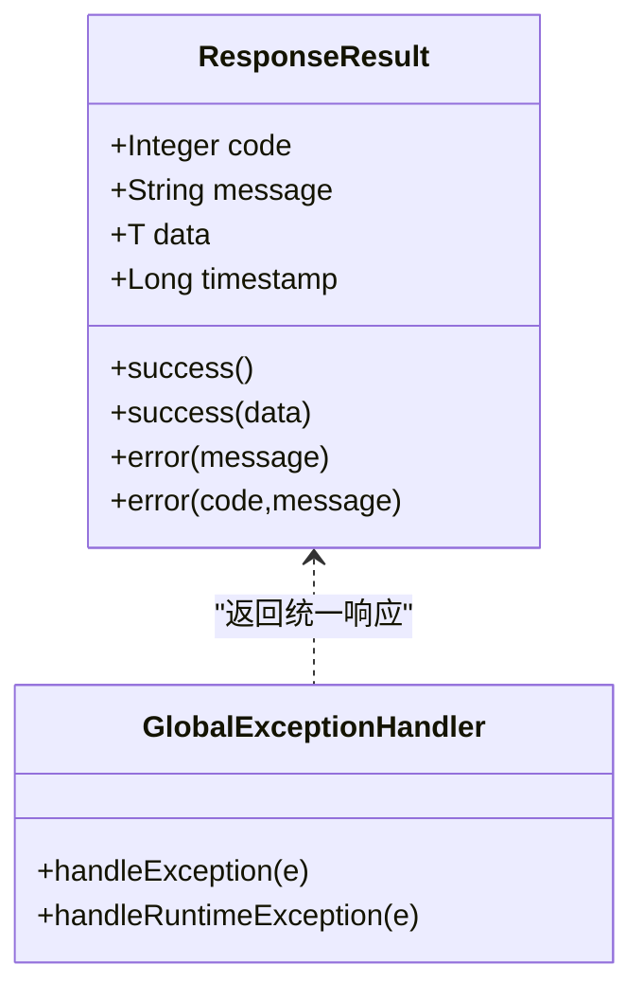
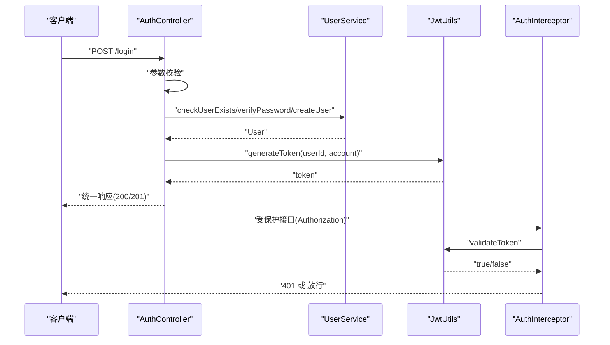
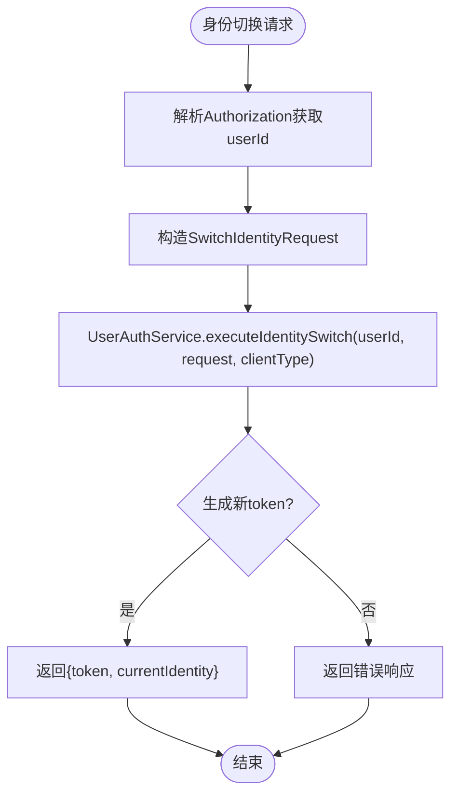
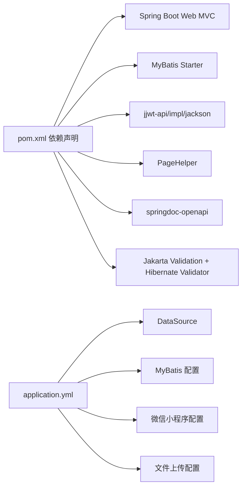

# 开发指南

<cite>
**本文引用的文件**
- [DailyChineseCultureApplication.java](file://src/main/java/com/daily/dailychineseculture/DailyChineseCultureApplication.java)
- [WebConfig.java](file://src/main/java/com/daily/dailychineseculture/config/WebConfig.java)
- [GlobalExceptionHandler.java](file://src/main/java/com/daily/dailychineseculture/common/GlobalExceptionHandler.java)
- [ResponseResult.java](file://src/main/java/com/daily/dailychineseculture/common/ResponseResult.java)
- [AuthController.java](file://src/main/java/com/daily/dailychineseculture/controller/AuthController.java)
- [JwtUtils.java](file://src/main/java/com/daily/dailychineseculture/util/JwtUtils.java)
- [AuthInterceptor.java](file://src/main/java/com/daily/dailychineseculture/interceptor/AuthInterceptor.java)
- [UserAuthService.java](file://src/main/java/com/daily/dailychineseculture/service/UserAuthService.java)
- [application.yml](file://src/main/resources/application.yml)
- [pom.xml](file://pom.xml)
- [开发环境准备指南.md](file://doc/开发环境准备指南.md)
- [项目运行测试指南.md](file://doc/项目运行测试指南.md)
- [API接口文档.md](file://doc/API接口文档.md)
- [.gitignore](file://.gitignore)
- [LoginFunctionTest.java](file://src/test/java/com/daily/dailychineseculture/LoginFunctionTest.java)
</cite>

## 目录
1. [简介](#简介)
2. [项目结构](#项目结构)
3. [核心组件](#核心组件)
4. [架构总览](#架构总览)
5. [组件详解](#组件详解)
6. [依赖关系分析](#依赖关系分析)
7. [性能与可维护性](#性能与可维护性)
8. [调试与故障排查](#调试与故障排查)
9. [Git工作流与代码评审](#git工作流与代码评审)
10. [开发工具与IDE配置](#开发工具与ide配置)
11. [新功能开发模板](#新功能开发模板)
12. [测试编写指南](#测试编写指南)
13. [文档维护规范](#文档维护规范)
14. [结论](#结论)

## 简介
本开发指南面向参与“每日中华”项目的后端开发者，系统化阐述代码规范、命名约定、注释标准、项目结构与包组织、设计模式与编码技巧、性能优化、调试与故障排查、Git工作流与代码评审、开发工具与IDE配置、新功能开发模板、测试编写与文档维护等主题。目标是帮助团队统一开发标准，提升协作效率与代码质量。

## 项目结构
项目采用标准的Spring Boot Maven工程布局，按职责分层组织代码，便于维护与扩展。

图示来源
- [DailyChineseCultureApplication.java](file://src/main/java/com/daily/dailychineseculture/DailyChineseCultureApplication.java)
- [WebConfig.java](file://src/main/java/com/daily/dailychineseculture/config/WebConfig.java)
- [AuthController.java](file://src/main/java/com/daily/dailychineseculture/controller/AuthController.java)
- [JwtUtils.java](file://src/main/java/com/daily/dailychineseculture/util/JwtUtils.java)
- [AuthInterceptor.java](file://src/main/java/com/daily/dailychineseculture/interceptor/AuthInterceptor.java)
- [UserAuthService.java](file://src/main/java/com/daily/dailychineseculture/service/UserAuthService.java)
- [application.yml](file://src/main/resources/application.yml)

章节来源
- [开发环境准备指南.md](file://doc/开发环境准备指南.md)
- [项目运行测试指南.md](file://doc/项目运行测试指南.md)

## 核心组件
- 应用入口与全局配置
  - 应用入口类负责启动Spring Boot应用、注册RestTemplate与CORS过滤器Bean。
  - Web配置类负责静态资源映射与拦截器注册，覆盖认证、管理端鉴权、跨域与公开接口白名单。
- 统一响应与异常处理
  - 统一响应封装类提供成功/失败响应模板，含状态码、消息、数据与时间戳。
  - 全局异常处理器捕获通用异常与运行时异常，统一返回错误响应。
- 控制器与认证
  - 认证控制器提供登录、微信一键登录、用户信息查询/更新、登出、身份切换等接口。
  - 控制器内含参数校验、信息完整性判断、JWT生成与返回。
- 安全与拦截
  - JWT工具类提供token生成、解析、校验与过期判断。
  - 认证拦截器从请求头解析Authorization，校验token有效性并注入用户ID。
- 服务与数据访问
  - 用户认证服务接口定义身份切换与用户状态查询能力。
  - MyBatis配置开启下划线转驼峰映射，XML映射文件位于resources/mapper。

章节来源
- [DailyChineseCultureApplication.java](file://src/main/java/com/daily/dailychineseculture/DailyChineseCultureApplication.java)
- [WebConfig.java](file://src/main/java/com/daily/dailychineseculture/config/WebConfig.java)
- [ResponseResult.java](file://src/main/java/com/daily/dailychineseculture/common/ResponseResult.java)
- [GlobalExceptionHandler.java](file://src/main/java/com/daily/dailychineseculture/common/GlobalExceptionHandler.java)
- [AuthController.java](file://src/main/java/com/daily/dailychineseculture/controller/AuthController.java)
- [JwtUtils.java](file://src/main/java/com/daily/dailychineseculture/util/JwtUtils.java)
- [AuthInterceptor.java](file://src/main/java/com/daily/dailychineseculture/interceptor/AuthInterceptor.java)
- [UserAuthService.java](file://src/main/java/com/daily/dailychineseculture/service/UserAuthService.java)
- [application.yml](file://src/main/resources/application.yml)

## 架构总览
系统采用分层架构：表现层（Controller）、服务层（Service）、数据访问层（Mapper/Entity）、工具与配置层（Util/Config）。拦截器与全局异常处理贯穿请求生命周期，保障安全与一致性。

图示来源
- [AuthController.java](file://src/main/java/com/daily/dailychineseculture/controller/AuthController.java)
- [AuthInterceptor.java](file://src/main/java/com/daily/dailychineseculture/interceptor/AuthInterceptor.java)
- [JwtUtils.java](file://src/main/java/com/daily/dailychineseculture/util/JwtUtils.java)
- [ResponseResult.java](file://src/main/java/com/daily/dailychineseculture/common/ResponseResult.java)
- [GlobalExceptionHandler.java](file://src/main/java/com/daily/dailychineseculture/common/GlobalExceptionHandler.java)
- [WebConfig.java](file://src/main/java/com/daily/dailychineseculture/config/WebConfig.java)

## 组件详解

### 统一响应与异常处理
- 统一响应封装类提供成功/失败静态工厂方法，保证前后端契约一致。
- 全局异常处理器捕获异常并返回标准化错误响应，避免泄露内部细节。

图示来源
- [ResponseResult.java](file://src/main/java/com/daily/dailychineseculture/common/ResponseResult.java)
- [GlobalExceptionHandler.java](file://src/main/java/com/daily/dailychineseculture/common/GlobalExceptionHandler.java)

章节来源
- [ResponseResult.java](file://src/main/java/com/daily/dailychineseculture/common/ResponseResult.java)
- [GlobalExceptionHandler.java](file://src/main/java/com/daily/dailychineseculture/common/GlobalExceptionHandler.java)

### 认证与拦截流程
- 登录流程：参数校验 → 用户存在性与密码校验 → 新用户自动注册 → 信息完整性判断 → 生成JWT → 返回统一响应。
- 拦截流程：从请求头提取Authorization → 校验token有效性 → 注入用户ID供后续使用 → 未登录返回401。

图示来源
- [AuthController.java](file://src/main/java/com/daily/dailychineseculture/controller/AuthController.java)
- [JwtUtils.java](file://src/main/java/com/daily/dailychineseculture/util/JwtUtils.java)
- [AuthInterceptor.java](file://src/main/java/com/daily/dailychineseculture/interceptor/AuthInterceptor.java)

章节来源
- [AuthController.java](file://src/main/java/com/daily/dailychineseculture/controller/AuthController.java)
- [AuthInterceptor.java](file://src/main/java/com/daily/dailychineseculture/interceptor/AuthInterceptor.java)
- [JwtUtils.java](file://src/main/java/com/daily/dailychineseculture/util/JwtUtils.java)

### 身份切换与多端差异
- 用户认证服务接口定义身份切换能力，支持多端差异化处理（如小程序端与管理端）。
- 控制器提供身份切换接口，返回新的JWT与当前身份标识。

图示来源
- [AuthController.java](file://src/main/java/com/daily/dailychineseculture/controller/AuthController.java)
- [UserAuthService.java](file://src/main/java/com/daily/dailychineseculture/service/UserAuthService.java)

章节来源
- [AuthController.java](file://src/main/java/com/daily/dailychineseculture/controller/AuthController.java)
- [UserAuthService.java](file://src/main/java/com/daily/dailychineseculture/service/UserAuthService.java)

## 依赖关系分析
- 技术栈与依赖
  - Spring Boot Web MVC、MyBatis Starter、MySQL驱动、Lombok、JWT、PageHelper、Swagger/Knife4j、Jakarta Validation/Hibernate Validator。
  - 构建阶段启用Lombok注解处理器，打包排除Lombok。
- 运行时配置
  - 数据源、文件上传大小限制、MyBatis驼峰映射与Mapper XML位置、微信小程序配置、文件上传目录。

图示来源
- [pom.xml](file://pom.xml)
- [application.yml](file://src/main/resources/application.yml)

章节来源
- [pom.xml](file://pom.xml)
- [application.yml](file://src/main/resources/application.yml)

## 性能与可维护性
- 性能优化建议
  - 合理使用分页（PageHelper），避免一次性加载大结果集。
  - 对热点接口增加缓存（Redis）与限流（Sentinel/Gateway），降低数据库压力。
  - 控制响应体大小，避免传输冗余字段；对图片等资源使用CDN。
  - 异步处理非关键路径（如日志、通知），减少请求延迟。
- 可维护性建议
  - 统一响应与异常处理，保持错误语义一致。
  - 控制器只做参数校验与编排，复杂逻辑下沉至服务层。
  - DTO/VO分离，避免实体暴露过多内部字段。
  - 明确拦截器白名单，避免过度拦截影响性能。

## 调试与故障排查
- 常见问题定位
  - 端口占用：确认8080端口占用并释放进程。
  - Java环境：检查JAVA_HOME与PATH，确保JDK 21可用。
  - 编译与测试：执行清理编译与单元测试，定位依赖或语法问题。
- 日志与断点
  - 控制器与拦截器中打印关键上下文（如token解析、用户ID、请求路径）。
  - 使用IDE断点逐步跟踪参数校验、服务调用与DAO执行。
- 接口测试
  - 使用curl或Postman发送登录请求，验证参数校验与返回格式。
  - 针对空用户名/密码、新用户注册、Token过期等边界场景逐一验证。

章节来源
- [项目运行测试指南.md](file://doc/项目运行测试指南.md)
- [开发环境准备指南.md](file://doc/开发环境准备指南.md)

## Git工作流与代码评审
- 分支模型
  - 主干：main（发布稳定版本）
  - 开发：develop（集成特性）
  - 功能：feature/xxx（按功能拆分）
  - 修复：fix/xxx（热修复）
  - 发布：release/vX.Y.Z（预发布）
- 提交规范
  - 类型：feat/fix/docs/style/refactor/test/build/ci
  - 示例：feat(auth): 添加微信一键登录接口
- 代码评审
  - 关注点：命名一致性、异常处理、安全（token/权限）、性能与可测试性。
  - 评审工具：GitHub/GitLab Pull Request/MR，要求至少一名Reviewer批准。
- 提交前检查
  - 本地测试通过、无编译警告、遵循统一响应与异常处理规范、必要时补充单元测试。

## 开发工具与IDE配置
- IDE推荐
  - IntelliJ IDEA（社区版/专业版）
  - Eclipse（免费）
  - VS Code（需安装Java扩展包）
- 插件/扩展
  - Lombok、MyBatis Log Plugin、GitToolBox、SonarLint（IntelliJ）
  - Extension Pack for Java、Lombok Annotations Support、MyBatisX、GitLens（VS Code）
- Maven Wrapper
  - 使用mvnw/mvnw.cmd执行构建，避免本地Maven版本差异。

章节来源
- [开发环境准备指南.md](file://doc/开发环境准备指南.md)

## 新功能开发模板
- 目录与文件
  - 控制器：controller/FeatureController.java
  - DTO：dto/FeatureDTO.java
  - VO：vo/FeatureVO.java
  - 服务接口：service/FeatureService.java
  - 服务实现：service/impl/FeatureServiceImpl.java
  - Mapper接口：mapper/FeatureMapper.java
  - XML映射：resources/mapper/FeatureMapper.xml
  - 单元测试：test/FeatureTest.java
- 开发步骤
  1) 设计接口与DTO/VO，明确请求/响应结构
  2) 编写Mapper XML与接口方法
  3) 实现Service接口，处理业务逻辑
  4) 在Controller中编排参数校验、调用Service、返回统一响应
  5) 在WebConfig中按需配置拦截与跨域
  6) 补充单元测试与集成测试
  7) 更新API文档与README

## 测试编写指南
- 单元测试
  - 使用@SpringBootTest加载容器，注入Controller/Service进行行为验证。
  - 针对边界条件（空用户名/密码、Token无效、新用户注册）编写用例。
- 集成测试
  - 使用MockMvc或实际启动应用，验证拦截器、异常处理与统一响应。
- 测试清单
  - 登录成功、空参数校验、新用户自动注册、Token解析与过期、登出流程、身份切换。

章节来源
- [LoginFunctionTest.java](file://src/test/java/com/daily/dailychineseculture/LoginFunctionTest.java)

## 文档维护规范
- 文档分类
  - API文档：接口定义、请求/响应示例、错误码说明
  - 开发指南：环境准备、运行测试、工具配置
  - 业务文档：模块说明、流程梳理、问题排查
- 维护要点
  - 文档与代码同步更新，变更接口需同步修订API文档
  - 使用清晰标题层级与目录索引，便于检索
  - 重要变更记录在README或变更日志中

章节来源
- [API接口文档.md](file://doc/API接口文档.md)
- [开发环境准备指南.md](file://doc/开发环境准备指南.md)
- [项目运行测试指南.md](file://doc/项目运行测试指南.md)

## 结论
本指南提供了从项目结构、核心组件、架构到开发规范、测试与文档维护的完整指引。建议团队在日常开发中严格遵循命名与注释规范、统一响应与异常处理、拦截器与安全策略，持续优化性能与可维护性，并通过Git工作流与代码评审保障质量与一致性。