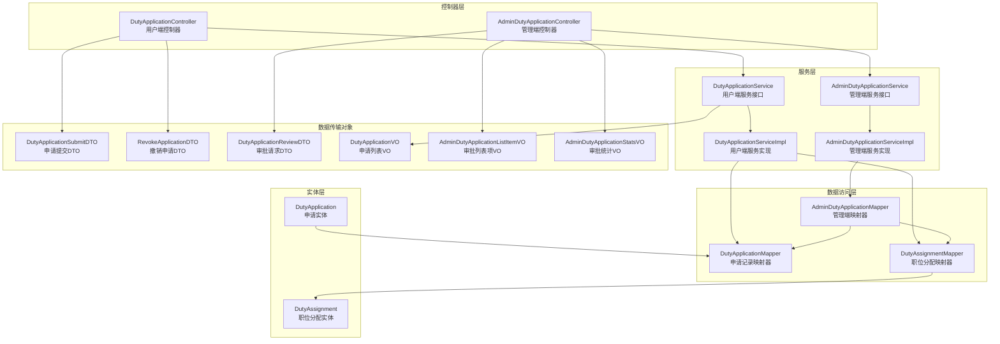
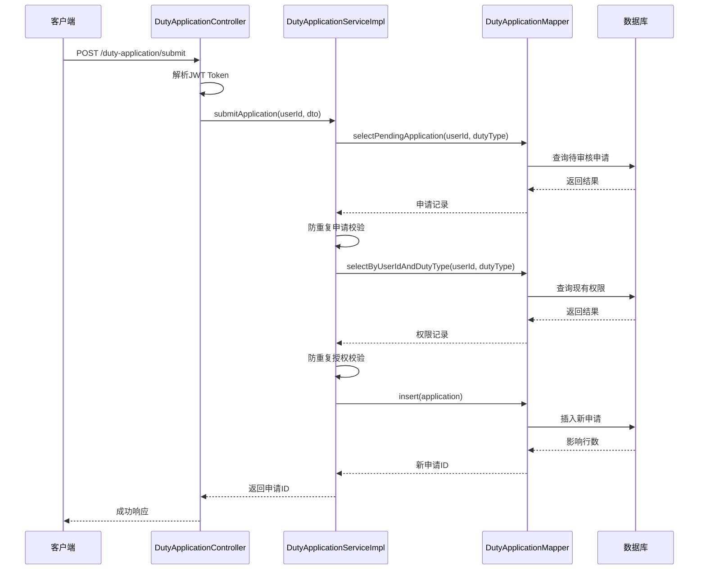
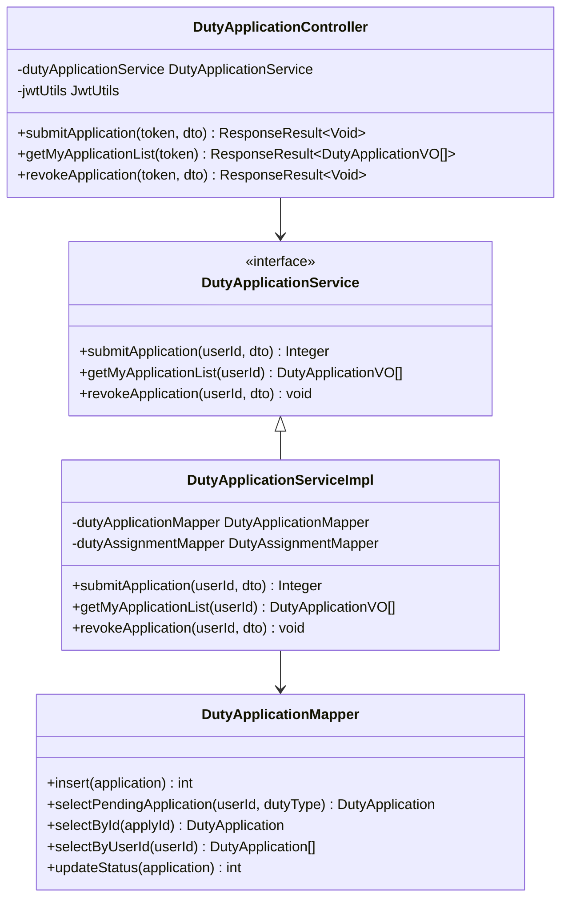
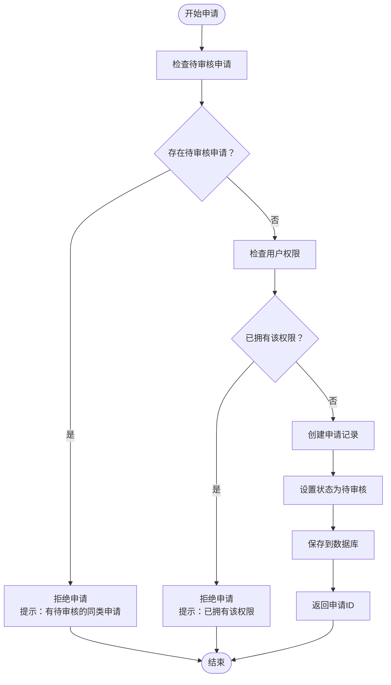
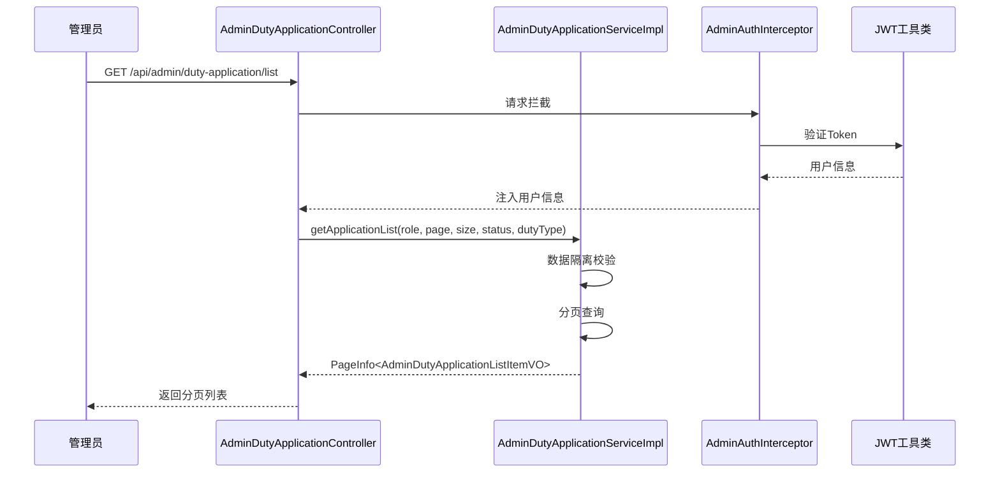
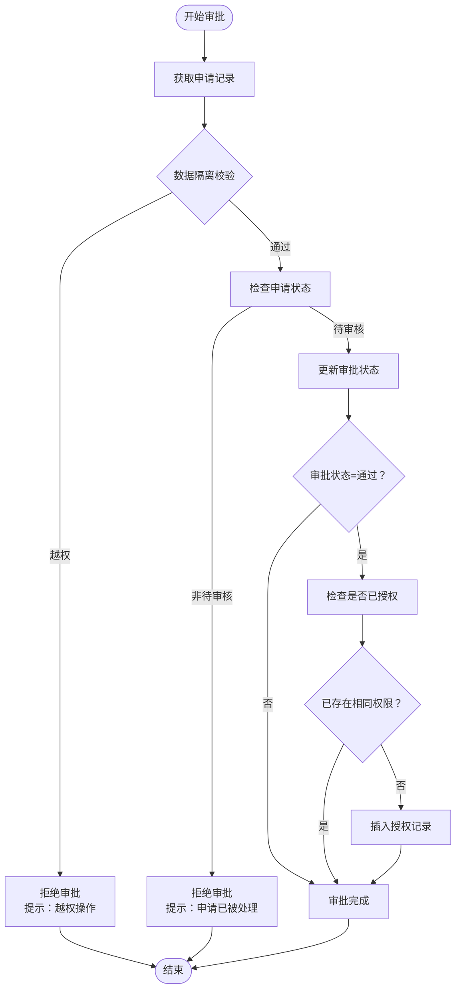

# 值班申请模块

<cite>
**本文档引用的文件**
- [DutyApplicationController.java](file://src/main/java/com/daily/dailychineseculture/controller/DutyApplicationController.java)
- [DutyApplicationService.java](file://src/main/java/com/daily/dailychineseculture/service/DutyApplicationService.java)
- [DutyApplicationServiceImpl.java](file://src/main/java/com/daily/dailychineseculture/service/impl/DutyApplicationServiceImpl.java)
- [DutyApplicationMapper.java](file://src/main/java/com/daily/dailychineseculture/mapper/DutyApplicationMapper.java)
- [DutyApplication.java](file://src/main/java/com/daily/dailychineseculture/entity/DutyApplication.java)
- [DutyApplicationSubmitDTO.java](file://src/main/java/com/daily/dailychineseculture/dto/DutyApplicationSubmitDTO.java)
- [RevokeApplicationDTO.java](file://src/main/java/com/daily/dailychineseculture/dto/RevokeApplicationDTO.java)
- [DutyApplicationVO.java](file://src/main/java/com/daily/dailychineseculture/vo/DutyApplicationVO.java)
- [AdminDutyApplicationController.java](file://src/main/java/com/daily/dailychineseculture/controller/AdminDutyApplicationController.java)
- [AdminDutyApplicationService.java](file://src/main/java/com/daily/dailychineseculture/service/AdminDutyApplicationService.java)
- [AdminDutyApplicationServiceImpl.java](file://src/main/java/com/daily/dailychineseculture/service/impl/AdminDutyApplicationServiceImpl.java)
- [AdminDutyApplicationMapper.java](file://src/main/java/com/daily/dailychineseculture/mapper/AdminDutyApplicationMapper.java)
- [AdminDutyApplicationListItemVO.java](file://src/main/java/com/daily/dailychineseculture/vo/AdminDutyApplicationListItemVO.java)
- [AdminDutyApplicationStatsVO.java](file://src/main/java/com/daily/dailychineseculture/vo/AdminDutyApplicationStatsVO.java)
- [DutyApplicationReviewDTO.java](file://src/main/java/com/daily/dailychineseculture/dto/DutyApplicationReviewDTO.java)
- [DutyAssignment.java](file://src/main/java/com/daily/dailychineseculture/entity/DutyAssignment.java)
- [DutyAssignmentMapper.java](file://src/main/java/com/daily/dailychineseculture/mapper/DutyAssignmentMapper.java)
- [AdminAuthInterceptor.java](file://src/main/java/com/daily/dailychineseculture/interceptor/AdminAuthInterceptor.java)
- [JwtUtils.java](file://src/main/java/com/daily/dailychineseculture/util/JwtUtils.java)
</cite>

## 更新摘要
**所做更改**
- 新增管理员审批流转功能的详细说明
- 完善DutyApplicationReviewDTO数据传输对象的文档
- 增强全局权限模型和发牌逻辑的技术实现细节
- 更新权限控制和数据隔离机制的说明
- 补充审批状态流转的完整业务流程

## 目录
1. [简介](#简介)
2. [项目结构](#项目结构)
3. [核心组件](#核心组件)
4. [架构概览](#架构概览)
5. [详细组件分析](#详细组件分析)
6. [依赖关系分析](#依赖关系分析)
7. [性能考虑](#性能考虑)
8. [故障排除指南](#故障排除指南)
9. [结论](#结论)

## 简介

值班申请模块是每日中文文化项目中的一个核心功能模块，负责管理用户对各种值班权限的申请和审批流程。该模块采用Spring Boot框架构建，实现了完整的权限申请、审核和管理功能。

该模块主要包含两个层面的功能：
- **前端用户层**：普通用户可以通过小程序端提交值班申请、查看申请状态、撤销申请
- **管理后台层**：管理员可以查看所有值班申请、进行审批操作、统计分析

模块设计遵循RESTful API规范，使用JWT进行身份认证，实现了严格的数据隔离和权限控制。

**更新** 新增了管理员审批流转功能，包括审批通过/拒绝的完整业务流程、全局权限模型支持、发牌逻辑等新功能，进一步完善了权限管理体系。

## 项目结构

值班申请模块在项目中的组织结构如下：



**图表来源**
- [DutyApplicationController.java:1-145](file://src/main/java/com/daily/dailychineseculture/controller/DutyApplicationController.java#L1-L145)
- [AdminDutyApplicationController.java:1-199](file://src/main/java/com/daily/dailychineseculture/controller/AdminDutyApplicationController.java#L1-L199)

**章节来源**
- [DutyApplicationController.java:1-145](file://src/main/java/com/daily/dailychineseculture/controller/DutyApplicationController.java#L1-L145)
- [AdminDutyApplicationController.java:1-199](file://src/main/java/com/daily/dailychineseculture/controller/AdminDutyApplicationController.java#L1-L199)

## 核心组件

值班申请模块的核心组件包括以下关键部分：

### 控制器组件
- **DutyApplicationController**：处理用户端的值班申请相关请求
- **AdminDutyApplicationController**：处理管理端的值班申请审批相关请求

### 服务组件
- **DutyApplicationService**：定义用户端值班申请的业务逻辑接口
- **DutyApplicationServiceImpl**：实现用户端值班申请的具体业务逻辑
- **AdminDutyApplicationService**：定义管理端值班申请的业务逻辑接口
- **AdminDutyApplicationServiceImpl**：实现管理端值班申请的具体业务逻辑，包含审批流转功能

### 数据访问组件
- **DutyApplicationMapper**：处理值班申请记录的数据库操作
- **DutyAssignmentMapper**：处理职位分配记录的数据库操作，支持全局权限模型
- **AdminDutyApplicationMapper**：处理管理端值班申请的数据库操作

### 实体组件
- **DutyApplication**：值班申请实体类
- **DutyAssignment**：职位分配实体类，支持全局权限

### 数据传输对象
- **DutyApplicationSubmitDTO**：用户申请提交数据传输对象
- **RevokeApplicationDTO**：申请撤销数据传输对象
- **DutyApplicationReviewDTO**：管理员审批流转数据传输对象

**章节来源**
- [DutyApplicationService.java:1-43](file://src/main/java/com/daily/dailychineseculture/service/DutyApplicationService.java#L1-L43)
- [DutyApplicationServiceImpl.java:1-110](file://src/main/java/com/daily/dailychineseculture/service/impl/DutyApplicationServiceImpl.java#L1-L110)
- [DutyApplicationMapper.java:1-71](file://src/main/java/com/daily/dailychineseculture/mapper/DutyApplicationMapper.java#L1-L71)
- [DutyApplicationReviewDTO.java:1-25](file://src/main/java/com/daily/dailychineseculture/dto/DutyApplicationReviewDTO.java#L1-L25)

## 架构概览

值班申请模块采用经典的三层架构设计，结合MVC模式和分层架构：

```mermaid
graph TB
subgraph "表现层"
UI[用户界面<br/>小程序端]
AC[AdminDutyApplicationController<br/>管理端控制器]
UC[DutyApplicationController<br/>用户端控制器]
end
subgraph "业务逻辑层"
ASI[DutyApplicationServiceImpl<br/>服务实现]
AIS[AdminDutyApplicationServiceImpl<br/>管理端服务实现]
end
subgraph "数据访问层"
DAM[DutyApplicationMapper<br/>申请映射器]
DAM2[DutyAssignmentMapper<br/>分配映射器]
ADM[AdminDutyApplicationMapper<br/>管理端映射器]
end
subgraph "数据模型层"
DA[DutyApplication<br/>申请实体]
DU[DutyAssignment<br/>分配实体]
end
subgraph "基础设施"
JWT[JWT工具类]
INT[AdminAuthInterceptor<br/>管理端拦截器]
PH[PageHelper分页]
END
UI --> UC
AC --> AIS
UC --> ASI
ASI --> DAM
ASI --> DAM2
AIS --> ADM
ADM --> DAM
ADM --> DAM2
DAM --> DA
DAM2 --> DU
UC --> JWT
AC --> INT
INT --> JWT
AC --> PH
```

**图表来源**
- [DutyApplicationController.java:19-21](file://src/main/java/com/daily/dailychineseculture/controller/DutyApplicationController.java#L19-L21)
- [AdminDutyApplicationController.java:18-20](file://src/main/java/com/daily/dailychineseculture/controller/AdminDutyApplicationController.java#L18-L20)
- [AdminAuthInterceptor.java:14-15](file://src/main/java/com/daily/dailychineseculture/interceptor/AdminAuthInterceptor.java#L14-L15)

### 数据流架构



**图表来源**
- [DutyApplicationController.java:44-61](file://src/main/java/com/daily/dailychineseculture/controller/DutyApplicationController.java#L44-L61)
- [DutyApplicationServiceImpl.java:30-58](file://src/main/java/com/daily/dailychineseculture/service/impl/DutyApplicationServiceImpl.java#L30-L58)
- [DutyApplicationMapper.java:20-38](file://src/main/java/com/daily/dailychineseculture/mapper/DutyApplicationMapper.java#L20-L38)

**章节来源**
- [DutyApplicationController.java:29-61](file://src/main/java/com/daily/dailychineseculture/controller/DutyApplicationController.java#L29-L61)
- [DutyApplicationServiceImpl.java:29-58](file://src/main/java/com/daily/dailychineseculture/service/impl/DutyApplicationServiceImpl.java#L29-L58)

## 详细组件分析

### 用户端控制器分析

用户端控制器负责处理普通用户的值班申请相关操作，包含三个核心接口：

#### 申请提交接口
- **接口路径**：POST `/duty-application/submit`
- **功能**：用户提交值班申请请求
- **安全机制**：通过JWT Token验证用户身份
- **校验逻辑**：双重防呆校验（防重复申请 + 防重复授权）

#### 申请列表接口
- **接口路径**：GET `/duty-application/my-list`
- **功能**：获取当前用户的全部申请记录
- **排序规则**：按创建时间倒序排列

#### 申请撤销接口
- **接口路径**：POST `/duty-application/revoke`
- **功能**：撤销待审核状态的申请
- **安全机制**：防越权校验和状态流转校验



**图表来源**
- [DutyApplicationController.java:21-27](file://src/main/java/com/daily/dailychineseculture/controller/DutyApplicationController.java#L21-L27)
- [DutyApplicationService.java:12-42](file://src/main/java/com/daily/dailychineseculture/service/DutyApplicationService.java#L12-L42)
- [DutyApplicationServiceImpl.java:21-27](file://src/main/java/com/daily/dailychineseculture/service/impl/DutyApplicationServiceImpl.java#L21-L27)
- [DutyApplicationMapper.java:12-23](file://src/main/java/com/daily/dailychineseculture/mapper/DutyApplicationMapper.java#L12-L23)

**章节来源**
- [DutyApplicationController.java:44-143](file://src/main/java/com/daily/dailychineseculture/controller/DutyApplicationController.java#L44-L143)

### 服务层实现分析

服务层实现了值班申请的核心业务逻辑，包含三个主要方法：

#### 申请提交服务
服务实现包含双重防呆校验机制：

1. **防重复申请校验**：检查用户是否已有待审核的同类申请
2. **防重复授权校验**：检查用户是否已拥有该权限类型



**图表来源**
- [DutyApplicationServiceImpl.java:30-58](file://src/main/java/com/daily/dailychineseculture/service/impl/DutyApplicationServiceImpl.java#L30-L58)

#### 申请撤销服务
撤销服务包含多重安全校验：

1. **存在性校验**：确认申请记录确实存在
2. **归属校验**：确保用户只能撤销自己的申请
3. **状态校验**：仅待审核状态的申请可以撤销

#### 申请列表服务
提供用户申请历史的查询功能，支持按时间倒序排列。

**章节来源**
- [DutyApplicationServiceImpl.java:78-108](file://src/main/java/com/daily/dailychineseculture/service/impl/DutyApplicationServiceImpl.java#L78-L108)

### 管理端功能分析

管理端值班申请模块提供了完整的审批管理功能，包括统计分析、审批列表和审批流转功能：

#### 审批统计功能
- **接口路径**：GET `/api/admin/duty-application/stats`
- **功能**：提供值班申请的统计分析数据
- **数据隔离**：根据管理员角色进行数据权限控制

#### 审批列表功能
- **接口路径**：GET `/api/admin/duty-application/list`
- **功能**：提供分页的值班申请审批列表
- **过滤功能**：支持按状态和权限类型过滤
- **分页功能**：支持自定义页码和页面大小

#### 审批流转功能
- **接口路径**：POST `/api/admin/duty-application/review`
- **功能**：执行审批通过/拒绝操作
- **权限控制**：基于角色的数据隔离
- **状态校验**：防止重复审批和越权操作
- **发牌逻辑**：审批通过后自动授予全局权限



**图表来源**
- [AdminDutyApplicationController.java:92-129](file://src/main/java/com/daily/dailychineseculture/controller/AdminDutyApplicationController.java#L92-L129)
- [AdminAuthInterceptor.java:24-82](file://src/main/java/com/daily/dailychineseculture/interceptor/AdminAuthInterceptor.java#L24-L82)

**章节来源**
- [AdminDutyApplicationController.java:46-199](file://src/main/java/com/daily/dailychineseculture/controller/AdminDutyApplicationController.java#L46-L199)

### 审批流转服务实现

管理端审批流转功能是新增的核心功能，包含完整的业务逻辑：

#### 审批流程概述
1. **数据获取与越权防呆**：获取申请记录并进行数据隔离校验
2. **状态防呆**：确保申请处于待审核状态
3. **审批写库**：更新申请状态和审核备注
4. **发牌逻辑**：审批通过后自动授予全局权限



**图表来源**
- [AdminDutyApplicationServiceImpl.java:94-170](file://src/main/java/com/daily/dailychineseculture/service/impl/AdminDutyApplicationServiceImpl.java#L94-L170)

#### 全局权限模型
**更新** 新增了全局权限模型支持，所有管理员均为全局权限，不再维护营期ID：

- **权限范围**：管理员拥有全局权限，可在整个系统范围内执行相应操作
- **发牌逻辑**：审批通过后向 `t_duty_assignment` 表插入记录，但不再包含 `camp_id`
- **防重复授权**：通过 `selectByUserIdAndDutyTypeForReview` 方法检查是否已存在相同权限

**章节来源**
- [AdminDutyApplicationServiceImpl.java:145-169](file://src/main/java/com/daily/dailychineseculture/service/impl/AdminDutyApplicationServiceImpl.java#L145-L169)
- [DutyAssignmentMapper.java:88-99](file://src/main/java/com/daily/dailychineseculture/mapper/DutyAssignmentMapper.java#L88-L99)

### 数据模型分析

值班申请模块涉及两个核心实体类：

#### DutyApplication 实体
值班申请实体类对应数据库表 `t_duty_application`，包含以下关键字段：

| 字段名 | 类型 | 描述 | 约束 |
|--------|------|------|------|
| applyId | Integer | 申请ID（主键） | 自增 |
| userId | Long | 申请人用户ID | 外键 |
| campId | Integer | 营期ID（可为空） | 可空 |
| dutyType | String | 权限类型 | 枚举值 |
| applyReason | String | 申请理由 | 必填 |
| status | Integer | 审核状态 | 0-待审核, 1-已通过, 2-未通过, 3-已撤销 |
| auditRemark | String | 审核备注 | 可空 |
| createTime | Date | 创建时间 | 自动填充 |
| updateTime | Date | 更新时间 | 自动填充 |

#### DutyAssignment 实体
职位分配实体类对应数据库表 `t_duty_assignment`，包含以下关键字段：

| 字段名 | 类型 | 描述 | 约束 |
|--------|------|------|------|
| assignmentId | Integer | 职位分配ID（主键） | 主键 |
| userId | Long | 用户ID | 外键 |
| campId | Integer | 营期ID（可为空） | 可空 |
| dutyType | String | 职位类型代码 | 枚举值 |
| dutyName | String | 职位名称 | 必填 |
| startTime | Date | 任职开始时间 | 必填 |
| endTime | Date | 任职结束时间 | 可空 |
| volunteerStartTime | Date | 志愿者服务开始时间 | 可空 |
| volunteerEndTime | Date | 志愿者服务结束时间 | 可空 |
| createTime | Date | 创建时间 | 自动填充 |

**更新** DutyAssignment实体现在支持全局权限模型，不再维护营期ID，所有管理员均拥有全局权限。

**章节来源**
- [DutyApplication.java:11-60](file://src/main/java/com/daily/dailychineseculture/entity/DutyApplication.java#L11-L60)
- [DutyAssignment.java:11-63](file://src/main/java/com/daily/dailychineseculture/entity/DutyAssignment.java#L11-L63)

## 依赖关系分析

值班申请模块的依赖关系呈现清晰的分层结构：

```mermaid
graph TB
subgraph "外部依赖"
SPRING[Spring Boot Framework]
MYBATIS[MyBatis ORM]
JWT[JWT Utils]
PAGEHELPER[PageHelper 分页]
END
subgraph "控制器层"
UC[DutyApplicationController]
AC[AdminDutyApplicationController]
end
subgraph "服务层"
US[DutyApplicationService]
USI[DutyApplicationServiceImpl]
AS[AdminDutyApplicationService]
ASI[AdminDutyApplicationServiceImpl]
end
subgraph "数据访问层"
UM[DutyApplicationMapper]
UAM[DutyAssignmentMapper]
ADM[AdminDutyApplicationMapper]
end
subgraph "实体层"
UE[DutyApplication]
UE2[DutyAssignment]
end
subgraph "数据传输对象"
DTO1[DutyApplicationSubmitDTO]
DTO2[RevokeApplicationDTO]
DTO3[DutyApplicationReviewDTO]
VO1[DutyApplicationVO]
VO2[AdminDutyApplicationListItemVO]
VO3[AdminDutyApplicationStatsVO]
end
SPRING --> UC
SPRING --> AC
SPRING --> US
SPRING --> USI
SPRING --> AS
SPRING --> ASI
MYBATIS --> UM
MYBATIS --> UAM
MYBATIS --> ADM
JWT --> UC
JWT --> AC
PAGEHELPER --> AC
UC --> US
AC --> AS
US <|-- USI
AS <|-- ASI
USI --> UM
USI --> UAM
ASI --> ADM
ADM --> UM
ADM --> UAM
UM --> UE
UAM --> UE2
AC --> DTO3
UC --> DTO1
UC --> DTO2
US --> VO1
AC --> VO2
AC --> VO3
```

**图表来源**
- [DutyApplicationController.java:3-11](file://src/main/java/com/daily/dailychineseculture/controller/DutyApplicationController.java#L3-L11)
- [AdminDutyApplicationController.java:3-8](file://src/main/java/com/daily/dailychineseculture/controller/AdminDutyApplicationController.java#L3-L8)

### 关键依赖特性

1. **Spring Boot集成**：自动配置和依赖注入
2. **MyBatis ORM**：简化数据库操作
3. **JWT认证**：提供安全的身份验证机制
4. **PageHelper分页**：支持大数据量的分页查询

**章节来源**
- [DutyApplicationServiceImpl.java:11-27](file://src/main/java/com/daily/dailychineseculture/service/impl/DutyApplicationServiceImpl.java#L11-L27)
- [AdminAuthInterceptor.java:17-18](file://src/main/java/com/daily/dailychineseculture/interceptor/AdminAuthInterceptor.java#L17-L18)

## 性能考虑

值班申请模块在设计时充分考虑了性能优化：

### 数据库性能优化
- **索引策略**：在 `user_id` 和 `duty_type` 字段上建立组合索引，优化查询性能
- **查询优化**：使用精确的SQL查询，避免N+1查询问题
- **分页查询**：支持大数据量的分页查询，避免全表扫描

### 缓存策略
- **Token缓存**：JWT Token的有效性检查可以考虑添加缓存机制
- **权限缓存**：用户权限信息可以短期缓存，减少数据库查询

### 并发控制
- **事务管理**：使用Spring声明式事务确保数据一致性
- **乐观锁**：在高并发场景下考虑使用版本号控制

### 内存管理
- **流式处理**：大量数据查询时使用流式处理减少内存占用
- **及时释放**：确保数据库连接和资源的及时释放

## 故障排除指南

### 常见问题及解决方案

#### 1. JWT Token相关问题
**问题现象**：用户无法正常登录或接口返回401错误
**可能原因**：
- Token格式不正确
- Token已过期
- Token被篡改

**解决步骤**：
1. 检查客户端是否正确传递Authorization头
2. 验证Token格式是否为Bearer Token
3. 确认Token未过期
4. 检查服务器时间同步情况

#### 2. 申请提交失败
**问题现象**：用户提交申请时出现"系统异常"
**可能原因**：
- 数据库连接异常
- 业务逻辑校验失败
- 网络超时

**解决步骤**：
1. 检查数据库连接状态
2. 查看服务日志获取详细错误信息
3. 验证输入数据的完整性
4. 检查网络连接稳定性

#### 3. 权限控制问题
**问题现象**：管理员无法查看其他管理员的申请
**可能原因**：
- 角色权限配置错误
- 数据隔离逻辑异常
- Token中角色信息缺失

**解决步骤**：
1. 验证管理员角色配置
2. 检查AdminAuthInterceptor的实现
3. 确认JWT中角色信息的正确性
4. 查看数据隔离逻辑的执行情况

#### 4. 分页查询异常
**问题现象**：管理端列表查询返回异常
**可能原因**：
- 分页参数验证失败
- 数据库查询语句错误
- PageHelper配置问题

**解决步骤**：
1. 验证分页参数的合法性
2. 检查SQL查询语句的正确性
3. 确认PageHelper的版本兼容性
4. 查看数据库连接池状态

#### 5. 审批权限问题
**问题现象**：管理员无法审批某些申请
**可能原因**：
- 角色权限不足
- 数据隔离限制
- 申请状态异常

**解决步骤**：
1. 验证管理员角色是否为SUPER_ADMIN
2. 检查申请的dutyType是否与管理员角色匹配
3. 确认申请状态是否为待审核
4. 查看审批日志获取详细信息

#### 6. 审批流转异常
**问题现象**：管理员审批时出现"审批处理失败"
**可能原因**：
- 审批状态参数错误
- 拒绝时缺少审核备注
- 数据库更新失败
- 发牌逻辑异常

**解决步骤**：
1. 验证DutyApplicationReviewDTO参数的正确性
2. 确认审批状态只能为1(通过)或2(拒绝)
3. 检查拒绝时是否填写了审核备注
4. 查看数据库事务执行情况
5. 验证发牌逻辑的执行结果

**章节来源**
- [DutyApplicationController.java:56-60](file://src/main/java/com/daily/dailychineseculture/controller/DutyApplicationController.java#L56-L60)
- [AdminDutyApplicationController.java:105-107](file://src/main/java/com/daily/dailychineseculture/controller/AdminDutyApplicationController.java#L105-L107)

## 结论

值班申请模块是一个设计合理、功能完善的权限管理系统。该模块具有以下特点：

### 技术优势
- **清晰的分层架构**：遵循MVC模式，职责分离明确
- **完善的安全机制**：JWT认证、数据隔离、防越权校验
- **严格的业务校验**：双重防呆机制确保数据一致性
- **良好的扩展性**：接口设计支持未来功能扩展
- **全局权限模型**：支持管理员全局权限管理

### 功能完整性
- **用户端功能**：申请提交、状态查询、申请撤销
- **管理端功能**：审批管理、统计分析、数据隔离、审批流转
- **数据模型完整**：涵盖申请和权限分配的完整生命周期
- **发牌逻辑完善**：审批通过后自动授予全局权限

### 最佳实践
- **RESTful API设计**：符合现代Web API设计标准
- **异常处理机制**：统一的错误响应格式
- **日志记录**：完整的操作日志便于追踪
- **单元测试**：具备完善的测试覆盖

**更新** 新增的管理员审批流转功能进一步增强了模块的管理能力，包括：
- 完整的审批状态流转机制
- 全局权限模型支持
- 自动发牌逻辑
- 增强的数据隔离和权限控制
- 更完善的业务校验机制

该模块为项目的权限管理体系奠定了坚实的基础，为后续的功能扩展提供了良好的技术支撑。