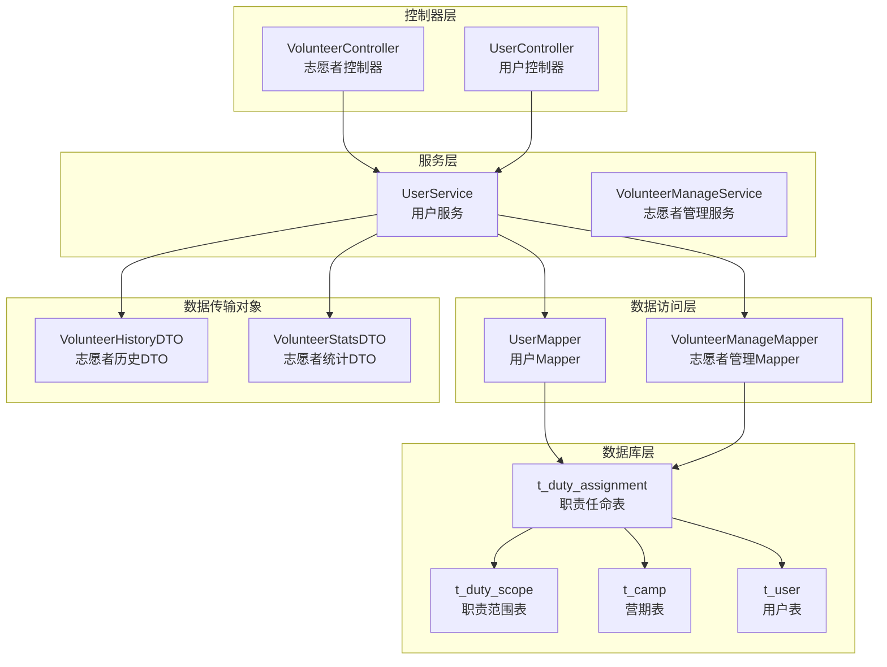
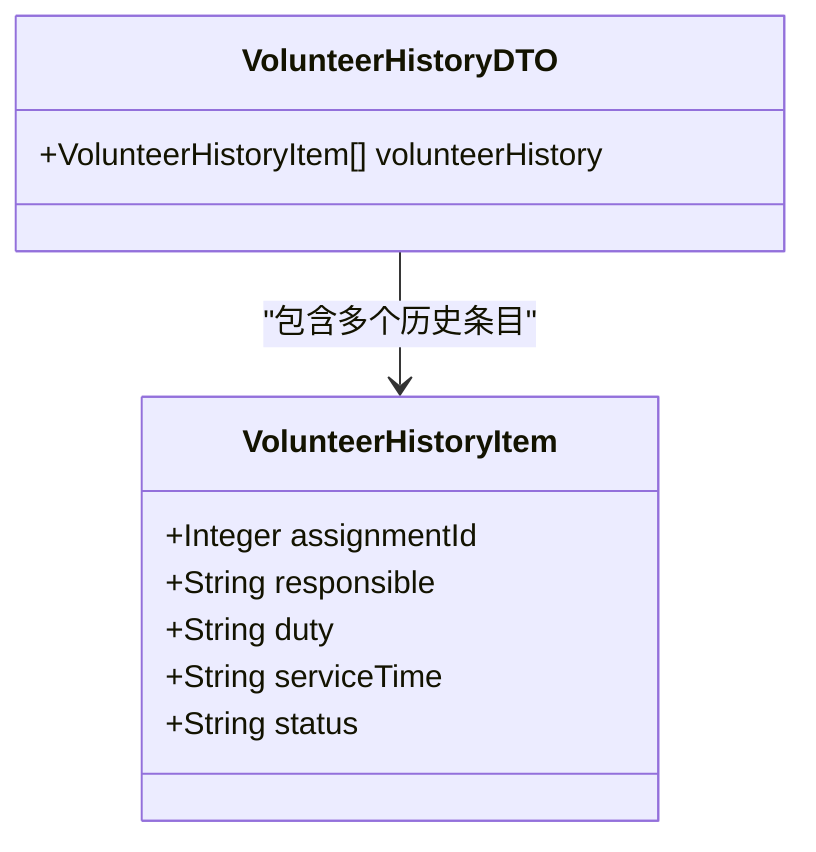
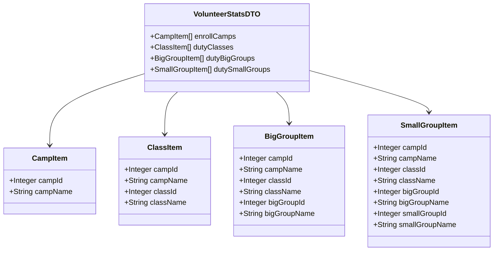
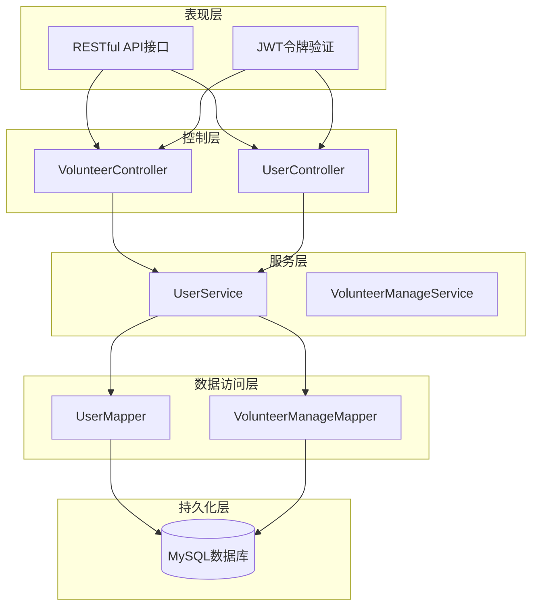
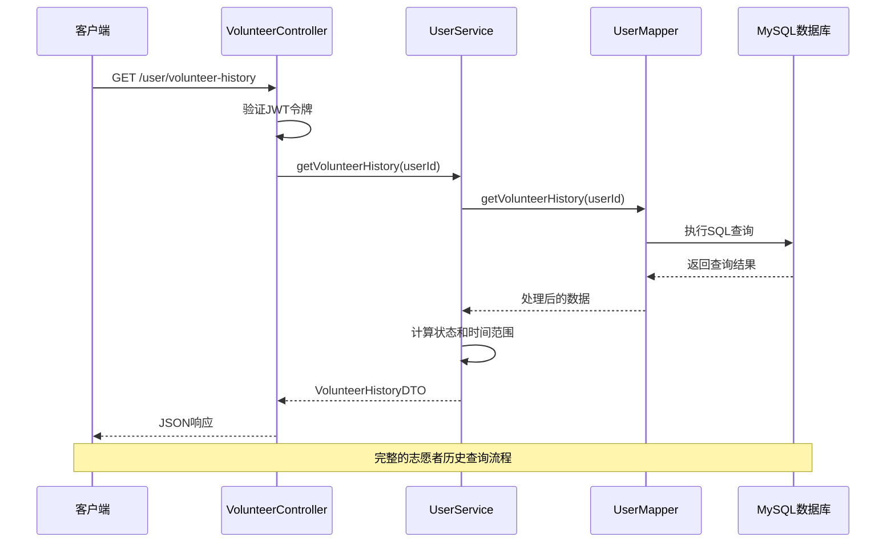
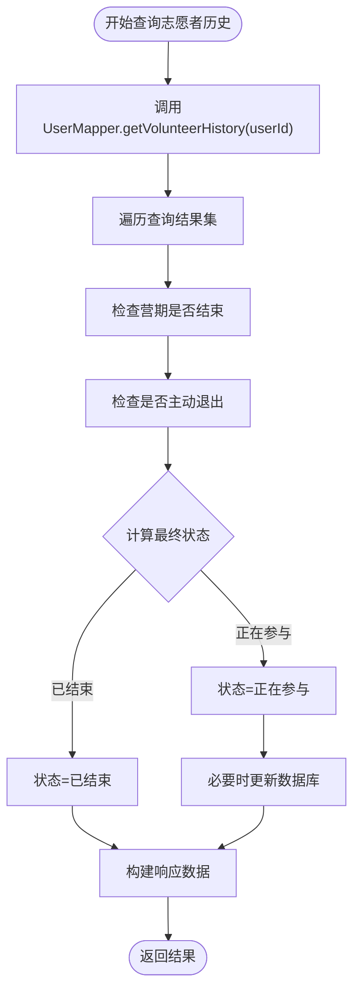
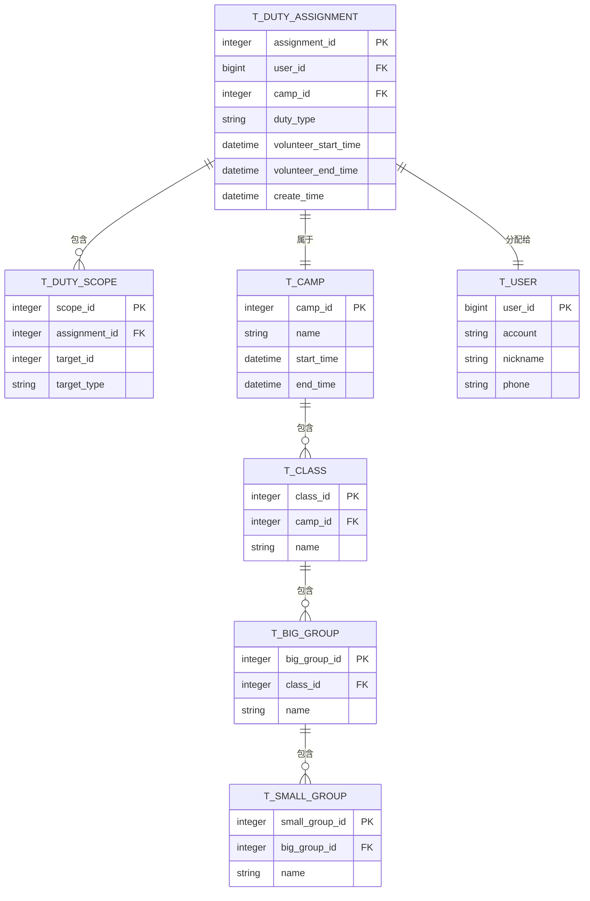
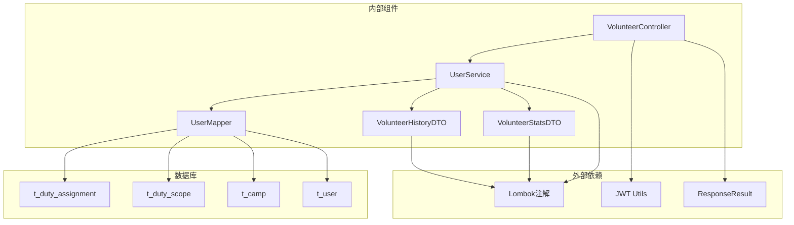

# 志愿者历史记录管理

<cite>
**本文档引用的文件**
- [VolunteerHistoryDTO.java](file://src/main/java/com/daily/dailychineseculture/dto/VolunteerHistoryDTO.java)
- [VolunteerController.java](file://src/main/java/com/daily/dailychineseculture/controller/VolunteerController.java)
- [UserService.java](file://src/main/java/com/daily/dailychineseculture/service/UserService.java)
- [UserMapper.java](file://src/main/java/com/daily/dailychineseculture/mapper/UserMapper.java)
- [VolunteerStatsDTO.java](file://src/main/java/com/daily/dailychineseculture/dto/VolunteerStatsDTO.java)
- [application.yml](file://src/main/resources/application.yml)
- [服务历史统计.md](file://readme/志愿服务模块/服务历史统计.md)
</cite>

## 目录
1. [简介](#简介)
2. [项目结构](#项目结构)
3. [核心组件](#核心组件)
4. [架构概览](#架构概览)
5. [详细组件分析](#详细组件分析)
6. [依赖关系分析](#依赖关系分析)
7. [性能考虑](#性能考虑)
8. [故障排除指南](#故障排除指南)
9. [结论](#结论)

## 简介

志愿者历史记录管理系统是每日中文文化课程平台的重要组成部分，专门用于管理和展示用户的志愿者服务历史。该系统提供了完整的志愿者服务生命周期管理，包括历史记录查询、状态跟踪、统计分析和数据完整性保证等功能。

系统采用经典的三层架构设计（Controller-Service-Mapper），通过RESTful API提供标准化的接口服务，支持按时间段筛选、按服务类型分类、按状态过滤等多种查询功能。所有数据操作均遵循ACID原则，确保数据的一致性和完整性。

## 项目结构

志愿者历史记录管理模块在整体项目中的组织结构如下：

**图表来源**
- [VolunteerController.java:15-78](file://src/main/java/com/daily/dailychineseculture/controller/VolunteerController.java#L15-L78)
- [UserService.java:22-490](file://src/main/java/com/daily/dailychineseculture/service/UserService.java#L22-L490)

**章节来源**
- [VolunteerController.java:1-78](file://src/main/java/com/daily/dailychineseculture/controller/VolunteerController.java#L1-L78)
- [UserService.java:1-800](file://src/main/java/com/daily/dailychineseculture/service/UserService.java#L1-L800)

## 核心组件

### 数据传输对象（DTO）

系统的核心数据传输对象包括志愿者历史记录DTO和志愿者统计DTO，它们定义了API接口的响应格式和数据结构。

#### VolunteerHistoryDTO 结构

志愿者历史记录DTO是系统的主要数据载体，包含完整的志愿者服务历史信息：

**图表来源**
- [VolunteerHistoryDTO.java:10-51](file://src/main/java/com/daily/dailychineseculture/dto/VolunteerHistoryDTO.java#L10-L51)

#### VolunteerStatsDTO 结构

志愿者统计DTO提供多维度的统计信息，支持按营期、班级、大组、小组四个层级进行聚合分析：

**图表来源**
- [VolunteerStatsDTO.java:10-66](file://src/main/java/com/daily/dailychineseculture/dto/VolunteerStatsDTO.java#L10-L66)

**章节来源**
- [VolunteerHistoryDTO.java:1-51](file://src/main/java/com/daily/dailychineseculture/dto/VolunteerHistoryDTO.java#L1-L51)
- [VolunteerStatsDTO.java:1-66](file://src/main/java/com/daily/dailychineseculture/dto/VolunteerStatsDTO.java#L1-L66)

## 架构概览

系统采用经典的MVC架构模式，结合Spring Boot框架的优势，实现了高内聚、低耦合的设计。

**图表来源**
- [VolunteerController.java:15-78](file://src/main/java/com/daily/dailychineseculture/controller/VolunteerController.java#L15-L78)
- [UserService.java:22-490](file://src/main/java/com/daily/dailychineseculture/service/UserService.java#L22-L490)

系统的核心优势包括：

1. **清晰的分层架构**：每层职责明确，便于维护和扩展
2. **统一的异常处理**：通过ResponseResult封装统一的响应格式
3. **JWT安全认证**：基于令牌的无状态认证机制
4. **事务管理**：关键操作通过@Transactional注解保证数据一致性
5. **灵活的查询能力**：支持多种条件组合的复杂查询

## 详细组件分析

### 控制器层分析

#### VolunteerController

志愿者控制器负责处理所有与志愿者历史相关的HTTP请求，提供标准化的API接口。

**图表来源**
- [VolunteerController.java:28-37](file://src/main/java/com/daily/dailychineseculture/controller/VolunteerController.java#L28-L37)
- [UserService.java:332-410](file://src/main/java/com/daily/dailychineseculture/service/UserService.java#L332-L410)

#### API接口规范

系统提供以下主要API接口：

| 接口 | 方法 | 路径 | 功能描述 |
|------|------|------|----------|
| 获取志愿者历史 | GET | `/user/volunteer-history` | 查询用户的完整志愿者历史记录 |
| 退出担当 | POST | `/user/volunteer-quit` | 结束当前的志愿者服务 |
| 获取统计信息 | GET | `/user/volunteer-stats` | 获取多维度的志愿者统计信息 |

**章节来源**
- [VolunteerController.java:25-77](file://src/main/java/com/daily/dailychineseculture/controller/VolunteerController.java#L25-L77)

### 服务层分析

#### UserService

用户服务层是系统的核心业务逻辑实现，负责处理复杂的业务规则和数据计算。

**图表来源**
- [UserService.java:332-410](file://src/main/java/com/daily/dailychineseculture/service/UserService.java#L332-L410)

#### 状态计算逻辑

系统实现了智能的状态计算机制，确保志愿者历史记录的准确性：

1. **正在参与**：营期未结束且未主动退出
2. **已结束**：营期已结束或用户已主动退出
3. **自动归档**：系统自动检测并更新过期的志愿者记录

**章节来源**
- [UserService.java:332-425](file://src/main/java/com/daily/dailychineseculture/service/UserService.java#L332-L425)

### 数据访问层分析

#### UserMapper

用户数据访问层负责与数据库的交互，提供精确的SQL查询和数据操作。

**图表来源**
- [UserMapper.java:78-129](file://src/main/java/com/daily/dailychineseculture/mapper/UserMapper.java#L78-L129)

#### 关键查询功能

系统实现了多种复杂的查询功能：

1. **历史记录查询**：支持按用户ID查询完整的志愿者历史
2. **状态实时计算**：动态计算当前状态和时间范围
3. **统计信息聚合**：按不同层级聚合志愿者服务信息
4. **权限范围查询**：支持多层级的职责范围查询

**章节来源**
- [UserMapper.java:78-228](file://src/main/java/com/daily/dailychineseculture/mapper/UserMapper.java#L78-L228)

## 依赖关系分析

系统各组件之间的依赖关系体现了清晰的分层架构设计：

**图表来源**
- [VolunteerController.java:1-78](file://src/main/java/com/daily/dailychineseculture/controller/VolunteerController.java#L1-L78)
- [UserService.java:1-800](file://src/main/java/com/daily/dailychineseculture/service/UserService.java#L1-L800)

**章节来源**
- [VolunteerController.java:1-78](file://src/main/java/com/daily/dailychineseculture/controller/VolunteerController.java#L1-L78)
- [UserService.java:1-800](file://src/main/java/com/daily/dailychineseculture/service/UserService.java#L1-L800)

## 性能考虑

### 查询优化策略

系统采用了多种性能优化策略来确保高效的查询响应：

1. **索引优化**：在常用查询字段上建立适当的数据库索引
2. **SQL优化**：使用高效的JOIN操作和WHERE条件过滤
3. **缓存策略**：对频繁访问的统计信息实施缓存机制
4. **分页查询**：对于大量数据的查询实施分页处理

### 数据一致性保证

系统通过以下机制确保数据的一致性和完整性：

1. **事务管理**：关键操作使用@Transactional注解确保原子性
2. **约束检查**：数据库层面的外键约束和唯一性约束
3. **状态同步**：实时状态计算和自动归档机制
4. **异常处理**：完善的异常捕获和错误恢复机制

## 故障排除指南

### 常见问题及解决方案

#### 1. JWT令牌验证失败

**问题现象**：API调用返回认证错误

**解决方案**：
- 检查JWT令牌格式是否正确
- 验证令牌是否在有效期内
- 确认令牌签名是否匹配

#### 2. 志愿者历史查询结果为空

**问题现象**：用户没有看到任何历史记录

**解决方案**：
- 检查用户是否确实有志愿者记录
- 验证用户ID是否正确传递
- 确认数据库连接是否正常

#### 3. 状态计算不准确

**问题现象**：志愿者状态显示与预期不符

**解决方案**：
- 检查营期结束时间是否正确
- 验证用户退出时间记录
- 确认系统时间设置是否正确

**章节来源**
- [VolunteerController.java:34-36](file://src/main/java/com/daily/dailychineseculture/controller/VolunteerController.java#L34-L36)
- [UserService.java:415-425](file://src/main/java/com/daily/dailychineseculture/service/UserService.java#L415-L425)

## 结论

志愿者历史记录管理系统是一个设计合理、实现完善的业务系统。通过采用清晰的分层架构、严格的业务规则实现和完善的异常处理机制，系统能够稳定地提供志愿者历史管理的各项功能。

系统的主要特点包括：

1. **完整的功能覆盖**：从历史记录查询到状态管理的全流程支持
2. **灵活的查询能力**：支持多种条件组合的复杂查询需求
3. **严格的数据一致性**：通过事务管理和约束检查确保数据质量
4. **良好的扩展性**：模块化的架构设计便于后续功能扩展
5. **完善的监控机制**：详细的日志记录和异常处理

该系统为每日中文文化课程平台的志愿者管理提供了坚实的技术基础，能够有效支撑平台的长期发展需求。