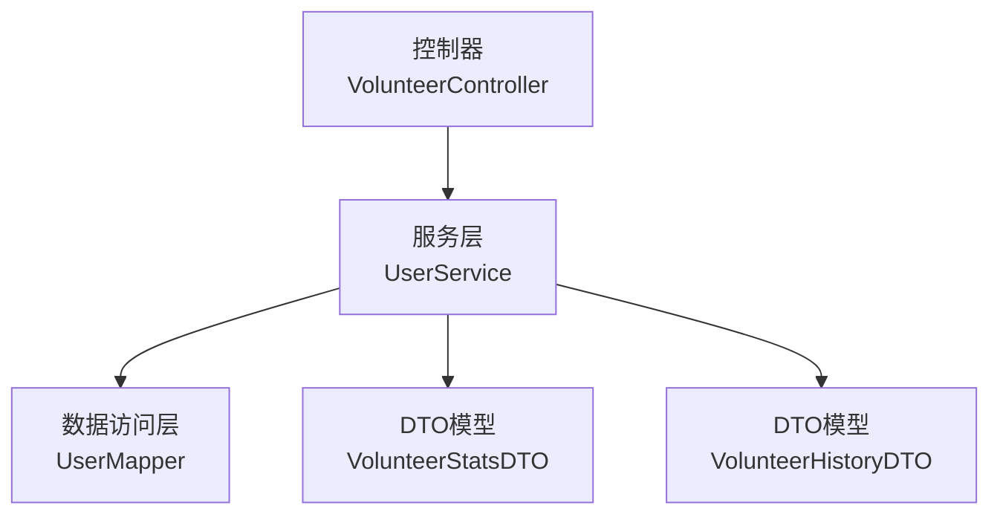
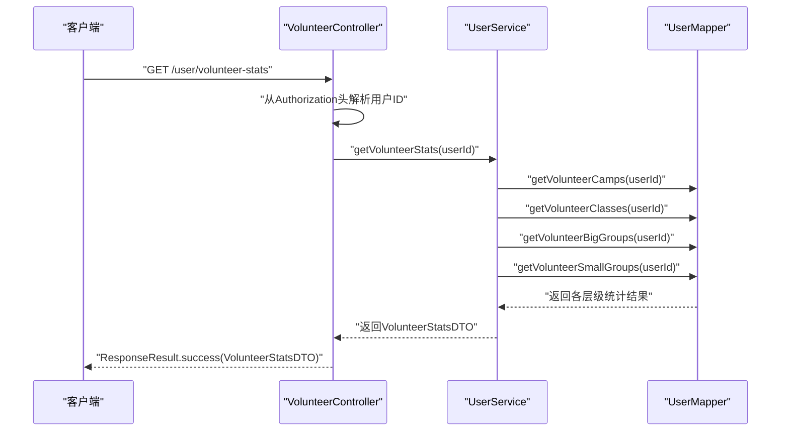
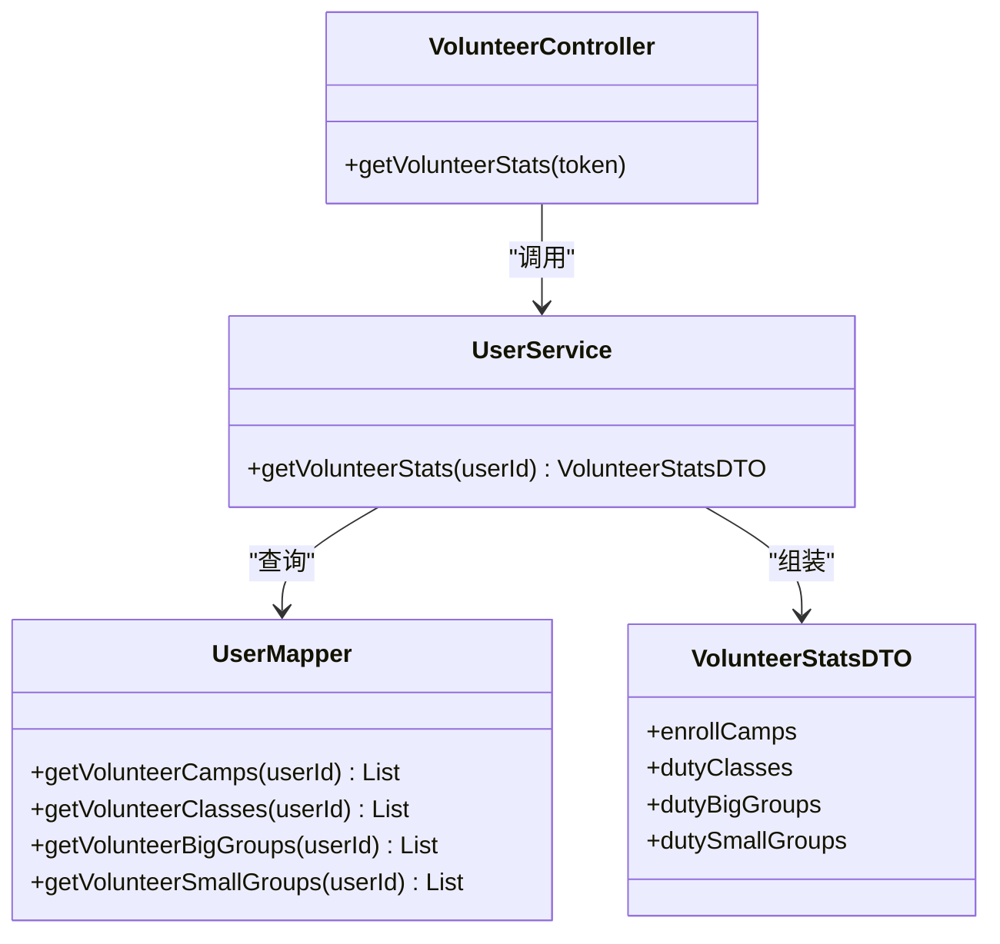

# 志愿者服务统计

<cite>
**本文引用的文件**
- [VolunteerStatsDTO.java](file://src/main/java/com/daily/dailychineseculture/dto/VolunteerStatsDTO.java)
- [VolunteerController.java](file://src/main/java/com/daily/dailychineseculture/controller/VolunteerController.java)
- [UserService.java](file://src/main/java/com/daily/dailychineseculture/service/UserService.java)
- [UserMapper.java](file://src/main/java/com/daily/dailychineseculture/mapper/UserMapper.java)
- [VolunteerHistoryDTO.java](file://src/main/java/com/daily/dailychineseculture/dto/VolunteerHistoryDTO.java)
- [服务历史统计.md](file://readme/志愿服务模块/服务历史统计.md)
- [权限范围计算.md](file://readme/志愿服务模块/权限范围计算.md)
</cite>

## 目录
1. [简介](#简介)
2. [项目结构](#项目结构)
3. [核心组件](#核心组件)
4. [架构总览](#架构总览)
5. [详细组件分析](#详细组件分析)
6. [依赖关系分析](#依赖关系分析)
7. [性能考量](#性能考量)
8. [故障排查指南](#故障排查指南)
9. [结论](#结论)
10. [附录](#附录)

## 简介
本文件聚焦于志愿者服务统计功能，围绕以下目标展开：
- 深入解释志愿者统计数据的计算逻辑，包括服务时长统计、服务次数统计、服务类型分布等指标
- 详细说明VolunteerStatsDTO数据结构和各字段含义
- 分析统计算法的实现细节，如时间计算精度、数据聚合方式、异常数据处理
- 提供具体的API调用示例和返回数据格式，包括GET /user/volunteer-stats接口的使用方法
- 解释统计数据的更新机制和缓存策略

## 项目结构
志愿者服务统计功能由三层协作完成：
- 控制层：提供REST接口，解析令牌并调用服务层
- 服务层：组装统计DTO，执行数据聚合
- 数据访问层：通过MyBatis映射复杂SQL，查询多层级职责范围

图表来源
- [VolunteerController.java:67-77](file://src/main/java/com/daily/dailychineseculture/controller/VolunteerController.java#L67-L77)
- [UserService.java:429-490](file://src/main/java/com/daily/dailychineseculture/service/UserService.java#L429-L490)
- [UserMapper.java:158-228](file://src/main/java/com/daily/dailychineseculture/mapper/UserMapper.java#L158-L228)
- [VolunteerStatsDTO.java:10-66](file://src/main/java/com/daily/dailychineseculture/dto/VolunteerStatsDTO.java#L10-L66)
- [VolunteerHistoryDTO.java:10-51](file://src/main/java/com/daily/dailychineseculture/dto/VolunteerHistoryDTO.java#L10-L51)

章节来源
- [VolunteerController.java:67-77](file://src/main/java/com/daily/dailychineseculture/controller/VolunteerController.java#L67-L77)
- [UserService.java:429-490](file://src/main/java/com/daily/dailychineseculture/service/UserService.java#L429-L490)
- [UserMapper.java:158-228](file://src/main/java/com/daily/dailychineseculture/mapper/UserMapper.java#L158-L228)

## 核心组件
- 接口：GET /user/volunteer-stats
  - 功能：返回当前用户在平台上的志愿者服务统计概览
  - 请求头：Authorization: Bearer <token>
  - 成功响应：ResponseResult<VolunteerStatsDTO>
  - 异常处理：捕获异常并返回错误信息

- 数据传输对象：VolunteerStatsDTO
  - 字段说明：
    - enrollCamps：参与的营期列表（CampItem）
    - dutyClasses：负责的班级列表（ClassItem）
    - dutyBigGroups：负责的大组列表（BigGroupItem）
    - dutySmallGroups：负责的小组列表（SmallGroupItem）
  - 内部类字段：
    - CampItem：campId, campName
    - ClassItem：campId, campName, classId, className
    - BigGroupItem：campId, campName, classId, className, bigGroupId, bigGroupName
    - SmallGroupItem：campId, campName, classId, className, bigGroupId, bigGroupName, smallGroupId, smallGroupName

- 数据访问层：UserMapper
  - 方法：
    - getVolunteerCamps(userId)
    - getVolunteerClasses(userId)
    - getVolunteerBigGroups(userId)
    - getVolunteerSmallGroups(userId)
  - SQL特点：使用DISTINCT去重；通过LEFT JOIN关联多层级组织；按职责范围类型过滤

章节来源
- [VolunteerController.java:67-77](file://src/main/java/com/daily/dailychineseculture/controller/VolunteerController.java#L67-L77)
- [VolunteerStatsDTO.java:10-66](file://src/main/java/com/daily/dailychineseculture/dto/VolunteerStatsDTO.java#L10-L66)
- [UserMapper.java:158-228](file://src/main/java/com/daily/dailychineseculture/mapper/UserMapper.java#L158-L228)

## 架构总览
志愿者服务统计遵循经典的MVC分层：
- 控制器负责鉴权与参数校验，调用服务层
- 服务层负责数据聚合与DTO组装
- 数据访问层负责复杂SQL查询与多表关联

图表来源
- [VolunteerController.java:67-77](file://src/main/java/com/daily/dailychineseculture/controller/VolunteerController.java#L67-L77)
- [UserService.java:429-490](file://src/main/java/com/daily/dailychineseculture/service/UserService.java#L429-L490)
- [UserMapper.java:158-228](file://src/main/java/com/daily/dailychineseculture/mapper/UserMapper.java#L158-L228)

## 详细组件分析

### 数据结构与字段说明
- VolunteerStatsDTO
  - 作用：承载志愿者服务统计的聚合结果
  - 组成：四个列表字段，分别对应营期、班级、大组、小组四个层级
  - 设计意图：为前端提供“按层级查看”的导航与筛选能力

- 内部类CampItem/ClassItem/BigGroupItem/SmallGroupItem
  - 作用：标准化各层级返回字段，便于前端统一渲染
  - 关系：小层级包含父层级标识（如小组包含大组、班级标识）

章节来源
- [VolunteerStatsDTO.java:10-66](file://src/main/java/com/daily/dailychineseculture/dto/VolunteerStatsDTO.java#L10-L66)

### 统计算法与数据聚合
- 聚合维度
  - 营期：按campId去重，统计参与的营期集合
  - 班级：按classId去重，统计负责的班级集合
  - 大组：按bigGroupId去重，统计负责的大组集合
  - 小组：按smallGroupId去重，统计负责的小组集合

- 聚合方式
  - 使用DISTINCT避免重复
  - 通过LEFT JOIN关联职责范围表，确保即使某些层级缺失也能返回可用信息
  - 通过职责范围类型过滤，确保仅统计志愿者相关记录

- 时间与状态处理
  - 服务历史统计中涉及服务开始/结束时间与营期结束时间的比较，采用毫秒级时间戳
  - 本统计接口不直接计算服务时长，而是返回职责范围的层级聚合

章节来源
- [UserMapper.java:158-228](file://src/main/java/com/daily/dailychineseculture/mapper/UserMapper.java#L158-L228)
- [UserService.java:429-490](file://src/main/java/com/daily/dailychineseculture/service/UserService.java#L429-L490)

### API调用示例与返回格式
- 接口定义
  - GET /user/volunteer-stats
  - 请求头：Authorization: Bearer <token>
  - 成功响应体：ResponseResult<VolunteerStatsDTO>

- 返回数据结构要点
  - enrollCamps：数组，元素为{campId, campName}
  - dutyClasses：数组，元素为{campId, campName, classId, className}
  - dutyBigGroups：数组，元素为{campId, campName, classId, className, bigGroupId, bigGroupName}
  - dutySmallGroups：数组，元素为{campId, campName, classId, className, bigGroupId, bigGroupName, smallGroupId, smallGroupName}

- 服务历史统计（辅助理解）
  - GET /user/volunteer-history：返回历史记录列表，包含服务时间段与状态
  - 该接口展示了服务时长的计算思路（开始时间-结束时间），但本统计接口不直接返回时长

章节来源
- [VolunteerController.java:67-77](file://src/main/java/com/daily/dailychineseculture/controller/VolunteerController.java#L67-L77)
- [VolunteerHistoryDTO.java:10-51](file://src/main/java/com/daily/dailychineseculture/dto/VolunteerHistoryDTO.java#L10-L51)
- [服务历史统计.md:87-97](file://readme/志愿服务模块/服务历史统计.md#L87-L97)

### 统计更新机制与缓存策略
- 更新机制
  - 本统计接口为读取型接口，直接从数据库查询并聚合，不涉及写入操作
  - 服务历史统计中存在“实时更新”逻辑：当营期已结束且未主动退出时，系统会将结束时间更新为营期结束时间，以确保历史记录的完整性

- 缓存策略
  - 当前实现未见专门的缓存层
  - 建议：对于高频读取的统计接口，可在服务层增加短期缓存（如Redis），键以userId+时间戳组合，结合业务变更事件失效

章节来源
- [UserService.java:332-410](file://src/main/java/com/daily/dailychineseculture/service/UserService.java#L332-L410)
- [服务历史统计.md:92-97](file://readme/志愿服务模块/服务历史统计.md#L92-L97)

### 服务类型分布与贡献等级
- 服务类型分布
  - 通过职责类型过滤（学组、检组、学委、检委、学班、检班），统计各类型的出现频次
  - 本接口返回的是职责范围的层级聚合，不直接返回类型分布计数

- 贡献等级
  - 本接口未包含贡献等级字段
  - 可扩展：在DTO中增加贡献等级字段，并在服务层根据参与营期数、负责层级数等规则计算

章节来源
- [UserMapper.java:68-73](file://src/main/java/com/daily/dailychineseculture/mapper/UserMapper.java#L68-L73)
- [VolunteerStatsDTO.java:10-66](file://src/main/java/com/daily/dailychineseculture/dto/VolunteerStatsDTO.java#L10-L66)

## 依赖关系分析
- 组件耦合
  - 控制器仅依赖服务层接口，低耦合
  - 服务层依赖Mapper接口，面向接口编程
  - DTO为纯数据载体，无业务逻辑

- 外部依赖
  - MyBatis：负责SQL映射与结果集映射
  - JWT工具：从令牌中提取用户ID

图表来源
- [VolunteerController.java:67-77](file://src/main/java/com/daily/dailychineseculture/controller/VolunteerController.java#L67-L77)
- [UserService.java:429-490](file://src/main/java/com/daily/dailychineseculture/service/UserService.java#L429-L490)
- [UserMapper.java:158-228](file://src/main/java/com/daily/dailychineseculture/mapper/UserMapper.java#L158-L228)
- [VolunteerStatsDTO.java:10-66](file://src/main/java/com/daily/dailychineseculture/dto/VolunteerStatsDTO.java#L10-L66)

## 性能考量
- SQL层面
  - 使用DISTINCT去重，避免重复记录导致的内存与网络开销
  - LEFT JOIN多表关联，建议在职责范围相关列建立索引以提升查询效率

- 服务层
  - 使用Stream流式映射，简洁高效
  - 建议对高频用户ID增加本地缓存，减少数据库压力

- 缓存建议
  - 对VolunteerStatsDTO进行短期缓存（如5分钟）
  - 结合业务事件（退出担当、新增职责等）进行失效

## 故障排查指南
- 常见问题
  - 令牌无效：Authorization头格式错误或过期
  - 用户无职责：返回空列表属正常现象
  - 数据库异常：Mapper层抛出异常会被控制器捕获并返回错误信息

- 排查步骤
  - 检查Authorization头格式是否为Bearer <token>
  - 确认用户ID是否正确解析
  - 观察服务层日志输出，定位SQL执行情况
  - 核对职责范围是否在有效期内（营期未结束且未主动退出）

章节来源
- [VolunteerController.java:67-77](file://src/main/java/com/daily/dailychineseculture/controller/VolunteerController.java#L67-L77)
- [UserService.java:332-410](file://src/main/java/com/daily/dailychineseculture/service/UserService.java#L332-L410)

## 结论
- 本统计接口专注于“职责范围层级聚合”，提供营期、班级、大组、小组四个维度的统计概览
- 服务时长、服务次数、服务类型分布等更细粒度的指标未在本接口直接体现，需结合服务历史统计或扩展DTO字段
- 建议引入缓存与索引优化，以提升高并发场景下的响应性能

## 附录
- 相关接口与文档
  - GET /user/volunteer-stats：志愿者统计概览
  - GET /user/volunteer-history：志愿者历史记录（含服务时长计算思路）
  - 服务历史统计说明文档：[服务历史统计.md](file://readme/志愿服务模块/服务历史统计.md)
  - 权限范围计算说明文档：[权限范围计算.md](file://readme/志愿服务模块/权限范围计算.md)