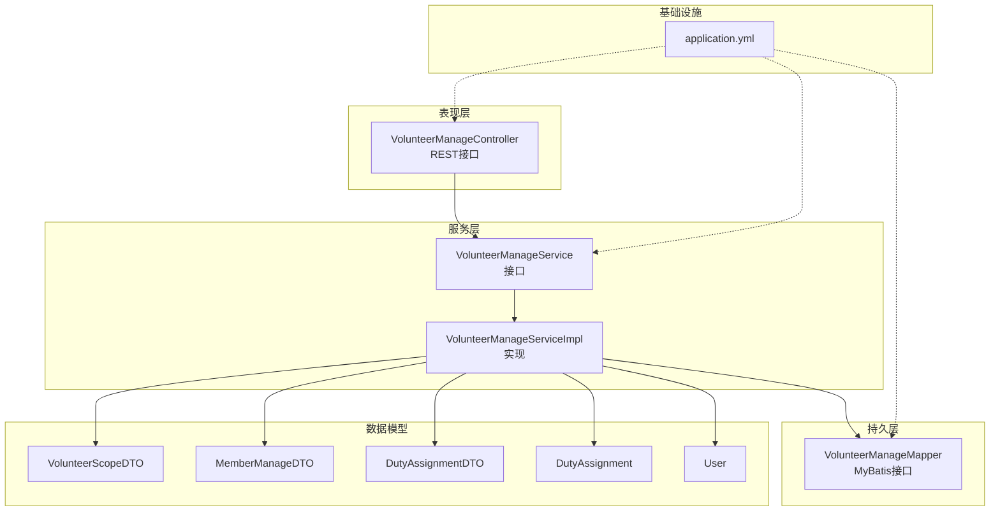
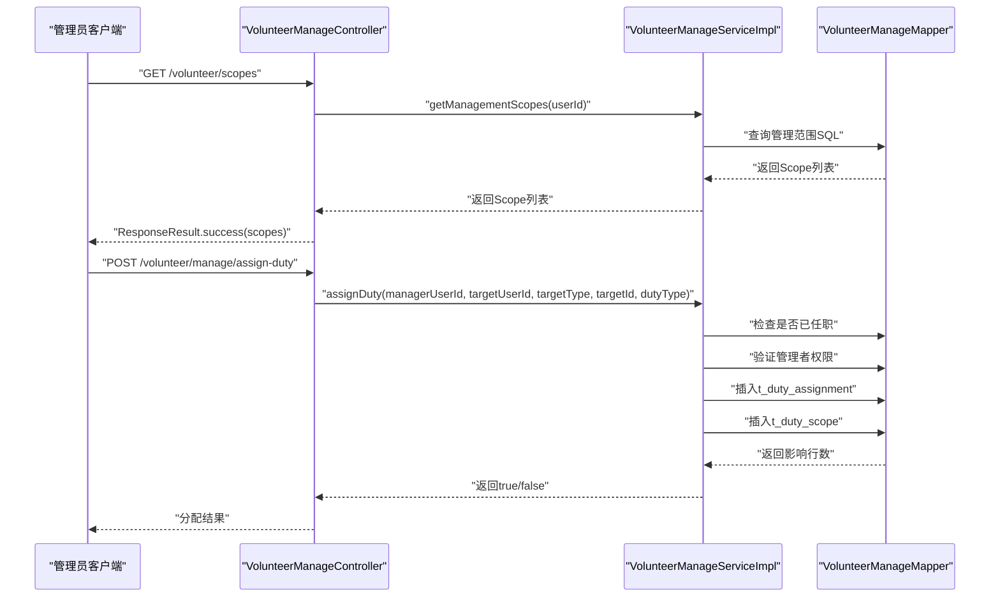
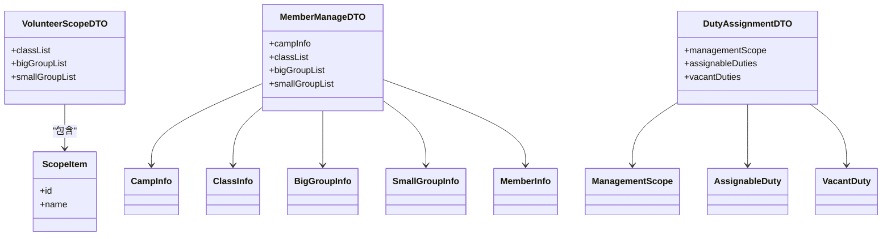
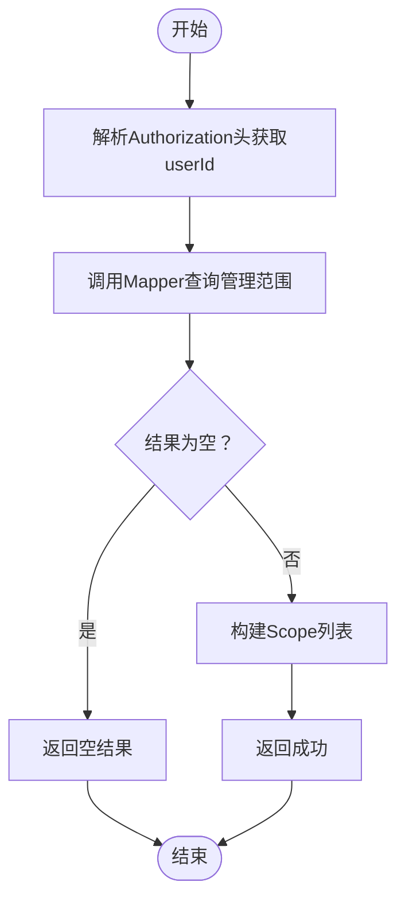
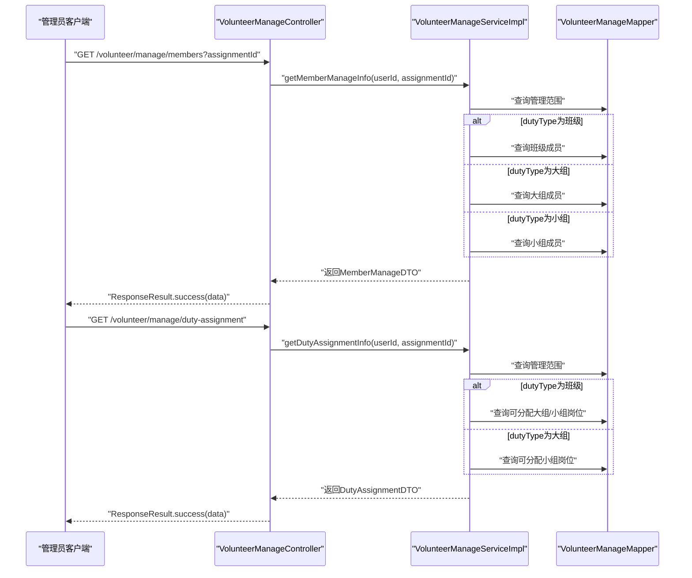
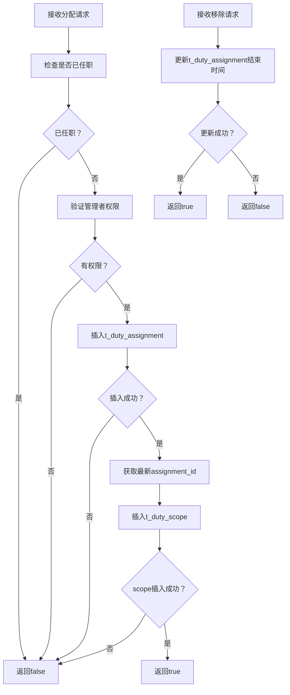
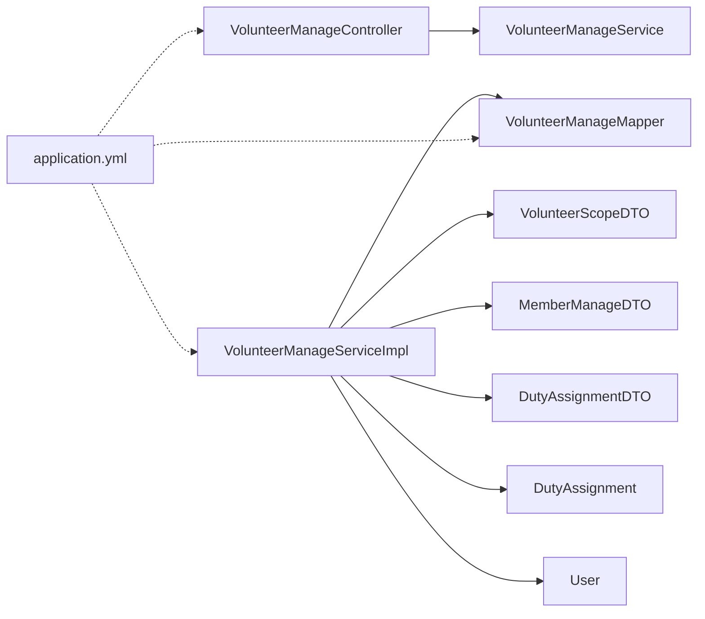

# 志愿者管理后台

<cite>
**本文引用的文件**
- [VolunteerManageController.java](file://src/main/java/com/daily/dailychineseculture/controller/VolunteerManageController.java)
- [VolunteerManageService.java](file://src/main/java/com/daily/dailychineseculture/service/VolunteerManageService.java)
- [VolunteerManageServiceImpl.java](file://src/main/java/com/daily/dailychineseculture/service/impl/VolunteerManageServiceImpl.java)
- [VolunteerManageMapper.java](file://src/main/java/com/daily/dailychineseculture/mapper/VolunteerManageMapper.java)
- [VolunteerScopeDTO.java](file://src/main/java/com/daily/dailychineseculture/dto/VolunteerScopeDTO.java)
- [MemberManageDTO.java](file://src/main/java/com/daily/dailychineseculture/dto/MemberManageDTO.java)
- [DutyAssignmentDTO.java](file://src/main/java/com/daily/dailychineseculture/dto/DutyAssignmentDTO.java)
- [DutyAssignment.java](file://src/main/java/com/daily/dailychineseculture/entity/DutyAssignment.java)
- [User.java](file://src/main/java/com/daily/dailychineseculture/entity/User.java)
- [application.yml](file://src/main/resources/application.yml)
- [权限范围计算.md](file://readme/志愿服务模块/权限范围计算.md)
- [服务历史统计.md](file://readme/志愿服务模块/服务历史统计.md)
- [PC端后台管理登录接口 HTTP 401 错误修复方案.md](file://doc/PC端后台管理登录接口 HTTP 401 错误修复方案.md)
- [PC端后台管理登录接口 HTTP 状态码修复报告.md](file://doc/PC端后台管理登录接口 HTTP 状态码修复报告.md)
</cite>

## 目录
1. [简介](#简介)
2. [项目结构](#项目结构)
3. [核心组件](#核心组件)
4. [架构总览](#架构总览)
5. [详细组件分析](#详细组件分析)
6. [依赖关系分析](#依赖关系分析)
7. [性能考虑](#性能考虑)
8. [故障排查指南](#故障排查指南)
9. [结论](#结论)
10. [附录](#附录)

## 简介
本文件面向志愿者管理后台的功能与实现，系统性阐述管理员对志愿者的全面管理能力，包括：
- 志愿者信息查看与权限范围计算
- 岗位分配与移除
- 管理范围内的成员与职责可视化
- 与前台功能的协同与数据一致性保障
- 安全机制（鉴权、拦截、日志与审计思路）

同时，文档提供接口使用示例、流程图与时序图，帮助开发者与产品人员快速理解与落地。

## 项目结构
志愿者管理后台采用经典的分层架构：
- 控制器层：对外暴露REST接口，负责参数解析与响应封装
- 服务层：编排业务逻辑，校验权限与状态
- 持久层：MyBatis Mapper负责SQL执行与结果映射
- DTO/Entity：承载数据传输与持久化模型
- 配置：数据库连接、文件上传、MyBatis驼峰映射等

图表来源
- [VolunteerManageController.java:1-137](file://src/main/java/com/daily/dailychineseculture/controller/VolunteerManageController.java#L1-L137)
- [VolunteerManageService.java:1-38](file://src/main/java/com/daily/dailychineseculture/service/VolunteerManageService.java#L1-L38)
- [VolunteerManageServiceImpl.java:1-430](file://src/main/java/com/daily/dailychineseculture/service/impl/VolunteerManageServiceImpl.java#L1-L430)
- [VolunteerManageMapper.java:1-222](file://src/main/java/com/daily/dailychineseculture/mapper/VolunteerManageMapper.java#L1-L222)
- [VolunteerScopeDTO.java:1-48](file://src/main/java/com/daily/dailychineseculture/dto/VolunteerScopeDTO.java#L1-L48)
- [MemberManageDTO.java:1-99](file://src/main/java/com/daily/dailychineseculture/dto/MemberManageDTO.java#L1-L99)
- [DutyAssignmentDTO.java:1-72](file://src/main/java/com/daily/dailychineseculture/dto/DutyAssignmentDTO.java#L1-L72)
- [DutyAssignment.java:1-64](file://src/main/java/com/daily/dailychineseculture/entity/DutyAssignment.java#L1-L64)
- [User.java:1-87](file://src/main/java/com/daily/dailychineseculture/entity/User.java#L1-L87)
- [application.yml:1-33](file://src/main/resources/application.yml#L1-L33)

章节来源
- [VolunteerManageController.java:1-137](file://src/main/java/com/daily/dailychineseculture/controller/VolunteerManageController.java#L1-L137)
- [VolunteerManageService.java:1-38](file://src/main/java/com/daily/dailychineseculture/service/VolunteerManageService.java#L1-L38)
- [VolunteerManageServiceImpl.java:1-430](file://src/main/java/com/daily/dailychineseculture/service/impl/VolunteerManageServiceImpl.java#L1-L430)
- [VolunteerManageMapper.java:1-222](file://src/main/java/com/daily/dailychineseculture/mapper/VolunteerManageMapper.java#L1-L222)
- [application.yml:1-33](file://src/main/resources/application.yml#L1-L33)

## 核心组件
- 志愿者管理控制器：提供获取管理范围、成员信息、岗位分配信息、分配/移除岗位等接口
- 志愿者管理服务接口与实现：封装权限范围查询、成员与职责信息组装、岗位分配与移除的业务规则
- 志愿者管理Mapper：提供权限范围、成员列表、可分配岗位、当前任职者、岗位分配/移除等SQL
- DTO/Entity：承载权限范围、成员信息、岗位分配、职责范围等数据结构
- 配置：数据库连接、MyBatis驼峰映射、文件上传大小等

章节来源
- [VolunteerManageController.java:1-137](file://src/main/java/com/daily/dailychineseculture/controller/VolunteerManageController.java#L1-L137)
- [VolunteerManageService.java:1-38](file://src/main/java/com/daily/dailychineseculture/service/VolunteerManageService.java#L1-L38)
- [VolunteerManageServiceImpl.java:1-430](file://src/main/java/com/daily/dailychineseculture/service/impl/VolunteerManageServiceImpl.java#L1-L430)
- [VolunteerManageMapper.java:1-222](file://src/main/java/com/daily/dailychineseculture/mapper/VolunteerManageMapper.java#L1-L222)
- [VolunteerScopeDTO.java:1-48](file://src/main/java/com/daily/dailychineseculture/dto/VolunteerScopeDTO.java#L1-L48)
- [MemberManageDTO.java:1-99](file://src/main/java/com/daily/dailychineseculture/dto/MemberManageDTO.java#L1-L99)
- [DutyAssignmentDTO.java:1-72](file://src/main/java/com/daily/dailychineseculture/dto/DutyAssignmentDTO.java#L1-L72)
- [DutyAssignment.java:1-64](file://src/main/java/com/daily/dailychineseculture/entity/DutyAssignment.java#L1-L64)
- [User.java:1-87](file://src/main/java/com/daily/dailychineseculture/entity/User.java#L1-L87)
- [application.yml:1-33](file://src/main/resources/application.yml#L1-L33)

## 架构总览
志愿者管理后台遵循“控制器-服务-持久层”的分层设计，配合DTO/Entity进行数据传输与持久化。权限范围计算通过SQL层面的多表关联与COALESCE函数实现，服务层再按职位类型进行分支处理，最终输出给前端。

图表来源
- [VolunteerManageController.java:26-136](file://src/main/java/com/daily/dailychineseculture/controller/VolunteerManageController.java#L26-L136)
- [VolunteerManageServiceImpl.java:24-346](file://src/main/java/com/daily/dailychineseculture/service/impl/VolunteerManageServiceImpl.java#L24-L346)
- [VolunteerManageMapper.java:18-197](file://src/main/java/com/daily/dailychineseculture/mapper/VolunteerManageMapper.java#L18-L197)

## 详细组件分析

### 权限范围计算与数据结构
- VolunteerScopeDTO：用于描述管理范围的轻量结构，包含班级/大组/小组的ScopeItem列表
- MemberManageDTO：用于展示当前管理范围下的营期、班级/大组/小组及其成员信息
- DutyAssignmentDTO：用于展示可分配岗位与当前任职者信息

图表来源
- [VolunteerScopeDTO.java:1-48](file://src/main/java/com/daily/dailychineseculture/dto/VolunteerScopeDTO.java#L1-L48)
- [MemberManageDTO.java:1-99](file://src/main/java/com/daily/dailychineseculture/dto/MemberManageDTO.java#L1-L99)
- [DutyAssignmentDTO.java:1-72](file://src/main/java/com/daily/dailychineseculture/dto/DutyAssignmentDTO.java#L1-L72)

章节来源
- [VolunteerScopeDTO.java:1-48](file://src/main/java/com/daily/dailychineseculture/dto/VolunteerScopeDTO.java#L1-L48)
- [MemberManageDTO.java:1-99](file://src/main/java/com/daily/dailychineseculture/dto/MemberManageDTO.java#L1-L99)
- [DutyAssignmentDTO.java:1-72](file://src/main/java/com/daily/dailychineseculture/dto/DutyAssignmentDTO.java#L1-L72)
- [权限范围计算.md:1-76](file://readme/志愿服务模块/权限范围计算.md#L1-L76)

### 管理范围查询流程
- 控制器从Authorization头解析用户ID
- 服务层调用Mapper执行权限范围查询SQL，返回包含assignmentId、camp、class/bigGroup/smallGroup、dutyType等字段
- 前端基于返回的Scope列表进行UI渲染与权限控制

图表来源
- [VolunteerManageController.java:29-42](file://src/main/java/com/daily/dailychineseculture/controller/VolunteerManageController.java#L29-L42)
- [VolunteerManageServiceImpl.java:24-27](file://src/main/java/com/daily/dailychineseculture/service/impl/VolunteerManageServiceImpl.java#L24-L27)
- [VolunteerManageMapper.java:18-47](file://src/main/java/com/daily/dailychineseculture/mapper/VolunteerManageMapper.java#L18-L47)

章节来源
- [VolunteerManageController.java:29-42](file://src/main/java/com/daily/dailychineseculture/controller/VolunteerManageController.java#L29-L42)
- [VolunteerManageServiceImpl.java:24-27](file://src/main/java/com/daily/dailychineseculture/service/impl/VolunteerManageServiceImpl.java#L24-L27)
- [VolunteerManageMapper.java:18-47](file://src/main/java/com/daily/dailychineseculture/mapper/VolunteerManageMapper.java#L18-L47)
- [权限范围计算.md:14-31](file://readme/志愿服务模块/权限范围计算.md#L14-L31)

### 成员信息与职责范围
- 服务层根据当前用户的dutyType分支：
  - 学班/检班：查询班级成员
  - 学委/检委：查询大组成员
  - 学组/检组：查询小组成员
- DutyAssignmentDTO中提供可分配岗位列表，结合当前任职者状态判断是否空缺

图表来源
- [VolunteerManageController.java:47-80](file://src/main/java/com/daily/dailychineseculture/controller/VolunteerManageController.java#L47-L80)
- [VolunteerManageServiceImpl.java:30-122](file://src/main/java/com/daily/dailychineseculture/service/impl/VolunteerManageServiceImpl.java#L30-L122)
- [VolunteerManageServiceImpl.java:124-261](file://src/main/java/com/daily/dailychineseculture/service/impl/VolunteerManageServiceImpl.java#L124-L261)
- [VolunteerManageMapper.java:49-166](file://src/main/java/com/daily/dailychineseculture/mapper/VolunteerManageMapper.java#L49-L166)

章节来源
- [VolunteerManageController.java:47-80](file://src/main/java/com/daily/dailychineseculture/controller/VolunteerManageController.java#L47-L80)
- [VolunteerManageServiceImpl.java:30-122](file://src/main/java/com/daily/dailychineseculture/service/impl/VolunteerManageServiceImpl.java#L30-L122)
- [VolunteerManageServiceImpl.java:124-261](file://src/main/java/com/daily/dailychineseculture/service/impl/VolunteerManageServiceImpl.java#L124-L261)
- [VolunteerManageMapper.java:49-166](file://src/main/java/com/daily/dailychineseculture/mapper/VolunteerManageMapper.java#L49-L166)

### 岗位分配与移除
- 分配岗位前检查目标用户是否已担任同类型职位；验证管理者权限（班级管理者可分配全部，大组管理者仅可分配小组岗位）
- 成功后插入t_duty_assignment并回填assignment_id，再插入t_duty_scope建立职责范围
- 移除岗位通过更新t_duty_assignment的结束时间为当前时间实现“软退”

图表来源
- [VolunteerManageServiceImpl.java:263-357](file://src/main/java/com/daily/dailychineseculture/service/impl/VolunteerManageServiceImpl.java#L263-L357)
- [VolunteerManageMapper.java:184-197](file://src/main/java/com/daily/dailychineseculture/mapper/VolunteerManageMapper.java#L184-L197)

章节来源
- [VolunteerManageController.java:85-136](file://src/main/java/com/daily/dailychineseculture/controller/VolunteerManageController.java#L85-L136)
- [VolunteerManageServiceImpl.java:263-357](file://src/main/java/com/daily/dailychineseculture/service/impl/VolunteerManageServiceImpl.java#L263-L357)
- [VolunteerManageMapper.java:184-197](file://src/main/java/com/daily/dailychineseculture/mapper/VolunteerManageMapper.java#L184-L197)

### 与前台功能的协调
- 前台“服务历史统计”模块展示志愿者历程与状态（正在参与/已结束），通过比较营期结束时间与当前时间自动归档
- 后台“权限范围计算”与“成员信息”接口为前台提供数据支撑，保证数据一致性与权限边界

章节来源
- [服务历史统计.md:1-97](file://readme/志愿服务模块/服务历史统计.md#L1-L97)

## 依赖关系分析
- 控制器依赖服务接口；服务实现依赖Mapper与DTO/Entity
- Mapper依赖数据库表结构（t_duty_assignment、t_duty_scope、t_camp、t_class、t_big_group、t_small_group、t_user）
- 配置文件提供数据库连接、MyBatis驼峰映射与文件上传参数

图表来源
- [VolunteerManageController.java:1-137](file://src/main/java/com/daily/dailychineseculture/controller/VolunteerManageController.java#L1-L137)
- [VolunteerManageService.java:1-38](file://src/main/java/com/daily/dailychineseculture/service/VolunteerManageService.java#L1-L38)
- [VolunteerManageServiceImpl.java:1-430](file://src/main/java/com/daily/dailychineseculture/service/impl/VolunteerManageServiceImpl.java#L1-L430)
- [VolunteerManageMapper.java:1-222](file://src/main/java/com/daily/dailychineseculture/mapper/VolunteerManageMapper.java#L1-L222)
- [VolunteerScopeDTO.java:1-48](file://src/main/java/com/daily/dailychineseculture/dto/VolunteerScopeDTO.java#L1-L48)
- [MemberManageDTO.java:1-99](file://src/main/java/com/daily/dailychineseculture/dto/MemberManageDTO.java#L1-L99)
- [DutyAssignmentDTO.java:1-72](file://src/main/java/com/daily/dailychineseculture/dto/DutyAssignmentDTO.java#L1-L72)
- [DutyAssignment.java:1-64](file://src/main/java/com/daily/dailychineseculture/entity/DutyAssignment.java#L1-L64)
- [User.java:1-87](file://src/main/java/com/daily/dailychineseculture/entity/User.java#L1-L87)
- [application.yml:1-33](file://src/main/resources/application.yml#L1-L33)

章节来源
- [VolunteerManageController.java:1-137](file://src/main/java/com/daily/dailychineseculture/controller/VolunteerManageController.java#L1-L137)
- [VolunteerManageServiceImpl.java:1-430](file://src/main/java/com/daily/dailychineseculture/service/impl/VolunteerManageServiceImpl.java#L1-L430)
- [VolunteerManageMapper.java:1-222](file://src/main/java/com/daily/dailychineseculture/mapper/VolunteerManageMapper.java#L1-L222)
- [application.yml:1-33](file://src/main/resources/application.yml#L1-L33)

## 性能考虑
- SQL层面通过LEFT JOIN与COALESCE减少多次查询，提升权限范围计算效率
- 使用流式处理与条件过滤避免不必要的数据传输
- 建议：
  - 对t_duty_assignment、t_duty_scope、t_camp等高频查询表建立合适索引
  - 对用户搜索接口增加全文检索或模糊匹配优化
  - 对大规模成员查询分页或分批加载

## 故障排查指南
- 登录鉴权与拦截
  - PC端后台登录接口需排除在移动端拦截器之外，避免HTTP 401
  - 登录失败返回统一JSON错误码（401/403），便于前端区分提示
- 岗位分配失败
  - 检查目标用户是否已担任同类型职位
  - 校验管理者权限（班级/大组/小组）
  - 确认营期有效且未结束
- 成员信息为空
  - 确认assignmentId是否正确传递
  - 检查当前用户是否存在有效管理范围

章节来源
- [PC端后台管理登录接口 HTTP 401 错误修复方案.md:1-484](file://doc/PC端后台管理登录接口 HTTP 401 错误修复方案.md#L1-L484)
- [PC端后台管理登录接口 HTTP 状态码修复报告.md:82-126](file://doc/PC端后台管理登录接口 HTTP 状态码修复报告.md#L82-L126)
- [VolunteerManageServiceImpl.java:263-357](file://src/main/java/com/daily/dailychineseculture/service/impl/VolunteerManageServiceImpl.java#L263-L357)

## 结论
志愿者管理后台通过清晰的分层设计与完善的权限范围计算机制，实现了管理员对志愿者的精细化管理。结合前台服务历史统计与职责范围可视化，能够有效支撑日常运营中的审核、培训、评估与激励工作。建议持续完善权限校验、日志审计与性能优化，确保系统稳定与高效。

## 附录

### 接口一览与使用示例
- 获取管理范围
  - 方法与路径：GET /volunteer/scopes
  - 请求头：Authorization: Bearer <token>
  - 返回：ResponseResult<List<Map<String,Object>>>
- 获取管理成员信息
  - 方法与路径：GET /volunteer/manage/members?assignmentId=...
  - 请求头：Authorization: Bearer <token>
  - 返回：ResponseResult<MemberManageDTO>
- 获取分配岗位信息
  - 方法与路径：GET /volunteer/manage/duty-assignment?assignmentId=...
  - 请求头：Authorization: Bearer <token>
  - 返回：ResponseResult<DutyAssignmentDTO>
- 分配岗位
  - 方法与路径：POST /volunteer/manage/assign-duty
  - 请求头：Authorization: Bearer <token>
  - 请求体：{targetUserId, targetType, targetId, dutyType}
  - 返回：ResponseResult<String>
- 移除岗位
  - 方法与路径：POST /volunteer/manage/remove-duty
  - 请求头：Authorization: Bearer <token>
  - 请求体：{assignmentId}
  - 返回：ResponseResult<String>

章节来源
- [VolunteerManageController.java:29-136](file://src/main/java/com/daily/dailychineseculture/controller/VolunteerManageController.java#L29-L136)
- [VolunteerManageServiceImpl.java:24-357](file://src/main/java/com/daily/dailychineseculture/service/impl/VolunteerManageServiceImpl.java#L24-L357)

### 安全机制与最佳实践
- 鉴权与拦截
  - 移动端C端拦截器与PC端后台拦截器分离，后台登录接口白名单放行
  - 登录失败返回统一JSON错误码，避免HTTP状态码误导
- 操作日志与审计
  - 建议在服务层记录关键操作（分配/移除岗位）的审计日志，包含操作人、目标、时间、结果
- 数据备份
  - 对t_duty_assignment、t_duty_scope等核心表定期备份，保障历史数据可追溯
- 数据一致性
  - 通过营期结束时间与volunteer_end_time字段控制状态展示，避免脏读

章节来源
- [PC端后台管理登录接口 HTTP 401 错误修复方案.md:1-484](file://doc/PC端后台管理登录接口 HTTP 401 错误修复方案.md#L1-L484)
- [PC端后台管理登录接口 HTTP 状态码修复报告.md:82-126](file://doc/PC端后台管理登录接口 HTTP 状态码修复报告.md#L82-L126)
- [VolunteerManageMapper.java:18-47](file://src/main/java/com/daily/dailychineseculture/mapper/VolunteerManageMapper.java#L18-L47)