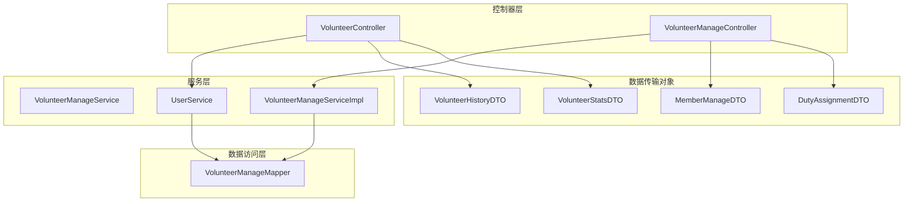
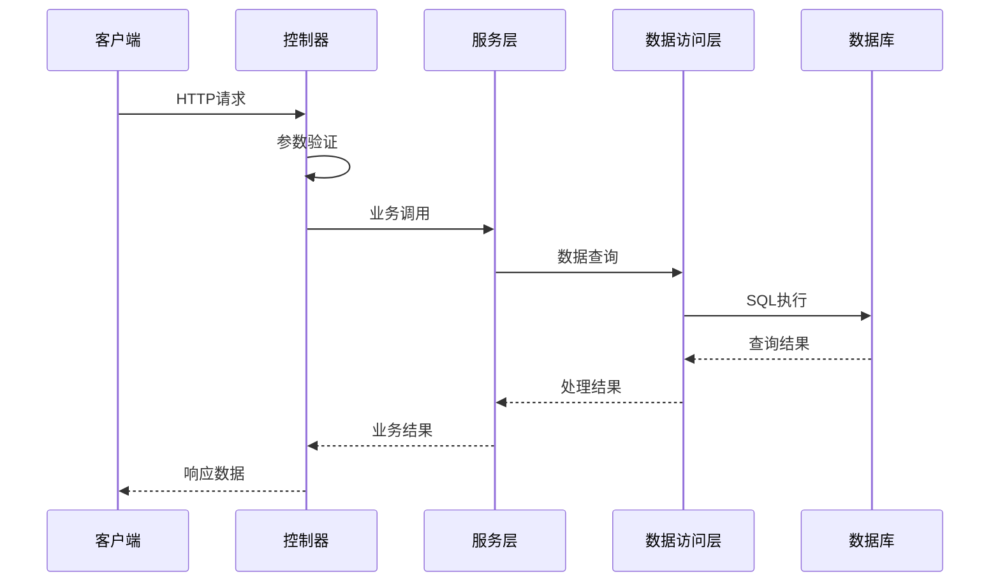
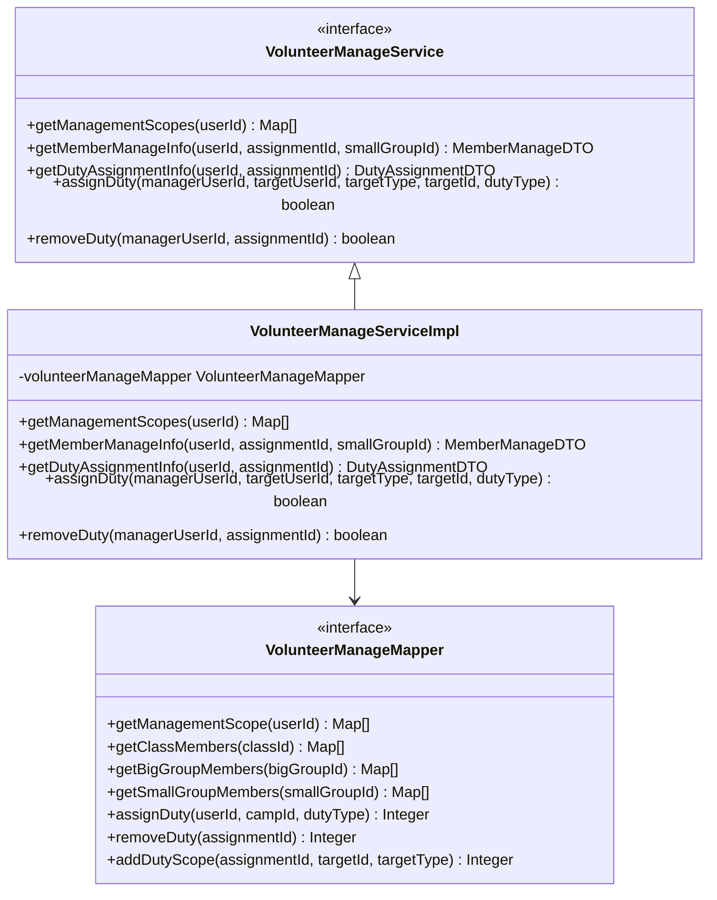
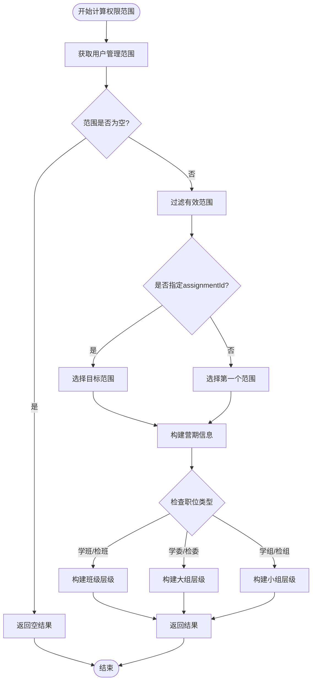
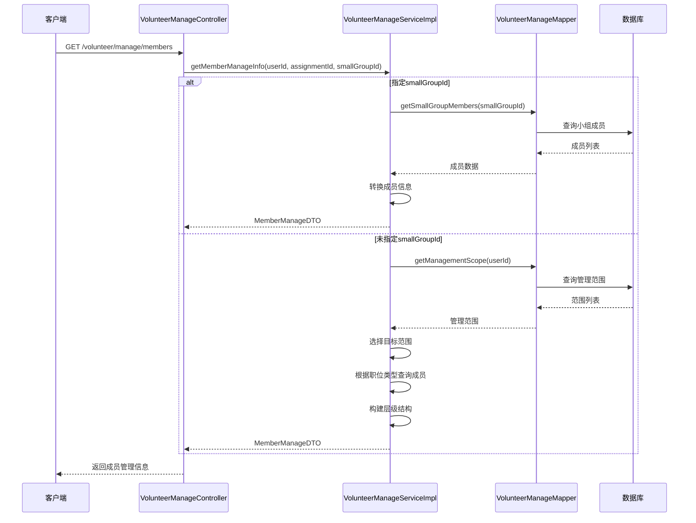
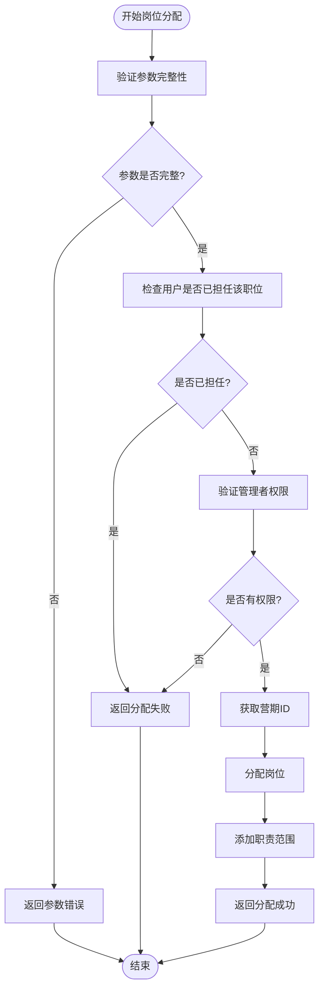
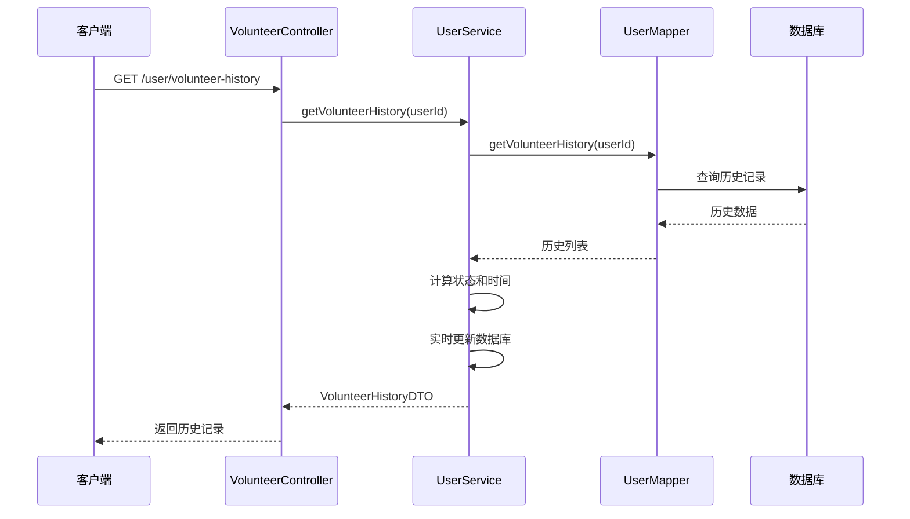
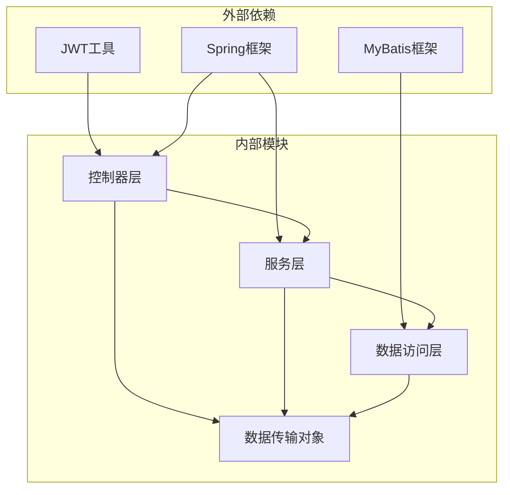

# 志愿者管理模块

<cite>
**本文档引用的文件**
- [VolunteerController.java](file://src/main/java/com/daily/dailychineseculture/controller/VolunteerController.java)
- [VolunteerManageController.java](file://src/main/java/com/daily/dailychineseculture/controller/VolunteerManageController.java)
- [VolunteerManageService.java](file://src/main/java/com/daily/dailychineseculture/service/VolunteerManageService.java)
- [VolunteerManageServiceImpl.java](file://src/main/java/com/daily/dailychineseculture/service/impl/VolunteerManageServiceImpl.java)
- [VolunteerManageMapper.java](file://src/main/java/com/daily/dailychineseculture/mapper/VolunteerManageMapper.java)
- [UserService.java](file://src/main/java/com/daily/dailychineseculture/service/UserService.java)
- [VolunteerHistoryDTO.java](file://src/main/java/com/daily/dailychineseculture/dto/VolunteerHistoryDTO.java)
- [VolunteerStatsDTO.java](file://src/main/java/com/daily/dailychineseculture/dto/VolunteerStatsDTO.java)
- [MemberManageDTO.java](file://src/main/java/com/daily/dailychineseculture/dto/MemberManageDTO.java)
- [DutyAssignmentDTO.java](file://src/main/java/com/daily/dailychineseculture/dto/DutyAssignmentDTO.java)
- [application.yml](file://src/main/resources/application.yml)
- [服务历史统计.md](file://readme/志愿服务模块/服务历史统计.md)
- [权限范围计算.md](file://readme/志愿服务模块/权限范围计算.md)
</cite>

## 目录
1. [简介](#简介)
2. [项目结构](#项目结构)
3. [核心组件](#核心组件)
4. [架构概览](#架构概览)
5. [详细组件分析](#详细组件分析)
6. [依赖关系分析](#依赖关系分析)
7. [性能考虑](#性能考虑)
8. [故障排除指南](#故障排除指南)
9. [结论](#结论)

## 简介

志愿者管理模块是每日中文文化项目中的核心功能模块，主要负责志愿者的职责管理、权限范围计算、成员管理等功能。该模块采用Spring Boot框架构建，使用MyBatis作为ORM框架，实现了完整的志愿者生命周期管理。

模块主要包含两个核心控制器：
- **VolunteerController**：处理志愿者个人相关的接口，包括志愿者历史记录查询和统计信息获取
- **VolunteerManageController**：处理志愿者管理相关的接口，包括权限范围查询、成员管理、岗位分配等

## 项目结构

志愿者管理模块遵循标准的MVC架构模式，采用分层设计：

**图表来源**
- [VolunteerController.java:1-53](file://src/main/java/com/daily/dailychineseculture/controller/VolunteerController.java#L1-L53)
- [VolunteerManageController.java:1-138](file://src/main/java/com/daily/dailychineseculture/controller/VolunteerManageController.java#L1-L138)

**章节来源**
- [VolunteerController.java:1-53](file://src/main/java/com/daily/dailychineseculture/controller/VolunteerController.java#L1-L53)
- [VolunteerManageController.java:1-138](file://src/main/java/com/daily/dailychineseculture/controller/VolunteerManageController.java#L1-L138)

## 核心组件

### 控制器层

#### VolunteerController
负责志愿者个人相关的接口处理：
- `/user/volunteer-history`：获取用户志愿者历史记录
- `/user/volunteer-stats`：获取志愿者统计信息

#### VolunteerManageController  
负责志愿者管理相关的接口处理：
- `/volunteer/scopes`：获取用户管理范围
- `/volunteer/manage/members`：获取管理成员信息
- `/volunteer/manage/duty-assignment`：获取分配岗位信息
- `/volunteer/manage/assign-duty`：分配岗位
- `/volunteer/manage/remove-duty`：移除岗位

### 服务层

#### VolunteerManageService接口
定义了志愿者管理的核心业务接口，包括：
- 获取管理范围
- 获取成员管理信息  
- 获取岗位分配信息
- 分配和移除岗位

#### VolunteerManageServiceImpl实现类
实现了复杂的权限范围计算逻辑，支持多层级组织结构的动态权限计算。

### 数据传输对象

#### VolunteerHistoryDTO
用于志愿者历史记录的数据传输，包含：
- 职责任命ID
- 负责范围
- 职责名称
- 服务时间
- 状态信息

#### MemberManageDTO
用于管理成员信息的数据传输，包含：
- 营期信息
- 班级、大组、小组列表
- 成员信息
- 层级结构

**章节来源**
- [VolunteerController.java:15-53](file://src/main/java/com/daily/dailychineseculture/controller/VolunteerController.java#L15-L53)
- [VolunteerManageController.java:16-138](file://src/main/java/com/daily/dailychineseculture/controller/VolunteerManageController.java#L16-L138)
- [VolunteerManageService.java:11-38](file://src/main/java/com/daily/dailychineseculture/service/VolunteerManageService.java#L11-L38)
- [VolunteerManageServiceImpl.java:17-630](file://src/main/java/com/daily/dailychineseculture/service/impl/VolunteerManageServiceImpl.java#L17-L630)

## 架构概览

志愿者管理模块采用经典的三层架构设计，各层职责清晰分离：

**图表来源**
- [VolunteerController.java:28-52](file://src/main/java/com/daily/dailychineseculture/controller/VolunteerController.java#L28-L52)
- [VolunteerManageController.java:30-137](file://src/main/java/com/daily/dailychineseculture/controller/VolunteerManageController.java#L30-L137)

### 数据流分析

模块的数据流遵循以下模式：
1. **请求接收**：控制器接收HTTP请求，提取JWT令牌
2. **权限验证**：通过JWT工具解析用户ID
3. **业务处理**：服务层执行业务逻辑
4. **数据查询**：数据访问层执行SQL查询
5. **结果返回**：组装DTO对象返回给客户端

**章节来源**
- [VolunteerController.java:28-52](file://src/main/java/com/daily/dailychineseculture/controller/VolunteerController.java#L28-L52)
- [VolunteerManageController.java:30-137](file://src/main/java/com/daily/dailychineseculture/controller/VolunteerManageController.java#L30-L137)

## 详细组件分析

### 权限范围计算组件

权限范围计算是志愿者管理模块的核心功能之一，实现了多层级组织结构的动态权限计算。

**图表来源**
- [VolunteerManageService.java:11-38](file://src/main/java/com/daily/dailychineseculture/service/VolunteerManageService.java#L11-L38)
- [VolunteerManageServiceImpl.java:17-630](file://src/main/java/com/daily/dailychineseculture/service/impl/VolunteerManageServiceImpl.java#L17-L630)
- [VolunteerManageMapper.java:10-189](file://src/main/java/com/daily/dailychineseculture/mapper/VolunteerManageMapper.java#L10-L189)

#### 权限范围计算流程

**图表来源**
- [VolunteerManageServiceImpl.java:24-145](file://src/main/java/com/daily/dailychineseculture/service/impl/VolunteerManageServiceImpl.java#L24-L145)

### 成员管理组件

成员管理组件提供了完整的成员信息查询和层级结构展示功能。

#### 成员信息获取流程

**图表来源**
- [VolunteerManageController.java:47-62](file://src/main/java/com/daily/dailychineseculture/controller/VolunteerManageController.java#L47-L62)
- [VolunteerManageServiceImpl.java:30-145](file://src/main/java/com/daily/dailychineseculture/service/impl/VolunteerManageServiceImpl.java#L30-L145)

### 岗位分配组件

岗位分配组件实现了灵活的志愿者岗位分配和管理功能。

#### 岗位分配流程

**图表来源**
- [VolunteerManageServiceImpl.java:286-380](file://src/main/java/com/daily/dailychineseculture/service/impl/VolunteerManageServiceImpl.java#L286-L380)

**章节来源**
- [VolunteerManageServiceImpl.java:24-380](file://src/main/java/com/daily/dailychineseculture/service/impl/VolunteerManageServiceImpl.java#L24-L380)

### 志愿者历史统计组件

志愿者历史统计组件提供了完整的志愿者服务历史记录和统计功能。

#### 历史记录查询流程

**图表来源**
- [VolunteerController.java:28-37](file://src/main/java/com/daily/dailychineseculture/controller/VolunteerController.java#L28-L37)
- [UserService.java:332-410](file://src/main/java/com/daily/dailychineseculture/service/UserService.java#L332-L410)

**章节来源**
- [VolunteerController.java:28-52](file://src/main/java/com/daily/dailychineseculture/controller/VolunteerController.java#L28-L52)
- [UserService.java:332-475](file://src/main/java/com/daily/dailychineseculture/service/UserService.java#L332-L475)

## 依赖关系分析

志愿者管理模块的依赖关系清晰明确，遵循依赖倒置原则：

**图表来源**
- [VolunteerController.java:6-23](file://src/main/java/com/daily/dailychineseculture/controller/VolunteerController.java#L6-L23)
- [VolunteerManageController.java:6-24](file://src/main/java/com/daily/dailychineseculture/controller/VolunteerManageController.java#L6-L24)

### 关键依赖特性

1. **JWT认证集成**：所有接口都通过JWT令牌进行身份验证
2. **MyBatis持久化**：使用MyBatis进行数据库操作
3. **Spring依赖注入**：通过注解实现依赖注入
4. **DTO模式**：使用DTO进行数据传输，隔离业务模型

**章节来源**
- [VolunteerController.java:6-23](file://src/main/java/com/daily/dailychineseculture/controller/VolunteerController.java#L6-L23)
- [VolunteerManageController.java:6-24](file://src/main/java/com/daily/dailychineseculture/controller/VolunteerManageController.java#L6-L24)

## 性能考虑

### 数据库优化

1. **索引优化**：在`t_duty_assignment`表的`user_id`和`camp_id`字段建立索引
2. **查询优化**：使用`COALESCE`函数减少查询复杂度
3. **缓存策略**：对于频繁访问的权限范围数据考虑添加缓存

### 业务逻辑优化

1. **批量操作**：成员查询支持批量获取，减少数据库往返
2. **条件查询**：根据职位类型动态选择查询路径
3. **延迟加载**：层级结构采用延迟加载策略

### 系统配置

根据应用配置文件，系统使用MySQL数据库，配置了适当的连接参数和文件上传限制。

**章节来源**
- [application.yml:7-33](file://src/main/resources/application.yml#L7-L33)

## 故障排除指南

### 常见问题及解决方案

#### JWT令牌验证失败
- **症状**：所有接口返回认证失败
- **原因**：JWT令牌格式不正确或已过期
- **解决方案**：检查前端传递的Authorization头部格式

#### 权限范围查询为空
- **症状**：`/volunteer/scopes`接口返回空数组
- **原因**：用户当前没有有效的志愿者权限
- **解决方案**：确认用户在当前营期的志愿者状态

#### 岗位分配失败
- **症状**：分配岗位返回失败
- **原因**：用户已担任该职位或没有分配权限
- **解决方案**：检查用户当前的职位状态和管理权限

#### 成员查询异常
- **症状**：成员管理接口抛出异常
- **原因**：数据库连接问题或查询参数错误
- **解决方案**：检查数据库连接配置和查询参数

**章节来源**
- [VolunteerManageController.java:30-137](file://src/main/java/com/daily/dailychineseculture/controller/VolunteerManageController.java#L30-L137)
- [VolunteerController.java:28-52](file://src/main/java/com/daily/dailychineseculture/controller/VolunteerController.java#L28-L52)

## 结论

志愿者管理模块是一个设计合理、功能完善的志愿者管理系统。模块采用了标准的分层架构设计，职责分离清晰，依赖关系明确。主要特点包括：

1. **完整的功能覆盖**：实现了志愿者从注册到退出的完整生命周期管理
2. **灵活的权限控制**：支持多层级组织结构的动态权限计算
3. **良好的扩展性**：采用接口+实现的设计模式，易于功能扩展
4. **完善的错误处理**：各层都有相应的异常处理机制
5. **清晰的代码结构**：遵循了Spring Boot的最佳实践

该模块为每日中文文化项目的志愿者管理工作提供了坚实的技术基础，能够满足当前和未来的发展需求。