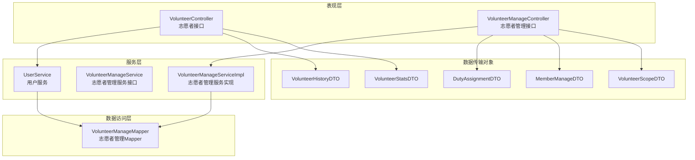
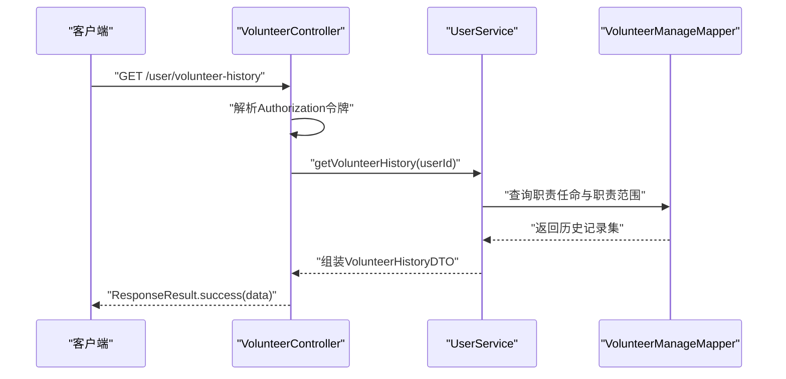
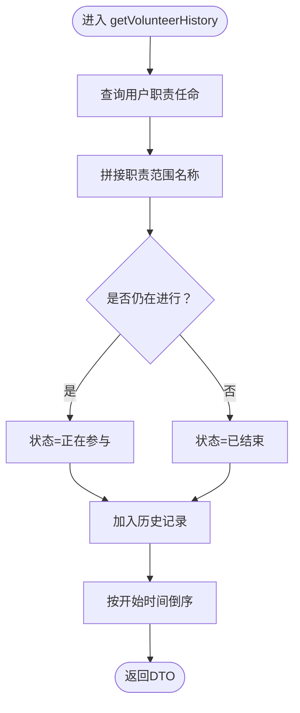
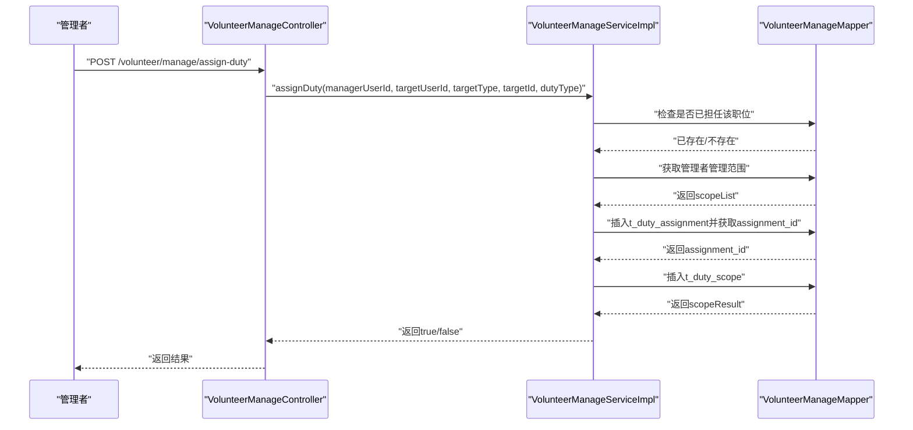
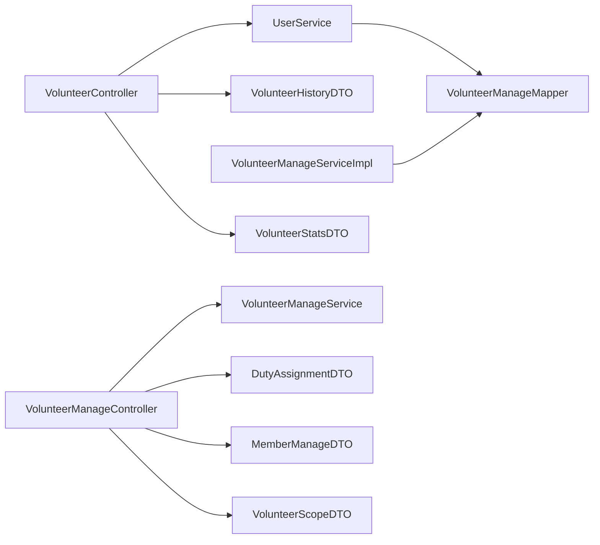

# 志愿者管理模块

<cite>
**本文引用的文件**
- [VolunteerController.java](file://src/main/java/com/daily/dailychineseculture/controller/VolunteerController.java)
- [VolunteerManageController.java](file://src/main/java/com/daily/dailychineseculture/controller/VolunteerManageController.java)
- [VolunteerManageService.java](file://src/main/java/com/daily/dailychineseculture/service/VolunteerManageService.java)
- [VolunteerManageServiceImpl.java](file://src/main/java/com/daily/dailychineseculture/service/impl/VolunteerManageServiceImpl.java)
- [VolunteerManageMapper.java](file://src/main/java/com/daily/dailychineseculture/mapper/VolunteerManageMapper.java)
- [UserService.java](file://src/main/java/com/daily/dailychineseculture/service/UserService.java)
- [VolunteerHistoryDTO.java](file://src/main/java/com/daily/dailychineseculture/dto/VolunteerHistoryDTO.java)
- [VolunteerStatsDTO.java](file://src/main/java/com/daily/dailychineseculture/dto/VolunteerStatsDTO.java)
- [DutyAssignmentDTO.java](file://src/main/java/com/daily/dailychineseculture/dto/DutyAssignmentDTO.java)
- [MemberManageDTO.java](file://src/main/java/com/daily/dailychineseculture/dto/MemberManageDTO.java)
- [VolunteerScopeDTO.java](file://src/main/java/com/daily/dailychineseculture/dto/VolunteerScopeDTO.java)
- [服务历史统计.md](file://readme/志愿服务模块/服务历史统计.md)
- [权限范围计算.md](file://readme/志愿服务模块/权限范围计算.md)
- [PC 端后台管理多角色登录鉴权 API.md](file://doc/PC 端后台管理多角色登录鉴权 API.md)
</cite>

## 目录
1. [简介](#简介)
2. [项目结构](#项目结构)
3. [核心组件](#核心组件)
4. [架构总览](#架构总览)
5. [详细组件分析](#详细组件分析)
6. [依赖关系分析](#依赖关系分析)
7. [性能考虑](#性能考虑)
8. [故障排除指南](#故障排除指南)
9. [结论](#结论)
10. [附录](#附录)

## 简介
本文件系统化梳理志愿者管理模块的完整能力，覆盖志愿者服务记录、历史统计、权限范围计算、岗位分配与移除、成员管理、统计报表与数据分析等。同时结合现有实现，给出时长计算、等级评定与奖励机制的扩展建议，以及志愿者培训、证书颁发与档案管理的落地思路，帮助读者快速理解并高效使用该模块。

## 项目结构
志愿者管理模块采用经典的分层架构：
- 控制器层：对外暴露REST接口，解析请求、校验令牌、调用服务层。
- 服务层：封装业务规则与流程控制，协调Mapper访问数据库。
- 数据访问层：通过MyBatis映射器执行SQL，完成数据持久化与查询。
- DTO层：定义前后端交互的数据结构，保证契约清晰。

图表来源
- [VolunteerController.java:1-78](file://src/main/java/com/daily/dailychineseculture/controller/VolunteerController.java#L1-L78)
- [VolunteerManageController.java:1-137](file://src/main/java/com/daily/dailychineseculture/controller/VolunteerManageController.java#L1-L137)
- [VolunteerManageService.java:1-38](file://src/main/java/com/daily/dailychineseculture/service/VolunteerManageService.java#L1-L38)
- [VolunteerManageServiceImpl.java:1-430](file://src/main/java/com/daily/dailychineseculture/service/impl/VolunteerManageServiceImpl.java#L1-L430)
- [VolunteerManageMapper.java:1-222](file://src/main/java/com/daily/dailychineseculture/mapper/VolunteerManageMapper.java#L1-L222)
- [VolunteerHistoryDTO.java:1-51](file://src/main/java/com/daily/dailychineseculture/dto/VolunteerHistoryDTO.java#L1-L51)
- [VolunteerStatsDTO.java:1-66](file://src/main/java/com/daily/dailychineseculture/dto/VolunteerStatsDTO.java#L1-L66)
- [DutyAssignmentDTO.java:1-72](file://src/main/java/com/daily/dailychineseculture/dto/DutyAssignmentDTO.java#L1-L72)
- [MemberManageDTO.java:1-99](file://src/main/java/com/daily/dailychineseculture/dto/MemberManageDTO.java#L1-L99)
- [VolunteerScopeDTO.java:1-48](file://src/main/java/com/daily/dailychineseculture/dto/VolunteerScopeDTO.java#L1-L48)

章节来源
- [VolunteerController.java:1-78](file://src/main/java/com/daily/dailychineseculture/controller/VolunteerController.java#L1-L78)
- [VolunteerManageController.java:1-137](file://src/main/java/com/daily/dailychineseculture/controller/VolunteerManageController.java#L1-L137)

## 核心组件
- 志愿者控制器：提供服务历史查询、退出担当、统计信息查询等接口。
- 志愿者管理控制器：提供管理范围查询、成员管理、岗位分配与移除等接口。
- 服务接口与实现：封装权限范围计算、成员信息聚合、岗位可分配性判断、分配与移除流程。
- Mapper：提供权限范围查询、成员查询、岗位分配与移除、职责范围添加等SQL。
- DTO：定义历史记录、统计、岗位分配、成员管理等数据结构。

章节来源
- [VolunteerController.java:25-77](file://src/main/java/com/daily/dailychineseculture/controller/VolunteerController.java#L25-L77)
- [VolunteerManageController.java:26-136](file://src/main/java/com/daily/dailychineseculture/controller/VolunteerManageController.java#L26-L136)
- [VolunteerManageService.java:11-38](file://src/main/java/com/daily/dailychineseculture/service/VolunteerManageService.java#L11-L38)
- [VolunteerManageServiceImpl.java:23-357](file://src/main/java/com/daily/dailychineseculture/service/impl/VolunteerManageServiceImpl.java#L23-L357)
- [VolunteerManageMapper.java:15-222](file://src/main/java/com/daily/dailychineseculture/mapper/VolunteerManageMapper.java#L15-L222)
- [VolunteerHistoryDTO.java:10-51](file://src/main/java/com/daily/dailychineseculture/dto/VolunteerHistoryDTO.java#L10-L51)
- [VolunteerStatsDTO.java:10-66](file://src/main/java/com/daily/dailychineseculture/dto/VolunteerStatsDTO.java#L10-L66)
- [DutyAssignmentDTO.java:10-72](file://src/main/java/com/daily/dailychineseculture/dto/DutyAssignmentDTO.java#L10-L72)
- [MemberManageDTO.java:10-99](file://src/main/java/com/daily/dailychineseculture/dto/MemberManageDTO.java#L10-L99)
- [VolunteerScopeDTO.java:10-48](file://src/main/java/com/daily/dailychineseculture/dto/VolunteerScopeDTO.java#L10-L48)

## 架构总览
志愿者管理模块遵循典型的MVC与分层架构，控制器负责请求接入与响应封装，服务层承载业务逻辑，Mapper负责数据访问。整体流程围绕“令牌解析—权限校验—业务处理—数据持久化—结果返回”的闭环展开。

图表来源
- [VolunteerController.java:28-37](file://src/main/java/com/daily/dailychineseculture/controller/VolunteerController.java#L28-L37)
- [UserService.java:395-410](file://src/main/java/com/daily/dailychineseculture/service/UserService.java#L395-L410)
- [VolunteerManageMapper.java:18-47](file://src/main/java/com/daily/dailychineseculture/mapper/VolunteerManageMapper.java#L18-L47)

## 详细组件分析

### 志愿者服务记录与统计
- 服务历史查询：按用户ID查询职责任命，拼接职责范围名称，标注“正在参与/已结束”，并按开始时间倒序。
- 退出担当：校验职责任命归属，更新结束时间为当前时间，保留历史记录用于统计与证书。
- 统计信息：按营期、班级、大组、小组四个维度聚合，支持多维统计与时间线呈现。

图表来源
- [UserService.java:395-410](file://src/main/java/com/daily/dailychineseculture/service/UserService.java#L395-L410)
- [VolunteerController.java:28-37](file://src/main/java/com/daily/dailychineseculture/controller/VolunteerController.java#L28-L37)
- [VolunteerHistoryDTO.java:14-50](file://src/main/java/com/daily/dailychineseculture/dto/VolunteerHistoryDTO.java#L14-L50)

章节来源
- [VolunteerController.java:25-77](file://src/main/java/com/daily/dailychineseculture/controller/VolunteerController.java#L25-L77)
- [UserService.java:395-425](file://src/main/java/com/daily/dailychineseculture/service/UserService.java#L395-L425)
- [VolunteerHistoryDTO.java:10-51](file://src/main/java/com/daily/dailychineseculture/dto/VolunteerHistoryDTO.java#L10-L51)
- [VolunteerStatsDTO.java:10-66](file://src/main/java/com/daily/dailychineseculture/dto/VolunteerStatsDTO.java#L10-L66)
- [服务历史统计.md:1-97](file://readme/志愿服务模块/服务历史统计.md#L1-L97)

### 权限范围计算与管理
- 管理范围查询：根据用户ID查询其当前有效的管理范围，支持多职位、多层级（营期-班级-大组-小组）。
- 成员管理：根据职位类型（学班/检班、学委/检委、学组/检组）加载对应层级成员列表。
- 岗位分配：验证管理者权限、检查目标用户是否已担任同职，插入职责任命并写入职责范围；支持移除岗位（更新结束时间）。

图表来源
- [VolunteerManageController.java:85-110](file://src/main/java/com/daily/dailychineseculture/controller/VolunteerManageController.java#L85-L110)
- [VolunteerManageServiceImpl.java:263-346](file://src/main/java/com/daily/dailychineseculture/service/impl/VolunteerManageServiceImpl.java#L263-L346)
- [VolunteerManageMapper.java:187-207](file://src/main/java/com/daily/dailychineseculture/mapper/VolunteerManageMapper.java#L187-L207)

章节来源
- [VolunteerManageController.java:26-136](file://src/main/java/com/daily/dailychineseculture/controller/VolunteerManageController.java#L26-L136)
- [VolunteerManageService.java:11-38](file://src/main/java/com/daily/dailychineseculture/service/VolunteerManageService.java#L11-L38)
- [VolunteerManageServiceImpl.java:23-357](file://src/main/java/com/daily/dailychineseculture/service/impl/VolunteerManageServiceImpl.java#L23-L357)
- [VolunteerManageMapper.java:15-222](file://src/main/java/com/daily/dailychineseculture/mapper/VolunteerManageMapper.java#L15-L222)
- [DutyAssignmentDTO.java:10-72](file://src/main/java/com/daily/dailychineseculture/dto/DutyAssignmentDTO.java#L10-L72)
- [MemberManageDTO.java:10-99](file://src/main/java/com/daily/dailychineseculture/dto/MemberManageDTO.java#L10-L99)
- [VolunteerScopeDTO.java:10-48](file://src/main/java/com/daily/dailychineseculture/dto/VolunteerScopeDTO.java#L10-L48)
- [权限范围计算.md:1-49](file://readme/志愿服务模块/权限范围计算.md#L1-L49)

### 类关系图（代码级）

```mermaid
classDiagram
class VolunteerController {
+getVolunteerHistory(token)
+quitVolunteerDuty(token, request)
+getVolunteerStats(token)
}
class VolunteerManageController {
+getManagementScopes(token)
+getMemberManageInfo(token, assignmentId)
+getDutyAssignmentInfo(token, assignmentId)
+assignDuty(token, request)
+removeDuty(token, request)
}
class VolunteerManageService {
<<interface>>
+getManagementScopes(userId)
+getMemberManageInfo(userId, assignmentId)
+getDutyAssignmentInfo(userId, assignmentId)
+assignDuty(managerUserId, targetUserId, targetType, targetId, dutyType)
+removeDuty(managerUserId, assignmentId)
}
class VolunteerManageServiceImpl {
+getManagementScopes(userId)
+getMemberManageInfo(userId, assignmentId)
+getDutyAssignmentInfo(userId, assignmentId)
+assignDuty(managerUserId, targetUserId, targetType, targetId, dutyType)
+removeDuty(managerUserId, assignmentId)
}
class VolunteerManageMapper {
+getManagementScope(userId)
+getClassMembers(classId)
+getBigGroupMembers(bigGroupId)
+getSmallGroupMembers(smallGroupId)
+getCurrentVolunteers(targetType, targetId)
+getAssignableBigGroups(classId)
+getAssignableSmallGroups(bigGroupId)
+assignDuty(userId, campId, dutyType)
+removeDuty(assignmentId)
+addDutyScope(assignmentId, targetId, targetType)
+getLastInsertId()
}
VolunteerController --> UserService : "依赖"
VolunteerManageController --> VolunteerManageService : "依赖"
VolunteerManageService <|.. VolunteerManageServiceImpl : "实现"
VolunteerManageServiceImpl --> VolunteerManageMapper : "调用"
```

图表来源
- [VolunteerController.java:15-78](file://src/main/java/com/daily/dailychineseculture/controller/VolunteerController.java#L15-L78)
- [VolunteerManageController.java:16-137](file://src/main/java/com/daily/dailychineseculture/controller/VolunteerManageController.java#L16-L137)
- [VolunteerManageService.java:8-38](file://src/main/java/com/daily/dailychineseculture/service/VolunteerManageService.java#L8-L38)
- [VolunteerManageServiceImpl.java:17-430](file://src/main/java/com/daily/dailychineseculture/service/impl/VolunteerManageServiceImpl.java#L17-L430)
- [VolunteerManageMapper.java:12-222](file://src/main/java/com/daily/dailychineseculture/mapper/VolunteerManageMapper.java#L12-L222)

## 依赖关系分析
- 控制器到服务：VolunteerController与VolunteerManageController分别依赖UserService与VolunteerManageService。
- 服务到Mapper：VolunteerManageServiceImpl与UserService均依赖VolunteerManageMapper执行数据库操作。
- DTO到控制器：控制器返回VolunteerHistoryDTO、VolunteerStatsDTO、DutyAssignmentDTO、MemberManageDTO等。

图表来源
- [VolunteerController.java:19-23](file://src/main/java/com/daily/dailychineseculture/controller/VolunteerController.java#L19-L23)
- [VolunteerManageController.java:20-24](file://src/main/java/com/daily/dailychineseculture/controller/VolunteerManageController.java#L20-L24)
- [VolunteerManageService.java:11-38](file://src/main/java/com/daily/dailychineseculture/service/VolunteerManageService.java#L11-L38)
- [VolunteerManageServiceImpl.java:20-21](file://src/main/java/com/daily/dailychineseculture/service/impl/VolunteerManageServiceImpl.java#L20-L21)
- [VolunteerManageMapper.java:18-47](file://src/main/java/com/daily/dailychineseculture/mapper/VolunteerManageMapper.java#L18-L47)

章节来源
- [VolunteerController.java:19-23](file://src/main/java/com/daily/dailychineseculture/controller/VolunteerController.java#L19-L23)
- [VolunteerManageController.java:20-24](file://src/main/java/com/daily/dailychineseculture/controller/VolunteerManageController.java#L20-L24)
- [VolunteerManageServiceImpl.java:20-21](file://src/main/java/com/daily/dailychineseculture/service/impl/VolunteerManageServiceImpl.java#L20-L21)
- [VolunteerManageMapper.java:18-47](file://src/main/java/com/daily/dailychineseculture/mapper/VolunteerManageMapper.java#L18-L47)

## 性能考虑
- SQL优化：权限范围查询与成员查询涉及多表关联，建议在t_duty_assignment、t_duty_scope、t_camp等关键字段建立索引，避免全表扫描。
- 分页与缓存：成员列表与岗位可分配性查询可引入分页；热点数据（如管理范围）可短期缓存，降低重复查询开销。
- 事务一致性：岗位分配涉及插入t_duty_assignment与t_duty_scope，应置于同一事务，确保数据一致性。
- DTO序列化：大量成员信息返回时，注意DTO字段精简与延迟加载策略，减少网络传输与序列化成本。

## 故障排除指南
- 令牌解析失败：检查Authorization头格式与JWT签名有效性，确认登录角色与权限匹配。
- 职责任命不存在：退出担当前校验assignmentId归属，避免跨用户操作。
- 岗位已存在：分配前检查目标用户是否已担任同职，避免重复任命。
- 权限不足：管理者仅能分配下一级别岗位（如班级管理者可分配大组/小组岗位，大组管理者仅可分配小组岗位）。

章节来源
- [VolunteerController.java:42-62](file://src/main/java/com/daily/dailychineseculture/controller/VolunteerController.java#L42-L62)
- [VolunteerManageController.java:85-136](file://src/main/java/com/daily/dailychineseculture/controller/VolunteerManageController.java#L85-L136)
- [VolunteerManageServiceImpl.java:275-314](file://src/main/java/com/daily/dailychineseculture/service/impl/VolunteerManageServiceImpl.java#L275-L314)
- [VolunteerManageMapper.java:171-182](file://src/main/java/com/daily/dailychineseculture/mapper/VolunteerManageMapper.java#L171-L182)

## 结论
志愿者管理模块以清晰的分层设计实现了服务记录、权限范围计算、成员管理与岗位分配等核心能力。通过令牌解析与权限校验保障安全性，通过DTO契约提升前后端协作效率。建议后续在时长计算、等级评定与奖励机制方面引入更完善的统计模型，并在培训、证书与档案管理方面扩展数据模型与流程。

## 附录

### 志愿者服务时长计算、等级评定与奖励机制（扩展建议）
- 时长计算：基于t_duty_assignment的volunteer_start_time与volunteer_end_time（或当前时间）计算小时/天数，支持按营期、班级、大组、小组维度统计。
- 等级评定：结合服务时长、参与营期数量、岗位职责复杂度等指标，设定阈值与等级映射规则。
- 奖励机制：达到等级阈值后发放徽章/证书，或在统计页面展示荣誉标识。

### 志愿者管理后台功能清单
- 人员管理：查看成员列表、搜索用户、批量导入导出。
- 服务监督：实时监控各层级服务状态、超时提醒、异常预警。
- 绩效评估：按维度生成绩效报表，支持导出与分享。

### 志愿者数据操作示例（接口与流程）
- 查询服务历史：GET /user/volunteer-history（需Authorization）
- 退出担当：POST /user/volunteer-quit（需assignmentId）
- 获取统计：GET /user/volunteer-stats（需Authorization）
- 获取管理范围：GET /volunteer/scopes（需Authorization）
- 获取成员信息：GET /volunteer/manage/members（可选assignmentId）
- 获取岗位分配信息：GET /volunteer/manage/duty-assignment（可选assignmentId）
- 分配岗位：POST /volunteer/manage/assign-duty（需完整参数）
- 移除岗位：POST /volunteer/manage/remove-duty（需assignmentId）

章节来源
- [VolunteerController.java:28-77](file://src/main/java/com/daily/dailychineseculture/controller/VolunteerController.java#L28-L77)
- [VolunteerManageController.java:29-136](file://src/main/java/com/daily/dailychineseculture/controller/VolunteerManageController.java#L29-L136)
- [PC 端后台管理多角色登录鉴权 API.md:61-158](file://doc/PC 端后台管理多角色登录鉴权 API.md#L61-L158)