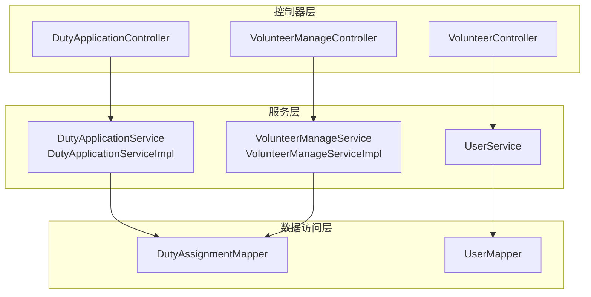
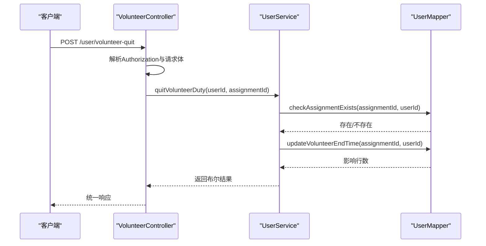
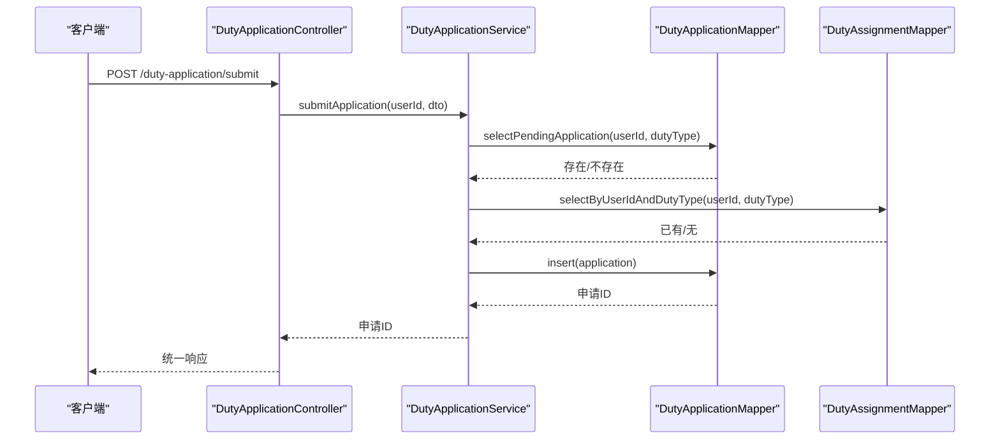
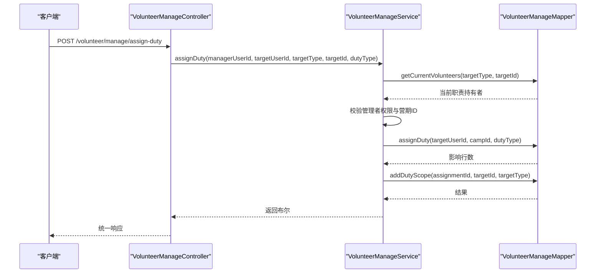
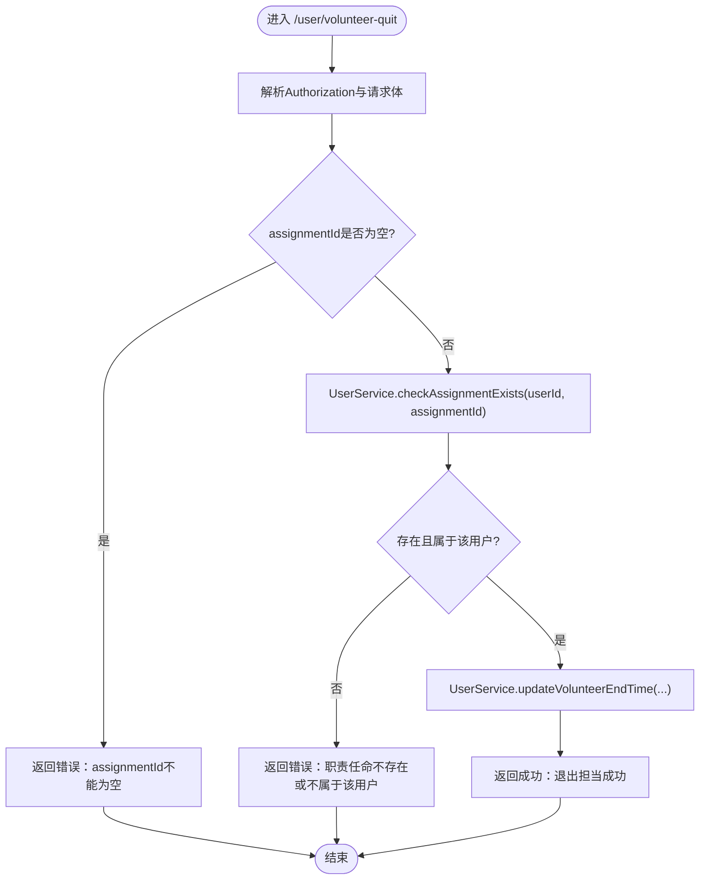
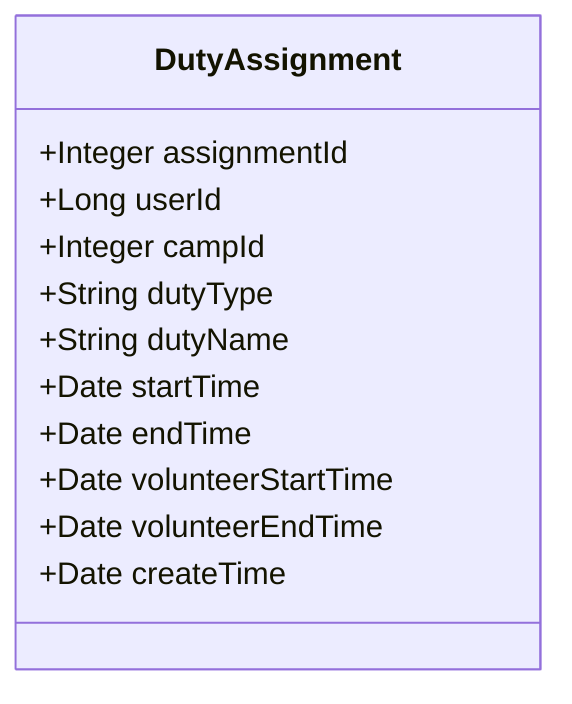
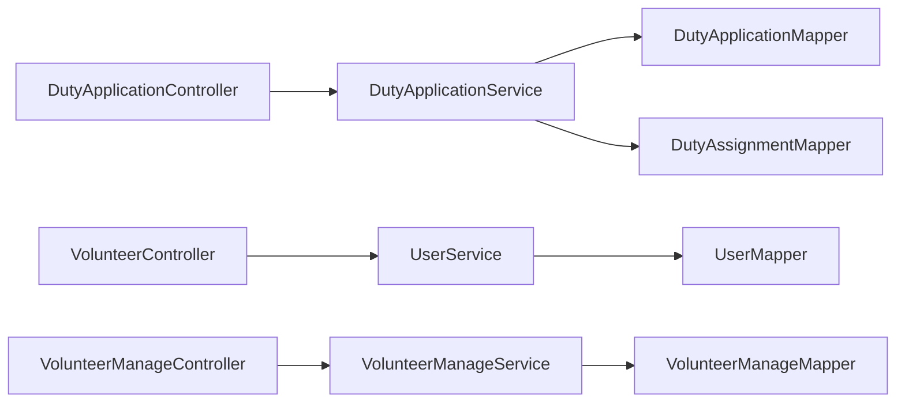

# 志愿者职责管理

<cite>
**本文引用的文件**
- [DutyApplicationController.java](file://src/main/java/com/daily/dailychineseculture/controller/DutyApplicationController.java)
- [VolunteerController.java](file://src/main/java/com/daily/dailychineseculture/controller/VolunteerController.java)
- [VolunteerManageController.java](file://src/main/java/com/daily/dailychineseculture/controller/VolunteerManageController.java)
- [DutyApplicationService.java](file://src/main/java/com/daily/dailychineseculture/service/DutyApplicationService.java)
- [DutyApplicationServiceImpl.java](file://src/main/java/com/daily/dailychineseculture/service/impl/DutyApplicationServiceImpl.java)
- [VolunteerManageService.java](file://src/main/java/com/daily/dailychineseculture/service/VolunteerManageService.java)
- [VolunteerManageServiceImpl.java](file://src/main/java/com/daily/dailychineseculture/service/impl/VolunteerManageServiceImpl.java)
- [UserService.java](file://src/main/java/com/daily/dailychineseculture/service/UserService.java)
- [DutyAssignment.java](file://src/main/java/com/daily/dailychineseculture/entity/DutyAssignment.java)
- [DutyApplication.java](file://src/main/java/com/daily/dailychineseculture/entity/DutyApplication.java)
- [DutyAssignmentDTO.java](file://src/main/java/com/daily/dailychineseculture/dto/DutyAssignmentDTO.java)
- [DutyApplicationSubmitDTO.java](file://src/main/java/com/daily/dailychineseculture/dto/DutyApplicationSubmitDTO.java)
- [VolunteerHistoryDTO.java](file://src/main/java/com/daily/dailychineseculture/dto/VolunteerHistoryDTO.java)
- [DutyAssignmentMapper.java](file://src/main/java/com/daily/dailychineseculture/mapper/DutyAssignmentMapper.java)
- [UserMapper.java](file://src/main/java/com/daily/dailychineseculture/mapper/UserMapper.java)
</cite>

## 目录
1. [简介](#简介)
2. [项目结构](#项目结构)
3. [核心组件](#核心组件)
4. [架构总览](#架构总览)
5. [详细组件分析](#详细组件分析)
6. [依赖关系分析](#依赖关系分析)
7. [性能考量](#性能考量)
8. [故障排查指南](#故障排查指南)
9. [结论](#结论)
10. [附录](#附录)

## 简介
本文件围绕志愿者职责管理功能，系统阐述职责分配、开始服务、结束服务的完整流程；详解职责退出机制（POST /user/volunteer-quit）的参数校验、权限检查与状态更新逻辑；剖析职责管理的数据模型（DutyAssignment 实体）及业务规则；说明职责冲突检测机制（时间重叠、角色权限、资源限制）；并给出职责申请、审批、服务记录更新等操作示例，以及与课程管理、营期管理的联动关系。

## 项目结构
志愿者职责管理涉及控制器、服务层、数据访问层与数据传输对象，采用典型的分层架构：
- 控制器层：处理 HTTP 请求，解析头部与请求体，调用服务层并封装响应。
- 服务层：实现业务逻辑，包含职责申请防重、权限校验、职责分配与移除、志愿者统计与历史查询、退出服务等。
- 数据访问层：通过 Mapper 接口执行数据库操作，提供职责分配、申请、用户历史与统计查询等能力。
- 数据传输对象：封装请求与响应数据结构，确保前后端契约清晰。

**图表来源**
- [DutyApplicationController.java:14-74](file://src/main/java/com/daily/dailychineseculture/controller/DutyApplicationController.java#L14-L74)
- [VolunteerController.java:15-78](file://src/main/java/com/daily/dailychineseculture/controller/VolunteerController.java#L15-L78)
- [VolunteerManageController.java:16-137](file://src/main/java/com/daily/dailychineseculture/controller/VolunteerManageController.java#L16-L137)
- [DutyApplicationServiceImpl.java:15-55](file://src/main/java/com/daily/dailychineseculture/service/impl/DutyApplicationServiceImpl.java#L15-L55)
- [VolunteerManageServiceImpl.java:17-430](file://src/main/java/com/daily/dailychineseculture/service/impl/VolunteerManageServiceImpl.java#L17-L430)
- [UserService.java:22-959](file://src/main/java/com/daily/dailychineseculture/service/UserService.java#L22-L959)
- [DutyAssignmentMapper.java:13-96](file://src/main/java/com/daily/dailychineseculture/mapper/DutyAssignmentMapper.java#L13-L96)
- [UserMapper.java:12-252](file://src/main/java/com/daily/dailychineseculture/mapper/UserMapper.java#L12-L252)

**章节来源**
- [DutyApplicationController.java:14-74](file://src/main/java/com/daily/dailychineseculture/controller/DutyApplicationController.java#L14-L74)
- [VolunteerController.java:15-78](file://src/main/java/com/daily/dailychineseculture/controller/VolunteerController.java#L15-L78)
- [VolunteerManageController.java:16-137](file://src/main/java/com/daily/dailychineseculture/controller/VolunteerManageController.java#L16-L137)

## 核心组件
- 职责申请控制器：接收权限申请，解析 Authorization 头部，调用服务层提交申请并返回统一响应。
- 志愿者控制器：提供志愿者历史查询、退出服务、统计信息查询等接口。
- 志愿者管理控制器：提供管理范围查询、成员信息查询、岗位分配与移除等管理接口。
- 服务实现：
  - DutyApplicationServiceImpl：实现双重防重校验（待审重复、已授权重复），通过 Mapper 写入申请记录。
  - VolunteerManageServiceImpl：根据管理范围动态生成可分配岗位，执行分配与移除，维护职责范围映射。
  - UserService：实现志愿者历史聚合与实时更新、退出服务、统计信息汇总等。
- 数据模型：
  - DutyAssignment：职责分配实体，包含用户、营期、职责类型、任职与志愿服务时间等字段。
  - DutyApplication：职责申请实体，包含申请状态、类型、理由等。
  - DTO：职责分配视图、申请提交 DTO、志愿者历史 DTO 等。

**章节来源**
- [DutyApplicationService.java:8-21](file://src/main/java/com/daily/dailychineseculture/service/DutyApplicationService.java#L8-L21)
- [DutyApplicationServiceImpl.java:15-55](file://src/main/java/com/daily/dailychineseculture/service/impl/DutyApplicationServiceImpl.java#L15-L55)
- [VolunteerManageService.java:11-38](file://src/main/java/com/daily/dailychineseculture/service/VolunteerManageService.java#L11-L38)
- [VolunteerManageServiceImpl.java:17-430](file://src/main/java/com/daily/dailychineseculture/service/impl/VolunteerManageServiceImpl.java#L17-L430)
- [UserService.java:22-959](file://src/main/java/com/daily/dailychineseculture/service/UserService.java#L22-L959)
- [DutyAssignment.java:10-64](file://src/main/java/com/daily/dailychineseculture/entity/DutyAssignment.java#L10-L64)
- [DutyApplication.java:11-56](file://src/main/java/com/daily/dailychineseculture/entity/DutyApplication.java#L11-L56)
- [DutyAssignmentDTO.java:9-72](file://src/main/java/com/daily/dailychineseculture/dto/DutyAssignmentDTO.java#L9-L72)
- [DutyApplicationSubmitDTO.java:10-26](file://src/main/java/com/daily/dailychineseculture/dto/DutyApplicationSubmitDTO.java#L10-L26)
- [VolunteerHistoryDTO.java:9-51](file://src/main/java/com/daily/dailychineseculture/dto/VolunteerHistoryDTO.java#L9-L51)

## 架构总览
职责管理遵循“控制器-服务-数据访问”的分层设计，职责分配与申请通过 Mapper 直接读写数据库，服务层负责业务规则与权限校验，控制器负责请求解析与响应封装。

**图表来源**
- [VolunteerController.java:42-62](file://src/main/java/com/daily/dailychineseculture/controller/VolunteerController.java#L42-L62)
- [UserService.java:414-425](file://src/main/java/com/daily/dailychineseculture/service/UserService.java#L414-L425)
- [UserMapper.java:150-156](file://src/main/java/com/daily/dailychineseculture/mapper/UserMapper.java#L150-L156)

## 详细组件分析

### 职责申请与审批流程
职责申请由前端提交，控制器解析 Authorization 头部与请求体，调用服务层执行双重防重校验后再入库。

- 参数校验：请求体 DTO 对 dutyType 与 applyReason 进行非空校验。
- 防重复申请：同一用户对同一职责类型的待审核申请不可重复提交。
- 防重复授权：若用户已拥有该职责类型权限，则拒绝重复申请。
- 审批状态：申请创建时强制置为“待审核”。

**图表来源**
- [DutyApplicationController.java:51-72](file://src/main/java/com/daily/dailychineseculture/controller/DutyApplicationController.java#L51-L72)
- [DutyApplicationServiceImpl.java:24-53](file://src/main/java/com/daily/dailychineseculture/service/impl/DutyApplicationServiceImpl.java#L24-L53)
- [DutyApplicationSubmitDTO.java:10-26](file://src/main/java/com/daily/dailychineseculture/dto/DutyApplicationSubmitDTO.java#L10-L26)
- [DutyAssignmentMapper.java:23-42](file://src/main/java/com/daily/dailychineseculture/mapper/DutyAssignmentMapper.java#L23-L42)

**章节来源**
- [DutyApplicationController.java:51-72](file://src/main/java/com/daily/dailychineseculture/controller/DutyApplicationController.java#L51-L72)
- [DutyApplicationServiceImpl.java:24-53](file://src/main/java/com/daily/dailychineseculture/service/impl/DutyApplicationServiceImpl.java#L24-L53)
- [DutyApplicationSubmitDTO.java:10-26](file://src/main/java/com/daily/dailychineseculture/dto/DutyApplicationSubmitDTO.java#L10-L26)
- [DutyAssignmentMapper.java:23-42](file://src/main/java/com/daily/dailychineseculture/mapper/DutyAssignmentMapper.java#L23-L42)

### 职责分配与管理
管理员通过志愿者管理控制器进行职责分配与移除，服务层根据管理范围判断权限并维护职责范围映射。

- 权限检查：仅班级管理者可分配大组/小组岗位；大组管理者仅可分配小组岗位；小组管理者无分配权限。
- 资源限制：若目标岗位已被占用，拒绝重复分配。
- 职责范围：分配成功后写入职责范围映射，确保后续查询与统计准确。

**图表来源**
- [VolunteerManageController.java:85-110](file://src/main/java/com/daily/dailychineseculture/controller/VolunteerManageController.java#L85-L110)
- [VolunteerManageServiceImpl.java:263-346](file://src/main/java/com/daily/dailychineseculture/service/impl/VolunteerManageServiceImpl.java#L263-L346)

**章节来源**
- [VolunteerManageController.java:85-110](file://src/main/java/com/daily/dailychineseculture/controller/VolunteerManageController.java#L85-L110)
- [VolunteerManageServiceImpl.java:263-346](file://src/main/java/com/daily/dailychineseculture/service/impl/VolunteerManageServiceImpl.java#L263-L346)

### 职责退出机制（POST /user/volunteer-quit）
职责退出由志愿者本人发起，控制器解析 Authorization 与请求体，服务层执行权限校验与状态更新。

- 参数校验：assignmentId 必填。
- 权限检查：仅当 assignmentId 与 userId 匹配且存在时才允许退出。
- 状态更新：将 volunteer_end_time 更新为当前时间，标记服务结束。

**图表来源**
- [VolunteerController.java:42-62](file://src/main/java/com/daily/dailychineseculture/controller/VolunteerController.java#L42-L62)
- [UserService.java:414-425](file://src/main/java/com/daily/dailychineseculture/service/UserService.java#L414-L425)
- [UserMapper.java:150-156](file://src/main/java/com/daily/dailychineseculture/mapper/UserMapper.java#L150-L156)

**章节来源**
- [VolunteerController.java:42-62](file://src/main/java/com/daily/dailychineseculture/controller/VolunteerController.java#L42-L62)
- [UserService.java:414-425](file://src/main/java/com/daily/dailychineseculture/service/UserService.java#L414-L425)
- [UserMapper.java:150-156](file://src/main/java/com/daily/dailychineseculture/mapper/UserMapper.java#L150-L156)

### 数据模型与业务规则（DutyAssignment）
DutyAssignment 是职责分配的核心实体，承载用户、营期、职责类型与服务时间等关键字段。

- 字段说明：
  - assignmentId：主键，唯一标识一次职责任命。
  - userId：职责归属用户。
  - campId：所属营期；全局管理员可为空。
  - dutyType/dutyName：职责类型与名称。
  - startTime/endTime：任职起止时间；end_time 为空表示永久有效。
  - volunteerStartTime/volunteerEndTime：志愿服务起止时间；用于服务记录与统计。
  - createTime：创建时间。
- 业务规则：
  - 有效期内的职责才计入权限；end_time 为空或晚于当前时间视为有效。
  - 服务时间优先级：主动退出时间 > 营期结束时间 > 当前日期（正在参与）。

**图表来源**
- [DutyAssignment.java:10-64](file://src/main/java/com/daily/dailychineseculture/entity/DutyAssignment.java#L10-L64)

**章节来源**
- [DutyAssignment.java:10-64](file://src/main/java/com/daily/dailychineseculture/entity/DutyAssignment.java#L10-L64)
- [UserMapper.java:78-129](file://src/main/java/com/daily/dailychineseculture/mapper/UserMapper.java#L78-L129)

### 职责冲突检测机制
- 时间重叠检查：通过查询当前有效职责（end_time 为空或晚于当前时间）与目标岗位的当前持有者，避免重复分配。
- 角色权限验证：根据管理者的管理范围判断其是否具备分配权限（班级管理者可分配大组/小组岗位；大组管理者仅可分配小组岗位）。
- 资源限制控制：同一岗位在同一层级不可重复分配，防止资源冲突。

**章节来源**
- [VolunteerManageServiceImpl.java:275-346](file://src/main/java/com/daily/dailychineseculture/service/impl/VolunteerManageServiceImpl.java#L275-L346)
- [DutyAssignmentMapper.java:23-42](file://src/main/java/com/daily/dailychineseculture/mapper/DutyAssignmentMapper.java#L23-L42)

### 操作示例
- 职责申请与审批：
  - 前端提交申请（dutyType、applyReason），控制器解析后调用服务层，服务层进行双重防重校验并通过 Mapper 写入申请记录。
  - 审核流程：申请创建后处于“待审核”状态，后续由管理员在后台进行处理。
- 服务开始与结束：
  - 服务开始：职责分配成功后，系统记录 volunteerStartTime；若营期结束而志愿者未主动退出，系统会将 volunteer_end_time 更新为营期结束时间。
  - 服务结束：志愿者主动退出时，调用 /user/volunteer-quit，系统校验后更新 volunteer_end_time。
- 统计与历史：
  - 志愿者历史：按职责分配聚合服务时间段，结合营期结束与退出时间动态计算最终状态。
  - 统计信息：按营期、班级、大组、小组维度统计志愿者负责范围。

**章节来源**
- [DutyApplicationController.java:51-72](file://src/main/java/com/daily/dailychineseculture/controller/DutyApplicationController.java#L51-L72)
- [UserService.java:332-410](file://src/main/java/com/daily/dailychineseculture/service/UserService.java#L332-L410)
- [VolunteerController.java:28-62](file://src/main/java/com/daily/dailychineseculture/controller/VolunteerController.java#L28-L62)

### 与其他模块的集成关系
- 与营期管理联动：
  - 职责分配关联营期（campId），退出服务时若营期已结束，系统会将服务结束时间更新为营期结束时间。
  - 统计信息按营期维度聚合，确保志愿者参与范围与营期生命周期一致。
- 与课程管理联动：
  - 班级管理者可对大组与小组进行职责分配，形成“营期-班级-大组-小组”的四级职责体系，便于课程组织与管理。
  - 分班完成后，志愿者可在相应层级承担职责，实现职责与课程组织的自然衔接。

**章节来源**
- [UserMapper.java:78-129](file://src/main/java/com/daily/dailychineseculture/mapper/UserMapper.java#L78-L129)
- [VolunteerManageServiceImpl.java:159-261](file://src/main/java/com/daily/dailychineseculture/service/impl/VolunteerManageServiceImpl.java#L159-L261)

## 依赖关系分析
职责管理模块内部依赖清晰，控制器仅负责编排，服务层承担业务规则，Mapper 负责数据持久化。

**图表来源**
- [DutyApplicationController.java:14-74](file://src/main/java/com/daily/dailychineseculture/controller/DutyApplicationController.java#L14-L74)
- [VolunteerController.java:15-78](file://src/main/java/com/daily/dailychineseculture/controller/VolunteerController.java#L15-L78)
- [VolunteerManageController.java:16-137](file://src/main/java/com/daily/dailychineseculture/controller/VolunteerManageController.java#L16-L137)
- [DutyApplicationServiceImpl.java:15-55](file://src/main/java/com/daily/dailychineseculture/service/impl/DutyApplicationServiceImpl.java#L15-L55)
- [VolunteerManageServiceImpl.java:17-430](file://src/main/java/com/daily/dailychineseculture/service/impl/VolunteerManageServiceImpl.java#L17-L430)
- [UserService.java:22-959](file://src/main/java/com/daily/dailychineseculture/service/UserService.java#L22-L959)
- [DutyAssignmentMapper.java:13-96](file://src/main/java/com/daily/dailychineseculture/mapper/DutyAssignmentMapper.java#L13-L96)
- [UserMapper.java:12-252](file://src/main/java/com/daily/dailychineseculture/mapper/UserMapper.java#L12-L252)

**章节来源**
- [DutyApplicationServiceImpl.java:15-55](file://src/main/java/com/daily/dailychineseculture/service/impl/DutyApplicationServiceImpl.java#L15-L55)
- [VolunteerManageServiceImpl.java:17-430](file://src/main/java/com/daily/dailychineseculture/service/impl/VolunteerManageServiceImpl.java#L17-L430)
- [UserService.java:22-959](file://src/main/java/com/daily/dailychineseculture/service/UserService.java#L22-L959)

## 性能考量
- 查询优化：职责历史与统计查询通过 LEFT JOIN 与条件过滤减少不必要的数据扫描；建议在 t_duty_assignment、t_duty_scope、t_camp 等关键字段建立索引以提升联表查询性能。
- 写入优化：职责分配与退出服务均为单表更新，SQL 简洁；批量操作建议使用事务包裹，确保一致性与原子性。
- 缓存策略：对于频繁访问的管理范围与职责映射，可考虑引入缓存降低数据库压力（需注意数据一致性）。

## 故障排查指南
- 职责申请失败：
  - 检查是否存在待审核的同类申请；若存在，提示“请勿重复提交”。
  - 检查用户是否已拥有该职责类型权限；若已拥有，提示“无需重复申请”。
- 职责分配失败：
  - 确认管理者是否具备对应层级的分配权限；若无权限，返回“无权限分配该岗位”。
  - 确认目标岗位是否已被占用；若已占用，返回“岗位已被占用”。
- 退出服务失败：
  - 检查 assignmentId 与 userId 是否匹配；若不匹配，返回“职责任命不存在或不属于该用户”。
  - 确认数据库更新是否成功；若失败，检查日志定位异常。

**章节来源**
- [DutyApplicationServiceImpl.java:28-40](file://src/main/java/com/daily/dailychineseculture/service/impl/DutyApplicationServiceImpl.java#L28-L40)
- [VolunteerManageServiceImpl.java:275-346](file://src/main/java/com/daily/dailychineseculture/service/impl/VolunteerManageServiceImpl.java#L275-L346)
- [VolunteerController.java:49-61](file://src/main/java/com/daily/dailychineseculture/controller/VolunteerController.java#L49-L61)

## 结论
志愿者职责管理通过清晰的分层架构与严格的业务规则，实现了职责申请、分配、服务记录与退出的闭环管理。系统在权限校验、冲突检测与历史统计方面具备良好扩展性，能够与营期与课程管理模块协同工作，支撑复杂的组织与服务场景。

## 附录
- 关键接口一览：
  - 提交职责申请：POST /duty-application/submit
  - 退出担当：POST /user/volunteer-quit
  - 获取志愿者历史：GET /user/volunteer-history
  - 获取志愿者统计：GET /user/volunteer-stats
  - 获取管理范围：GET /volunteer/scopes
  - 获取成员信息：GET /volunteer/manage/members
  - 获取分配岗位信息：GET /volunteer/manage/duty-assignment
  - 分配岗位：POST /volunteer/manage/assign-duty
  - 移除岗位：POST /volunteer/manage/remove-duty