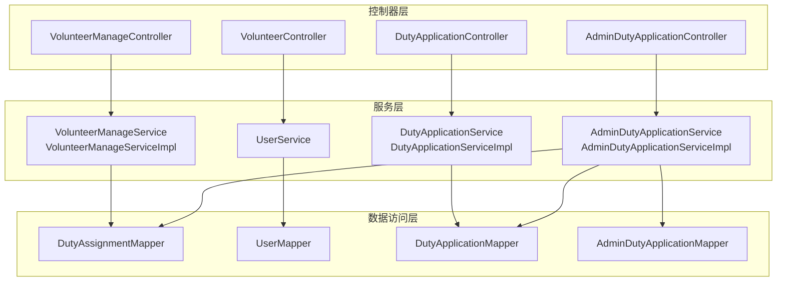
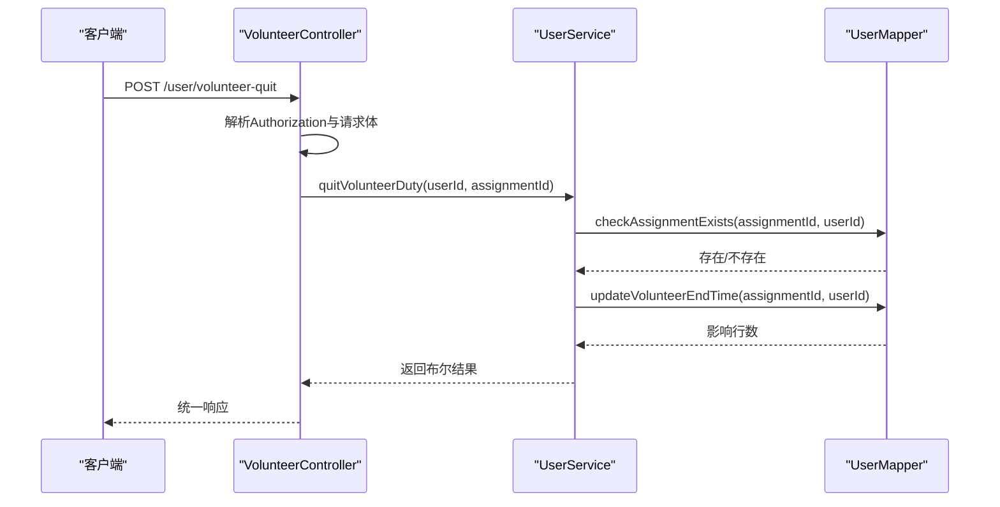
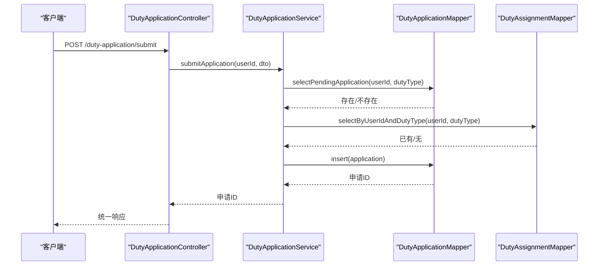
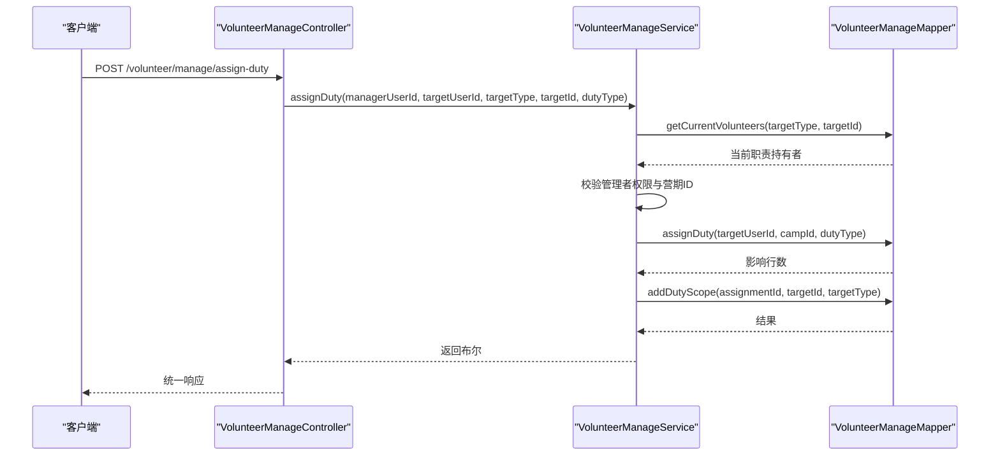
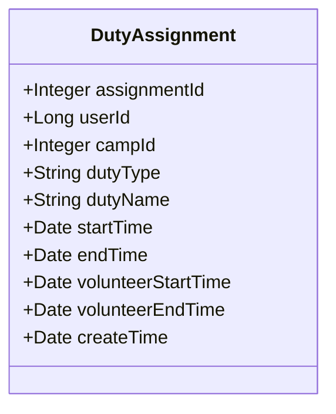
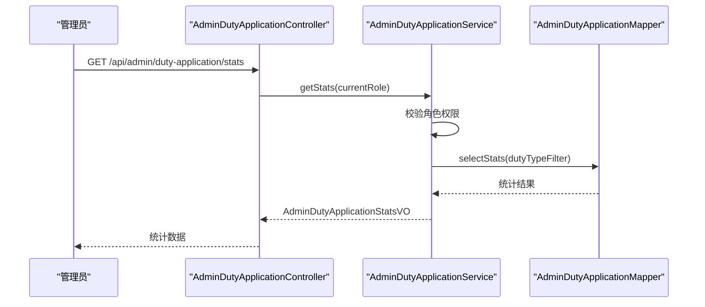
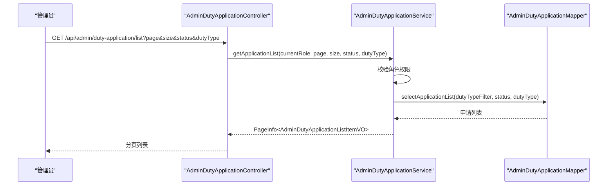
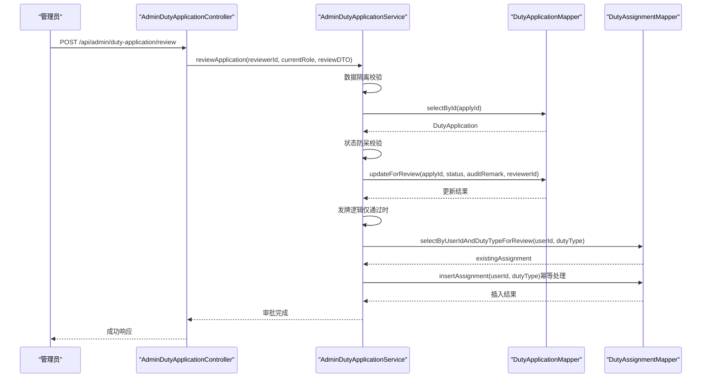
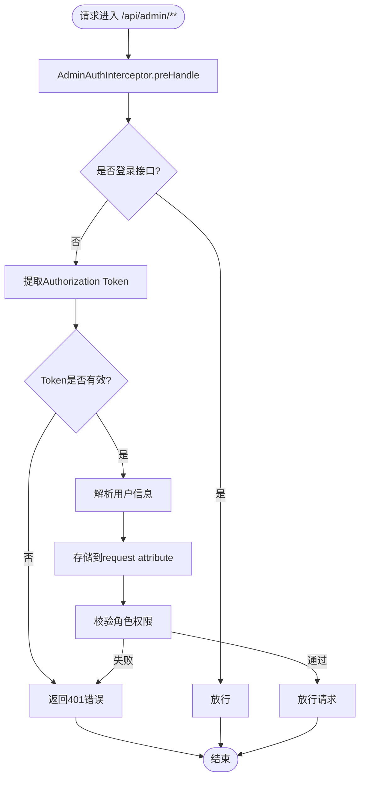
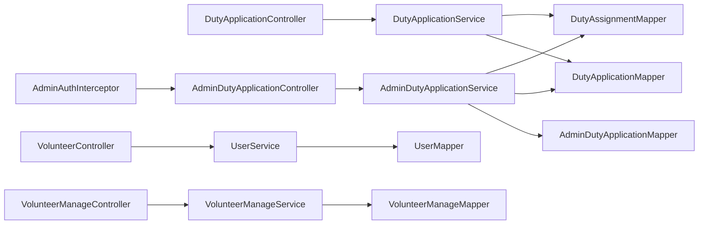

# 志愿者职责管理

<cite>
**本文引用的文件**
- [DutyApplicationController.java](file://src/main/java/com/daily/dailychineseculture/controller/DutyApplicationController.java)
- [VolunteerController.java](file://src/main/java/com/daily/dailychineseculture/controller/VolunteerController.java)
- [VolunteerManageController.java](file://src/main/java/com/daily/dailychineseculture/controller/VolunteerManageController.java)
- [AdminDutyApplicationController.java](file://src/main/java/com/daily/dailychineseculture/controller/AdminDutyApplicationController.java)
- [DutyApplicationService.java](file://src/main/java/com/daily/dailychineseculture/service/DutyApplicationService.java)
- [DutyApplicationServiceImpl.java](file://src/main/java/com/daily/dailychineseculture/service/impl/DutyApplicationServiceImpl.java)
- [AdminDutyApplicationService.java](file://src/main/java/com/daily/dailychineseculture/service/AdminDutyApplicationService.java)
- [AdminDutyApplicationServiceImpl.java](file://src/main/java/com/daily/dailychineseculture/service/impl/AdminDutyApplicationServiceImpl.java)
- [VolunteerManageService.java](file://src/main/java/com/daily/dailychineseculture/service/VolunteerManageService.java)
- [VolunteerManageServiceImpl.java](file://src/main/java/com/daily/dailychineseculture/service/impl/VolunteerManageServiceImpl.java)
- [UserService.java](file://src/main/java/com/daily/dailychineseculture/service/UserService.java)
- [AdminAuthInterceptor.java](file://src/main/java/com/daily/dailychineseculture/interceptor/AdminAuthInterceptor.java)
- [DutyAssignment.java](file://src/main/java/com/daily/dailychineseculture/entity/DutyAssignment.java)
- [DutyApplication.java](file://src/main/java/com/daily/dailychineseculture/entity/DutyApplication.java)
- [DutyAssignmentDTO.java](file://src/main/java/com/daily/dailychineseculture/dto/DutyAssignmentDTO.java)
- [DutyApplicationSubmitDTO.java](file://src/main/java/com/daily/dailychineseculture/dto/DutyApplicationSubmitDTO.java)
- [DutyApplicationReviewDTO.java](file://src/main/java/com/daily/dailychineseculture/dto/DutyApplicationReviewDTO.java)
- [VolunteerHistoryDTO.java](file://src/main/java/com/daily/dailychineseculture/dto/VolunteerHistoryDTO.java)
- [AdminDutyApplicationStatsVO.java](file://src/main/java/com/daily/dailychineseculture/vo/AdminDutyApplicationStatsVO.java)
- [AdminDutyApplicationListItemVO.java](file://src/main/java/com/daily/dailychineseculture/vo/AdminDutyApplicationListItemVO.java)
- [DutyAssignmentMapper.java](file://src/main/java/com/daily/dailychineseculture/mapper/DutyAssignmentMapper.java)
- [DutyApplicationMapper.java](file://src/main/java/com/daily/dailychineseculture/mapper/DutyApplicationMapper.java)
- [AdminDutyApplicationMapper.java](file://src/main/java/com/daily/dailychineseculture/mapper/AdminDutyApplicationMapper.java)
- [UserMapper.java](file://src/main/java/com/daily/dailychineseculture/mapper/UserMapper.java)
</cite>

## 更新摘要
**变更内容**
- 新增管理员值班申请审批功能模块
- 新增审批统计、审批列表、审批流转等管理端功能
- 完善了原有的用户端申请功能，形成完整的审批闭环
- 新增基于角色的数据隔离机制
- 新增管理员权限验证和拦截器

## 目录
1. [简介](#简介)
2. [项目结构](#项目结构)
3. [核心组件](#核心组件)
4. [架构总览](#架构总览)
5. [详细组件分析](#详细组件分析)
6. [管理员值班申请审批功能](#管理员值班申请审批功能)
7. [依赖关系分析](#依赖关系分析)
8. [性能考量](#性能考量)
9. [故障排查指南](#故障排查指南)
10. [结论](#结论)
11. [附录](#附录)

## 简介
本文件围绕志愿者职责管理功能，系统阐述职责分配、开始服务、结束服务的完整流程；详解职责退出机制（POST /user/volunteer-quit）的参数校验、权限检查与状态更新逻辑；剖析职责管理的数据模型（DutyAssignment 实体）及业务规则；说明职责冲突检测机制（时间重叠、角色权限、资源限制）；并给出职责申请、审批、服务记录更新等操作示例，以及与课程管理、营期管理的联动关系。

**更新** 新增管理员值班申请审批功能，包括审批统计、审批列表、审批流转等管理端功能，完善了原有的用户端申请功能，形成了完整的职责管理审批闭环。

## 项目结构
志愿者职责管理涉及控制器、服务层、数据访问层与数据传输对象，采用典型的分层架构：
- 控制器层：处理 HTTP 请求，解析头部与请求体，调用服务层并封装响应。
- 服务层：实现业务逻辑，包含职责申请防重、权限校验、职责分配与移除、志愿者统计与历史查询、退出服务等。
- 数据访问层：通过 Mapper 接口执行数据库操作，提供职责分配、申请、用户历史与统计查询等能力。
- 数据传输对象：封装请求与响应数据结构，确保前后端契约清晰。

**图表来源**
- [DutyApplicationController.java:14-74](file://src/main/java/com/daily/dailychineseculture/controller/DutyApplicationController.java#L14-L74)
- [VolunteerController.java:15-78](file://src/main/java/com/daily/dailychineseculture/controller/VolunteerController.java#L15-L78)
- [VolunteerManageController.java:16-137](file://src/main/java/com/daily/dailychineseculture/controller/VolunteerManageController.java#L16-L137)
- [AdminDutyApplicationController.java:19-199](file://src/main/java/com/daily/dailychineseculture/controller/AdminDutyApplicationController.java#L19-L199)
- [DutyApplicationServiceImpl.java:15-55](file://src/main/java/com/daily/dailychineseculture/service/impl/DutyApplicationServiceImpl.java#L15-L55)
- [VolunteerManageServiceImpl.java:17-430](file://src/main/java/com/daily/dailychineseculture/service/impl/VolunteerManageServiceImpl.java#L17-L430)
- [AdminDutyApplicationServiceImpl.java:24-172](file://src/main/java/com/daily/dailychineseculture/service/impl/AdminDutyApplicationServiceImpl.java#L24-L172)
- [UserService.java:22-959](file://src/main/java/com/daily/dailychineseculture/service/UserService.java#L22-L959)
- [DutyAssignmentMapper.java:13-96](file://src/main/java/com/daily/dailychineseculture/mapper/DutyAssignmentMapper.java#L13-L96)
- [DutyApplicationMapper.java:13-96](file://src/main/java/com/daily/dailychineseculture/mapper/DutyApplicationMapper.java#L13-L96)
- [AdminDutyApplicationMapper.java:15-76](file://src/main/java/com/daily/dailychineseculture/mapper/AdminDutyApplicationMapper.java#L15-L76)
- [UserMapper.java:12-252](file://src/main/java/com/daily/dailychineseculture/mapper/UserMapper.java#L12-L252)

**章节来源**
- [DutyApplicationController.java:14-74](file://src/main/java/com/daily/dailychineseculture/controller/DutyApplicationController.java#L14-L74)
- [VolunteerController.java:15-78](file://src/main/java/com/daily/dailychineseculture/controller/VolunteerController.java#L15-L78)
- [VolunteerManageController.java:16-137](file://src/main/java/com/daily/dailychineseculture/controller/VolunteerManageController.java#L16-L137)
- [AdminDutyApplicationController.java:19-199](file://src/main/java/com/daily/dailychineseculture/controller/AdminDutyApplicationController.java#L19-L199)

## 核心组件
- 职责申请控制器：接收权限申请，解析 Authorization 头部，调用服务层提交申请并返回统一响应。
- 志愿者控制器：提供志愿者历史查询、退出服务、统计信息查询等接口。
- 志愿者管理控制器：提供管理范围查询、成员信息查询、岗位分配与移除等管理接口。
- 管理员值班申请控制器：提供审批统计、审批列表、审批流转等管理端功能，实现基于角色的数据隔离。
- 服务实现：
  - DutyApplicationServiceImpl：实现双重防重校验（待审重复、已授权重复），通过 Mapper 写入申请记录。
  - VolunteerManageServiceImpl：根据管理范围动态生成可分配岗位，执行分配与移除，维护职责范围映射。
  - AdminDutyApplicationServiceImpl：实现管理员审批功能，包含数据隔离、状态校验、审批流转等核心逻辑。
  - UserService：实现志愿者历史聚合与实时更新、退出服务、统计信息汇总等。
- 数据模型：
  - DutyAssignment：职责分配实体，包含用户、营期、职责类型、任职与志愿服务时间等字段。
  - DutyApplication：职责申请实体，包含申请状态、类型、理由等。
  - DTO：职责分配视图、申请提交 DTO、管理员审批 DTO、志愿者历史 DTO 等。
  - VO：管理员审批统计 VO、审批列表项 VO 等。

**章节来源**
- [DutyApplicationService.java:8-21](file://src/main/java/com/daily/dailychineseculture/service/DutyApplicationService.java#L8-L21)
- [DutyApplicationServiceImpl.java:15-55](file://src/main/java/com/daily/dailychineseculture/service/impl/DutyApplicationServiceImpl.java#L15-L55)
- [VolunteerManageService.java:11-38](file://src/main/java/com/daily/dailychineseculture/service/VolunteerManageService.java#L11-L38)
- [VolunteerManageServiceImpl.java:17-430](file://src/main/java/com/daily/dailychineseculture/service/impl/VolunteerManageServiceImpl.java#L17-L430)
- [AdminDutyApplicationService.java:11-40](file://src/main/java/com/daily/dailychineseculture/service/AdminDutyApplicationService.java#L11-L40)
- [AdminDutyApplicationServiceImpl.java:24-172](file://src/main/java/com/daily/dailychineseculture/service/impl/AdminDutyApplicationServiceImpl.java#L24-L172)
- [UserService.java:22-959](file://src/main/java/com/daily/dailychineseculture/service/UserService.java#L22-L959)
- [DutyAssignment.java:10-64](file://src/main/java/com/daily/dailychineseculture/entity/DutyAssignment.java#L10-L64)
- [DutyApplication.java:11-56](file://src/main/java/com/daily/dailychineseculture/entity/DutyApplication.java#L11-L56)
- [DutyAssignmentDTO.java:9-72](file://src/main/java/com/daily/dailychineseculture/dto/DutyAssignmentDTO.java#L9-L72)
- [DutyApplicationSubmitDTO.java:10-26](file://src/main/java/com/daily/dailychineseculture/dto/DutyApplicationSubmitDTO.java#L10-L26)
- [DutyApplicationReviewDTO.java:9-26](file://src/main/java/com/daily/dailychineseculture/dto/DutyApplicationReviewDTO.java#L9-L26)
- [VolunteerHistoryDTO.java:9-51](file://src/main/java/com/daily/dailychineseculture/dto/VolunteerHistoryDTO.java#L9-L51)
- [AdminDutyApplicationStatsVO.java:9-30](file://src/main/java/com/daily/dailychineseculture/vo/AdminDutyApplicationStatsVO.java#L9-L30)
- [AdminDutyApplicationListItemVO.java:11-48](file://src/main/java/com/daily/dailychineseculture/vo/AdminDutyApplicationListItemVO.java#L11-L48)

## 架构总览
职责管理遵循"控制器-服务-数据访问"的分层设计，职责分配与申请通过 Mapper 直接读写数据库，服务层负责业务规则与权限校验，控制器负责请求解析与响应封装。新增的管理员审批功能通过拦截器实现基于角色的权限验证和数据隔离。

**图表来源**
- [VolunteerController.java:42-62](file://src/main/java/com/daily/dailychineseculture/controller/VolunteerController.java#L42-L62)
- [UserService.java:414-425](file://src/main/java/com/daily/dailychineseculture/service/UserService.java#L414-L425)
- [UserMapper.java:150-156](file://src/main/java/com/daily/dailychineseculture/mapper/UserMapper.java#L150-L156)

## 详细组件分析

### 职责申请与审批流程
职责申请由前端提交，控制器解析 Authorization 头部与请求体，调用服务层执行双重防重校验后再入库。

- 参数校验：请求体 DTO 对 dutyType 与 applyReason 进行非空校验。
- 防重复申请：同一用户对同一职责类型的待审核申请不可重复提交。
- 防重复授权：若用户已拥有该职责类型权限，则拒绝重复申请。
- 审批状态：申请创建时强制置为"待审核"。

**图表来源**
- [DutyApplicationController.java:51-72](file://src/main/java/com/daily/dailychineseculture/controller/DutyApplicationController.java#L51-L72)
- [DutyApplicationServiceImpl.java:24-53](file://src/main/java/com/daily/dailychineseculture/service/impl/DutyApplicationServiceImpl.java#L24-L53)
- [DutyApplicationSubmitDTO.java:10-26](file://src/main/java/com/daily/dailychineseculture/dto/DutyApplicationSubmitDTO.java#L10-L26)
- [DutyAssignmentMapper.java:23-42](file://src/main/java/com/daily/dailychineseculture/mapper/DutyAssignmentMapper.java#L23-L42)

**章节来源**
- [DutyApplicationController.java:51-72](file://src/main/java/com/daily/dailychineseculture/controller/DutyApplicationController.java#L51-L72)
- [DutyApplicationServiceImpl.java:24-53](file://src/main/java/com/daily/dailychineseculture/service/impl/DutyApplicationServiceImpl.java#L24-L53)
- [DutyApplicationSubmitDTO.java:10-26](file://src/main/java/com/daily/dailychineseculture/dto/DutyApplicationSubmitDTO.java#L10-L26)
- [DutyAssignmentMapper.java:23-42](file://src/main/java/com/daily/dailychineseculture/mapper/DutyAssignmentMapper.java#L23-L42)

### 职责分配与管理
管理员通过志愿者管理控制器进行职责分配与移除，服务层根据管理范围判断权限并维护职责范围映射。

- 权限检查：仅班级管理者可分配大组/小组岗位；大组管理者仅可分配小组岗位；小组管理者无分配权限。
- 资源限制：若目标岗位已被占用，拒绝重复分配。
- 职责范围：分配成功后写入职责范围映射，确保后续查询与统计准确。

**图表来源**
- [VolunteerManageController.java:85-110](file://src/main/java/com/daily/dailychineseculture/controller/VolunteerManageController.java#L85-L110)
- [VolunteerManageServiceImpl.java:263-346](file://src/main/java/com/daily/dailychineseculture/service/impl/VolunteerManageServiceImpl.java#L263-L346)

**章节来源**
- [VolunteerManageController.java:85-110](file://src/main/java/com/daily/dailychineseculture/controller/VolunteerManageController.java#L85-L110)
- [VolunteerManageServiceImpl.java:263-346](file://src/main/java/com/daily/dailychineseculture/service/impl/VolunteerManageServiceImpl.java#L263-L346)

### 职责退出机制（POST /user/volunteer-quit）
职责退出由志愿者本人发起，控制器解析 Authorization 与请求体，服务层执行权限校验与状态更新。

- 参数校验：assignmentId 必填。
- 权限检查：仅当 assignmentId 与 userId 匹配且存在时才允许退出。
- 状态更新：将 volunteer_end_time 更新为当前时间，标记服务结束。

**图表来源**
- [VolunteerController.java:42-62](file://src/main/java/com/daily/dailychineseculture/controller/VolunteerController.java#L42-L62)
- [UserService.java:414-425](file://src/main/java/com/daily/dailychineseculture/service/UserService.java#L414-L425)
- [UserMapper.java:150-156](file://src/main/java/com/daily/dailychineseculture/mapper/UserMapper.java#L150-L156)

**章节来源**
- [VolunteerController.java:42-62](file://src/main/java/com/daily/dailychineseculture/controller/VolunteerController.java#L42-L62)
- [UserService.java:414-425](file://src/main/java/com/daily/dailychineseculture/service/UserService.java#L414-L425)
- [UserMapper.java:150-156](file://src/main/java/com/daily/dailychineseculture/mapper/UserMapper.java#L150-L156)

### 数据模型与业务规则（DutyAssignment）
DutyAssignment 是职责分配的核心实体，承载用户、营期、职责类型与服务时间等关键字段。

- 字段说明：
  - assignmentId：主键，唯一标识一次职责任命。
  - userId：职责归属用户。
  - campId：所属营期；全局管理员可为空。
  - dutyType/dutyName：职责类型与名称。
  - startTime/endTime：任职起止时间；end_time 为空表示永久有效。
  - volunteerStartTime/volunteerEndTime：志愿服务起止时间；用于服务记录与统计。
  - createTime：创建时间。
- 业务规则：
  - 有效期内的职责才计入权限；end_time 为空或晚于当前时间视为有效。
  - 服务时间优先级：主动退出时间 > 营期结束时间 > 当前日期（正在参与）。

**图表来源**
- [DutyAssignment.java:10-64](file://src/main/java/com/daily/dailychineseculture/entity/DutyAssignment.java#L10-L64)

**章节来源**
- [DutyAssignment.java:10-64](file://src/main/java/com/daily/dailychineseculture/entity/DutyAssignment.java#L10-L64)
- [UserMapper.java:78-129](file://src/main/java/com/daily/dailychineseculture/mapper/UserMapper.java#L78-L129)

### 职责冲突检测机制
- 时间重叠检查：通过查询当前有效职责（end_time 为空或晚于当前时间）与目标岗位的当前持有者，避免重复分配。
- 角色权限验证：根据管理者的管理范围判断其是否具备分配权限（班级管理者可分配大组/小组岗位；大组管理者仅可分配小组岗位）。
- 资源限制控制：同一岗位在同一层级不可重复分配，防止资源冲突。

**章节来源**
- [VolunteerManageServiceImpl.java:275-346](file://src/main/java/com/daily/dailychineseculture/service/impl/VolunteerManageServiceImpl.java#L275-L346)
- [DutyAssignmentMapper.java:23-42](file://src/main/java/com/daily/dailychineseculture/mapper/DutyAssignmentMapper.java#L23-L42)

### 操作示例
- 职责申请与审批：
  - 前端提交申请（dutyType、applyReason），控制器解析后调用服务层，服务层进行双重防重校验并通过 Mapper 写入申请记录。
  - 审核流程：申请创建后处于"待审核"状态，后续由管理员在后台进行处理。
- 服务开始与结束：
  - 服务开始：职责分配成功后，系统记录 volunteerStartTime；若营期结束而志愿者未主动退出，系统会将 volunteer_end_time 更新为营期结束时间。
  - 服务结束：志愿者主动退出时，调用 /user/volunteer-quit，系统校验后更新 volunteer_end_time。
- 统计与历史：
  - 志愿者历史：按职责分配聚合服务时间段，结合营期结束与退出时间动态计算最终状态。
  - 统计信息：按营期、班级、大组、小组维度统计志愿者负责范围。

**章节来源**
- [DutyApplicationController.java:51-72](file://src/main/java/com/daily/dailychineseculture/controller/DutyApplicationController.java#L51-L72)
- [UserService.java:332-410](file://src/main/java/com/daily/dailychineseculture/service/UserService.java#L332-L410)
- [VolunteerController.java:28-62](file://src/main/java/com/daily/dailychineseculture/controller/VolunteerController.java#L28-L62)

### 与其他模块的集成关系
- 与营期管理联动：
  - 职责分配关联营期（campId），退出服务时若营期已结束，系统会将服务结束时间更新为营期结束时间。
  - 统计信息按营期维度聚合，确保志愿者参与范围与营期生命周期一致。
- 与课程管理联动：
  - 班级管理者可对大组与小组进行职责分配，形成"营期-班级-大组-小组"的四级职责体系，便于课程组织与管理。
  - 分班完成后，志愿者可在相应层级承担职责，实现职责与课程组织的自然衔接。

**章节来源**
- [UserMapper.java:78-129](file://src/main/java/com/daily/dailychineseculture/mapper/UserMapper.java#L78-L129)
- [VolunteerManageServiceImpl.java:159-261](file://src/main/java/com/daily/dailychineseculture/service/impl/VolunteerManageServiceImpl.java#L159-L261)

## 管理员值班申请审批功能

### 审批统计功能
管理员可通过统计接口获取职责申请的整体情况，支持基于角色的数据隔离。

- 数据隔离：超级管理员可查看所有申请统计，其他角色仅能查看与自己角色匹配的申请统计。
- 统计内容：总申请数、待审核数、已通过数、未通过数。

**图表来源**
- [AdminDutyApplicationController.java:47-64](file://src/main/java/com/daily/dailychineseculture/controller/AdminDutyApplicationController.java#L47-L64)
- [AdminDutyApplicationServiceImpl.java:41-53](file://src/main/java/com/daily/dailychineseculture/service/impl/AdminDutyApplicationServiceImpl.java#L41-L53)
- [AdminDutyApplicationMapper.java:25-37](file://src/main/java/com/daily/dailychineseculture/mapper/AdminDutyApplicationMapper.java#L25-L37)

**章节来源**
- [AdminDutyApplicationController.java:26-64](file://src/main/java/com/daily/dailychineseculture/controller/AdminDutyApplicationController.java#L26-L64)
- [AdminDutyApplicationServiceImpl.java:41-53](file://src/main/java/com/daily/dailychineseculture/service/impl/AdminDutyApplicationServiceImpl.java#L41-L53)
- [AdminDutyApplicationMapper.java:18-37](file://src/main/java/com/daily/dailychineseculture/mapper/AdminDutyApplicationMapper.java#L18-L37)

### 审批列表功能
管理员可分页查询职责申请列表，支持多种过滤条件和数据隔离。

- 分页参数：page（默认1）、size（默认10，最大100）。
- 过滤条件：status（0-待审核, 1-已通过, 2-未通过）、dutyType（超级管理员使用）。
- 数据隔离：非超级管理员只能查看与自己角色匹配的申请。

**图表来源**
- [AdminDutyApplicationController.java:93-130](file://src/main/java/com/daily/dailychineseculture/controller/AdminDutyApplicationController.java#L93-L130)
- [AdminDutyApplicationServiceImpl.java:55-82](file://src/main/java/com/daily/dailychineseculture/service/impl/AdminDutyApplicationServiceImpl.java#L55-L82)
- [AdminDutyApplicationMapper.java:48-75](file://src/main/java/com/daily/dailychineseculture/mapper/AdminDutyApplicationMapper.java#L48-L75)

**章节来源**
- [AdminDutyApplicationController.java:66-130](file://src/main/java/com/daily/dailychineseculture/controller/AdminDutyApplicationController.java#L66-L130)
- [AdminDutyApplicationServiceImpl.java:55-82](file://src/main/java/com/daily/dailychineseculture/service/impl/AdminDutyApplicationServiceImpl.java#L55-L82)
- [AdminDutyApplicationMapper.java:39-75](file://src/main/java/com/daily/dailychineseculture/mapper/AdminDutyApplicationMapper.java#L39-L75)

### 审批流转功能
管理员可对职责申请进行审批操作，支持通过和拒绝两种状态，并自动完成授权发放。

- 审批状态：1-通过，2-拒绝。
- 参数校验：applyId、status 必填，拒绝时 auditRemark 必填。
- 发牌逻辑：审批通过时自动向授权表插入记录，支持幂等处理防止重复授权。

**图表来源**
- [AdminDutyApplicationController.java:155-199](file://src/main/java/com/daily/dailychineseculture/controller/AdminDutyApplicationController.java#L155-L199)
- [AdminDutyApplicationServiceImpl.java:93-170](file://src/main/java/com/daily/dailychineseculture/service/impl/AdminDutyApplicationServiceImpl.java#L93-L170)

**章节来源**
- [AdminDutyApplicationController.java:132-199](file://src/main/java/com/daily/dailychineseculture/controller/AdminDutyApplicationController.java#L132-L199)
- [AdminDutyApplicationServiceImpl.java:93-170](file://src/main/java/com/daily/dailychineseculture/service/impl/AdminDutyApplicationServiceImpl.java#L93-L170)
- [DutyApplicationReviewDTO.java:9-26](file://src/main/java/com/daily/dailychineseculture/dto/DutyApplicationReviewDTO.java#L9-L26)

### 权限验证与数据隔离
管理员审批功能通过拦截器实现基于角色的权限验证和数据隔离。

- 拦截范围：所有 /api/admin/** 请求。
- 用户信息：userId、currentRole、campId。
- 登录接口放行：/api/admin/login、/admin/login、/captcha、/admin/captcha、/api/admin/captcha。

**图表来源**
- [AdminAuthInterceptor.java:24-82](file://src/main/java/com/daily/dailychineseculture/interceptor/AdminAuthInterceptor.java#L24-L82)

**章节来源**
- [AdminAuthInterceptor.java:10-93](file://src/main/java/com/daily/dailychineseculture/interceptor/AdminAuthInterceptor.java#L10-L93)

## 依赖关系分析
职责管理模块内部依赖清晰，控制器仅负责编排，服务层承担业务规则，Mapper 负责数据持久化。新增的管理员审批功能通过拦截器实现权限控制。

**图表来源**
- [DutyApplicationController.java:14-74](file://src/main/java/com/daily/dailychineseculture/controller/DutyApplicationController.java#L14-L74)
- [VolunteerController.java:15-78](file://src/main/java/com/daily/dailychineseculture/controller/VolunteerController.java#L15-L78)
- [VolunteerManageController.java:16-137](file://src/main/java/com/daily/dailychineseculture/controller/VolunteerManageController.java#L16-L137)
- [AdminDutyApplicationController.java:19-199](file://src/main/java/com/daily/dailychineseculture/controller/AdminDutyApplicationController.java#L19-L199)
- [AdminAuthInterceptor.java:14-93](file://src/main/java/com/daily/dailychineseculture/interceptor/AdminAuthInterceptor.java#L14-L93)
- [DutyApplicationServiceImpl.java:15-55](file://src/main/java/com/daily/dailychineseculture/service/impl/DutyApplicationServiceImpl.java#L15-L55)
- [VolunteerManageServiceImpl.java:17-430](file://src/main/java/com/daily/dailychineseculture/service/impl/VolunteerManageServiceImpl.java#L17-L430)
- [AdminDutyApplicationServiceImpl.java:24-172](file://src/main/java/com/daily/dailychineseculture/service/impl/AdminDutyApplicationServiceImpl.java#L24-L172)
- [UserService.java:22-959](file://src/main/java/com/daily/dailychineseculture/service/UserService.java#L22-L959)
- [DutyAssignmentMapper.java:13-96](file://src/main/java/com/daily/dailychineseculture/mapper/DutyAssignmentMapper.java#L13-L96)
- [DutyApplicationMapper.java:13-96](file://src/main/java/com/daily/dailychineseculture/mapper/DutyApplicationMapper.java#L13-L96)
- [AdminDutyApplicationMapper.java:15-76](file://src/main/java/com/daily/dailychineseculture/mapper/AdminDutyApplicationMapper.java#L15-L76)
- [UserMapper.java:12-252](file://src/main/java/com/daily/dailychineseculture/mapper/UserMapper.java#L12-L252)

**章节来源**
- [DutyApplicationServiceImpl.java:15-55](file://src/main/java/com/daily/dailychineseculture/service/impl/DutyApplicationServiceImpl.java#L15-L55)
- [VolunteerManageServiceImpl.java:17-430](file://src/main/java/com/daily/dailychineseculture/service/impl/VolunteerManageServiceImpl.java#L17-L430)
- [AdminDutyApplicationServiceImpl.java:24-172](file://src/main/java/com/daily/dailychineseculture/service/impl/AdminDutyApplicationServiceImpl.java#L24-L172)
- [UserService.java:22-959](file://src/main/java/com/daily/dailychineseculture/service/UserService.java#L22-L959)

## 性能考量
- 查询优化：职责历史与统计查询通过 LEFT JOIN 与条件过滤减少不必要的数据扫描；建议在 t_duty_assignment、t_duty_scope、t_camp 等关键字段建立索引以提升联表查询性能。
- 写入优化：职责分配与退出服务均为单表更新，SQL 简洁；批量操作建议使用事务包裹，确保一致性与原子性。
- 缓存策略：对于频繁访问的管理范围与职责映射，可考虑引入缓存降低数据库压力（需注意数据一致性）。
- 审批查询优化：管理员审批列表查询使用分页插件 PageHelper，支持大数据量场景下的高效分页。

## 故障排查指南
- 职责申请失败：
  - 检查是否存在待审核的同类申请；若存在，提示"请勿重复提交"。
  - 检查用户是否已拥有该职责类型权限；若已拥有，提示"无需重复申请"。
- 职责分配失败：
  - 确认管理者是否具备对应层级的分配权限；若无权限，返回"无权限分配该岗位"。
  - 确认目标岗位是否已被占用；若已占用，返回"岗位已被占用"。
- 退出服务失败：
  - 检查 assignmentId 与 userId 是否匹配；若不匹配，返回"职责任命不存在或不属于该用户"。
  - 确认数据库更新是否成功；若失败，检查日志定位异常。
- 管理员审批失败：
  - 检查 Token 是否有效；无效或过期返回"Token 已过期或无效"。
  - 检查审批状态参数是否正确；仅允许1（通过）或2（拒绝）。
  - 检查是否越权操作；非超级管理员只能审批自己角色类型的申请。
  - 检查申请状态是否已处理；仅待审核状态可进行审批。

**章节来源**
- [DutyApplicationServiceImpl.java:28-40](file://src/main/java/com/daily/dailychineseculture/service/impl/DutyApplicationServiceImpl.java#L28-L40)
- [VolunteerManageServiceImpl.java:275-346](file://src/main/java/com/daily/dailychineseculture/service/impl/VolunteerManageServiceImpl.java#L275-L346)
- [VolunteerController.java:49-61](file://src/main/java/com/daily/dailychineseculture/controller/VolunteerController.java#L49-L61)
- [AdminDutyApplicationServiceImpl.java:105-131](file://src/main/java/com/daily/dailychineseculture/service/impl/AdminDutyApplicationServiceImpl.java#L105-L131)
- [AdminDutyApplicationController.java:173-196](file://src/main/java/com/daily/dailychineseculture/controller/AdminDutyApplicationController.java#L173-L196)

## 结论
志愿者职责管理通过清晰的分层架构与严格的业务规则，实现了职责申请、分配、服务记录与退出的闭环管理。系统在权限校验、冲突检测与历史统计方面具备良好扩展性，能够与营期与课程管理模块协同工作，支撑复杂的组织与服务场景。

**更新** 新增的管理员值班申请审批功能进一步完善了职责管理体系，通过审批统计、审批列表、审批流转等管理端功能，实现了职责申请的全流程管理。基于角色的数据隔离机制确保了不同权限级别的管理员只能访问和操作相应的职责申请，提高了系统的安全性与可控性。

## 附录
- 关键接口一览：
  - 提交职责申请：POST /duty-application/submit
  - 获取我的申请列表：GET /duty-application/my-list
  - 撤销申请：POST /duty-application/revoke
  - 退出担当：POST /user/volunteer-quit
  - 获取志愿者历史：GET /user/volunteer-history
  - 获取志愿者统计：GET /user/volunteer-stats
  - 获取管理范围：GET /volunteer/scopes
  - 获取成员信息：GET /volunteer/manage/members
  - 获取分配岗位信息：GET /volunteer/manage/duty-assignment
  - 分配岗位：POST /volunteer/manage/assign-duty
  - 移除岗位：POST /volunteer/manage/remove-duty
  - 审批数据统计：GET /api/admin/duty-application/stats
  - 审批分页列表：GET /api/admin/duty-application/list
  - 审批流转：POST /api/admin/duty-application/review