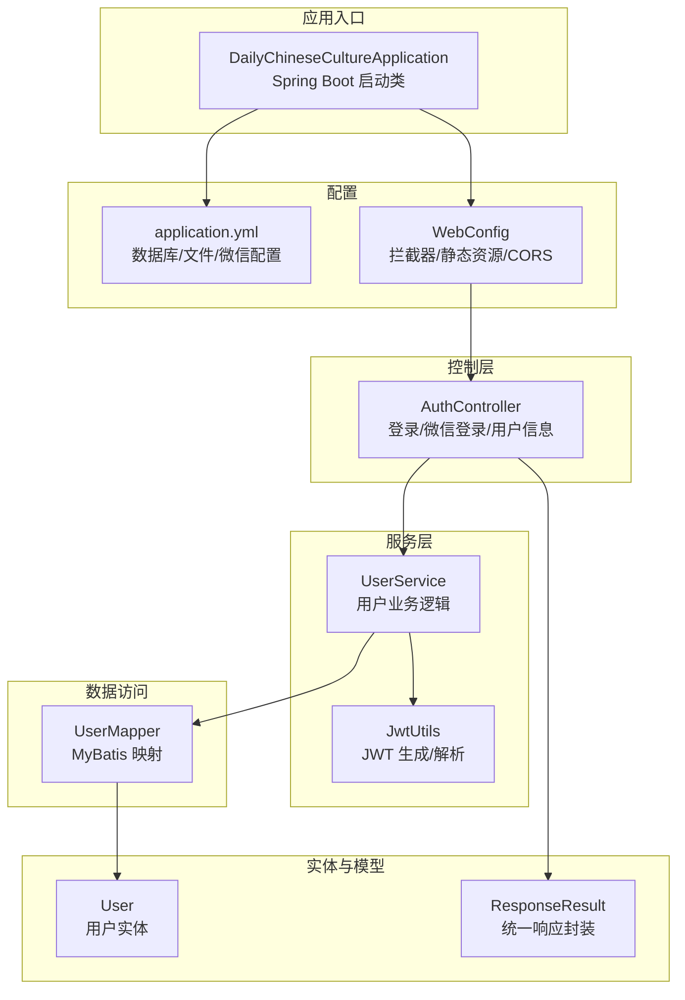
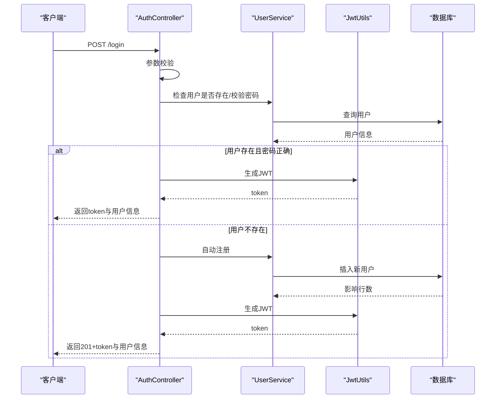
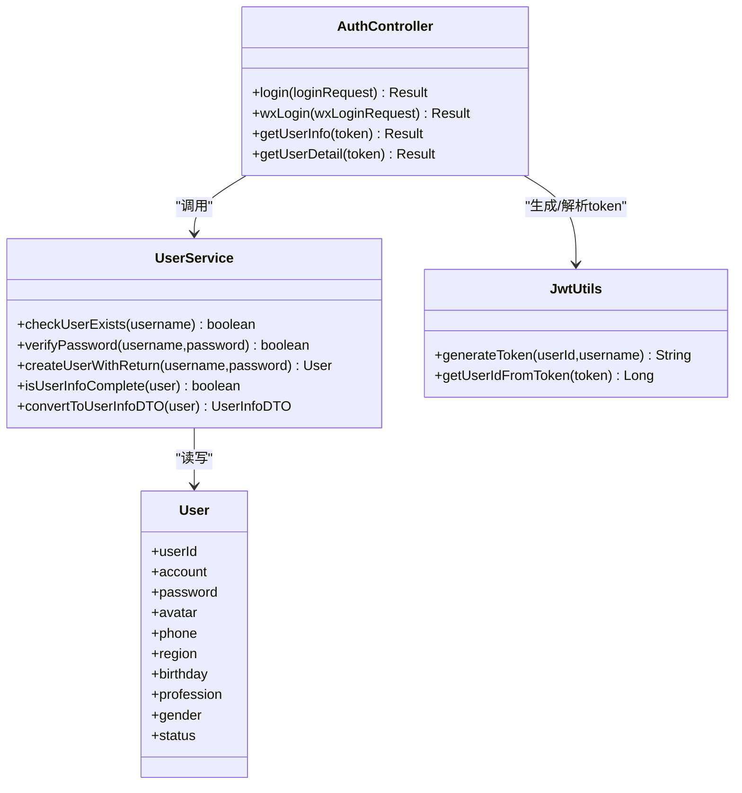
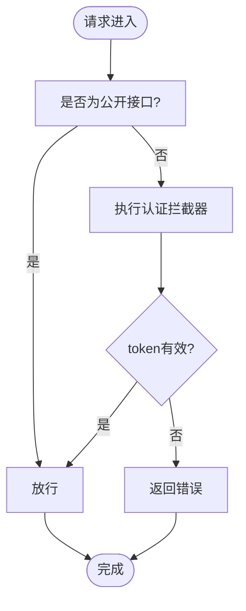
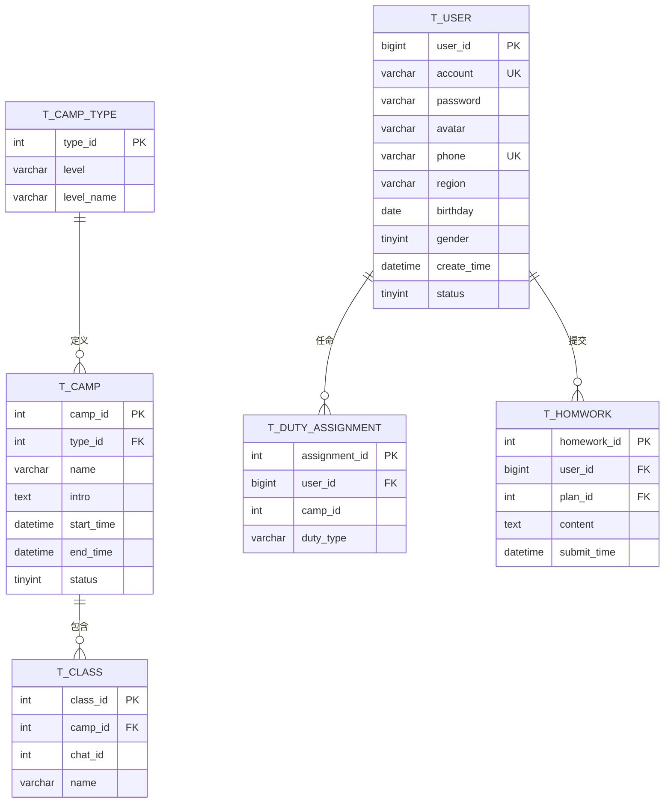
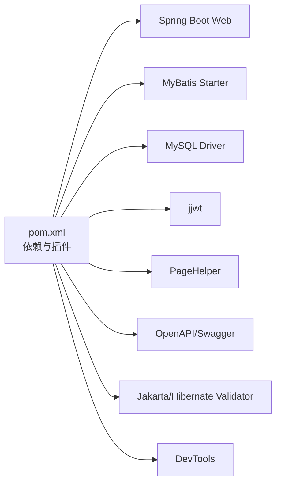

# 快速开始

<cite>
**本文引用的文件**
- [pom.xml](file://pom.xml)
- [application.yml](file://src/main/resources/application.yml)
- [DailyChineseCultureApplication.java](file://src/main/java/com/daily/dailychineseculture/DailyChineseCultureApplication.java)
- [开发环境准备指南.md](file://doc/开发环境准备指南.md)
- [项目运行测试指南.md](file://doc/项目运行测试指南.md)
- [数据库代码.txt](file://数据库代码.txt)
- [maven-wrapper.properties](file://.mvn/wrapper/maven-wrapper.properties)
- [mvnw.cmd](file://mvnw.cmd)
- [AuthController.java](file://src/main/java/com/daily/dailychineseculture/controller/AuthController.java)
- [WebConfig.java](file://src/main/java/com/daily/dailychineseculture/config/WebConfig.java)
- [JwtUtils.java](file://src/main/java/com/daily/dailychineseculture/util/JwtUtils.java)
- [User.java](file://src/main/java/com/daily/dailychineseculture/entity/User.java)
- [UserService.java](file://src/main/java/com/daily/dailychineseculture/service/UserService.java)
- [ResponseResult.java](file://src/main/java/com/daily/dailychineseculture/common/ResponseResult.java)
- [LoginFunctionTest.java](file://src/test/java/com/daily/dailychineseculture/LoginFunctionTest.java)
</cite>

## 目录
1. [简介](#简介)
2. [项目结构](#项目结构)
3. [核心组件](#核心组件)
4. [架构总览](#架构总览)
5. [详细组件分析](#详细组件分析)
6. [依赖关系分析](#依赖关系分析)
7. [性能考虑](#性能考虑)
8. [故障排除指南](#故障排除指南)
9. [结论](#结论)
10. [附录](#附录)

## 简介
本指南面向首次接触本项目的开发者，目标是在30分钟内完成环境准备、数据库初始化、项目启动与核心功能验证。内容覆盖：
- 开发环境要求（Java 21、MySQL、Maven）
- 环境变量与工具配置
- 数据库初始化脚本说明
- 配置文件修改要点
- 项目启动流程与基本功能验证
- 常见问题与调试技巧
- IDE推荐与版本控制最佳实践

## 项目结构
项目采用Spring Boot标准目录结构，核心模块包括：
- 控制层：对外提供REST API（如认证、用户、课程、教务等）
- 服务层：业务逻辑与事务控制
- 数据访问层：MyBatis Mapper与XML映射
- 配置层：Web拦截器、跨域、文件上传等
- 实体与DTO：数据模型与传输对象
- 工具类：JWT工具、统一响应封装
- 测试：集成测试与单元测试

图表来源
- [DailyChineseCultureApplication.java:12-18](file://src/main/java/com/daily/dailychineseculture/DailyChineseCultureApplication.java#L12-L18)
- [application.yml:1-33](file://src/main/resources/application.yml#L1-L33)
- [WebConfig.java:18-104](file://src/main/java/com/daily/dailychineseculture/config/WebConfig.java#L18-L104)
- [AuthController.java:19-136](file://src/main/java/com/daily/dailychineseculture/controller/AuthController.java#L19-L136)
- [UserService.java:22-91](file://src/main/java/com/daily/dailychineseculture/service/UserService.java#L22-L91)
- [JwtUtils.java:21-69](file://src/main/java/com/daily/dailychineseculture/util/JwtUtils.java#L21-L69)
- [User.java:9-87](file://src/main/java/com/daily/dailychineseculture/entity/User.java#L9-L87)
- [ResponseResult.java:8-79](file://src/main/java/com/daily/dailychineseculture/common/ResponseResult.java#L8-L79)

章节来源
- [DailyChineseCultureApplication.java:12-18](file://src/main/java/com/daily/dailychineseculture/DailyChineseCultureApplication.java#L12-L18)
- [application.yml:1-33](file://src/main/resources/application.yml#L1-L33)
- [WebConfig.java:18-104](file://src/main/java/com/daily/dailychineseculture/config/WebConfig.java#L18-L104)

## 核心组件
- 启动类与容器配置：定义RestTemplate与CORS Bean，开启异步与Spring Boot自动装配
- 配置文件：数据库连接、文件上传、微信小程序参数、MyBatis映射
- 控制器：认证与用户信息接口，含登录、微信登录、信息查询与更新
- 服务层：用户业务逻辑、信息完整性判断、ID生成、分班算法
- 工具类：JWT生成与解析、统一响应封装
- 测试：登录功能与参数校验的集成测试

章节来源
- [DailyChineseCultureApplication.java:16-39](file://src/main/java/com/daily/dailychineseculture/DailyChineseCultureApplication.java#L16-L39)
- [application.yml:6-33](file://src/main/resources/application.yml#L6-L33)
- [AuthController.java:63-136](file://src/main/java/com/daily/dailychineseculture/controller/AuthController.java#L63-L136)
- [UserService.java:149-169](file://src/main/java/com/daily/dailychineseculture/service/UserService.java#L149-L169)
- [JwtUtils.java:37-69](file://src/main/java/com/daily/dailychineseculture/util/JwtUtils.java#L37-L69)
- [ResponseResult.java:48-79](file://src/main/java/com/daily/dailychineseculture/common/ResponseResult.java#L48-L79)
- [LoginFunctionTest.java:19-39](file://src/test/java/com/daily/dailychineseculture/LoginFunctionTest.java#L19-L39)

## 架构总览
系统采用前后端分离模式，后端提供REST API，前端通过HTTP调用接口；认证基于JWT，拦截器统一处理权限与跨域。

图表来源
- [AuthController.java:63-112](file://src/main/java/com/daily/dailychineseculture/controller/AuthController.java#L63-L112)
- [UserService.java:83-134](file://src/main/java/com/daily/dailychineseculture/service/UserService.java#L83-L134)
- [JwtUtils.java:37-69](file://src/main/java/com/daily/dailychineseculture/util/JwtUtils.java#L37-L69)

## 详细组件分析

### 认证与用户模块
- 登录接口：支持账号密码登录与新用户自动注册；返回token与用户信息；包含参数校验与信息完整性标记
- 微信登录：通过微信授权码换取openid，查询或创建用户并返回token
- 用户信息：根据token解析用户ID，返回用户资料与统计指标
- 统一响应：所有接口返回统一结构，便于前端处理

图表来源
- [AuthController.java:63-136](file://src/main/java/com/daily/dailychineseculture/controller/AuthController.java#L63-L136)
- [UserService.java:83-169](file://src/main/java/com/daily/dailychineseculture/service/UserService.java#L83-L169)
- [JwtUtils.java:37-111](file://src/main/java/com/daily/dailychineseculture/util/JwtUtils.java#L37-L111)
- [User.java:14-64](file://src/main/java/com/daily/dailychineseculture/entity/User.java#L14-L64)

章节来源
- [AuthController.java:63-136](file://src/main/java/com/daily/dailychineseculture/controller/AuthController.java#L63-L136)
- [UserService.java:83-169](file://src/main/java/com/daily/dailychineseculture/service/UserService.java#L83-L169)
- [JwtUtils.java:37-111](file://src/main/java/com/daily/dailychineseculture/util/JwtUtils.java#L37-L111)
- [User.java:14-64](file://src/main/java/com/daily/dailychineseculture/entity/User.java#L14-L64)

### Web配置与拦截器
- 静态资源映射：将/uploads/**映射到本地物理目录，支持文件访问
- 拦截器：全局认证拦截器与后台管理拦截器，开放公开接口与文档资源
- CORS：允许任意来源、方法与头部，支持凭据

图表来源
- [WebConfig.java:47-103](file://src/main/java/com/daily/dailychineseculture/config/WebConfig.java#L47-L103)

章节来源
- [WebConfig.java:34-103](file://src/main/java/com/daily/dailychineseculture/config/WebConfig.java#L34-L103)

### 数据库初始化与实体模型
- 初始化脚本：创建数据库、序列表、用户与组织架构、档案与职责、营期计划与作业、规则配置等表
- 关键实体：User、Camp、Class、DutyAssignment、Homework等，具备外键与唯一约束
- MyBatis配置：开启驼峰命名映射，加载mapper XML

图表来源
- [数据库代码.txt:11-165](file://数据库代码.txt#L11-L165)
- [User.java:14-64](file://src/main/java/com/daily/dailychineseculture/entity/User.java#L14-L64)

章节来源
- [数据库代码.txt:4-165](file://数据库代码.txt#L4-L165)
- [application.yml:17-22](file://src/main/resources/application.yml#L17-L22)

## 依赖关系分析
- 构建工具：Maven Wrapper内置，无需手动安装Maven
- 运行时依赖：Spring Boot Web、MyBatis、MySQL驱动、Lombok、JWT、分页插件、Swagger/OpenAPI、校验组件
- 编译期依赖：Lombok注解处理器、Spring Boot Maven插件

图表来源
- [pom.xml:32-117](file://pom.xml#L32-L117)
- [.mvn/wrapper/maven-wrapper.properties:1-4](file://.mvn/wrapper/maven-wrapper.properties#L1-L4)

章节来源
- [pom.xml:29-117](file://pom.xml#L29-L117)
- [.mvn/wrapper/maven-wrapper.properties:1-4](file://.mvn/wrapper/maven-wrapper.properties#L1-L4)

## 性能考虑
- 启动与热部署：启用devtools提升开发体验
- 数据库连接：合理设置连接池参数与超时，避免长事务
- 分页与查询：使用PageHelper进行分页，避免一次性加载大量数据
- 日志与监控：生产环境建议接入日志与APM监控

## 故障排除指南
- 端口占用：8080端口被占用时，查找并终止对应进程后重试
- Java环境：确认JAVA_HOME与PATH已正确设置，重启IDE后重试
- 数据库连接：检查MySQL服务、网络连通性、账号密码与字符集
- Lombok：IDE需安装Lombok插件并启用注解处理
- Maven：优先使用mvnw命令，避免本地Maven版本差异
- 跨域问题：确认CORS配置已生效，前端请求头与预检请求处理

章节来源
- [项目运行测试指南.md:96-121](file://doc/项目运行测试指南.md#L96-L121)
- [开发环境准备指南.md:115-127](file://doc/开发环境准备指南.md#L115-L127)

## 结论
按照本指南完成环境准备、数据库初始化与项目启动后，您可以在30分钟内完成核心功能验证。建议结合测试用例清单逐步核对登录、注册、参数校验与用户信息接口，确保系统按预期工作。

## 附录

### 开发环境要求与工具
- Java 21（JDK 21）
- MySQL（用于本地或远程数据库）
- Maven（项目自带Maven Wrapper，可直接使用）
- IDE推荐：IntelliJ IDEA、Eclipse、VS Code（需安装Java扩展）
- 版本控制：Git

章节来源
- [开发环境准备指南.md:3-56](file://doc/开发环境准备指南.md#L3-L56)

### 环境变量与IDE配置
- 设置JAVA_HOME并加入PATH
- 在IDE中启用Lombok注解处理
- 推荐插件：Lombok、MyBatis Log Plugin、GitToolBox、SonarLint（IntelliJ）

章节来源
- [开发环境准备指南.md:57-114](file://doc/开发环境准备指南.md#L57-L114)

### 数据库初始化步骤
- 创建数据库与表结构：执行数据库初始化脚本
- 初始化数据：根据需要导入初始数据或通过接口创建
- 验证表结构：使用数据库客户端查看表与索引

章节来源
- [数据库代码.txt:4-165](file://数据库代码.txt#L4-L165)

### 配置文件修改要点
- 数据库连接：修改application.yml中的数据库URL、用户名与密码
- 文件上传：根据需要调整上传目录与大小限制
- 微信配置：填写小程序AppId与Secret
- MyBatis：确认mapper XML路径与驼峰映射已启用

章节来源
- [application.yml:6-33](file://src/main/resources/application.yml#L6-L33)

### 项目启动流程
- 使用Maven Wrapper启动：./mvnw spring-boot:run
- 或在IDE中直接运行启动类
- 启动成功后访问Swagger文档或使用curl/postman进行测试

章节来源
- [开发环境准备指南.md:68-99](file://doc/开发环境准备指南.md#L68-L99)
- [项目运行测试指南.md:11-21](file://doc/项目运行测试指南.md#L11-L21)

### 基本功能验证方法
- 管理员登录：admin/123
- 新用户注册：自动注册后登录
- 参数校验：空用户名/空密码返回错误
- 用户信息：携带token调用用户信息接口

章节来源
- [项目运行测试指南.md:23-95](file://doc/项目运行测试指南.md#L23-L95)
- [LoginFunctionTest.java:19-93](file://src/test/java/com/daily/dailychineseculture/LoginFunctionTest.java#L19-L93)

### 常见问题与调试技巧
- 端口被占用：查找并终止占用进程
- Java环境：检查JAVA_HOME与PATH
- 编译与测试：使用mvnw clean compile与mvnw test
- 跨域与拦截器：确认CORS与拦截器配置

章节来源
- [项目运行测试指南.md:96-121](file://doc/项目运行测试指南.md#L96-L121)
- [开发环境准备指南.md:115-127](file://doc/开发环境准备指南.md#L115-L127)

### 版本控制最佳实践
- 使用Git进行版本控制
- 分支策略：主分支稳定，功能开发在特性分支
- 提交信息：清晰描述变更内容
- 代码审查：合并前进行代码审查

章节来源
- [开发环境准备指南.md:47-51](file://doc/开发环境准备指南.md#L47-L51)