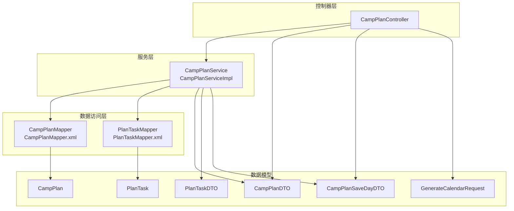
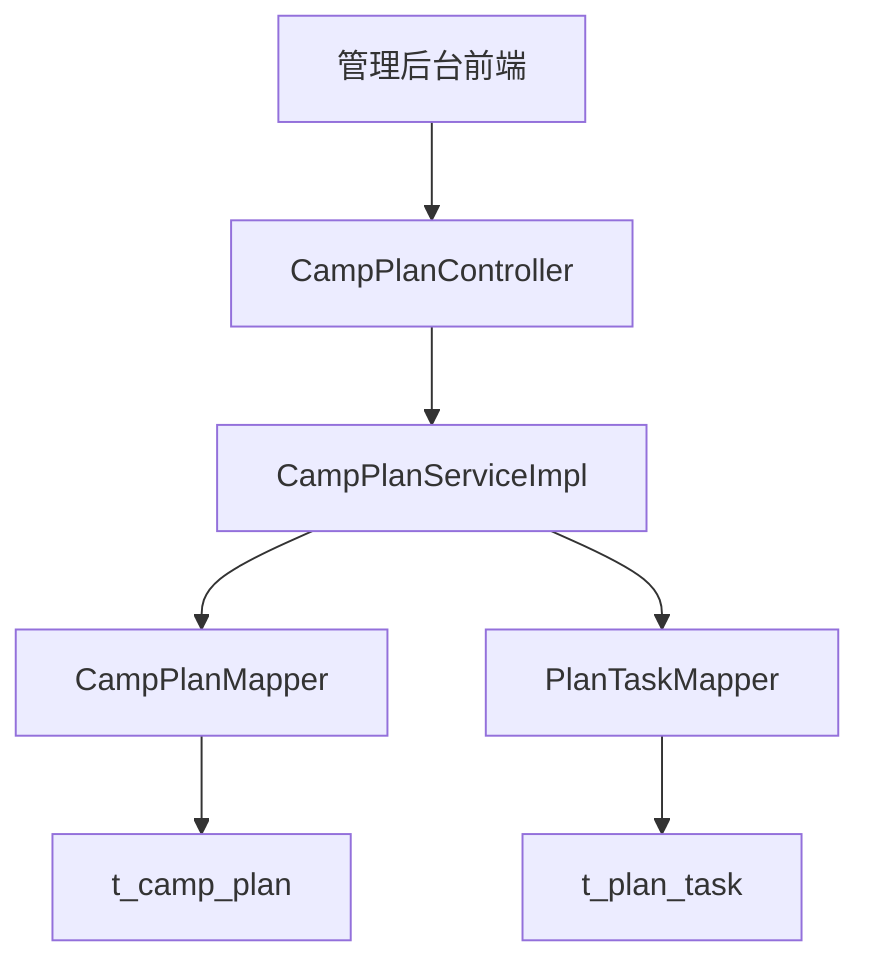
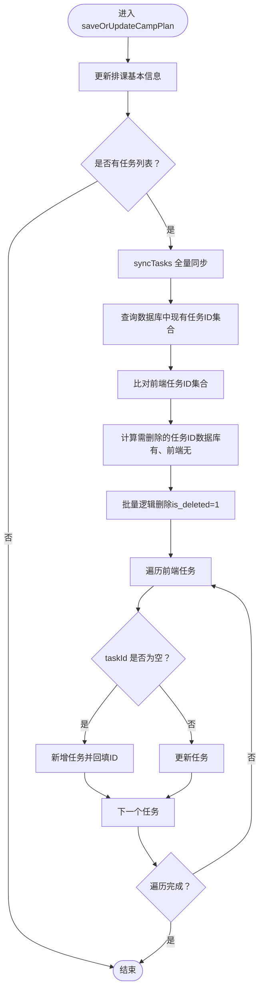
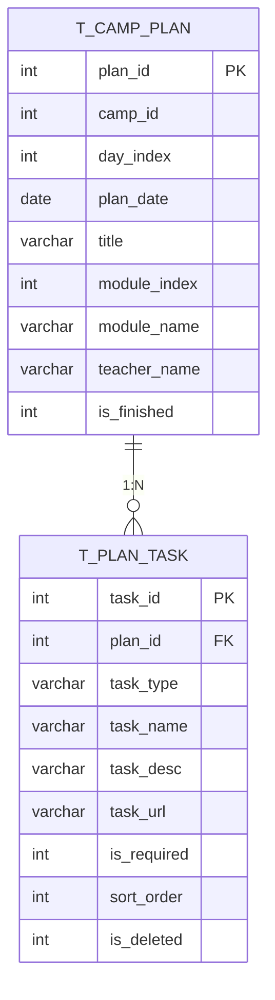
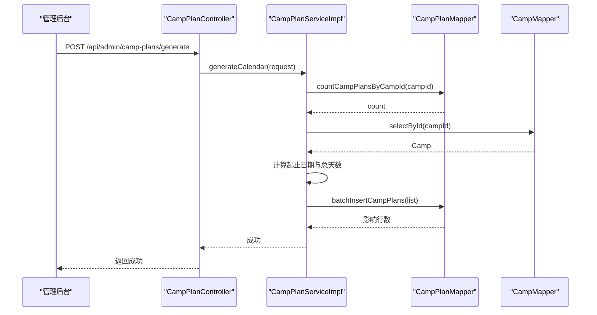
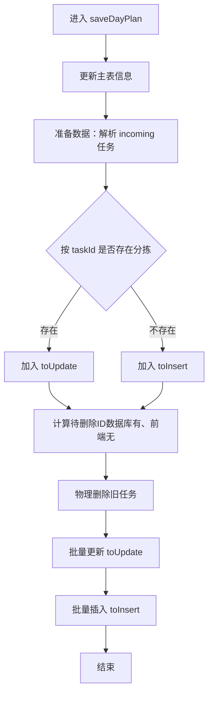
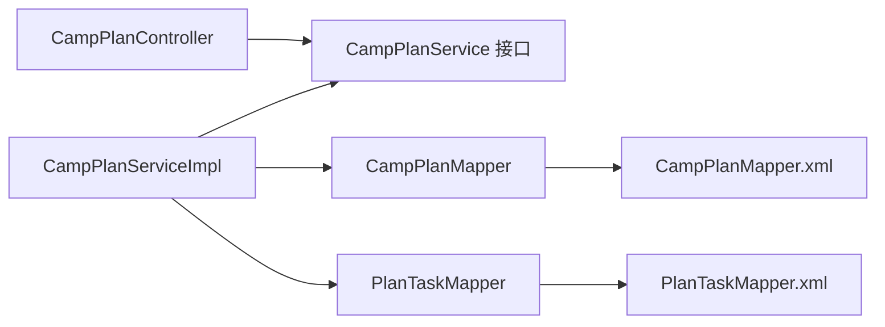

# 教务排课模块

<cite>
**本文引用的文件**   
- [CampPlanController.java](file://src/main/java/com/daily/dailychineseculture/controller/CampPlanController.java)
- [CampPlanService.java](file://src/main/java/com/daily/dailychineseculture/service/CampPlanService.java)
- [CampPlanServiceImpl.java](file://src/main/java/com/daily/dailychineseculture/service/impl/CampPlanServiceImpl.java)
- [CampPlanDTO.java](file://src/main/java/com/daily/dailychineseculture/dto/CampPlanDTO.java)
- [CampPlanSaveDayDTO.java](file://src/main/java/com/daily/dailychineseculture/dto/CampPlanSaveDayDTO.java)
- [GenerateCalendarRequest.java](file://src/main/java/com/daily/dailychineseculture/dto/GenerateCalendarRequest.java)
- [PlanTaskDTO.java](file://src/main/java/com/daily/dailychineseculture/dto/PlanTaskDTO.java)
- [CampPlan.java](file://src/main/java/com/daily/dailychineseculture/entity/CampPlan.java)
- [PlanTask.java](file://src/main/java/com/daily/dailychineseculture/entity/PlanTask.java)
- [CampPlanMapper.java](file://src/main/java/com/daily/dailychineseculture/mapper/CampPlanMapper.java)
- [PlanTaskMapper.java](file://src/main/java/com/daily/dailychineseculture/mapper/PlanTaskMapper.java)
- [CampPlanMapper.xml](file://src/main/resources/mapper/CampPlanMapper.xml)
- [PlanTaskMapper.xml](file://src/main/resources/mapper/PlanTaskMapper.xml)
- [Camp.java](file://src/main/java/com/daily/dailychineseculture/entity/Camp.java)
- [管理后台排课接口现状分析报告.md](file://doc/管理后台排课接口现状分析报告.md)
</cite>

## 目录
1. [简介](#简介)
2. [项目结构](#项目结构)
3. [核心组件](#核心组件)
4. [架构总览](#架构总览)
5. [详细组件分析](#详细组件分析)
6. [依赖分析](#依赖分析)
7. [性能考虑](#性能考虑)
8. [故障排查指南](#故障排查指南)
9. [结论](#结论)
10. [附录](#附录)

## 简介
本模块围绕“教务排课”展开，提供营期日历的生成、排课计划的维护、每日课表的任务管理与全量同步、以及基于营期维度的时间轴查询能力。系统采用分层架构：Controller 负责对外 API；Service 负责业务编排与事务控制；Mapper 负责数据库访问；Entity/DTO 描述数据模型。  
- 支持的功能包括：一键生成空日历、新增/删除/更新排课天、全量同步每日任务、按营期查询排课时间轴、追加新一天排课等。
- 数据模型采用一对多设计：一个排课计划可包含多个任务；任务表支持必修/选修、排序、时长等属性，便于后续扩展。

## 项目结构
- 控制器层：CampPlanController 提供管理后台 API，覆盖查询、生成日历、新增/更新/删除排课、聚合保存当日任务等。
- 服务层：CampPlanService 接口与 CampPlanServiceImpl 实现，负责业务流程编排、事务控制、任务全量同步策略。
- 数据访问层：CampPlanMapper、PlanTaskMapper 提供 CRUD 与统计查询；配套 XML 映射文件定义 SQL。
- 数据模型：CampPlan、PlanTask 实体类与 CampPlanDTO、PlanTaskDTO、CampPlanSaveDayDTO、GenerateCalendarRequest 等 DTO。
- 文档：管理后台排课接口现状分析报告梳理了重构后的数据契约与接口清单。

**图表来源**
- [CampPlanController.java:1-115](file://src/main/java/com/daily/dailychineseculture/controller/CampPlanController.java#L1-L115)
- [CampPlanService.java:1-70](file://src/main/java/com/daily/dailychineseculture/service/CampPlanService.java#L1-L70)
- [CampPlanServiceImpl.java:1-370](file://src/main/java/com/daily/dailychineseculture/service/impl/CampPlanServiceImpl.java#L1-L370)
- [CampPlanMapper.java:1-109](file://src/main/java/com/daily/dailychineseculture/mapper/CampPlanMapper.java#L1-L109)
- [PlanTaskMapper.java:1-137](file://src/main/java/com/daily/dailychineseculture/mapper/PlanTaskMapper.java#L1-L137)
- [CampPlanMapper.xml:1-134](file://src/main/resources/mapper/CampPlanMapper.xml#L1-L134)
- [PlanTaskMapper.xml:1-232](file://src/main/resources/mapper/PlanTaskMapper.xml#L1-L232)
- [CampPlan.java:1-59](file://src/main/java/com/daily/dailychineseculture/entity/CampPlan.java#L1-L59)
- [PlanTask.java:1-70](file://src/main/java/com/daily/dailychineseculture/entity/PlanTask.java#L1-L70)
- [CampPlanDTO.java:1-44](file://src/main/java/com/daily/dailychineseculture/dto/CampPlanDTO.java#L1-L44)
- [PlanTaskDTO.java:1-38](file://src/main/java/com/daily/dailychineseculture/dto/PlanTaskDTO.java#L1-L38)
- [CampPlanSaveDayDTO.java:1-62](file://src/main/java/com/daily/dailychineseculture/dto/CampPlanSaveDayDTO.java#L1-L62)
- [GenerateCalendarRequest.java:1-15](file://src/main/java/com/daily/dailychineseculture/dto/GenerateCalendarRequest.java#L1-L15)

**章节来源**
- [CampPlanController.java:1-115](file://src/main/java/com/daily/dailychineseculture/controller/CampPlanController.java#L1-L115)
- [CampPlanService.java:1-70](file://src/main/java/com/daily/dailychineseculture/service/CampPlanService.java#L1-L70)
- [CampPlanServiceImpl.java:1-370](file://src/main/java/com/daily/dailychineseculture/service/impl/CampPlanServiceImpl.java#L1-L370)
- [CampPlanMapper.java:1-109](file://src/main/java/com/daily/dailychineseculture/mapper/CampPlanMapper.java#L1-L109)
- [PlanTaskMapper.java:1-137](file://src/main/java/com/daily/dailychineseculture/mapper/PlanTaskMapper.java#L1-L137)
- [CampPlanMapper.xml:1-134](file://src/main/resources/mapper/CampPlanMapper.xml#L1-L134)
- [PlanTaskMapper.xml:1-232](file://src/main/resources/mapper/PlanTaskMapper.xml#L1-L232)
- [CampPlan.java:1-59](file://src/main/java/com/daily/dailychineseculture/entity/CampPlan.java#L1-L59)
- [PlanTask.java:1-70](file://src/main/java/com/daily/dailychineseculture/entity/PlanTask.java#L1-L70)
- [CampPlanDTO.java:1-44](file://src/main/java/com/daily/dailychineseculture/dto/CampPlanDTO.java#L1-L44)
- [PlanTaskDTO.java:1-38](file://src/main/java/com/daily/dailychineseculture/dto/PlanTaskDTO.java#L1-L38)
- [CampPlanSaveDayDTO.java:1-62](file://src/main/java/com/daily/dailychineseculture/dto/CampPlanSaveDayDTO.java#L1-L62)
- [GenerateCalendarRequest.java:1-15](file://src/main/java/com/daily/dailychineseculture/dto/GenerateCalendarRequest.java#L1-L15)

## 核心组件
- 排课计划控制器：提供查询、生成日历、新增/更新/删除排课、聚合保存当日任务等接口。
- 排课计划服务：封装业务流程，包括日历生成、排课新增/删除、任务全量同步、追加新一天等。
- 数据访问层：CampPlanMapper/PlanTaskMapper 提供 CRUD、统计与批量操作；XML 映射文件定义 SQL。
- 数据模型：CampPlan/PlanTask 实体类与 DTO，支撑管理后台的数据传输与校验。

**章节来源**
- [CampPlanController.java:1-115](file://src/main/java/com/daily/dailychineseculture/controller/CampPlanController.java#L1-L115)
- [CampPlanService.java:1-70](file://src/main/java/com/daily/dailychineseculture/service/CampPlanService.java#L1-L70)
- [CampPlanServiceImpl.java:1-370](file://src/main/java/com/daily/dailychineseculture/service/impl/CampPlanServiceImpl.java#L1-L370)
- [CampPlanMapper.java:1-109](file://src/main/java/com/daily/dailychineseculture/mapper/CampPlanMapper.java#L1-L109)
- [PlanTaskMapper.java:1-137](file://src/main/java/com/daily/dailychineseculture/mapper/PlanTaskMapper.java#L1-L137)
- [CampPlanMapper.xml:1-134](file://src/main/resources/mapper/CampPlanMapper.xml#L1-L134)
- [PlanTaskMapper.xml:1-232](file://src/main/resources/mapper/PlanTaskMapper.xml#L1-L232)
- [CampPlan.java:1-59](file://src/main/java/com/daily/dailychineseculture/entity/CampPlan.java#L1-L59)
- [PlanTask.java:1-70](file://src/main/java/com/daily/dailychineseculture/entity/PlanTask.java#L1-L70)
- [CampPlanDTO.java:1-44](file://src/main/java/com/daily/dailychineseculture/dto/CampPlanDTO.java#L1-L44)
- [PlanTaskDTO.java:1-38](file://src/main/java/com/daily/dailychineseculture/dto/PlanTaskDTO.java#L1-L38)
- [CampPlanSaveDayDTO.java:1-62](file://src/main/java/com/daily/dailychineseculture/dto/CampPlanSaveDayDTO.java#L1-L62)
- [GenerateCalendarRequest.java:1-15](file://src/main/java/com/daily/dailychineseculture/dto/GenerateCalendarRequest.java#L1-L15)

## 架构总览
系统采用典型的分层架构，职责清晰：
- 控制器层：统一响应包装、参数校验、路由转发。
- 服务层：事务边界、业务编排、任务全量同步策略。
- 数据访问层：SQL 映射、批量操作、统计查询。
- 数据模型：实体与 DTO 解耦，便于前后端交互与校验。

**图表来源**
- [CampPlanController.java:1-115](file://src/main/java/com/daily/dailychineseculture/controller/CampPlanController.java#L1-L115)
- [CampPlanServiceImpl.java:1-370](file://src/main/java/com/daily/dailychineseculture/service/impl/CampPlanServiceImpl.java#L1-L370)
- [CampPlanMapper.java:1-109](file://src/main/java/com/daily/dailychineseculture/mapper/CampPlanMapper.java#L1-L109)
- [PlanTaskMapper.java:1-137](file://src/main/java/com/daily/dailychineseculture/mapper/PlanTaskMapper.java#L1-L137)
- [CampPlanMapper.xml:1-134](file://src/main/resources/mapper/CampPlanMapper.xml#L1-L134)
- [PlanTaskMapper.xml:1-232](file://src/main/resources/mapper/PlanTaskMapper.xml#L1-L232)

## 详细组件分析

### 排课计划控制器（CampPlanController）
- 提供的接口：
  - GET /api/admin/camp-plans?campId={campId}：按营期查询排课时间轴（含任务列表）。
  - POST /api/admin/camp-plans/generate：一键生成空日历。
  - POST /api/admin/camp-plans：新增一天的排课。
  - PUT /api/admin/camp-plans：保存/更新单日课表（含任务全量同步）。
  - DELETE /api/admin/camp-plans/{planId}：删除整天排课及挂载的所有任务。
  - PUT /api/admin/camp-plans/save-day：聚合保存单日排课（主表+任务全量刷新）。
  - POST /api/admin/camp-plans/append：追加一天排课。
- 统一响应包装：ResponseResult，便于前端处理。

**章节来源**
- [CampPlanController.java:1-115](file://src/main/java/com/daily/dailychineseculture/controller/CampPlanController.java#L1-L115)

### 排课计划服务（CampPlanService 与实现）
- 核心方法：
  - getCampOptions()：获取营期下拉选项。
  - getCampPlansByCampId(Integer)：按营期查询排课列表，每个计划包含其任务列表。
  - generateCalendar(GenerateCalendarRequest)：根据营期起止时间生成日历框架。
  - saveOrUpdateCampPlan(CampPlanDTO)：更新排课基本信息并全量同步任务。
  - addCampPlan(CampPlanDTO)：新增一天排课。
  - deleteCampPlan(Integer)：删除排课及其任务。
  - saveDayPlan(CampPlanSaveDayDTO)：聚合保存单日排课（主表+任务全量刷新）。
  - appendDay(Integer)：在当前营期下追加新一天排课。
- 事务控制：所有写操作均在事务中执行，异常回滚。
- 任务全量同步策略：
  - 前端传了 taskId 且数据库存在 → 更新；
  - 前端传的 taskId 为空 → 新增；
  - 数据库存在但前端未传 → 逻辑删除（is_deleted=1）。
- 聚合保存策略：先删旧任务，再批量插入新任务，确保一致性。

**图表来源**
- [CampPlanServiceImpl.java:113-172](file://src/main/java/com/daily/dailychineseculture/service/impl/CampPlanServiceImpl.java#L113-L172)

**章节来源**
- [CampPlanService.java:1-70](file://src/main/java/com/daily/dailychineseculture/service/CampPlanService.java#L1-L70)
- [CampPlanServiceImpl.java:1-370](file://src/main/java/com/daily/dailychineseculture/service/impl/CampPlanServiceImpl.java#L1-L370)

### 数据访问层（Mapper 与 XML）
- CampPlanMapper：
  - 查询：按营期查询排课列表、按ID查询、按日期查询、统计总天数等。
  - 写入：批量插入、插入单条、更新、删除。
  - 统计：查询最大 day_index、最大 plan_date、计数等。
- PlanTaskMapper：
  - 查询：按排课ID查询任务列表、按ID查询任务类型、统计必做任务数、统计用户完成必做任务数等。
  - 写入：插入、更新、批量插入。
  - 删除：按ID删除、按排课删除、批量删除、批量逻辑删除。
- XML 映射：
  - CampPlanMapper.xml：定义查询、插入、更新、删除、统计等 SQL。
  - PlanTaskMapper.xml：定义任务查询、统计、批量操作等 SQL。

**图表来源**
- [CampPlanMapper.xml:1-134](file://src/main/resources/mapper/CampPlanMapper.xml#L1-L134)
- [PlanTaskMapper.xml:1-232](file://src/main/resources/mapper/PlanTaskMapper.xml#L1-L232)

**章节来源**
- [CampPlanMapper.java:1-109](file://src/main/java/com/daily/dailychineseculture/mapper/CampPlanMapper.java#L1-L109)
- [PlanTaskMapper.java:1-137](file://src/main/java/com/daily/dailychineseculture/mapper/PlanTaskMapper.java#L1-L137)
- [CampPlanMapper.xml:1-134](file://src/main/resources/mapper/CampPlanMapper.xml#L1-L134)
- [PlanTaskMapper.xml:1-232](file://src/main/resources/mapper/PlanTaskMapper.xml#L1-L232)

### 数据模型（实体与 DTO）
- 实体类：
  - CampPlan：排课计划实体，包含 campId、dayIndex、planDate、title、moduleIndex、moduleName、teacherName、isFinished 等。
  - PlanTask：任务实体，包含 taskType、taskName、taskDesc、taskUrl、isRequired、sortOrder、isDeleted 等。
- DTO：
  - CampPlanDTO：用于管理后台传输，包含 tasks 列表。
  - PlanTaskDTO：任务信息 DTO，包含任务类型、名称、描述、链接、时长、是否必修、排序等。
  - CampPlanSaveDayDTO：聚合保存单日排课请求，包含任务列表 CampTask。
  - GenerateCalendarRequest：生成日历请求，包含 campId。

**章节来源**
- [CampPlan.java:1-59](file://src/main/java/com/daily/dailychineseculture/entity/CampPlan.java#L1-L59)
- [PlanTask.java:1-70](file://src/main/java/com/daily/dailychineseculture/entity/PlanTask.java#L1-L70)
- [CampPlanDTO.java:1-44](file://src/main/java/com/daily/dailychineseculture/dto/CampPlanDTO.java#L1-L44)
- [PlanTaskDTO.java:1-38](file://src/main/java/com/daily/dailychineseculture/dto/PlanTaskDTO.java#L1-L38)
- [CampPlanSaveDayDTO.java:1-62](file://src/main/java/com/daily/dailychineseculture/dto/CampPlanSaveDayDTO.java#L1-L62)
- [GenerateCalendarRequest.java:1-15](file://src/main/java/com/daily/dailychineseculture/dto/GenerateCalendarRequest.java#L1-L15)

### 日历生成与时间轴管理
- 一键生成空日历：
  - 校验：若营期已存在排课则拒绝重复生成。
  - 计算：根据营期起止时间计算总天数（含起止日），循环生成每一天的排课计划。
  - 批量插入：一次性插入所有生成的排课计划。
- 时间轴查询：
  - 按营期查询排课列表，每个计划包含其任务列表，支持按 dayIndex 升序排列。
  - 提供按日期查询、统计总天数、查询最近课程等功能。

**图表来源**
- [CampPlanController.java:42-53](file://src/main/java/com/daily/dailychineseculture/controller/CampPlanController.java#L42-L53)
- [CampPlanServiceImpl.java:66-107](file://src/main/java/com/daily/dailychineseculture/service/impl/CampPlanServiceImpl.java#L66-L107)
- [CampPlanMapper.java:42-53](file://src/main/java/com/daily/dailychineseculture/mapper/CampPlanMapper.java#L42-L53)
- [CampPlanMapper.xml:34-41](file://src/main/resources/mapper/CampPlanMapper.xml#L34-L41)

**章节来源**
- [CampPlanServiceImpl.java:66-107](file://src/main/java/com/daily/dailychineseculture/service/impl/CampPlanServiceImpl.java#L66-L107)
- [CampPlanMapper.java:42-53](file://src/main/java/com/daily/dailychineseculture/mapper/CampPlanMapper.java#L42-L53)
- [CampPlanMapper.xml:14-41](file://src/main/resources/mapper/CampPlanMapper.xml#L14-L41)

### 任务时间轴管理与全量同步
- 全量同步策略：
  - 查询数据库中现有任务ID集合；
  - 比对前端任务ID集合；
  - 计算需删除的任务ID并批量逻辑删除；
  - 遍历前端任务：taskId 为空则新增，否则更新。
- 聚合保存策略：
  - 先更新主表信息；
  - 物理删除该日所有旧任务；
  - 遍历前端任务，强制设置 planId 并置空 ID，批量插入新任务。

**图表来源**
- [CampPlanServiceImpl.java:262-314](file://src/main/java/com/daily/dailychineseculture/service/impl/CampPlanServiceImpl.java#L262-L314)

**章节来源**
- [CampPlanServiceImpl.java:137-172](file://src/main/java/com/daily/dailychineseculture/service/impl/CampPlanServiceImpl.java#L137-L172)
- [CampPlanServiceImpl.java:262-314](file://src/main/java/com/daily/dailychineseculture/service/impl/CampPlanServiceImpl.java#L262-L314)

### 课程安排优化与教室调度策略
- 当前实现聚焦于“任务管理”与“排课计划维护”，未直接暴露教室/教师资源分配与时间冲突检测的具体算法。
- 从数据模型可见，排课计划实体包含 moduleIndex、moduleName、teacherName、isFinished 等字段，具备扩展空间以支持更复杂的课程安排与调度策略（例如按模块/教师维度进行资源分配与冲突检测）。
- 建议在后续版本中引入资源约束校验与优化算法，结合任务的时长、类型、是否必修等属性进行智能排课。

**章节来源**
- [CampPlan.java:1-59](file://src/main/java/com/daily/dailychineseculture/entity/CampPlan.java#L1-L59)
- [PlanTask.java:1-70](file://src/main/java/com/daily/dailychineseculture/entity/PlanTask.java#L1-L70)

### 排课数据操作示例
- 批量导入：
  - 使用聚合保存接口 /api/admin/camp-plans/save-day，传入当天任务列表，系统将物理删除旧任务并批量插入新任务。
- 智能排课：
  - 当前未提供自动排课算法；可在任务 DTO 中补充时长、优先级等字段后，结合业务规则实现智能排课。
- 手动调整：
  - 通过 /api/admin/camp-plans 接口新增/更新排课，或使用 /api/admin/camp-plans/save-day 进行全量同步。

**章节来源**
- [CampPlanController.java:96-100](file://src/main/java/com/daily/dailychineseculture/controller/CampPlanController.java#L96-L100)
- [CampPlanServiceImpl.java:262-314](file://src/main/java/com/daily/dailychineseculture/service/impl/CampPlanServiceImpl.java#L262-L314)

### 排课统计分析、教室利用率监控与教师工作量评估
- 统计查询：
  - 可通过 PlanTaskMapper 查询某排课下的必做任务数量、用户完成必做任务数量等。
- 教室利用率与教师工作量：
  - 当前未提供专门的统计接口；可在现有查询基础上扩展，结合任务时长、类型、教师字段等进行聚合统计。

**章节来源**
- [PlanTaskMapper.java:25-45](file://src/main/java/com/daily/dailychineseculture/mapper/PlanTaskMapper.java#L25-L45)
- [PlanTaskMapper.xml:26-45](file://src/main/resources/mapper/PlanTaskMapper.xml#L26-L45)

### 冲突解决、应急预案与变更通知机制
- 冲突检测：
  - 当前未实现时间冲突检测与资源冲突检测；可在服务层增加校验逻辑，如基于任务时长与排序进行冲突判断。
- 应急预案：
  - 提供删除整日排课接口，便于快速回退。
- 变更通知：
  - 可在服务层增加事件发布或监听器，对排课变更进行异步通知。

**章节来源**
- [CampPlanController.java:83-94](file://src/main/java/com/daily/dailychineseculture/controller/CampPlanController.java#L83-L94)
- [CampPlanServiceImpl.java:235-246](file://src/main/java/com/daily/dailychineseculture/service/impl/CampPlanServiceImpl.java#L235-L246)

## 依赖分析
- 组件耦合：
  - Controller 仅依赖 Service 接口，低耦合高内聚。
  - Service 依赖 Mapper 接口，面向接口编程。
  - Mapper 依赖 XML 映射文件，SQL 与 Java 代码解耦。
- 外部依赖：
  - Spring Boot、MyBatis、Lombok、Jakarta Validation 等。

**图表来源**
- [CampPlanController.java:1-115](file://src/main/java/com/daily/dailychineseculture/controller/CampPlanController.java#L1-L115)
- [CampPlanService.java:1-70](file://src/main/java/com/daily/dailychineseculture/service/CampPlanService.java#L1-L70)
- [CampPlanServiceImpl.java:1-370](file://src/main/java/com/daily/dailychineseculture/service/impl/CampPlanServiceImpl.java#L1-L370)
- [CampPlanMapper.java:1-109](file://src/main/java/com/daily/dailychineseculture/mapper/CampPlanMapper.java#L1-L109)
- [PlanTaskMapper.java:1-137](file://src/main/java/com/daily/dailychineseculture/mapper/PlanTaskMapper.java#L1-L137)
- [CampPlanMapper.xml:1-134](file://src/main/resources/mapper/CampPlanMapper.xml#L1-L134)
- [PlanTaskMapper.xml:1-232](file://src/main/resources/mapper/PlanTaskMapper.xml#L1-L232)

**章节来源**
- [CampPlanController.java:1-115](file://src/main/java/com/daily/dailychineseculture/controller/CampPlanController.java#L1-L115)
- [CampPlanService.java:1-70](file://src/main/java/com/daily/dailychineseculture/service/CampPlanService.java#L1-L70)
- [CampPlanServiceImpl.java:1-370](file://src/main/java/com/daily/dailychineseculture/service/impl/CampPlanServiceImpl.java#L1-L370)
- [CampPlanMapper.java:1-109](file://src/main/java/com/daily/dailychineseculture/mapper/CampPlanMapper.java#L1-L109)
- [PlanTaskMapper.java:1-137](file://src/main/java/com/daily/dailychineseculture/mapper/PlanTaskMapper.java#L1-L137)
- [CampPlanMapper.xml:1-134](file://src/main/resources/mapper/CampPlanMapper.xml#L1-L134)
- [PlanTaskMapper.xml:1-232](file://src/main/resources/mapper/PlanTaskMapper.xml#L1-L232)

## 性能考虑
- 批量操作：
  - 日历生成使用批量插入，减少往返次数。
  - 任务全量同步采用批量删除与批量插入，降低事务开销。
- 事务边界：
  - 写操作均在事务中执行，保证一致性。
- 查询优化：
  - 按营期与日期查询时，建议在 camp_id、plan_date 上建立索引。
  - 统计查询可复用现有 SQL，避免重复计算。

**章节来源**
- [CampPlanServiceImpl.java:93-107](file://src/main/java/com/daily/dailychineseculture/service/impl/CampPlanServiceImpl.java#L93-L107)
- [CampPlanServiceImpl.java:262-314](file://src/main/java/com/daily/dailychineseculture/service/impl/CampPlanServiceImpl.java#L262-L314)
- [CampPlanMapper.xml:34-41](file://src/main/resources/mapper/CampPlanMapper.xml#L34-L41)
- [PlanTaskMapper.xml:183-209](file://src/main/resources/mapper/PlanTaskMapper.xml#L183-L209)

## 故障排查指南
- 常见问题与处理：
  - 重复生成日历：若营期已存在排课，系统抛出异常提示“该营期已存在课表，请勿重复生成”。处理方式：先删除旧排课或使用其他营期。
  - 未找到营期：生成日历或新增排课时若营期不存在，系统抛出异常。处理方式：确认 campId 是否正确。
  - 未找到排课计划：删除排课时若排课不存在，系统抛出异常。处理方式：确认 planId 是否正确。
  - 任务同步异常：全量同步任务时若出现异常，事务回滚，保持数据一致性。处理方式：检查前端传参与任务列表。
- 建议：
  - 在 Controller 层捕获并统一返回错误信息。
  - 对关键操作添加日志，便于定位问题。

**章节来源**
- [CampPlanServiceImpl.java:66-91](file://src/main/java/com/daily/dailychineseculture/service/impl/CampPlanServiceImpl.java#L66-L91)
- [CampPlanServiceImpl.java:196-227](file://src/main/java/com/daily/dailychineseculture/service/impl/CampPlanServiceImpl.java#L196-L227)
- [CampPlanServiceImpl.java:235-246](file://src/main/java/com/daily/dailychineseculture/service/impl/CampPlanServiceImpl.java#L235-L246)

## 结论
本模块已实现排课计划的完整 CRUD 与任务全量同步能力，支持一键生成日历、按营期查询时间轴、新增/删除/更新排课、聚合保存当日任务等核心功能。数据模型采用一对多设计，便于后续扩展资源分配与冲突检测。建议在后续版本中引入时间冲突检测、智能排课、教室/教师利用率统计与变更通知机制，以进一步提升系统的智能化与可运维性。

## 附录
- 接口清单（管理后台）：
  - GET /api/admin/camp-plans?campId={campId}
  - POST /api/admin/camp-plans/generate
  - POST /api/admin/camp-plans
  - PUT /api/admin/camp-plans
  - DELETE /api/admin/camp-plans/{planId}
  - PUT /api/admin/camp-plans/save-day
  - POST /api/admin/camp-plans/append

**章节来源**
- [CampPlanController.java:27-113](file://src/main/java/com/daily/dailychineseculture/controller/CampPlanController.java#L27-L113)
- [管理后台排课接口现状分析报告.md:232-241](file://doc/管理后台排课接口现状分析报告.md#L232-L241)