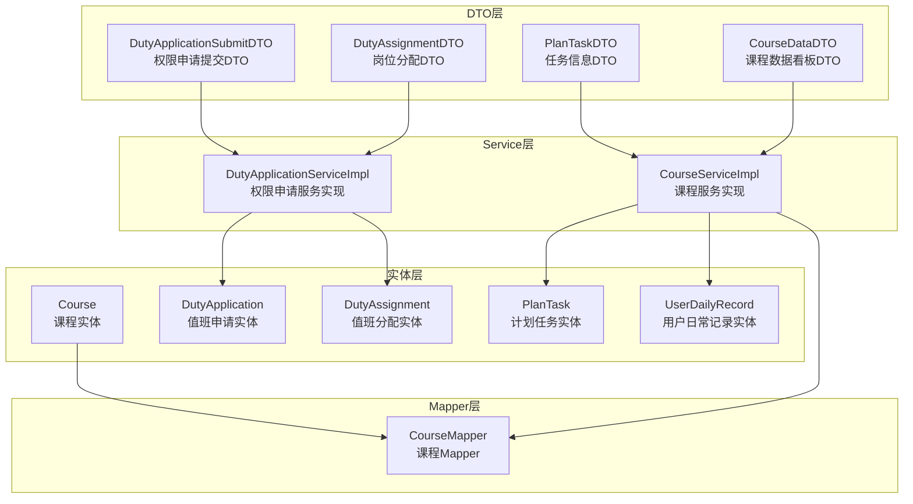
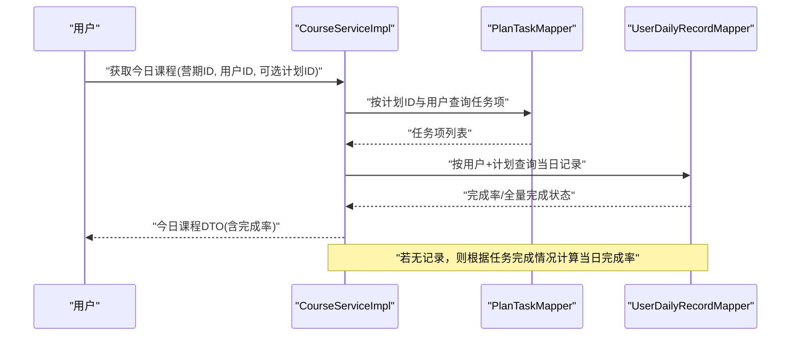
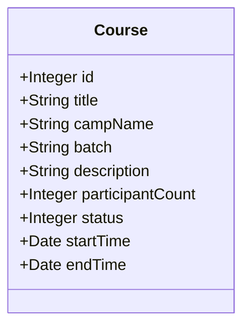
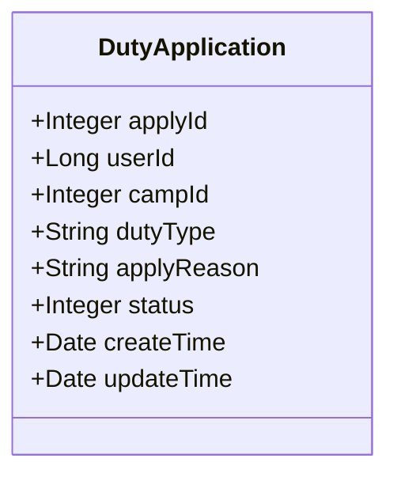
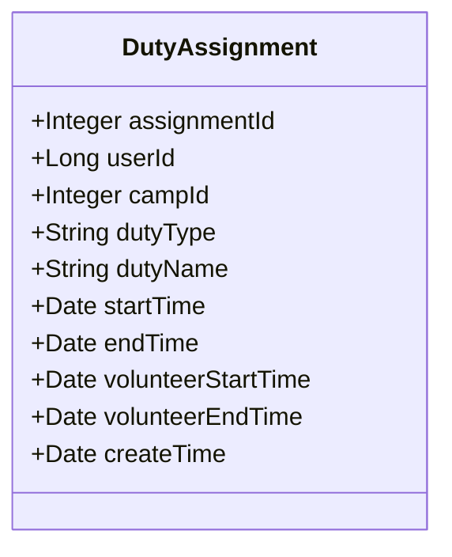
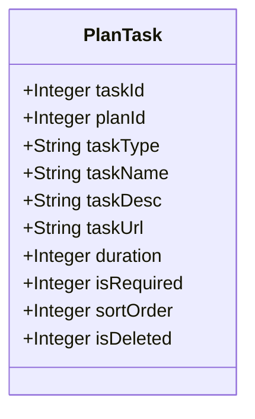
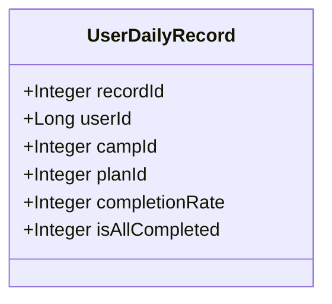
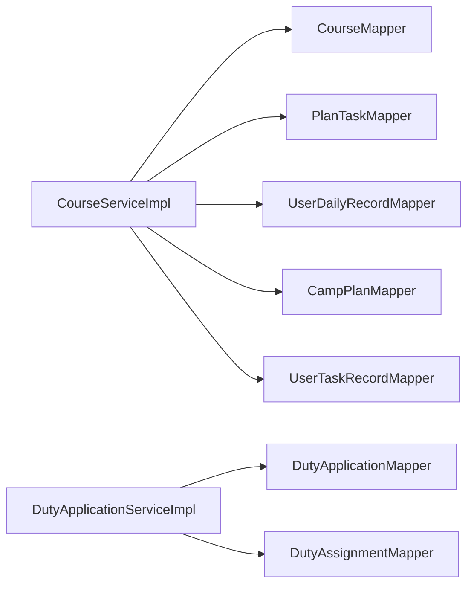

# 其他实体模型

<cite>
**本文引用的文件**
- [Course.java](file://src/main/java/com/daily/dailychineseculture/entity/Course.java)
- [DutyApplication.java](file://src/main/java/com/daily/dailychineseculture/entity/DutyApplication.java)
- [DutyAssignment.java](file://src/main/java/com/daily/dailychineseculture/entity/DutyAssignment.java)
- [PlanTask.java](file://src/main/java/com/daily/dailychineseculture/entity/PlanTask.java)
- [UserDailyRecord.java](file://src/main/java/com/daily/dailychineseculture/entity/UserDailyRecord.java)
- [CourseMapper.java](file://src/main/java/com/daily/dailychineseculture/mapper/CourseMapper.java)
- [CourseServiceImpl.java](file://src/main/java/com/daily/dailychineseculture/service/impl/CourseServiceImpl.java)
- [DutyApplicationServiceImpl.java](file://src/main/java/com/daily/dailychineseculture/service/impl/DutyApplicationServiceImpl.java)
- [DutyApplicationSubmitDTO.java](file://src/main/java/com/daily/dailychineseculture/dto/DutyApplicationSubmitDTO.java)
- [DutyAssignmentDTO.java](file://src/main/java/com/daily/dailychineseculture/dto/DutyAssignmentDTO.java)
- [PlanTaskDTO.java](file://src/main/java/com/daily/dailychineseculture/dto/PlanTaskDTO.java)
- [CourseDataDTO.java](file://src/main/java/com/daily/dailychineseculture/dto/CourseDataDTO.java)
</cite>

## 目录
1. [简介](#简介)
2. [项目结构](#项目结构)
3. [核心组件](#核心组件)
4. [架构总览](#架构总览)
5. [详细组件分析](#详细组件分析)
6. [依赖分析](#依赖分析)
7. [性能考虑](#性能考虑)
8. [故障排查指南](#故障排查指南)
9. [结论](#结论)
10. [附录](#附录)

## 简介
本文件聚焦于系统中的其他实体模型，包括课程实体、值班申请实体、值班分配实体、计划任务实体与用户日常记录实体。我们将从实体设计、字段与约束、业务场景与使用频率、数据流转与事务处理、并发控制、完整性检查以及扩展性与演进方向等方面进行系统化说明，并结合现有Service与Mapper实现展示其在业务流程中的作用。

## 项目结构
围绕“课程”“值班/权限”“计划任务”“用户日常记录”的实体与配套DTO/Mapper/Service，形成清晰的分层结构：
- 实体层：定义数据库表映射的领域对象
- DTO层：封装对外接口的数据传输对象
- Mapper层：基于MyBatis的SQL映射接口
- Service层：编排业务逻辑，负责事务与跨表聚合

图表来源
- [Course.java:1-60](file://src/main/java/com/daily/dailychineseculture/entity/Course.java#L1-L60)
- [DutyApplication.java:1-56](file://src/main/java/com/daily/dailychineseculture/entity/DutyApplication.java#L1-L56)
- [DutyAssignment.java:1-64](file://src/main/java/com/daily/dailychineseculture/entity/DutyAssignment.java#L1-L64)
- [PlanTask.java:1-70](file://src/main/java/com/daily/dailychineseculture/entity/PlanTask.java#L1-L70)
- [UserDailyRecord.java:1-41](file://src/main/java/com/daily/dailychineseculture/entity/UserDailyRecord.java#L1-L41)
- [CourseMapper.java:1-53](file://src/main/java/com/daily/dailychineseculture/mapper/CourseMapper.java#L1-L53)
- [CourseServiceImpl.java:44-399](file://src/main/java/com/daily/dailychineseculture/service/impl/CourseServiceImpl.java#L44-L399)
- [DutyApplicationServiceImpl.java:15-54](file://src/main/java/com/daily/dailychineseculture/service/impl/DutyApplicationServiceImpl.java#L15-L54)
- [DutyApplicationSubmitDTO.java:1-26](file://src/main/java/com/daily/dailychineseculture/dto/DutyApplicationSubmitDTO.java#L1-L26)
- [DutyAssignmentDTO.java:1-72](file://src/main/java/com/daily/dailychineseculture/dto/DutyAssignmentDTO.java#L1-L72)
- [PlanTaskDTO.java:1-38](file://src/main/java/com/daily/dailychineseculture/dto/PlanTaskDTO.java#L1-L38)
- [CourseDataDTO.java:1-36](file://src/main/java/com/daily/dailychineseculture/dto/CourseDataDTO.java#L1-L36)

章节来源
- [Course.java:1-60](file://src/main/java/com/daily/dailychineseculture/entity/Course.java#L1-L60)
- [DutyApplication.java:1-56](file://src/main/java/com/daily/dailychineseculture/entity/DutyApplication.java#L1-L56)
- [DutyAssignment.java:1-64](file://src/main/java/com/daily/dailychineseculture/entity/DutyAssignment.java#L1-L64)
- [PlanTask.java:1-70](file://src/main/java/com/daily/dailychineseculture/entity/PlanTask.java#L1-L70)
- [UserDailyRecord.java:1-41](file://src/main/java/com/daily/dailychineseculture/entity/UserDailyRecord.java#L1-L41)
- [CourseMapper.java:1-53](file://src/main/java/com/daily/dailychineseculture/mapper/CourseMapper.java#L1-L53)
- [CourseServiceImpl.java:44-399](file://src/main/java/com/daily/dailychineseculture/service/impl/CourseServiceImpl.java#L44-L399)
- [DutyApplicationServiceImpl.java:15-54](file://src/main/java/com/daily/dailychineseculture/service/impl/DutyApplicationServiceImpl.java#L15-L54)
- [DutyApplicationSubmitDTO.java:1-26](file://src/main/java/com/daily/dailychineseculture/dto/DutyApplicationSubmitDTO.java#L1-L26)
- [DutyAssignmentDTO.java:1-72](file://src/main/java/com/daily/dailychineseculture/dto/DutyAssignmentDTO.java#L1-L72)
- [PlanTaskDTO.java:1-38](file://src/main/java/com/daily/dailychineseculture/dto/PlanTaskDTO.java#L1-L38)
- [CourseDataDTO.java:1-36](file://src/main/java/com/daily/dailychineseculture/dto/CourseDataDTO.java#L1-L36)

## 核心组件
本节对五个实体进行字段设计原则、数据类型与约束的归纳，并给出典型业务场景与使用频率。

- 课程实体（Course）
  - 设计要点：以营期为核心标识，包含标题、批次、描述、参与人数、状态、起止时间等；用于课程列表与详情展示。
  - 字段与约束：整型ID、字符串标题/描述/批次、整型状态、日期时间；查询时过滤“进行中且未结束”的课程。
  - 业务场景：课程列表分页、课程详情、课程数据看板。
  - 使用频率：高频（列表/详情）、中频（看板）。

- 值班申请实体（DutyApplication）
  - 设计要点：记录用户权限申请，支持全局权限类型；包含申请理由、状态（待审/已过/未过/已撤）与时间戳。
  - 字段与约束：整型主键、长整型用户ID、整型营期ID（可空）、字符串权限类型、整型状态、日期时间。
  - 业务场景：权限申请提交、重复申请拦截、重复授权拦截。
  - 使用频率：低频（申请），中频（审核侧查询）。

- 值班分配实体（DutyAssignment）
  - 设计要点：记录用户被授予的全局/营期级权限，含生效时间区间与志愿者服务时间区间。
  - 字段与约束：整型主键、长整型用户ID、整型营期ID（可空）、字符串类型/名称、日期时间。
  - 业务场景：权限生效、范围计算、岗位管理。
  - 使用频率：低频（新增/变更），中频（权限校验）。

- 计划任务实体（PlanTask）
  - 设计要点：承载排课计划下的具体任务项，支持视频/阅读/作业等类型、必修/选修、排序与逻辑删除。
  - 字段与约束：整型ID、整型计划ID、字符串类型枚举、字符串名称/描述/URL、整型时长、整型必修标志、整型排序、整型删除标记。
  - 业务场景：任务列表、任务完成统计、必修任务计数。
  - 使用频率：高频（任务列表/完成）。

- 用户日常记录实体（UserDailyRecord）
  - 设计要点：记录用户在某计划日的完成率与全量完成状态，支撑课程数据看板与成就体系。
  - 字段与约束：整型主键、长整型用户ID、整型营期/计划ID、整型完成率、整型全量完成标志。
  - 业务场景：当日/历史任务完成率汇总、看板趋势与成就计算。
  - 使用频率：高频（每日更新）。

章节来源
- [Course.java:1-60](file://src/main/java/com/daily/dailychineseculture/entity/Course.java#L1-L60)
- [DutyApplication.java:1-56](file://src/main/java/com/daily/dailychineseculture/entity/DutyApplication.java#L1-L56)
- [DutyAssignment.java:1-64](file://src/main/java/com/daily/dailychineseculture/entity/DutyAssignment.java#L1-L64)
- [PlanTask.java:1-70](file://src/main/java/com/daily/dailychineseculture/entity/PlanTask.java#L1-L70)
- [UserDailyRecord.java:1-41](file://src/main/java/com/daily/dailychineseculture/entity/UserDailyRecord.java#L1-L41)

## 架构总览
课程与任务/记录的关系贯穿“今日课程”“课程数据看板”等核心流程；权限申请与分配则保障系统访问控制与岗位管理。

图表来源
- [CourseServiceImpl.java:147-213](file://src/main/java/com/daily/dailychineseculture/service/impl/CourseServiceImpl.java#L147-L213)
- [PlanTask.java:1-70](file://src/main/java/com/daily/dailychineseculture/entity/PlanTask.java#L1-L70)
- [UserDailyRecord.java:1-41](file://src/main/java/com/daily/dailychineseculture/entity/UserDailyRecord.java#L1-L41)

## 详细组件分析

### 课程实体（Course）
- 设计原则
  - 以营期为中心的课程视图，字段映射到t_camp表的关键列，便于统一课程列表与详情展示。
  - 状态与时间过滤确保仅返回进行中的课程。
- 关键字段
  - id、title、campName、batch、description、participantCount、status、startTime、endTime
- 业务场景
  - 课程列表分页、课程详情查询、课程数据看板所需的基础信息。
- 使用频率
  - 列表/详情：高频；看板：中频。

图表来源
- [Course.java:1-60](file://src/main/java/com/daily/dailychineseculture/entity/Course.java#L1-L60)

章节来源
- [Course.java:1-60](file://src/main/java/com/daily/dailychineseculture/entity/Course.java#L1-L60)
- [CourseMapper.java:1-53](file://src/main/java/com/daily/dailychineseculture/mapper/CourseMapper.java#L1-L53)

### 值班申请实体（DutyApplication）
- 设计原则
  - 申请与授权分离：申请实体仅记录申请，授权实体记录已生效权限。
  - 通过状态字段与时间戳实现申请生命周期管理。
- 关键字段
  - applyId、userId、campId（可空）、dutyType、applyReason、status、createTime、updateTime
- 业务场景
  - 权限申请提交、重复申请拦截、重复授权拦截。
- 使用频率
  - 低频申请，中频审核侧查询。

图表来源
- [DutyApplication.java:1-56](file://src/main/java/com/daily/dailychineseculture/entity/DutyApplication.java#L1-L56)

章节来源
- [DutyApplication.java:1-56](file://src/main/java/com/daily/dailychineseculture/entity/DutyApplication.java#L1-L56)
- [DutyApplicationServiceImpl.java:15-54](file://src/main/java/com/daily/dailychineseculture/service/impl/DutyApplicationServiceImpl.java#L15-L54)
- [DutyApplicationSubmitDTO.java:1-26](file://src/main/java/com/daily/dailychineseculture/dto/DutyApplicationSubmitDTO.java#L1-L26)

### 值班分配实体（DutyAssignment）
- 设计原则
  - 支持全局/营期两级权限，通过开始/结束时间控制有效期；与志愿者服务时间配合。
- 关键字段
  - assignmentId、userId、campId（可空）、dutyType、dutyName、startTime、endTime、volunteerStartTime、volunteerEndTime、createTime
- 业务场景
  - 权限生效范围计算、岗位空缺与分配、管理范围可视化。
- 使用频率
  - 低频新增/变更，中频权限校验。

图表来源
- [DutyAssignment.java:1-64](file://src/main/java/com/daily/dailychineseculture/entity/DutyAssignment.java#L1-L64)

章节来源
- [DutyAssignment.java:1-64](file://src/main/java/com/daily/dailychineseculture/entity/DutyAssignment.java#L1-L64)
- [DutyAssignmentDTO.java:1-72](file://src/main/java/com/daily/dailychineseculture/dto/DutyAssignmentDTO.java#L1-L72)

### 计划任务实体（PlanTask）
- 设计原则
  - 任务类型枚举化（视频/阅读/作业/扩展），必修标志与排序序号保证教学计划的可控性。
  - 逻辑删除避免物理删除带来的数据回溯成本。
- 关键字段
  - taskId、planId、taskType、taskName、taskDesc、taskUrl、duration、isRequired、sortOrder、isDeleted
- 业务场景
  - 任务列表渲染、任务完成统计、必修任务计数。
- 使用频率
  - 高频（任务列表/完成）。

图表来源
- [PlanTask.java:1-70](file://src/main/java/com/daily/dailychineseculture/entity/PlanTask.java#L1-L70)

章节来源
- [PlanTask.java:1-70](file://src/main/java/com/daily/dailychineseculture/entity/PlanTask.java#L1-L70)
- [PlanTaskDTO.java:1-38](file://src/main/java/com/daily/dailychineseculture/dto/PlanTaskDTO.java#L1-L38)

### 用户日常记录实体（UserDailyRecord）
- 设计原则
  - 以“用户-计划日”为粒度记录完成率与全量完成状态，支撑看板与成就体系。
- 关键字段
  - recordId、userId、campId、planId、completionRate、isAllCompleted
- 业务场景
  - 今日课程完成率计算、课程数据看板趋势与成就。
- 使用频率
  - 高频（每日更新）。

图表来源
- [UserDailyRecord.java:1-41](file://src/main/java/com/daily/dailychineseculture/entity/UserDailyRecord.java#L1-L41)

章节来源
- [UserDailyRecord.java:1-41](file://src/main/java/com/daily/dailychineseculture/entity/UserDailyRecord.java#L1-L41)
- [CourseDataDTO.java:1-36](file://src/main/java/com/daily/dailychineseculture/dto/CourseDataDTO.java#L1-L36)

## 依赖分析
- CourseServiceImpl依赖多个Mapper：课程列表、排课计划、计划任务、用户任务记录、用户日常记录、营期信息等，体现其作为课程域核心服务的聚合能力。
- DutyApplicationServiceImpl依赖申请与分配Mapper，实现“重复申请/重复授权”的双重拦截。
- DTO与实体之间存在映射关系：如PlanTaskDTO用于任务信息输入，CourseDataDTO用于输出课程看板指标。

图表来源
- [CourseServiceImpl.java:44-399](file://src/main/java/com/daily/dailychineseculture/service/impl/CourseServiceImpl.java#L44-L399)
- [DutyApplicationServiceImpl.java:15-54](file://src/main/java/com/daily/dailychineseculture/service/impl/DutyApplicationServiceImpl.java#L15-L54)

章节来源
- [CourseServiceImpl.java:44-399](file://src/main/java/com/daily/dailychineseculture/service/impl/CourseServiceImpl.java#L44-L399)
- [DutyApplicationServiceImpl.java:15-54](file://src/main/java/com/daily/dailychineseculture/service/impl/DutyApplicationServiceImpl.java#L15-L54)

## 性能考虑
- 查询优化
  - CourseMapper对课程列表采用“状态=进行中且未结束”的过滤条件，减少无效数据扫描。
  - CourseServiceImpl在计算完成率时优先使用已有记录，避免重复计算。
- 事务与一致性
  - 任务完成流程使用@Transactional，确保“任务完成记录+日均完成率+全量完成状态+进度事件”原子性。
- 缓存与热点
  - 用户日常记录按日更新，建议在缓存层对近期热点数据进行短期缓存，降低数据库压力。
- 并发控制
  - 任务完成接口通过数据库层面的upsert与计数查询保证并发安全；建议在高并发场景引入乐观锁或队列削峰。

章节来源
- [CourseMapper.java:1-53](file://src/main/java/com/daily/dailychineseculture/mapper/CourseMapper.java#L1-L53)
- [CourseServiceImpl.java:226-268](file://src/main/java/com/daily/dailychineseculture/service/impl/CourseServiceImpl.java#L226-L268)

## 故障排查指南
- 权限申请重复问题
  - 现象：提交申请时报“有待审核同类申请”或“已拥有该权限”。
  - 排查：确认申请状态与用户权限是否存在冲突；检查DTO字段校验与拦截逻辑。
- 任务完成异常
  - 现象：完成任务后完成率不变或报错。
  - 排查：确认任务是否属于当前计划、用户任务记录是否正确upsert、必修任务计数是否准确。
- 课程数据看板异常
  - 现象：完成天数/总体完成率与预期不符。
  - 排查：核对UserDailyRecord数据是否按时更新、计划日期与当日日期映射逻辑。

章节来源
- [DutyApplicationServiceImpl.java:24-53](file://src/main/java/com/daily/dailychineseculture/service/impl/DutyApplicationServiceImpl.java#L24-L53)
- [CourseServiceImpl.java:226-358](file://src/main/java/com/daily/dailychineseculture/service/impl/CourseServiceImpl.java#L226-L358)

## 结论
上述实体模型围绕“课程—任务—记录—权限”的核心业务闭环展开，具备清晰的职责边界与稳定的字段设计。通过Service层的事务编排与DTO的输入输出规范，系统实现了从课程列表到任务完成再到数据看板的完整路径。建议后续在权限范围计算、任务类型扩展与成就体系增强方面持续演进。

## 附录
- 数据完整性与约束
  - 申请状态与时间戳：通过状态字段与创建/更新时间保障申请生命周期可追踪。
  - 任务类型枚举：通过DTO正则校验与实体枚举值约束，确保任务类型合法。
  - 逻辑删除：计划任务采用isDeleted字段，避免误删。
- 事务与并发
  - 任务完成流程使用@Transactional，结合upsert与计数查询，保证并发安全。
- 扩展性与演进方向
  - 权限类型扩展：在DutyApplication/DutyAssignment中增加更多权限维度。
  - 任务类型扩展：在PlanTask中引入更多任务类型与属性。
  - 成就体系：在CourseDataDTO中扩展更多徽章与统计指标。