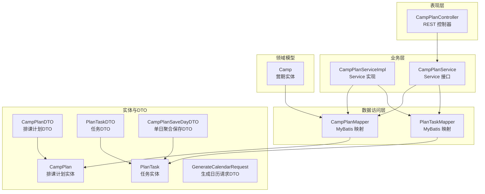
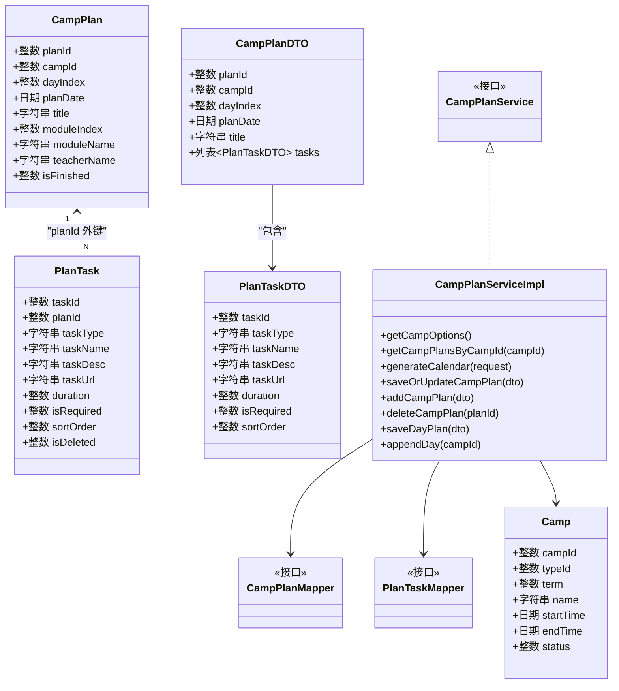
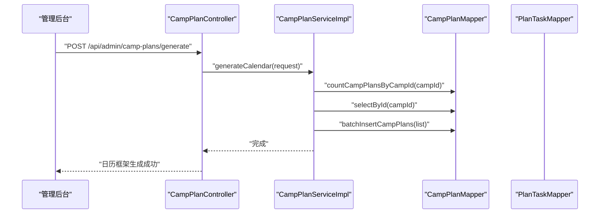
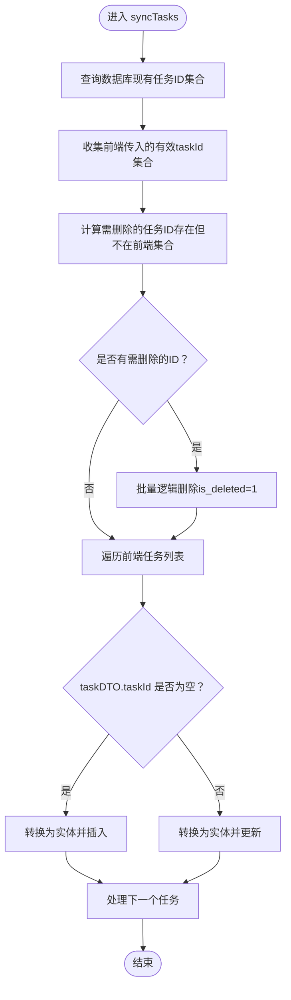
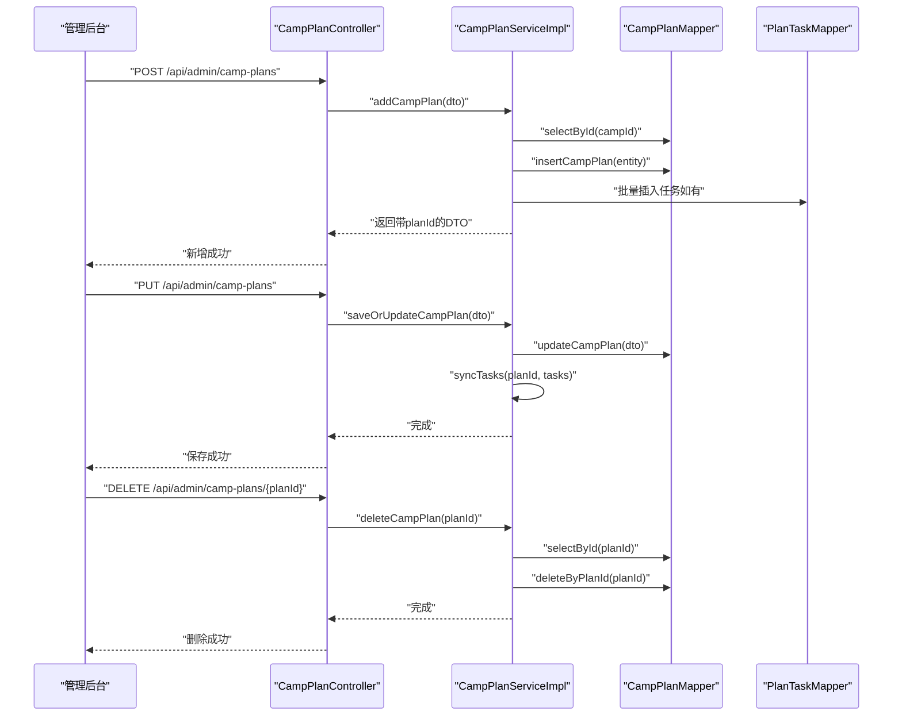
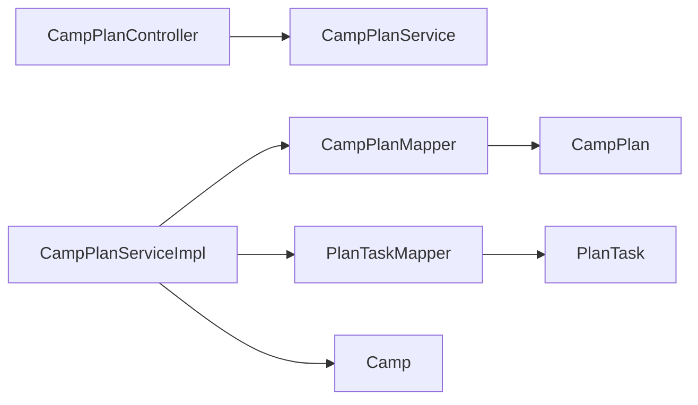

# 排课计划实体模型

<cite>
**本文引用的文件**
- [CampPlan.java](file://src/main/java/com/daily/dailychineseculture/entity/CampPlan.java)
- [PlanTask.java](file://src/main/java/com/daily/dailychineseculture/entity/PlanTask.java)
- [PlanTaskDTO.java](file://src/main/java/com/daily/dailychineseculture/dto/PlanTaskDTO.java)
- [CampPlanDTO.java](file://src/main/java/com/daily/dailychineseculture/dto/CampPlanDTO.java)
- [CampPlanAddDayDTO.java](file://src/main/java/com/daily/dailychineseculture/dto/CampPlanAddDayDTO.java)
- [CampPlanSaveDayDTO.java](file://src/main/java/com/daily/dailychineseculture/dto/CampPlanSaveDayDTO.java)
- [GenerateCalendarRequest.java](file://src/main/java/com/daily/dailychineseculture/dto/GenerateCalendarRequest.java)
- [CampPlanService.java](file://src/main/java/com/daily/dailychineseculture/service/CampPlanService.java)
- [CampPlanServiceImpl.java](file://src/main/java/com/daily/dailychineseculture/service/impl/CampPlanServiceImpl.java)
- [CampPlanMapper.java](file://src/main/java/com/daily/dailychineseculture/mapper/CampPlanMapper.java)
- [PlanTaskMapper.java](file://src/main/java/com/daily/dailychineseculture/mapper/PlanTaskMapper.java)
- [CampPlanMapper.xml](file://src/main/resources/mapper/CampPlanMapper.xml)
- [PlanTaskMapper.xml](file://src/main/resources/mapper/PlanTaskMapper.xml)
- [CampPlanController.java](file://src/main/java/com/daily/dailychineseculture/controller/CampPlanController.java)
- [Camp.java](file://src/main/java/com/daily/dailychineseculture/entity/Camp.java)
- [BusinessException.java](file://src/main/java/com/daily/dailychineseculture/common/BusinessException.java)
- [GlobalExceptionHandler.java](file://src/main/java/com/daily/dailychineseculture/common/GlobalExceptionHandler.java)
</cite>

## 目录
1. [简介](#简介)
2. [项目结构](#项目结构)
3. [核心组件](#核心组件)
4. [架构总览](#架构总览)
5. [详细组件分析](#详细组件分析)
6. [依赖分析](#依赖分析)
7. [性能考虑](#性能考虑)
8. [故障排查指南](#故障排查指南)
9. [结论](#结论)
10. [附录](#附录)

## 简介
本文件围绕“排课计划实体模型”展开，系统性阐述 CampPlan 实体类的字段设计、与营期的关联关系、与课程内容（任务）的绑定机制；深入解析排课计划的任务分解结构 PlanTaskDTO，解释时间轴管理与任务全量同步策略；给出排课计划的创建、修改、删除业务流程，以及查询优化与多维检索能力；最后覆盖自动化调度（一键生成日历）与人工干预机制。

## 项目结构
排课模块采用经典的分层架构：Controller 负责对外 API，Service 提供业务编排与事务控制，Mapper 负责持久化访问，实体与 DTO 描述数据结构。CampPlan 与 PlanTask 通过主从关系建立一对多绑定，CampPlanServiceImpl 负责时间轴生成、单日排课聚合保存、任务全量同步等核心逻辑。

**图表来源**
- [CampPlanController.java:1-115](file://src/main/java/com/daily/dailychineseculture/controller/CampPlanController.java#L1-L115)
- [CampPlanService.java:1-70](file://src/main/java/com/daily/dailychineseculture/service/CampPlanService.java#L1-L70)
- [CampPlanServiceImpl.java:1-370](file://src/main/java/com/daily/dailychineseculture/service/impl/CampPlanServiceImpl.java#L1-L370)
- [CampPlanMapper.java:1-109](file://src/main/java/com/daily/dailychineseculture/mapper/CampPlanMapper.java#L1-L109)
- [PlanTaskMapper.java:1-137](file://src/main/java/com/daily/dailychineseculture/mapper/PlanTaskMapper.java#L1-L137)
- [CampPlan.java:1-59](file://src/main/java/com/daily/dailychineseculture/entity/CampPlan.java#L1-L59)
- [PlanTask.java:1-70](file://src/main/java/com/daily/dailychineseculture/entity/PlanTask.java#L1-L70)
- [CampPlanDTO.java:1-44](file://src/main/java/com/daily/dailychineseculture/dto/CampPlanDTO.java#L1-L44)
- [PlanTaskDTO.java:1-38](file://src/main/java/com/daily/dailychineseculture/dto/PlanTaskDTO.java#L1-L38)
- [CampPlanSaveDayDTO.java:1-62](file://src/main/java/com/daily/dailychineseculture/dto/CampPlanSaveDayDTO.java#L1-L62)
- [GenerateCalendarRequest.java:1-15](file://src/main/java/com/daily/dailychineseculture/dto/GenerateCalendarRequest.java#L1-L15)
- [Camp.java:1-64](file://src/main/java/com/daily/dailychineseculture/entity/Camp.java#L1-L64)

**章节来源**
- [CampPlanController.java:1-115](file://src/main/java/com/daily/dailychineseculture/controller/CampPlanController.java#L1-L115)
- [CampPlanService.java:1-70](file://src/main/java/com/daily/dailychineseculture/service/CampPlanService.java#L1-L70)
- [CampPlanServiceImpl.java:1-370](file://src/main/java/com/daily/dailychineseculture/service/impl/CampPlanServiceImpl.java#L1-L370)
- [CampPlanMapper.java:1-109](file://src/main/java/com/daily/dailychineseculture/mapper/CampPlanMapper.java#L1-L109)
- [PlanTaskMapper.java:1-137](file://src/main/java/com/daily/dailychineseculture/mapper/PlanTaskMapper.java#L1-L137)

## 核心组件
- 实体与DTO
  - CampPlan：排课计划实体，承载“营期ID、第几天、具体日期、导读标题、模块索引/名称、讲师姓名、完成状态”等字段。
  - PlanTask：任务实体，承载“任务类型（VIDEO/READ/HOMEWORK/EXTRA）、任务名称、描述、链接、时长、是否必修、排序、逻辑删除标记”等字段。
  - PlanTaskDTO：任务传输对象，用于管理后台任务编辑与展示。
  - CampPlanDTO：排课计划传输对象，包含计划基本信息与任务列表。
  - CampPlanSaveDayDTO：单日聚合保存请求，支持主表与任务列表的全量刷新。
  - GenerateCalendarRequest：一键生成日历请求，输入营期ID。
- Mapper 与 XML
  - CampPlanMapper/PlanTaskMapper：定义查询、插入、更新、删除、批量操作等接口。
  - CampPlanMapper.xml/PlanTaskMapper.xml：SQL 映射，包含按营期查询、按日期查询、任务统计、全量同步等语句。
- Service 与 Controller
  - CampPlanService/CampPlanServiceImpl：提供营期选项、按营期查询排课计划、生成日历、新增/更新/删除排课、单日聚合保存、追加排课等业务。
  - CampPlanController：暴露管理后台 API，统一响应封装。

**章节来源**
- [CampPlan.java:1-59](file://src/main/java/com/daily/dailychineseculture/entity/CampPlan.java#L1-L59)
- [PlanTask.java:1-70](file://src/main/java/com/daily/dailychineseculture/entity/PlanTask.java#L1-L70)
- [PlanTaskDTO.java:1-38](file://src/main/java/com/daily/dailychineseculture/dto/PlanTaskDTO.java#L1-L38)
- [CampPlanDTO.java:1-44](file://src/main/java/com/daily/dailychineseculture/dto/CampPlanDTO.java#L1-L44)
- [CampPlanSaveDayDTO.java:1-62](file://src/main/java/com/daily/dailychineseculture/dto/CampPlanSaveDayDTO.java#L1-L62)
- [GenerateCalendarRequest.java:1-15](file://src/main/java/com/daily/dailychineseculture/dto/GenerateCalendarRequest.java#L1-L15)
- [CampPlanMapper.java:1-109](file://src/main/java/com/daily/dailychineseculture/mapper/CampPlanMapper.java#L1-L109)
- [PlanTaskMapper.java:1-137](file://src/main/java/com/daily/dailychineseculture/mapper/PlanTaskMapper.java#L1-L137)
- [CampPlanMapper.xml:1-134](file://src/main/resources/mapper/CampPlanMapper.xml#L1-L134)
- [PlanTaskMapper.xml:1-232](file://src/main/resources/mapper/PlanTaskMapper.xml#L1-L232)
- [CampPlanService.java:1-70](file://src/main/java/com/daily/dailychineseculture/service/CampPlanService.java#L1-L70)
- [CampPlanServiceImpl.java:1-370](file://src/main/java/com/daily/dailychineseculture/service/impl/CampPlanServiceImpl.java#L1-L370)
- [CampPlanController.java:1-115](file://src/main/java/com/daily/dailychineseculture/controller/CampPlanController.java#L1-L115)

## 架构总览
排课系统以“营期”为中心，CampPlan 作为“时间轴”的节点，PlanTask 作为“每日任务”的载体。Service 层负责业务编排与事务边界，Mapper 层负责与数据库交互，Controller 层提供统一 API。

**图表来源**
- [CampPlan.java:1-59](file://src/main/java/com/daily/dailychineseculture/entity/CampPlan.java#L1-L59)
- [PlanTask.java:1-70](file://src/main/java/com/daily/dailychineseculture/entity/PlanTask.java#L1-L70)
- [CampPlanDTO.java:1-44](file://src/main/java/com/daily/dailychineseculture/dto/CampPlanDTO.java#L1-L44)
- [PlanTaskDTO.java:1-38](file://src/main/java/com/daily/dailychineseculture/dto/PlanTaskDTO.java#L1-L38)
- [CampPlanService.java:1-70](file://src/main/java/com/daily/dailychineseculture/service/CampPlanService.java#L1-L70)
- [CampPlanServiceImpl.java:1-370](file://src/main/java/com/daily/dailychineseculture/service/impl/CampPlanServiceImpl.java#L1-L370)
- [CampPlanMapper.java:1-109](file://src/main/java/com/daily/dailychineseculture/mapper/CampPlanMapper.java#L1-L109)
- [PlanTaskMapper.java:1-137](file://src/main/java/com/daily/dailychineseculture/mapper/PlanTaskMapper.java#L1-L137)
- [Camp.java:1-64](file://src/main/java/com/daily/dailychineseculture/entity/Camp.java#L1-L64)

## 详细组件分析

### 实体模型与字段设计
- CampPlan（排课计划）
  - 关键字段：campId（关联营期）、dayIndex（第几天）、planDate（具体日期）、title（导读标题）、moduleIndex/moduleName（模块索引/名称）、teacherName（讲师姓名）、isFinished（完成状态）。
  - 设计要点：CampPlan 仅承载“时间轴节点”与“导读信息”，不直接存储视频/图文链接，避免数据冗余与耦合。
- PlanTask（任务）
  - 关键字段：taskType（任务类型枚举 VIDEO/READ/HOMEWORK/EXTRA）、taskName、taskDesc、taskUrl、duration、isRequired、sortOrder、isDeleted。
  - 设计要点：任务采用逻辑删除，便于审计与恢复；排序字段支持灵活的时间轴布局。

**章节来源**
- [CampPlan.java:14-58](file://src/main/java/com/daily/dailychineseculture/entity/CampPlan.java#L14-L58)
- [PlanTask.java:13-69](file://src/main/java/com/daily/dailychineseculture/entity/PlanTask.java#L13-L69)

### 时间轴管理与任务绑定
- 时间轴管理
  - 通过 dayIndex 与 planDate 维护线性时间轴；Service 层提供“追加一天排课”逻辑，基于现有最大 dayIndex 与最晚 planDate 自动推导新日期。
  - 支持“一键生成空日历”：根据营期起止时间批量生成排课计划，确保时间轴连续。
- 任务绑定机制
  - 一个 CampPlan 下挂载多个 PlanTask，PlanTask 的 planId 指向 CampPlan。
  - 管理后台通过 CampPlanDTO 携带 tasks 列表，实现“主表+任务列表”的聚合保存。

**图表来源**
- [CampPlanController.java:49-53](file://src/main/java/com/daily/dailychineseculture/controller/CampPlanController.java#L49-L53)
- [CampPlanServiceImpl.java:67-107](file://src/main/java/com/daily/dailychineseculture/service/impl/CampPlanServiceImpl.java#L67-L107)
- [CampPlanMapper.java:46-53](file://src/main/java/com/daily/dailychineseculture/mapper/CampPlanMapper.java#L46-L53)

**章节来源**
- [CampPlanServiceImpl.java:320-368](file://src/main/java/com/daily/dailychineseculture/service/impl/CampPlanServiceImpl.java#L320-L368)
- [CampPlanMapper.xml:34-41](file://src/main/resources/mapper/CampPlanMapper.xml#L34-L41)

### 任务分解结构（PlanTaskDTO）与全量同步
- PlanTaskDTO 字段覆盖任务类型、名称、描述、链接、时长、是否必修、排序等，满足管理后台编辑需求。
- 全量同步策略（syncTasks）
  - 前端传入任务列表，Service 层对比数据库现有任务 ID：
    - 前端传 taskId 且数据库存在 → 执行更新；
    - 前端传 taskId 为空 → 执行插入；
    - 数据库存在而前端未传 → 逻辑删除（is_deleted=1）。
  - 该策略确保“以前端为准”的全量刷新，避免遗漏或冗余。

**图表来源**
- [CampPlanServiceImpl.java:137-172](file://src/main/java/com/daily/dailychineseculture/service/impl/CampPlanServiceImpl.java#L137-L172)
- [PlanTaskMapper.java:112-116](file://src/main/java/com/daily/dailychineseculture/mapper/PlanTaskMapper.java#L112-L116)

**章节来源**
- [PlanTaskDTO.java:10-38](file://src/main/java/com/daily/dailychineseculture/dto/PlanTaskDTO.java#L10-L38)
- [CampPlanServiceImpl.java:137-172](file://src/main/java/com/daily/dailychineseculture/service/impl/CampPlanServiceImpl.java#L137-L172)

### 业务操作流程：创建、修改、删除
- 创建（新增一天排课）
  - 校验营期存在性，构造 CampPlan 实体，插入数据库；若携带任务列表则逐条插入并回写任务列表。
- 修改（保存/更新单日课表）
  - 更新排课基本信息；随后调用全量同步策略刷新任务列表。
- 删除（删除整天排课）
  - 校验排课存在性；直接删除排课记录，数据库约束自动清理底层任务。

**图表来源**
- [CampPlanController.java:62-94](file://src/main/java/com/daily/dailychineseculture/controller/CampPlanController.java#L62-L94)
- [CampPlanServiceImpl.java:194-246](file://src/main/java/com/daily/dailychineseculture/service/impl/CampPlanServiceImpl.java#L194-L246)
- [CampPlanMapper.java:67, 74](file://src/main/java/com/daily/dailychineseculture/mapper/CampPlanMapper.java#L67,L74)
- [PlanTaskMapper.java:112-116](file://src/main/java/com/daily/dailychineseculture/mapper/PlanTaskMapper.java#L112-L116)

**章节来源**
- [CampPlanController.java:62-94](file://src/main/java/com/daily/dailychineseculture/controller/CampPlanController.java#L62-L94)
- [CampPlanServiceImpl.java:194-246](file://src/main/java/com/daily/dailychineseculture/service/impl/CampPlanServiceImpl.java#L194-L246)

### 查询优化与多维检索
- 按营期查询排课时间轴
  - 先查询 CampPlan 列表，再逐条查询其下的任务列表；适合小规模营期或前端分页场景。
- 按日期查询单日排课
  - 提供按日期精确匹配的查询接口，便于 C 端查看当日课程。
- 任务统计与完成度
  - 提供统计必做任务数量、用户完成必做任务数量等查询，支撑进度展示。
- 建议的优化方向
  - 将“按营期查询排课列表 + 逐条查询任务”的二次查询合并为 JOIN 查询，减少往返次数。
  - 为 camp_id、plan_date、day_index 建立复合索引，提升时间轴查询性能。
  - 为 is_required、is_deleted 建立索引，加速任务统计与筛选。

**章节来源**
- [CampPlanMapper.java:18-23, 84-89](file://src/main/java/com/daily/dailychineseculture/mapper/CampPlanMapper.java#L18-L23,L84-L89)
- [PlanTaskMapper.java:26-45](file://src/main/java/com/daily/dailychineseculture/mapper/PlanTaskMapper.java#L26-L45)
- [CampPlanMapper.xml:14-25, 84-98](file://src/main/resources/mapper/CampPlanMapper.xml#L14-L25,L84-L98)
- [PlanTaskMapper.xml:67-81, 36-45](file://src/main/resources/mapper/PlanTaskMapper.xml#L67-L81,L36-L45)

### 冲突检测与资源管理
- 冲突检测
  - 代码中未见针对“教师/教室/时段”冲突的显式检测逻辑。当前实现以“按日期/按营期”查询为主，未见跨排课计划的资源占用校验。
- 建议的冲突检测机制
  - 在新增/更新排课时，引入“资源占用校验”步骤：对同一教师/教室在同一时间段内是否存在已排课程进行检查；若冲突则抛出明确错误并阻断事务。
  - 引入“资源占用表”或在业务层维护“时间-资源-排课”的映射，定期清理与校验。

**章节来源**
- [CampPlanServiceImpl.java:67-107](file://src/main/java/com/daily/dailychineseculture/service/impl/CampPlanServiceImpl.java#L67-L107)

### 自动化调度与人工干预
- 自动化调度
  - “一键生成空日历”：根据营期起止时间自动生成连续时间轴，避免手工录入误差。
  - “追加一天排课”：基于现有最大 dayIndex 与最晚 plan_date 自动推导新日期，减少人工计算。
- 人工干预
  - 管理后台支持对任意一天的排课进行编辑、删除与任务全量同步，满足灵活调整需求。
  - 单日聚合保存（saveDayPlan）提供“先删后增”的强一致策略，便于快速修正。

**章节来源**
- [CampPlanServiceImpl.java:67-107](file://src/main/java/com/daily/dailychineseculture/service/impl/CampPlanServiceImpl.java#L67-L107)
- [CampPlanServiceImpl.java:320-368](file://src/main/java/com/daily/dailychineseculture/service/impl/CampPlanServiceImpl.java#L320-L368)
- [CampPlanServiceImpl.java:262-314](file://src/main/java/com/daily/dailychineseculture/service/impl/CampPlanServiceImpl.java#L262-L314)

## 依赖分析
- 组件耦合
  - ServiceImpl 依赖 Mapper 接口与实体类，职责清晰；Controller 仅依赖 Service 接口，便于替换与测试。
- 外部依赖
  - MyBatis 映射文件承担 SQL 逻辑，DAO 层与业务层解耦。
- 潜在风险
  - 逐条查询任务列表可能带来 N+1 查询问题；建议通过 JOIN 合并查询或缓存热点数据。

**图表来源**
- [CampPlanController.java:25-25](file://src/main/java/com/daily/dailychineseculture/controller/CampPlanController.java#L25-L25)
- [CampPlanService.java:13-13](file://src/main/java/com/daily/dailychineseculture/service/CampPlanService.java#L13-L13)
- [CampPlanServiceImpl.java:36-38](file://src/main/java/com/daily/dailychineseculture/service/impl/CampPlanServiceImpl.java#L36-L38)
- [CampPlanMapper.java:15-15](file://src/main/java/com/daily/dailychineseculture/mapper/CampPlanMapper.java#L15-L15)
- [PlanTaskMapper.java:14-14](file://src/main/java/com/daily/dailychineseculture/mapper/PlanTaskMapper.java#L14-L14)

**章节来源**
- [CampPlanController.java:25-25](file://src/main/java/com/daily/dailychineseculture/controller/CampPlanController.java#L25-L25)
- [CampPlanServiceImpl.java:36-38](file://src/main/java/com/daily/dailychineseculture/service/impl/CampPlanServiceImpl.java#L36-L38)

## 性能考虑
- 查询层面
  - 将“按营期查询排课 + 逐条查询任务”改为 JOIN 查询，减少网络往返与循环查询。
  - 为高频查询字段建立索引：camp_id、plan_date、day_index、is_required、is_deleted。
- 写入层面
  - 批量插入/更新任务时，合理控制批次大小，避免单次事务过大导致锁竞争。
- 缓存层面
  - 对近期课程、热门营期的排课计划进行缓存，降低热点查询压力。

## 故障排查指南
- 常见问题
  - 重复生成日历：当营期已存在排课计划时抛出异常，需先清理再生成。
  - 未找到营期/排课：在新增、更新、删除前进行存在性校验。
  - 任务同步异常：确认前端传入的 taskId 与数据库一致性，必要时启用回滚与重试。
- 定位手段
  - 查看 ServiceImpl 中的校验与异常抛出点；
  - 通过 Mapper XML 的 SQL 语句核对查询条件与字段映射；
  - 使用统一响应封装定位接口调用链。

**章节来源**
- [CampPlanServiceImpl.java:71-81, 197-201, 238-242](file://src/main/java/com/daily/dailychineseculture/service/impl/CampPlanServiceImpl.java#L71-L81,L197-L201,L238-L242)
- [CampPlanMapper.xml:28-32, 43-47](file://src/main/resources/mapper/CampPlanMapper.xml#L28-L32,L43-L47)

## 结论
排课计划实体模型以 CampPlan 为核心，通过 PlanTask 实现任务的灵活扩展，形成“时间轴 + 任务列表”的清晰结构。Service 层提供了完善的自动化调度与人工干预能力，支持按营期与日期的多维检索。建议在现有基础上增强资源冲突检测与查询性能优化，进一步提升系统的稳定性与可维护性。

## 附录
- API 清单（管理后台）
  - GET /api/admin/camp-plans?campId={campId}：按营期查询排课时间轴（含任务列表）
  - POST /api/admin/camp-plans/generate：一键生成空日历
  - POST /api/admin/camp-plans：新增一天排课
  - PUT /api/admin/camp-plans：保存/更新单日课表（全量同步任务）
  - DELETE /api/admin/camp-plans/{planId}：删除整天排课
  - PUT /api/admin/camp-plans/save-day：单日聚合保存
  - POST /api/admin/camp-plans/append：追加一天排课

**章节来源**
- [CampPlanController.java:36-113](file://src/main/java/com/daily/dailychineseculture/controller/CampPlanController.java#L36-L113)