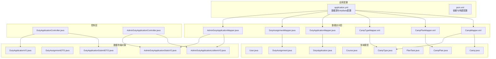
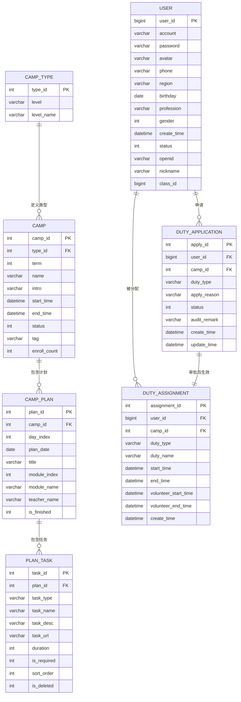
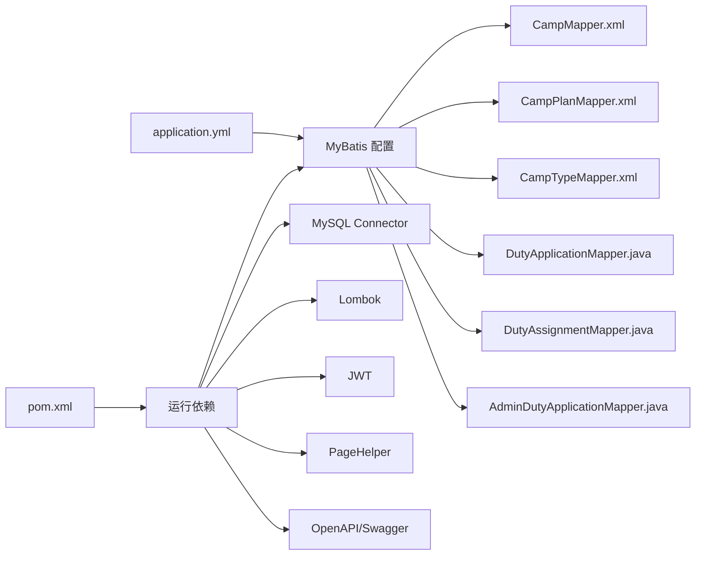

# 数据模型设计

<cite>
**本文引用的文件**
- [User.java](file://src/main/java/com/daily/dailychineseculture/entity/User.java)
- [Camp.java](file://src/main/java/com/daily/dailychineseculture/entity/Camp.java)
- [CampPlan.java](file://src/main/java/com/daily/dailychineseculture/entity/CampPlan.java)
- [Course.java](file://src/main/java/com/daily/dailychineseculture/entity/Course.java)
- [CampType.java](file://src/main/java/com/daily/dailychineseculture/entity/CampType.java)
- [PlanTask.java](file://src/main/java/com/daily/dailychineseculture/entity/PlanTask.java)
- [DutyApplication.java](file://src/main/java/com/daily/dailychineseculture/entity/DutyApplication.java)
- [DutyAssignment.java](file://src/main/java/com/daily/dailychineseculture/entity/DutyAssignment.java)
- [DutyApplicationSubmitDTO.java](file://src/main/java/com/daily/dailychineseculture/dto/DutyApplicationSubmitDTO.java)
- [DutyAssignmentDTO.java](file://src/main/java/com/daily/dailychineseculture/dto/DutyAssignmentDTO.java)
- [DutyApplicationVO.java](file://src/main/java/com/daily/dailychineseculture/vo/DutyApplicationVO.java)
- [AdminDutyApplicationListItemVO.java](file://src/main/java/com/daily/dailychineseculture/vo/AdminDutyApplicationListItemVO.java)
- [AdminDutyApplicationStatsVO.java](file://src/main/java/com/daily/dailychineseculture/vo/AdminDutyApplicationStatsVO.java)
- [DutyApplicationController.java](file://src/main/java/com/daily/dailychineseculture/controller/DutyApplicationController.java)
- [AdminDutyApplicationController.java](file://src/main/java/com/daily/dailychineseculture/controller/AdminDutyApplicationController.java)
- [DutyApplicationMapper.java](file://src/main/java/com/daily/dailychineseculture/mapper/DutyApplicationMapper.java)
- [DutyAssignmentMapper.java](file://src/main/java/com/daily/dailychineseculture/mapper/DutyAssignmentMapper.java)
- [AdminDutyApplicationMapper.java](file://src/main/java/com/daily/dailychineseculture/mapper/AdminDutyApplicationMapper.java)
- [application.yml](file://src/main/resources/application.yml)
- [pom.xml](fileom/pom.xml)
- [CampMapper.xml](file://src/main/resources/mapper/CampMapper.xml)
- [CampPlanMapper.xml](file://src/main/resources/mapper/CampPlanMapper.xml)
- [CampTypeMapper.xml](file://src/main/resources/mapper/CampTypeMapper.xml)
</cite>

## 目录
1. [简介](#简介)
2. [项目结构](#项目结构)
3. [核心组件](#核心组件)
4. [架构概览](#架构概览)
5. [详细组件分析](#详细组件分析)
6. [依赖分析](#依赖分析)
7. [性能考虑](#性能考虑)
8. [故障排除指南](#故障排除指南)
9. [结论](#结论)
10. [附录](#附录)

## 简介
本文件面向数据模型设计，系统性梳理用户、营期、排课计划、课程类型等核心实体的字段定义、数据类型与约束，并基于MyBatis映射文件解析表结构与关系，明确一对一、一对多、多对多映射及外键设计；同时给出主键策略、索引建议、查询优化方案、数据完整性约束、业务规则校验与迁移策略，以及数据安全与隐私保护建议。

**更新** 新增值班申请相关的实体、DTO、VO类的详细说明，包括字段定义、业务含义和使用场景。

## 项目结构
后端采用Spring Boot + MyBatis，数据库连接在应用配置中声明，MyBatis开启下划线转驼峰映射，Mapper XML位于资源目录下。实体类位于entity包，映射器位于resources/mapper目录。

**图表来源**
- [application.yml:1-33](file://src/main/resources/application.yml#L1-L33)
- [pom.xml:1-149](file://pom.xml#L1-L149)
- [CampMapper.xml:1-171](file://src/main/resources/mapper/CampMapper.xml#L1-L171)
- [CampPlanMapper.xml:1-134](file://src/main/resources/mapper/CampPlanMapper.xml#L1-L134)
- [CampTypeMapper.xml:1-59](file://src/main/resources/mapper/CampTypeMapper.xml#L1-L59)
- [DutyApplicationMapper.java:1-71](file://src/main/java/com/daily/dailychineseculture/mapper/DutyApplicationMapper.java#L1-L71)
- [DutyAssignmentMapper.java:1-96](file://src/main/java/com/daily/dailychineseculture/mapper/DutyAssignmentMapper.java#L1-L96)
- [AdminDutyApplicationMapper.java:1-76](file://src/main/java/com/daily/dailychineseculture/mapper/AdminDutyApplicationMapper.java#L1-L76)

**章节来源**
- [application.yml:1-33](file://src/main/resources/application.yml#L1-L33)
- [pom.xml:1-149](file://pom.xml#L1-L149)

## 核心组件
本节聚焦核心实体及其字段语义、数据类型与约束，结合映射文件确认表结构与关系。

- 用户（User）
  - 字段要点：用户ID、账户名、密码、头像、手机号、地域、生日、职业、性别、注册时间、状态、微信OpenID、昵称、班级ID等。
  - 约束与规则：状态通常取值1（正常）、0（冻结）；性别取值0（未知）、1（男）、2（女）；手机号与OpenID可为空但需唯一性约束（见后续"索引与唯一性"）。
  - 关系：与营期报名、任务记录存在潜在一对多或多对多关联（具体以业务表为准）。

- 营期（Camp）
  - 字段要点：营期ID、类型ID、期数、名称、介绍、开营/结营时间、状态、标签、报名人数。
  - 约束与规则：状态取值0（未开始）、1（进行中）、2（已结束）；标签用于营销展示；报名人数用于统计与推荐。
  - 关系：与营期类型（CampType）为多对一；与排课计划（CampPlan）为一对多；与课程（Course）在视图层面存在映射关系。

- 排课计划（CampPlan）
  - 字段要点：计划ID、营期ID、第几天、具体日期、导读标题、模块索引/名称、讲师姓名、完成标记。
  - 约束与规则：day_index用于排序；module_index/module_name用于周次组织；is_finished用于当日完成态。
  - 关系：与营期（Camp）为一对多；与任务（PlanTask）为一对多（见PlanTask.campPlanId）。

- 课程（Course）
  - 字段要点：课程ID（映射为camp_id）、标题（映射为name）、营期名称（映射为name）、批次/期数、描述（映射为intro）、参与人数（映射为enroll_count）、状态、开始/结束时间。
  - 约束与规则：状态取值1（招生中/开课中）、0（已结束）、-1（下架）；用于前端展示与筛选。
  - 关系：与营期（Camp）为1:1视图映射；与排课计划（CampPlan）为1:1视图映射（同一天的课程与计划）。

- 营期类型（CampType）
  - 字段要点：类型ID、等级标识、等级名称。
  - 约束与规则：等级标识用于区分班型（如ML、DX、CY等），等级名称用于展示。
  - 关系：与营期（Camp）为多对一。

- 任务（PlanTask）
  - 字段要点：任务ID、排课计划ID、任务类型（VIDEO/READ/HOMEWORK）、任务名称、描述、链接、建议时长、是否必做、排序序号、逻辑删除标记。
  - 约束与规则：isRequired取值1（必修）、0（选修）；sortOrder用于展示顺序；isDeleted用于软删。
  - 关系：与排课计划（CampPlan）为一对多。

- 权限申请（DutyApplication）
  - 字段要点：申请ID、申请人用户ID、营期ID（可空）、权限类型、申请理由、审核状态、审核备注、创建/更新时间。
  - 约束与规则：状态取值0（待通过）、1（已通过）、2（未通过）、3（已撤销）；营期ID为空表示全局权限申请；审核备注用于管理员审核时的补充说明。
  - 关系：与用户（User）为多对一；与营期（Camp）为多对一（当campId不为空时）。

- 职位分配（DutyAssignment）
  - 字段要点：分配ID、用户ID、营期ID（可空）、职位类型代码、名称、任职起止、志愿者服务起止、创建时间。
  - 约束与规则：营期ID为空表示全局管理员；任职结束时间为空表示永久；支持按用户和职位类型查询有效的任职记录。
  - 关系：与用户（User）为多对一；与营期（Camp）为多对一（当campId不为空时）。

- DTO与VO类
  - DutyApplicationSubmitDTO：权限申请提交DTO，包含权限类型和申请理由两个必填字段。
  - DutyAssignmentDTO：分配岗位DTO，包含管理范围、可分配岗位列表、空缺岗位列表等复杂嵌套结构。
  - DutyApplicationVO：权限申请列表返回VO，包含申请基本信息和状态信息。
  - AdminDutyApplicationListItemVO：审批列表单项VO，包含申请人姓名等关联信息。
  - AdminDutyApplicationStatsVO：审批数据统计VO，包含总数、待审核数、已通过数、未通过数。

**章节来源**
- [User.java:1-87](file://src/main/java/com/daily/dailychineseculture/entity/User.java#L1-L87)
- [Camp.java:1-64](file://src/main/java/com/daily/dailychineseculture/entity/Camp.java#L1-L64)
- [CampPlan.java:1-59](file://src/main/java/com/daily/dailychineseculture/entity/CampPlan.java#L1-L59)
- [Course.java:1-60](file://src/main/java/com/daily/dailychineseculture/entity/Course.java#L1-L60)
- [CampType.java:1-28](file://src/main/java/com/daily/dailychineseculture/entity/CampType.java#L1-L28)
- [PlanTask.java:1-70](file://src/main/java/com/daily/dailychineseculture/entity/PlanTask.java#L1-L70)
- [DutyApplication.java:1-61](file://src/main/java/com/daily/dailychineseculture/entity/DutyApplication.java#L1-L61)
- [DutyAssignment.java:1-64](file://src/main/java/com/daily/dailychineseculture/entity/DutyAssignment.java#L1-L64)
- [DutyApplicationSubmitDTO.java:1-26](file://src/main/java/com/daily/dailychineseculture/dto/DutyApplicationSubmitDTO.java#L1-L26)
- [DutyAssignmentDTO.java:1-72](file://src/main/java/com/daily/dailychineseculture/dto/DutyAssignmentDTO.java#L1-L72)
- [DutyApplicationVO.java:1-43](file://src/main/java/com/daily/dailychineseculture/vo/DutyApplicationVO.java#L1-L43)
- [AdminDutyApplicationListItemVO.java:1-48](file://src/main/java/com/daily/dailychineseculture/vo/AdminDutyApplicationListItemVO.java#L1-L48)
- [AdminDutyApplicationStatsVO.java:1-31](file://src/main/java/com/daily/dailychineseculture/vo/AdminDutyApplicationStatsVO.java#L1-L31)

## 架构概览
下图展示实体间的典型关系与映射路径，映射依据实体类与Mapper XML中的字段与联表查询。

**图表来源**
- [User.java:1-87](file://src/main/java/com/daily/dailychineseculture/entity/User.java#L1-L87)
- [Camp.java:1-64](file://src/main/java/com/daily/dailychineseculture/entity/Camp.java#L1-L64)
- [CampPlan.java:1-59](file://src/main/java/com/daily/dailychineseculture/entity/CampPlan.java#L1-L59)
- [PlanTask.java:1-70](file://src/main/java/com/daily/dailychineseculture/entity/PlanTask.java#L1-L70)
- [DutyApplication.java:1-61](file://src/main/java/com/daily/dailychineseculture/entity/DutyApplication.java#L1-L61)
- [DutyAssignment.java:1-64](file://src/main/java/com/daily/dailychineseculture/entity/DutyAssignment.java#L1-L64)
- [CampType.java:1-28](file://src/main/java/com/daily/dailychineseculture/entity/CampType.java#L1-L28)
- [CampMapper.xml:1-171](file://src/main/resources/mapper/CampMapper.xml#L1-L171)
- [CampPlanMapper.xml:1-134](file://src/main/resources/mapper/CampPlanMapper.xml#L1-L134)
- [CampTypeMapper.xml:1-59](file://src/main/resources/mapper/CampTypeMapper.xml#L1-L59)

## 详细组件分析

### 用户（User）实体
- 主键策略：userId为Long类型，注释说明由Java端计算生成（YYYY+六位编号）。建议在入库前生成唯一ID，避免并发冲突。
- 约束与规则：status取值1/0；gender取值0/1/2；phone与openid建议建立唯一索引以保证去重。
- 关系：与营期报名、任务记录存在潜在关联（具体以业务表为准）。

**章节来源**
- [User.java:10-87](file://src/main/java/com/daily/dailychineseculture/entity/User.java#L10-L87)

### 营期（Camp）实体
- 主键策略：campId为Integer，作为表主键。
- 约束与规则：status取值0/1/2；tag用于营销；enroll_count用于统计。
- 关系：与CampType为多对一；与CampPlan为一对多；Course视图与Camp存在1:1映射。

**章节来源**
- [Camp.java:13-63](file://src/main/java/com/daily/dailychineseculture/entity/Camp.java#L13-L63)
- [CampMapper.xml:103-137](file://src/main/resources/mapper/CampMapper.xml#L103-L137)

### 排课计划（CampPlan）实体
- 主键策略：planId为Integer，自增。
- 约束与规则：day_index用于排序；module_index/module_name组织周次；is_finished标记完成态。
- 关系：与Camp为一对多；与PlanTask为一对多。

**章节来源**
- [CampPlan.java:13-58](file://src/main/java/com/daily/dailychineseculture/entity/CampPlan.java#L13-L58)
- [CampPlanMapper.xml:14-81](file://src/main/resources/mapper/CampPlanMapper.xml#L14-L81)

### 课程（Course）实体
- 主键策略：id为Integer，映射为camp_id；title映射为name，description映射为intro，participantCount映射为enroll_count，startTime/endTime映射为start_time/end_time。
- 约束与规则：status取值1/0/-1；用于前端展示与筛选。

**章节来源**
- [Course.java:13-59](file://src/main/java/com/daily/dailychineseculture/entity/Course.java#L13-L59)
- [CampMapper.xml:140-157](file://src/main/resources/mapper/CampMapper.xml#L140-L157)

### 营期类型（CampType）实体
- 主键策略：typeId为Integer，自增。
- 约束与规则：level用于班型标识，level_name用于展示。

**章节来源**
- [CampType.java:12-27](file://src/main/java/com/daily/dailychineseculture/entity/CampType.java#L12-L27)
- [CampTypeMapper.xml:12-30](file://src/main/resources/mapper/CampTypeMapper.xml#L12-L30)

### 任务（PlanTask）实体
- 主键策略：taskId为Integer，自增。
- 约束与规则：taskType枚举VIDEO/READ/HOMEWORK；isRequired取值1/0；sortOrder控制顺序；isDeleted软删。

**章节来源**
- [PlanTask.java:12-69](file://src/main/java/com/daily/dailychineseculture/entity/PlanTask.java#L12-L69)

### 权限申请（DutyApplication）与职位分配（DutyAssignment）

#### DutyApplication实体
- 主键策略：applyId为Integer，自增主键。
- 字段定义：
  - applyId：申请ID（主键自增）
  - userId：申请人用户ID（外键关联User表）
  - campId：营期ID（允许为null，全局权限申请时为空）
  - dutyType：权限类型（COURSE_ADMIN、ARCHIVE_ADMIN、SUPER_ADMIN）
  - applyReason：申请理由
  - status：审核状态（0-待通过, 1-已通过, 2-未通过, 3-已撤销）
  - auditRemark：审核备注（审核通过/拒绝时的备注信息）
  - createTime/updateTime：创建/更新时间
- 约束与规则：状态取值0/1/2/3；campId为空表示全局权限申请；auditRemark用于管理员审核时的补充说明。
- 关系：与User为多对一；与Camp为多对一（当campId不为空时）。

#### DutyAssignment实体
- 主键策略：assignmentId为Integer，主键。
- 字段定义：
  - assignmentId：职位分配ID（主键）
  - userId：用户ID（外键关联User表）
  - campId：营期ID（全局管理员为null）
  - dutyType：职位类型代码（COURSE_ADMIN、ARCHIVE_ADMIN、SUPER_ADMIN等）
  - dutyName：职位名称
  - startTime：任职开始时间
  - endTime：任职结束时间（null表示永久）
  - volunteerStartTime/volunteerEndTime：志愿者服务起止时间
  - createTime：创建时间
- 约束与规则：campId为空表示全局管理员；endTime为空表示永久任职；支持按用户和职位类型查询有效的任职记录。
- 关系：与User为多对一；与Camp为多对一（当campId不为空时）。

#### DTO与VO类

##### DutyApplicationSubmitDTO
- 用途：权限申请提交DTO
- 字段定义：
  - dutyType：权限类型（必填，可选值：COURSE_ADMIN、ARCHIVE_ADMIN、SUPER_ADMIN）
  - applyReason：申请理由（必填）
- 校验规则：使用@NotBlank注解进行必填校验

##### DutyAssignmentDTO
- 用途：分配岗位DTO，包含复杂的管理范围和岗位信息
- 内部类结构：
  - ManagementScope：管理范围信息（campId、campName、classId、className、bigGroupId、bigGroupName、dutyType）
  - AssignableDuty：可分配的岗位（targetType、targetId、targetName、dutyType、dutyName、isVacant、currentUserId、currentUsername、assignmentId）
  - VacantDuty：空缺岗位（targetType、targetId、targetName、dutyType、dutyName、vacancyReason）

##### DutyApplicationVO
- 用途：权限申请列表返回VO
- 字段定义：applyId、dutyType、applyReason、status、auditRemark、createTime

##### AdminDutyApplicationListItemVO
- 用途：审批列表单项VO
- 字段定义：applyId、userId、applicantName、dutyType、applyReason、status、createTime

##### AdminDutyApplicationStatsVO
- 用途：审批数据统计VO
- 字段定义：total（总申请数）、pending（待审核数）、passed（已通过数）、rejected（未通过数）

**章节来源**
- [DutyApplication.java:1-61](file://src/main/java/com/daily/dailychineseculture/entity/DutyApplication.java#L1-L61)
- [DutyAssignment.java:1-64](file://src/main/java/com/daily/dailychineseculture/entity/DutyAssignment.java#L1-L64)
- [DutyApplicationSubmitDTO.java:1-26](file://src/main/java/com/daily/dailychineseculture/dto/DutyApplicationSubmitDTO.java#L1-L26)
- [DutyAssignmentDTO.java:1-72](file://src/main/java/com/daily/dailychineseculture/dto/DutyAssignmentDTO.java#L1-L72)
- [DutyApplicationVO.java:1-43](file://src/main/java/com/daily/dailychineseculture/vo/DutyApplicationVO.java#L1-L43)
- [AdminDutyApplicationListItemVO.java:1-48](file://src/main/java/com/daily/dailychineseculture/vo/AdminDutyApplicationListItemVO.java#L1-L48)
- [AdminDutyApplicationStatsVO.java:1-31](file://src/main/java/com/daily/dailychineseculture/vo/AdminDutyApplicationStatsVO.java#L1-L31)

## 依赖分析
- MyBatis配置：开启下划线转驼峰映射，Mapper XML位于classpath:mapper/*.xml，便于实体与数据库字段自动映射。
- 数据库连接：MySQL驱动与连接参数在application.yml中配置。
- 依赖：Spring Boot Web、MyBatis、MySQL Connector、Lombok、JWT、分页插件、API文档工具等。

**图表来源**
- [application.yml:17-22](file://src/main/resources/application.yml#L17-L22)
- [pom.xml:32-117](file://pom.xml#L32-L117)

**章节来源**
- [application.yml:1-33](file://src/main/resources/application.yml#L1-L33)
- [pom.xml:1-149](file://pom.xml#L1-L149)

## 性能考虑
- 查询优化
  - 营期列表：按关键字、状态、类型过滤，使用LEFT JOIN联表查询，建议在type_id、start_time、name上建立索引。
  - 排课计划：按camp_id与day_index排序，建议在camp_id、day_index建立复合索引。
  - 课程视图：按tag、enroll_count、start_time排序，建议在tag、enroll_count、end_time建立索引。
  - 值班申请：按user_id、status、create_time排序，建议在user_id、status、create_time建立复合索引。
  - 职位分配：按user_id、duty_type、end_time查询有效任职，建议在user_id、duty_type、end_time建立复合索引。
- 分页与缓存
  - 使用PageHelper进行分页，减少一次性加载大量数据。
  - 对热点数据（如热门课程、营期类型）可引入Redis缓存。
- 写入优化
  - 批量插入排课计划使用foreach批量写入，减少往返。
  - 报名人数更新使用原子操作（自增），避免并发竞争。
  - 值班申请插入使用useGeneratedKeys自增主键策略。

**章节来源**
- [CampMapper.xml:19-81](file://src/main/resources/mapper/CampMapper.xml#L19-L81)
- [CampPlanMapper.xml:34-47](file://src/main/resources/mapper/CampPlanMapper.xml#L34-L47)
- [CampMapper.xml:159-171](file://src/main/resources/mapper/CampMapper.xml#L159-L171)
- [DutyApplicationMapper.java:20-23](file://src/main/java/com/daily/dailychineseculture/mapper/DutyApplicationMapper.java#L20-L23)
- [DutyAssignmentMapper.java:23-27](file://src/main/java/com/daily/dailychineseculture/mapper/DutyAssignmentMapper.java#L23-L27)

## 故障排除指南
- 数据库连接失败
  - 检查application.yml中的数据库URL、用户名、密码与时区设置。
  - 确认MySQL服务可达且允许远程访问。
- 字段映射异常
  - 确认实体类字段与数据库列名一致（MyBatis已开启下划线转驼峰）。
  - 检查Mapper XML中的resultMap与SQL列别名是否匹配。
- 主键生成问题
  - 确认实体主键是否配置useGeneratedKeys与keyProperty。
  - DutyApplication使用@Options(useGeneratedKeys = true, keyProperty = "applyId")。
- 逻辑删除与软删
  - PlanTask的isDeleted字段用于软删，查询时需过滤该标志。
- 值班申请相关问题
  - 防重复申请校验：selectPendingApplication查询用户是否存在待审核的同类申请。
  - 权限校验：selectByUserIdAndDutyType查询用户有效的职位权限信息。
  - 数据隔离：AdminDutyApplicationMapper根据currentRole实现角色权限隔离。

**章节来源**
- [application.yml:6-11](file://src/main/resources/application.yml#L6-L11)
- [CampMapper.xml:103-137](file://src/main/resources/mapper/CampMapper.xml#L103-L137)
- [CampPlanMapper.xml:44-47](file://src/main/resources/mapper/CampPlanMapper.xml#L44-L47)
- [PlanTask.java:63-69](file://src/main/java/com/daily/dailychineseculture/entity/PlanTask.java#L63-L69)
- [DutyApplicationMapper.java:33-38](file://src/main/java/com/daily/dailychineseculture/mapper/DutyApplicationMapper.java#L33-L38)
- [DutyAssignmentMapper.java:23-27](file://src/main/java/com/daily/dailychineseculture/mapper/DutyAssignmentMapper.java#L23-L27)
- [AdminDutyApplicationMapper.java:25-37](file://src/main/java/com/daily/dailychineseculture/mapper/AdminDutyApplicationMapper.java#L25-L37)

## 结论
本数据模型围绕用户、营期、排课计划、课程类型等核心实体展开，通过实体类与Mapper XML明确了字段、类型与关系。**更新** 新增了值班申请相关的实体、DTO、VO类，完善了权限管理体系的数据模型。建议在生产环境中完善索引、引入缓存与分页、强化软删与并发控制，并持续完善数据安全与隐私保护策略。

## 附录

### 主键策略与索引设计建议
- 主键策略
  - User.userId：Long，建议生成器策略（YYYY+六位序列），避免并发冲突。
  - 其他自增主键：Integer/Long自增，确保唯一性。
  - DutyApplication.applyId：Integer，自增主键。
  - DutyAssignment.assignmentId：Integer，主键。
- 索引建议
  - 营期：type_id、start_time、name；tag、enroll_count、end_time。
  - 排课计划：camp_id、day_index（复合索引）。
  - 用户：phone、openid（唯一索引）。
  - 权限申请：user_id、camp_id、status、create_time（复合索引）。
  - 职位分配：user_id、duty_type、end_time（复合索引）。
  - 管理端统计：duty_type、status（复合索引）。

### 数据完整性约束与业务规则
- 状态枚举：status取值严格限制；性别与状态枚举化。
- 时间字段：开始/结束时间一致性校验；当前状态动态计算。
- 逻辑删除：软删字段统一处理，查询默认过滤。
- 并发控制：报名人数原子更新；主键生成器防冲突。
- 值班申请：防重复申请校验（同一用户同一权限类型的待审核申请）。
- 权限校验：有效的职位权限查询（end_time为空或大于当前时间）。

### 数据迁移策略
- 结构迁移：使用版本化的DDL脚本，先加列/建索引，再回填数据，最后启用新逻辑。
- 数据迁移：导出旧表结构与数据，按字段映射生成新表，执行校验与回灌。
- 回滚策略：保留备份与灰度发布，确保可快速回滚。

### 数据安全与隐私保护
- 敏感字段：手机号、OpenID等建议脱敏存储与传输；加密存储密码。
- 访问控制：基于JWT的身份认证与权限控制，最小授权原则。
- 合规要求：遵循个人信息保护法，提供数据删除与导出接口。
- 数据隔离：管理员权限申请按角色实现数据隔离，防止越权访问。