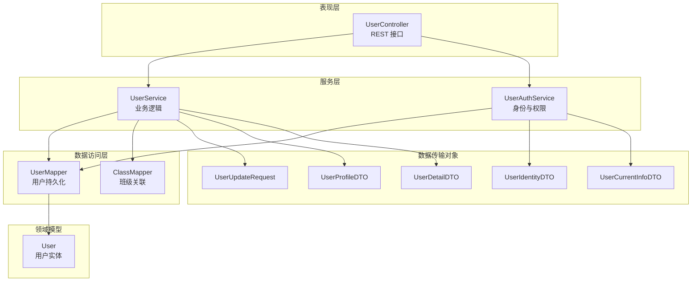
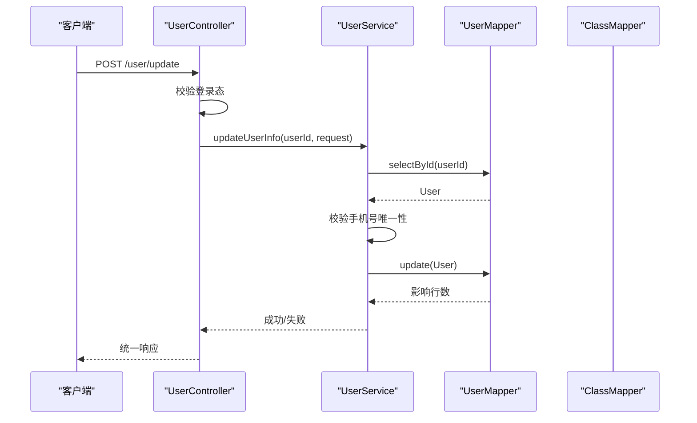
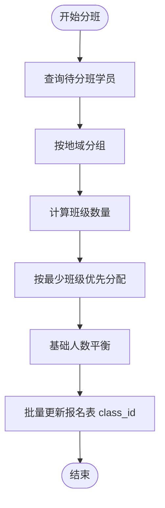
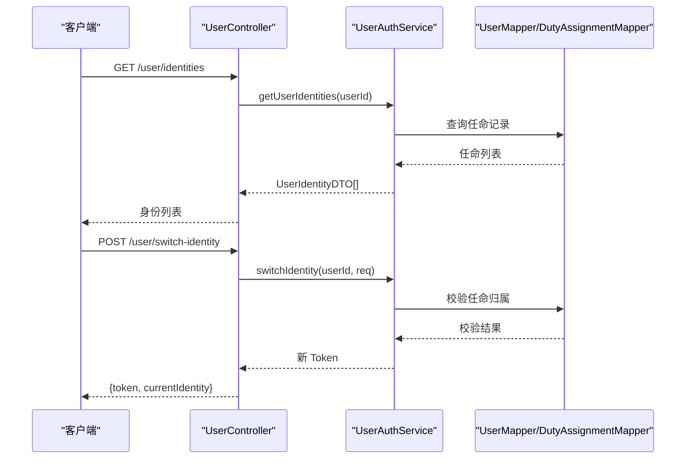
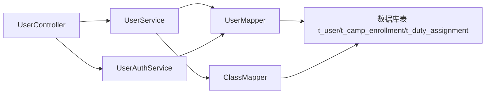

# 用户实体模型

<cite>
**本文引用的文件**
- [User.java](file://src/main/java/com/daily/dailychineseculture/entity/User.java)
- [UserMapper.java](file://src/main/java/com/daily/dailychineseculture/mapper/UserMapper.java)
- [UserService.java](file://src/main/java/com/daily/dailychineseculture/service/UserService.java)
- [UserController.java](file://src/main/java/com/daily/dailychineseculture/controller/UserController.java)
- [UserUpdateRequest.java](file://src/main/java/com/daily/dailychineseculture/dto/UserUpdateRequest.java)
- [UserProfileDTO.java](file://src/main/java/com/daily/dailychineseculture/dto/UserProfileDTO.java)
- [UserDetailDTO.java](file://src/main/java/com/daily/dailychineseculture/dto/UserDetailDTO.java)
- [UserIdentityDTO.java](file://src/main/java/com/daily/dailychineseculture/dto/UserIdentityDTO.java)
- [UserCurrentInfoDTO.java](file://src/main/java/com/daily/dailychineseculture/dto/UserCurrentInfoDTO.java)
- [ClassMapper.java](file://src/main/java/com/daily/dailychineseculture/mapper/ClassMapper.java)
- [UserAuthService.java](file://src/main/java/com/daily/dailychineseculture/service/UserAuthService.java)
- [Header 账号通行证 API文档.md](file://doc/Header 账号通行证 API文档.md)
- [用户个人信息 API文档.md](file://doc/用户个人信息 API文档.md)
- [用户信息管理.md](file://readme/认证与用户模块/用户信息管理.md)
</cite>

## 目录
1. [简介](#简介)
2. [项目结构](#项目结构)
3. [核心组件](#核心组件)
4. [架构总览](#架构总览)
5. [详细组件分析](#详细组件分析)
6. [依赖分析](#依赖分析)
7. [性能考量](#性能考量)
8. [故障排除指南](#故障排除指南)
9. [结论](#结论)
10. [附录](#附录)

## 简介
本文件系统性阐述用户实体模型的设计与实现，覆盖字段语义、数据类型、约束条件、业务含义、状态管理、性别枚举、用户与班级关联、角色与权限控制、增删改查流程、数据验证与安全、隐私保护与脱敏策略等。目标是帮助开发者与产品人员准确理解User实体及其周边能力。

## 项目结构
围绕用户实体的关键文件组织如下：
- 实体层：User.java
- 数据访问层：UserMapper.java、ClassMapper.java
- 服务层：UserService.java、UserAuthService.java
- 控制层：UserController.java
- DTO 层：UserUpdateRequest.java、UserProfileDTO.java、UserDetailDTO.java、UserIdentityDTO.java、UserCurrentInfoDTO.java
- 文档与规范：Header 账号通行证 API文档.md、用户个人信息 API文档.md、用户信息管理.md

图表来源
- [UserController.java:1-223](file://src/main/java/com/daily/dailychineseculture/controller/UserController.java#L1-223)
- [UserService.java:1-959](file://src/main/java/com/daily/dailychineseculture/service/UserService.java#L1-959)
- [UserAuthService.java:1-49](file://src/main/java/com/daily/dailychineseculture/service/UserAuthService.java#L1-49)
- [UserMapper.java:1-252](file://src/main/java/com/daily/dailychineseculture/mapper/UserMapper.java#L1-252)
- [ClassMapper.java:86-110](file://src/main/java/com/daily/dailychineseculture/mapper/ClassMapper.java#L86-110)
- [User.java:1-87](file://src/main/java/com/daily/dailychineseculture/entity/User.java#L1-87)

章节来源
- [UserController.java:1-223](file://src/main/java/com/daily/dailychineseculture/controller/UserController.java#L1-223)
- [UserService.java:1-959](file://src/main/java/com/daily/dailychineseculture/service/UserService.java#L1-959)
- [UserAuthService.java:1-49](file://src/main/java/com/daily/dailychineseculture/service/UserAuthService.java#L1-49)
- [UserMapper.java:1-252](file://src/main/java/com/daily/dailychineseculture/mapper/UserMapper.java#L1-252)
- [ClassMapper.java:86-110](file://src/main/java/com/daily/dailychineseculture/mapper/ClassMapper.java#L86-110)
- [User.java:1-87](file://src/main/java/com/daily/dailychineseculture/entity/User.java#L1-87)

## 核心组件
- 用户实体 User：承载用户核心属性与与班级的关联字段 classId。
- 用户映射 UserMapper：提供用户 CRUD、按账号/手机/微信 openid 查询、志愿者相关统计与分班相关查询。
- 用户服务 UserService：封装用户创建、更新、查询、分班、信息完善、身份判断等业务逻辑。
- 用户控制器 UserController：对外暴露 REST 接口，处理增删改查与个人信息更新。
- 身份与权限服务 UserAuthService：提供当前用户状态、身份列表、身份切换能力。
- DTO：UserUpdateRequest、UserProfileDTO、UserDetailDTO、UserIdentityDTO、UserCurrentInfoDTO，支撑前后端数据交换与脱敏。

章节来源
- [User.java:1-87](file://src/main/java/com/daily/dailychineseculture/entity/User.java#L1-87)
- [UserMapper.java:1-252](file://src/main/java/com/daily/dailychineseculture/mapper/UserMapper.java#L1-252)
- [UserService.java:1-959](file://src/main/java/com/daily/dailychineseculture/service/UserService.java#L1-959)
- [UserController.java:1-223](file://src/main/java/com/daily/dailychineseculture/controller/UserController.java#L1-223)
- [UserAuthService.java:1-49](file://src/main/java/com/daily/dailychineseculture/service/UserAuthService.java#L1-49)
- [UserUpdateRequest.java:1-42](file://src/main/java/com/daily/dailychineseculture/dto/UserUpdateRequest.java#L1-42)
- [UserProfileDTO.java:1-43](file://src/main/java/com/daily/dailychineseculture/dto/UserProfileDTO.java#L1-43)
- [UserDetailDTO.java:1-57](file://src/main/java/com/daily/dailychineseculture/dto/UserDetailDTO.java#L1-57)
- [UserIdentityDTO.java:1-48](file://src/main/java/com/daily/dailychineseculture/dto/UserIdentityDTO.java#L1-48)
- [UserCurrentInfoDTO.java:1-60](file://src/main/java/com/daily/dailychineseculture/dto/UserCurrentInfoDTO.java#L1-60)

## 架构总览
用户相关能力遵循经典的分层架构：Controller 负责接口编排，Service 负责业务编排与校验，Mapper 负责数据持久化，Entity 与 DTO 作为数据载体。用户与班级通过报名表（t_camp_enrollment）间接关联，Service 层提供自动分班与班级 ID 更新能力。

图表来源
- [UserController.java:102-142](file://src/main/java/com/daily/dailychineseculture/controller/UserController.java#L102-142)
- [UserService.java:656-723](file://src/main/java/com/daily/dailychineseculture/service/UserService.java#L656-723)
- [UserMapper.java:23-60](file://src/main/java/com/daily/dailychineseculture/mapper/UserMapper.java#L23-60)

## 详细组件分析

### 用户实体 User 字段设计与业务含义
- userId: Long，用户主键；由服务层生成，格式注释为“YYYY+六位序号”，用于标识用户。
- account: String，账号名；用于登录与唯一标识。
- password: String，密码；明文存储策略见安全章节。
- avatar: String，头像 URL。
- phone: String，手机号；用于联系与唯一性校验。
- region: String，地域。
- birthday: Date，生日。
- profession: String，职业。
- gender: Integer，性别枚举：0未知、1男、2女。
- createTime: Date，注册时间，由服务层设置。
- status: Integer，用户状态：1正常、0冻结。
- openid: String，微信第三方登录标识。
- nickname: String，昵称。
- classId: Long，用户所属班级标识；用于与班级建立关联。

字段约束与默认值
- 创建用户时，服务层默认 status=1、gender=0，并设置 createTime。
- 插入用户时，头像、手机号、地域、职业等字段在某些场景下会设置空字符串以避免数据库 NOT NULL 约束。
- classId 为用户与班级的外键字段，实际落库于报名表（t_camp_enrollment）的 class_id 字段。

章节来源
- [User.java:11-77](file://src/main/java/com/daily/dailychineseculture/entity/User.java#L11-77)
- [UserService.java:48-58](file://src/main/java/com/daily/dailychineseculture/service/UserService.java#L48-58)
- [UserMapper.java:42-54](file://src/main/java/com/daily/dailychineseculture/mapper/UserMapper.java#L42-54)
- [ClassMapper.java:95-100](file://src/main/java/com/daily/dailychineseculture/mapper/ClassMapper.java#L95-100)

### 用户状态管理与性别枚举
- 状态管理：status=1 正常、0 冻结；服务层创建用户默认设置为正常。
- 性别枚举：gender=0未知、1男、2女；服务层创建用户默认设置为未知。

设计考虑
- 状态与枚举采用整型便于数据库存储与前端展示。
- 默认值策略减少空值带来的业务歧义。

章节来源
- [User.java:62-64](file://src/main/java/com/daily/dailychineseculture/entity/User.java#L62-64)
- [User.java:52-54](file://src/main/java/com/daily/dailychineseculture/entity/User.java#L52-54)
- [UserService.java:53-54](file://src/main/java/com/daily/dailychineseculture/service/UserService.java#L53-54)

### 用户与班级的关联关系
- 直接关联：User 实体包含 classId 字段。
- 实际落库：通过报名表 t_camp_enrollment 的 class_id 字段维护用户与班级的关系。
- 分班流程：服务层提供自动分班算法，按地域分组、平衡人数后批量更新报名表 class_id。

图表来源
- [UserService.java:523-598](file://src/main/java/com/daily/dailychineseculture/service/UserService.java#L523-598)
- [UserMapper.java:231-243](file://src/main/java/com/daily/dailychineseculture/mapper/UserMapper.java#L231-243)
- [ClassMapper.java:95-100](file://src/main/java/com/daily/dailychineseculture/mapper/ClassMapper.java#L95-100)

章节来源
- [UserService.java:492-598](file://src/main/java/com/daily/dailychineseculture/service/UserService.java#L492-598)
- [UserMapper.java:231-243](file://src/main/java/com/daily/dailychineseculture/mapper/UserMapper.java#L231-243)
- [ClassMapper.java:86-110](file://src/main/java/com/daily/dailychineseculture/mapper/ClassMapper.java#L86-110)

### 角色管理与权限控制机制
- 身份来源：用户在 t_duty_assignment 中的任命记录决定其可切换的身份。
- 身份列表：UserAuthService 提供 getUserIdentities，返回用户可切换的职责身份集合。
- 身份切换：UserAuthService.switchIdentity 校验任命归属并签发新 JWT，携带 dutyType 与 campId。
- 当前状态：UserCurrentInfoDTO 提供当前职责类型与名称、未读通知等信息。

图表来源
- [UserController.java:177-222](file://src/main/java/com/daily/dailychineseculture/controller/UserController.java#L177-222)
- [UserAuthService.java:12-49](file://src/main/java/com/daily/dailychineseculture/service/UserAuthService.java#L12-49)
- [Header 账号通行证 API文档.md:1-53](file://doc/Header 账号通行证 API文档.md#L1-53)

章节来源
- [UserAuthService.java:12-49](file://src/main/java/com/daily/dailychineseculture/service/UserAuthService.java#L12-49)
- [UserController.java:177-222](file://src/main/java/com/daily/dailychineseculture/controller/UserController.java#L177-222)
- [Header 账号通行证 API文档.md:1-53](file://doc/Header 账号通行证 API文档.md#L1-53)

### 增删改查操作与数据验证
- 查询
  - 获取所有用户：UserService.getAllUsers → UserMapper.selectAll
  - 按 ID/账号/手机/微信 openid 查询：UserMapper.selectById/selectByAccount/selectByPhone/selectByOpenid
- 创建
  - UserService.createUser：生成 userId、设置默认 status/gender/createTime，调用 UserMapper.insert
- 更新
  - UserService.updateUser：直接调用 UserMapper.update
  - 个人信息完善：UserService.updateUserInfo（带手机号唯一性校验、空值处理）
- 删除
  - UserService.deleteUser → UserMapper.deleteById

数据验证规则
- 手机号唯一性：更新时若传入手机号，需确保不与其他用户冲突。
- 信息完整性：isUserInfoComplete 校验手机号、头像、性别、生日均有效。
- 默认值策略：插入时对头像、手机号、地域、职业设置空字符串，避免 NOT NULL 约束。

安全考虑
- 密码存储：仓库未见密码加密逻辑，建议在生产环境启用密码哈希与盐值。
- 身份切换：严格校验任命归属，防止越权切换。
- 输入校验：Controller 层与 Service 层均进行空值与异常捕获。

章节来源
- [UserService.java:34-76](file://src/main/java/com/daily/dailychineseculture/service/UserService.java#L34-76)
- [UserService.java:656-723](file://src/main/java/com/daily/dailychineseculture/service/UserService.java#L656-723)
- [UserMapper.java:18-60](file://src/main/java/com/daily/dailychineseculture/mapper/UserMapper.java#L18-60)
- [UserController.java:39-92](file://src/main/java/com/daily/dailychineseculture/controller/UserController.java#L39-92)

### 用户数据隐私保护与脱敏策略
- 密码脱敏：UserDetailDTO.password 固定返回空字符串，避免真实密码泄露。
- 头像与昵称：为空时提供默认值或占位符，避免空指针与不一致展示。
- 生日格式化：统一为 yyyy-MM-dd 字符串，避免时间戳泄露。
- 统计指标：UserProfileDTO.statsList 包含地区、职业、年数、学时等聚合信息，不包含敏感字段。

章节来源
- [UserDetailDTO.java:53-55](file://src/main/java/com/daily/dailychineseculture/dto/UserDetailDTO.java#L53-55)
- [UserService.java:836-863](file://src/main/java/com/daily/dailychineseculture/service/UserService.java#L836-863)
- [UserProfileDTO.java:1-43](file://src/main/java/com/daily/dailychineseculture/dto/UserProfileDTO.java#L1-43)
- [用户个人信息 API文档.md:101-156](file://doc/用户个人信息 API文档.md#L101-156)

## 依赖分析
- 控制层依赖服务层；服务层依赖数据访问层与 ID 生成器；数据访问层依赖数据库表结构。
- 用户与班级通过报名表间接关联，分班流程涉及 UserMapper 与 ClassMapper 的协作。
- 身份与权限依赖 t_duty_assignment 与 t_camp 等表，UserAuthService 通过 Mapper 查询任命记录并签发新 Token。

图表来源
- [UserController.java:1-223](file://src/main/java/com/daily/dailychineseculture/controller/UserController.java#L1-223)
- [UserService.java:1-959](file://src/main/java/com/daily/dailychineseculture/service/UserService.java#L1-959)
- [UserAuthService.java:1-49](file://src/main/java/com/daily/dailychineseculture/service/UserAuthService.java#L1-49)
- [UserMapper.java:1-252](file://src/main/java/com/daily/dailychineseculture/mapper/UserMapper.java#L1-252)
- [ClassMapper.java:86-110](file://src/main/java/com/daily/dailychineseculture/mapper/ClassMapper.java#L86-110)

章节来源
- [UserController.java:1-223](file://src/main/java/com/daily/dailychineseculture/controller/UserController.java#L1-223)
- [UserService.java:1-959](file://src/main/java/com/daily/dailychineseculture/service/UserService.java#L1-959)
- [UserAuthService.java:1-49](file://src/main/java/com/daily/dailychineseculture/service/UserAuthService.java#L1-49)
- [UserMapper.java:1-252](file://src/main/java/com/daily/dailychineseculture/mapper/UserMapper.java#L1-252)
- [ClassMapper.java:86-110](file://src/main/java/com/daily/dailychineseculture/mapper/ClassMapper.java#L86-110)

## 性能考量
- 查询优化：按 account/phone/openid 的查询使用索引列，建议在数据库层面为这些列建立索引。
- 批量更新：分班时通过批量更新报名表 class_id 减少往返次数。
- DTO 转换：避免在高频路径上进行复杂格式化，必要时缓存或延迟处理。
- 事务边界：分班与更新报名表的操作置于事务中，保证一致性与原子性。

## 故障排除指南
- 手机号重复：更新用户信息时若手机号被他人占用，会抛出唯一约束异常，需提示用户更换手机号。
- 用户不存在：按 ID 查询不到用户时，控制器返回 404。
- 未登录或登录过期：从请求属性中取不到 userId 时，返回 401。
- 身份切换越权：任命记录不属于当前用户时，拒绝切换并返回 400。

章节来源
- [UserController.java:102-142](file://src/main/java/com/daily/dailychineseculture/controller/UserController.java#L102-142)
- [UserService.java:656-723](file://src/main/java/com/daily/dailychineseculture/service/UserService.java#L656-723)
- [UserAuthService.java:467-493](file://src/main/java/com/daily/dailychineseculture/service/UserAuthService.java#L467-493)

## 结论
User 实体模型在字段设计、状态与枚举、与班级关联、角色与权限控制等方面具备清晰的职责划分与扩展空间。结合服务层的默认值策略、校验规则与脱敏机制，能够支撑基本的用户管理与分班需求。建议后续补充密码加密、更完善的权限校验与审计日志，以提升安全性与可观测性。

## 附录
- 字段一览与默认值
  - userId：服务层生成
  - status：默认 1（正常）
  - gender：默认 0（未知）
  - createTime：创建时设置
  - classId：用户所属班级（通过报名表 class_id 实际落库）

章节来源
- [UserService.java:48-58](file://src/main/java/com/daily/dailychineseculture/service/UserService.java#L48-58)
- [User.java:11-77](file://src/main/java/com/daily/dailychineseculture/entity/User.java#L11-77)
- [UserMapper.java:42-54](file://src/main/java/com/daily/dailychineseculture/mapper/UserMapper.java#L42-54)