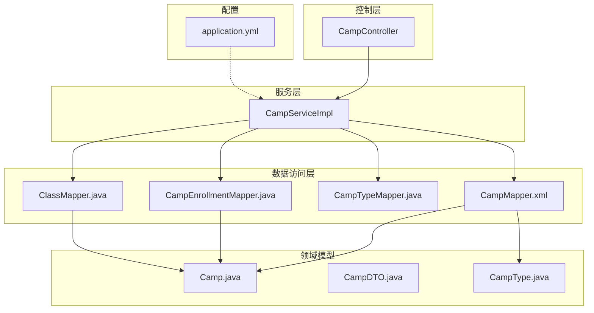
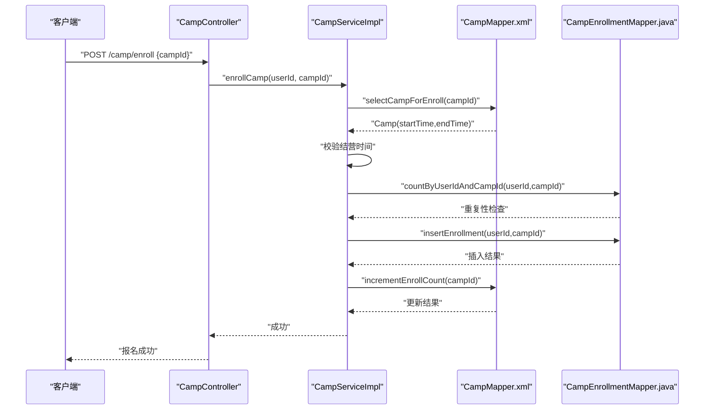
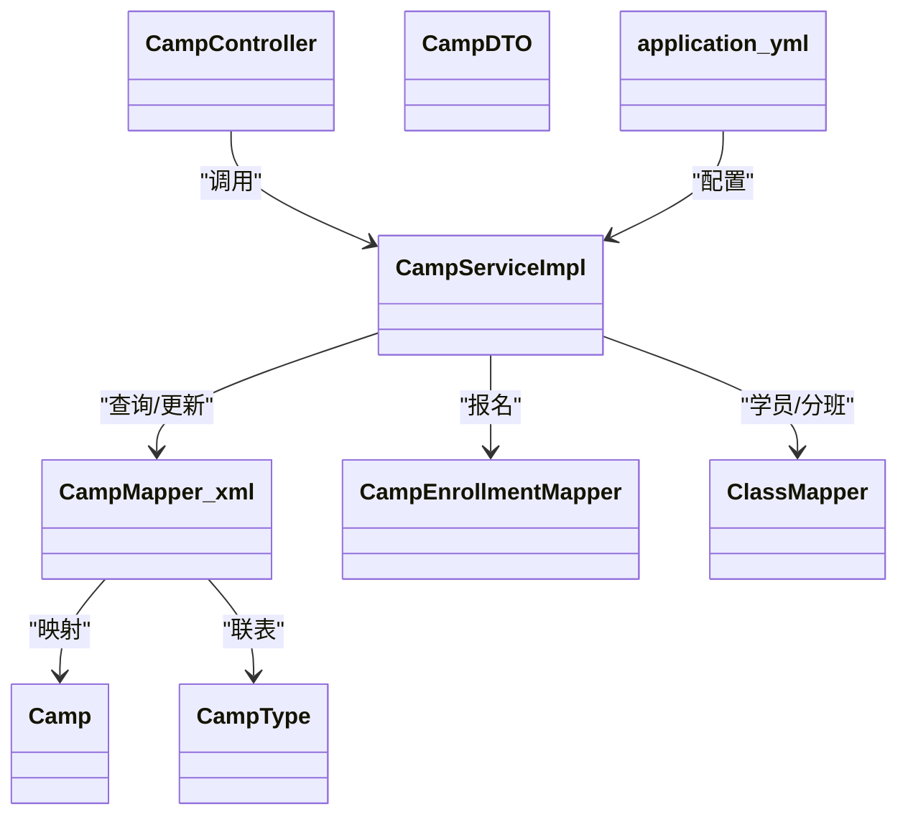

# 营期实体模型

<cite>
**本文引用的文件**
- [Camp.java](file://src/main/java/com/daily/dailychineseculture/entity/Camp.java)
- [CampDTO.java](file://src/main/java/com/daily/dailychineseculture/dto/CampDTO.java)
- [CampServiceImpl.java](file://src/main/java/com/daily/dailychineseculture/service/impl/CampServiceImpl.java)
- [CampController.java](file://src/main/java/com/daily/dailychineseculture/controller/CampController.java)
- [CampMapper.xml](file://src/main/resources/mapper/CampMapper.xml)
- [CampEnrollmentMapper.java](file://src/main/java/com/daily/dailychineseculture/mapper/CampEnrollmentMapper.java)
- [CampType.java](file://src/main/java/com/daily/dailychineseculture/entity/CampType.java)
- [CampTypeMapper.java](file://src/main/java/com/daily/dailychineseculture/mapper/CampTypeMapper.java)
- [ClassMapper.java](file://src/main/java/com/daily/dailychineseculture/mapper/ClassMapper.java)
- [application.yml](file://src/main/resources/application.yml)
- [营期生命周期管理.md](file://readme/教务与排课模块/营期生命周期管理.md)
</cite>

## 目录
1. [简介](#简介)
2. [项目结构](#项目结构)
3. [核心组件](#核心组件)
4. [架构总览](#架构总览)
5. [详细组件分析](#详细组件分析)
6. [依赖分析](#依赖分析)
7. [性能考虑](#性能考虑)
8. [故障排查指南](#故障排查指南)
9. [结论](#结论)
10. [附录](#附录)

## 简介
本文件围绕“营期实体模型”展开，系统性阐述Camp实体类的核心字段设计、状态管理机制、与课程类型的关系映射、与班级/用户的关联设计，并给出业务规则验证（时间冲突、容量限制、报名截止）、查询优化与索引建议、以及营期生命周期管理流程与数据一致性保障策略。文档面向技术与非技术读者，力求以循序渐进的方式呈现。

## 项目结构
- 后端采用Spring Boot + MyBatis，实体与DTO位于entity与dto包，服务层位于service.impl，控制器位于controller，SQL映射位于resources/mapper。
- 营期相关的关键文件：
  - 实体：Camp、CampType
  - DTO：CampDTO、CampListItemDTO、CampListPageDTO、CampVO、RecentCampDTO、CampEnrollDTO
  - 控制器：CampController
  - 服务：CampServiceImpl
  - Mapper：CampMapper.xml、CampEnrollmentMapper、CampTypeMapper、ClassMapper
  - 配置：application.yml

图表来源
- [CampController.java:1-123](file://src/main/java/com/daily/dailychineseculture/controller/CampController.java#L1-L123)
- [CampServiceImpl.java:1-266](file://src/main/java/com/daily/dailychineseculture/service/impl/CampServiceImpl.java#L1-L266)
- [CampMapper.xml:1-171](file://src/main/resources/mapper/CampMapper.xml#L1-L171)
- [CampEnrollmentMapper.java:1-16](file://src/main/java/com/daily/dailychineseculture/mapper/CampEnrollmentMapper.java#L1-L16)
- [CampTypeMapper.java:1-49](file://src/main/java/com/daily/dailychineseculture/mapper/CampTypeMapper.java#L1-L49)
- [ClassMapper.java:1-110](file://src/main/java/com/daily/dailychineseculture/mapper/ClassMapper.java#L1-L110)
- [Camp.java:1-64](file://src/main/java/com/daily/dailychineseculture/entity/Camp.java#L1-L64)
- [CampDTO.java:1-63](file://src/main/java/com/daily/dailychineseculture/dto/CampDTO.java#L1-L63)
- [CampType.java:1-28](file://src/main/java/com/daily/dailychineseculture/entity/CampType.java#L1-L28)
- [application.yml:1-33](file://src/main/resources/application.yml#L1-L33)

章节来源
- [CampController.java:1-123](file://src/main/java/com/daily/dailychineseculture/controller/CampController.java#L1-L123)
- [CampServiceImpl.java:1-266](file://src/main/java/com/daily/dailychineseculture/service/impl/CampServiceImpl.java#L1-L266)
- [CampMapper.xml:1-171](file://src/main/resources/mapper/CampMapper.xml#L1-L171)
- [application.yml:1-33](file://src/main/resources/application.yml#L1-L33)

## 核心组件
- 营期实体Camp：承载营期基础信息与状态，包含营期ID、类型ID、期数、名称、介绍、开始/结束时间、状态、标签、报名人数等字段。
- 营期DTO CampDTO：用于新增/编辑接口的数据传输对象，负责前后端字段映射与格式化。
- 服务实现CampServiceImpl：封装业务规则（状态文本、报名流程、列表分页、热门推荐等），协调Mapper执行持久化。
- 控制器CampController：暴露REST接口，接收请求并返回统一响应。
- Mapper与XML：CampMapper.xml负责Camp与CampType联表查询、分页、统计、热门推荐、报名查询与报名人数自增；CampEnrollmentMapper负责报名去重与进度更新；ClassMapper负责营期-班级-用户的关联查询。
- 配置application.yml：MyBatis驼峰映射开启、Mapper XML路径、数据库连接等。

章节来源
- [Camp.java:1-64](file://src/main/java/com/daily/dailychineseculture/entity/Camp.java#L1-L64)
- [CampDTO.java:1-63](file://src/main/java/com/daily/dailychineseculture/dto/CampDTO.java#L1-L63)
- [CampServiceImpl.java:1-266](file://src/main/java/com/daily/dailychineseculture/service/impl/CampServiceImpl.java#L1-L266)
- [CampController.java:1-123](file://src/main/java/com/daily/dailychineseculture/controller/CampController.java#L1-L123)
- [CampMapper.xml:1-171](file://src/main/resources/mapper/CampMapper.xml#L1-L171)
- [CampEnrollmentMapper.java:1-16](file://src/main/java/com/daily/dailychineseculture/mapper/CampEnrollmentMapper.java#L1-L16)
- [ClassMapper.java:1-110](file://src/main/java/com/daily/dailychineseculture/mapper/ClassMapper.java#L1-L110)
- [application.yml:1-33](file://src/main/resources/application.yml#L1-L33)

## 架构总览
营期模块遵循经典的分层架构：Controller接收请求，Service编排业务，Mapper执行SQL，Entity/DTO作为数据载体。CampServiceImpl在新增/编辑时强制保护报名人数字段，报名时通过事务保证报名记录与报名人数的一致性。

图表来源
- [CampController.java:103-121](file://src/main/java/com/daily/dailychineseculture/controller/CampController.java#L103-L121)
- [CampServiceImpl.java:207-243](file://src/main/java/com/daily/dailychineseculture/service/impl/CampServiceImpl.java#L207-L243)
- [CampMapper.xml:159-169](file://src/main/resources/mapper/CampMapper.xml#L159-L169)
- [CampEnrollmentMapper.java:9-11](file://src/main/java/com/daily/dailychineseculture/mapper/CampEnrollmentMapper.java#L9-L11)

## 详细组件分析

### 营期实体类Camp字段设计
- 关键字段
  - 营期ID：campId
  - 类型ID：typeId（关联t_camp_type）
  - 期数：term
  - 名称：name
  - 介绍：intro
  - 开始/结束时间：startTime、endTime
  - 状态：status（0未开始、1进行中、2已结束）
  - 标签：tag
  - 报名人数：enrollCount
- 设计要点
  - 字段与数据库表t_camp一一对应，使用MyBatis别名“Camp”，便于XML映射。
  - enrollCount由服务层控制增长，避免前端直接篡改。

章节来源
- [Camp.java:14-62](file://src/main/java/com/daily/dailychineseculture/entity/Camp.java#L14-L62)
- [CampMapper.xml:103-123](file://src/main/resources/mapper/CampMapper.xml#L103-L123)

### 营期状态管理机制
- 状态定义
  - 0：未开始
  - 1：进行中
  - 2：已结束
- 状态计算
  - 列表查询时通过SQL计算：NOW()与start_time、end_time比较得出状态。
  - 服务层提供状态文本映射方法，便于展示。
- 生命周期
  - 新增默认状态为“未开始”。
  - 编辑时可手动维护状态，但需注意与实际时间窗口一致。

章节来源
- [CampMapper.xml:53-57](file://src/main/resources/mapper/CampMapper.xml#L53-L57)
- [CampServiceImpl.java:245-264](file://src/main/java/com/daily/dailychineseculture/service/impl/CampServiceImpl.java#L245-L264)
- [营期生命周期管理.md:11-11](file://readme/教务与排课模块/营期生命周期管理.md#L11-L11)

### 营期与课程类型的关系映射
- 实体关系
  - Camp持有typeId外键，关联CampType（t_camp_type）。
- 查询方式
  - 列表查询通过LEFT JOIN t_camp_type获取类型名称level_name。
  - 下拉选项查询CampTypeMapper.selectAllCampTypes。
- 用途
  - 支持按类型筛选、展示类型名称、构建选项列表。

章节来源
- [Camp.java:20-22](file://src/main/java/com/daily/dailychineseculture/entity/Camp.java#L20-L22)
- [CampType.java:13-26](file://src/main/java/com/daily/dailychineseculture/entity/CampType.java#L13-L26)
- [CampMapper.xml:23-24](file://src/main/resources/mapper/CampMapper.xml#L23-L24)
- [CampMapper.xml:84-90](file://src/main/resources/mapper/CampMapper.xml#L84-L90)
- [CampTypeMapper.java:19-26](file://src/main/java/com/daily/dailychineseculture/mapper/CampTypeMapper.java#L19-L26)

### 营期与班级、用户的关联设计
- 营期与班级
  - 通过t_camp与t_class关联，ClassMapper提供跨层级查询（班级/大组/小组均包含营期名称）。
- 营期与用户
  - 通过t_camp_enrollment建立用户与营期的报名关系，ClassMapper提供按营期查询学员列表（含分班信息）。
- 作用
  - 支持分班、导学、统计等场景。

章节来源
- [ClassMapper.java:20-46](file://src/main/java/com/daily/dailychineseculture/mapper/ClassMapper.java#L20-L46)
- [ClassMapper.java:55-89](file://src/main/java/com/daily/dailychineseculture/mapper/ClassMapper.java#L55-L89)
- [CampEnrollmentMapper.java:9-11](file://src/main/java/com/daily/dailychineseculture/mapper/CampEnrollmentMapper.java#L9-L11)

### 营期数据的业务规则验证
- 报名截止时间
  - 报名前校验结营时间：若当前时间晚于end_time，则拒绝报名。
- 重复报名
  - 通过CampEnrollmentMapper按userId与campId计数，若>0则拒绝重复报名。
- 报名成功一致性
  - 使用@Transactional包裹报名流程，先写入t_camp_enrollment，再原子性自增t_camp.enroll_count。
- 新增/编辑字段约束
  - 新增时强制enrollCount=0，编辑时禁止更新enrollCount，保护真实数据。

章节来源
- [CampServiceImpl.java:207-243](file://src/main/java/com/daily/dailychineseculture/service/impl/CampServiceImpl.java#L207-L243)
- [CampMapper.xml:159-169](file://src/main/resources/mapper/CampMapper.xml#L159-L169)
- [CampEnrollmentMapper.java:9-11](file://src/main/java/com/daily/dailychineseculture/mapper/CampEnrollmentMapper.java#L9-L11)

### 营期数据的查询优化与索引建议
- 查询优化点
  - 列表查询：按keyword模糊匹配、按status精确筛选、按typeId过滤、按start_time降序排序，LIMIT分页。
  - 热门推荐：按tag优先、报名人数、开营时间排序，限制5条。
- 索引建议
  - t_camp：start_time、end_time、type_id、name（模糊搜索）
  - t_camp_type：type_id（联表）
  - t_camp_enrollment：user_id、camp_id（唯一索引，防重复报名）
  - t_class：camp_id（关联查询）

章节来源
- [CampMapper.xml:19-81](file://src/main/resources/mapper/CampMapper.xml#L19-L81)
- [CampMapper.xml:139-157](file://src/main/resources/mapper/CampMapper.xml#L139-L157)
- [CampEnrollmentMapper.java:9-11](file://src/main/java/com/daily/dailychineseculture/mapper/CampEnrollmentMapper.java#L9-L11)
- [ClassMapper.java:20-46](file://src/main/java/com/daily/dailychineseculture/mapper/ClassMapper.java#L20-L46)

### 营期生命周期管理流程与数据一致性
- 生命周期阶段
  - 新增：设置默认状态为“未开始”，enrollCount=0。
  - 进行中：根据start_time与end_time自动计算或手动维护为“进行中”。
  - 已结束：end_time早于当前时间，状态为“已结束”。
- 数据一致性
  - 报名事务：插入报名记录与自增报名人数在同一个事务内，避免并发导致的数据不一致。
  - 状态展示：列表查询时由SQL计算状态，避免缓存状态与实际时间窗口不一致。

章节来源
- [CampServiceImpl.java:165-205](file://src/main/java/com/daily/dailychineseculture/service/impl/CampServiceImpl.java#L165-L205)
- [CampMapper.xml:53-57](file://src/main/resources/mapper/CampMapper.xml#L53-L57)
- [CampServiceImpl.java:207-243](file://src/main/java/com/daily/dailychineseculture/service/impl/CampServiceImpl.java#L207-L243)
- [营期生命周期管理.md:11-11](file://readme/教务与排课模块/营期生命周期管理.md#L11-L11)

## 依赖分析
- 组件耦合
  - Controller依赖Service；Service依赖多个Mapper；Mapper依赖Entity/DTO；配置影响MyBatis映射行为。
- 外部依赖
  - MySQL数据库、MyBatis框架、Spring事务管理。
- 潜在风险
  - 重复报名校验依赖唯一索引；状态计算依赖数据库NOW()；分页查询依赖合适的索引。

图表来源
- [CampController.java:27-28](file://src/main/java/com/daily/dailychineseculture/controller/CampController.java#L27-L28)
- [CampServiceImpl.java:30-34](file://src/main/java/com/daily/dailychineseculture/service/impl/CampServiceImpl.java#L30-L34)
- [CampMapper.xml:1-3](file://src/main/resources/mapper/CampMapper.xml#L1-L3)
- [CampEnrollmentMapper.java:1-16](file://src/main/java/com/daily/dailychineseculture/mapper/CampEnrollmentMapper.java#L1-L16)
- [ClassMapper.java:1-110](file://src/main/java/com/daily/dailychineseculture/mapper/ClassMapper.java#L1-L110)
- [Camp.java:1-64](file://src/main/java/com/daily/dailychineseculture/entity/Camp.java#L1-L64)
- [CampDTO.java:1-63](file://src/main/java/com/daily/dailychineseculture/dto/CampDTO.java#L1-L63)
- [CampType.java:1-28](file://src/main/java/com/daily/dailychineseculture/entity/CampType.java#L1-L28)
- [application.yml:17-22](file://src/main/resources/application.yml#L17-L22)

章节来源
- [CampController.java:1-123](file://src/main/java/com/daily/dailychineseculture/controller/CampController.java#L1-L123)
- [CampServiceImpl.java:1-266](file://src/main/java/com/daily/dailychineseculture/service/impl/CampServiceImpl.java#L1-L266)
- [CampMapper.xml:1-171](file://src/main/resources/mapper/CampMapper.xml#L1-L171)
- [CampEnrollmentMapper.java:1-16](file://src/main/java/com/daily/dailychineseculture/mapper/CampEnrollmentMapper.java#L1-L16)
- [ClassMapper.java:1-110](file://src/main/java/com/daily/dailychineseculture/mapper/ClassMapper.java#L1-L110)
- [application.yml:1-33](file://src/main/resources/application.yml#L1-L33)

## 性能考虑
- 查询性能
  - 列表查询使用LIMIT分页，避免全表扫描；按typeId与status过滤可利用索引。
  - 热门推荐按tag、报名人数、时间排序，建议在enroll_count上建立索引以提升排序效率。
- 写入性能
  - 报名写入使用事务，减少锁竞争；唯一索引防止重复写入。
- 缓存策略
  - 可对热门营期结果做短期缓存，降低频繁联表查询压力。
- 数据库配置
  - application.yml开启map-underscore-to-camel-case，减少字段映射成本。

章节来源
- [CampMapper.xml:19-81](file://src/main/resources/mapper/CampMapper.xml#L19-L81)
- [CampMapper.xml:139-157](file://src/main/resources/mapper/CampMapper.xml#L139-L157)
- [application.yml:18-22](file://src/main/resources/application.yml#L18-L22)

## 故障排查指南
- 报名失败
  - 检查结营时间是否已过：若当前时间晚于end_time则拒绝报名。
  - 检查重复报名：唯一索引或count>0会触发重复报名异常。
  - 检查事务：若插入报名记录成功但更新报名人数失败，需回滚事务。
- 列表查询异常
  - 检查status参数与SQL条件分支是否匹配。
  - 检查keyword模糊匹配与typeId过滤条件。
- 状态显示异常
  - 确认SQL计算逻辑与服务层状态文本映射一致。
- 数据不一致
  - 确认报名流程在同一个事务内执行，避免并发写入导致的不一致。

章节来源
- [CampServiceImpl.java:207-243](file://src/main/java/com/daily/dailychineseculture/service/impl/CampServiceImpl.java#L207-L243)
- [CampMapper.xml:53-57](file://src/main/resources/mapper/CampMapper.xml#L53-L57)
- [CampEnrollmentMapper.java:9-11](file://src/main/java/com/daily/dailychineseculture/mapper/CampEnrollmentMapper.java#L9-L11)

## 结论
本营期实体模型以Camp为核心，结合CampType、CampEnrollment、Class等实体/表，形成完整的营期生命周期管理能力。通过明确的状态计算、严格的报名校验、事务保证与查询优化策略，实现了高可用与高性能的业务闭环。建议在生产环境中配合合适的索引与缓存策略，持续监控热点查询与写入瓶颈。

## 附录
- 接口与参数
  - 新增/编辑：CampController提供POST/PUT /api/admin/camps，请求体为CampDTO。
  - 报名：POST /camp/enroll，请求体为CampEnrollDTO，需携带campId。
  - 列表：GET /api/admin/camps，支持page、size、keyword、status、typeId。
- 配置要点
  - application.yml开启map-underscore-to-camel-case，确保数据库字段与实体属性自动映射。

章节来源
- [CampController.java:78-121](file://src/main/java/com/daily/dailychineseculture/controller/CampController.java#L78-L121)
- [CampServiceImpl.java:127-157](file://src/main/java/com/daily/dailychineseculture/service/impl/CampServiceImpl.java#L127-L157)
- [application.yml:18-22](file://src/main/resources/application.yml#L18-L22)