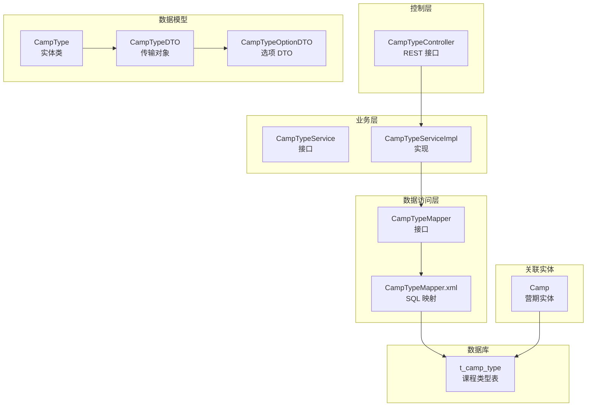
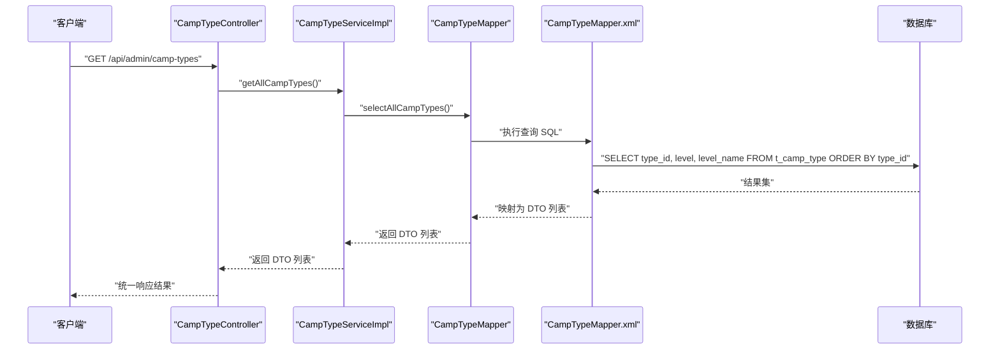
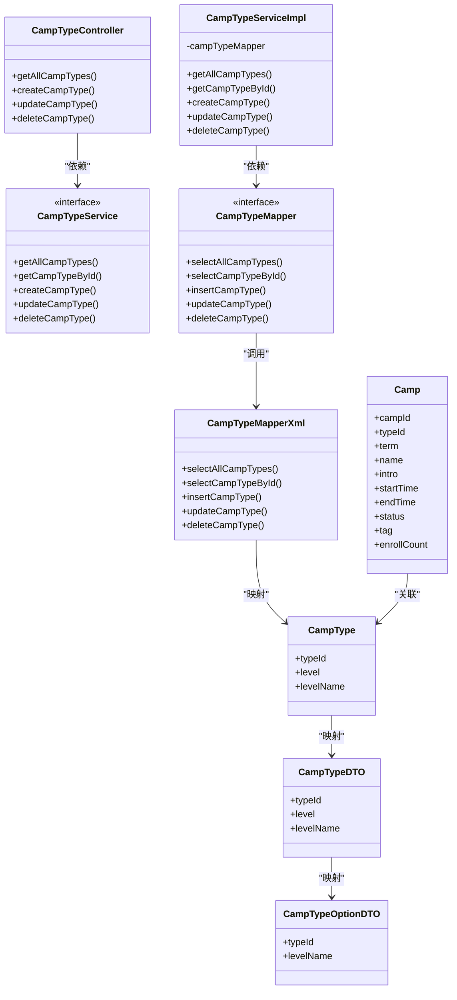

# 课程类型实体模型

<cite>
**本文档引用的文件**
- [CampType.java](file://src/main/java/com/daily/dailychineseculture/entity/CampType.java)
- [CampTypeDTO.java](file://src/main/java/com/daily/dailychineseculture/dto/CampTypeDTO.java)
- [CampTypeOptionDTO.java](file://src/main/java/com/daily/dailychineseculture/dto/CampTypeOptionDTO.java)
- [CampTypeController.java](file://src/main/java/com/daily/dailychineseculture/controller/CampTypeController.java)
- [CampTypeService.java](file://src/main/java/com/daily/dailychineseculture/service/CampTypeService.java)
- [CampTypeServiceImpl.java](file://src/main/java/com/daily/dailychineseculture/service/impl/CampTypeServiceImpl.java)
- [CampTypeMapper.java](file://src/main/java/com/daily/dailychineseculture/mapper/CampTypeMapper.java)
- [CampTypeMapper.xml](file://src/main/resources/mapper/CampTypeMapper.xml)
- [Camp.java](file://src/main/java/com/daily/dailychineseculture/entity/Camp.java)
- [CampMapper.xml](file://src/main/resources/mapper/CampMapper.xml)
- [application.yml](file://src/main/resources/application.yml)
- [课程体系与分类.md](file://readme/课程管理模块/课程体系与分类.md)
- [课程体系分类管理 API文档.md](file://doc/课程体系分类管理 API文档.md)
</cite>

## 目录
1. [简介](#简介)
2. [项目结构](#项目结构)
3. [核心组件](#核心组件)
4. [架构总览](#架构总览)
5. [详细组件分析](#详细组件分析)
6. [依赖分析](#依赖分析)
7. [性能考虑](#性能考虑)
8. [故障排除指南](#故障排除指南)
9. [结论](#结论)
10. [附录](#附录)

## 简介
本文件系统性阐述课程类型实体模型的设计与实现，重点围绕 CampType 实体类及其相关组件，解释类型名称、等级标识等字段的业务含义与约束，并基于现有代码分析课程类型与营期的关联关系、在课程推荐与筛选中的作用机制，提供数据维护操作流程、查询优化策略及缓存与性能优化方案。由于当前代码库中课程类型实体模型为扁平的两级分类（等级标识 level 与等级名称 levelName），并未实现多级层级结构或标签管理，因此本文在相应章节明确指出当前限制并给出改进建议。

## 项目结构
课程类型实体模型位于后端 Spring Boot 应用的分层架构中，采用标准的 MVC+MyBatis 架构：
- 控制层：CampTypeController 提供 RESTful 接口
- 业务层：CampTypeService 及其实现类封装业务逻辑
- 数据访问层：CampTypeMapper 接口与 CampTypeMapper.xml SQL 映射
- 数据模型：CampType 实体类与 CampTypeDTO、CampTypeOptionDTO 数据传输对象
- 关联实体：Camp 营期实体通过 typeId 关联到课程类型

图表来源
- [CampTypeController.java:15-72](file://src/main/java/com/daily/dailychineseculture/controller/CampTypeController.java#L15-L72)
- [CampTypeServiceImpl.java:14-44](file://src/main/java/com/daily/dailychineseculture/service/impl/CampTypeServiceImpl.java#L14-L44)
- [CampTypeMapper.java:12-48](file://src/main/java/com/daily/dailychineseculture/mapper/CampTypeMapper.java#L12-L48)
- [CampTypeMapper.xml:3-58](file://src/main/resources/mapper/CampTypeMapper.xml#L3-L58)
- [CampType.java:10-27](file://src/main/java/com/daily/dailychineseculture/entity/CampType.java#L10-L27)
- [CampTypeDTO.java:9-25](file://src/main/java/com/daily/dailychineseculture/dto/CampTypeDTO.java#L9-L25)
- [CampTypeOptionDTO.java:10-24](file://src/main/java/com/daily/dailychineseculture/dto/CampTypeOptionDTO.java#L10-L24)
- [Camp.java:11-63](file://src/main/java/com/daily/dailychineseculture/entity/Camp.java#L11-L63)
- [CampMapper.xml:3-90](file://src/main/resources/mapper/CampMapper.xml#L3-L90)

章节来源
- [CampTypeController.java:15-72](file://src/main/java/com/daily/dailychineseculture/controller/CampTypeController.java#L15-L72)
- [CampTypeServiceImpl.java:14-44](file://src/main/java/com/daily/dailychineseculture/service/impl/CampTypeServiceImpl.java#L14-L44)
- [CampTypeMapper.java:12-48](file://src/main/java/com/daily/dailychineseculture/mapper/CampTypeMapper.java#L12-L48)
- [CampTypeMapper.xml:3-58](file://src/main/resources/mapper/CampTypeMapper.xml#L3-L58)
- [CampType.java:10-27](file://src/main/java/com/daily/dailychineseculture/entity/CampType.java#L10-L27)
- [CampTypeDTO.java:9-25](file://src/main/java/com/daily/dailychineseculture/dto/CampTypeDTO.java#L9-L25)
- [CampTypeOptionDTO.java:10-24](file://src/main/java/com/daily/dailychineseculture/dto/CampTypeOptionDTO.java#L10-L24)
- [Camp.java:11-63](file://src/main/java/com/daily/dailychineseculture/entity/Camp.java#L11-L63)
- [CampMapper.xml:3-90](file://src/main/resources/mapper/CampMapper.xml#L3-L90)

## 核心组件
- 实体类 CampType：承载课程类型的核心字段，包含类型 ID、等级标识与等级名称。该实体用于 MyBatis 映射数据库表 t_camp_type。
- DTO CampTypeDTO：用于课程体系分类管理的传输对象，包含类型 ID、等级标识与等级名称，作为控制器与服务层之间的数据载体。
- DTO CampTypeOptionDTO：用于前端下拉选项展示，包含类型 ID 与等级名称，简化前端渲染。
- 控制器 CampTypeController：提供 RESTful 接口，支持查询全部、新增、修改、删除等操作。
- 服务接口与实现 CampTypeService/CampTypeServiceImpl：封装业务逻辑，调用数据访问层执行数据库操作。
- 数据访问层 CampTypeMapper/CampTypeMapper.xml：定义 SQL 操作，实现对 t_camp_type 表的增删改查。

章节来源
- [CampType.java:10-27](file://src/main/java/com/daily/dailychineseculture/entity/CampType.java#L10-L27)
- [CampTypeDTO.java:9-25](file://src/main/java/com/daily/dailychineseculture/dto/CampTypeDTO.java#L9-L25)
- [CampTypeOptionDTO.java:10-24](file://src/main/java/com/daily/dailychineseculture/dto/CampTypeOptionDTO.java#L10-L24)
- [CampTypeController.java:15-72](file://src/main/java/com/daily/dailychineseculture/controller/CampTypeController.java#L15-L72)
- [CampTypeService.java:10-42](file://src/main/java/com/daily/dailychineseculture/service/CampTypeService.java#L10-L42)
- [CampTypeServiceImpl.java:14-44](file://src/main/java/com/daily/dailychineseculture/service/impl/CampTypeServiceImpl.java#L14-L44)
- [CampTypeMapper.java:12-48](file://src/main/java/com/daily/dailychineseculture/mapper/CampTypeMapper.java#L12-L48)
- [CampTypeMapper.xml:3-58](file://src/main/resources/mapper/CampTypeMapper.xml#L3-L58)

## 架构总览
课程类型实体模型遵循经典的分层架构，控制器负责接收请求并返回统一响应，服务层封装业务规则，数据访问层负责与数据库交互。CampType 与 Camp 之间通过 typeId 建立关联，CampMapper.xml 中的 SQL 实现了营期列表查询、热门课程推荐等场景中的类型筛选与联表查询。

图表来源
- [CampTypeController.java:28-32](file://src/main/java/com/daily/dailychineseculture/controller/CampTypeController.java#L28-L32)
- [CampTypeServiceImpl.java:20-23](file://src/main/java/com/daily/dailychineseculture/service/impl/CampTypeServiceImpl.java#L20-L23)
- [CampTypeMapper.java:18-19](file://src/main/java/com/daily/dailychineseculture/mapper/CampTypeMapper.java#L18-L19)
- [CampTypeMapper.xml:12-20](file://src/main/resources/mapper/CampTypeMapper.xml#L12-L20)

章节来源
- [CampTypeController.java:28-32](file://src/main/java/com/daily/dailychineseculture/controller/CampTypeController.java#L28-L32)
- [CampTypeServiceImpl.java:20-23](file://src/main/java/com/daily/dailychineseculture/service/impl/CampTypeServiceImpl.java#L20-L23)
- [CampTypeMapper.xml:12-20](file://src/main/resources/mapper/CampTypeMapper.xml#L12-L20)

## 详细组件分析

### 实体类设计与字段语义
- 类型 ID（typeId）：主键，唯一标识一个课程类型，用于与其他实体建立关联。
- 等级标识（level）：用于区分不同层级或类别，如 ML、DX、CY 等，通常用于系统内部识别与排序。
- 等级名称（levelName）：面向用户的显示名称，如“明理班”、“诚意班”等，用于界面展示与筛选。

字段约束与业务含义：
- 唯一性：typeId 为主键，保证唯一。
- 显示与识别：level 用于系统内部识别，levelName 用于用户可见展示。
- 排序：查询默认按 typeId 升序排列，便于稳定展示与前端分页。

章节来源
- [CampType.java:13-26](file://src/main/java/com/daily/dailychineseculture/entity/CampType.java#L13-L26)
- [CampTypeMapper.xml:12-20](file://src/main/resources/mapper/CampTypeMapper.xml#L12-L20)

### 数据传输对象与选项 DTO
- CampTypeDTO：包含 typeId、level、levelName，用于控制器与服务层之间的数据传递。
- CampTypeOptionDTO：仅包含 typeId 与 levelName，用于前端下拉选项渲染，减少传输数据量。

章节来源
- [CampTypeDTO.java:10-24](file://src/main/java/com/daily/dailychineseculture/dto/CampTypeDTO.java#L10-L24)
- [CampTypeOptionDTO.java:11-23](file://src/main/java/com/daily/dailychineseculture/dto/CampTypeOptionDTO.java#L11-L23)

### 控制器与服务层职责
- 控制器：提供 RESTful 接口，统一响应结构，调用服务层执行业务操作。
- 服务层：封装业务逻辑，调用数据访问层执行数据库操作，处理空值与异常。

章节来源
- [CampTypeController.java:28-71](file://src/main/java/com/daily/dailychineseculture/controller/CampTypeController.java#L28-L71)
- [CampTypeServiceImpl.java:20-43](file://src/main/java/com/daily/dailychineseculture/service/impl/CampTypeServiceImpl.java#L20-L43)

### 数据访问层与 SQL 映射
- 查询全部：按 typeId 升序返回所有课程类型。
- 新增：插入 level 与 levelName，typeId 由数据库自增生成。
- 修改：支持部分字段更新，仅当传入字段非空时才更新对应列。
- 删除：按 typeId 删除对应记录。

章节来源
- [CampTypeMapper.java:18-47](file://src/main/java/com/daily/dailychineseculture/mapper/CampTypeMapper.java#L18-L47)
- [CampTypeMapper.xml:12-56](file://src/main/resources/mapper/CampTypeMapper.xml#L12-L56)

### 课程类型与营期的关联关系
- 关联字段：Camp 实体中的 typeId 字段关联到 t_camp_type 的 type_id。
- 关联查询：CampMapper.xml 在营期列表查询、热门课程推荐等场景中通过 LEFT JOIN t_camp_type 实现类型名称的联表获取。
- 筛选机制：营期列表查询支持按 typeId 进行精确筛选；热门推荐通过联表查询返回类型名称字段。

章节来源
- [Camp.java:20-22](file://src/main/java/com/daily/dailychineseculture/entity/Camp.java#L20-L22)
- [CampMapper.xml:44-81](file://src/main/resources/mapper/CampMapper.xml#L44-L81)
- [CampMapper.xml:140-157](file://src/main/resources/mapper/CampMapper.xml#L140-L157)

### 课程类型与课程推荐、筛选的作用机制
- 营期列表筛选：通过 typeId 参数在 SQL 中进行精确匹配，实现按课程类型筛选。
- 热门课程推荐：在联表查询中返回类型名称字段，便于前端展示与统计分析。
- 状态计算：营期状态通过 CASE WHEN 动态计算，但课程类型本身不参与状态计算逻辑。

章节来源
- [CampMapper.xml:75-77](file://src/main/resources/mapper/CampMapper.xml#L75-L77)
- [CampMapper.xml:140-157](file://src/main/resources/mapper/CampMapper.xml#L140-L157)

### 数据维护操作（新增、修改、删除）
- 新增：POST /api/admin/camp-types，请求体包含 level 与 levelName。
- 修改：PUT /api/admin/camp-types，请求体包含 typeId、level（可选）、levelName（可选）。
- 删除：DELETE /api/admin/camp-types/{typeId}。
- 查询：GET /api/admin/camp-types 返回全部列表。

章节来源
- [CampTypeController.java:41-71](file://src/main/java/com/daily/dailychineseculture/controller/CampTypeController.java#L41-L71)
- [CampTypeMapper.xml:32-56](file://src/main/resources/mapper/CampTypeMapper.xml#L32-L56)

### 查询优化策略
- 基础查询：按 typeId 升序返回，适合小规模数据集。
- 前端级联选择：CampMapper.xml 提供下拉选项查询，仅返回必要的字段，减少网络传输。
- 营期列表筛选：通过 typeId 精确匹配，结合关键字与状态过滤，满足多维筛选需求。
- SQL 层格式化：CampMapper.xml 在 SQL 层完成日期格式化与状态计算，减轻 Java 层负担。

章节来源
- [CampTypeMapper.xml:12-20](file://src/main/resources/mapper/CampTypeMapper.xml#L12-L20)
- [CampMapper.xml:83-90](file://src/main/resources/mapper/CampMapper.xml#L83-L90)
- [CampMapper.xml:19-81](file://src/main/resources/mapper/CampMapper.xml#L19-L81)

### 缓存策略与性能优化
- 当前实现：未发现显式的缓存实现（如 Redis 或本地缓存）。
- 建议方案：
  - 读多写少场景：对课程类型全量列表进行缓存，设置合理过期时间（如 5-15 分钟），在新增/修改/删除后主动失效。
  - 下拉选项缓存：CampTypeOptionDTO 的查询结果可缓存，提升前端渲染速度。
  - 数据库层面：保持现有 SQL 层格式化与联表查询，避免重复计算。
- 配置参考：application.yml 中已开启驼峰命名映射与 Mapper XML 位置配置，有助于提升开发效率与性能。

章节来源
- [application.yml:17-22](file://src/main/resources/application.yml#L17-L22)

### 多级分类与标签管理现状与建议
- 现状：当前代码库中的课程类型实体模型为扁平两级结构（level 与 levelName），未实现多级层级结构或标签管理。
- 建议：
  - 多级结构：引入 parentId 字段实现父子层级关系，配合递归查询或物化路径实现多级分类。
  - 标签管理：新增标签表与关联表，支持课程类型与多个标签的多对多关系。
  - 前端联动：在新增/编辑营期时支持多级选择与标签勾选，后端提供树形结构与标签过滤接口。

章节来源
- [课程体系与分类.md:6-10](file://readme/课程管理模块/课程体系与分类.md#L6-L10)

## 依赖分析
课程类型实体模型的依赖关系清晰，遵循单一职责原则：
- 控制器依赖服务接口
- 服务实现依赖数据访问接口
- 数据访问接口依赖 SQL 映射文件
- 实体与 DTO 之间存在一对一映射关系
- 营期实体通过 typeId 关联到课程类型

图表来源
- [CampTypeController.java:15-72](file://src/main/java/com/daily/dailychineseculture/controller/CampTypeController.java#L15-L72)
- [CampTypeService.java:10-42](file://src/main/java/com/daily/dailychineseculture/service/CampTypeService.java#L10-L42)
- [CampTypeServiceImpl.java:14-44](file://src/main/java/com/daily/dailychineseculture/service/impl/CampTypeServiceImpl.java#L14-L44)
- [CampTypeMapper.java:12-48](file://src/main/java/com/daily/dailychineseculture/mapper/CampTypeMapper.java#L12-L48)
- [CampTypeMapper.xml:3-58](file://src/main/resources/mapper/CampTypeMapper.xml#L3-L58)
- [CampType.java:10-27](file://src/main/java/com/daily/dailychineseculture/entity/CampType.java#L10-L27)
- [CampTypeDTO.java:9-25](file://src/main/java/com/daily/dailychineseculture/dto/CampTypeDTO.java#L9-L25)
- [CampTypeOptionDTO.java:10-24](file://src/main/java/com/daily/dailychineseculture/dto/CampTypeOptionDTO.java#L10-L24)
- [Camp.java:11-63](file://src/main/java/com/daily/dailychineseculture/entity/Camp.java#L11-L63)

章节来源
- [CampTypeController.java:15-72](file://src/main/java/com/daily/dailychineseculture/controller/CampTypeController.java#L15-L72)
- [CampTypeServiceImpl.java:14-44](file://src/main/java/com/daily/dailychineseculture/service/impl/CampTypeServiceImpl.java#L14-L44)
- [CampTypeMapper.java:12-48](file://src/main/java/com/daily/dailychineseculture/mapper/CampTypeMapper.java#L12-L48)
- [CampTypeMapper.xml:3-58](file://src/main/resources/mapper/CampTypeMapper.xml#L3-L58)
- [Camp.java:11-63](file://src/main/java/com/daily/dailychineseculture/entity/Camp.java#L11-L63)

## 性能考虑
- 查询性能：全量查询按主键升序，适合中小规模数据；若数据量增长，建议增加索引与分页。
- 传输优化：使用 CampTypeOptionDTO 减少字段传输，提升前端渲染效率。
- SQL 层优化：在 SQL 中完成格式化与计算，避免 Java 层重复处理。
- 缓存策略：对读多写少的课程类型列表与下拉选项进行缓存，降低数据库压力。

章节来源
- [CampTypeMapper.xml:12-20](file://src/main/resources/mapper/CampTypeMapper.xml#L12-L20)
- [CampMapper.xml:83-90](file://src/main/resources/mapper/CampMapper.xml#L83-L90)
- [application.yml:17-22](file://src/main/resources/application.yml#L17-L22)

## 故障排除指南
- 新增失败：检查请求体是否包含 level 与 levelName，且非空；确认数据库连接与字符集配置正确。
- 修改失败：确认 typeId 是否存在且有效；仅传入需要更新的字段，避免空字符串覆盖。
- 删除失败：确认无外键约束或关联数据；删除前需清理相关营期记录。
- 查询异常：检查数据库表是否存在、字段映射是否正确、驼峰命名转换是否启用。

章节来源
- [CampTypeController.java:41-71](file://src/main/java/com/daily/dailychineseculture/controller/CampTypeController.java#L41-L71)
- [CampTypeMapper.xml:32-56](file://src/main/resources/mapper/CampTypeMapper.xml#L32-L56)
- [application.yml:17-22](file://src/main/resources/application.yml#L17-L22)

## 结论
课程类型实体模型在当前代码库中实现了扁平两级分类（等级标识与等级名称），通过清晰的分层架构与 MyBatis 映射，提供了完整的 CRUD 能力与基础筛选能力。对于课程类型与营期的关联，系统通过 typeId 实现了稳定的关联关系，并在营期列表与热门推荐中体现类型信息。未来可在多级分类与标签管理方面进行扩展，同时引入缓存与索引策略以进一步提升性能与用户体验。

## 附录
- API 文档与技术实现细节可参考课程体系分类管理 API 文档与课程体系与分类说明文档。
- 数据库表结构与字段映射关系详见课程体系分类管理 API 文档。

章节来源
- [课程体系分类管理 API文档.md:199-282](file://doc/课程体系分类管理 API文档.md#L199-L282)
- [课程体系与分类.md:1-57](file://readme/课程管理模块/课程体系与分类.md#L1-L57)