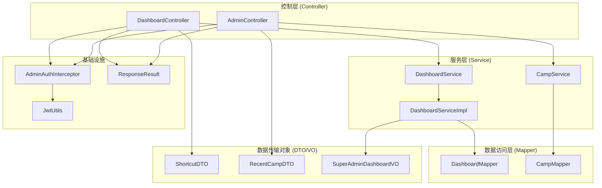
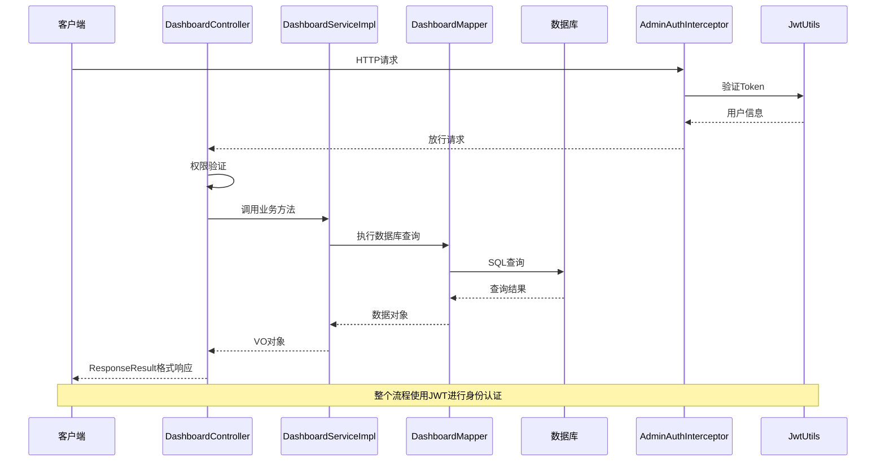
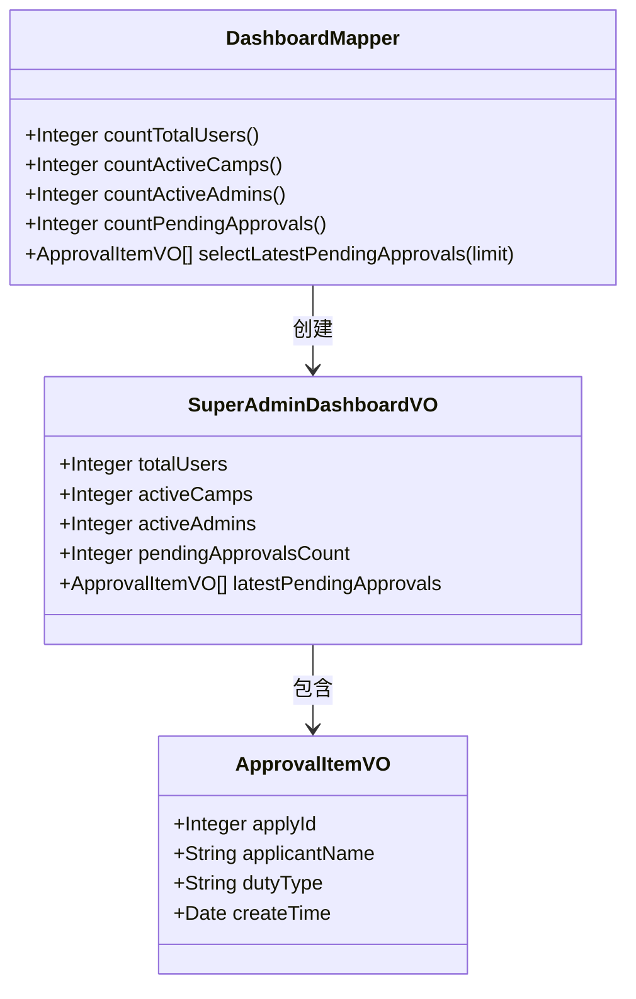
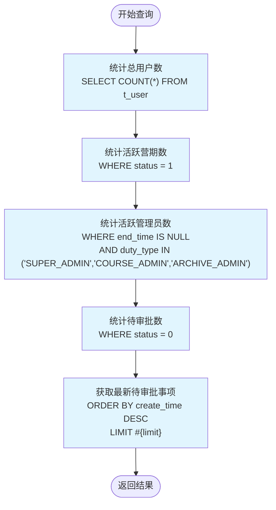
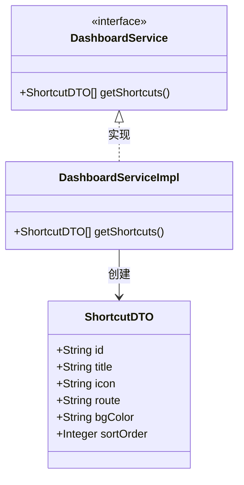
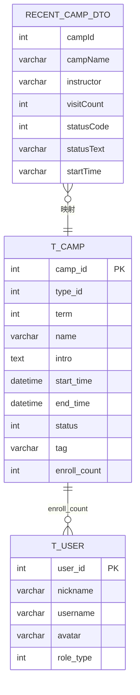
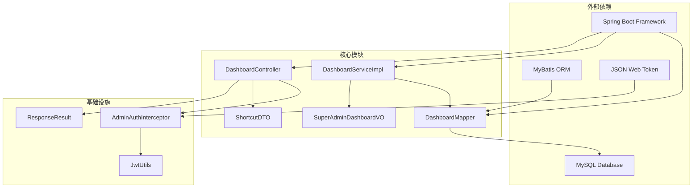

# 仪表盘系统

<cite>
**本文档引用的文件**
- [DashboardController.java](file://src/main/java/com/daily/dailychineseculture/controller/DashboardController.java)
- [DashboardService.java](file://src/main/java/com/daily/dailychineseculture/service/DashboardService.java)
- [DashboardServiceImpl.java](file://src/main/java/com/daily/dailychineseculture/service/impl/DashboardServiceImpl.java)
- [DashboardMapper.java](file://src/main/java/com/daily/dailychineseculture/mapper/DashboardMapper.java)
- [DashboardMapper.xml](file://src/main/resources/mapper/DashboardMapper.xml)
- [SuperAdminDashboardVO.java](file://src/main/java/com/daily/dailychineseculture/vo/SuperAdminDashboardVO.java)
- [ResponseResult.java](file://src/main/java/com/daily/dailychineseculture/common/ResponseResult.java)
- [ShortcutDTO.java](file://src/main/java/com/daily/dailychineseculture/dto/ShortcutDTO.java)
- [RecentCampDTO.java](file://src/main/java/com/daily/dailychineseculture/dto/RecentCampDTO.java)
- [Camp.java](file://src/main/java/com/daily/dailychineseculture/entity/Camp.java)
- [AdminAuthInterceptor.java](file://src/main/java/com/daily/dailychineseculture/interceptor/AdminAuthInterceptor.java)
- [JwtUtils.java](file://src/main/java/com/daily/dailychineseculture/util/JwtUtils.java)
- [application.yml](file://src/main/resources/application.yml)
- [仪表盘快捷入口 API文档.md](file://doc/仪表盘快捷入口 API文档.md)
- [管理员数据看板.md](file://readme/仪表盘与数据看板/管理员数据看板.md)
- [学员端快捷入口.md](file://readme/仪表盘与数据看板/学员端快捷入口.md)
</cite>

## 目录
1. [简介](#简介)
2. [项目结构](#项目结构)
3. [核心组件](#核心组件)
4. [架构概览](#架构概览)
5. [详细组件分析](#详细组件分析)
6. [依赖关系分析](#依赖关系分析)
7. [性能考虑](#性能考虑)
8. [故障排除指南](#故障排除指南)
9. [结论](#结论)

## 简介

仪表盘系统是每日中文文化项目中的核心管理功能模块，主要为后台管理系统提供数据可视化和快捷操作入口。该系统包含两个主要功能模块：

1. **超级管理员仪表盘**：提供系统全局统计数据和待审批事项监控
2. **快捷入口导航**：为不同角色用户提供个性化的功能入口网格

系统采用Spring Boot + MyBatis的典型三层架构设计，通过JWT令牌进行身份认证，支持多角色权限管理。

## 项目结构

仪表盘系统遵循标准的MVC架构模式，主要文件组织如下：

**图表来源**
- [DashboardController.java:1-25](file://src/main/java/com/daily/dailychineseculture/controller/DashboardController.java#L1-L25)
- [DashboardServiceImpl.java:1-26](file://src/main/java/com/daily/dailychineseculture/service/impl/DashboardServiceImpl.java#L1-L26)
- [DashboardMapper.java:1-20](file://src/main/java/com/daily/dailychineseculture/mapper/DashboardMapper.java#L1-L20)

**章节来源**
- [DashboardController.java:1-25](file://src/main/java/com/daily/dailychineseculture/controller/DashboardController.java#L1-L25)
- [DashboardService.java:1-8](file://src/main/java/com/daily/dailychineseculture/service/DashboardService.java#L1-L8)
- [DashboardServiceImpl.java:1-26](file://src/main/java/com/daily/dailychineseculture/service/impl/DashboardServiceImpl.java#L1-L26)

## 核心组件

### 仪表盘控制器 (DashboardController)

负责处理仪表盘相关的HTTP请求，当前实现包括超级管理员仪表盘和快捷入口功能。

**主要职责：**
- 验证用户权限（仅超级管理员可访问）
- 调用服务层获取数据
- 返回统一格式的响应结果

**接口定义：**
- `GET /api/admin/dashboard/super-admin` - 获取超级管理员仪表盘数据
- `GET /api/admin/dashboard/shortcuts` - 获取快捷入口列表

**章节来源**
- [DashboardController.java:16-23](file://src/main/java/com/daily/dailychineseculture/controller/DashboardController.java#L16-L23)

### 仪表盘服务接口 (DashboardService)

定义仪表盘功能的服务接口规范。

**核心方法：**
- `getSuperAdminDashboard()` - 获取超级管理员仪表盘数据

**章节来源**
- [DashboardService.java:5-7](file://src/main/java/com/daily/dailychineseculture/service/DashboardService.java#L5-L7)

### 仪表盘服务实现 (DashboardServiceImpl)

具体实现仪表盘功能的业务逻辑。

**主要功能：**
- 统计总用户数
- 统计进行中的营期数量
- 统计活跃管理员数量
- 统计待审批数量
- 获取最新的待审批事项

**章节来源**
- [DashboardServiceImpl.java:15-24](file://src/main/java/com/daily/dailychineseculture/service/impl/DashboardServiceImpl.java#L15-L24)

### 数据访问层 (DashboardMapper)

定义与数据库交互的接口方法。

**核心查询：**
- `countTotalUsers()` - 统计总用户数
- `countActiveCamps()` - 统计活跃营期数
- `countActiveAdmins()` - 统计活跃管理员数
- `countPendingApprovals()` - 统计待审批数
- `selectLatestPendingApprovals(limit)` - 获取最新待审批事项

**章节来源**
- [DashboardMapper.java:9-18](file://src/main/java/com/daily/dailychineseculture/mapper/DashboardMapper.java#L9-L18)

## 架构概览

仪表盘系统采用经典的MVC架构模式，结合拦截器实现统一的权限控制和数据格式化。

**图表来源**
- [AdminAuthInterceptor.java:24-82](file://src/main/java/com/daily/dailychineseculture/interceptor/AdminAuthInterceptor.java#L24-L82)
- [JwtUtils.java:176-227](file://src/main/java/com/daily/dailychineseculture/util/JwtUtils.java#L176-L227)
- [DashboardController.java:18-22](file://src/main/java/com/daily/dailychineseculture/controller/DashboardController.java#L18-L22)

## 详细组件分析

### 超级管理员仪表盘

超级管理员仪表盘提供系统全局的统计数据，帮助管理员全面了解系统运行状况。

#### 数据模型设计

**图表来源**
- [SuperAdminDashboardVO.java:8-21](file://src/main/java/com/daily/dailychineseculture/vo/SuperAdminDashboardVO.java#L8-L21)
- [DashboardMapper.java:9-18](file://src/main/java/com/daily/dailychineseculture/mapper/DashboardMapper.java#L9-L18)

#### 数据库查询逻辑

**图表来源**
- [DashboardMapper.xml:6-36](file://src/main/resources/mapper/DashboardMapper.xml#L6-L36)

**章节来源**
- [DashboardServiceImpl.java:16-24](file://src/main/java/com/daily/dailychineseculture/service/impl/DashboardServiceImpl.java#L16-L24)
- [DashboardMapper.xml:6-36](file://src/main/resources/mapper/DashboardMapper.xml#L6-L36)

### 快捷入口导航系统

快捷入口系统为不同角色用户提供个性化的功能入口网格，支持动态配置和权限控制。

#### 快捷入口数据传输对象

**图表来源**
- [ShortcutDTO.java:16-47](file://src/main/java/com/daily/dailychineseculture/dto/ShortcutDTO.java#L16-L47)
- [DashboardService.java:5-7](file://src/main/java/com/daily/dailychineseculture/service/DashboardService.java#L5-L7)

#### 快捷入口配置策略

当前系统采用硬编码方式实现，未来可扩展为：

1. **数据库存储**：建立快捷入口配置表，支持动态管理
2. **配置文件**：通过application.yml配置不同角色的快捷入口
3. **权限系统**：根据用户权限动态过滤可访问的快捷入口

**章节来源**
- [DashboardServiceImpl.java:232-272](file://src/main/java/com/daily/dailychineseculture/service/impl/DashboardServiceImpl.java#L232-L272)
- [ShortcutDTO.java:16-47](file://src/main/java/com/daily/dailychineseculture/dto/ShortcutDTO.java#L16-L47)

### 最近活跃课程监控

管理员数据看板提供最近活跃课程的实时监控功能。

#### 数据模型映射

**图表来源**
- [Camp.java:17-62](file://src/main/java/com/daily/dailychineseculture/entity/Camp.java#L17-L62)
- [RecentCampDTO.java:16-53](file://src/main/java/com/daily/dailychineseculture/dto/RecentCampDTO.java#L16-L53)

**章节来源**
- [管理员数据看板.md:40-73](file://readme/仪表盘与数据看板/管理员数据看板.md#L40-L73)

## 依赖关系分析

仪表盘系统的依赖关系清晰，遵循单一职责原则和依赖倒置原则。

**图表来源**
- [AdminAuthInterceptor.java:15-18](file://src/main/java/com/daily/dailychineseculture/interceptor/AdminAuthInterceptor.java#L15-L18)
- [JwtUtils.java:25-38](file://src/main/java/com/daily/dailychineseculture/util/JwtUtils.java#L25-L38)

**章节来源**
- [application.yml:6-22](file://src/main/resources/application.yml#L6-L22)

## 性能考虑

### 数据库查询优化

1. **索引策略**：建议在`t_camp`表的`status`和`start_time`字段建立复合索引
2. **查询限制**：使用`LIMIT`限制返回结果数量，避免大数据集查询
3. **连接池配置**：合理配置数据库连接池参数，提高并发处理能力

### 缓存策略

1. **结果缓存**：对频繁访问的统计数据添加Redis缓存
2. **配置缓存**：快捷入口配置可添加本地缓存，减少数据库查询
3. **会话缓存**：JWT令牌验证结果可添加短期缓存

### 异步处理

对于耗时的数据统计操作，可考虑异步执行并使用消息队列进行解耦。

## 故障排除指南

### 常见问题及解决方案

#### 1. 权限验证失败

**问题现象：** 返回401错误或提示Token已过期

**可能原因：**
- Token格式不正确（缺少Bearer前缀）
- Token已过期
- Token签名验证失败

**解决步骤：**
1. 检查请求头格式：`Authorization: Bearer <token>`
2. 验证Token有效期
3. 确认服务器密钥配置正确

**章节来源**
- [AdminAuthInterceptor.java:39-60](file://src/main/java/com/daily/dailychineseculture/interceptor/AdminAuthInterceptor.java#L39-L60)
- [JwtUtils.java:192-227](file://src/main/java/com/daily/dailychineseculture/util/JwtUtils.java#L192-L227)

#### 2. 数据查询异常

**问题现象：** 仪表盘数据无法正常显示

**可能原因：**
- 数据库连接配置错误
- SQL查询语法错误
- 表结构不匹配

**解决步骤：**
1. 检查数据库连接URL和凭据
2. 验证SQL语句的正确性
3. 确认实体类与数据库字段映射关系

**章节来源**
- [application.yml:8-11](file://src/main/resources/application.yml#L8-L11)
- [DashboardMapper.xml:6-36](file://src/main/resources/mapper/DashboardMapper.xml#L6-L36)

#### 3. 响应格式异常

**问题现象：** API响应格式不符合预期

**可能原因：**
- ResponseResult类配置错误
- 异常处理逻辑异常

**解决步骤：**
1. 检查ResponseResult的构造函数
2. 验证异常处理分支
3. 确认时间戳字段正确设置

**章节来源**
- [ResponseResult.java:30-43](file://src/main/java/com/daily/dailychineseculture/common/ResponseResult.java#L30-L43)

## 结论

仪表盘系统作为每日中文文化项目的核心管理功能，具有以下特点：

### 技术优势
1. **架构清晰**：采用标准的MVC架构，职责分离明确
2. **扩展性强**：支持多角色权限管理和动态配置
3. **安全性高**：完整的JWT认证机制和拦截器保护
4. **数据标准化**：统一的响应格式和数据模型

### 功能特色
1. **实时监控**：提供系统关键指标的实时统计
2. **个性化导航**：支持不同角色的快捷入口定制
3. **权限控制**：严格的访问控制和数据隔离
4. **易于集成**：标准化的API接口设计

### 发展建议
1. **完善权限体系**：实现基于角色的细粒度权限控制
2. **增强数据可视化**：引入图表库提供更丰富的数据展示
3. **优化性能**：添加缓存机制和异步处理
4. **扩展监控维度**：增加更多业务指标的监控

该系统为项目的日常运营提供了强有力的技术支撑，通过持续的优化和完善，将为用户提供更好的管理体验。