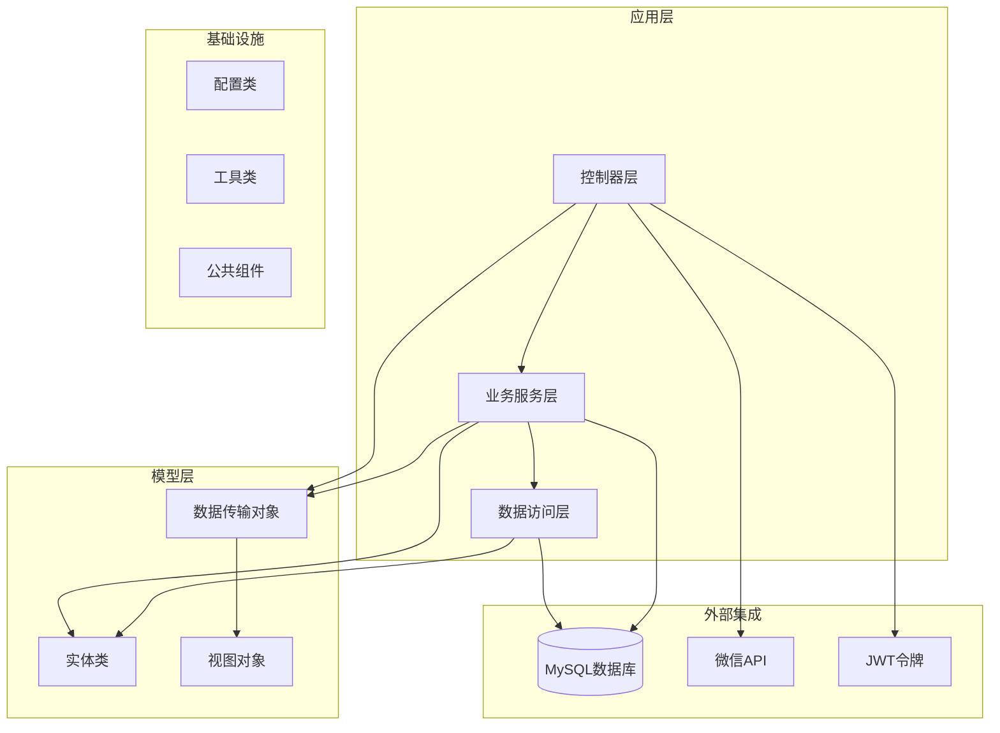
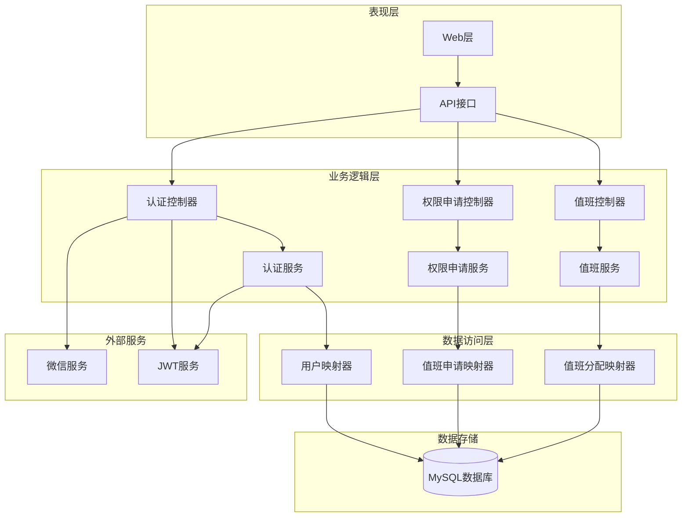
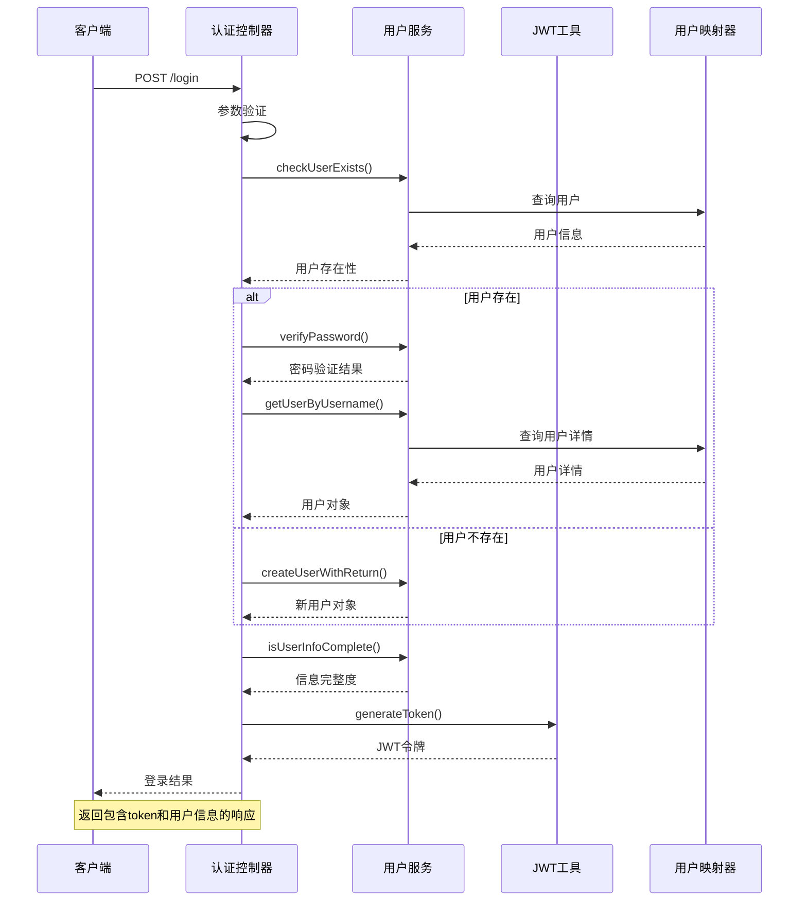
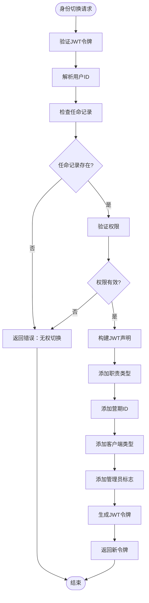
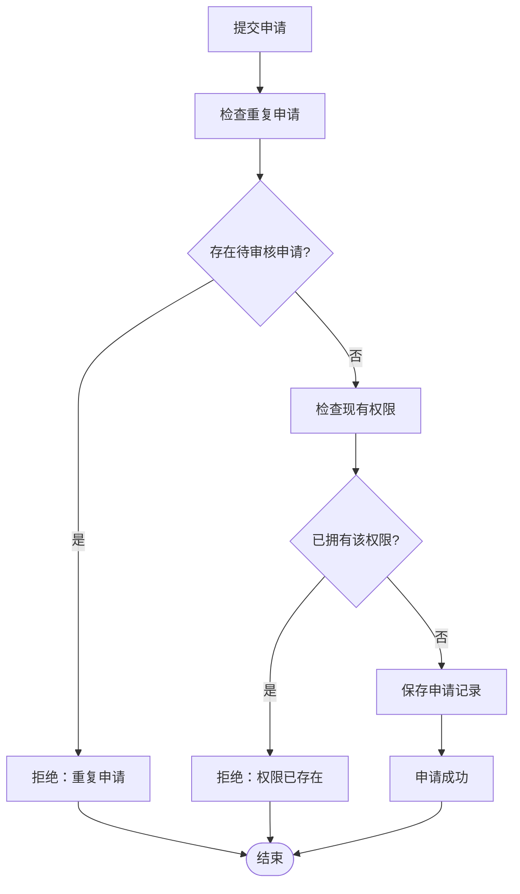
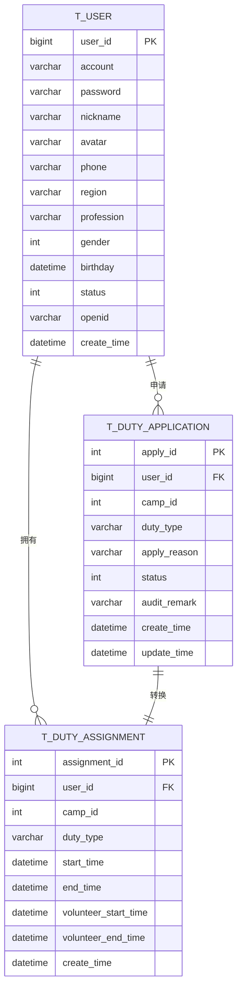
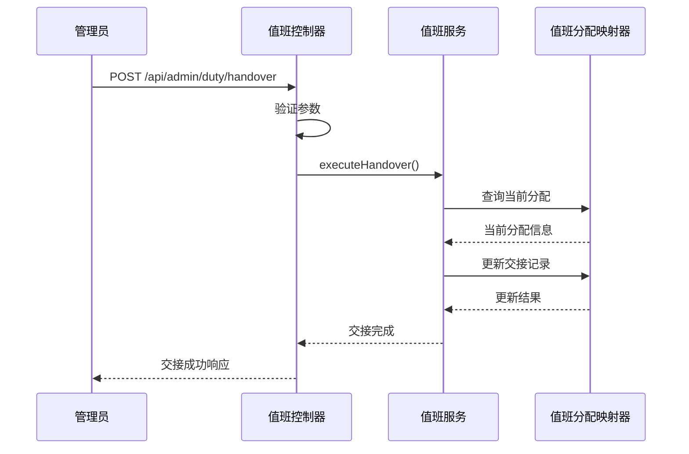
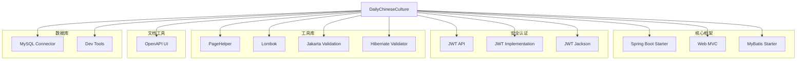

# 值班管理系统

<cite>
**本文档引用的文件**
- [DailyChineseCultureApplication.java](file://src/main/java/com/daily/dailychineseculture/DailyChineseCultureApplication.java)
- [application.yml](file://src/main/resources/application.yml)
- [pom.xml](file://pom.xml)
- [AuthController.java](file://src/main/java/com/daily/dailychineseculture/controller/AuthController.java)
- [UserAuthService.java](file://src/main/java/com/daily/dailychineseculture/service/UserAuthService.java)
- [UserAuthServiceImpl.java](file://src/main/java/com/daily/dailychineseculture/service/impl/UserAuthServiceImpl.java)
- [DutyApplicationController.java](file://src/main/java/com/daily/dailychineseculture/controller/DutyApplicationController.java)
- [DutyController.java](file://src/main/java/com/daily/dailychineseculture/controller/DutyController.java)
- [DutyApplication.java](file://src/main/java/com/daily/dailychineseculture/entity/DutyApplication.java)
- [DutyAssignment.java](file://src/main/java/com/daily/dailychineseculture/entity/DutyAssignment.java)
- [User.java](file://src/main/java/com/daily/dailychineseculture/entity/User.java)
- [LoginRequest.java](file://src/main/java/com/daily/dailychineseculture/dto/LoginRequest.java)
- [API接口文档.md](file://doc/API接口文档.md)
</cite>

## 目录
1. [项目简介](#项目简介)
2. [项目结构](#项目结构)
3. [核心组件](#核心组件)
4. [架构概览](#架构概览)
5. [详细组件分析](#详细组件分析)
6. [依赖关系分析](#依赖关系分析)
7. [性能考虑](#性能考虑)
8. [故障排除指南](#故障排除指南)
9. [结论](#结论)

## 项目简介

值班管理系统是一个基于Spring Boot开发的现代化管理系统，主要面向教育培训场景，提供值班管理、权限申请、用户认证等核心功能。系统采用前后端分离架构，支持多端访问（Web管理端、小程序端），具备完善的权限管理和身份切换机制。

系统的核心特色包括：
- 多端身份切换：支持学员端、志愿者端、管理端的灵活切换
- 完整的值班管理：从权限申请到值班交接的全流程管理
- 安全的用户认证：基于JWT的令牌认证机制
- 灵活的权限控制：支持全局权限和营期特定权限的管理

## 项目结构

项目采用标准的Spring Boot多模块结构，主要分为以下几个层次：

**图表来源**
- [DailyChineseCultureApplication.java:1-40](file://src/main/java/com/daily/dailychineseculture/DailyChineseCultureApplication.java#L1-L40)
- [application.yml:1-33](file://src/main/resources/application.yml#L1-L33)

**章节来源**
- [DailyChineseCultureApplication.java:1-40](file://src/main/java/com/daily/dailychineseculture/DailyChineseCultureApplication.java#L1-L40)
- [application.yml:1-33](file://src/main/resources/application.yml#L1-L33)

## 核心组件

### 应用启动类
应用的入口点，负责初始化Spring Boot应用、配置跨域支持和RestTemplate依赖注入。

### 配置管理
系统配置集中在application.yml中，包括数据库连接、文件上传、微信小程序配置等关键参数。

### 控制器层
- **认证控制器**：处理用户登录、微信登录、用户信息管理等认证相关功能
- **值班控制器**：管理资产检查、值班交接等核心业务功能
- **权限申请控制器**：处理值班权限的申请、查询、撤销等操作

### 服务层
- **用户认证服务**：提供用户身份验证、身份切换、权限管理等核心认证功能
- **值班申请服务**：管理值班权限申请的业务逻辑
- **值班服务**：处理值班相关的业务操作

**章节来源**
- [AuthController.java:1-529](file://src/main/java/com/daily/dailychineseculture/controller/AuthController.java#L1-L529)
- [UserAuthService.java:1-49](file://src/main/java/com/daily/dailychineseculture/service/UserAuthService.java#L1-L49)
- [UserAuthServiceImpl.java:1-168](file://src/main/java/com/daily/dailychineseculture/service/impl/UserAuthServiceImpl.java#L1-L168)

## 架构概览

系统采用经典的三层架构模式，结合Spring Boot的依赖注入和AOP特性，实现了清晰的关注点分离：

**图表来源**
- [AuthController.java:19-21](file://src/main/java/com/daily/dailychineseculture/controller/AuthController.java#L19-L21)
- [DutyController.java:10-12](file://src/main/java/com/daily/dailychineseculture/controller/DutyController.java#L10-L12)
- [DutyApplicationController.java:19-21](file://src/main/java/com/daily/dailychineseculture/controller/DutyApplicationController.java#L19-L21)

**章节来源**
- [pom.xml:32-117](file://pom.xml#L32-L117)

## 详细组件分析

### 认证系统

认证系统是整个值班管理系统的核心，提供了完整的用户身份验证和权限管理功能。

#### 登录流程

**图表来源**
- [AuthController.java:63-112](file://src/main/java/com/daily/dailychineseculture/controller/AuthController.java#L63-L112)
- [UserAuthServiceImpl.java:30-61](file://src/main/java/com/daily/dailychineseculture/service/impl/UserAuthServiceImpl.java#L30-L61)

#### 身份切换机制

系统支持多端身份切换，用户可以在不同角色间灵活切换：

**图表来源**
- [UserAuthServiceImpl.java:74-117](file://src/main/java/com/daily/dailychineseculture/service/impl/UserAuthServiceImpl.java#L74-L117)
- [DutyApplicationController.java:409-445](file://src/main/java/com/daily/dailychineseculture/controller/DutyApplicationController.java#L409-L445)

**章节来源**
- [AuthController.java:63-136](file://src/main/java/com/daily/dailychineseculture/controller/AuthController.java#L63-L136)
- [UserAuthServiceImpl.java:74-117](file://src/main/java/com/daily/dailychineseculture/service/impl/UserAuthServiceImpl.java#L74-L117)

### 值班申请系统

值班申请系统提供了完整的权限申请、审批和管理功能：

#### 申请流程

**图表来源**
- [DutyApplicationServiceImpl.java:33-58](file://src/main/java/com/daily/dailychineseculture/service/impl/DutyApplicationServiceImpl.java#L33-L58)

#### 数据模型设计

**图表来源**
- [User.java:10-87](file://src/main/java/com/daily/dailychineseculture/entity/User.java#L10-L87)
- [DutyApplication.java:11-61](file://src/main/java/com/daily/dailychineseculture/entity/DutyApplication.java#L11-L61)
- [DutyAssignment.java:10-59](file://src/main/java/com/daily/dailychineseculture/entity/DutyAssignment.java#L10-L59)

**章节来源**
- [DutyApplicationController.java:29-143](file://src/main/java/com/daily/dailychineseculture/controller/DutyApplicationController.java#L29-L143)
- [DutyApplication.java:11-61](file://src/main/java/com/daily/dailychineseculture/entity/DutyApplication.java#L11-L61)
- [DutyAssignment.java:10-59](file://src/main/java/com/daily/dailychineseculture/entity/DutyAssignment.java#L10-L59)

### 值班交接系统

值班交接功能确保了工作的连续性和责任明确性：

#### 交接流程

**图表来源**
- [DutyController.java:26-36](file://src/main/java/com/daily/dailychineseculture/controller/DutyController.java#L26-L36)

**章节来源**
- [DutyController.java:17-36](file://src/main/java/com/daily/dailychineseculture/controller/DutyController.java#L17-L36)

## 依赖关系分析

系统采用Maven管理依赖，主要依赖包括Spring Boot、MyBatis、JWT、分页插件等：

**图表来源**
- [pom.xml:32-117](file://pom.xml#L32-L117)

**章节来源**
- [pom.xml:1-149](file://pom.xml#L1-L149)

## 性能考虑

系统在设计时充分考虑了性能优化和扩展性：

### 数据库优化
- 启用驼峰命名转换，减少手动映射开销
- 使用PageHelper实现高效的分页查询
- 合理的索引设计和查询优化

### 缓存策略
- JWT令牌基于无状态设计，无需服务端缓存
- 微信授权码采用一次性使用机制
- 结果缓存策略可根据业务需求扩展

### 并发处理
- 基于JWT的无状态认证，天然支持高并发
- 事务管理确保数据一致性
- 异步处理机制支持耗时操作

## 故障排除指南

### 常见问题及解决方案

#### 登录认证问题
1. **用户名或密码错误**
   - 检查用户是否存在
   - 验证密码加密方式
   - 确认用户状态正常

2. **JWT令牌无效**
   - 检查令牌格式和有效期
   - 验证签名完整性
   - 确认客户端时间同步

#### 数据库连接问题
1. **连接超时**
   - 检查网络连通性
   - 验证数据库服务状态
   - 调整连接池配置

2. **SQL执行错误**
   - 检查SQL语法
   - 验证表结构一致性
   - 查看MyBatis映射配置

#### 微信登录问题
1. **授权码失效**
   - 检查授权码时效性
   - 验证微信配置正确性
   - 确认网络访问权限

2. **用户信息获取失败**
   - 检查微信API调用频率限制
   - 验证返回数据格式
   - 查看异常日志

**章节来源**
- [AuthController.java:108-112](file://src/main/java/com/daily/dailychineseculture/controller/AuthController.java#L108-L112)
- [application.yml:7-11](file://src/main/resources/application.yml#L7-L11)

## 结论

值班管理系统是一个功能完整、架构清晰的现代化管理系统。系统采用Spring Boot技术栈，结合JWT认证、MyBatis数据持久化等先进技术，实现了以下核心价值：

### 技术优势
- **模块化设计**：清晰的分层架构便于维护和扩展
- **安全性保障**：完善的认证授权机制确保系统安全
- **性能优化**：合理的数据库设计和缓存策略提升系统性能
- **开发效率**：丰富的注解和自动化配置减少开发工作量

### 业务价值
- **灵活的身份管理**：支持多端身份切换满足不同业务场景
- **完整的权限控制**：从申请到审批的全流程权限管理
- **良好的用户体验**：简洁直观的操作界面和流畅的交互体验
- **可靠的系统稳定性**：完善的异常处理和监控机制

### 发展建议
1. **增强监控能力**：增加系统性能监控和业务指标统计
2. **扩展权限体系**：细化权限粒度支持更精细的权限控制
3. **优化移动端体验**：针对小程序端进行专门的性能优化
4. **完善测试体系**：建立更全面的自动化测试覆盖

该系统为教育培训领域的值班管理提供了完整的数字化解决方案，具有良好的可扩展性和维护性，能够满足不断发展的业务需求。