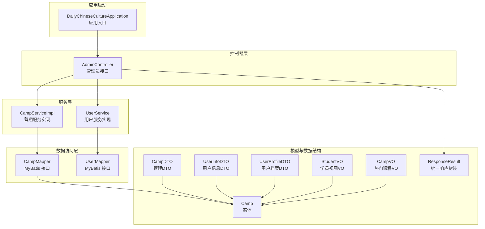
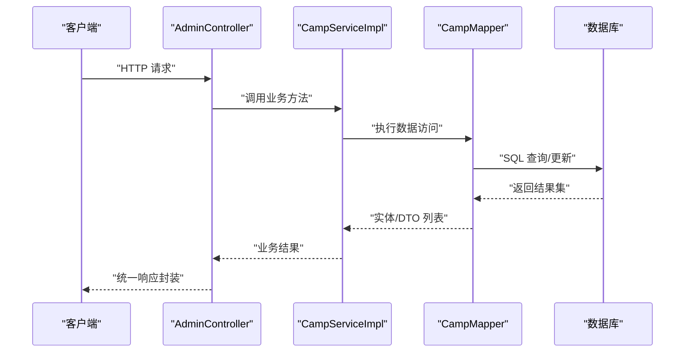
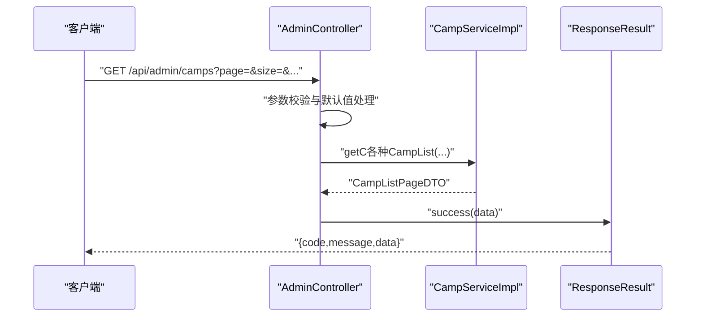
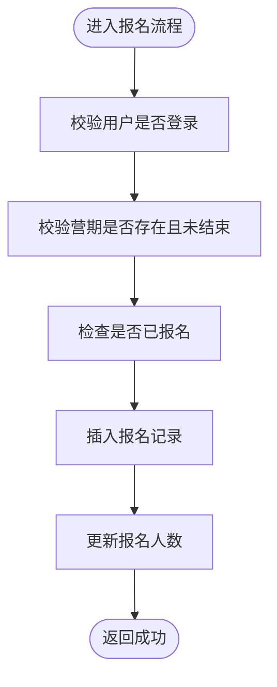
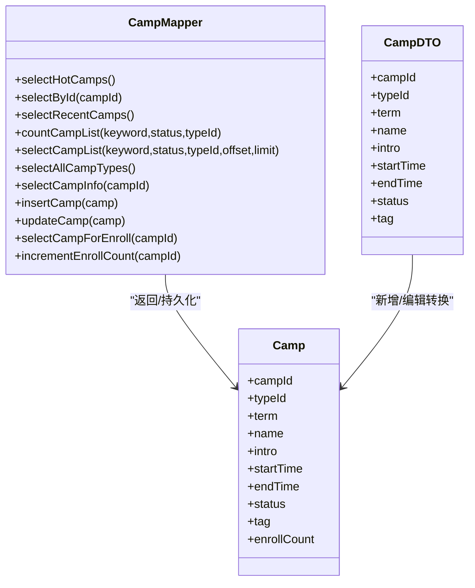
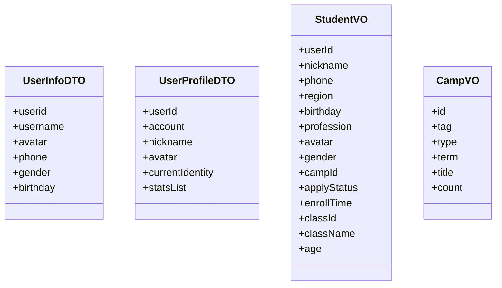
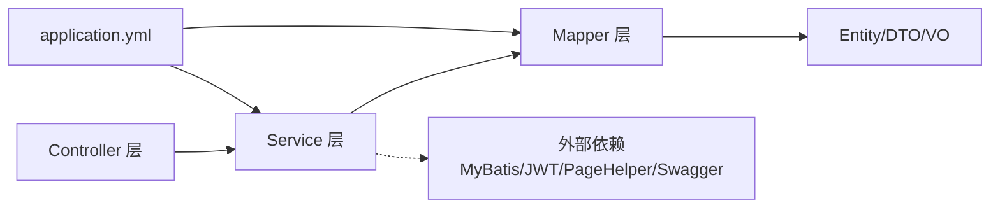

# 分层架构设计

<cite>
**本文引用的文件**
- [DailyChineseCultureApplication.java](file://src/main/java/com/daily/dailychineseculture/DailyChineseCultureApplication.java)
- [AdminController.java](file://src/main/java/com/daily/dailychineseculture/controller/AdminController.java)
- [CampServiceImpl.java](file://src/main/java/com/daily/dailychineseculture/service/impl/CampServiceImpl.java)
- [CampMapper.java](file://src/main/java/com/daily/dailychineseculture/mapper/CampMapper.java)
- [Camp.java](file://src/main/java/com/daily/dailychineseculture/entity/Camp.java)
- [ResponseResult.java](file://src/main/java/com/daily/dailychineseculture/common/ResponseResult.java)
- [CampDTO.java](file://src/main/java/com/daily/dailychineseculture/dto/CampDTO.java)
- [StudentVO.java](file://src/main/java/com/daily/dailychineseculture/vo/StudentVO.java)
- [application.yml](file://src/main/resources/application.yml)
- [pom.xml](file://src/main/resources/pom.xml)
- [UserService.java](file://src/main/java/com/daily/dailychineseculture/service/UserService.java)
- [UserMapper.java](file://src/main/java/com/daily/dailychineseculture/mapper/UserMapper.java)
- [GlobalExceptionHandler.java](file://src/main/java/com/daily/dailychineseculture/common/GlobalExceptionHandler.java)
- [UserInfoDTO.java](file://src/main/java/com/daily/dailychineseculture/dto/UserInfoDTO.java)
- [UserProfileDTO.java](file://src/main/java/com/daily/dailychineseculture/dto/UserProfileDTO.java)
- [CampVO.java](file://src/main/java/com/daily/dailychineseculture/dto/CampVO.java)
</cite>

## 目录
1. [引言](#引言)
2. [项目结构](#项目结构)
3. [核心组件](#核心组件)
4. [架构总览](#架构总览)
5. [详细组件分析](#详细组件分析)
6. [依赖分析](#依赖分析)
7. [性能考虑](#性能考虑)
8. [故障排查指南](#故障排查指南)
9. [结论](#结论)
10. [附录](#附录)

## 引言
本项目采用基于 Spring Boot 的 MVC 三层架构设计，围绕“控制器层-服务层-数据访问层”进行职责分离，结合 DTO/VO 模式实现前后端数据解耦与展示优化。本文档系统阐述各层职责边界、依赖关系与调用流程，解析实体类设计原则与数据传输对象的使用场景，并给出架构图与组件关系图，帮助开发者快速理解与扩展系统。

## 项目结构
项目采用标准的 Spring Boot 目录组织方式，按功能域划分包结构：
- controller：对外暴露 REST 接口，负责请求接收、参数校验与统一响应包装
- service：封装业务逻辑，协调多个 Mapper 或服务，保证事务与一致性
- mapper：MyBatis 接口，负责与数据库交互，执行 SQL 语句
- entity：领域实体，映射数据库表结构
- dto：数据传输对象，面向接口与客户端的数据结构
- vo：视图对象，面向前端展示的数据结构
- common：公共工具与全局异常处理
- resources：配置文件与 MyBatis XML 映射文件

图表来源
- [DailyChineseCultureApplication.java:12-40](file://src/main/java/com/daily/dailychineseculture/DailyChineseCultureApplication.java#L12-L40)
- [AdminController.java:25-203](file://src/main/java/com/daily/dailychineseculture/controller/AdminController.java#L25-L203)
- [CampServiceImpl.java:27-266](file://src/main/java/com/daily/dailychineseculture/service/impl/CampServiceImpl.java#L27-L266)
- [UserService.java:22-959](file://src/main/java/com/daily/dailychineseculture/service/UserService.java#L22-L959)
- [CampMapper.java:18-132](file://src/main/java/com/daily/dailychineseculture/mapper/CampMapper.java#L18-L132)
- [UserMapper.java:12-252](file://src/main/java/com/daily/dailychineseculture/mapper/UserMapper.java#L12-L252)
- [Camp.java:11-64](file://src/main/java/com/daily/dailychineseculture/entity/Camp.java#L11-L64)
- [CampDTO.java:12-63](file://src/main/java/com/daily/dailychineseculture/dto/CampDTO.java#L12-L63)
- [UserInfoDTO.java:9-40](file://src/main/java/com/daily/dailychineseculture/dto/UserInfoDTO.java#L9-L40)
- [UserProfileDTO.java:9-43](file://src/main/java/com/daily/dailychineseculture/dto/UserProfileDTO.java#L9-L43)
- [StudentVO.java:10-56](file://src/main/java/com/daily/dailychineseculture/vo/StudentVO.java#L10-L56)
- [CampVO.java:9-40](file://src/main/java/com/daily/dailychineseculture/dto/CampVO.java#L9-L40)
- [ResponseResult.java:8-79](file://src/main/java/com/daily/dailychineseculture/common/ResponseResult.java#L8-L79)

章节来源
- [DailyChineseCultureApplication.java:12-40](file://src/main/java/com/daily/dailychineseculture/DailyChineseCultureApplication.java#L12-L40)
- [application.yml:1-33](file://src/main/resources/application.yml#L1-L33)

## 核心组件
- 控制器层（Controller）
  - 职责：接收 HTTP 请求，参数校验，调用服务层，组装统一响应
  - 示例：AdminController 提供管理员登录、营期列表查询、个人资料读写等接口
- 服务层（Service）
  - 职责：封装业务规则，协调多个 Mapper，处理事务，进行数据转换
  - 示例：CampServiceImpl 实现营期查询、分页、报名等复杂业务
- 数据访问层（Mapper）
  - 职责：与数据库交互，执行 SQL，返回实体或 DTO
  - 示例：CampMapper 定义营期相关的查询与更新方法
- 实体与数据结构
  - 实体：Camp 等映射数据库表
  - DTO：面向接口的数据结构，如 CampDTO、UserInfoDTO、UserProfileDTO
  - VO：面向前端展示的数据结构，如 StudentVO、CampVO
- 统一响应与异常处理
  - ResponseResult：统一封装响应码、消息与数据
  - GlobalExceptionHandler：全局异常捕获，保障接口稳定性

章节来源
- [AdminController.java:25-203](file://src/main/java/com/daily/dailychineseculture/controller/AdminController.java#L25-L203)
- [CampServiceImpl.java:27-266](file://src/main/java/com/daily/dailychineseculture/service/impl/CampServiceImpl.java#L27-L266)
- [CampMapper.java:18-132](file://src/main/java/com/daily/dailychineseculture/mapper/CampMapper.java#L18-L132)
- [Camp.java:11-64](file://src/main/java/com/daily/dailychineseculture/entity/Camp.java#L11-L64)
- [CampDTO.java:12-63](file://src/main/java/com/daily/dailychineseculture/dto/CampDTO.java#L12-L63)
- [UserInfoDTO.java:9-40](file://src/main/java/com/daily/dailychineseculture/dto/UserInfoDTO.java#L9-L40)
- [UserProfileDTO.java:9-43](file://src/main/java/com/daily/dailychineseculture/dto/UserProfileDTO.java#L9-L43)
- [StudentVO.java:10-56](file://src/main/java/com/daily/dailychineseculture/vo/StudentVO.java#L10-L56)
- [CampVO.java:9-40](file://src/main/java/com/daily/dailychineseculture/dto/CampVO.java#L9-L40)
- [ResponseResult.java:8-79](file://src/main/java/com/daily/dailychineseculture/common/ResponseResult.java#L8-L79)
- [GlobalExceptionHandler.java:9-29](file://src/main/java/com/daily/dailychineseculture/common/GlobalExceptionHandler.java#L9-L29)

## 架构总览
下图展示了典型的请求处理链路：控制器接收请求，调用服务层，服务层通过 Mapper 访问数据库，最终返回统一响应。

图表来源
- [AdminController.java:45-113](file://src/main/java/com/daily/dailychineseculture/controller/AdminController.java#L45-L113)
- [CampServiceImpl.java:128-157](file://src/main/java/com/daily/dailychineseculture/service/impl/CampServiceImpl.java#L128-L157)
- [CampMapper.java:68-86](file://src/main/java/com/daily/dailychineseculture/mapper/CampMapper.java#L68-L86)
- [ResponseResult.java:48-79](file://src/main/java/com/daily/dailychineseculture/common/ResponseResult.java#L48-L79)

## 详细组件分析

### 控制器层：职责边界与调用流程
- 职责边界
  - 参数接收与简单校验
  - 异常捕获与统一响应封装
  - 业务调用与结果返回
- 典型流程
  - 管理员登录：接收请求体 → 调用 AdminAuthService → 返回 Result
  - 营期列表分页：接收分页参数 → 调用 CampService → 返回分页 DTO
  - 个人资料读写：从拦截器注入的用户标识获取用户 → 通过 UserMapper 查询/更新 → 返回 ResponseResult

图表来源
- [AdminController.java:98-113](file://src/main/java/com/daily/dailychineseculture/controller/AdminController.java#L98-L113)
- [CampServiceImpl.java:127-157](file://src/main/java/com/daily/dailychineseculture/service/impl/CampServiceImpl.java#L127-L157)
- [ResponseResult.java:48-79](file://src/main/java/com/daily/dailychineseculture/common/ResponseResult.java#L48-L79)

章节来源
- [AdminController.java:25-203](file://src/main/java/com/daily/dailychineseculture/controller/AdminController.java#L25-L203)
- [ResponseResult.java:8-79](file://src/main/java/com/daily/dailychineseculture/common/ResponseResult.java#L8-L79)

### 服务层：业务逻辑封装与事务控制
- 职责
  - 业务编排与规则校验
  - DTO/VO 转换与数据格式化
  - 事务边界管理
- 典型实现
  - 分页查询：计算偏移量、查询总数、分页查询、组装分页 DTO
  - 报名流程：校验用户与营期状态、去重检查、插入报名记录、更新报名人数
  - 状态文本映射：根据状态码返回中文状态描述

图表来源
- [CampServiceImpl.java:207-243](file://src/main/java/com/daily/dailychineseculture/service/impl/CampServiceImpl.java#L207-L243)

章节来源
- [CampServiceImpl.java:27-266](file://src/main/java/com/daily/dailychineseculture/service/impl/CampServiceImpl.java#L27-L266)

### 数据访问层：Mapper 接口与实体映射
- 职责
  - 定义 SQL 方法，返回实体或 DTO
  - 通过注解或 XML 执行数据库操作
- 设计要点
  - 实体与数据库字段映射：开启驼峰命名转换
  - 复杂查询通过 XML 或注解实现，返回 DTO 列表
  - 事务内跨表更新保持一致性

图表来源
- [CampMapper.java:18-132](file://src/main/java/com/daily/dailychineseculture/mapper/CampMapper.java#L18-L132)
- [Camp.java:11-64](file://src/main/java/com/daily/dailychineseculture/entity/Camp.java#L11-L64)
- [CampDTO.java:12-63](file://src/main/java/com/daily/dailychineseculture/dto/CampDTO.java#L12-L63)

章节来源
- [CampMapper.java:18-132](file://src/main/java/com/daily/dailychineseculture/mapper/CampMapper.java#L18-L132)
- [Camp.java:11-64](file://src/main/java/com/daily/dailychineseculture/entity/Camp.java#L11-L64)
- [application.yml:17-22](file://src/main/resources/application.yml#L17-L22)

### DTO/VO 模式：设计理念与使用场景
- DTO（数据传输对象）
  - 面向接口与客户端的数据结构，承载请求/响应数据
  - 示例：CampDTO（管理新增/编辑）、UserInfoDTO（登录返回）、UserProfileDTO（用户档案）
- VO（视图对象）
  - 面向前端展示的数据结构，包含组合字段与辅助计算
  - 示例：StudentVO（学员视图，含年龄计算）、CampVO（热门课程，含格式化字段）
- 转换机制
  - 服务层在业务处理完成后，将实体或中间结果转换为 DTO/VO
  - 控制器层统一返回 ResponseResult 包裹的 DTO/VO

图表来源
- [UserInfoDTO.java:9-40](file://src/main/java/com/daily/dailychineseculture/dto/UserInfoDTO.java#L9-L40)
- [UserProfileDTO.java:9-43](file://src/main/java/com/daily/dailychineseculture/dto/UserProfileDTO.java#L9-L43)
- [StudentVO.java:10-56](file://src/main/java/com/daily/dailychineseculture/vo/StudentVO.java#L10-L56)
- [CampVO.java:9-40](file://src/main/java/com/daily/dailychineseculture/dto/CampVO.java#L9-L40)

章节来源
- [UserInfoDTO.java:9-40](file://src/main/java/com/daily/dailychineseculture/dto/UserInfoDTO.java#L9-L40)
- [UserProfileDTO.java:9-43](file://src/main/java/com/daily/dailychineseculture/dto/UserProfileDTO.java#L9-L43)
- [StudentVO.java:10-56](file://src/main/java/com/daily/dailychineseculture/vo/StudentVO.java#L10-L56)
- [CampVO.java:9-40](file://src/main/java/com/daily/dailychineseculture/dto/CampVO.java#L9-L40)

### 依赖注入与松耦合设计
- 控制器通过 @Autowired 注入服务层
- 服务层通过 @Autowired 注入 Mapper
- 应用通过 @SpringBootApplication 启动，启用异步与跨域配置
- 通过接口与实现类解耦，便于单元测试与替换

章节来源
- [DailyChineseCultureApplication.java:12-40](file://src/main/java/com/daily/dailychineseculture/DailyChineseCultureApplication.java#L12-L40)
- [AdminController.java:29-36](file://src/main/java/com/daily/dailychineseculture/controller/AdminController.java#L29-L36)
- [CampServiceImpl.java:30-34](file://src/main/java/com/daily/dailychineseculture/service/impl/CampServiceImpl.java#L30-L34)

## 依赖分析
- 组件耦合
  - Controller 依赖 Service；Service 依赖 Mapper；Mapper 依赖 Entity/DTO
  - 低耦合高内聚：各层职责清晰，接口稳定
- 外部依赖
  - Spring Web、MyBatis、MySQL Connector、Lombok、JWT、分页插件、API 文档工具等
- 配置依赖
  - application.yml 中配置数据源、MyBatis 驼峰映射与 Mapper XML 位置

图表来源
- [pom.xml:32-117](file://src/main/resources/pom.xml#L32-L117)
- [application.yml:6-22](file://src/main/resources/application.yml#L6-L22)

章节来源
- [pom.xml:32-117](file://src/main/resources/pom.xml#L32-L117)
- [application.yml:1-33](file://src/main/resources/application.yml#L1-L33)

## 性能考虑
- 数据库访问
  - 使用 MyBatis 注解与 XML 组合，复杂查询建议使用 XML 便于优化
  - 开启驼峰映射减少字段映射成本
- 分页与统计
  - 服务层先查总数再分页查询，避免一次性加载大量数据
- 事务边界
  - 报名流程使用 @Transactional 保证一致性，注意事务范围与异常回滚策略
- 跨域与异步
  - 启用跨域与异步，提升用户体验与并发能力

## 故障排查指南
- 统一异常处理
  - 全局异常处理器捕获 Exception 与 RuntimeException，统一返回 ResponseResult.error
- 常见问题定位
  - 控制器层：检查参数校验与异常分支，确认 Result/ResponseResult 使用正确
  - 服务层：关注业务前置校验与事务异常，定位 DuplicateKeyException 与 IllegalArgumentException
  - 数据访问层：核对 SQL 与参数绑定，确认 XML 与注解方法签名一致

章节来源
- [GlobalExceptionHandler.java:9-29](file://src/main/java/com/daily/dailychineseculture/common/GlobalExceptionHandler.java#L9-L29)
- [AdminController.java:45-68](file://src/main/java/com/daily/dailychineseculture/controller/AdminController.java#L45-L68)
- [CampServiceImpl.java:207-243](file://src/main/java/com/daily/dailychineseculture/service/impl/CampServiceImpl.java#L207-L243)

## 结论
本项目通过清晰的三层架构与 DTO/VO 模式实现了前后端解耦与业务逻辑封装，配合统一响应与全局异常处理提升了系统的稳定性与可维护性。建议在后续开发中持续优化复杂查询、完善单元测试与接口文档，确保架构的长期演进与扩展。

## 附录
- 配置要点
  - 数据源与 MyBatis 驼峰映射、Mapper XML 位置
- 依赖清单
  - Spring Web、MyBatis、MySQL Connector、Lombok、JWT、分页插件、API 文档工具

章节来源
- [application.yml:6-33](file://src/main/resources/application.yml#L6-L33)
- [pom.xml:32-117](file://src/main/resources/pom.xml#L32-L117)