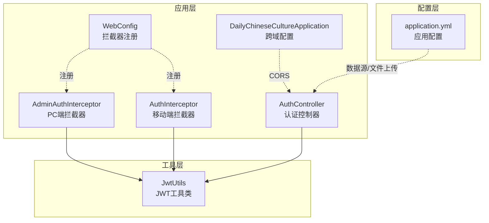
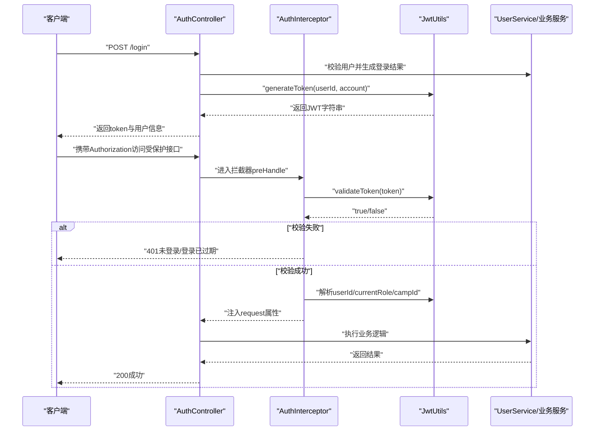
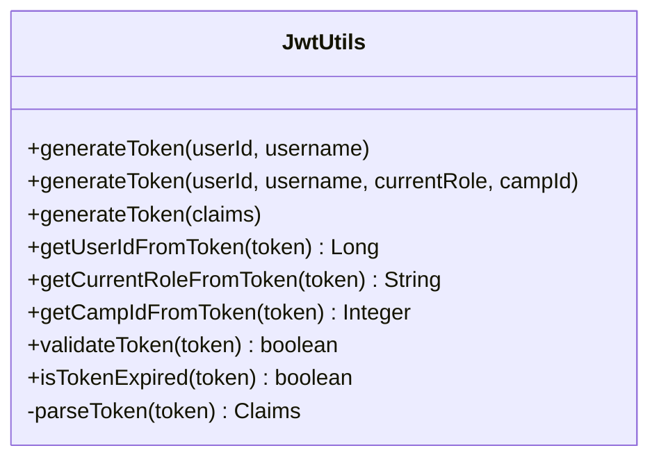
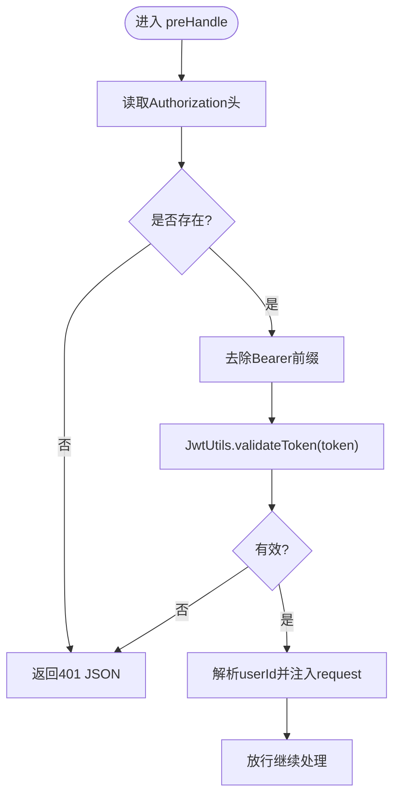
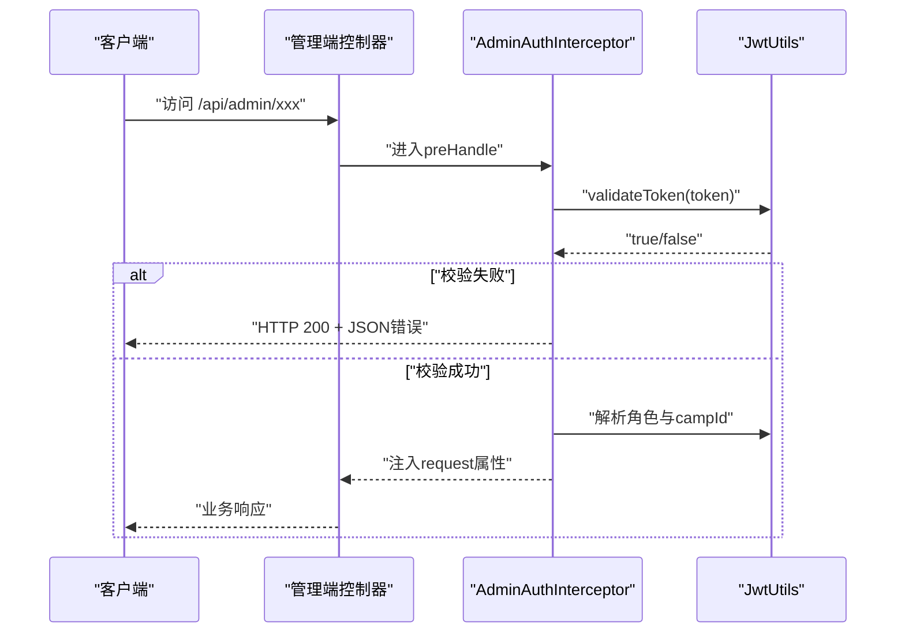
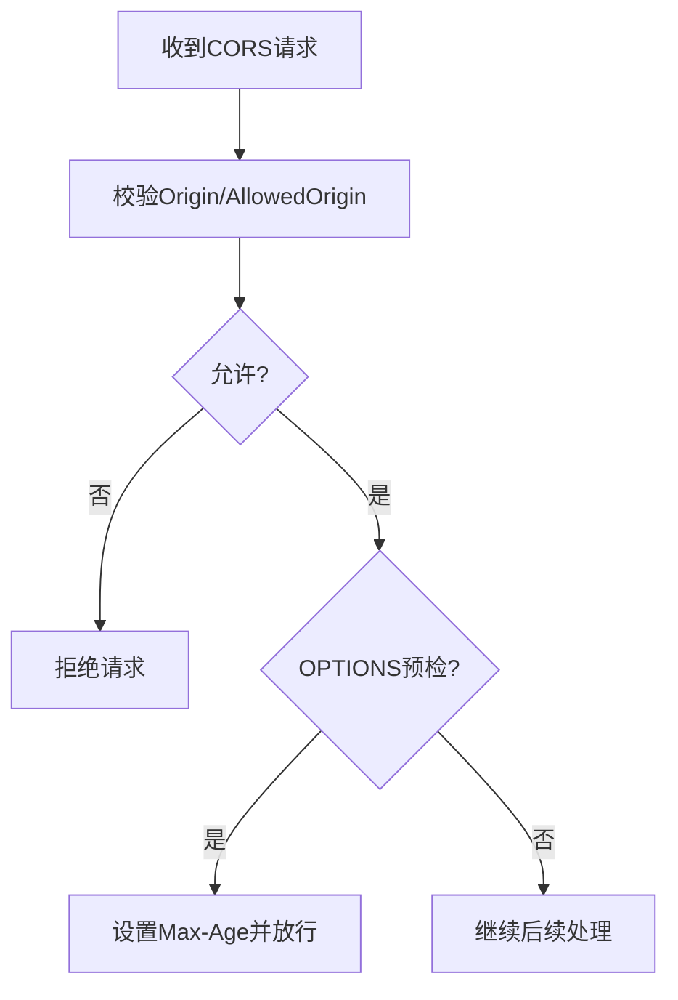
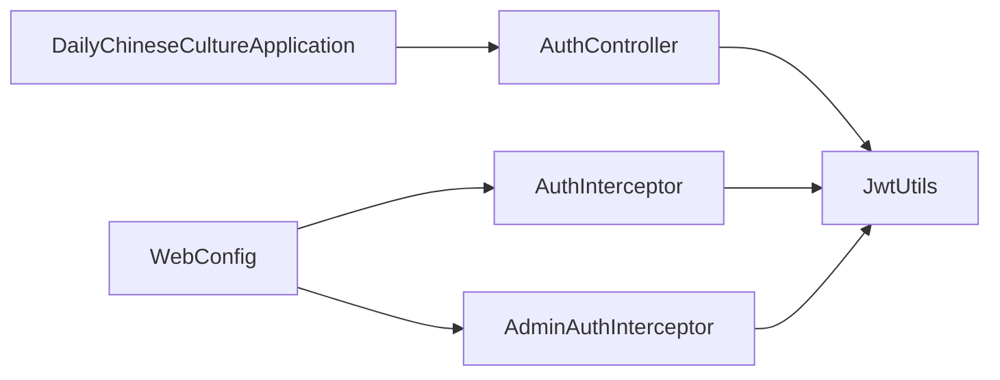

# 安全架构设计

<cite>
**本文引用的文件**
- [JwtUtils.java](file://src/main/java/com/daily/dailychineseculture/util/JwtUtils.java)
- [AuthController.java](file://src/main/java/com/daily/dailychineseculture/controller/AuthController.java)
- [AuthInterceptor.java](file://src/main/java/com/daily/dailychineseculture/interceptor/AuthInterceptor.java)
- [AdminAuthInterceptor.java](file://src/main/java/com/daily/dailychineseculture/interceptor/AdminAuthInterceptor.java)
- [WebConfig.java](file://src/main/java/com/daily/dailychineseculture/config/WebConfig.java)
- [application.yml](file://src/main/resources/application.yml)
- [DailyChineseCultureApplication.java](file://src/main/java/com/daily/dailychineseculture/DailyChineseCultureApplication.java)
- [LoginFunctionTest.java](file://src/test/java/com/daily/dailychineseculture/LoginFunctionTest.java)
- [登录认证与用户信息体系代码扫描报告.md](file://doc/登录认证与用户信息体系代码扫描报告.md)
- [PC端后台管理登录接口 HTTP 401 错误修复方案.md](file://doc/PC端后台管理登录接口 HTTP 401 错误修复方案.md)
- [bug排查相关代码收集.md](file://doc/bug排查相关代码收集.md)
</cite>

## 目录
1. [简介](#简介)
2. [项目结构](#项目结构)
3. [核心组件](#核心组件)
4. [架构总览](#架构总览)
5. [组件详解](#组件详解)
6. [依赖关系分析](#依赖关系分析)
7. [性能考量](#性能考量)
8. [故障排查指南](#故障排查指南)
9. [结论](#结论)
10. [附录](#附录)

## 简介
本文件面向安全架构设计，围绕基于 JWT 的认证授权体系进行全面阐述。内容涵盖：
- JWT Token 的生成、验证与解析机制
- 跨域处理与 CORS 策略
- 安全头部与常见 Web 安全威胁（CSRF、XSS）的缓解思路
- 认证拦截器与路由规则
- 安全最佳实践与生产加固建议

## 项目结构
项目采用 Spring Boot MVC 架构，安全相关能力通过拦截器与工具类实现，未引入 Spring Security。关键安全模块分布如下：
- 工具层：JWT 工具类负责 Token 的签发、解析与校验
- 控制层：认证控制器处理登录、用户信息查询等接口
- 拦截层：认证拦截器与管理端拦截器分别对移动端与 PC 端进行统一鉴权
- 配置层：Web 配置与跨域配置，定义拦截路径与 CORS 行为

图表来源
- [AuthController.java:1-516](file://src/main/java/com/daily/dailychineseculture/controller/AuthController.java#L1-L516)
- [AuthInterceptor.java:1-74](file://src/main/java/com/daily/dailychineseculture/interceptor/AuthInterceptor.java#L1-L74)
- [AdminAuthInterceptor.java:1-93](file://src/main/java/com/daily/dailychineseculture/interceptor/AdminAuthInterceptor.java#L1-L93)
- [WebConfig.java:1-105](file://src/main/java/com/daily/dailychineseculture/config/WebConfig.java#L1-L105)
- [DailyChineseCultureApplication.java:523-563](file://src/main/java/com/daily/dailychineseculture/DailyChineseCultureApplication.java#L523-L563)
- [application.yml:1-33](file://src/main/resources/application.yml#L1-L33)

章节来源
- [WebConfig.java:18-104](file://src/main/java/com/daily/dailychineseculture/config/WebConfig.java#L18-L104)
- [DailyChineseCultureApplication.java:523-563](file://src/main/java/com/daily/dailychineseculture/DailyChineseCultureApplication.java#L523-L563)

## 核心组件
- JWT 工具类：提供 Token 生成、Claims 解析、有效性校验与过期判断
- 认证拦截器：统一校验 Authorization 头，解析用户标识，注入请求上下文
- 管理端拦截器：针对 /api/admin/** 路径进行鉴权，返回统一 JSON 错误
- Web 配置：注册拦截器与静态资源映射，明确放行路径
- 跨域配置：全局 CORS 过滤器，支持凭证与预检请求

章节来源
- [JwtUtils.java:21-206](file://src/main/java/com/daily/dailychineseculture/util/JwtUtils.java#L21-L206)
- [AuthInterceptor.java:16-74](file://src/main/java/com/daily/dailychineseculture/interceptor/AuthInterceptor.java#L16-L74)
- [AdminAuthInterceptor.java:14-93](file://src/main/java/com/daily/dailychineseculture/interceptor/AdminAuthInterceptor.java#L14-L93)
- [WebConfig.java:47-103](file://src/main/java/com/daily/dailychineseculture/config/WebConfig.java#L47-L103)
- [DailyChineseCultureApplication.java:549-562](file://src/main/java/com/daily/dailychineseculture/DailyChineseCultureApplication.java#L549-L562)

## 架构总览
下图展示了移动端与 PC 端的认证流程与拦截器交互：

图表来源
- [AuthController.java:63-136](file://src/main/java/com/daily/dailychineseculture/controller/AuthController.java#L63-L136)
- [AuthInterceptor.java:25-72](file://src/main/java/com/daily/dailychineseculture/interceptor/AuthInterceptor.java#L25-L72)
- [JwtUtils.java:165-190](file://src/main/java/com/daily/dailychineseculture/util/JwtUtils.java#L165-L190)

## 组件详解

### JWT 工具类（JwtUtils）
- 生成策略
  - 支持基础 Claims（userId、username）与多角色 Claims（currentRole、campId）
  - 默认过期时间为 7 天
  - 使用对称签名算法进行签发与验证
- 解析与校验
  - 提供 getUserIdFromToken、getCurrentRoleFromToken、getCampIdFromToken 等解析方法
  - validateToken 用于快速校验有效性；isTokenExpired 用于过期判断
- 安全要点
  - 密钥与过期时间均为内存常量，生产环境需从配置读取并轮换
  - Claims 中不应包含敏感信息，避免在前端暴露

图表来源
- [JwtUtils.java:37-95](file://src/main/java/com/daily/dailychineseculture/util/JwtUtils.java#L37-L95)
- [JwtUtils.java:104-141](file://src/main/java/com/daily/dailychineseculture/util/JwtUtils.java#L104-L141)
- [JwtUtils.java:165-205](file://src/main/java/com/daily/dailychineseculture/util/JwtUtils.java#L165-L205)

章节来源
- [JwtUtils.java:24-28](file://src/main/java/com/daily/dailychineseculture/util/JwtUtils.java#L24-L28)
- [JwtUtils.java:50-69](file://src/main/java/com/daily/dailychineseculture/util/JwtUtils.java#L50-L69)
- [JwtUtils.java:77-95](file://src/main/java/com/daily/dailychineseculture/util/JwtUtils.java#L77-L95)
- [JwtUtils.java:104-141](file://src/main/java/com/daily/dailychineseculture/util/JwtUtils.java#L104-L141)
- [JwtUtils.java:165-205](file://src/main/java/com/daily/dailychineseculture/util/JwtUtils.java#L165-L205)

### 认证拦截器（AuthInterceptor）
- 功能
  - 从请求头提取 Authorization，去除 Bearer 前缀
  - 调用 JwtUtils.validateToken 校验
  - 成功时解析 userId 并注入 request 属性
  - 未携带或无效时返回 401 JSON 响应
- 路由规则
  - 默认拦截所有路径，通过 WebConfig.excludePathPatterns 放行公开接口

图表来源
- [AuthInterceptor.java:25-72](file://src/main/java/com/daily/dailychineseculture/interceptor/AuthInterceptor.java#L25-L72)
- [JwtUtils.java:165-172](file://src/main/java/com/daily/dailychineseculture/util/JwtUtils.java#L165-L172)

章节来源
- [AuthInterceptor.java:25-72](file://src/main/java/com/daily/dailychineseculture/interceptor/AuthInterceptor.java#L25-L72)
- [WebConfig.java:48-88](file://src/main/java/com/daily/dailychineseculture/config/WebConfig.java#L48-L88)

### 管理端拦截器（AdminAuthInterceptor）
- 功能
  - 针对 /api/admin/** 路径进行鉴权
  - 对登录、验证码等接口放行
  - 校验失败时返回 200 + JSON 错误体，避免泄露 401 细节
  - 解析并注入 userId、currentRole、campId

图表来源
- [AdminAuthInterceptor.java:23-82](file://src/main/java/com/daily/dailychineseculture/interceptor/AdminAuthInterceptor.java#L23-L82)
- [JwtUtils.java:165-141](file://src/main/java/com/daily/dailychineseculture/util/JwtUtils.java#L165-L141)

章节来源
- [AdminAuthInterceptor.java:23-82](file://src/main/java/com/daily/dailychineseculture/interceptor/AdminAuthInterceptor.java#L23-L82)
- [WebConfig.java:90-102](file://src/main/java/com/daily/dailychineseculture/config/WebConfig.java#L90-L102)

### 跨域与 CORS 配置
- 全局 CORS 过滤器
  - 放宽来源、方法与头部，允许凭证，设置预检缓存时长
  - 适用于前后端分离场景
- 预检请求放行
  - WebConfig 中对 OPTIONS 预检请求进行放行，避免跨域阻断

图表来源
- [DailyChineseCultureApplication.java:549-562](file://src/main/java/com/daily/dailychineseculture/DailyChineseCultureApplication.java#L549-L562)
- [WebConfig.java:83-84](file://src/main/java/com/daily/dailychineseculture/config/WebConfig.java#L83-L84)

章节来源
- [DailyChineseCultureApplication.java:549-562](file://src/main/java/com/daily/dailychineseculture/DailyChineseCultureApplication.java#L549-L562)
- [WebConfig.java:83-84](file://src/main/java/com/daily/dailychineseculture/config/WebConfig.java#L83-L84)

### 安全头与传输安全
- HTTPS 强制
  - 生产环境必须启用 TLS，防止明文传输
- 安全响应头（建议）
  - Content-Security-Policy、X-Frame-Options、X-Content-Type-Options、Referrer-Policy、Permissions-Policy
  - 通过网关或反向代理统一注入，避免业务侵入

[本节为通用安全建议，不直接分析具体文件]

### CSRF 防护
- 本项目为无状态 JWT，不涉及 Cookie 会话，天然规避 CSRF
- 若未来引入 Cookie 会话，建议：
  - 启用 SameSite Cookie
  - 使用 CSRF Token 与双提交 Cookie
  - 严格来源校验（Origin/Header）

[本节为通用安全建议，不直接分析具体文件]

### XSS 防护
- 输入输出过滤与转义
  - 对用户输入进行白名单校验与长度限制
  - 输出渲染时进行 HTML 转义
- 内容安全策略
  - 设置 CSP，限制脚本来源与内联脚本执行

[本节为通用安全建议，不直接分析具体文件]

## 依赖关系分析
- 控制器依赖 JwtUtils 进行 Token 生成与解析
- 拦截器依赖 JwtUtils 进行 Token 校验与用户信息解析
- WebConfig 注册拦截器并定义放行路径
- DailyChineseCultureApplication 提供全局 CORS 过滤器

图表来源
- [AuthController.java:23-33](file://src/main/java/com/daily/dailychineseculture/controller/AuthController.java#L23-L33)
- [AuthInterceptor.java:19-20](file://src/main/java/com/daily/dailychineseculture/interceptor/AuthInterceptor.java#L19-L20)
- [AdminAuthInterceptor.java:17-18](file://src/main/java/com/daily/dailychineseculture/interceptor/AdminAuthInterceptor.java#L17-L18)
- [WebConfig.java:48-102](file://src/main/java/com/daily/dailychineseculture/config/WebConfig.java#L48-L102)
- [DailyChineseCultureApplication.java:549-562](file://src/main/java/com/daily/dailychineseculture/DailyChineseCultureApplication.java#L549-L562)

章节来源
- [AuthController.java:23-33](file://src/main/java/com/daily/dailychineseculture/controller/AuthController.java#L23-L33)
- [AuthInterceptor.java:19-20](file://src/main/java/com/daily/dailychineseculture/interceptor/AuthInterceptor.java#L19-L20)
- [AdminAuthInterceptor.java:17-18](file://src/main/java/com/daily/dailychineseculture/interceptor/AdminAuthInterceptor.java#L17-L18)
- [WebConfig.java:48-102](file://src/main/java/com/daily/dailychineseculture/config/WebConfig.java#L48-L102)
- [DailyChineseCultureApplication.java:549-562](file://src/main/java/com/daily/dailychineseculture/DailyChineseCultureApplication.java#L549-L562)

## 性能考量
- Token 解析成本极低，主要为签名验证与时间比较
- 建议：
  - 缓存热点用户信息（短时）
  - 合理设置过期时间，平衡安全与性能
  - 使用对称算法（HS256）时注意密钥管理与轮换

[本节为通用性能建议，不直接分析具体文件]

## 故障排查指南
- 登录接口返回 401
  - 检查 Authorization 头是否正确传递 Bearer 前缀
  - 核对 JwtUtils.validateToken 校验结果
- 管理端接口返回 200 + JSON 错误
  - AdminAuthInterceptor 对校验失败返回 200 + JSON，属预期行为
- 跨域问题
  - 确认 CORS 过滤器已生效，且预检请求被放行
- 测试用例
  - LoginFunctionTest 验证登录流程与返回结构

章节来源
- [AuthInterceptor.java:45-64](file://src/main/java/com/daily/dailychineseculture/interceptor/AuthInterceptor.java#L45-L64)
- [AdminAuthInterceptor.java:38-59](file://src/main/java/com/daily/dailychineseculture/interceptor/AdminAuthInterceptor.java#L38-L59)
- [LoginFunctionTest.java:19-39](file://src/test/java/com/daily/dailychineseculture/LoginFunctionTest.java#L19-L39)

## 结论
本项目采用轻量级拦截器 + JWT 的认证授权方案，具备以下特点：
- 无状态、易扩展、适合多端接入
- 通过拦截器集中处理鉴权与用户信息注入
- CORS 全局放行便于联调，生产需收紧策略
- 建议尽快补齐密码加密、Refresh Token、细粒度权限与审计日志等安全能力

[本节为总结性内容，不直接分析具体文件]

## 附录

### 安全最佳实践清单
- 密码安全
  - 使用强哈希（如 BCrypt）存储密码
  - 引入验证码与登录失败次数限制
- Token 安全
  - 密钥来自安全配置中心，定期轮换
  - 缩短过期时间，结合刷新 Token
  - Claims 不包含敏感字段
- 传输与网络
  - 强制 HTTPS，禁用弱密码套件
  - 限制来源与方法，关闭多余头部
- 运行与运维
  - 开启访问与审计日志
  - 实施最小权限原则与细粒度权限控制
  - 定期安全扫描与渗透测试

[本节为通用安全建议，不直接分析具体文件]

### 生产加固建议（基于现有实现）
- 密钥与配置
  - 将 JwtUtils 中的密钥与过期时间迁移到配置中心与环境变量
- 路由与放行
  - 收紧 WebConfig 放行列表，仅保留必要公开接口
- 管理端错误处理
  - 统一错误码与日志，避免泄露内部细节
- 跨域策略
  - 生产环境限定 AllowedOrigin，关闭通配与凭证混用风险

章节来源
- [JwtUtils.java:24-28](file://src/main/java/com/daily/dailychineseculture/util/JwtUtils.java#L24-L28)
- [WebConfig.java:48-102](file://src/main/java/com/daily/dailychineseculture/config/WebConfig.java#L48-L102)
- [application.yml:24-32](file://src/main/resources/application.yml#L24-L32)