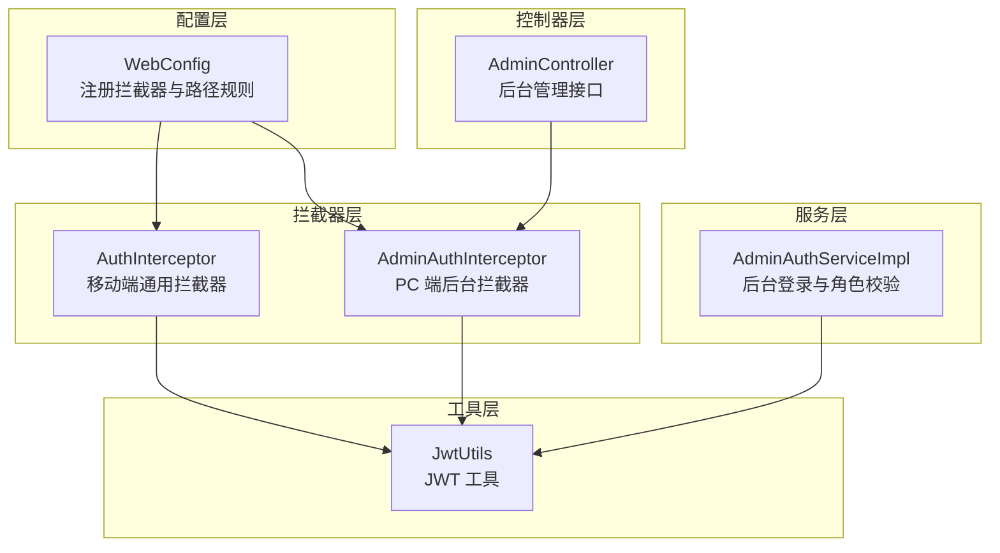
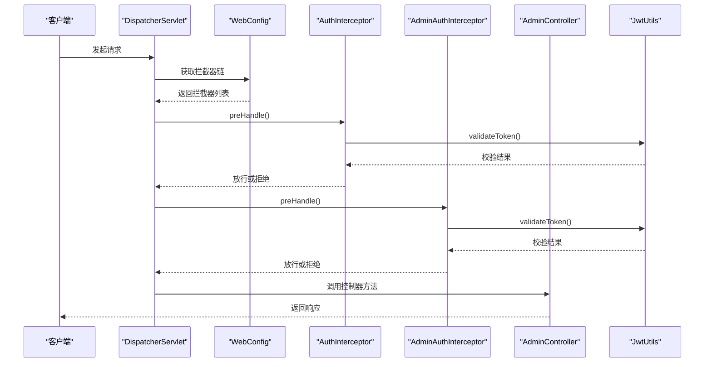
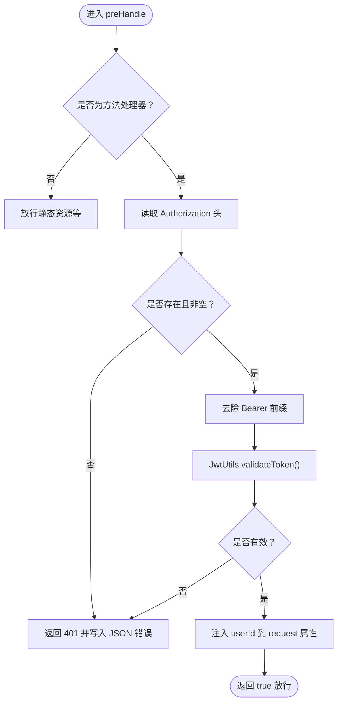
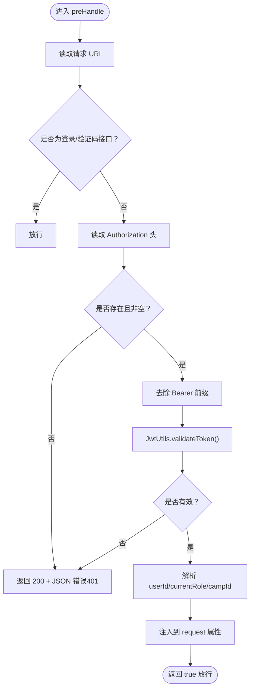
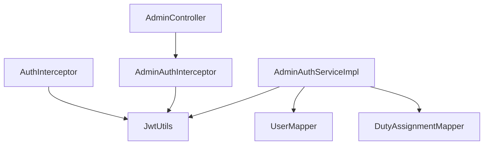
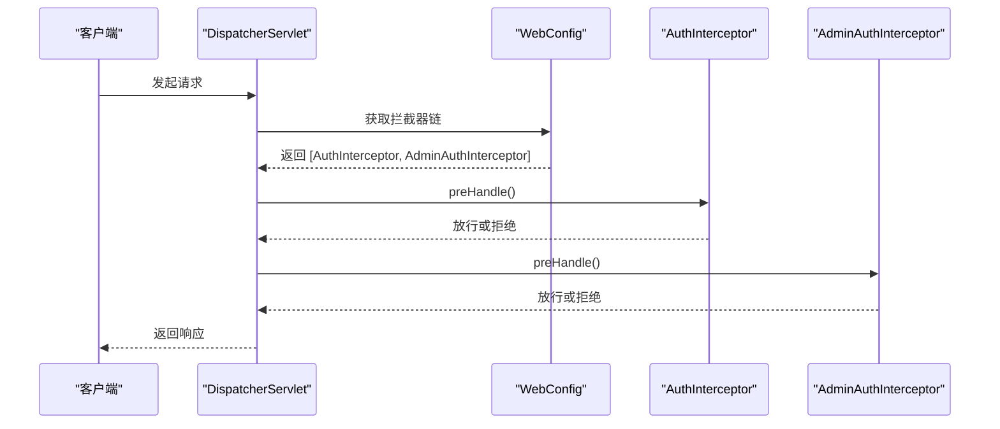
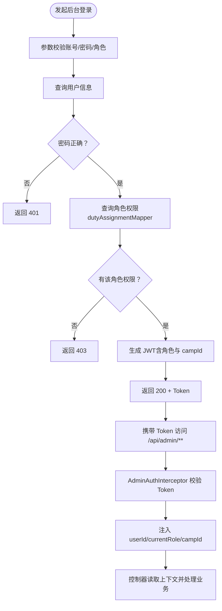

# 拦截器与权限控制

<cite>
**本文引用的文件**
- [AuthInterceptor.java](file://src/main/java/com/daily/dailychineseculture/interceptor/AuthInterceptor.java)
- [AdminAuthInterceptor.java](file://src/main/java/com/daily/dailychineseculture/interceptor/AdminAuthInterceptor.java)
- [WebConfig.java](file://src/main/java/com/daily/dailychineseculture/config/WebConfig.java)
- [JwtUtils.java](file://src/main/java/com/daily/dailychineseculture/util/JwtUtils.java)
- [AdminAuthServiceImpl.java](file://src/main/java/com/daily/dailychineseculture/service/impl/AdminAuthServiceImpl.java)
- [AdminController.java](file://src/main/java/com/daily/dailychineseculture/controller/AdminController.java)
- [AdminLoginRequest.java](file://src/main/java/com/daily/dailychineseculture/dto/AdminLoginRequest.java)
- [AdminLoginResult.java](file://src/main/java/com/daily/dailychineseculture/dto/AdminLoginResult.java)
- [AdminAuthApiTest.java](file://src/test/java/com/daily/dailychineseculture/AdminAuthApiTest.java)
</cite>

## 目录
1. [简介](#简介)
2. [项目结构](#项目结构)
3. [核心组件](#核心组件)
4. [架构总览](#架构总览)
5. [详细组件分析](#详细组件分析)
6. [依赖分析](#依赖分析)
7. [性能考量](#性能考量)
8. [故障排查指南](#故障排查指南)
9. [结论](#结论)
10. [附录](#附录)

## 简介
本文件系统性阐述本项目的拦截器与权限控制机制，重点覆盖：
- AuthInterceptor 与 AdminAuthInterceptor 的实现原理、JWT Token 验证流程与权限校验逻辑
- WebConfig 中拦截器注册配置、路径匹配规则与排除规则的设计考虑
- 多角色权限控制的实现方式、不同角色的访问权限差异与安全边界
- 拦截器执行顺序图、权限验证流程图与配置示例
- 拦截器扩展指南，说明如何添加新的拦截器与自定义权限验证规则

## 项目结构
本项目采用基于 Spring MVC 的拦截器体系，结合 JWT 实现移动端与后台管理端的差异化权限控制。关键文件分布如下：
- 拦截器：AuthInterceptor（移动端通用）、AdminAuthInterceptor（PC 端后台）
- 配置：WebConfig（注册拦截器、路径匹配与排除规则）
- 工具：JwtUtils（Token 生成、解析、验证）
- 服务：AdminAuthServiceImpl（后台登录与角色权限校验）
- 控制器：AdminController（后台管理接口，受 AdminAuthInterceptor 保护）

图表来源
- [WebConfig.java:48-103](file://src/main/java/com/daily/dailychineseculture/config/WebConfig.java#L48-L103)
- [AuthInterceptor.java:17-72](file://src/main/java/com/daily/dailychineseculture/interceptor/AuthInterceptor.java#L17-L72)
- [AdminAuthInterceptor.java:15-82](file://src/main/java/com/daily/dailychineseculture/interceptor/AdminAuthInterceptor.java#L15-L82)
- [JwtUtils.java:22-206](file://src/main/java/com/daily/dailychineseculture/util/JwtUtils.java#L22-L206)
- [AdminAuthServiceImpl.java:20-97](file://src/main/java/com/daily/dailychineseculture/service/impl/AdminAuthServiceImpl.java#L20-L97)
- [AdminController.java:27-203](file://src/main/java/com/daily/dailychineseculture/controller/AdminController.java#L27-L203)

章节来源
- [WebConfig.java:48-103](file://src/main/java/com/daily/dailychineseculture/config/WebConfig.java#L48-L103)

## 核心组件
- AuthInterceptor：移动端通用拦截器，负责校验 Authorization 头中的 Bearer Token，提取 userId 并注入到请求上下文，支持公开接口白名单。
- AdminAuthInterceptor：PC 端后台拦截器，专门拦截 /api/admin/** 路径，校验 Token 并注入 userId、currentRole、campId；对登录与验证码等接口放行。
- WebConfig：注册两个拦截器，分别配置全局与后台专用的路径匹配与排除规则，避免拦截器冲突。
- JwtUtils：提供 JWT 生成、解析、验证与过期判断能力，承载多角色与营期维度的 Claims。
- AdminAuthServiceImpl：后台登录服务，校验账号、密码与角色权限，生成包含角色与营期信息的 Token。
- AdminController：后台管理接口，受 AdminAuthInterceptor 保护，通过请求属性获取用户上下文。

章节来源
- [AuthInterceptor.java:17-72](file://src/main/java/com/daily/dailychineseculture/interceptor/AuthInterceptor.java#L17-L72)
- [AdminAuthInterceptor.java:15-82](file://src/main/java/com/daily/dailychineseculture/interceptor/AdminAuthInterceptor.java#L15-L82)
- [WebConfig.java:48-103](file://src/main/java/com/daily/dailychineseculture/config/WebConfig.java#L48-L103)
- [JwtUtils.java:22-206](file://src/main/java/com/daily/dailychineseculture/util/JwtUtils.java#L22-L206)
- [AdminAuthServiceImpl.java:20-97](file://src/main/java/com/daily/dailychineseculture/service/impl/AdminAuthServiceImpl.java#L20-L97)
- [AdminController.java:27-203](file://src/main/java/com/daily/dailychineseculture/controller/AdminController.java#L27-L203)

## 架构总览
拦截器与权限控制的整体交互流程如下：
- WebConfig 注册拦截器并配置路径规则
- 请求进入时，按注册顺序依次经过拦截器
- AuthInterceptor 对移动端接口进行通用 Token 校验
- AdminAuthInterceptor 对 /api/admin/** 接口进行后台专用校验，并注入用户上下文
- 控制器从请求属性中读取用户上下文，执行业务逻辑

图表来源
- [WebConfig.java:48-103](file://src/main/java/com/daily/dailychineseculture/config/WebConfig.java#L48-L103)
- [AuthInterceptor.java:25-72](file://src/main/java/com/daily/dailychineseculture/interceptor/AuthInterceptor.java#L25-L72)
- [AdminAuthInterceptor.java:23-82](file://src/main/java/com/daily/dailychineseculture/interceptor/AdminAuthInterceptor.java#L23-L82)
- [JwtUtils.java:165-172](file://src/main/java/com/daily/dailychineseculture/util/JwtUtils.java#L165-L172)
- [AdminController.java:45-68](file://src/main/java/com/daily/dailychineseculture/controller/AdminController.java#L45-L68)

## 详细组件分析

### AuthInterceptor 实现原理与流程
- 职责：移动端通用拦截器，校验 Authorization 头中的 Bearer Token，提取 userId 并注入到请求属性。
- 关键点：
  - 非方法处理器（静态资源等）直接放行
  - 无 Authorization 或为空时返回 401
  - 去除 "Bearer " 前缀后调用 JwtUtils.validateToken
  - 校验通过后将 userId 注入 request 属性，便于后续控制器使用

图表来源
- [AuthInterceptor.java:25-72](file://src/main/java/com/daily/dailychineseculture/interceptor/AuthInterceptor.java#L25-L72)
- [JwtUtils.java:165-172](file://src/main/java/com/daily/dailychineseculture/util/JwtUtils.java#L165-L172)

章节来源
- [AuthInterceptor.java:17-72](file://src/main/java/com/daily/dailychineseculture/interceptor/AuthInterceptor.java#L17-L72)
- [JwtUtils.java:104-111](file://src/main/java/com/daily/dailychineseculture/util/JwtUtils.java#L104-L111)

### AdminAuthInterceptor 实现原理与流程
- 职责：PC 端后台拦截器，拦截 /api/admin/**，校验 Token 并注入 userId、currentRole、campId。
- 关键点：
  - 放行登录与验证码接口（含 /api/admin/login、/captcha、/admin/captcha、/api/admin/captcha）
  - 无 Token 时返回 200 + JSON 错误（而非 401），保持前后端一致的错误格式
  - 校验失败同样返回 200 + JSON 错误
  - 校验通过后注入用户上下文，供控制器使用

图表来源
- [AdminAuthInterceptor.java:23-82](file://src/main/java/com/daily/dailychineseculture/interceptor/AdminAuthInterceptor.java#L23-L82)
- [JwtUtils.java:104-141](file://src/main/java/com/daily/dailychineseculture/util/JwtUtils.java#L104-L141)

章节来源
- [AdminAuthInterceptor.java:15-82](file://src/main/java/com/daily/dailychineseculture/interceptor/AdminAuthInterceptor.java#L15-L82)
- [JwtUtils.java:104-141](file://src/main/java/com/daily/dailychineseculture/util/JwtUtils.java#L104-L141)

### WebConfig 中拦截器注册与路径匹配
- 注册顺序：
  - AuthInterceptor（移动端通用）先注册，路径模式为 /**，并排除大量公开接口与静态资源
  - AdminAuthInterceptor（PC 端后台）后注册，路径模式为 /api/admin/**，并排除登录与验证码接口
- 设计考虑：
  - 避免拦截器冲突：通过明确的路径模式与排除规则，确保移动端与后台的差异化处理
  - 统一响应格式：后台拦截器返回 200 + JSON 错误，提升前端一致性处理体验
  - 兼容性：保留 /api/admin/** 排除项，避免影响后台登录接口

章节来源
- [WebConfig.java:48-103](file://src/main/java/com/daily/dailychineseculture/config/WebConfig.java#L48-L103)

### JWT Token 验证与多角色权限控制
- Token 结构与 Claims：
  - userId：用户标识
  - username：用户名
  - currentRole：当前角色（COURSE_ADMIN、ARCHIVE_ADMIN、SUPER_ADMIN）
  - campId：营期 ID（可选，普通管理员有值）
- 生成与解析：
  - AdminAuthServiceImpl 在登录成功后生成包含角色与营期信息的 Token
  - AdminAuthInterceptor 与 AuthInterceptor 均通过 JwtUtils.validateToken 校验有效性
  - AdminAuthInterceptor 从 Token 中解析并注入 userId、currentRole、campId
- 角色差异与安全边界：
  - 不同角色在登录时由 dutyAssignmentMapper 校验权限，无权限时返回 403
  - Token 中携带的角色与 campId 决定后续业务操作的数据范围与权限边界

章节来源
- [AdminAuthServiceImpl.java:74-81](file://src/main/java/com/daily/dailychineseculture/service/impl/AdminAuthServiceImpl.java#L74-L81)
- [JwtUtils.java:50-69](file://src/main/java/com/daily/dailychineseculture/util/JwtUtils.java#L50-L69)
- [JwtUtils.java:104-141](file://src/main/java/com/daily/dailychineseculture/util/JwtUtils.java#L104-L141)
- [AdminAuthInterceptor.java:63-79](file://src/main/java/com/daily/dailychineseculture/interceptor/AdminAuthInterceptor.java#L63-L79)

### 控制器侧使用拦截器注入的用户上下文
- AdminController 通过请求属性读取 userId、currentRole、campId，实现基于角色与营期的数据隔离与业务处理
- 示例：个人资料查询与更新接口均依赖拦截器注入的 userId

章节来源
- [AdminController.java:133-175](file://src/main/java/com/daily/dailychineseculture/controller/AdminController.java#L133-L175)

## 依赖分析
- 组件耦合与内聚：
  - AuthInterceptor 与 AdminAuthInterceptor 均依赖 JwtUtils，体现良好的工具层抽象
  - WebConfig 作为装配中心，集中管理拦截器注册与路径规则，降低控制器与拦截器之间的耦合
  - AdminAuthServiceImpl 与 JwtUtils、Mapper 层协作，形成登录与权限校验闭环
- 外部依赖与集成点：
  - 使用 Jakarta Servlet API（HttpServletRequest/HttpServletResponse）
  - 使用 Spring MVC 拦截器接口（HandlerInterceptor）
  - 使用 JWT 库（io.jsonwebtoken）进行签名与解析

图表来源
- [AuthInterceptor.java:19-20](file://src/main/java/com/daily/dailychineseculture/interceptor/AuthInterceptor.java#L19-L20)
- [AdminAuthInterceptor.java:17-18](file://src/main/java/com/daily/dailychineseculture/interceptor/AdminAuthInterceptor.java#L17-L18)
- [AdminAuthServiceImpl.java:22-29](file://src/main/java/com/daily/dailychineseculture/service/impl/AdminAuthServiceImpl.java#L22-L29)
- [AdminController.java:29-36](file://src/main/java/com/daily/dailychineseculture/controller/AdminController.java#L29-L36)

章节来源
- [AuthInterceptor.java:19-20](file://src/main/java/com/daily/dailychineseculture/interceptor/AuthInterceptor.java#L19-L20)
- [AdminAuthInterceptor.java:17-18](file://src/main/java/com/daily/dailychineseculture/interceptor/AdminAuthInterceptor.java#L17-L18)
- [AdminAuthServiceImpl.java:22-29](file://src/main/java/com/daily/dailychineseculture/service/impl/AdminAuthServiceImpl.java#L22-L29)
- [AdminController.java:29-36](file://src/main/java/com/daily/dailychineseculture/controller/AdminController.java#L29-L36)

## 性能考量
- Token 校验成本：每次请求均需解析与验证 JWT，建议：
  - 合理设置 Token 过期时间（当前为 7 天），必要时引入 Refresh Token 机制
  - 在高并发场景下，确保 JwtUtils 的密钥与解析逻辑高效稳定
- 拦截器链长度：当前仅两个拦截器，顺序清晰，性能开销可控
- 建议优化：
  - 对频繁访问的公开接口（如验证码）可考虑缓存策略
  - 对后台登录接口可增加限流与防爆破措施（建议在后续版本中引入）

## 故障排查指南
- 常见问题与定位：
  - 无 Token 或 Token 过期：后台拦截器返回 200 + JSON 错误（code: 401），前端应识别并引导重新登录
  - 角色无权限登录：服务层返回 403，需检查 dutyAssignmentMapper 的角色绑定
  - 路径匹配冲突：若出现拦截器冲突，检查 WebConfig 中的路径模式与排除规则
- 排查步骤：
  - 确认请求头 Authorization 格式正确（Bearer 前缀）
  - 校验 Token 是否过期或被篡改
  - 检查 WebConfig 中拦截器注册顺序与路径规则
  - 验证控制器是否正确读取 request 属性中的用户上下文

章节来源
- [AdminAuthInterceptor.java:39-44](file://src/main/java/com/daily/dailychineseculture/interceptor/AdminAuthInterceptor.java#L39-L44)
- [AdminAuthServiceImpl.java:70-72](file://src/main/java/com/daily/dailychineseculture/service/impl/AdminAuthServiceImpl.java#L70-L72)
- [WebConfig.java:48-103](file://src/main/java/com/daily/dailychineseculture/config/WebConfig.java#L48-L103)

## 结论
本项目的拦截器与权限控制体系通过 WebConfig 的精细化路径配置与两个拦截器的职责分离，实现了移动端与后台管理端的差异化安全控制。JWT 作为统一的身份凭证，承载多角色与营期维度的权限信息，配合拦截器注入的用户上下文，为控制器提供了清晰的安全边界。建议在后续版本中进一步完善登录安全（如密码加密、验证码、账号锁定与刷新 Token）与权限粒度控制。

## 附录

### 拦截器执行顺序图

图表来源
- [WebConfig.java:48-103](file://src/main/java/com/daily/dailychineseculture/config/WebConfig.java#L48-L103)

### 权限验证流程图（后台登录与拦截）

图表来源
- [AdminAuthServiceImpl.java:37-97](file://src/main/java/com/daily/dailychineseculture/service/impl/AdminAuthServiceImpl.java#L37-L97)
- [AdminAuthInterceptor.java:23-82](file://src/main/java/com/daily/dailychineseculture/interceptor/AdminAuthInterceptor.java#L23-L82)
- [JwtUtils.java:50-69](file://src/main/java/com/daily/dailychineseculture/util/JwtUtils.java#L50-L69)

### 配置示例与最佳实践
- WebConfig 中的路径匹配与排除规则示例：
  - 移动端通用拦截器：拦截 /**，排除登录、验证码、注册、首页展示、静态资源等
  - 后台拦截器：拦截 /api/admin/**，排除登录与验证码接口
- 安全建议：
  - 生产环境使用 HTTPS 传输
  - 密码加密存储与传输（建议引入 BCrypt）
  - 缩短 Token 有效期并引入 Refresh Token
  - 增加验证码与登录失败次数限制，防止暴力破解

章节来源
- [WebConfig.java:48-103](file://src/main/java/com/daily/dailychineseculture/config/WebConfig.java#L48-L103)
- [AdminAuthApiTest.java:15-56](file://src/test/java/com/daily/dailychineseculture/AdminAuthApiTest.java#L15-L56)

### 拦截器扩展指南
- 新增拦截器步骤：
  - 实现 HandlerInterceptor 接口，编写 preHandle/afterCompletion 方法
  - 在 WebConfig 中注册拦截器，设置 addPathPatterns 与 excludePathPatterns
  - 确保注册顺序合理，避免与现有拦截器冲突
- 自定义权限验证规则：
  - 在拦截器中读取请求属性或 Token Claims，结合业务规则进行校验
  - 对于复杂权限，建议在服务层或控制器层补充细粒度校验逻辑

章节来源
- [WebConfig.java:48-103](file://src/main/java/com/daily/dailychineseculture/config/WebConfig.java#L48-L103)
- [AuthInterceptor.java:25-72](file://src/main/java/com/daily/dailychineseculture/interceptor/AuthInterceptor.java#L25-L72)
- [AdminAuthInterceptor.java:23-82](file://src/main/java/com/daily/dailychineseculture/interceptor/AdminAuthInterceptor.java#L23-L82)