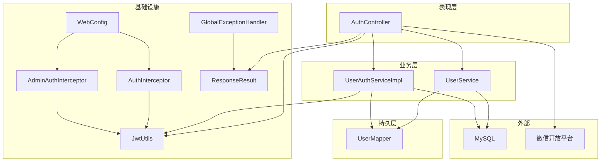
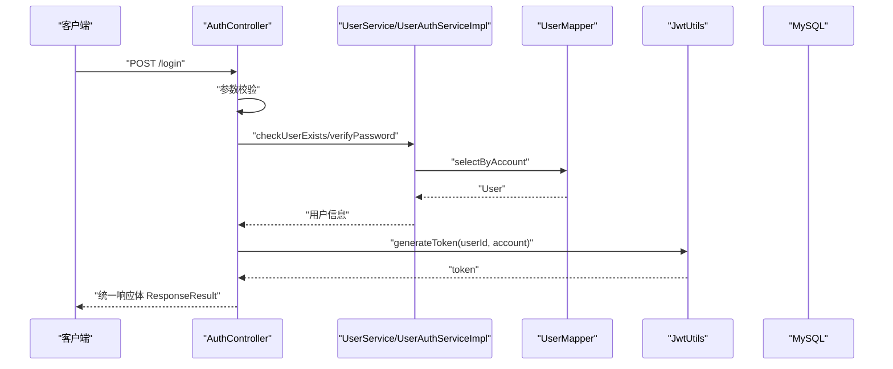
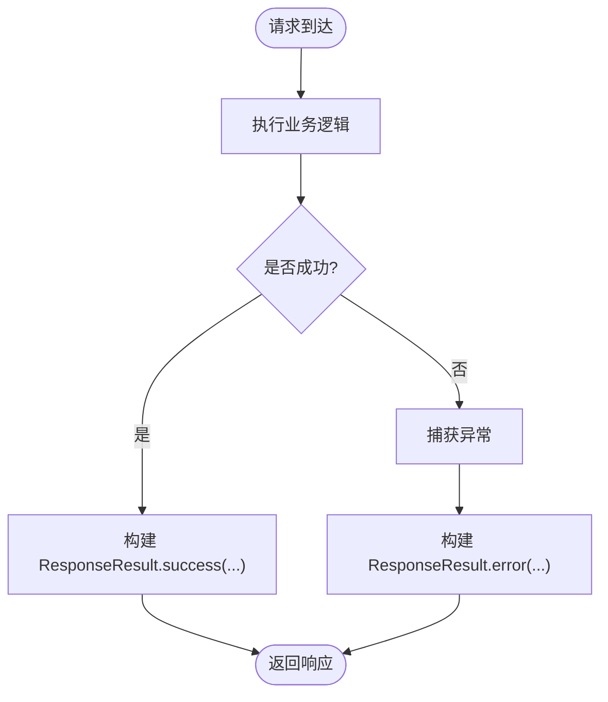
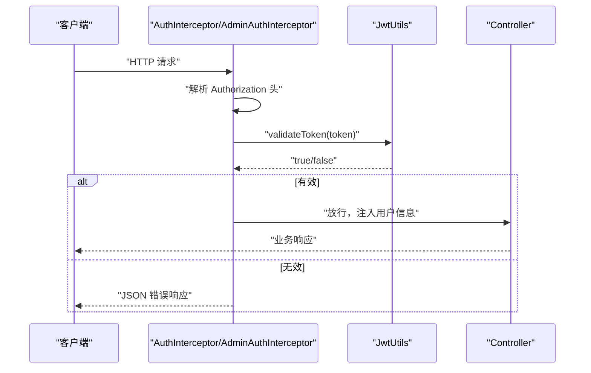
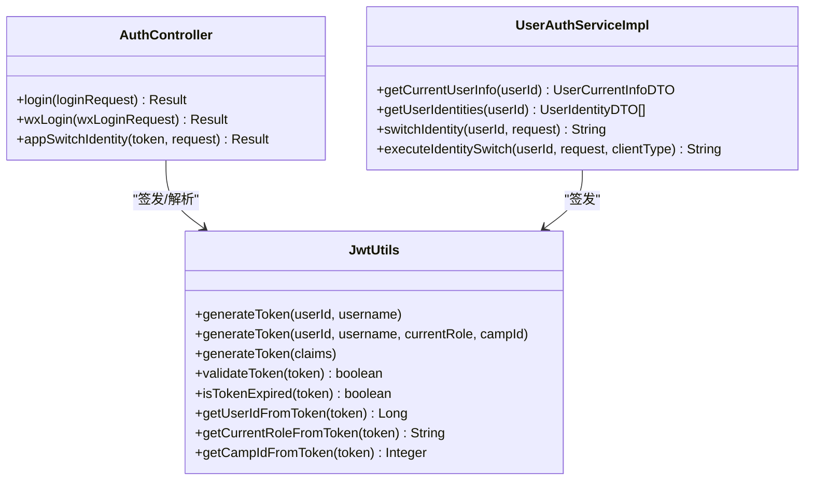
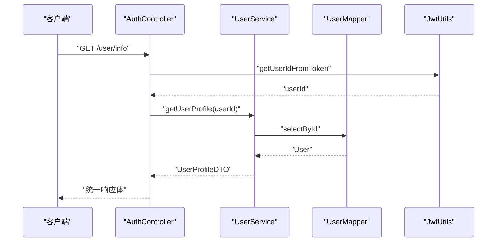
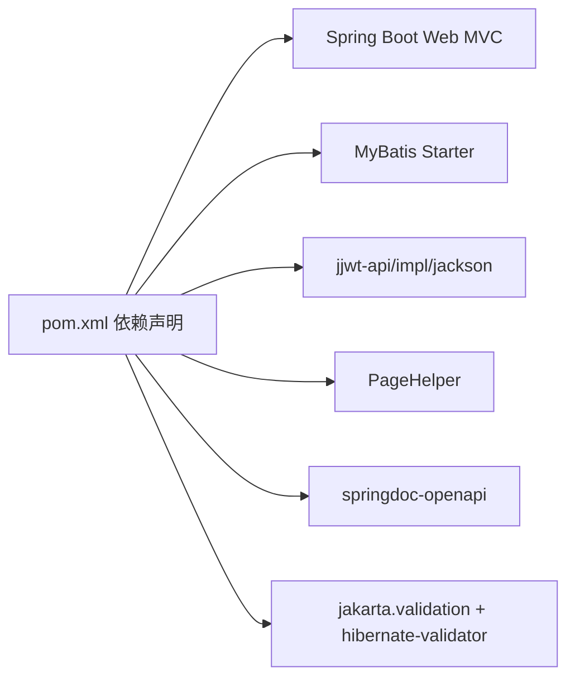
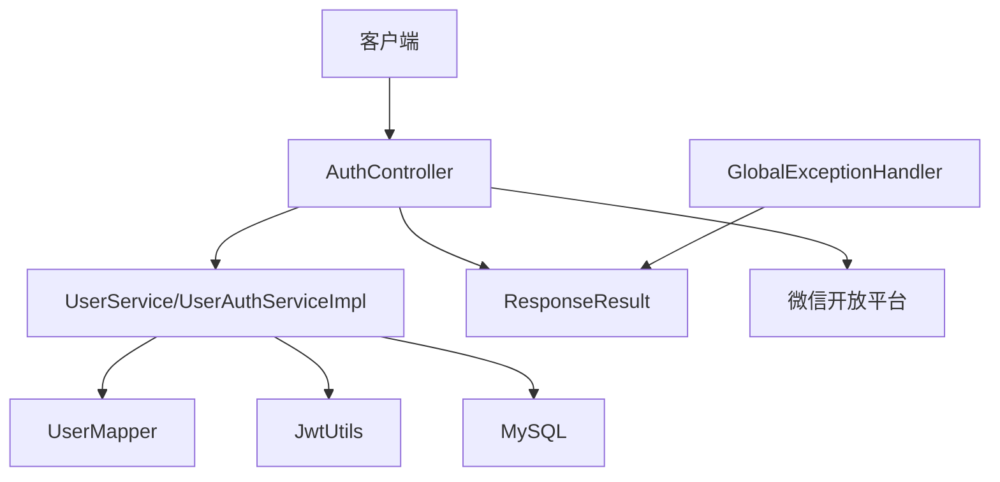

# 架构设计

<cite>
**本文引用的文件**
- [DailyChineseCultureApplication.java](file://src/main/java/com/daily/dailychineseculture/DailyChineseCultureApplication.java)
- [WebConfig.java](file://src/main/java/com/daily/dailychineseculture/config/WebConfig.java)
- [GlobalExceptionHandler.java](file://src/main/java/com/daily/dailychineseculture/common/GlobalExceptionHandler.java)
- [ResponseResult.java](file://src/main/java/com/daily/dailychineseculture/common/ResponseResult.java)
- [JwtUtils.java](file://src/main/java/com/daily/dailychineseculture/util/JwtUtils.java)
- [AuthInterceptor.java](file://src/main/java/com/daily/dailychineseculture/interceptor/AuthInterceptor.java)
- [AdminAuthInterceptor.java](file://src/main/java/com/daily/dailychineseculture/interceptor/AdminAuthInterceptor.java)
- [AuthController.java](file://src/main/java/com/daily/dailychineseculture/controller/AuthController.java)
- [UserAuthServiceImpl.java](file://src/main/java/com/daily/dailychineseculture/service/impl/UserAuthServiceImpl.java)
- [UserService.java](file://src/main/java/com/daily/dailychineseculture/service/UserService.java)
- [User.java](file://src/main/java/com/daily/dailychineseculture/entity/User.java)
- [LoginResult.java](file://src/main/java/com/daily/dailychineseculture/dto/LoginResult.java)
- [application.yml](file://src/main/resources/application.yml)
- [pom.xml](file://pom.xml)
</cite>

## 目录
1. [引言](#引言)
2. [项目结构](#项目结构)
3. [核心组件](#核心组件)
4. [架构总览](#架构总览)
5. [详细组件分析](#详细组件分析)
6. [依赖分析](#依赖分析)
7. [性能考虑](#性能考虑)
8. [故障排查指南](#故障排查指南)
9. [结论](#结论)
10. [附录](#附录)

## 引言
本项目采用基于 Spring Boot 的分层架构，围绕 MVC 模式组织代码，明确划分表现层（Controller）、业务层（Service）、持久层（Mapper/DAO）与基础设施层（配置、工具、拦截器）。系统通过统一响应格式、全局异常处理、拦截器体系实现一致的接口契约与安全控制；通过 JWT 实现无状态认证与多端身份切换；通过跨域过滤器与静态资源映射提升易用性与安全性。本文档将系统化阐述架构设计、组件交互、数据流与安全策略，并给出性能优化与可扩展性建议。

## 项目结构
项目采用按层次与功能域混合的组织方式：
- common：统一响应体与全局异常处理
- config：Web 配置（拦截器注册、静态资源映射）
- controller：REST 控制器，暴露业务接口
- service：业务服务与实现
- mapper：MyBatis 映射接口
- entity/dto：数据模型与传输对象
- util：工具类（JWT）
- interceptor：拦截器（认证与管理端鉴权）
- resources：配置文件与 Mapper XML

图表来源
- [AuthController.java:1-516](file://src/main/java/com/daily/dailychineseculture/controller/AuthController.java#L1-L516)
- [UserService.java:1-959](file://src/main/java/com/daily/dailychineseculture/service/UserService.java#L1-L959)
- [UserAuthServiceImpl.java:1-168](file://src/main/java/com/daily/dailychineseculture/service/impl/UserAuthServiceImpl.java#L1-L168)
- [WebConfig.java:1-105](file://src/main/java/com/daily/dailychineseculture/config/WebConfig.java#L1-L105)
- [AuthInterceptor.java:1-74](file://src/main/java/com/daily/dailychineseculture/interceptor/AuthInterceptor.java#L1-L74)
- [AdminAuthInterceptor.java:1-93](file://src/main/java/com/daily/dailychineseculture/interceptor/AdminAuthInterceptor.java#L1-L93)
- [JwtUtils.java:1-206](file://src/main/java/com/daily/dailychineseculture/util/JwtUtils.java#L1-L206)
- [GlobalExceptionHandler.java:1-29](file://src/main/java/com/daily/dailychineseculture/common/GlobalExceptionHandler.java#L1-L29)
- [ResponseResult.java:1-79](file://src/main/java/com/daily/dailychineseculture/common/ResponseResult.java#L1-L79)

章节来源
- [DailyChineseCultureApplication.java:1-40](file://src/main/java/com/daily/dailychineseculture/DailyChineseCultureApplication.java#L1-L40)
- [WebConfig.java:1-105](file://src/main/java/com/daily/dailychineseculture/config/WebConfig.java#L1-L105)
- [application.yml:1-33](file://src/main/resources/application.yml#L1-L33)

## 核心组件
- 统一响应体：ResponseResult 提供成功/失败两类响应模板，统一返回结构与时间戳。
- 全局异常处理：GlobalExceptionHandler 对通用异常与运行时异常进行兜底处理，返回统一错误响应。
- Web 配置：WebConfig 注册拦截器与静态资源映射，明确公开与受保护接口范围。
- JWT 工具：JwtUtils 提供签发、解析、校验与过期判断能力，支持多角色与多端身份切换。
- 拦截器：AuthInterceptor（C 端通用）与 AdminAuthInterceptor（PC 管理端）分别拦截并校验 Token。
- 控制器：AuthController 负责登录、微信登录、用户信息、身份切换、登出等接口。
- 服务层：UserService 与 UserAuthServiceImpl 负责用户信息、身份切换、志愿者统计等业务逻辑。
- 数据模型：User、LoginResult 等 DTO/Entity 明确数据结构。

章节来源
- [ResponseResult.java:1-79](file://src/main/java/com/daily/dailychineseculture/common/ResponseResult.java#L1-L79)
- [GlobalExceptionHandler.java:1-29](file://src/main/java/com/daily/dailychineseculture/common/GlobalExceptionHandler.java#L1-L29)
- [WebConfig.java:1-105](file://src/main/java/com/daily/dailychineseculture/config/WebConfig.java#L1-L105)
- [JwtUtils.java:1-206](file://src/main/java/com/daily/dailychineseculture/util/JwtUtils.java#L1-L206)
- [AuthInterceptor.java:1-74](file://src/main/java/com/daily/dailychineseculture/interceptor/AuthInterceptor.java#L1-L74)
- [AdminAuthInterceptor.java:1-93](file://src/main/java/com/daily/dailychineseculture/interceptor/AdminAuthInterceptor.java#L1-L93)
- [AuthController.java:1-516](file://src/main/java/com/daily/dailychineseculture/controller/AuthController.java#L1-L516)
- [UserService.java:1-959](file://src/main/java/com/daily/dailychineseculture/service/UserService.java#L1-L959)
- [UserAuthServiceImpl.java:1-168](file://src/main/java/com/daily/dailychineseculture/service/impl/UserAuthServiceImpl.java#L1-L168)
- [User.java:1-87](file://src/main/java/com/daily/dailychineseculture/entity/User.java#L1-L87)
- [LoginResult.java:1-27](file://src/main/java/com/daily/dailychineseculture/dto/LoginResult.java#L1-L27)

## 架构总览
系统采用经典的三层架构（表现层/业务层/持久层）与 MVC 模式：
- 表现层：Controller 作为入口，接收请求、组装参数、调用服务、返回统一响应。
- 业务层：Service 封装领域逻辑，协调 Mapper 与工具类，处理事务与幂等。
- 持久层：Mapper 通过 MyBatis 访问数据库，配合 application.yml 的驼峰映射与 XML 位置配置。
- 基础设施：拦截器在进入 Controller 前进行认证与权限校验；全局异常处理统一兜底；跨域过滤器与静态资源映射提升可用性。

图表来源
- [AuthController.java:63-112](file://src/main/java/com/daily/dailychineseculture/controller/AuthController.java#L63-L112)
- [UserService.java:83-106](file://src/main/java/com/daily/dailychineseculture/service/UserService.java#L83-L106)
- [JwtUtils.java:37-69](file://src/main/java/com/daily/dailychineseculture/util/JwtUtils.java#L37-L69)

## 详细组件分析

### 统一响应与全局异常
- 统一响应体 ResponseResult：提供 success/error 多种静态构造方法，统一 code/message/data/timestamp 结构，便于前端统一处理。
- 全局异常处理 GlobalExceptionHandler：对 Exception 与 RuntimeException 进行兜底，打印堆栈并返回统一错误响应，避免泄露内部细节。

图表来源
- [ResponseResult.java:48-79](file://src/main/java/com/daily/dailychineseculture/common/ResponseResult.java#L48-L79)
- [GlobalExceptionHandler.java:15-28](file://src/main/java/com/daily/dailychineseculture/common/GlobalExceptionHandler.java#L15-L28)

章节来源
- [ResponseResult.java:1-79](file://src/main/java/com/daily/dailychineseculture/common/ResponseResult.java#L1-L79)
- [GlobalExceptionHandler.java:1-29](file://src/main/java/com/daily/dailychineseculture/common/GlobalExceptionHandler.java#L1-L29)

### 拦截器与安全控制
- WebConfig：注册两个拦截器，配置静态资源映射与路径排除规则，明确公开接口与管理端接口范围。
- AuthInterceptor：拦截所有受保护路径，从 Authorization 头解析 Bearer Token，校验有效性并将用户信息注入 request。
- AdminAuthInterceptor：专门拦截 /api/admin/**，校验 Token 并将角色与营期信息注入 request，返回 JSON 错误而非 4xx 状态码以适配前端处理。

图表来源
- [WebConfig.java:48-103](file://src/main/java/com/daily/dailychineseculture/config/WebConfig.java#L48-L103)
- [AuthInterceptor.java:25-72](file://src/main/java/com/daily/dailychineseculture/interceptor/AuthInterceptor.java#L25-L72)
- [AdminAuthInterceptor.java:23-82](file://src/main/java/com/daily/dailychineseculture/interceptor/AdminAuthInterceptor.java#L23-L82)
- [JwtUtils.java:165-172](file://src/main/java/com/daily/dailychineseculture/util/JwtUtils.java#L165-L172)

章节来源
- [WebConfig.java:1-105](file://src/main/java/com/daily/dailychineseculture/config/WebConfig.java#L1-L105)
- [AuthInterceptor.java:1-74](file://src/main/java/com/daily/dailychineseculture/interceptor/AuthInterceptor.java#L1-L74)
- [AdminAuthInterceptor.java:1-93](file://src/main/java/com/daily/dailychineseculture/interceptor/AdminAuthInterceptor.java#L1-L93)
- [JwtUtils.java:1-206](file://src/main/java/com/daily/dailychineseculture/util/JwtUtils.java#L1-L206)

### JWT 认证架构与多端身份切换
- JwtUtils：生成与解析 JWT，支持自定义 Claims（userId、username、currentRole、campId 等），设置 7 天过期时间，提供 validateToken/isTokenExpired。
- AuthController：登录接口根据用户名密码或微信授权码签发 token；身份切换接口通过 UserAuthServiceImpl 生成新 token 并注入 clientType 与权限标记。
- UserAuthServiceImpl：根据任命记录与客户端类型构建 Claims，生成新 token，支持 ADMIN/APP 两种客户端类型。

图表来源
- [JwtUtils.java:37-95](file://src/main/java/com/daily/dailychineseculture/util/JwtUtils.java#L37-L95)
- [UserAuthServiceImpl.java:74-117](file://src/main/java/com/daily/dailychineseculture/service/impl/UserAuthServiceImpl.java#L74-L117)
- [AuthController.java:63-136](file://src/main/java/com/daily/dailychineseculture/controller/AuthController.java#L63-L136)

章节来源
- [JwtUtils.java:1-206](file://src/main/java/com/daily/dailychineseculture/util/JwtUtils.java#L1-L206)
- [UserAuthServiceImpl.java:1-168](file://src/main/java/com/daily/dailychineseculture/service/impl/UserAuthServiceImpl.java#L1-L168)
- [AuthController.java:1-516](file://src/main/java/com/daily/dailychineseculture/controller/AuthController.java#L1-L516)

### 控制器与业务流程
- AuthController：集中处理登录、微信登录、用户信息、身份切换、登出等接口，统一使用 Result/ResponseResult 返回。
- UserService：用户查询、密码校验、信息完善度判断、微信用户创建与更新、志愿者统计与分班算法等。
- UserAuthServiceImpl：身份切换、当前用户信息、身份列表转换等。

图表来源
- [AuthController.java:215-239](file://src/main/java/com/daily/dailychineseculture/controller/AuthController.java#L215-L239)
- [UserService.java:730-794](file://src/main/java/com/daily/dailychineseculture/service/UserService.java#L730-L794)
- [JwtUtils.java:104-111](file://src/main/java/com/daily/dailychineseculture/util/JwtUtils.java#L104-L111)

章节来源
- [AuthController.java:1-516](file://src/main/java/com/daily/dailychineseculture/controller/AuthController.java#L1-L516)
- [UserService.java:1-959](file://src/main/java/com/daily/dailychineseculture/service/UserService.java#L1-L959)

### 数据模型与 DTO
- User：用户实体，包含账户、密码、头像、手机、地区、生日、职业、性别、注册时间、状态、openid、昵称与班级等字段。
- LoginResult：登录结果 DTO，包含 token、信息完整性标志与用户基本信息。
- 其他 DTO：UserProfileDTO、UserDetailDTO、VolunteerHistoryDTO 等用于接口数据传输。

章节来源
- [User.java:1-87](file://src/main/java/com/daily/dailychineseculture/entity/User.java#L1-L87)
- [LoginResult.java:1-27](file://src/main/java/com/daily/dailychineseculture/dto/LoginResult.java#L1-L27)

## 依赖分析
- Spring Boot：启动器与 Web MVC、MyBatis Starter、测试依赖。
- JWT：jjwt-api/impl/jackson。
- 分页：PageHelper。
- 文档：springdoc-openapi。
- 校验：jakarta.validation-api 与 hibernate-validator。

图表来源
- [pom.xml:32-117](file://pom.xml#L32-L117)

章节来源
- [pom.xml:1-149](file://pom.xml#L1-L149)

## 性能考虑
- 跨域与静态资源：通过 CorsFilter 与 ResourceHandlerRegistry 提升跨域访问与静态资源加载效率，减少不必要的网络往返。
- 拦截器前置校验：在进入 Controller 前完成 Token 校验与用户信息注入，降低控制器复杂度与分支判断成本。
- MyBatis 配置：开启驼峰映射与 XML 位置配置，减少 ORM 映射开销与配置成本。
- 文件上传：application.yml 中限制单文件与请求大小，避免内存溢出风险。
- 事务与幂等：关键业务（如分班、更新用户信息）使用 @Transactional 保证一致性，结合幂等设计避免重复提交造成副作用。
- 缓存与异步：项目启用 @EnableAsync，可在后续引入 Redis 缓存与异步任务优化热点数据与耗时操作。

章节来源
- [DailyChineseCultureApplication.java:26-39](file://src/main/java/com/daily/dailychineseculture/DailyChineseCultureApplication.java#L26-L39)
- [WebConfig.java:34-42](file://src/main/java/com/daily/dailychineseculture/config/WebConfig.java#L34-L42)
- [application.yml:12-16](file://src/main/resources/application.yml#L12-L16)
- [UserService.java:523-598](file://src/main/java/com/daily/dailychineseculture/service/UserService.java#L523-L598)

## 故障排查指南
- 统一错误响应：全局异常处理器返回统一错误体，便于前端识别与提示。
- 拦截器返回策略：管理端拦截器在 Token 失效时返回 200 + JSON 错误，避免浏览器 401 导致的跨域错误弹窗。
- 日志与调试：控制器与服务层广泛输出日志，定位参数缺失、微信授权失败、数据库异常等问题。
- 建议：增加统一日志追踪 ID（TraceId），在拦截器与控制器中记录请求与响应摘要，便于问题回溯。

章节来源
- [GlobalExceptionHandler.java:1-29](file://src/main/java/com/daily/dailychineseculture/common/GlobalExceptionHandler.java#L1-L29)
- [AdminAuthInterceptor.java:39-60](file://src/main/java/com/daily/dailychineseculture/interceptor/AdminAuthInterceptor.java#L39-L60)
- [AuthController.java:465-496](file://src/main/java/com/daily/dailychineseculture/controller/AuthController.java#L465-L496)

## 结论
本项目以 Spring Boot 为基础，采用清晰的分层与 MVC 设计，通过统一响应体、全局异常处理、拦截器与 JWT 实现了高内聚低耦合的架构。公开接口与管理端接口分离、静态资源与跨域策略明确，具备良好的可维护性与扩展性。建议后续引入缓存、异步任务与统一日志追踪，进一步提升性能与可观测性。

## 附录
- 系统边界图：表现层（Controller）与业务层（Service）之间通过 DTO/Entity 交互，持久层通过 Mapper 访问数据库；外部依赖包括 MySQL 与微信开放平台。
- 数据流向图：请求经拦截器校验后进入控制器，控制器调用服务层，服务层访问持久层，最终返回统一响应体。

图表来源
- [AuthController.java:1-516](file://src/main/java/com/daily/dailychineseculture/controller/AuthController.java#L1-L516)
- [UserService.java:1-959](file://src/main/java/com/daily/dailychineseculture/service/UserService.java#L1-L959)
- [UserAuthServiceImpl.java:1-168](file://src/main/java/com/daily/dailychineseculture/service/impl/UserAuthServiceImpl.java#L1-L168)
- [JwtUtils.java:1-206](file://src/main/java/com/daily/dailychineseculture/util/JwtUtils.java#L1-L206)
- [ResponseResult.java:1-79](file://src/main/java/com/daily/dailychineseculture/common/ResponseResult.java#L1-L79)
- [GlobalExceptionHandler.java:1-29](file://src/main/java/com/daily/dailychineseculture/common/GlobalExceptionHandler.java#L1-L29)