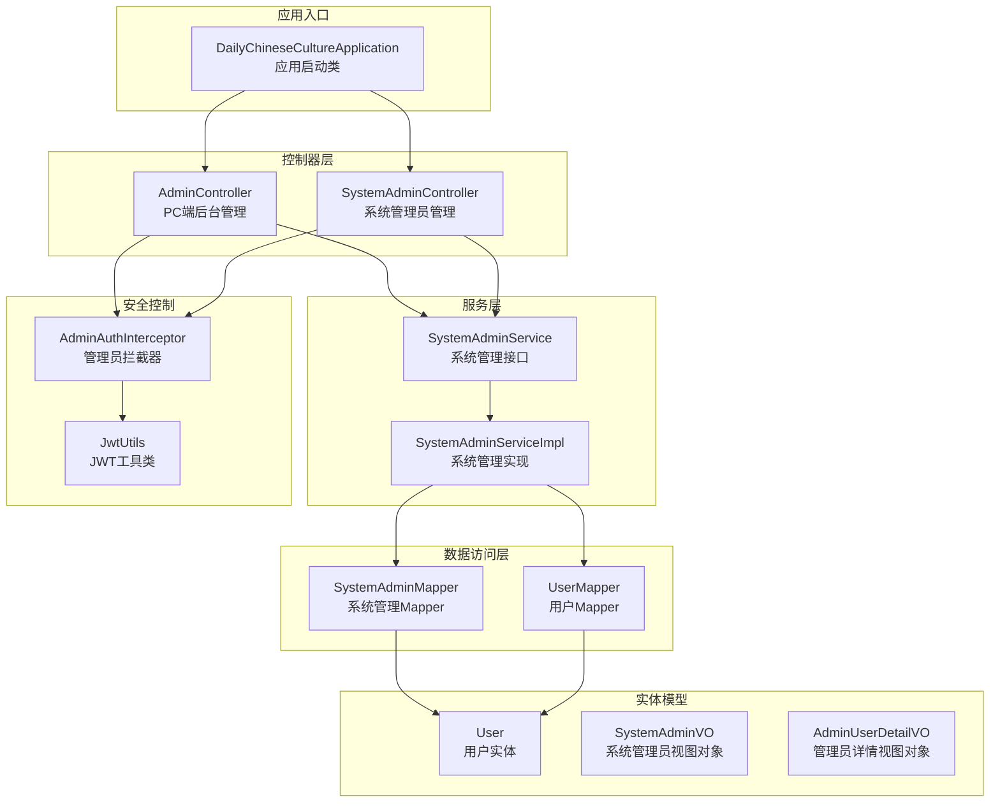
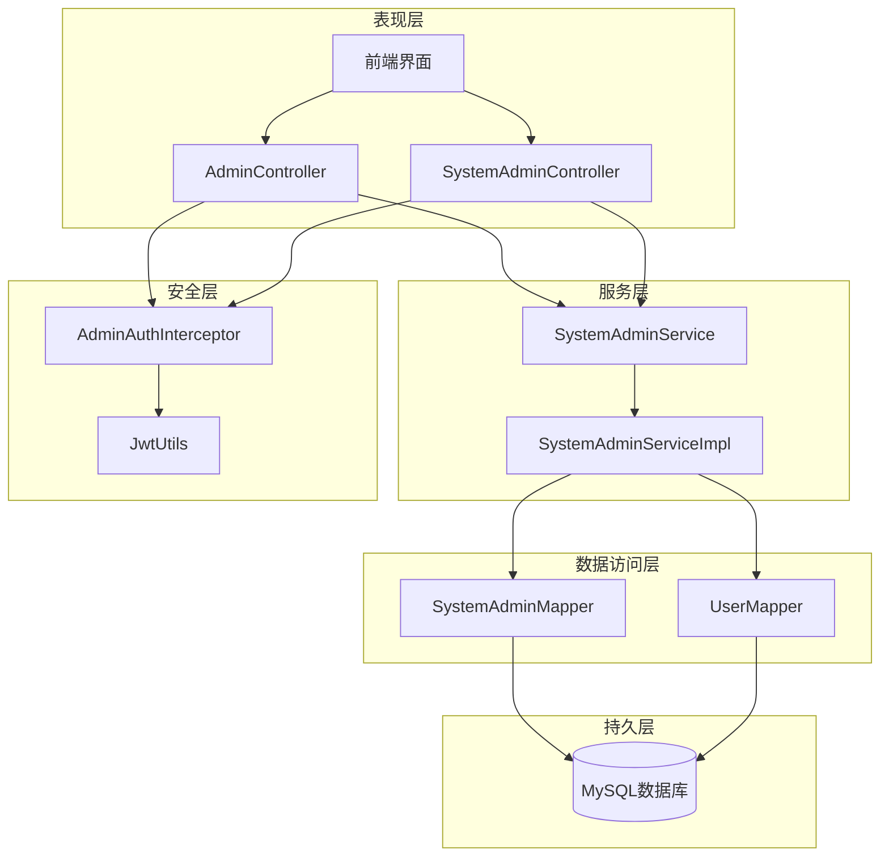
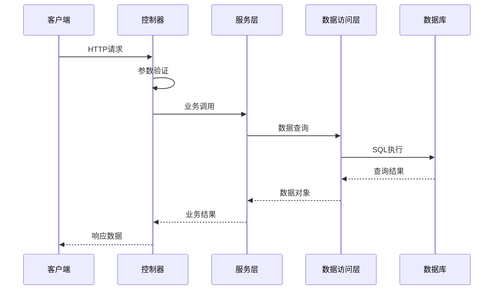
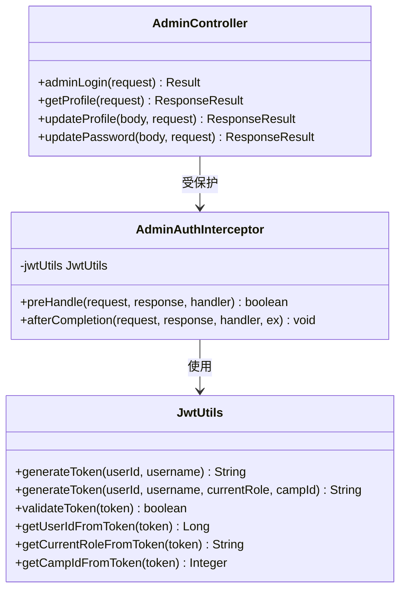
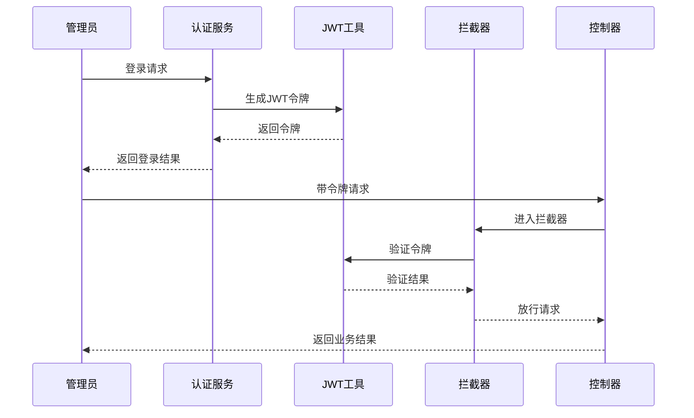
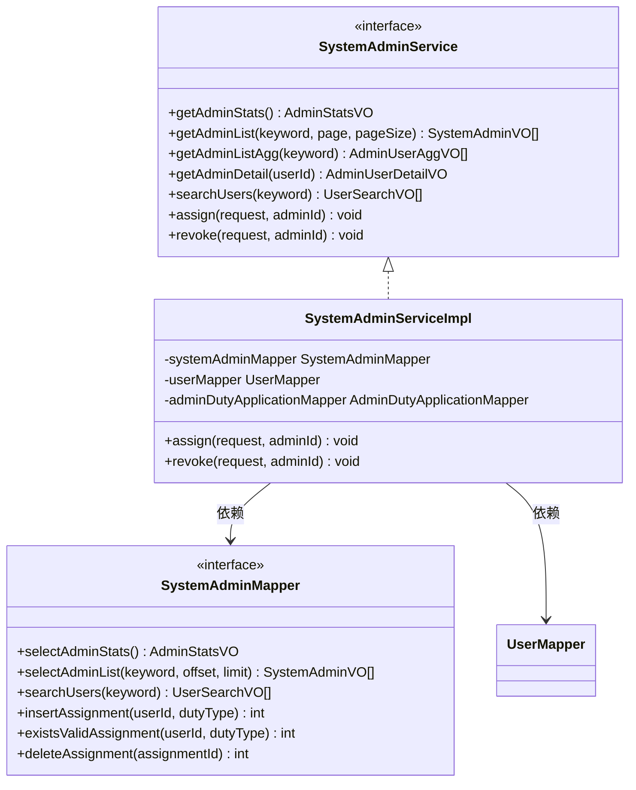
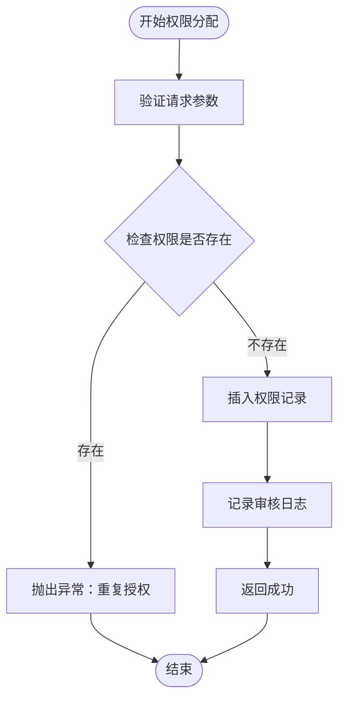
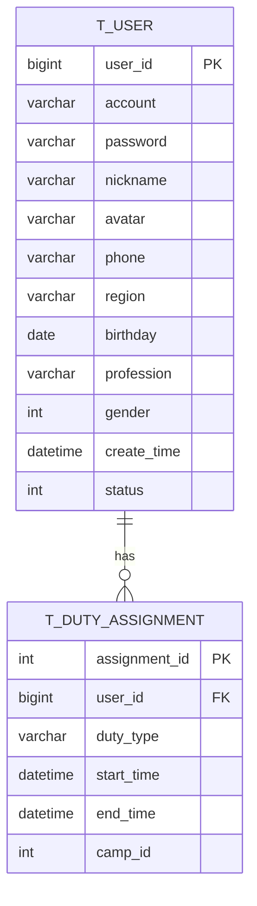
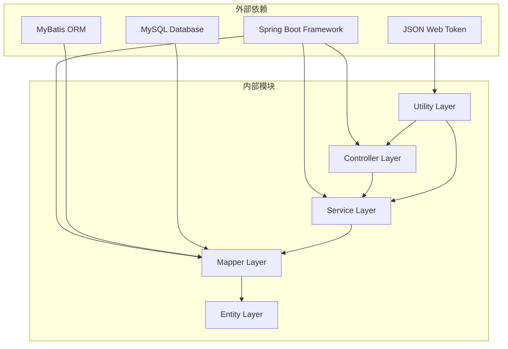
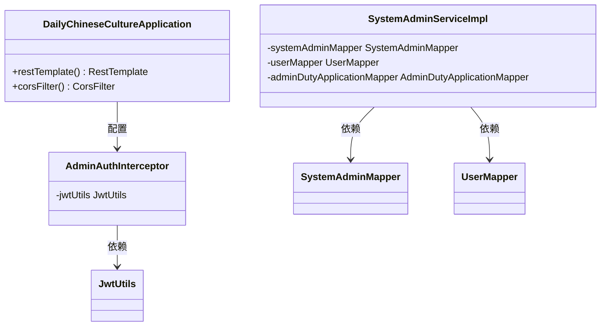

# 系统管理模块

<cite>
**本文档引用的文件**
- [DailyChineseCultureApplication.java](file://src/main/java/com/daily/dailychineseculture/DailyChineseCultureApplication.java)
- [AdminController.java](file://src/main/java/com/daily/dailychineseculture/controller/AdminController.java)
- [SystemAdminController.java](file://src/main/java/com/daily/dailychineseculture/controller/SystemAdminController.java)
- [SystemAdminServiceImpl.java](file://src/main/java/com/daily/dailychineseculture/service/impl/SystemAdminServiceImpl.java)
- [SystemAdminService.java](file://src/main/java/com/daily/dailychineseculture/service/SystemAdminService.java)
- [SystemAdminMapper.java](file://src/main/java/com/daily/dailychineseculture/mapper/SystemAdminMapper.java)
- [SystemAdminMapper.xml](file://src/main/resources/mapper/SystemAdminMapper.xml)
- [UserMapper.xml](file://src/main/resources/mapper/UserMapper.xml)
- [AdminAuthInterceptor.java](file://src/main/java/com/daily/dailychineseculture/interceptor/AdminAuthInterceptor.java)
- [JwtUtils.java](file://src/main/java/com/daily/dailychineseculture/util/JwtUtils.java)
- [ResponseResult.java](file://src/main/java/com/daily/dailychineseculture/common/ResponseResult.java)
- [application.yml](file://src/main/resources/application.yml)
- [User.java](file://src/main/java/com/daily/dailychineseculture/entity/User.java)
- [SystemAdminVO.java](file://src/main/java/com/daily/dailychineseculture/vo/SystemAdminVO.java)
- [AdminUserDetailVO.java](file://src/main/java/com/daily/dailychineseculture/vo/AdminUserDetailVO.java)
- [AssignRequest.java](file://src/main/java/com/daily/dailychineseculture/dto/AssignRequest.java)
</cite>

## 目录
1. [简介](#简介)
2. [项目结构](#项目结构)
3. [核心组件](#核心组件)
4. [架构概览](#架构概览)
5. [详细组件分析](#详细组件分析)
6. [依赖关系分析](#依赖关系分析)
7. [性能考虑](#性能考虑)
8. [故障排除指南](#故障排除指南)
9. [结论](#结论)

## 简介

系统管理模块是每日中文文化项目中的核心管理功能模块，主要负责后台管理系统的核心功能。该模块基于Spring Boot框架构建，采用前后端分离架构，提供完整的管理员身份认证、权限管理和系统监控功能。

本模块的主要特点包括：
- 多角色权限管理体系（超级管理员、课程管理员、档案管理员）
- 完整的JWT令牌认证机制
- 基于MyBatis的数据访问层
- 统一的响应结果封装
- 完善的拦截器安全控制

## 项目结构

系统管理模块采用标准的MVC架构模式，按照功能层次进行组织：

**图表来源**
- [DailyChineseCultureApplication.java:12-40](file://src/main/java/com/daily/dailychineseculture/DailyChineseCultureApplication.java#L12-L40)
- [AdminController.java:26-28](file://src/main/java/com/daily/dailychineseculture/controller/AdminController.java#L26-L28)
- [SystemAdminController.java:18-21](file://src/main/java/com/daily/dailychineseculture/controller/SystemAdminController.java#L18-L21)

**章节来源**
- [DailyChineseCultureApplication.java:1-40](file://src/main/java/com/daily/dailychineseculture/DailyChineseCultureApplication.java#L1-L40)
- [application.yml:1-33](file://src/main/resources/application.yml#L1-L33)

## 核心组件

系统管理模块包含以下核心组件：

### 控制器层
- **AdminController**: PC端后台管理控制器，处理管理员登录、仪表盘数据、营期管理等功能
- **SystemAdminController**: 系统管理员管理控制器，处理权限分配、撤销等高级管理功能

### 服务层
- **SystemAdminService**: 系统管理服务接口，定义权限管理的核心业务方法
- **SystemAdminServiceImpl**: 系统管理服务实现，提供具体的权限管理业务逻辑

### 数据访问层
- **SystemAdminMapper**: 系统管理数据访问接口，定义权限管理相关的数据库操作
- **UserMapper**: 用户数据访问接口，提供用户信息查询功能

### 安全组件
- **AdminAuthInterceptor**: 管理员身份认证拦截器，统一处理管理员请求的安全验证
- **JwtUtils**: JWT工具类，提供令牌生成、验证和解析功能

**章节来源**
- [AdminController.java:1-211](file://src/main/java/com/daily/dailychineseculture/controller/AdminController.java#L1-L211)
- [SystemAdminController.java:1-72](file://src/main/java/com/daily/dailychineseculture/controller/SystemAdminController.java#L1-L72)
- [SystemAdminServiceImpl.java:1-99](file://src/main/java/com/daily/dailychineseculture/service/impl/SystemAdminServiceImpl.java#L1-L99)

## 架构概览

系统管理模块采用分层架构设计，确保各层职责清晰、耦合度低：

**图表来源**
- [AdminAuthInterceptor.java:14-82](file://src/main/java/com/daily/dailychineseculture/interceptor/AdminAuthInterceptor.java#L14-L82)
- [JwtUtils.java:25-79](file://src/main/java/com/daily/dailychineseculture/util/JwtUtils.java#L25-L79)
- [SystemAdminServiceImpl.java:18-99](file://src/main/java/com/daily/dailychineseculture/service/impl/SystemAdminServiceImpl.java#L18-L99)

### 数据流分析

系统管理模块的数据流遵循标准的MVC模式：

**图表来源**
- [AdminController.java:46-69](file://src/main/java/com/daily/dailychineseculture/controller/AdminController.java#L46-L69)
- [SystemAdminServiceImpl.java:26-55](file://src/main/java/com/daily/dailychineseculture/service/impl/SystemAdminServiceImpl.java#L26-L55)

## 详细组件分析

### 管理员身份认证系统

管理员身份认证系统是整个系统管理模块的核心安全机制：

**图表来源**
- [AdminAuthInterceptor.java:14-93](file://src/main/java/com/daily/dailychineseculture/interceptor/AdminAuthInterceptor.java#L14-L93)
- [JwtUtils.java:25-243](file://src/main/java/com/daily/dailychineseculture/util/JwtUtils.java#L25-L243)
- [AdminController.java:26-211](file://src/main/java/com/daily/dailychineseculture/controller/AdminController.java#L26-L211)

#### JWT令牌流程

**图表来源**
- [AdminController.java:46-69](file://src/main/java/com/daily/dailychineseculture/controller/AdminController.java#L46-L69)
- [AdminAuthInterceptor.java:24-82](file://src/main/java/com/daily/dailychineseculture/interceptor/AdminAuthInterceptor.java#L24-L82)
- [JwtUtils.java:47-79](file://src/main/java/com/daily/dailychineseculture/util/JwtUtils.java#L47-L79)

### 权限管理系统

权限管理系统提供完整的管理员权限控制功能：

**图表来源**
- [SystemAdminService.java:12-28](file://src/main/java/com/daily/dailychineseculture/service/SystemAdminService.java#L12-L28)
- [SystemAdminServiceImpl.java:18-99](file://src/main/java/com/daily/dailychineseculture/service/impl/SystemAdminServiceImpl.java#L18-L99)
- [SystemAdminMapper.java:14-40](file://src/main/java/com/daily/dailychineseculture/mapper/SystemAdminMapper.java#L14-L40)

#### 权限分配流程

**图表来源**
- [SystemAdminServiceImpl.java:57-76](file://src/main/java/com/daily/dailychineseculture/service/impl/SystemAdminServiceImpl.java#L57-L76)
- [SystemAdminMapper.xml:65-78](file://src/main/resources/mapper/SystemAdminMapper.xml#L65-L78)

### 数据模型设计

系统管理模块采用简洁高效的数据模型设计：

**图表来源**
- [SystemAdminMapper.xml:139-149](file://src/main/resources/mapper/SystemAdminMapper.xml#L139-L149)
- [User.java:10-87](file://src/main/java/com/daily/dailychineseculture/entity/User.java#L10-L87)

**章节来源**
- [SystemAdminMapper.xml:1-152](file://src/main/resources/mapper/SystemAdminMapper.xml#L1-L152)
- [User.java:1-87](file://src/main/java/com/daily/dailychineseculture/entity/User.java#L1-L87)

## 依赖关系分析

系统管理模块的依赖关系清晰明确，遵循依赖倒置原则：

**图表来源**
- [DailyChineseCultureApplication.java:12-40](file://src/main/java/com/daily/dailychineseculture/DailyChineseCultureApplication.java#L12-L40)
- [SystemAdminServiceImpl.java:18-25](file://src/main/java/com/daily/dailychineseculture/service/impl/SystemAdminServiceImpl.java#L18-L25)

### 核心依赖注入关系

**图表来源**
- [DailyChineseCultureApplication.java:20-39](file://src/main/java/com/daily/dailychineseculture/DailyChineseCultureApplication.java#L20-L39)
- [AdminAuthInterceptor.java:17-18](file://src/main/java/com/daily/dailychineseculture/interceptor/AdminAuthInterceptor.java#L17-L18)
- [SystemAdminServiceImpl.java:22-24](file://src/main/java/com/daily/dailychineseculture/service/impl/SystemAdminServiceImpl.java#L22-L24)

**章节来源**
- [DailyChineseCultureApplication.java:1-40](file://src/main/java/com/daily/dailychineseculture/DailyChineseCultureApplication.java#L1-L40)
- [AdminAuthInterceptor.java:1-93](file://src/main/java/com/daily/dailychineseculture/interceptor/AdminAuthInterceptor.java#L1-L93)

## 性能考虑

系统管理模块在设计时充分考虑了性能优化：

### 缓存策略
- 使用JWT令牌减少数据库查询次数
- 合理的SQL查询优化，避免N+1查询问题
- 适当的索引设计提升查询性能

### 异步处理
- 启用异步支持处理耗时操作
- 事务管理确保数据一致性

### 连接池配置
- 数据库连接池配置优化
- 文件上传大小限制防止内存溢出

## 故障排除指南

### 常见问题及解决方案

#### JWT令牌相关问题
- **问题**: Token过期或无效
- **解决方案**: 检查令牌生成时间，重新登录获取新令牌

#### 权限验证失败
- **问题**: 403权限不足
- **解决方案**: 检查用户角色权限，确认具有相应管理权限

#### 数据库连接问题
- **问题**: 数据库连接超时
- **解决方案**: 检查数据库配置，确认网络连通性

**章节来源**
- [AdminAuthInterceptor.java:35-82](file://src/main/java/com/daily/dailychineseculture/interceptor/AdminAuthInterceptor.java#L35-L82)
- [JwtUtils.java:176-242](file://src/main/java/com/daily/dailychineseculture/util/JwtUtils.java#L176-L242)

## 结论

系统管理模块是一个设计合理、架构清晰的后台管理系统。通过采用分层架构、依赖注入和统一的响应封装，实现了高内聚、低耦合的系统设计。

### 主要优势
1. **安全性**: 完善的JWT认证机制和权限控制
2. **可扩展性**: 清晰的分层架构便于功能扩展
3. **可维护性**: 统一的编码规范和错误处理机制
4. **性能**: 合理的数据库设计和查询优化

### 改进建议
1. **配置管理**: 将敏感配置移至环境变量
2. **监控告警**: 添加系统性能监控和异常告警
3. **文档完善**: 补充API接口文档和开发指南