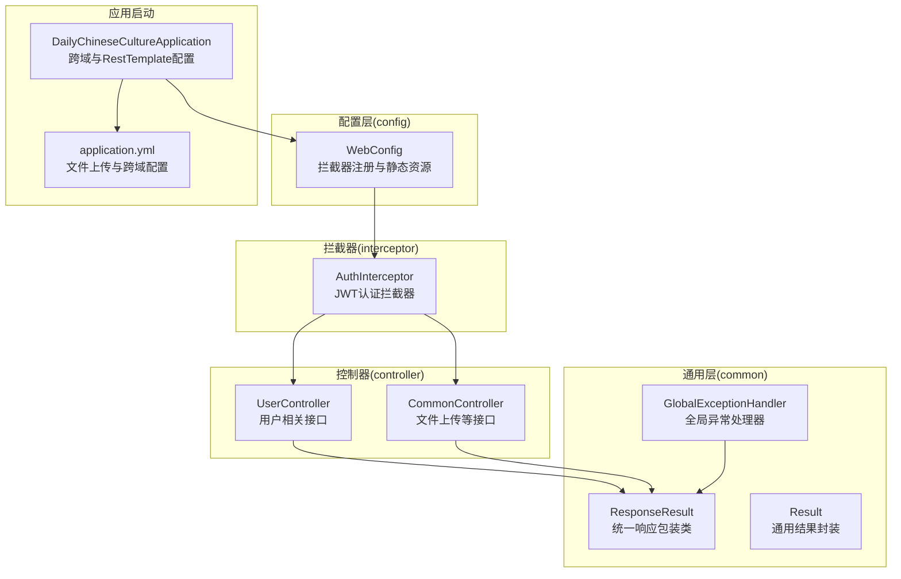
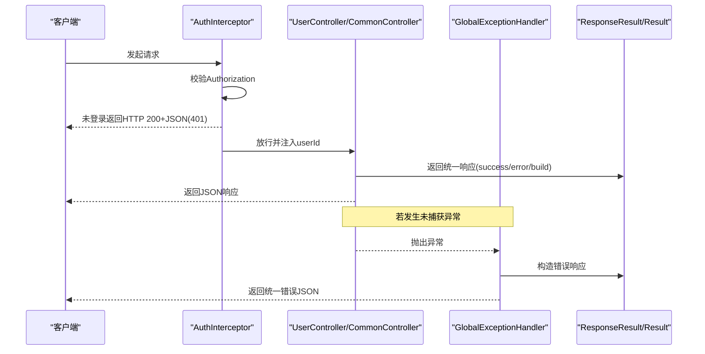
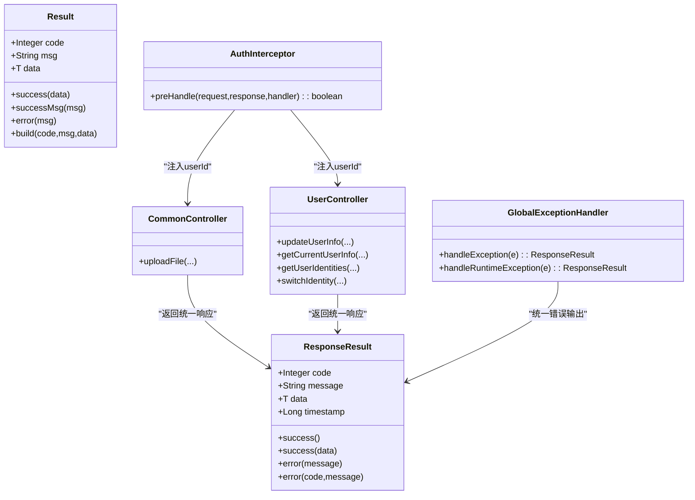
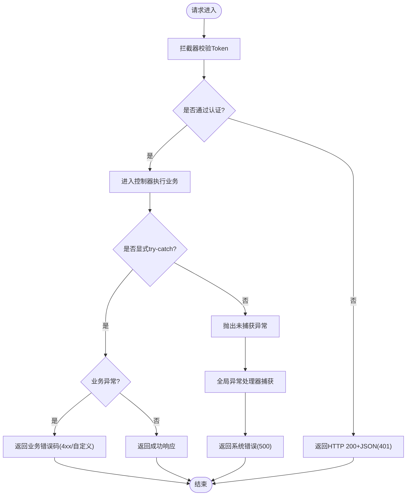

# 统一响应与异常处理

<cite>
**本文引用的文件**
- [ResponseResult.java](file://src/main/java/com/daily/dailychineseculture/common/ResponseResult.java)
- [Result.java](file://src/main/java/com/daily/dailychineseculture/common/Result.java)
- [GlobalExceptionHandler.java](file://src/main/java/com/daily/dailychineseculture/common/GlobalExceptionHandler.java)
- [CommonController.java](file://src/main/java/com/daily/dailychineseculture/controller/CommonController.java)
- [UserController.java](file://src/main/java/com/daily/dailychineseculture/controller/UserController.java)
- [WebConfig.java](file://src/main/java/com/daily/dailychineseculture/config/WebConfig.java)
- [AuthInterceptor.java](file://src/main/java/com/daily/dailychineseculture/interceptor/AuthInterceptor.java)
- [application.yml](file://src/main/resources/application.yml)
- [DailyChineseCultureApplication.java](file://src/main/java/com/daily/dailychineseculture/DailyChineseCultureApplication.java)
</cite>

## 目录
1. [简介](#简介)
2. [项目结构](#项目结构)
3. [核心组件](#核心组件)
4. [架构总览](#架构总览)
5. [详细组件分析](#详细组件分析)
6. [依赖关系分析](#依赖关系分析)
7. [性能考量](#性能考量)
8. [故障排查指南](#故障排查指南)
9. [结论](#结论)
10. [附录](#附录)

## 简介
本文件聚焦于系统的统一响应格式与全局异常处理机制，系统采用两套统一响应模型：
- ResponseResult：面向Web层的统一响应包装类，广泛用于控制器返回值。
- Result：面向业务层的通用结果封装，常见于后台管理接口。

同时，系统通过@RestControllerAdvice定义全局异常处理器，对未捕获的异常进行统一兜底，并结合拦截器在进入控制器前完成认证校验，确保前后端交互的一致性与可预测性。

## 项目结构
围绕统一响应与异常处理的关键目录与文件如下：
- common：统一响应与异常处理的核心类
- controller：控制器层，广泛使用统一响应返回
- config：Web配置与拦截器注册
- interceptor：认证拦截器，负责在进入控制器前注入用户信息并处理未登录场景
- resources：应用配置，含文件上传与跨域配置

图表来源
- [ResponseResult.java:1-79](file://src/main/java/com/daily/dailychineseculture/common/ResponseResult.java#L1-L79)
- [Result.java:1-81](file://src/main/java/com/daily/dailychineseculture/common/Result.java#L1-L81)
- [GlobalExceptionHandler.java:1-29](file://src/main/java/com/daily/dailychineseculture/common/GlobalExceptionHandler.java#L1-L29)
- [WebConfig.java:1-105](file://src/main/java/com/daily/dailychineseculture/config/WebConfig.java#L1-L105)
- [AuthInterceptor.java:1-74](file://src/main/java/com/daily/dailychineseculture/interceptor/AuthInterceptor.java#L1-L74)
- [CommonController.java:1-100](file://src/main/java/com/daily/dailychineseculture/controller/CommonController.java#L1-L100)
- [UserController.java:1-223](file://src/main/java/com/daily/dailychineseculture/controller/UserController.java#L1-L223)
- [DailyChineseCultureApplication.java:1-40](file://src/main/java/com/daily/dailychineseculture/DailyChineseCultureApplication.java#L1-L40)
- [application.yml:1-33](file://src/main/resources/application.yml#L1-L33)

章节来源
- [WebConfig.java:1-105](file://src/main/java/com/daily/dailychineseculture/config/WebConfig.java#L1-L105)
- [AuthInterceptor.java:1-74](file://src/main/java/com/daily/dailychineseculture/interceptor/AuthInterceptor.java#L1-L74)
- [application.yml:1-33](file://src/main/resources/application.yml#L1-L33)

## 核心组件
- ResponseResult<T>：提供成功/失败两类静态工厂方法，支持带消息与数据的组合；默认时间戳由构造函数注入。
- Result<T>：提供成功、成功带消息、错误、自定义状态码构建方法，适用于业务层返回。
- GlobalExceptionHandler：基于@RestControllerAdvice，对Exception与RuntimeException进行统一处理，返回ResponseResult格式。

章节来源
- [ResponseResult.java:1-79](file://src/main/java/com/daily/dailychineseculture/common/ResponseResult.java#L1-L79)
- [Result.java:1-81](file://src/main/java/com/daily/dailychineseculture/common/Result.java#L1-L81)
- [GlobalExceptionHandler.java:1-29](file://src/main/java/com/daily/dailychineseculture/common/GlobalExceptionHandler.java#L1-L29)

## 架构总览
统一响应与异常处理的整体流程如下：
- 控制器接收请求，执行业务逻辑，返回统一响应对象。
- 若发生未捕获异常，全局异常处理器统一拦截并返回标准错误响应。
- 认证拦截器在进入控制器前校验Token，未登录时直接返回HTTP 200+JSON错误码，避免浏览器误判为网络错误。

图表来源
- [AuthInterceptor.java:1-74](file://src/main/java/com/daily/dailychineseculture/interceptor/AuthInterceptor.java#L1-L74)
- [UserController.java:1-223](file://src/main/java/com/daily/dailychineseculture/controller/UserController.java#L1-L223)
- [CommonController.java:1-100](file://src/main/java/com/daily/dailychineseculture/controller/CommonController.java#L1-L100)
- [GlobalExceptionHandler.java:1-29](file://src/main/java/com/daily/dailychineseculture/common/GlobalExceptionHandler.java#L1-L29)
- [ResponseResult.java:1-79](file://src/main/java/com/daily/dailychineseculture/common/ResponseResult.java#L1-L79)
- [Result.java:1-81](file://src/main/java/com/daily/dailychineseculture/common/Result.java#L1-L81)

## 详细组件分析

### ResponseResult统一响应包装类
- 设计要点
  - 泛型承载任意数据类型，便于前后端契约一致。
  - 提供多种success与error静态工厂方法，覆盖“仅消息”、“消息+数据”、“自定义状态码+消息”的场景。
  - 默认时间戳便于日志与监控追踪。
- 使用场景
  - 控制器层广泛使用，如文件上传、用户信息更新、身份切换等接口均返回ResponseResult。
- 与Result的关系
  - ResponseResult用于Web层对外统一输出；Result用于业务层内部或后台管理接口的统一返回。

章节来源
- [ResponseResult.java:1-79](file://src/main/java/com/daily/dailychineseculture/common/ResponseResult.java#L1-L79)
- [CommonController.java:1-100](file://src/main/java/com/daily/dailychineseculture/controller/CommonController.java#L1-L100)
- [UserController.java:1-223](file://src/main/java/com/daily/dailychineseculture/controller/UserController.java#L1-L223)

### Result通用结果封装
- 设计要点
  - 成功、错误、自定义状态码三类工厂方法，满足不同业务场景。
  - 与ResponseResult相比，字段命名略有差异（code/msg/data vs code/message/data），但语义一致。
- 使用场景
  - 后台管理接口（例如登录、权限控制）使用Result作为统一返回。

章节来源
- [Result.java:1-81](file://src/main/java/com/daily/dailychineseculture/common/Result.java#L1-L81)

### 全局异常处理器GlobalExceptionHandler
- 捕获策略
  - 捕获Exception与RuntimeException两类异常，分别返回不同的错误前缀，便于前端区分“系统内部错误”与“运行时错误”。
  - 对未捕获异常统一返回ResponseResult.error(...)，保证前后端响应格式一致。
- 优先级机制
  - 控制器内已显式try-catch的业务异常（如手机号重复、参数非法、报名失败等）优先处理并返回相应状态码。
  - 未被捕获的异常交由全局异常处理器兜底。
- 与拦截器的协作
  - 认证拦截器在未登录时直接返回HTTP 200+JSON(401)，避免浏览器误判为网络错误；全局异常处理器负责兜底系统异常。

章节来源
- [GlobalExceptionHandler.java:1-29](file://src/main/java/com/daily/dailychineseculture/common/GlobalExceptionHandler.java#L1-L29)
- [UserController.java:1-223](file://src/main/java/com/daily/dailychineseculture/controller/UserController.java#L1-L223)

### 认证拦截器AuthInterceptor
- 功能概述
  - 从请求头提取Authorization，校验Token有效性，失败时返回HTTP 200+JSON(401)。
  - 成功时将userId写入request属性，供后续控制器使用。
- 与统一响应的关系
  - 未登录场景返回JSON错误码，配合前端统一处理；与控制器层的ResponseResult形成互补。

章节来源
- [AuthInterceptor.java:1-74](file://src/main/java/com/daily/dailychineseculture/interceptor/AuthInterceptor.java#L1-L74)

### 控制器层的统一响应使用
- 文件上传接口
  - 对文件类型、大小、目录创建、IO异常等进行显式判断与返回，使用ResponseResult.error(...)返回业务错误。
- 用户信息更新与身份切换
  - 显式try-catch处理运行时异常与未知异常，按业务规则返回不同状态码（400/401/500）。
  - 身份切换接口对IllegalArgumentException进行专门处理，返回400。

章节来源
- [CommonController.java:1-100](file://src/main/java/com/daily/dailychineseculture/controller/CommonController.java#L1-L100)
- [UserController.java:1-223](file://src/main/java/com/daily/dailychineseculture/controller/UserController.java#L1-L223)

## 依赖关系分析
- 组件耦合
  - 控制器依赖ResponseResult/Result进行统一返回。
  - 全局异常处理器依赖ResponseResult统一错误输出。
  - 拦截器依赖JwtUtils进行Token校验，并向控制器传递用户信息。
- 外部依赖
  - application.yml提供文件上传目录与跨域配置，影响上传接口与跨域行为。
  - DailyChineseCultureApplication提供跨域过滤器与RestTemplate Bean，保障接口可用性。

图表来源
- [ResponseResult.java:1-79](file://src/main/java/com/daily/dailychineseculture/common/ResponseResult.java#L1-L79)
- [Result.java:1-81](file://src/main/java/com/daily/dailychineseculture/common/Result.java#L1-L81)
- [GlobalExceptionHandler.java:1-29](file://src/main/java/com/daily/dailychineseculture/common/GlobalExceptionHandler.java#L1-L29)
- [AuthInterceptor.java:1-74](file://src/main/java/com/daily/dailychineseculture/interceptor/AuthInterceptor.java#L1-L74)
- [CommonController.java:1-100](file://src/main/java/com/daily/dailychineseculture/controller/CommonController.java#L1-L100)
- [UserController.java:1-223](file://src/main/java/com/daily/dailychineseculture/controller/UserController.java#L1-L223)

## 性能考量
- 统一响应带来的开销极小，主要体现在序列化成本与网络传输，通常可忽略。
- 全局异常处理器仅在异常发生时触发，正常路径无额外开销。
- 认证拦截器在每次请求前进行Token校验，建议优化Token解析与缓存策略以降低CPU消耗。

## 故障排查指南
- 未登录或Token过期
  - 现象：返回HTTP 200 + JSON，code为401。
  - 排查：确认Authorization头是否存在且格式正确；检查拦截器是否生效；核对JWT签名与有效期。
- 业务异常（参数非法、重复操作等）
  - 现象：控制器内try-catch捕获并返回相应状态码（如400/401）。
  - 排查：检查业务逻辑抛出的异常类型与消息；确认控制器分支是否命中。
- 系统异常（未捕获异常）
  - 现象：全局异常处理器统一返回500错误。
  - 排查：查看异常堆栈；确认是否在控制器内已显式处理；检查全局异常处理器是否生效。

章节来源
- [AuthInterceptor.java:1-74](file://src/main/java/com/daily/dailychineseculture/interceptor/AuthInterceptor.java#L1-L74)
- [UserController.java:1-223](file://src/main/java/com/daily/dailychineseculture/controller/UserController.java#L1-L223)
- [GlobalExceptionHandler.java:1-29](file://src/main/java/com/daily/dailychineseculture/common/GlobalExceptionHandler.java#L1-L29)

## 结论
系统通过ResponseResult与Result实现了前后端一致的统一响应格式，配合@RestControllerAdvice的全局异常处理与拦截器的认证前置，形成了清晰、可维护、可扩展的异常与响应治理机制。建议在后续迭代中：
- 明确区分业务异常与系统异常，前者在控制器内处理并返回业务码，后者由全局异常处理器兜底。
- 规范错误码与消息，建立统一的错误码字典与国际化支持。
- 在前端增加统一的错误拦截器，集中处理401等业务错误场景。

## 附录

### 异常处理流程图

图表来源
- [AuthInterceptor.java:1-74](file://src/main/java/com/daily/dailychineseculture/interceptor/AuthInterceptor.java#L1-L74)
- [UserController.java:1-223](file://src/main/java/com/daily/dailychineseculture/controller/UserController.java#L1-L223)
- [GlobalExceptionHandler.java:1-29](file://src/main/java/com/daily/dailychineseculture/common/GlobalExceptionHandler.java#L1-L29)

### 响应格式示例
- 成功响应（示例路径）
  - [CommonController.uploadFile 成功返回:97-98](file://src/main/java/com/daily/dailychineseculture/controller/CommonController.java#L97-L98)
  - [UserController.getAllUsers 成功返回:42-42](file://src/main/java/com/daily/dailychineseculture/controller/UserController.java#L42-L42)
- 失败响应（示例路径）
  - [CommonController.uploadFile 参数非法:45-45](file://src/main/java/com/daily/dailychineseculture/controller/CommonController.java#L45-L45)
  - [UserController.updateUserInfo 未登录:109-109](file://src/main/java/com/daily/dailychineseculture/controller/UserController.java#L109-L109)

### 错误码对照表（建议）
- 400：参数非法、业务校验失败
- 401：未登录或Token过期
- 403：无权限或越权
- 500：系统内部错误

说明：以上为建议规范，实际使用中请以项目现有实现为准。