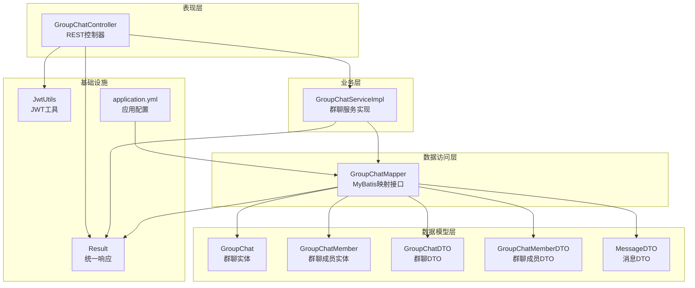
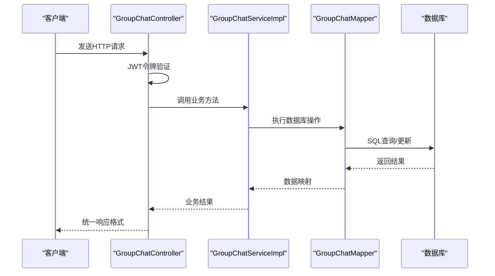
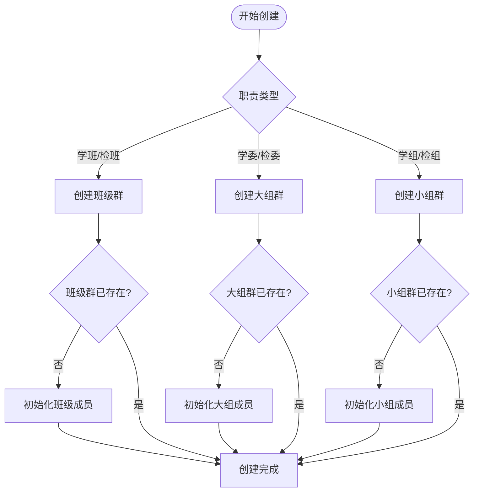
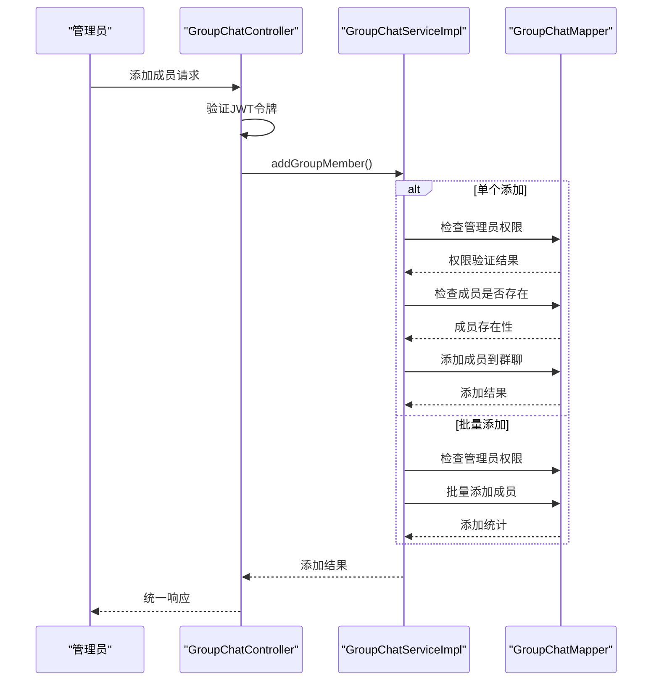
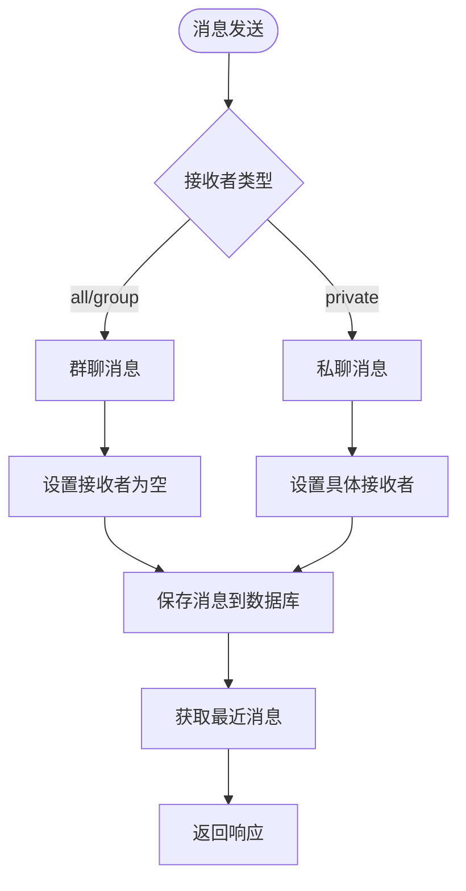
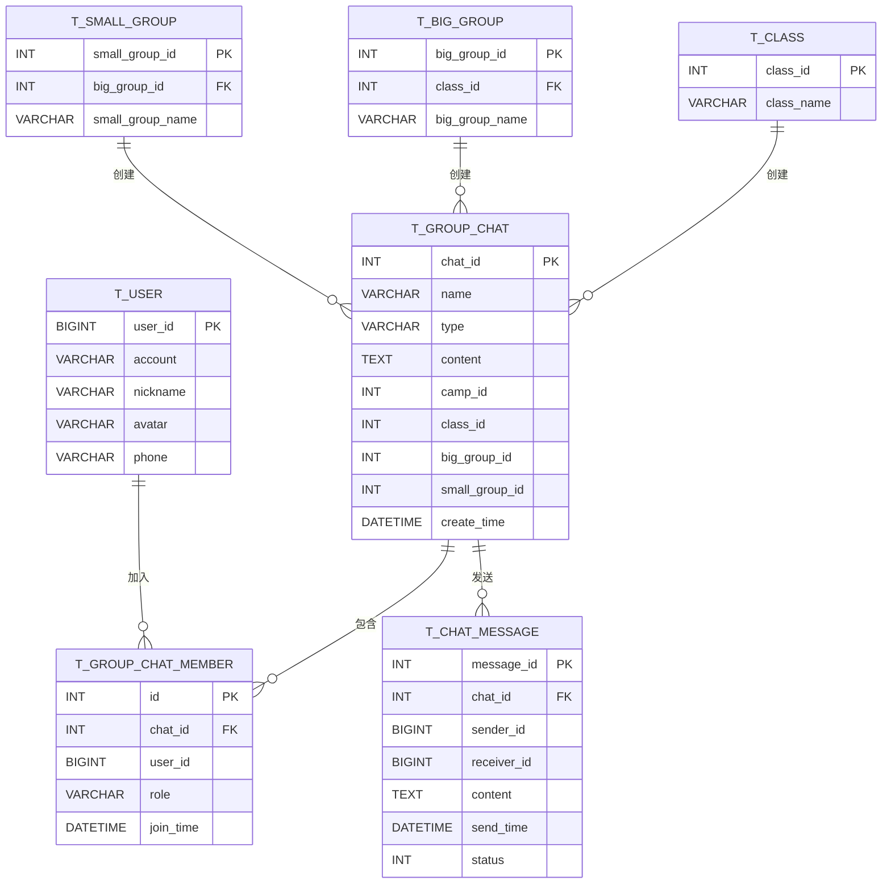
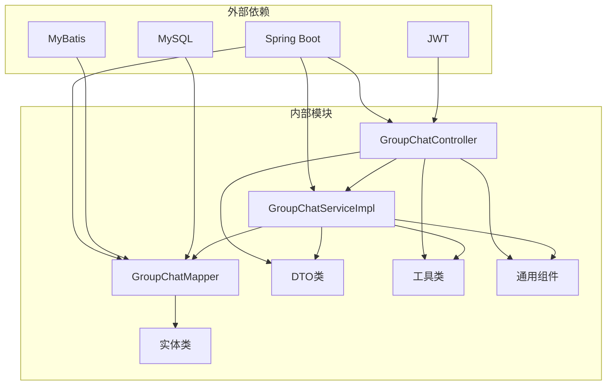

# 群聊系统

<cite>
**本文档引用的文件**
- [GroupChatController.java](file://src/main/java/com/daily/dailychineseculture/controller/GroupChatController.java)
- [GroupChatServiceImpl.java](file://src/main/java/com/daily/dailychineseculture/service/impl/GroupChatServiceImpl.java)
- [GroupChatMapper.java](file://src/main/java/com/daily/dailychineseculture/mapper/GroupChatMapper.java)
- [GroupChat.java](file://src/main/java/com/daily/dailychineseculture/entity/GroupChat.java)
- [GroupChatMember.java](file://src/main/java/com/daily/dailychineseculture/entity/GroupChatMember.java)
- [GroupChatDTO.java](file://src/main/java/com/daily/dailychineseculture/dto/GroupChatDTO.java)
- [GroupChatMemberDTO.java](file://src/main/java/com/daily/dailychineseculture/dto/GroupChatMemberDTO.java)
- [MessageDTO.java](file://src/main/java/com/daily/dailychineseculture/dto/MessageDTO.java)
- [Result.java](file://src/main/java/com/daily/dailychineseculture/common/Result.java)
- [JwtUtils.java](file://src/main/java/com/daily/dailychineseculture/util/JwtUtils.java)
- [application.yml](file://src/main/resources/application.yml)
- [README.md](file://README.md)
</cite>

## 目录
1. [简介](#简介)
2. [项目结构](#项目结构)
3. [核心组件](#核心组件)
4. [架构总览](#架构总览)
5. [详细组件分析](#详细组件分析)
6. [依赖关系分析](#依赖关系分析)
7. [性能考虑](#性能考虑)
8. [故障排除指南](#故障排除指南)
9. [结论](#结论)

## 简介
本群聊系统是基于Spring Boot的在线中文学习管理平台中的一个核心模块，提供班级群、大组群、小组群的创建与管理，支持群成员管理、消息发送与已读标记、按职责范围查询群聊等功能。系统采用JWT进行用户认证，通过统一响应包装类返回标准化结果，并使用MyBatis进行数据库访问。

## 项目结构
群聊系统在项目中的组织结构如下：
- 控制器层：GroupChatController 提供RESTful API接口
- 服务层：GroupChatServiceImpl 实现业务逻辑
- 数据访问层：GroupChatMapper 使用MyBatis进行数据库操作
- 实体层：GroupChat、GroupChatMember 等实体类
- DTO层：GroupChatDTO、GroupChatMemberDTO、MessageDTO 数据传输对象
- 工具类：JwtUtils JWT工具类
- 配置：application.yml MyBatis配置

**图表来源**
- [GroupChatController.java:17-222](file://src/main/java/com/daily/dailychineseculture/controller/GroupChatController.java#L17-L222)
- [GroupChatServiceImpl.java:23-609](file://src/main/java/com/daily/dailychineseculture/service/impl/GroupChatServiceImpl.java#L23-L609)
- [GroupChatMapper.java:12-197](file://src/main/java/com/daily/dailychineseculture/mapper/GroupChatMapper.java#L12-L197)

**章节来源**
- [README.md:43-150](file://README.md#L43-L150)
- [application.yml:1-33](file://src/main/resources/application.yml#L1-L33)

## 核心组件
群聊系统的核心组件包括：

### 控制器层
- **GroupChatController**：提供完整的群聊管理API接口
  - 群聊创建：班级群、大组群、小组群
  - 成员管理：添加、批量添加、移除、角色更新
  - 消息管理：发送、已读标记、消息查询
  - 群聊查询：按职责范围查询、群信息查询
  - 群聊维护：信息更新、删除

### 服务层
- **GroupChatServiceImpl**：实现具体的业务逻辑
  - 权限验证和校验
  - 自动创建群聊（根据职责范围）
  - 成员可用性查询
  - 批量成员管理

### 数据访问层
- **GroupChatMapper**：定义数据库操作接口
  - 群聊CRUD操作
  - 成员管理操作
  - 消息管理操作
  - 范围查询（按职责类型）

### 数据模型
- **GroupChat**：群聊基本信息
- **GroupChatMember**：群聊成员信息
- **DTO类**：用于API数据传输

**章节来源**
- [GroupChatController.java:27-222](file://src/main/java/com/daily/dailychineseculture/controller/GroupChatController.java#L27-L222)
- [GroupChatServiceImpl.java:198-609](file://src/main/java/com/daily/dailychineseculture/service/impl/GroupChatServiceImpl.java#L198-L609)
- [GroupChatMapper.java:15-197](file://src/main/java/com/daily/dailychineseculture/mapper/GroupChatMapper.java#L15-L197)

## 架构总览
系统采用经典的三层架构模式，实现了清晰的职责分离：

**图表来源**
- [GroupChatController.java:27-222](file://src/main/java/com/daily/dailychineseculture/controller/GroupChatController.java#L27-L222)
- [GroupChatServiceImpl.java:532-555](file://src/main/java/com/daily/dailychineseculture/service/impl/GroupChatServiceImpl.java#L532-L555)
- [GroupChatMapper.java:62-87](file://src/main/java/com/daily/dailychineseculture/mapper/GroupChatMapper.java#L62-L87)

## 详细组件分析

### 群聊创建流程
系统支持三种类型的群聊自动创建：

**图表来源**
- [GroupChatServiceImpl.java:426-485](file://src/main/java/com/daily/dailychineseculture/service/impl/GroupChatServiceImpl.java#L426-L485)
- [GroupChatServiceImpl.java:198-404](file://src/main/java/com/daily/dailychineseculture/service/impl/GroupChatServiceImpl.java#L198-L404)

### 成员管理流程
成员管理支持单个添加、批量添加和权限控制：

**图表来源**
- [GroupChatController.java:56-120](file://src/main/java/com/daily/dailychineseculture/controller/GroupChatController.java#L56-L120)
- [GroupChatServiceImpl.java:504-530](file://src/main/java/com/daily/dailychineseculture/service/impl/GroupChatServiceImpl.java#L504-L530)
- [GroupChatServiceImpl.java:165-195](file://src/main/java/com/daily/dailychineseculture/service/impl/GroupChatServiceImpl.java#L165-L195)

### 消息发送流程
消息系统支持群聊消息和私聊消息两种模式：

**图表来源**
- [GroupChatServiceImpl.java:532-538](file://src/main/java/com/daily/dailychineseculture/service/impl/GroupChatServiceImpl.java#L532-L538)
- [GroupChatMapper.java:62-87](file://src/main/java/com/daily/dailychineseculture/mapper/GroupChatMapper.java#L62-L87)

### 数据模型关系
群聊系统的核心数据模型及其关系：

**图表来源**
- [GroupChat.java:8-91](file://src/main/java/com/daily/dailychineseculture/entity/GroupChat.java#L8-L91)
- [GroupChatMember.java:8-55](file://src/main/java/com/daily/dailychineseculture/entity/GroupChatMember.java#L8-L55)
- [GroupChatMapper.java:15-197](file://src/main/java/com/daily/dailychineseculture/mapper/GroupChatMapper.java#L15-L197)

**章节来源**
- [GroupChat.java:8-91](file://src/main/java/com/daily/dailychineseculture/entity/GroupChat.java#L8-L91)
- [GroupChatMember.java:8-55](file://src/main/java/com/daily/dailychineseculture/entity/GroupChatMember.java#L8-L55)
- [GroupChatDTO.java:8-100](file://src/main/java/com/daily/dailychineseculture/dto/GroupChatDTO.java#L8-L100)
- [GroupChatMemberDTO.java:8-73](file://src/main/java/com/daily/dailychineseculture/dto/GroupChatMemberDTO.java#L8-L73)
- [MessageDTO.java:8-73](file://src/main/java/com/daily/dailychineseculture/dto/MessageDTO.java#L8-L73)

## 依赖关系分析
系统各组件之间的依赖关系如下：

**图表来源**
- [GroupChatController.java:1-222](file://src/main/java/com/daily/dailychineseculture/controller/GroupChatController.java#L1-L222)
- [GroupChatServiceImpl.java:1-609](file://src/main/java/com/daily/dailychineseculture/service/impl/GroupChatServiceImpl.java#L1-L609)
- [GroupChatMapper.java:1-197](file://src/main/java/com/daily/dailychineseculture/mapper/GroupChatMapper.java#L1-L197)
- [application.yml:17-22](file://src/main/resources/application.yml#L17-L22)

**章节来源**
- [application.yml:1-33](file://src/main/resources/application.yml#L1-L33)

## 性能考虑
群聊系统在设计时考虑了以下性能优化：

### 数据库优化
- **索引策略**：群聊表、成员表、消息表建立适当的索引
- **查询优化**：使用范围查询限制用户可见的群聊范围
- **批量操作**：支持批量添加群成员操作

### 缓存策略
- **JWT缓存**：减少重复的令牌验证开销
- **查询结果缓存**：对常用查询结果进行缓存

### 异步处理
- **消息异步发送**：消息发送后立即返回响应
- **批量操作异步化**：大批量成员添加采用异步处理

## 故障排除指南
常见问题及解决方案：

### 认证相关问题
- **JWT令牌无效**：检查令牌格式和有效期
- **权限不足**：确认用户是否具有管理员权限

### 数据库连接问题
- **连接超时**：检查数据库连接配置
- **SQL执行错误**：查看具体的SQL语句和参数

### 业务逻辑问题
- **群聊不存在**：确认群聊ID是否正确
- **成员已存在**：检查成员是否已经在群中

**章节来源**
- [GroupChatController.java:27-222](file://src/main/java/com/daily/dailychineseculture/controller/GroupChatController.java#L27-L222)
- [GroupChatServiceImpl.java:38-162](file://src/main/java/com/daily/dailychineseculture/service/impl/GroupChatServiceImpl.java#L38-L162)
- [Result.java:46-81](file://src/main/java/com/daily/dailychineseculture/common/Result.java#L46-L81)

## 结论
群聊系统作为每日中文学习管理平台的重要组成部分，提供了完整的群聊管理功能。系统采用清晰的分层架构设计，实现了良好的可扩展性和可维护性。通过JWT认证机制确保了系统的安全性，通过统一的响应格式提供了良好的用户体验。

系统的主要优势包括：
- 完整的群聊生命周期管理
- 灵活的职责范围控制
- 高效的批量操作支持
- 标准化的API接口设计
- 良好的错误处理机制

未来可以考虑的功能增强包括：
- 消息历史的分页加载优化
- 群聊成员的实时状态更新
- 消息的多媒体内容支持
- 群聊的搜索和过滤功能