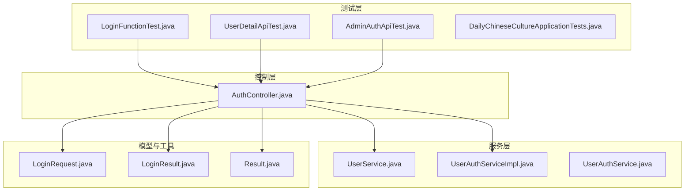
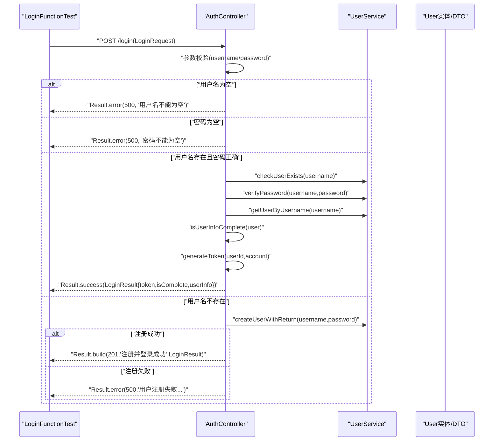
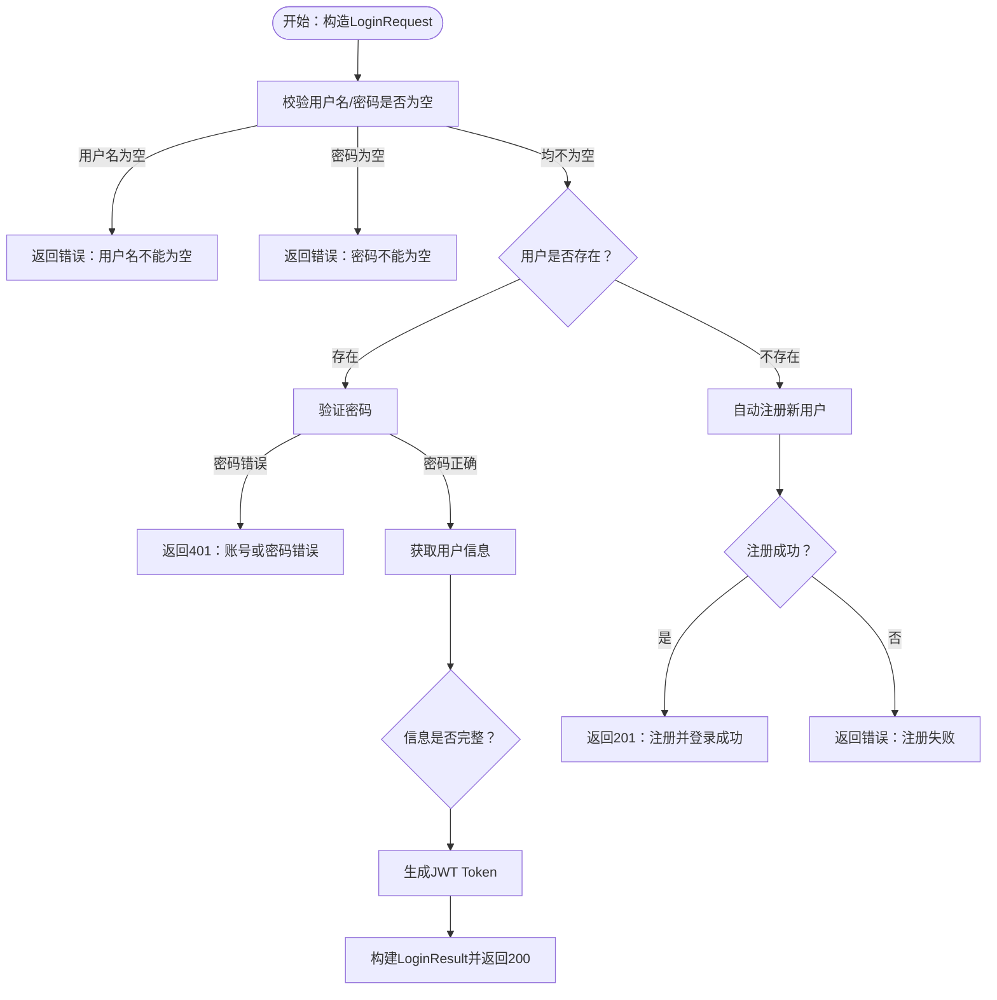
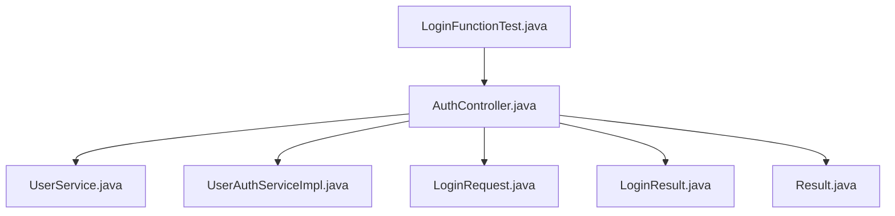

# 单元测试

<cite>
**本文引用的文件**
- [LoginFunctionTest.java](file://src/test/java/com/daily/dailychineseculture/LoginFunctionTest.java)
- [DailyChineseCultureApplicationTests.java](file://src/test/java/com/daily/dailychineseculture/DailyChineseCultureApplicationTests.java)
- [AuthController.java](file://src/main/java/com/daily/dailychineseculture/controller/AuthController.java)
- [UserService.java](file://src/main/java/com/daily/dailychineseculture/service/UserService.java)
- [UserAuthServiceImpl.java](file://src/main/java/com/daily/dailychineseculture/service/impl/UserAuthServiceImpl.java)
- [UserAuthService.java](file://src/main/java/com/daily/dailychineseculture/service/UserAuthService.java)
- [LoginRequest.java](file://src/main/java/com/daily/dailychineseculture/dto/LoginRequest.java)
- [LoginResult.java](file://src/main/java/com/daily/dailychineseculture/dto/LoginResult.java)
- [Result.java](file://src/main/java/com/daily/dailychineseculture/common/Result.java)
- [UserDetailApiTest.java](file://src/test/java/com/daily/dailychineseculture/UserDetailApiTest.java)
- [AdminAuthApiTest.java](file://src/test/java/com/daily/dailychineseculture/AdminAuthApiTest.java)
- [pom.xml](file://pom.xml)
</cite>

## 目录
1. [简介](#简介)
2. [项目结构](#项目结构)
3. [核心组件](#核心组件)
4. [架构总览](#架构总览)
5. [详细组件分析](#详细组件分析)
6. [依赖分析](#依赖分析)
7. [性能考虑](#性能考虑)
8. [故障排查指南](#故障排查指南)
9. [结论](#结论)
10. [附录](#附录)

## 简介
本文件聚焦于Spring Boot项目中基于JUnit 5的单元测试实现，围绕LoginFunctionTest展开，系统阐述测试类组织结构、测试方法命名规范与断言使用方式；深入分析登录场景测试用例设计，覆盖成功登录、新用户自动注册、空用户名与空密码等边界条件；解释测试数据准备、Mock对象使用与依赖注入在测试中的应用；最后给出单元测试最佳实践、测试覆盖率与测试报告生成建议。

## 项目结构
本项目采用典型的Spring Boot分层结构，测试代码位于src/test目录，生产代码位于src/main目录。测试文件与生产代码一一对应，便于定位与维护。

图表来源
- [LoginFunctionTest.java:1-108](file://src/test/java/com/daily/dailychineseculture/LoginFunctionTest.java#L1-L108)
- [AuthController.java:1-516](file://src/main/java/com/daily/dailychineseculture/controller/AuthController.java#L1-L516)
- [UserService.java:1-959](file://src/main/java/com/daily/dailychineseculture/service/UserService.java#L1-L959)
- [UserAuthServiceImpl.java:1-168](file://src/main/java/com/daily/dailychineseculture/service/impl/UserAuthServiceImpl.java#L1-L168)
- [LoginRequest.java:1-19](file://src/main/java/com/daily/dailychineseculture/dto/LoginRequest.java#L1-L19)
- [LoginResult.java:1-27](file://src/main/java/com/daily/dailychineseculture/dto/LoginResult.java#L1-L27)
- [Result.java:1-81](file://src/main/java/com/daily/dailychineseculture/common/Result.java#L1-L81)

章节来源
- [LoginFunctionTest.java:1-108](file://src/test/java/com/daily/dailychineseculture/LoginFunctionTest.java#L1-L108)
- [AuthController.java:1-516](file://src/main/java/com/daily/dailychineseculture/controller/AuthController.java#L1-L516)

## 核心组件
- 测试类组织结构
  - LoginFunctionTest：面向AuthController的登录功能测试，使用@SpringBootTest加载Spring上下文，通过@Autowired注入控制器实例，直接调用REST接口进行集成测试。
  - UserDetailApiTest：面向用户资料详情与更新的测试，同样使用@SpringBootTest，结合JwtUtils生成Token，验证接口行为。
  - AdminAuthApiTest：面向后台管理登录与拦截器行为的测试，以注释形式描述期望行为。
  - DailyChineseCultureApplicationTests：最简上下文加载测试，验证Spring Boot应用上下文是否能成功启动。

- 测试方法命名规范
  - 采用英文语义化命名，如testAdminLoginSuccess、testNewUserAutoRegistration、testEmptyUsername、testEmptyPassword、testNewUserRegistration，清晰表达测试目标与场景。
  - 建议统一前缀test_，并在方法名中体现被测场景与预期结果，便于阅读与维护。

- 断言使用
  - 使用JUnit 5的Assertions静态方法，如assertNotNull、assertEquals、assertTrue、assertNull等，覆盖响应码、消息、数据完整性与字段值校验。
  - 对于登录结果，断言Result对象的code、msg、data及其子字段（token、userInfo、isComplete），确保返回结构符合预期。

章节来源
- [LoginFunctionTest.java:1-108](file://src/test/java/com/daily/dailychineseculture/LoginFunctionTest.java#L1-L108)
- [UserDetailApiTest.java:1-143](file://src/test/java/com/daily/dailychineseculture/UserDetailApiTest.java#L1-L143)
- [AdminAuthApiTest.java:1-58](file://src/test/java/com/daily/dailychineseculture/AdminAuthApiTest.java#L1-L58)
- [DailyChineseCultureApplicationTests.java:1-14](file://src/test/java/com/daily/dailychineseculture/DailyChineseCultureApplicationTests.java#L1-L14)

## 架构总览
登录流程涉及控制器、服务层与数据模型，测试通过直接调用控制器接口，绕过HTTP客户端，减少外部依赖，提升测试稳定性与速度。

图表来源
- [AuthController.java:63-112](file://src/main/java/com/daily/dailychineseculture/controller/AuthController.java#L63-L112)
- [UserService.java:78-134](file://src/main/java/com/daily/dailychineseculture/service/UserService.java#L78-L134)
- [UserService.java:205-249](file://src/main/java/com/daily/dailychineseculture/service/UserService.java#L205-L249)
- [Result.java:1-81](file://src/main/java/com/daily/dailychineseculture/common/Result.java#L1-L81)
- [LoginResult.java:1-27](file://src/main/java/com/daily/dailychineseculture/dto/LoginResult.java#L1-L27)

## 详细组件分析

### LoginFunctionTest：登录功能测试
- 测试目标
  - 验证管理员登录成功、新用户自动注册、空用户名、空密码等关键场景。
  - 确认返回结构（code、msg、data）与字段（token、userInfo、isComplete）符合预期。

- 测试用例设计
  - 成功登录：构造合法用户名与密码，断言code=200、msg包含“成功”、data非空且包含token与userInfo。
  - 新用户自动注册：构造唯一用户名与密码，断言code=200或201（根据实现）、msg包含“成功”、返回token。
  - 空用户名：断言code=500、msg为“用户名不能为空”、data为null。
  - 空密码：断言code=500、msg为“密码不能为空”、data为null。
  - 新用户注册（模拟）：验证逻辑流程，输出结果以便人工核验。

- 测试数据准备
  - 使用LoginRequest构造用户名与密码，新用户场景通过System.currentTimeMillis()确保唯一性。
  - 使用System.out.println输出关键信息，便于调试与结果核对。

- 依赖注入与调用
  - @SpringBootTest加载完整上下文，@Autowired注入AuthController。
  - 直接调用authController.login(request)，绕过HTTP客户端，提高测试效率。

- 断言策略
  - 对Result对象进行整体断言，再逐项断言data子字段，确保结构与数据一致性。

图表来源
- [AuthController.java:63-112](file://src/main/java/com/daily/dailychineseculture/controller/AuthController.java#L63-L112)
- [UserService.java:78-134](file://src/main/java/com/daily/dailychineseculture/service/UserService.java#L78-L134)
- [UserService.java:205-249](file://src/main/java/com/daily/dailychineseculture/service/UserService.java#L205-L249)

章节来源
- [LoginFunctionTest.java:1-108](file://src/test/java/com/daily/dailychineseculture/LoginFunctionTest.java#L1-L108)
- [AuthController.java:63-112](file://src/main/java/com/daily/dailychineseculture/controller/AuthController.java#L63-L112)
- [UserService.java:78-134](file://src/main/java/com/daily/dailychineseculture/service/UserService.java#L78-L134)
- [UserService.java:205-249](file://src/main/java/com/daily/dailychineseculture/service/UserService.java#L205-L249)

### UserDetailApiTest：用户资料与更新测试
- 测试目标
  - 验证获取用户资料详情与更新用户资料接口的行为，确保返回结构与安全要求（密码字段为空）得到满足。

- 测试要点
  - 使用JwtUtils生成Token，模拟真实用户访问。
  - 断言响应码、必填字段非空、密码字段为空等。

- 与登录测试的关系
  - 两者均使用@SpringBootTest加载上下文，验证控制器接口行为，形成前后端一致的测试模式。

章节来源
- [UserDetailApiTest.java:1-143](file://src/test/java/com/daily/dailychineseculture/UserDetailApiTest.java#L1-L143)
- [AuthController.java:215-286](file://src/main/java/com/daily/dailychineseculture/controller/AuthController.java#L215-L286)

### AdminAuthApiTest：后台管理登录与拦截器测试
- 测试目标
  - 以注释形式描述后台管理登录接口与Token拦截器的期望行为，便于后续实现与回归测试。

章节来源
- [AdminAuthApiTest.java:1-58](file://src/test/java/com/daily/dailychineseculture/AdminAuthApiTest.java#L1-L58)

## 依赖分析
- 测试框架与工具
  - JUnit 5：提供测试注解与断言能力。
  - Spring Boot Test：@SpringBootTest加载完整上下文，@Autowired注入Bean。
  - Maven依赖：spring-boot-starter-webmvc-test、mybatis-spring-boot-starter-test等。

- 关键依赖关系
  - LoginFunctionTest依赖AuthController，AuthController依赖UserService与UserAuthServiceImpl。
  - AuthController依赖Result、LoginRequest、LoginResult等DTO与工具类。

图表来源
- [LoginFunctionTest.java:1-108](file://src/test/java/com/daily/dailychineseculture/LoginFunctionTest.java#L1-L108)
- [AuthController.java:1-516](file://src/main/java/com/daily/dailychineseculture/controller/AuthController.java#L1-L516)
- [UserService.java:1-959](file://src/main/java/com/daily/dailychineseculture/service/UserService.java#L1-L959)
- [UserAuthServiceImpl.java:1-168](file://src/main/java/com/daily/dailychineseculture/service/impl/UserAuthServiceImpl.java#L1-L168)
- [LoginRequest.java:1-19](file://src/main/java/com/daily/dailychineseculture/dto/LoginRequest.java#L1-L19)
- [LoginResult.java:1-27](file://src/main/java/com/daily/dailychineseculture/dto/LoginResult.java#L1-L27)
- [Result.java:1-81](file://src/main/java/com/daily/dailychineseculture/common/Result.java#L1-L81)

章节来源
- [pom.xml:61-69](file://pom.xml#L61-L69)

## 性能考虑
- 测试隔离与速度
  - LoginFunctionTest通过@SpringBootTest加载完整上下文，适合集成测试；若追求更快反馈，可在服务层引入Mock对象，减少数据库与外部依赖。
  - 对于高频测试，建议拆分单元测试与集成测试，单元测试使用Mock，集成测试使用@SpringBootTest。

- 资源与数据库
  - 新用户注册场景依赖数据库连接，若数据库不可用，测试会失败。建议在测试环境中配置独立的测试数据库或使用内存数据库（如H2）。

- 日志与输出
  - 测试中使用System.out.println输出结果，便于调试；在CI/CD中建议减少冗余输出，保留关键信息。

## 故障排查指南
- 常见问题
  - 数据库连接失败：检查application.yml中的数据库配置，确认测试数据库可用。
  - Token解析异常：确认JwtUtils生成与解析逻辑正确，Token格式符合Bearer规范。
  - 用户不存在或密码错误：检查UserService中checkUserExists与verifyPassword实现。

- 排查步骤
  - 逐步缩小范围：先验证AuthController接口是否可达，再检查UserService实现。
  - 输出关键信息：利用System.out.println输出请求参数、响应码与消息，辅助定位问题。
  - 异常捕获：AuthController对异常进行统一捕获并返回Result.error，便于测试断言。

章节来源
- [AuthController.java:108-112](file://src/main/java/com/daily/dailychineseculture/controller/AuthController.java#L108-L112)
- [UserService.java:78-134](file://src/main/java/com/daily/dailychineseculture/service/UserService.java#L78-L134)

## 结论
LoginFunctionTest展示了基于JUnit 5与Spring Boot Test的典型单元/集成测试实践：通过@SpringBootTest加载上下文，使用@Autowired注入控制器，直接调用REST接口进行断言验证。测试覆盖了成功登录、新用户自动注册与边界条件，具备良好的可读性与可维护性。建议在后续迭代中引入Mock对象与更细粒度的单元测试，以提升测试速度与覆盖率，并配合持续集成与测试报告生成，保障代码质量。

## 附录

### 单元测试最佳实践
- 测试隔离
  - 使用Mock对象替代外部依赖（如数据库、第三方服务），确保测试稳定。
  - 对于AuthController，可MockUserService与UserAuthServiceImpl，专注于控制器逻辑验证。

- 测试可读性
  - 使用语义化命名与清晰的断言描述，如“断言返回code=200且包含特定消息”。
  - 将测试数据准备与断言分离，提高可读性与复用性。

- 测试维护性
  - 将公共的测试工具（如Token生成、DTO构造）抽取为工具类，减少重复代码。
  - 对关键流程绘制序列图与流程图，便于理解与维护。

- 测试覆盖率与报告
  - 使用JaCoCo或SonarQube生成覆盖率报告，设定阈值（如方法覆盖率≥80%，分支覆盖率≥70%）。
  - 在CI/CD中集成测试与覆盖率检查，确保每次提交均通过测试。

### 测试覆盖率与报告生成方法
- Maven插件
  - 使用jacoco-maven-plugin或sonarqube-scanner-maven-plugin，在构建阶段生成覆盖率报告。
  - 在pom.xml中配置插件与报告目标，结合CI工具（如GitHub Actions、Jenkins）自动化执行。

- 报告内容
  - 包含类覆盖率、方法覆盖率、分支覆盖率与行覆盖率，定位未覆盖的关键路径与边界条件。

章节来源
- [pom.xml:119-146](file://pom.xml#L119-L146)