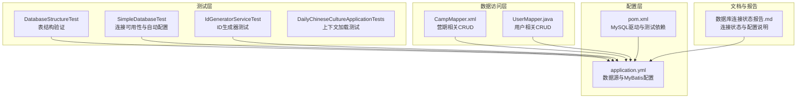
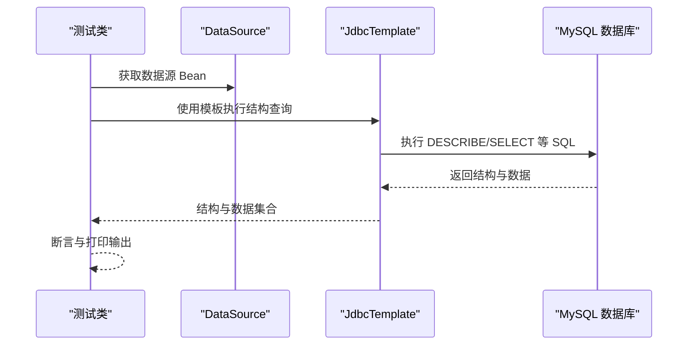
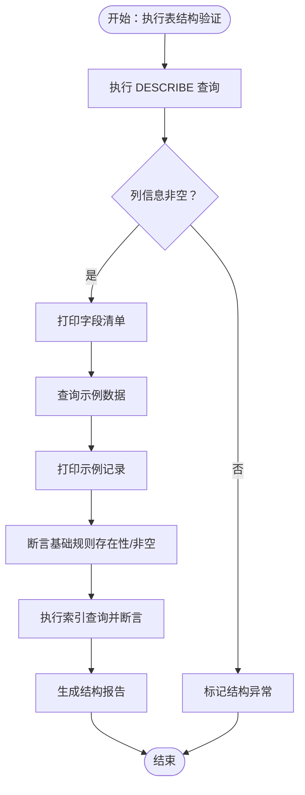
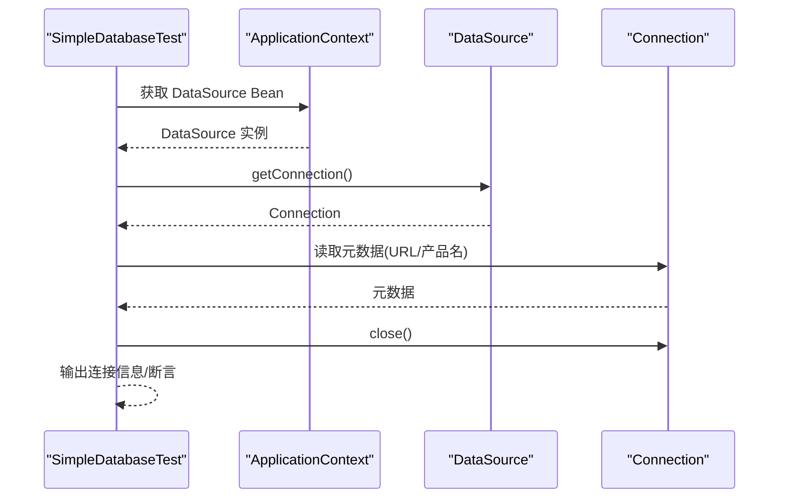
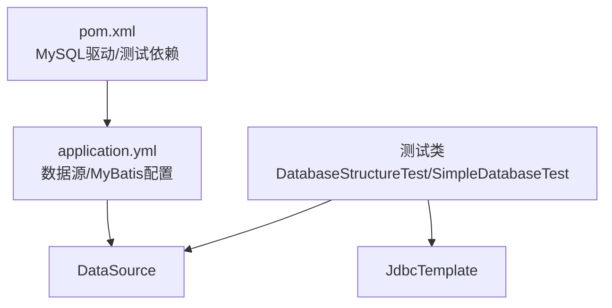

# 数据库测试

<cite>
**本文引用的文件**
- [DatabaseStructureTest.java](file://src/test/java/com/daily/dailychineseculture/DatabaseStructureTest.java)
- [SimpleDatabaseTest.java](file://src/test/java/com/daily/dailychineseculture/SimpleDatabaseTest.java)
- [application.yml](file://src/main/resources/application.yml)
- [pom.xml](file://pom.xml)
- [数据库连接状态报告.md](file://doc/数据库连接状态报告.md)
- [CampMapper.xml](file://src/main/resources/mapper/CampMapper.xml)
- [UserMapper.java](file://src/main/java/com/daily/dailychineseculture/mapper/UserMapper.java)
- [IdGeneratorServiceTest.java](file://src/test/java/com/daily/dailychineseculture/IdGeneratorServiceTest.java)
- [DailyChineseCultureApplicationTests.java](file://src/test/java/com/daily/dailychineseculture/DailyChineseCultureApplicationTests.java)
</cite>

## 目录
1. [简介](#简介)
2. [项目结构](#项目结构)
3. [核心组件](#核心组件)
4. [架构概览](#架构概览)
5. [详细组件分析](#详细组件分析)
6. [依赖分析](#依赖分析)
7. [性能考虑](#性能考虑)
8. [故障排除指南](#故障排除指南)
9. [结论](#结论)
10. [附录](#附录)

## 简介
本文件面向数据库测试的专业实践，围绕项目中的数据库测试能力展开，重点覆盖以下方面：
- 数据库结构验证：基于 DatabaseStructureTest 对表结构、字段类型、索引完整性进行验证的方法与用例设计思路。
- 基础数据操作测试：基于 SimpleDatabaseTest 的连接可用性与自动配置验证，并结合业务 Mapper 的 CRUD 场景设计测试方法。
- 连接状态监控与性能测试：结合应用配置与测试报告，给出连接监控与性能优化建议。
- 数据一致性与并发控制：结合业务场景（如报名计数、用户记录等）提出一致性与并发访问测试要点。
- 回滚机制：结合 Spring 测试框架与事务特性，说明如何在测试中实现回滚。
- 数据库迁移、备份恢复与完整性验证：给出可落地的测试策略与方法。

## 项目结构
该项目采用 Spring Boot + MyBatis 架构，数据库测试主要集中在测试包中，配合应用配置与 MyBatis 映射文件共同构成完整的数据层测试体系。

**图表来源**
- [DatabaseStructureTest.java:1-43](file://src/test/java/com/daily/dailychineseculture/DatabaseStructureTest.java#L1-L43)
- [SimpleDatabaseTest.java:1-43](file://src/test/java/com/daily/dailychineseculture/SimpleDatabaseTest.java#L1-L43)
- [application.yml:1-33](file://src/main/resources/application.yml#L1-L33)
- [pom.xml:1-149](file://pom.xml#L1-L149)
- [CampMapper.xml:1-171](file://src/main/resources/mapper/CampMapper.xml#L1-L171)
- [UserMapper.java:1-252](file://src/main/java/com/daily/dailychineseculture/mapper/UserMapper.java#L1-L252)
- [数据库连接状态报告.md:1-89](file://doc/数据库连接状态报告.md#L1-L89)

**章节来源**
- [DatabaseStructureTest.java:1-43](file://src/test/java/com/daily/dailychineseculture/DatabaseStructureTest.java#L1-L43)
- [SimpleDatabaseTest.java:1-43](file://src/test/java/com/daily/dailychineseculture/SimpleDatabaseTest.java#L1-L43)
- [application.yml:1-33](file://src/main/resources/application.yml#L1-L33)
- [pom.xml:1-149](file://pom.xml#L1-L149)
- [数据库连接状态报告.md:1-89](file://doc/数据库连接状态报告.md#L1-L89)

## 核心组件
- DatabaseStructureTest：以 JdbcTemplate 执行 DESCRIBE 等 SQL，输出表结构与示例数据，用于结构验证与回归检查。
- SimpleDatabaseTest：验证 Spring Boot 自动配置的 DataSource 可用性与连接元数据，确保数据库连通性。
- 应用配置 application.yml：定义数据源 URL、用户名、密码、驱动类名以及 MyBatis 的驼峰映射与 Mapper XML 位置。
- MyBatis 映射文件：CampMapper.xml 与 UserMapper.java 提供典型的 CRUD 场景，是设计数据库测试的基础。
- 测试依赖与驱动：pom.xml 中包含 MySQL Connector/J 与 MyBatis 测试启动器，支撑数据库测试。

**章节来源**
- [DatabaseStructureTest.java:1-43](file://src/test/java/com/daily/dailychineseculture/DatabaseStructureTest.java#L1-L43)
- [SimpleDatabaseTest.java:1-43](file://src/test/java/com/daily/dailychineseculture/SimpleDatabaseTest.java#L1-L43)
- [application.yml:1-33](file://src/main/resources/application.yml#L1-L33)
- [pom.xml:1-149](file://pom.xml#L1-L149)

## 架构概览
数据库测试贯穿“配置—连接—访问—验证”的闭环，测试层通过 Spring 上下文注入数据源与模板，访问层通过 MyBatis 映射文件执行 SQL，最终在测试中对结构、连通性与业务语义进行验证。

**图表来源**
- [SimpleDatabaseTest.java:1-43](file://src/test/java/com/daily/dailychineseculture/SimpleDatabaseTest.java#L1-L43)
- [DatabaseStructureTest.java:1-43](file://src/test/java/com/daily/dailychineseculture/DatabaseStructureTest.java#L1-L43)

## 详细组件分析

### DatabaseStructureTest：表结构验证测试
- 目标与范围
  - 验证目标表结构（示例：t_camp）是否存在、字段类型与约束是否符合预期。
  - 输出字段清单与示例数据，便于回归对比。
- 关键实现点
  - 使用 JdbcTemplate 执行 DESCRIBE 等结构查询，遍历列信息并打印。
  - 查询少量示例数据，辅助确认数据形态。
- 测试用例设计建议
  - 表存在性检查：通过查询系统表或执行 DESCRIBE，断言非空。
  - 字段类型验证：针对关键字段（如主键、时间戳、枚举相关）断言类型与长度。
  - 约束与默认值：断言非空、默认值、自增等约束。
  - 索引完整性：执行 SHOW INDEX FROM t_camp，断言索引数量与类型（唯一/普通）。
  - 回归基线：将结构与示例数据输出写入测试报告或快照，形成基线。
- 与业务映射
  - t_camp 表结构与业务密切相关，可结合 CampMapper.xml 的字段映射进行交叉验证。

**图表来源**
- [DatabaseStructureTest.java:1-43](file://src/test/java/com/daily/dailychineseculture/DatabaseStructureTest.java#L1-L43)

**章节来源**
- [DatabaseStructureTest.java:1-43](file://src/test/java/com/daily/dailychineseculture/DatabaseStructureTest.java#L1-L43)
- [CampMapper.xml:1-171](file://src/main/resources/mapper/CampMapper.xml#L1-L171)

### SimpleDatabaseTest：基础数据操作与连接测试
- 目标与范围
  - 验证 Spring Boot 自动配置的 DataSource 是否可用。
  - 验证数据库连接可用性与基本元数据（URL、数据库产品名）。
- 关键实现点
  - 通过 ApplicationContext 获取 DataSource 并断言非空。
  - 获取 Connection 并读取元数据，随后关闭连接。
  - 异常处理：捕获异常并输出错误信息，避免因网络波动导致测试失败。
- 测试用例设计建议
  - 连接可用性：断言连接成功与元数据正确。
  - 连接池与驱动：结合 application.yml 与文档，验证 HikariCP 与 MySQL Connector/J。
  - 健康检查：扩展为周期性连接健康检查（集成监控）。
- 与配置的关系
  - application.yml 中的数据库 URL、用户名、密码与驱动类名直接影响测试结果。

**图表来源**
- [SimpleDatabaseTest.java:1-43](file://src/test/java/com/daily/dailychineseculture/SimpleDatabaseTest.java#L1-L43)

**章节来源**
- [SimpleDatabaseTest.java:1-43](file://src/test/java/com/daily/dailychineseculture/SimpleDatabaseTest.java#L1-L43)
- [application.yml:1-33](file://src/main/resources/application.yml#L1-L33)
- [数据库连接状态报告.md:1-89](file://doc/数据库连接状态报告.md#L1-L89)

### 基于 Mapper 的 CRUD 验证与事务测试
- 设计思路
  - 以现有 Mapper 为依据，设计插入、查询、更新、删除的最小化测试用例。
  - 在测试方法上使用事务注解或在测试中手动回滚，确保测试隔离与幂等。
  - 针对关键业务字段（如 t_camp 的 enroll_count、t_user 的唯一约束）设计边界与并发测试。
- 示例场景
  - 插入用户：构造 User 对象，调用 UserMapper.insert，断言受影响行数与查询结果。
  - 更新用户：调用 UserMapper.update，断言更新前后字段变化。
  - 删除用户：调用 UserMapper.deleteById，断言不存在。
  - 营期计数：调用 CampMapper.incrementEnrollCount，断言 enroll_count 增长。
- 事务与回滚
  - 在测试类或方法上添加事务注解，测试结束后回滚，避免污染数据库。
  - 或在测试中显式开启/回滚事务，确保每个用例独立。

**章节来源**
- [UserMapper.java:1-252](file://src/main/java/com/daily/dailychineseculture/mapper/UserMapper.java#L1-L252)
- [CampMapper.xml:1-171](file://src/main/resources/mapper/CampMapper.xml#L1-L171)

### 数据一致性保证与并发访问测试
- 一致性要点
  - 唯一约束：基于 UserMapper 的唯一查询与插入，验证唯一性约束生效。
  - 业务一致性：如 t_camp.enroll_count 的增长需与报名流程一致，避免超卖。
- 并发测试建议
  - 多线程并发插入/更新：模拟高并发场景，观察唯一约束与计数一致性。
  - 乐观锁/悲观锁：在需要时引入版本号或行级锁，保障并发安全。
  - 隔离级别：在测试中调整事务隔离级别，验证脏读、不可重复读、幻读等问题。

**章节来源**
- [UserMapper.java:1-252](file://src/main/java/com/daily/dailychineseculture/mapper/UserMapper.java#L1-L252)
- [CampMapper.xml:1-171](file://src/main/resources/mapper/CampMapper.xml#L1-L171)

### 回滚机制与测试隔离
- Spring 测试中的回滚
  - 在测试类或方法上使用事务注解，测试完成后自动回滚，确保数据库状态不变。
- 手动事务控制
  - 在测试中显式开启/回滚事务，适用于复杂场景或多步操作的原子性验证。

**章节来源**
- [DailyChineseCultureApplicationTests.java:1-14](file://src/test/java/com/daily/dailychineseculture/DailyChineseCultureApplicationTests.java#L1-L14)

### 数据库迁移、备份恢复与完整性验证
- 迁移测试
  - 在测试环境中执行迁移脚本，验证表结构变更后 DatabaseStructureTest 的断言通过。
  - 验证数据迁移后的业务查询与更新仍可正常工作。
- 备份恢复测试
  - 执行备份与恢复流程，验证恢复后数据完整性与一致性。
  - 对比恢复前后关键表的数据量与关键字段值。
- 完整性验证
  - 外键约束：对涉及外键的表执行关联查询，验证引用完整性。
  - 约束与索引：通过 DESCRIBE 与 SHOW INDEX FROM 验证约束与索引存在性。
  - 业务完整性：结合业务 Mapper 的查询条件，验证数据过滤与聚合逻辑正确。

**章节来源**
- [DatabaseStructureTest.java:1-43](file://src/test/java/com/daily/dailychineseculture/DatabaseStructureTest.java#L1-L43)
- [application.yml:1-33](file://src/main/resources/application.yml#L1-L33)

## 依赖分析
- 数据源与驱动
  - application.yml 中配置了 MySQL 数据源与驱动类名；pom.xml 中声明了 MySQL Connector/J。
- MyBatis 配置
  - application.yml 启用了驼峰映射与 Mapper XML 位置，简化实体与数据库字段的映射。
- 测试依赖
  - pom.xml 中包含 MyBatis 测试启动器与 Spring Boot 测试 Starter，支持数据库测试。

**图表来源**
- [application.yml:1-33](file://src/main/resources/application.yml#L1-L33)
- [pom.xml:1-149](file://pom.xml#L1-L149)
- [SimpleDatabaseTest.java:1-43](file://src/test/java/com/daily/dailychineseculture/SimpleDatabaseTest.java#L1-L43)
- [DatabaseStructureTest.java:1-43](file://src/test/java/com/daily/dailychineseculture/DatabaseStructureTest.java#L1-L43)

**章节来源**
- [application.yml:1-33](file://src/main/resources/application.yml#L1-L33)
- [pom.xml:1-149](file://pom.xml#L1-L149)

## 性能考虑
- 连接池与超时
  - 结合文档建议，配置连接池大小、连接超时与健康检查，提升稳定性与性能。
- SQL 优化
  - 对高频查询（如用户查询、营期列表）建立必要索引，避免全表扫描。
- 监控与日志
  - 配置慢 SQL 日志与连接池告警阈值，及时发现性能瓶颈。

**章节来源**
- [数据库连接状态报告.md:1-89](file://doc/数据库连接状态报告.md#L1-L89)

## 故障排除指南
- 连接失败
  - 检查 application.yml 中的数据库 URL、用户名、密码与驱动类名。
  - 使用 SimpleDatabaseTest 的连接可用性测试快速定位问题。
- 结构不一致
  - 使用 DatabaseStructureTest 输出结构与示例数据，对比基线，定位差异。
- 唯一约束冲突
  - 在并发测试中观察唯一约束触发情况，必要时引入重试或去重策略。
- 事务未回滚
  - 确认测试类或方法上的事务注解配置正确，或在测试中显式回滚。

**章节来源**
- [SimpleDatabaseTest.java:1-43](file://src/test/java/com/daily/dailychineseculture/SimpleDatabaseTest.java#L1-L43)
- [DatabaseStructureTest.java:1-43](file://src/test/java/com/daily/dailychineseculture/DatabaseStructureTest.java#L1-L43)
- [application.yml:1-33](file://src/main/resources/application.yml#L1-L33)

## 结论
本项目已具备基础的数据库连接与结构验证能力，建议在此基础上进一步完善：
- 补充结构验证的断言用例，覆盖字段类型、约束与索引。
- 基于现有 Mapper 设计 CRUD 与并发测试，强化数据一致性与事务回滚。
- 建立迁移、备份恢复与完整性验证的自动化测试流程。
- 结合配置与报告文档，持续优化连接池与性能指标。

## 附录
- 相关文件与路径
  - 测试类：DatabaseStructureTest、SimpleDatabaseTest、IdGeneratorServiceTest、DailyChineseCultureApplicationTests
  - 配置文件：application.yml、pom.xml
  - Mapper 文件：CampMapper.xml、UserMapper.java
  - 报告文档：数据库连接状态报告.md

**章节来源**
- [IdGeneratorServiceTest.java:1-42](file://src/test/java/com/daily/dailychineseculture/IdGeneratorServiceTest.java#L1-L42)
- [DailyChineseCultureApplicationTests.java:1-14](file://src/test/java/com/daily/dailychineseculture/DailyChineseCultureApplicationTests.java#L1-L14)
- [application.yml:1-33](file://src/main/resources/application.yml#L1-L33)
- [pom.xml:1-149](file://pom.xml#L1-L149)
- [CampMapper.xml:1-171](file://src/main/resources/mapper/CampMapper.xml#L1-L171)
- [UserMapper.java:1-252](file://src/main/java/com/daily/dailychineseculture/mapper/UserMapper.java#L1-L252)
- [数据库连接状态报告.md:1-89](file://doc/数据库连接状态报告.md#L1-L89)